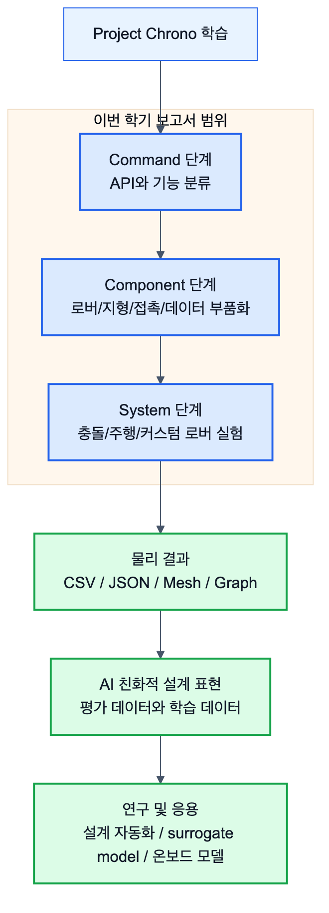

## 1.1.1 Project Chrono 소개

Project Chrono는 강체 동역학(Rigid Body Dynamics), 다물체 동역학(Multibody Dynamics), 차량 동역학(Vehicle Dynamics), 로봇 시뮬레이션(Robot Simulation), 접촉 해석(Contact Dynamics) 등을 수행할 수 있는 오픈소스 물리 기반 시뮬레이션 프레임워크이다.

Chrono는 단순한 그래픽 시뮬레이터가 아니라 실제 물리 법칙을 기반으로 차량, 로봇, 기계 시스템의 운동을 계산하는 해석 플랫폼으로 활용되고 있으며, NASA, 자동차 산업, 로봇 연구 분야에서도 사용되고 있다.

본 프로젝트에서는 Python 기반 PyChrono 환경을 이용하여 Chrono의 주요 기능을 학습하고 다양한 공학적 시스템을 구현하는 것을 목표로 하였다.

## 1.1.2 프로젝트 선정 배경

Project Chrono는 다양한 기능을 제공하지만 공식 문서의 양이 방대하고 모듈 간 관계가 복잡하여 초보자가 전체 구조를 이해하기 어렵다.

실제로 Chrono를 처음 접하는 사용자는 Core, Vehicle, Robot, Sensor, FSI 등 여러 모듈과 Chrono::Vehicle 내부의 Terrain 계열 기능이 어떤 관계를 가지고 있으며 어떠한 순서로 학습해야 하는지 파악하기 어렵다.

이에 따라 본 프로젝트에서는 단순히 예제를 실행하는 것이 아니라 Chrono를 체계적으로 학습하기 위한 로드맵을 구축하고 실제 구현 사례를 통해 각 기능의 활용 방법을 검증하고자 하였다.

## 1.1.3 프로젝트 수행 방법

프로젝트는 Command → Component → System의 3단계 학습 구조를 기준으로 진행하였다.

*그림 1.1-1. Project Chrono 학습 결과가 Command, Component, System 단계를 거쳐 AI 친화적 설계 표현과 연구 응용으로 확장되는 흐름*

### Command 단계
Command 단계에서는 Chrono가 제공하는 주요 클래스와 API를 조사하였다.

- ChSystem
- ChBody
- Contact Material
- Vehicle Terrain 계열(RigidTerrain, SCMTerrain)
- Vehicle/Robot 고수준 API
- Visualization
- Sensor

등의 기능을 분석하고 사용 방법을 정리하였다.

### Component 단계
Component 단계에서는 Command를 활용하여 실제 시스템을 구성하는 요소들을 구현하였다.

대표적으로 다음과 같은 Component를 제작하거나 정리하였다.

- Rover/Vehicle Component
- Chassis/Wheel/Steering/Drive Motor Component
- RigidTerrain/SCMTerrain Component
- Driver/Input Component
- Obstacle/Environment Component
- Contact Logger/Data Visualization Component

### System 단계
System 단계에서는 여러 Component를 조합하여 실제 해석 시스템을 구축하였다.
이를 통해 개별 기능이 실제 공학 문제 해결에 어떻게 사용되는지 확인하였다.

### 전체 학습 로드맵 연결표

본 보고서에서 제시하는 학습 로드맵은 단순히 Chrono 기능을 나열하는 것이 아니라, 기능 호출 단위(Command)를 구현 부품(Component)으로 묶고, 다시 완성된 실험 환경(System)으로 확장하는 순서를 따른다. 이 연결 구조를 명확히 해야 Project Chrono를 처음 접하는 사용자가 "어떤 기능을 먼저 배우고, 그 기능을 어디에 써야 하는지"를 이해할 수 있다.

| 학습 단계 | 핵심 질문 | 본 프로젝트의 정리 대상 | 산출물 예 |
|---|---|---|---|
| Command | Chrono가 제공하는 기능은 무엇이고 어떻게 호출하는가 | `ChSystem`, `ChBody`, `ChLink`, `ChMotor`, Collision, Vehicle Terrain 계열, Vehicle/Robot 고수준 API, Visualization, Data Output | API 분류표, 최소 코드 예시, 사용 주의사항 |
| Component | Command를 이용해 구현 대상의 부품을 어떻게 만드는가 | Chassis, Wheel/Tire, Steering, Drive Motor, RigidTerrain/SCMTerrain, Obstacle, Contact Logger, Graph Generator | 렌더 이미지, Component 카드, CSV/그래프, 설계 변수 |
| System | Component를 조합해 어떤 가상환경과 실험을 구성하는가 | Curiosity 충돌 시스템, 화성 지형 주행 시스템, 커스텀 로버 주행 실험 | 시스템 구성도, 실험 결과 이미지, 접촉력/자세/궤적 그래프 |

따라서 예를 들어 "로버 충돌 해석"이라는 System은 `ChBodyEasyBox`, `RigidTerrain`, `Curiosity`, `GetContactForce` 같은 Command를 바로 나열하는 것이 아니라, Rover Component, RigidTerrain Component, Obstacle Component, Contact Logger Component를 조합한 결과로 설명한다. 이 방식은 이후 새로운 주제를 선정할 때도 같은 순서로 재사용할 수 있다.

또한 본 보고서의 로버/차량 System은 Chrono::Vehicle 관례에 맞춰 X-forward, Y-left, Z-up 좌표계를 기본 기준으로 설명한다. 따라서 화성 중력, 지형 높이, 로버 자세 해석은 특별히 다르게 밝히지 않는 한 -Z 방향 중력과 Z-up 기준으로 정리한다.

## 1.1.4 학습 자료 구축

프로젝트 수행 과정에서 학습 내용을 체계적으로 정리하기 위하여 Obsidian 기반 지식 관리 시스템을 구축하였다.

Chrono 공식 문서와 API Reference를 분석하여 각 기능을 Markdown 형태로 정리하였으며, Command-Component-System 구조에 따라 내용을 분류하였다.

이를 통해 단순한 개인 학습 자료가 아닌 Chrono 학습 로드맵으로 활용 가능한 문서를 구축하였다.

## 1.1.5 GitHub 기반 예제 관리

학습 과정에서 제작한 예제 코드와 문서는 GitHub 저장소를 통해 관리하였다.

GitHub를 활용하여

- 예제 코드 관리
- 버전 관리
- 문서 관리
- 팀원 간 자료 공유

를 수행하였으며, Chrono 학습 결과물을 지속적으로 축적하였다.

또한 단순 예제 실행이 아닌 직접 수정 및 확장한 예제들을 저장함으로써 실제 활용 사례를 구축하였다.

## 1.1.6 주요 구현 사례

프로젝트 기간 동안 다양한 Chrono 기능을 이용하여 여러 시스템을 구현하였다.

대표적인 사례는 다음과 같다.

- Curiosity Rover 충돌 해석 시스템
- Curiosity Rover 화성 지형 주행 시스템
- Heightmap 기반 SCM Terrain 생성
- HMMWV 차량 시뮬레이션
- Custom Rover 설계
- Custom Environment 설계

특히 Curiosity Rover 기반 시스템에서는 충돌력, 충격량, 차체 높이, Pitch, Roll 등의 물리량을 추출하여 정량적 분석을 수행하였다.

## 1.1.7 프로젝트 결과물

본 프로젝트의 결과물은 다음과 같다.

- Chrono 학습 로드맵
- Obsidian 기반 기술 문서
- GitHub 기반 예제 저장소
- 충돌 해석 시스템
- 화성 지형 주행 시스템
- 발표 자료 및 최종 보고서

이를 통해 Project Chrono의 기능을 체계적으로 학습하고 실제 시스템 구현에 적용할 수 있는 기반을 구축하였다.

## 1.1.8 보고서 구성

본 보고서는 Command, Component, System의 3단계 구조를 기준으로 작성하였다.

Command 장에서는 Chrono의 주요 기능과 사용 방법을 정리하였으며, Component 장에서는 개별 기능을 활용하여 구현한 구성 요소를 설명하였다.

System 장에서는 여러 Component를 조합하여 구현한 실제 시뮬레이션 사례를 제시하고 분석하였다.

이를 통해 Project Chrono의 기능이 실제 공학 문제 해결 과정에서 어떻게 활용될 수 있는지 설명하고자 하였다.
