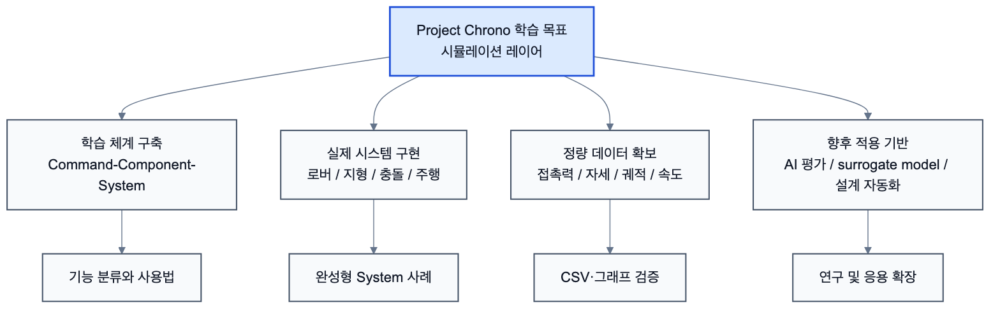

# 1.2 프로젝트 목적

## 1.2.1 Project Chrono 학습 체계 구축

Project Chrono는 다양한 공학 분야에서 활용 가능한 물리 기반 시뮬레이션 플랫폼이지만, 공식 문서의 양이 매우 방대하고 모듈 간 연계 구조가 복잡하여 처음 접하는 사용자가 전체 구조를 이해하기 어렵다.

본 프로젝트의 첫 번째 목적은 Chrono가 제공하는 기능을 체계적으로 정리하고 학습 로드맵을 구축하는 것이다. 이를 위해 Chrono 기능을 Command, Component, System의 3단계 구조로 분류하여 학습 순서를 정리하고 각 단계 간의 연계 관계를 구축하고자 하였다.

*그림 1.2-1. Project Chrono 학습 목표를 학습 체계, 시스템 구현, 정량 데이터 확보, 향후 적용 기반으로 정리한 구조*

## 1.2.2 Command-Component-System 기반 학습 방법론 제안

대부분의 Chrono 학습은 개별 예제를 실행하는 수준에서 이루어지는 경우가 많다. 그러나 이러한 방식은 특정 기능의 사용법은 익힐 수 있지만 실제 시스템을 설계하는 능력으로 연결되기 어렵다.

본 프로젝트에서는 Command를 이용하여 Component를 구성하고, Component를 조합하여 System을 구현하는 학습 방법을 적용하였다.

이를 통해 개별 API 사용 방법을 학습하는 것을 넘어 실제 공학 문제를 해결할 수 있는 시스템 설계 능력을 확보하고자 하였다.

## 1.2.3 Chrono 주요 모듈 활용 능력 확보

Chrono는 Core, Vehicle, Robot, Sensor, Visualization 등 여러 모듈과, Chrono::Vehicle 내부의 Terrain 계열 클래스를 제공한다.

본 프로젝트에서는 각 모듈과 Terrain 계열 기능의 역할을 조사하고 실제 예제를 구현함으로써 다음과 같은 활용 능력을 확보하고자 하였다.

- Vehicle 기반 차량 시뮬레이션
- Robot 기반 로버 시뮬레이션
- Chrono::Vehicle Terrain 계열 기반 지형 생성
- Contact Dynamics 기반 충돌 해석
- Visualization 기반 시뮬레이션 시각화

이를 통해 이번 학기에는 로버, 지형, 충돌, 시각화 중심 기능을 실제 구현 수준으로 익히고, Sensor 등 확장 기능은 향후 프로젝트로 연결할 수 있도록 정리하는 것을 목표로 하였다.

## 1.2.4 실제 시스템 구현 능력 확보

단순한 예제 실행은 Chrono 기능을 확인하는 데에는 도움이 되지만 실제 공학 문제를 해결하기에는 한계가 있다.

따라서 본 프로젝트에서는 여러 Component를 조합하여 실제 시스템을 구현하는 것을 목표로 하였다.

대표적으로 Curiosity Rover 충돌 시스템과 화성 지형 주행 시스템을 구현하였으며, 이를 통해 Chrono::Vehicle의 Terrain 계열 클래스, Chrono::Robot 모델, Contact Dynamics 기능이 실제 시스템에서 어떻게 활용되는지 확인하고자 하였다.

## 1.2.5 물리량 추출 및 데이터 분석 능력 확보

Chrono는 단순히 물체를 움직이는 시뮬레이션 도구가 아니라 다양한 물리량을 계산하고 분석할 수 있는 해석 플랫폼이다.

본 프로젝트에서는 시뮬레이션 결과를 시각적으로 확인하는 것에 그치지 않고 다음과 같은 데이터를 추출하여 분석하였다.

- Contact Force
- Impulse
- Chassis Height
- Pitch
- Roll

이를 통해 시뮬레이션 결과를 정성적으로 관찰하는 수준을 넘어 정량적으로 분석할 수 있는 능력을 확보하고자 하였다.

## 1.2.6 기술 문서화 및 지식 자산 구축

프로젝트 수행 과정에서 학습한 내용은 Obsidian을 이용하여 체계적으로 정리하였으며, GitHub를 이용하여 코드와 문서를 관리하였다.

이를 통해 단순한 과제 수행이 아닌 지속적으로 활용 가능한 Chrono 학습 자료를 구축하고자 하였다.

또한 향후 새로운 팀원이 참여하거나 추가 프로젝트를 수행할 경우 기존 학습 내용을 재활용할 수 있는 기반을 마련하는 것을 목표로 하였다.

## 1.2.7 향후 프로젝트 적용 기반 마련

본 프로젝트의 최종 목적은 Chrono 사용법 자체를 학습하는 것이 아니라, 향후 수행할 다양한 공학 프로젝트에 Chrono를 활용할 수 있는 기반을 마련하는 것이다.

특히 차량, 로봇, 지형, 충돌 해석과 관련된 다양한 주제를 구현할 수 있는 수준의 역량을 확보함으로써 향후 캡스톤디자인, 연구 과제 및 개인 프로젝트에 Chrono를 적용할 수 있도록 준비하고자 하였다.

이를 통해 단순 학습을 넘어 실제 공학 문제 해결을 위한 시뮬레이션 활용 능력을 확보하는 것을 본 프로젝트의 궁극적인 목표로 설정하였다.

## 1.2.8 최종 보고서의 구체적 달성 기준

본 보고서는 Project Chrono를 처음 학습하는 팀원이 같은 흐름을 따라갈 수 있도록, 각 장이 다음 기준을 만족하는 것을 목표로 한다.

| 보고서 영역 | 달성 기준 | 본문에서 확인할 내용 |
| --- | --- | --- |
| Command | 가상환경 구성을 위한 Chrono 기능을 분류하고, 각 기능의 사용법과 주의사항을 설명한다. | Core API, Vehicle Terrain 계열, Vehicle/Robot 고수준 API, Visualization/Data Command 분류 |
| Component | Command를 사용해 구현 대상과 환경의 개별 부품을 설계하는 방법을 설명한다. | 로버/차량, 지형/환경, 충돌/접촉, 데이터 출력 Component |
| System | Component들을 조합하여 충돌, 주행, 커스텀 로버 실험과 같은 완성형 시뮬레이션을 구성한다. | Curiosity 충돌, 화성 지형 주행, 커스텀 로버 설계 및 주행 실험 |
| 주제 확장 | 브레인스토밍으로 도출한 주제를 Command-Component-System 순서로 구현할 수 있는지 검토한다. | 결론부의 주제 리스트와 향후 계획에서 연결 |

이 기준을 통해 본 보고서는 단순한 예제 실행 기록이 아니라, Project Chrono 기능을 실제 연구 주제와 가상환경 구축으로 확장하기 위한 학습 매뉴얼 역할을 하도록 구성하였다.
