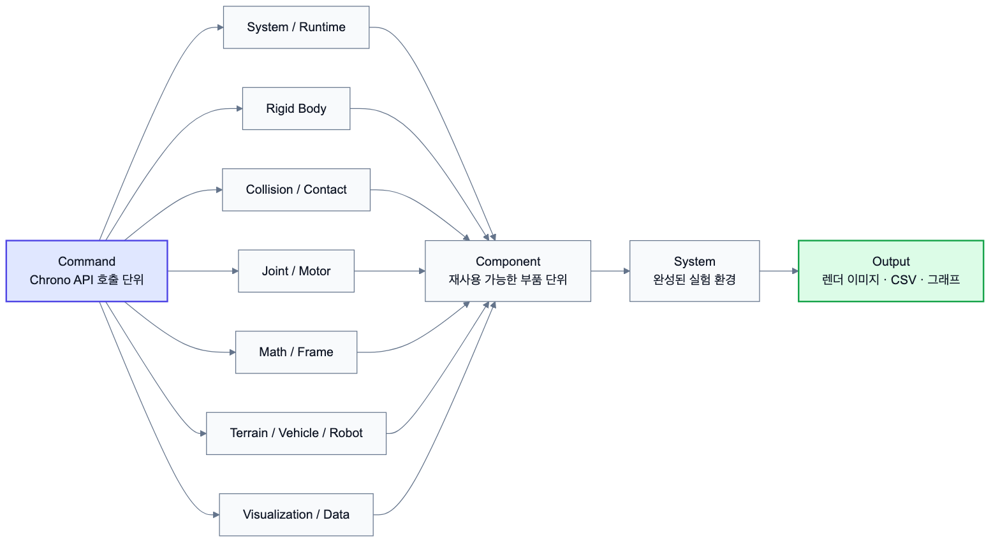

# 2.1.0 Command 단계 전체 구조

Command 단계는 Project Chrono에서 가상환경을 만들기 위해 호출하는 기본 기능을 분류하고, 각 기능이 어떤 모델링 문제에 쓰이는지 정리하는 단계이다. 여기서 Command는 단순한 한 줄짜리 함수 이름이 아니라, `ChSystem`, `ChBody`, `ChLink`, `ChMotor`, `RigidTerrain`, `SCMTerrain`, `Curiosity`, `VSG/Irrlicht`, CSV 출력처럼 시뮬레이션을 구성할 때 반복적으로 사용하는 API 묶음을 의미한다.

Command 단계의 핵심은 "기능이 무엇인지", "어떻게 분류되는지", "각 기능을 어떻게 사용하는지"를 보여주는 것이다. 따라서 본 장에서는 Chrono의 기능을 아래와 같이 분류하고, 각 Command가 2.2 Component와 2.3 System으로 이어지는 위치를 함께 표시하였다.

좌표계는 System 단계의 해석 결과와 직접 연결되므로 본 보고서에서는 기준을 명시한다. Chrono Core 자체는 사용자가 원하는 world frame을 설정할 수 있지만, Chrono::Vehicle/Chrono::Robot 및 커스텀 로버 System은 ISO 차량 관례에 맞춰 **X-forward, Y-left, Z-up**을 기본 기준으로 설명한다. 따라서 본문의 로버/지형 예제에서 중력은 특별히 다르게 밝히지 않는 한 `chrono.ChVector3d(0, 0, -9.81)`처럼 -Z 방향으로 둔다.

*그림 2.1.0-1. Chrono Command 분류가 Component와 System 단계로 연결되는 전체 구조*

| Command 분류 | 대표 API / 기능 | 담당하는 모델링 질문 | 연결되는 Component | System 적용 예 |
|---|---|---|---|---|
| System / Runtime | `ChSystemNSC`, `ChSystemSMC`, `DoStepDynamics`, `SetGravitationalAcceleration` | 어떤 물리 세계를 만들고 시간을 어떻게 전진시킬 것인가 | Simulation Runtime, Gravity, Run Config | 화성 중력 주행, 충돌 실험 |
| Rigid Body | `ChBody`, `ChBodyEasyBox`, `ChBodyEasyCylinder`, `SetMass`, `SetPos` | 차체, 바퀴, 벽, 지면 같은 물체를 어떻게 만들 것인가 | Chassis, Wheel, Ground, Obstacle | 커스텀 로버, 고정 벽 충돌 |
| Collision / Contact | `ChContactMaterialNSC`, `ChCollisionShapeBox`, `EnableCollision`, `GetContactForce` | 물체가 닿을 때 마찰, 반발, 접촉력을 어떻게 계산할 것인가 | Contact Material, Collision Shape, Contact Logger | 충돌력/충격량 분석 |
| Force / Spring | `AccumulateForce`, `AccumulateTorque`, `ChLinkTSDA`, `ChLinkRSDA` | 외력, 토크, 스프링/댐퍼를 어떻게 부여할 것인가 | Force Field, Suspension, Actuator | 현가장치, 외력 환경 |
| Joint / Link / Motor | `ChLinkLockRevolute`, `ChLinkMotorRotationSpeed`, `ChLinkMotorRotationAngle` | 두 물체의 자유도를 어떻게 제한하고 구동할 것인가 | Axle, Steering, Drive Motor | 바퀴 회전, Ackermann 조향 |
| Math / Frame | `ChVector3d`, `ChQuaterniond`, `ChFramed`, `QuatFromAngleZ` | 위치, 방향, 좌표계를 어떻게 표현할 것인가 | Initial State, Hardpoint Map, Sensor Pose | 로버 배치, 지형 patch 배치 |
| Solver / Timestepper | `SetSolverType`, `SetTimestepperType`, tolerance, iteration | 접촉과 구속 조건을 어느 정확도와 속도로 풀 것인가 | Physics Context, Stability Checklist | 접촉 안정성 검토 |
| Terrain / Vehicle / Robot (고수준 Command / Factory API) | `RigidTerrain`, `SCMTerrain`, `HMMWV`, `Curiosity`, `Viper` | 완성형 지형, 차량, 로버 모델을 어떻게 불러올 것인가 | Terrain, Rover, Tire, Driver | Curiosity 화성 지형 주행 |
| Visualization / Data | VSG, Irrlicht, visual shape, CSV writer, graph generator | 결과를 어떻게 보고, 저장하고, 검증할 것인가 | Render/Screenshot, State Logger, Graph Generator | 렌더 이미지, 위치/속도/힘 그래프 |

Command 단계의 산출물은 API 목록 자체에서 끝나지 않는다. 각 Command는 Component 단계에서 현실 세계의 부품 의미를 얻고, System 단계에서 여러 부품을 조합하는 재료가 된다.

| 연결 단계 | 설명 | 예시 |
|---|---|---|
| Command | Chrono가 제공하는 호출 단위와 설정 방법 | `ChBodyEasyCylinder`, `ChLinkMotorRotationSpeed`, `veh.SCMTerrain` |
| Component | 여러 Command를 묶어 구현 대상의 부품으로 정의 | Wheel Component, Drive Motor Component, SCMTerrain Component |
| System | Component를 조합해 하나의 실험 또는 가상환경 구성 | 커스텀 로버 주행 실험, Curiosity 화성 지형 주행 |

예를 들어 "로버가 울퉁불퉁한 화성 지형을 주행한다"는 System은 `SCMTerrain`, `Curiosity`, `SetGravitationalAcceleration`, `DoStepDynamics`, Logger Command를 직접 사용한다. 그러나 보고서에서는 이들을 그대로 나열하지 않고 Terrain Component, Rover Component, Gravity Component, Data Logger Component로 한 번 묶은 뒤, System 단계에서 조합 관계를 설명한다. 이 구조가 본 보고서의 전체 학습 로드맵이다.
