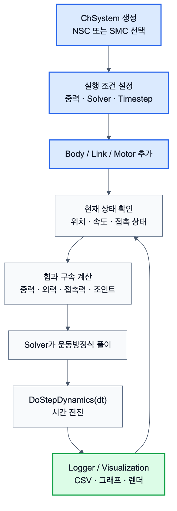

# 2.1.1 System

`ChSystem`은 Chrono 시뮬레이션의 최상위 컨테이너이다. 시뮬레이션에 사용되는 강체, 조인트, 링크, 힘, 접촉 조건, 솔버 등이 모두 `ChSystem` 내부에 포함된다. 사용자는 먼저 시스템을 생성한 뒤, 여기에 물체와 구속 조건을 추가하고, `DoStepDynamics(dt)`를 반복 호출하여 시간을 전진시켜 상태를 업데이트 한다.

Chrono에서는 접촉 처리 방식에 따라 대표적으로 `ChSystemNSC`와 `ChSystemSMC`를 사용한다. `ChSystemNSC`는 Non-Smooth Contact 방식으로, 접촉을 상보성 조건 기반으로 처리한다. 일반적인 강체 접촉 문제에서 비교적 빠르게 사용할 수 있다. 반면 `ChSystemSMC`는 Smooth Contact 방식으로, 접촉을 스프링-댐퍼 형태의 페널티 힘으로 처리한다. 이 방식은 고무, 타이어, FEA 연동 등 더 부드러운 접촉 모델이 필요한 경우에 적합하다.

주요 함수는 다음과 같다.

| 메서드 | 설명 | 기타 |
| --- | --- | --- |
| AddBody(body) / Add(body) | 강체 추가 |  |
| Add(link) | 조인트/링크 추가 |  |
| Add(shaft) | 1D 회전축 추가 |  |
| DoStepDynamics(dt) | 시간을 dt초만큼 전진 |  |
| GetChTime() | 현재 시뮬레이션 시간 |  |
| GetBodyCount() | 시스템 내 물체 수 |  |
| SetGravitationalAcceleration(v) | 중력 벡터 설정 |  |
| GetGravitationalAcceleration() | 중력 벡터 조회 |  |
| SetSolverType(type) | 솔버 변경 | 아래 참조 |
| SetTimestepperType(type) | 적분기 변경 | EULER\_IMPLICIT\_LINEARIZED(기본값, 빠르고 안정적, 1차, 반복불필요), HHT,(정밀, 수치 감쇠 조절 가능, 2차, 반복필요) NEWMARK(FEA에서 주로 사용, 1차, 반복필요) 사용 가능 |
| SetMaxPenetrationRecoverySpeed(v) | 관통 복원 속도 제한 |  |
| SetMinBounceSpeed(v) | 최소 반발 속도 임계값 |  |

사용 가능한 솔버는 다음과 같다.

| 솔버 | 정밀도 | 속도 | NSC 지원 | FEA 지원 |
| --- | --- | --- | --- | --- |
| PSOR | 보통 | 빠름 | O | X |
| APGD | 높음 | 보통 | O | X |
| BARZILAIBORWEIN | 높음 | 보통 | O | X |
| MINRES | 높음 | 느림 | X | O |
| PardisoMKL | 최고 | 느림 | O | O |

System 사용에서 중요한 점은 Chrono의 기본 중력이 자동으로 설정되어 있지 않을 수 있다는 것이다. 따라서 일반적인 낙하, 접촉, 차량 주행 문제를 구성할 때는 반드시 `SetGravitationalAcceleration()`을 사용하여 중력을 설정해야 한다.

또한 시뮬레이션은 `DoStepDynamics(dt)` 호출을 통해 진행되며, 시간 간격 `dt`는 해석 정확도와 계산 속도에 직접적인 영향을 준다. 일반적인 확인용 시뮬레이션에서는 0.005 s 수준을 사용할 수 있고, 더 정밀한 접촉이나 고주파 진동이 포함된 경우에는 더 작은 시간 간격이 필요하다.

본 보고서의 로버/차량 System은 ISO 차량 좌표계인 X-forward, Y-left, Z-up을 기준으로 한다. 따라서 아래 최소 예제도 Z-up 기준으로 작성하여 중력 방향을 `-Z`로 둔다. Y-up 장면을 별도로 구성하는 경우에는 VSG/Irrlicht camera vertical 설정과 중력 벡터를 함께 바꿔야 한다.



*그림 2.1.1-1. `ChSystem`을 생성한 뒤 body, link, force, contact, solver, logger가 반복적으로 동작하는 실행 흐름*

## 2.1.1.1 최소 실행 구조

`ChSystem` Command는 다른 모든 Command가 들어가는 실행 환경이다. 따라서 Component를 만들기 전에는 먼저 System을 생성하고, 중력, solver, timestep을 정한 뒤 body와 link를 등록하는 순서를 확인해야 한다.

```python
import pychrono as chrono

system = chrono.ChSystemNSC()
system.SetGravitationalAcceleration(chrono.ChVector3d(0, 0, -9.81))
system.SetSolverType(chrono.ChSolver.Type_PSOR)

mat = chrono.ChContactMaterialNSC()
ground = chrono.ChBodyEasyBox(10, 10, 0.2, 1000, True, True, mat)
ground.SetFixed(True)
ground.SetPos(chrono.ChVector3d(0, 0, -0.1))
system.Add(ground)

step_size = 0.005
while system.GetChTime() < 2.0:
    system.DoStepDynamics(step_size)
```

## 2.1.1.2 Component 및 System 연결

| System Command | Component 단계 의미 | System 단계 사용 |
|---|---|---|
| `ChSystemNSC/SMC` | 물리 실행 환경 선택 | 충돌 실험, 지형 주행 실험 |
| `SetGravitationalAcceleration` | 중력 또는 행성 환경 설정 | 화성 중력 주행 |
| `Add` / `AddBody` / `AddLink` | Component를 System에 등록 | 로버, 지형, 장애물 조립 |
| `DoStepDynamics` | 시간 전진 | 모든 동역학 실험 |
| `GetChTime` | 같은 시간 기준으로 로그 기록 | CSV, 그래프, 이벤트 분석 |
