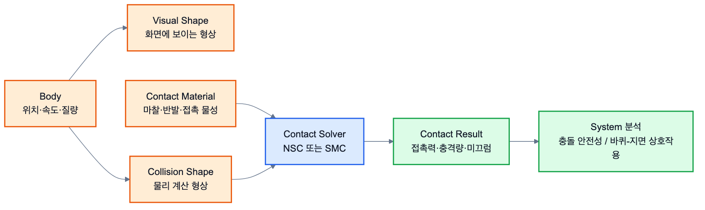
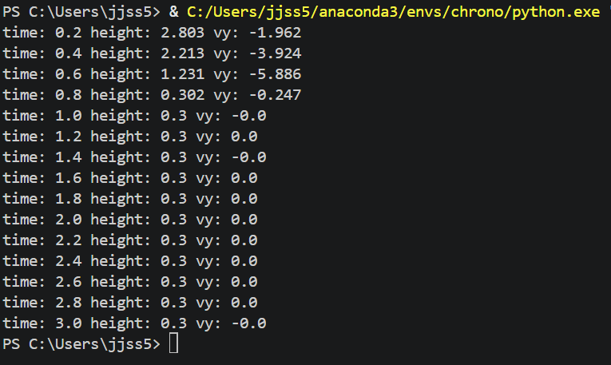

# 2.1.2 Collision

Collision Command는 두 물체가 서로 접촉할 때 충돌 여부, 접촉 위치, 마찰, 반발, 접촉력, 충격량을 계산하기 위해 사용하는 기능이다. Chrono에서는 물체를 화면에 보이게 하는 visual shape와 물리 계산에 사용하는 collision shape가 서로 독립적이므로, 충돌을 구현할 때는 반드시 접촉 방식, 접촉 재질, 충돌 형상, 충돌 활성화 여부를 함께 설정해야 한다.



*그림 2.1.2-1. Body, visual shape, collision shape, contact material, solver가 접촉 결과로 연결되는 구조*

## 2.1.2.1 접촉 방식 선택

Chrono의 대표적인 접촉 방식은 NSC와 SMC이다. 두 방식은 같은 충돌 장면을 만들 수 있지만, 접촉력을 계산하는 수학적 가정이 다르므로 System 목적에 맞게 선택해야 한다.

| 방식 | 사용하는 System | 접촉 재질 | 특징 | 적합한 예 |
| --- | --- | --- | --- | --- |
| NSC | `chrono.ChSystemNSC()` | `chrono.ChContactMaterialNSC()` | 강체 접촉을 비매끄러운 상보성 문제로 처리한다. 계산이 빠르고 일반적인 강체 충돌에 적합하다. | 로버-벽 충돌, 강체 지형 위 주행 |
| SMC | `chrono.ChSystemSMC()` | `chrono.ChContactMaterialSMC()` | 접촉 침투량에 비례한 penalty force로 접촉력을 계산한다. 접촉 강성/감쇠를 조정할 수 있다. | 부드러운 접촉, 타이어/토양, 변형 접촉 근사 |

NSC System에는 NSC 재질을, SMC System에는 SMC 재질을 사용하는 것이 기본 원칙이다. 서로 다른 계열을 섞으면 마찰, 반발, stiffness 같은 설정이 의도대로 적용되지 않을 수 있다.

## 2.1.2.2 Contact Material Command

Contact Material은 두 물체가 접촉할 때 표면이 어떤 물성을 가지는지 정의한다. 가장 자주 조정하는 값은 마찰계수와 반발계수이며, 바퀴-지면 접촉이나 충돌 실험에서는 이 값이 결과에 직접 영향을 준다.

| 속성 | 대표 메서드 | 의미 | Component 연결 |
| --- | --- | --- | --- |
| 마찰 | `SetFriction(mu)` | 접선 방향 미끄럼 저항 | Ground, Wheel, Obstacle |
| 정지 마찰 | `SetStaticFriction(mu)` | 미끄러지기 전 버티는 정도 | Terrain Contact Material |
| 동마찰 | `SetSlidingFriction(mu)` | 미끄러지는 중 저항 | Tire/Ground 접촉 |
| 반발 | `SetRestitution(e)` | 충돌 후 튕겨 나가는 정도 | Collision Test |
| 구름 저항 | `SetRollingFriction(r)` | 굴러가는 물체의 저항 | Wheel/Tire |
| 스핀 저항 | `SetSpinningFriction(r)` | 접촉점 회전 저항 | Wheel/Tire |

```python
import pychrono as chrono

system = chrono.ChSystemNSC()
mat = chrono.ChContactMaterialNSC()
mat.SetFriction(0.8)
mat.SetRestitution(0.1)
```

## 2.1.2.3 Collision Shape Command

Collision Shape는 실제 물리 계산에 참여하는 형상이다. 시각적으로 복잡한 mesh를 쓰더라도 충돌 계산은 box, sphere, cylinder, capsule처럼 단순한 형상으로 근사하는 경우가 많다. 이는 계산 안정성과 속도를 높이기 위해서이다.

| 형상 | 대표 클래스 | 사용 예 |
| --- | --- | --- |
| 상자 | `ChCollisionShapeBox` | 벽, 지면, 차체 충돌 근사 |
| 구 | `ChCollisionShapeSphere` | 볼, 둥근 장애물 |
| 실린더 | `ChCollisionShapeCylinder` | 바퀴, 롤러 |
| 캡슐 | `ChCollisionShapeCapsule` | 모서리가 둥근 링크 |
| 삼각 메시 | `ChCollisionShapeTriangleMesh` | 복잡한 지형 또는 CAD 기반 형상 |

`ChBodyEasy*` 계열은 질량, 관성, visual shape, collision shape를 한 번에 만들 수 있는 편의 Command이다. 초보 학습 단계에서는 빠르게 실험을 구성할 수 있지만, 복잡한 Component에서는 visual shape와 collision shape를 분리해서 관리하는 편이 좋다.

아래 예제는 본 보고서의 로버/차량 System과 같은 Z-up 기준이다. 지면은 XY 평면 위에 놓고, 공은 +Z 방향 위에서 떨어지도록 배치한다.

```python
ground = chrono.ChBodyEasyBox(10.0, 10.0, 0.4, 1000, True, True, mat)
ground.SetFixed(True)
ground.SetPos(chrono.ChVector3d(0, 0, -0.2))
system.Add(ground)

ball = chrono.ChBodyEasySphere(0.25, 1000, True, True, mat)
ball.SetPos(chrono.ChVector3d(0, 0, 2.0))
system.Add(ball)
```

| 시각화 예 |
| --- |
|  |

*그림 2.1.2-2. 중력에 의해 떨어지는 공이 지면과 접촉하는 기본 Collision 예시*

이 장면은 `ChSystemNSC`, `ChContactMaterialNSC`, `ChBodyEasySphere`, `ChBodyEasyBox`가 함께 사용된 가장 기본적인 Collision System이다.

## 2.1.2.4 Component 및 System 연결

Collision Command는 2.2 Component 단계에서 Contact Material Component, Collision Shape Component, Contact Reporter Component로 확장된다. System 단계에서는 이 Component들이 로버, 지형, 장애물과 결합하여 접촉력 그래프나 충격량 그래프를 생성한다.

| Command | Component 단계 의미 | System 단계 사용 |
| --- | --- | --- |
| `ChContactMaterialNSC/SMC` | 표면 물성 정의 | 바퀴-지면 마찰, 벽 충돌 반발 |
| `ChCollisionShape...` | 물리 충돌 형상 정의 | 장애물, 바퀴, 차체 충돌 안정성 |
| `EnableCollision(True)` | 접촉 계산 참여 여부 | 로버와 지형의 실제 상호작용 |
| `GetContactForce()` | 접촉력 추출 | 충돌력 분석, 충격량 계산 |
