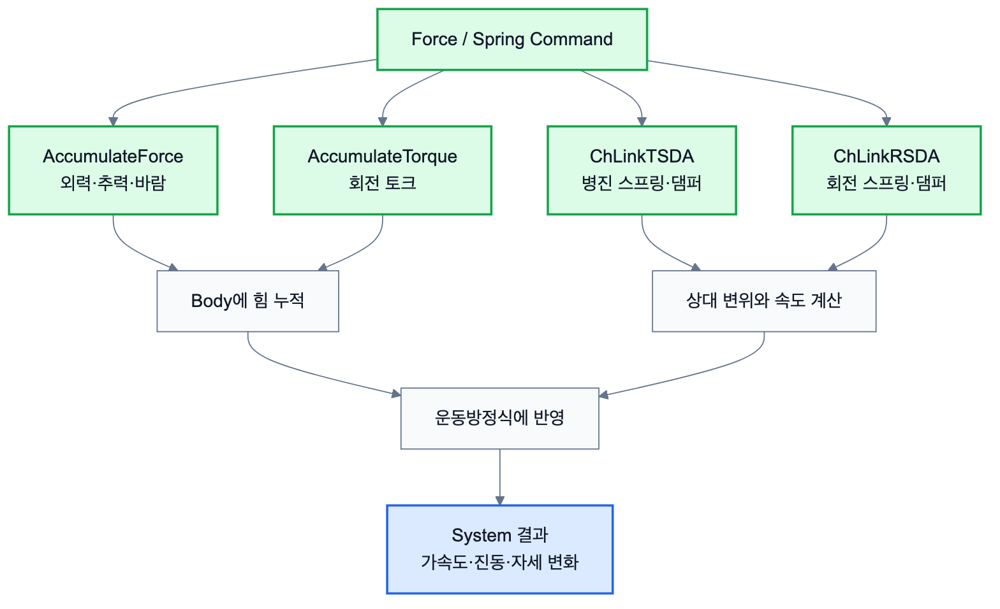

# 2.1.3 Force Spring

Force와 Spring Command는 물체의 운동 상태를 바꾸는 외력, 토크, 스프링, 댐퍼를 정의하기 위해 사용한다. Chrono는 물체의 위치를 단순히 애니메이션처럼 이동시키는 것이 아니라, 매 timestep마다 힘과 구속 조건을 계산한 뒤 운동방정식을 풀어 다음 상태를 결정한다.

`DoStepDynamics(dt)`가 호출되면 Chrono는 일반적으로 다음 흐름으로 상태를 갱신한다.



*그림 2.1.3-1. 외력, 토크, 병진/회전 스프링-댐퍼가 운동방정식과 System 결과로 이어지는 흐름*

1. 현재 시간의 body 위치, 속도, 접촉 상태를 확인한다.
2. 중력, 외력, 모터, 스프링/댐퍼, 접촉력을 계산한다.
3. 조인트와 접촉 조건을 포함한 운동방정식을 구성한다.
4. Solver와 timestepper를 이용해 다음 속도와 위치를 계산한다.
5. 시뮬레이션 시간을 `dt`만큼 증가시킨다.

## 2.1.3.1 외력과 토크 Command

강체에 직접 힘이나 토크를 가할 때는 `AccumulateForce()`와 `AccumulateTorque()`를 사용할 수 있다. 이 방식은 드론의 프로펠러 추력, 바람 하중, 일정한 밀기 힘처럼 특정 body에 직접 작용하는 하중을 표현할 때 유용하다.

| Command | 의미 | Component 연결 |
| --- | --- | --- |
| `AccumulateForce(force, point, local)` | 지정한 위치에 힘을 누적 | External Force, Wind, Propeller Thrust |
| `AccumulateTorque(torque, local)` | 강체에 토크를 누적 | Wheel Torque, Rotor Torque |
| `EmptyAccumulators()` | 누적된 힘과 토크 초기화 | 매 timestep 하중 갱신 |
| `SetGravitationalAcceleration()` | 전체 System의 중력 설정 | Gravity / Environment Component |

```python
force = chrono.ChVector3d(10, 0, 0)
point = body.GetPos()
body.AccumulateForce(force, point, False)
```

## 2.1.3.2 Translational Spring-Damper Command

병진 방향 스프링-댐퍼는 `ChLinkTSDA`로 구현한다. Hooke 법칙에 따라 스프링 힘은 `F = -k x`, 댐퍼 힘은 `F = -c v`로 표현되며, 두 효과가 함께 있으면 `F = -k x - c v` 형태로 작용한다.

| Command | 의미 |
| --- | --- |
| `ChLinkTSDA()` | 병진 스프링-댐퍼 객체 생성 |
| `Initialize(bodyA, bodyB, False, pointA, pointB)` | 두 body와 연결점 지정 |
| `SetRestLength(rest_length)` | 기준 길이 설정 |
| `SetSpringCoefficient(k)` | 스프링 강성 설정 |
| `SetDampingCoefficient(c)` | 감쇠 계수 설정 |
| `system.AddLink(spring)` | System에 스프링 추가 |

```python
spring = chrono.ChLinkTSDA()
spring.Initialize(body_a, body_b, False, point_a, point_b)
spring.SetRestLength(0.5)
spring.SetSpringCoefficient(2000.0)
spring.SetDampingCoefficient(40.0)
system.AddLink(spring)
```

## 2.1.3.3 Rotational Spring-Damper Command

회전 방향의 탄성 또는 감쇠가 필요할 때는 `ChLinkRSDA`를 사용한다. 이는 로버 현가장치의 torsion spring, 회전 힌지의 복원력, 기계 장치의 회전 감쇠를 단순화해 표현할 때 사용할 수 있다.

| Command | 의미 | 사용 예 |
| --- | --- | --- |
| `ChLinkRSDA()` | 회전 스프링-댐퍼 객체 생성 | 회전축 복원력 |
| `Initialize(bodyA, bodyB, frame)` | 두 body와 회전 기준 frame 설정 | 힌지 또는 suspension arm |
| `SetSpringCoefficient(k)` | 회전 강성 설정 | roll stiffness |
| `SetDampingCoefficient(c)` | 회전 감쇠 설정 | 진동 억제 |

## 2.1.3.4 Component 및 System 연결

Force/Spring Command는 Component 단계에서 외력장, suspension, actuator, 환경 효과로 해석된다. System 단계에서는 이 Component들이 로버의 자세 안정성, 드론의 상승력, 지형 충격 흡수 같은 실제 거동을 만든다.

| Command | Component 단계 의미 | System 단계 사용 |
| --- | --- | --- |
| `AccumulateForce` | 특정 body에 작용하는 외력 | 바람, 추진력, 밀기 힘 |
| `AccumulateTorque` | 회전 구동 또는 외란 토크 | 바퀴 토크, 프로펠러 반작용 |
| `ChLinkTSDA` | 병진 스프링/댐퍼 부품 | suspension, 완충 장치 |
| `ChLinkRSDA` | 회전 스프링/댐퍼 부품 | 회전 힌지, roll 안정화 |
