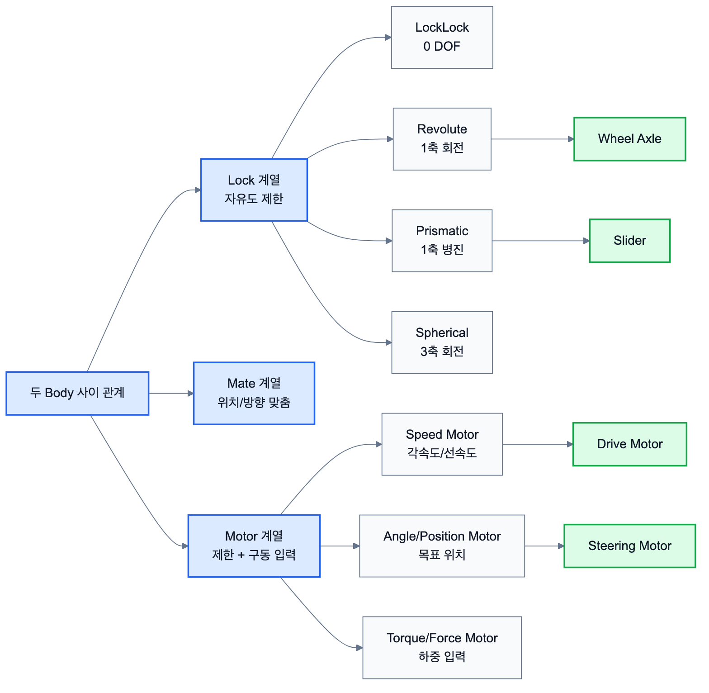

# 2.1.4 Joint and Links

Joint와 Link Command는 두 강체 사이에 구속 조건을 부여하여 상대 운동을 제한하거나, 특정 방향의 운동만 허용하기 위해 사용한다. 예를 들어 바퀴는 차체에 완전히 붙어 있으면 안 되고 회전축을 중심으로만 돌아야 하므로 revolute joint가 필요하다. 조향부는 조향축 회전을 허용해야 하며, 모터는 그 축에 속도, 각도, 토크 명령을 전달한다.

## 2.1.4.1 Joint 계열 분류

Chrono의 link 계열은 크게 Mate, Lock, Motor 계열로 나눌 수 있다. Mate 계열은 비교적 단순한 구속에 적합하고, Lock 계열은 전통적인 기계 조인트를 표현하는 데 많이 사용된다. Motor 계열은 구속 조건에 구동 입력을 추가한다.

| 계열 | 대표 Command | 역할 | Component 연결 |
| --- | --- | --- | --- |
| Mate | `ChLinkMateFix`, `ChLinkMateGeneric` | 두 body 사이의 위치/방향 관계를 간단히 맞춤 | 고정 장착, 임시 구속 |
| Lock | `ChLinkLockRevolute`, `ChLinkLockPrismatic`, `ChLinkLockSpherical` | 특정 자유도만 허용하는 기계 조인트 | Axle, Steering Knuckle, Slider |
| Motor | `ChLinkMotorRotationSpeed`, `ChLinkMotorRotationAngle`, `ChLinkMotorLinearPosition` | 조인트 방향으로 속도, 위치, 힘/토크 입력 | Drive Motor, Steering Motor |



*그림 2.1.4-1. Mate, Lock, Motor 계열이 두 body 사이의 자유도 제한과 구동 입력으로 연결되는 구조*

## 2.1.4.2 Lock 계열 Command

| 클래스 | 제거 DOF | 허용 운동 | 실제 예시 |
| --- | --- | --- | --- |
| `ChLinkLockLock` | 6 | 없음 | 용접, 완전 고정 |
| `ChLinkLockRevolute` | 5 | 1축 회전 | 바퀴 축, 힌지 |
| `ChLinkLockCylindrical` | 4 | 1축 회전 + 1축 직선 | 피스톤, 가이드 축 |
| `ChLinkLockPrismatic` | 5 | 1축 직선 | 슬라이더 |
| `ChLinkLockSpherical` | 3 | 3축 회전 | 볼조인트 |
| `ChLinkLockGear` | 1 | 기어비 구속 | 기어 맞물림 |
| `ChLinkLockPulley` | 1 | 풀리비 구속 | 벨트-풀리 |

일반적인 사용 순서는 joint 객체 생성, `Initialize()`로 두 body와 joint frame 지정, System에 추가하는 것이다. joint frame의 위치와 방향은 어떤 축이 회전축 또는 병진축이 되는지를 결정하므로 매우 중요하다.

```python
joint_frame = chrono.ChFramed(
    chrono.ChVector3d(0.5, 0.0, 0.25),
    chrono.QuatFromAngleY(chrono.CH_PI_2)
)

axle = chrono.ChLinkLockRevolute()
axle.Initialize(chassis, wheel, joint_frame)
system.Add(axle)
```

## 2.1.4.3 Motor 계열 Command

Motor 계열은 두 body 사이의 상대 운동을 입력 함수에 따라 제어한다. 회전 모터는 바퀴 구동, 조향, 회전 actuator에 사용하고, 선형 모터는 슬라이더나 직선 actuator에 사용할 수 있다.

| 클래스 | 기능 | 대표 입력 함수 |
| --- | --- | --- |
| `ChLinkMotorRotationSpeed` | 일정 각속도 또는 시간별 각속도 | `SetSpeedFunction()` |
| `ChLinkMotorRotationAngle` | 목표 각도 궤적 추종 | `SetAngleFunction()` |
| `ChLinkMotorRotationTorque` | 토크 입력 | `SetTorqueFunction()` |
| `ChLinkMotorLinearSpeed` | 선형 속도 입력 | `SetSpeedFunction()` |
| `ChLinkMotorLinearPosition` | 선형 위치 입력 | `SetDistanceFunction()` |
| `ChLinkMotorLinearForce` | 선형 힘 입력 | `SetForceFunction()` |

```python
motor = chrono.ChLinkMotorRotationSpeed()
motor.Initialize(chassis, wheel, joint_frame)
motor.SetSpeedFunction(chrono.ChFunctionConst(6.0))
system.Add(motor)
```

## 2.1.4.4 반력 확인 Command

조인트에 걸리는 반력과 반토크는 `GetReaction2()` 등을 통해 확인할 수 있다. 이 값은 연결부 하중 검토, 모터 토크 검토, 구속 조건이 과도하게 걸리는지 확인하는 데 사용한다.

| 확인 항목 | 의미 |
| --- | --- |
| reaction force | 조인트가 두 body 사이에서 전달하는 힘 |
| reaction torque | 조인트가 전달하는 토크 |
| constraint violation | 구속 조건을 얼마나 잘 만족하는지에 대한 안정성 지표 |

## 2.1.4.5 Component 및 System 연결

Joint/Link Command는 Component 단계에서 축, 조향부, 구동부, suspension link로 확장된다. System 단계에서는 이 부품들이 모여 로버가 실제로 굴러가고 방향을 바꾸는 구조를 만든다.

| Command | Component 단계 의미 | System 단계 사용 |
| --- | --- | --- |
| `ChLinkLockRevolute` | 바퀴 회전축, 힌지 | 로버 바퀴 회전 |
| `ChLinkMotorRotationSpeed` | 구동 모터 | 4WD 주행, pivot turn |
| `ChLinkMotorRotationAngle` | 조향 모터 | Ackermann 조향 |
| `GetReaction2()` | 연결부 하중 측정 | 조인트 안정성 검토 |
