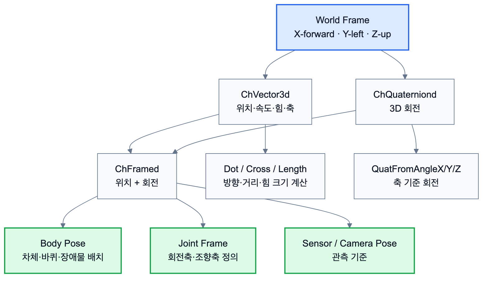

# 2.1.5 Math

Chrono의 수학 도구는 벡터, 행렬, 쿼터니언, 함수 객체 등을 포함한다. 일반적인 PyChrono 사용에서는 `ChVector3d`, `ChQuaterniond`, `ChMatrix33d`, `ChFramed` 등이 주로 사용된다. 한편 팀 문서에서 정리한 `Multicore Math`는 Chrono Multicore 모듈 내부에서 사용되는 저수준 수학 자료형으로, 병렬 계산 효율을 위해 `real`, `real3`, `real4`, `quaternion`, `Mat33` 등의 자료형을 사용한다.

| Multicore Math | 일반 PyChrono 대응 | 설명 |
| --- | --- | --- |
| `real` | `float` 또는 scalar 값 | 기본 실수 값 |
| `real3` | `ChVector3d` | 3차원 벡터 값(x, y, z) |
| `real4` | 4성분 벡터 또는 quaternion 개념 | 4차원 벡터(4개의 실수) |
| `quaternion` | `ChQuaterniond` | 회전을 표현하는 자료형(scalar, vector, vector, vector) |
| `Mat33` | `ChMatrix33d` | 3 \* 3 matrix |

회전 표현에는 쿼터니언이 사용된다. 쿼터니언은 오일러각과 달리 짐벌락 문제가 없어 3차원 회전 시뮬레이션에 적합하다. PyChrono에서는 `ChQuaterniond`, `QuatFromAngleX()`, `QuatFromAngleY()`, `QuatFromAngleZ()`, `QuatFromAngleAxis()` 등을 이용해 회전을 정의할 수 있다. 또한 `ChFramed`는 위치와 회전을 함께 가진 프레임을 나타내며, 강체 위치, 조인트 프레임, 초기 조건 설정 등에 사용된다.



*그림 2.1.5-1. X-forward, Y-left, Z-up 기준에서 vector, quaternion, frame이 body pose와 joint frame으로 연결되는 구조*

이외에도 다음과 같은 주요 수학 함수를 가진다.

| 함수 또는 연산 | 설명 |
| --- | --- |
| `Dot(a, b)` 또는 `a.Dot(b)` | 벡터 내적 |
| `Cross(a, b)` 또는 `a.Cross(b)` | 벡터 외적 |
| `GetNormalized()` | 단위 벡터 반환 |
| `Length()` | 벡터 크기 계산 |
| `Length2()` | 벡터 크기의 제곱 계산 |
| `Clamp()` | 값을 지정 범위 안으로 제한 |
| `SkewSymmetric()` | 외적 연산을 행렬 형태로 표현 |

예시는 다음과 같다.

```python
import pychrono as chrono

v = chrono.ChVector3d(3, 4, 0)
print(v.Length())
```

일반적인 차량 또는 로버 시뮬레이션 수준에서는 Multicore 내부 자료형을 직접 사용할 일은 많지 않다. 다만 접촉 solver, 병렬 충돌 검출, granular dynamics, GPU/CUDA 기반 계산 등 Chrono 내부 구조를 이해할 때 이러한 저수준 수학 자료형을 알고 있으면 유리하다.

## 2.1.5.1 Component 및 System 연결

Math Command는 직접 눈에 보이는 부품은 아니지만, 모든 Component의 좌표계와 초기 조건을 결정한다. 특히 로버의 바퀴 축, 조향축, 센서 장착 위치, 지형 patch의 방향은 벡터와 quaternion 설정이 틀리면 렌더링은 그럴듯해 보여도 실제 운동이 잘못 계산될 수 있다.

| Math Command | Component 단계 의미 | System 단계 사용 |
|---|---|---|
| `ChVector3d` | 위치, 속도, 힘, 축 방향 표현 | 로버 배치, 지형 크기, 접촉력 기록 |
| `ChQuaterniond` | 3차원 회전 표현 | 차체 자세, 지형 patch 회전 |
| `ChFramed` | 위치와 회전을 묶은 기준 frame | joint frame, sensor pose |
| `QuatFromAngleX/Y/Z` | 축 기준 회전 생성 | 바퀴 cylinder 축 정렬, 경사면 회전 |
| `Dot`, `Cross`, `Length` | 방향/거리/크기 계산 | waypoint heading error, 힘 크기 계산 |
