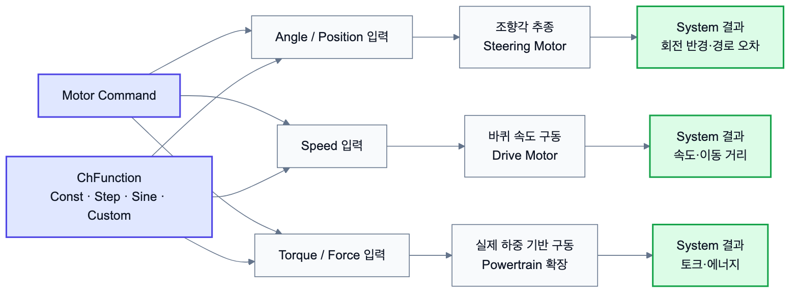

# 2.1.6 Motors

Motor는 두 물체 사이에 상대 운동을 부여하거나, 특정 힘 또는 토크를 가하는 액추에이터 기능이다. Chrono의 모터는 크게 회전 모터와 선형 모터로 나눌 수 있으며, 다시 운동을 강제로 부여하는 방식, 속도를 부여하는 방식, 힘 또는 토크를 가하는 방식으로 구분된다.



*그림 2.1.6-1. 각도, 속도, 토크/힘 입력 방식이 조향, 바퀴 구동, 동력계 확장으로 이어지는 구조*

| 구분 | 회전 모터 | 선형 모터 | 1D shaft 모터 |
| --- | --- | --- | --- |
| 변위/각도 입력 | `ChLinkMotorRotationAngle` | `ChLinkMotorLinearPosition` | `ChShaftsMotorPosition` |
| 속도 입력 | `ChLinkMotorRotationSpeed` | `ChLinkMotorLinearSpeed` | `ChShaftsMotorSpeed` |
| 하중 입력 | `ChLinkMotorRotationTorque` | `ChLinkMotorLinearForce` | `ChShaftsMotorLoad` |
| 드라이브라인 연결 | `ChLinkMotorRotationDriveline` | `ChLinkMotorLinearDriveline` | 해당 없음 |

회전 모터는 `ChLinkMotorRotation` 계열에서 파생되며, 기본적으로 모터 프레임의 Z축을 기준으로 상대 회전을 정의한다.

또한 회전에 의해 발생하는 회전 각도, 각속도, 각가속도는 각각 `GetMotorAngle()`, `GetMotorAngleDt()`, `GetMotorAngleDt2()`를 통해 그 값을 불러올 수 있다. 회전축의 구속 방식은 `SetSpindleConstraint()`로 설정할 수 있으며, 아래와 같은 옵션이 있다.

* FREE: 회전축에 정해진 제약조건(방향이나 정렬)이 없음
* REVOLUTE: x, y, z, rx, ry의 제약조건을 정함
* CYLINDRICAL: x, y, rx, ry의 제약조건을 정함
* OLDHAM: rx, ry의 제약조건을 정함

선형 모터는 `ChLinkMotorLinear` 계열에서 파생되며, 기본적으로 모터 프레임의 Z축 방향 병진 운동을 제어한다. 회전 모터와 비슷하게 선형 모터에 의해 발생하는 상대 위치, 속도, 가속도는 `GetMotorPos()`, `GetMotorPosDt()`, `GetMotorPosDt2()`로 불러올 수 있다. 선형 모터 역시 `SetGuideConstraint()`를 통해 가이드 구속 조건을 설정할 수 있으며, 다음과 같은 옵션을 사용할 수 있다.

* FREE: 롤러의 방향, 정렬에 제약조건을 두지 않음
* PRISMATIC: X, Y, RX, RY, RZ 제약조건을 둠(기본)
* SPHERICAL: X, Y 제약조건을 둠

대부분의 모터 입력은 `ChFunction`을 통해 정의된다. 예를 들어 일정 속도 모터는 상수 함수, 사인파 입력은 사인 함수, 시간에 따라 변하는 입력은 별도의 함수 객체를 사용하여 구현할 수 있다. 모터를 사용할 때의 일반적인 절차는 모터 객체 생성, `Initialize()`로 두 물체와 모터 프레임 연결, `ChFunction` 설정, 시스템에 추가의 순서이다.

## 2.1.6.1 바퀴 구동 모터 예시

로버의 바퀴 구동에는 회전 속도 모터가 가장 직관적이다. 아래 예시는 chassis와 wheel 사이에 회전 모터를 배치하고 일정 각속도를 입력하는 구조이다.

```python
joint_frame = chrono.ChFramed(
    chrono.ChVector3d(0.5, 0.0, 0.25),
    chrono.QuatFromAngleY(chrono.CH_PI_2)
)

drive_motor = chrono.ChLinkMotorRotationSpeed()
drive_motor.Initialize(chassis, wheel, joint_frame)
drive_motor.SetSpeedFunction(chrono.ChFunctionConst(8.0))
system.Add(drive_motor)
```

조향 모터는 속도보다 목표 각도를 명령하는 경우가 많으므로 `ChLinkMotorRotationAngle`을 사용한다. 이때 입력값은 실제 바퀴 각도인지, 정규화된 driver steering 값인지 구분해서 기록해야 한다.

## 2.1.6.2 Component 및 System 연결

| Motor Command | Component 단계 의미 | System 단계 사용 |
|---|---|---|
| `ChLinkMotorRotationSpeed` | 바퀴 회전 속도 구동 | 직진, slalom, pivot turn |
| `ChLinkMotorRotationAngle` | 목표 조향각 입력 | Ackermann steering |
| `ChLinkMotorRotationTorque` | 토크 기반 구동 | 동력계/토크 제어 확장 |
| `ChFunctionConst` | 일정 입력 함수 | 일정 속도 실험 |
| 시간 함수 계열 | 시간별 입력 profile | step steering, sinusoidal steering |
