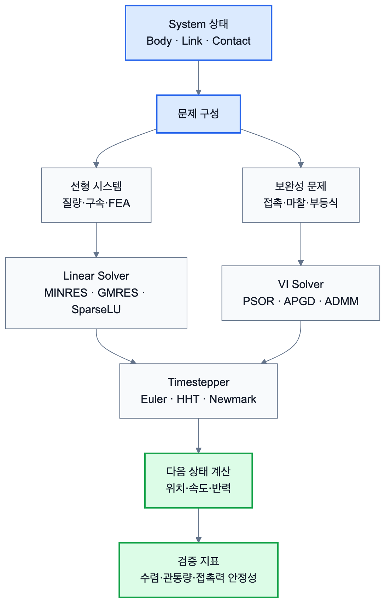

# 2.1.8 Solver

Solver는 Chrono 시스템이 구성한 수학적 문제를 실제로 푸는 모듈로, 단순히 하나의 방정식을 계산하는 것이 아닌 저장된 변수, 구속 조건, 접촉 조건 등을 기반으로 전체 물리 시스템의 상태를 계산한다. Solver의 기본 상위 클래스는 `ChSolver`이며, 아래와 같은 기능을 제공한다.

* 종류를 식별하는 `GetType()`
* 반복형인지 확인하는 `IsIterative()`
* 직접형인지 확인하는 `IsDirect()`
* 계산 전 준비를 수행하는 `Setup()`
* 실제 계산을 수행하는 `Solve()`

Chrono의 solver는 크게 선형 시스템을 푸는 `ChSolverLS` 계열과 접촉 및 마찰이 포함된 보완성 문제를 푸는 `ChSolverVI` 계열로 나눌 수 있다.

## 2.1.8.1 선형 문제

선형 연립방정식을 푸는 문제를 다룬다. 제약이 있어도 최종적으로는 선형 시스템으로 정리되는 경우에 사용된다. 이때 선형 계열은 다시 희소 행렬 직접해법과 반복형 선형해법으로 구분된다.

희소해법은 행렬을 분해하여 해를 구하므로 안정성과 정확도가 높지만, 메모리 사용량과 계산 비용이 클 수 있다. 반복형 해법은 최대 반복 횟수와 허용 오차를 설정하고, 반복 계산을 통해 해에 수렴한다.

## 2.1.8.2 보완성 문제

보완성 문제는 단순한 선형 연립방정식과 달리, 접촉(contact)이나 마찰(friction)과 같은 부등식 제약을 포함하는 문제를 의미한다. 이때 보완성 문제는 일반적으로 LCP (Linear Complementarity Problem)와 CCP (Cone Complementarity Problem) 형태로 표현된다.



*그림 2.1.8-1. System 상태가 선형 문제 또는 보완성 문제로 구성되고 solver와 timestepper를 거쳐 다음 상태로 갱신되는 흐름*

* LCP: 접촉 조건과 같은 부등식 제약을 포함한 문제
* CCP: LCP에 마찰까지 포함된 보다 현실적인 문제

아래와 같이 구분할 수 있다.

| Solver 계열 | 대표 solver | 특징 |
| --- | --- | --- |
| 희소 선형해법 | `ChSolverSparseLU`, `ChSolverSparseQR` | 행렬 분해 기반, 정확하지만 큰 시스템에서 부담 |
| 반복 선형해법 | `ChSolverGMRES`, `ChSolverMINRES`, `ChSolverBiCGSTAB` | 반복 계산 기반, tolerance와 iteration 설정 |
| 보완성 문제 해법 | `ChSolverPSOR`, `ChSolverPJacobi`, `ChSolverBB`, `ChSolverAPGD`, `ChSolverADMM` | 접촉, 마찰, 부등식 제약 처리 |

## 2.1.8.3 Solver 설정 예시

Solver Command는 화면에 직접 보이지 않지만, 접촉 안정성, 계산 속도, 관통량, 진동 수렴에 큰 영향을 준다. 따라서 충돌이나 주행 System에서는 timestep과 solver 설정을 실행 조건으로 함께 기록해야 한다.

```python
system.SetSolverType(chrono.ChSolver.Type_PSOR)
system.GetSolver().AsIterative().SetMaxIterations(100)
system.GetSolver().AsIterative().SetTolerance(1e-6)
system.SetTimestepperType(chrono.ChTimestepper.Type_EULER_IMPLICIT_LINEARIZED)
```

## 2.1.8.4 Component 및 System 연결

| Solver Command | Component 단계 의미 | System 단계 사용 |
| --- | --- | --- |
| `SetSolverType` | 물리 실행 환경의 계산 방식 | 충돌/접촉 안정성 비교 |
| iteration/tolerance 설정 | 수렴 조건 | 접촉력 graph 신뢰도 |
| `SetTimestepperType` | 시간 적분 방식 | 빠른 확인용/정밀 해석 구분 |
| `step_size` | System 전체 시간 해상도 | CSV 샘플링, 충격량 적분 |
