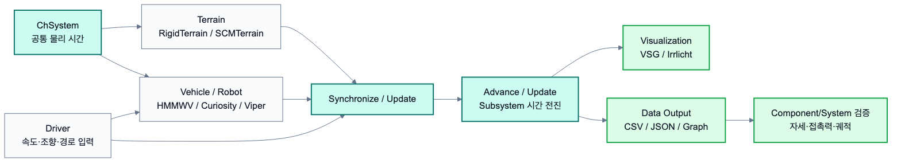

# 2.1.9 Terrain, Vehicle, Robot, Visualization, Data

앞선 2.1.1부터 2.1.8까지는 Chrono Core에서 반복적으로 사용하는 기본 Command를 정리하였다. 그러나 본 프로젝트의 주제는 로버와 환경 가상환경 구축이므로, 실제 System을 만들 때는 Terrain, Vehicle, Robot, Visualization, Data 관련 Command도 함께 필요하다. 이 절은 2.2 Component와 2.3 System에서 반복적으로 사용되는 고수준 Command 또는 Factory API를 정리한다. 여기서 `Curiosity`, `HMMWV`, `SCMTerrain` 같은 항목은 primitive command가 아니라 여러 하위 body/link/contact 설정을 내부에 포함한 고수준 생성자에 가깝다.



*그림 2.1.9-1. Terrain, Vehicle, Robot, Driver, Visualization, Data Output이 공통 물리 시간에 맞춰 동기화되는 구조*

## 2.1.9.1 Terrain Command

Terrain Command는 차량이나 로버가 접촉하는 지면을 생성한다. 단순한 box ground는 Core `ChBodyEasyBox`로 만들 수 있지만, 차량 주행 실험에서는 Chrono::Vehicle의 Terrain 계열을 사용하는 것이 더 자연스럽다.

| Terrain Command | 특징 | 연결 Component | System 예 |
| --- | --- | --- | --- |
| `veh.RigidTerrain(system)` | 강체 지형 patch를 조합한다. 계산이 빠르고 안정적이다. | Ground, RigidTerrain Patch, Obstacle | 충돌 실험, 평지 주행 |
| `terrain.AddPatch(...)` | box, mesh, heightmap 기반 patch를 추가한다. | Terrain Patch | 경사면, 단차, 도로 |
| `veh.SCMTerrain(system)` | Soil Contact Model 기반 변형 가능 토양을 만든다. | SCMTerrain, Soil Parameter | 화성 지형 주행 |
| `terrain.Initialize()` | 지형 geometry와 contact data를 초기화한다. | Terrain Lifecycle | 모든 지형 System |
| `terrain.Synchronize()` / `terrain.Advance()` | Vehicle System에서 지형 상태를 시간과 맞춘다. | Terrain Runtime | Vehicle 기반 주행 |

```python
import pychrono as chrono
import pychrono.vehicle as veh

system = chrono.ChSystemNSC()
terrain = veh.RigidTerrain(system)
mat = chrono.ChContactMaterialNSC()
mat.SetFriction(0.9)

patch = terrain.AddPatch(
    mat,
    chrono.ChCoordsysd(chrono.ChVector3d(0, 0, 0), chrono.QUNIT),
    30.0,
    30.0
)
patch.SetTexture(chrono.GetChronoDataFile("vehicle/terrain/textures/dirt.jpg"), 8, 8)
terrain.Initialize()
```

## 2.1.9.2 Vehicle Command

Vehicle Command는 차량을 여러 하위 시스템의 조합으로 생성한다. Chrono::Vehicle은 chassis, suspension, steering, wheel, tire, driveline, powertrain, brake를 하나의 vehicle 객체로 묶어 관리한다. 따라서 단순 `ChBody` 조합보다 실제 차량 동역학을 더 체계적으로 다룰 수 있다.

| Vehicle Command | 의미 | 연결 Component |
| --- | --- | --- |
| `veh.HMMWV_Full()` / 내장 vehicle model | 검증된 차량 template 생성 | Vehicle Model, Chassis |
| `SetInitPosition(...)` | 차량 초기 위치와 자세 설정 | Initial State |
| `SetTireType(...)` | 타이어 모델 선택 | Tire Component |
| `SetDriveType(...)` | 구동 방식 선택 | Driveline Component |
| `Initialize()` | vehicle subsystem 전체 초기화 | Vehicle Lifecycle |
| `Synchronize(time, driver_inputs, terrain)` | driver, terrain, tire, powertrain 상태 동기화 | Runtime Sync |
| `Advance(step)` | vehicle subsystem 시간 전진 | System Runtime |

```python
# 개념 예시: 실제 사용 시 Chrono 데이터 경로와 모델별 초기화 옵션을 함께 확인한다.
hmmwv = veh.HMMWV_Full()
hmmwv.SetInitPosition(chrono.ChCoordsysd(chrono.ChVector3d(0, 0, 0.6), chrono.QUNIT))
hmmwv.SetTireType(veh.TireModelType_TMEASY)
hmmwv.Initialize()
```

## 2.1.9.3 Robot Command

Robot Command는 Chrono에서 제공하는 완성형 로봇 모델을 불러와 실험 System에 배치할 때 사용한다. 본 보고서에서는 Curiosity Rover와 Viper Rover가 로버 System의 기준 모델로 사용된다.

| Robot Command | 의미 | 연결 Component | System 예 |
| --- | --- | --- | --- |
| `robot.Curiosity(system)` | Curiosity Rover 모델 생성 | Rover Component | 충돌, 화성 지형 주행 |
| `robot.CuriositySpeedDriver()` | Curiosity 속도 명령 생성 | Driver Component | 일정 속도 충돌 실험 |
| `robot.Viper(system)` | Viper Rover 모델 생성 | Rover Component | 로버 확장 예 |
| `Initialize()` | robot model 초기화 | Robot Lifecycle | 로버 배치 |
| `Update()` 또는 driver update 계열 | 시간에 따른 명령/상태 갱신 | Driver Runtime | 주행 실험 |

```python
import pychrono.robot as robot

rover = robot.Curiosity(system)
driver = robot.CuriositySpeedDriver()
# 모델별 Initialize/driver 연결 방식은 Chrono Robot demo를 기준으로 확인한다.
```

Robot Command는 완성형 로버를 빠르게 사용할 수 있다는 장점이 있다. 반면, 차체 크기나 바퀴 구조를 직접 바꾸려면 2.3.4처럼 Core body, joint, motor를 조합한 custom rover System으로 넘어가야 한다.

## 2.1.9.4 Visualization Command

Visualization Command는 시뮬레이션 결과를 눈으로 확인하기 위해 사용한다. Chrono에서는 VSG와 Irrlicht가 대표적인 실시간 렌더링 backend이다. 본 프로젝트처럼 팀원들의 OS와 GPU 환경이 다른 경우에는 VSG를 우선 시도하고, 사용할 수 없는 환경에서는 Irrlicht로 전환하는 구조가 적합하다.

| Visualization Command | 의미 | 연결 Component |
| --- | --- | --- |
| `chronovsg.ChVisualSystemVSG()` | VSG 기반 렌더링 시스템 생성 | Render/Screenshot Component |
| `chronoirr.ChVisualSystemIrrlicht()` | Irrlicht 기반 렌더링 시스템 생성 | Render/Screenshot Component |
| `AttachSystem(system)` | 물리 System과 시각화 backend 연결 | Visualization Runtime |
| `SetWindowSize`, `SetWindowTitle` | 창 크기와 제목 설정 | Render Metadata |
| `AddCamera(...)` | 관찰 카메라 배치 | Camera Pose |
| `BeginScene`, `Render`, `EndScene` | 한 frame 렌더링 | Screenshot Evidence |

```python
try:
    import pychrono.vsg3d as chronovsg
    vis = chronovsg.ChVisualSystemVSG()
except ImportError:
    import pychrono.irrlicht as chronoirr
    vis = chronoirr.ChVisualSystemIrrlicht()

vis.AttachSystem(system)
vis.SetWindowSize(1280, 720)
vis.SetWindowTitle("Chrono simulation")
```

## 2.1.9.5 Data Output Command

Data Output Command는 시뮬레이션 결과를 CSV, JSON, graph, screenshot으로 저장하기 위해 사용한다. Chrono 자체의 상태 조회 Command와 Python의 파일 출력 기능을 함께 사용한다.

| 출력 대상 | 대표 Command / 함수 | 의미 | 연결 Component |
| --- | --- | --- | --- |
| 시간 | `system.GetChTime()` | 현재 시뮬레이션 시간 | State Logger |
| 위치/속도 | `body.GetPos()`, `body.GetPosDt()` | body 상태 추출 | State Logger |
| 자세 | `body.GetRot()`, quaternion/euler 변환 | pitch, roll, yaw 계산 | Pose Logger |
| 접촉력 | `body.GetContactForce()` | body에 작용한 접촉력 | Contact Logger |
| 제어 입력 | driver input, speed command, steering command | 입력 기록 | Control Logger |
| 그래프 | CSV + matplotlib/gnuplot | 결과 해석 | Graph Generator |

```python
with open("state_log.csv", "w", encoding="utf-8") as f:
    f.write("time_s,x_m,y_m,z_m,vx_mps,vy_mps,vz_mps\n")
    while system.GetChTime() < 5.0:
        system.DoStepDynamics(0.005)
        pos = body.GetPos()
        vel = body.GetPosDt()
        f.write(f"{system.GetChTime():.4f},{pos.x:.6f},{pos.y:.6f},{pos.z:.6f},{vel.x:.6f},{vel.y:.6f},{vel.z:.6f}\n")
```

Data Output Command는 2.2.5의 State Logger, Contact Logger, Graph Generator Component로 확장된다. System 단계에서는 렌더 이미지와 그래프를 함께 제시하여 "보이는 장면"과 "계산된 물리량"이 같은 실험을 설명하도록 구성한다.
