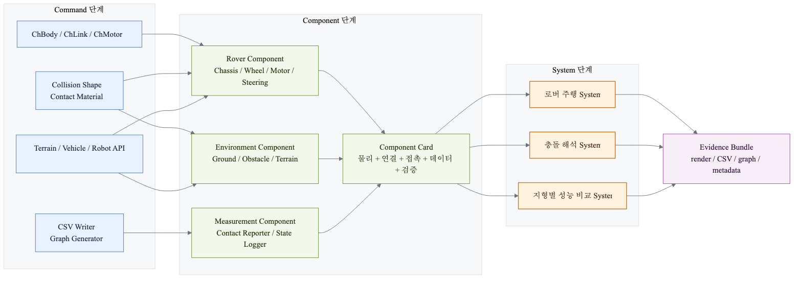
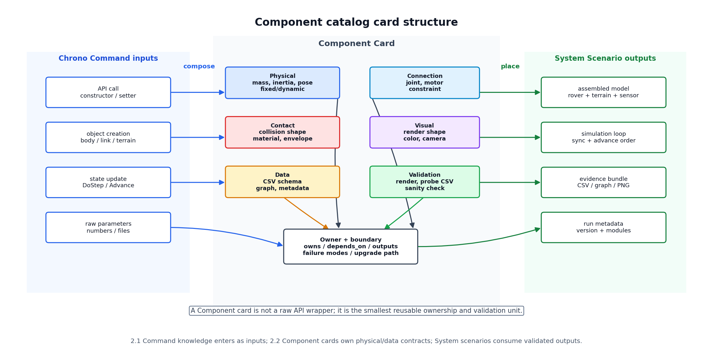
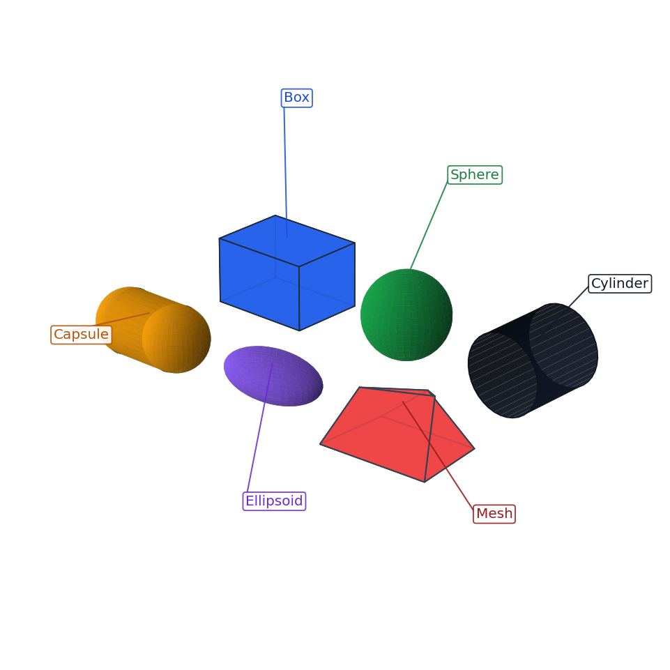
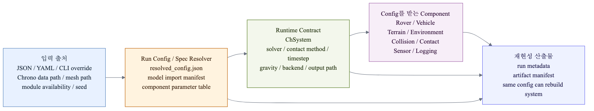
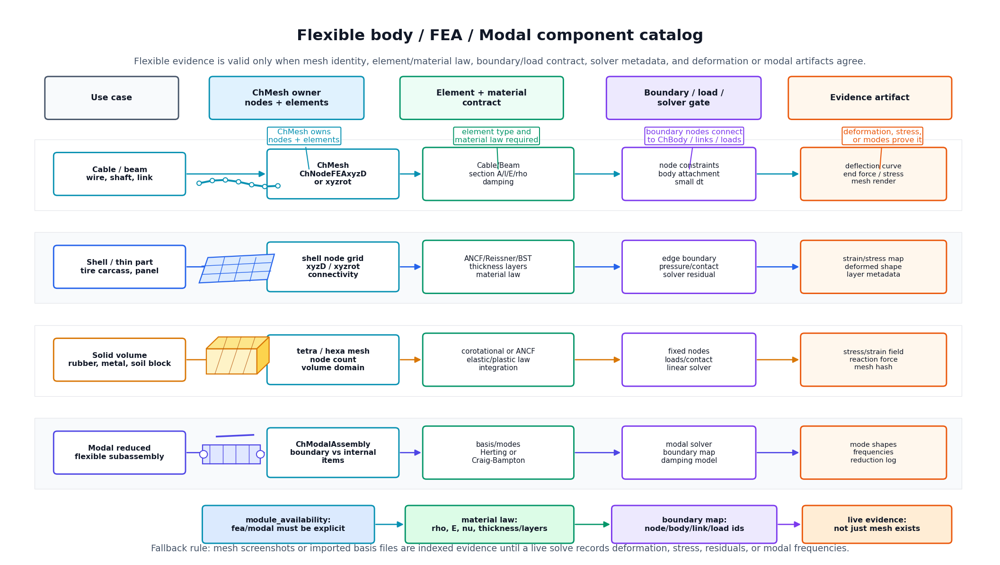
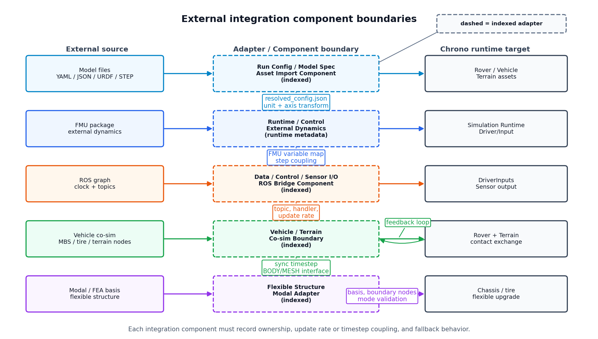

# 2.2.1 Component 단계의 정의와 역할

## 2.2.1.1 Component 단계의 위치

본 보고서에서 Component는 Project Chrono의 API를 단순히 나열한 목록이 아니라, 실제 가상환경을 만들 때 반복적으로 재사용할 수 있는 **시뮬레이션 부품 설계 단위**이다. Command 단계가 `ChBody`, `ChLink`, `ChMotor`, `ChContactMaterialNSC`, `RigidTerrain`처럼 하나의 기능을 호출하는 방법을 정리한다면, Component 단계는 그 Command들을 묶어 "차체", "바퀴", "조향부", "지형", "장애물", "접촉 로거"처럼 구현 대상의 구성요소로 재정의한다.

System 단계는 이러한 Component를 조합해 하나의 실험 시나리오를 만든다. 예를 들어 "로버가 장애물에 충돌하는 실험"은 Chassis Component, Collision Shape Component, Ground Component, Obstacle Component, Contact Reporter Component, State Logger Component가 결합된 System이다.



*그림 2.2.1-1. Command 호출 단위가 Component 설계 단위를 거쳐 System 실험으로 조합되는 관계*

## 2.2.1.2 공식 module과 보고서 Component의 차이

Chrono 공식 문서에서 module은 Core, Vehicle, Sensor, Visualization, Postprocess처럼 빌드 옵션과 기능 경계를 뜻한다. Chrono::Vehicle 내부의 subsystem도 suspension, steering, driveline, tire처럼 공식 Component에 가까운 이름을 갖는다. 반면 본 절의 Component는 실제 모델링 과정에서 독립적으로 설계하고 재사용할 수 있는 "부품" 단위이다. 예를 들어 `ChBodyEasyBox`는 Command이지만, 질량, 시각 형상, 충돌 형상, 초기 위치, 초기 속도, 로깅 스키마까지 함께 정의하면 Chassis Component가 된다.

| 구분 | Chrono 관점 | 본 보고서의 Component 관점 |
| --- | --- | --- |
| Core | `ChSystem`, `ChBody`, `ChLink`, `ChMotor` | 차체, 바퀴, 장애물, 축, 조인트, 구동 모터 |
| Vehicle | `WheeledVehicle`, `RigidTerrain`, `SCMTerrain` | 차량 하위 부품과 지형 부품을 조립하는 고수준 Component |
| Robot | Curiosity, Viper, Turtlebot 등 내장 로봇 모델 | 완성 로버 예시 또는 System 단계로 확장할 기준 모델 |
| Visualization | Irrlicht, VSG, visual shape | Render/Screenshot Component, 실제 렌더링 기반 시각 자료 |
| Sensor | Camera, Depth/Segmentation Camera, LiDAR, GPS, IMU, Radar, Tachometer | sensor manager, mount pose, filter chain, output writer를 포함한 확장 Component |
| Postprocess/Python I/O | CSV, graph, export utility | State Logger, Control Logger, Graph Generator |

## 2.2.1.3 Component의 최소 구성

Component는 여러 Command를 조합해 만든 재사용 가능한 시뮬레이션 부품이다. 하나의 Component는 최소한 다음 정보를 포함한다.

| 항목     | 설명                        | 예                                                              |
| --- | --- | --- |
| 물리 표현  | 질량, 관성, 위치, 속도, 고정 여부     | `ChBody`, `SetMass`, `SetPos`, `SetFixed`                      |
| 연결 표현  | 조인트, 모터, 제약 조건            | `ChLinkLockRevolute`, `ChLinkMotorRotationSpeed`, `ChLinkTSDA` |
| 접촉 표현  | 충돌 형상, 접촉 재질, 충돌 시스템      | `ChCollisionShapeBox`, `ChContactMaterialNSC`                  |
| 시각 표현  | 렌더링용 형상, 색, 텍스처           | `ChVisualShapeBox`, `ChVisualShapeCylinder`, mesh visual       |
| 데이터 표현 | CSV 컬럼, 그래프, 이벤트          | `time_s`, `x_m`, `contact_force_N`, `event`                    |
| 검증 표현  | 렌더 이미지, 그래프, sanity check | VSG/Irrlicht 렌더, CSV 그래프, 접촉 개수                                |



*그림 2.2.1-2. Component를 정의, API, 설계 변수, 구현 예시, 시각화, 데이터 검증, 주의사항으로 기록하는 카드 구조*

## 2.2.1.4 Component 기술 기준

Component 단계의 설명은 단순한 기능 소개가 아니라, Project Chrono에서 해당 부품을 어떻게 정의하고 검증할 수 있는지를 함께 제시해야 한다. 따라서 각 Component는 **정의 → 관련 API → 설계 변수 → 구현 예시 → 시각화 결과 → 데이터 검증 → 주의사항**의 흐름으로 정리하였다. 이 구성은 실제 모델링 절차와 검증 절차를 함께 보여주기 때문에, Command 단계의 API 지식을 System 단계의 완성 시나리오로 연결하는 기준이 된다.

| 기술 항목 | 기술 내용 |
| --- | --- |
| Component 정의 | 이 부품이 현실 세계에서 무엇에 해당하는지, System에서 어떤 역할을 하는지 |
| 주요 Command/API | 어떤 Chrono class와 method가 사용되는지 |
| 설계 변수 | 질량, 크기, 마찰, 위치, 속도, 강성, damping, grid spacing 등 |
| 코드 예시 | 최소 실행 스니펫과 실제 실행 파일 경로 |
| 시각화 결과 | 렌더 이미지 또는 시각 자료로 Component의 배치와 형상을 확인 |
| 그래프/CSV | 저장되는 값과 그래프가 검증하는 물리량을 설명 |
| 확장 방향 | Core 구현에서 Vehicle/Robot/Sensor 모듈로 확장하는 방법 |

실제로 Component를 고를 때는 API 이름만으로는 부족하다. 같은 바퀴라도 단순 형상 확인에는 Core cylinder가 충분하지만, 타이어 힘 모델이 필요하면 Vehicle tire subsystem을 선택해야 한다. 따라서 각 Component 설명은 다음 정보를 함께 제공한다.

| 선택 정보 | 확인할 내용 |
| --- | --- |
| 역할 | System 안에서 이 Component가 담당하는 물리 기능과 연결 대상 |
| 선택 기준 | 단순 형상, 동역학 정확도, 접촉 안정성, 센서 확장성 중 무엇을 우선하는지 |
| 주요 API/모듈 | Core API로 충분한지, Vehicle/Robot/Sensor 모듈이 필요한지 |
| 조정 변수 | 크기, 질량, 위치, 재질, 강성, 감쇠, 입력 명령처럼 실험자가 바꿀 수 있는 값 |
| 확인 산출물 | 렌더 이미지, CSV, 그래프 중 어떤 자료로 정상 배치와 정상 동작을 검증하는지 |
| 주의사항 | 초기 침투, 좌표계 불일치, visual/collision 불일치, 과도한 mesh 복잡도 같은 실패 조건 |
| 확장 경로 | 최소 Core 구현에서 고수준 subsystem 또는 실제 로봇 모델로 넘어가는 방법 |

### Component 카탈로그 카드 형식

Component를 빠르게 비교할 수 있도록 각 부품은 가능하면 같은 카드 형식으로 정리한다. 코드 블록은 API 호출법을 길게 설명하기 위한 것이 아니라, 카드에 적힌 설계 기준을 실제 Chrono 객체로 연결하는 최소 예시로 둔다.

| 카드 필드 | 질문 | 작성 예 |
| --- | --- | --- |
| 목적 | 이 Component가 System에서 책임지는 물리/데이터 역할은 무엇인가 | Chassis는 기준 강체와 로깅 기준 body를 제공 |
| 소유 책임 | 이 Component가 직접 소유하는 상태와 산출물은 무엇인가 | 질량, 관성, 위치/자세, 시각 형상, 충돌 형상, 상태 CSV |
| 의존 대상 | 어떤 다른 Component 또는 모듈에 의존하는가 | Wheel은 Terrain과 Contact Material에 의존 |
| Chrono 구현 클래스 | 어떤 Chrono class/subsystem으로 구현 가능한가 | Core `ChBody`; Vehicle `ChChassis`; Robot Viper body |
| 조정 변수 | 실험자가 바꿀 주요 설계 변수는 무엇인가 | 크기, 질량, 마찰, 강성, 감쇠, 갱신 주기 |
| 산출물 | 어떤 CSV, 그래프, 렌더 이미지가 생성되는가 | `outputs/csv/...`, `images/graphs/...`, `images/renders/...` |
| 검증 자료 | 정상 배치/동작을 무엇으로 확인하는가 | 주석이 달린 렌더 이미지, 궤적 그래프, 접촉력 그래프 |
| 주의/실패 조건 | 자주 실패하는 조건은 무엇인가 | 초기 침투, 축 방향 오류, visual/collision 불일치 |
| 확장 경로 | 더 정교한 Chrono 모듈로 어떻게 넘어가는가 | Core cylinder wheel → Vehicle tire subsystem |

이 형식의 핵심은 Command 단계와의 경계를 분명히 하는 것이다. `ChBodyEasyBox()`를 어떻게 호출하는지는 Command 지식이고, 그 호출을 어떤 부품 계약으로 묶어 재사용할지, 어떤 출력으로 검증할지가 Component 지식이다.

### Component 생애주기 관리 기준

Component는 생성만으로 끝나지 않는다. Chrono System에 들어간 뒤 초기화, 동기화, 시간 전진, 로그/렌더 출력까지 같은 순서로 관리되어야 System 단계에서 재사용할 수 있다.

| 단계 | Core 원형 구현 | Vehicle/Robot 하위 시스템 | Logger/Render 위치 |
| --- | --- | --- | --- |
| 생성 | `ChBody`, `ChLink`, material, visual/collision shape를 만들고 `ChSystem`에 추가 | vehicle/robot object와 subsystem parameter를 구성 | schema, output path, render camera를 준비 |
| 초기화 | body pose, joint frame, motor function, collision enable을 확정 | `SetInitPosition`, tire/terrain/visualization type 설정 후 `Initialize()` | 메타데이터에 초기 pose, timestep, module 상태 기록 |
| 동기화 | 직접 만든 Core object는 입력 command를 link/motor에 적용 | `driver.Synchronize`, `terrain.Synchronize`, `vehicle.Synchronize(time, inputs, terrain)` | 현재 입력, event, contact pair를 같은 `time_s` 기준으로 맞춤 |
| 시간 전진 | `system.DoStepDynamics(step)` 또는 subsystem advance 전후 관계 확인 | `driver.Advance`, `terrain.Advance`, `vehicle.Advance`, `vis.Advance` | step 후 body state/contact force를 기록 |
| 검증 | 초기 침투, 축 방향, visual/collision offset, force sign 확인 | subsystem별 tire/terrain/driver 상태와 output 비교 | render, CSV, graph가 같은 Component 이름을 가리키는지 확인 |

### 좌표계/단위 관리 기준

모든 Component 카드는 좌표계와 단위를 명시해야 한다. 같은 값이라도 전역 좌표계, 물체 기준 좌표계, 조인트 좌표계, 접촉 좌표계 중 어디에서 표현되는지에 따라 의미가 달라진다.

| 항목 | 계약 |
| --- | --- |
| 전역 좌표계 | 위치, 속도, terrain query, CSV 기본 force component는 world frame 기준으로 기록한다. |
| 물체 기준 좌표계 | visual/collision shape offset, payload mount, sensor offset pose는 parent body 기준 local frame으로 기록한다. |
| 조인트 좌표계 | wheel axle, steering hinge, suspension link는 joint frame 위치와 축 방향을 별도 Component 변수로 둔다. |
| 접촉 좌표계 | Chrono contact callback force는 contact frame 값일 수 있으므로 world component로 저장하기 전 변환 여부를 명시한다. |
| 바퀴 축 | cylinder visual 축, revolute joint 축, motor rotation 축이 같은 방향인지 렌더와 CSV로 검증한다. |
| 조향 입력 | driver `steering`은 보통 normalized input이며 실제 wheel angle과 같다고 가정하지 않는다. |
| 단위 접미사 | CSV 컬럼은 `x_m`, `vx_mps`, `time_s`, `contact_force_N`, `drive_torque_Nm`처럼 단위를 이름에 포함한다. |

## 2.2.1.5 Core 기본 형상과 custom Component

Core API로 직접 Component를 만들 때는 기본 형상을 조합해 시작한다. 단순 box와 cylinder만으로도 chassis, ground, wheel, obstacle을 빠르게 만들 수 있고, visual 품질이 필요할 때 mesh를 추가한다. 반대로 접촉 계산에서는 복잡한 visual mesh를 그대로 쓰기보다 box, sphere, cylinder, capsule 같은 단순 collision shape로 근사하는 편이 안정적이다. Chrono::Vehicle 또는 Chrono::Robot의 내장 모델이 제공하는 component mesh는 2.2.2의 차량 Component 절에서 별도로 다룬다.

| 시각 자료 |
| --- |
|  |

*그림 2.2.1-3. box, sphere, cylinder, capsule, ellipsoid, triangle mesh의 기본 형상 예시이다. 같은 형상이라도 visual shape와 collision shape의 목적이 다르므로 Component 설계에서 따로 선택한다.*

아래 코드는 같은 box 형상을 visual과 collision 목적으로 동시에 켜는 가장 작은 예시이다. 실제 Component 문서에서는 이 한 줄을 그대로 끝내지 않고, 질량, 위치, 재질, 검증 이미지까지 함께 기록한다.

```python
material = chrono.ChContactMaterialNSC()
body = chrono.ChBodyEasyBox(
    1.0, 0.6, 0.3,
    350,
    True, True,  # visual shape, collision shape
    material,
)
body.SetName("component_box")
system.AddBody(body)
```

| 기본 형상 | 이미지 색 | 대표 API | 주 사용처 | 선택 기준 |
| --- | --- | --- | --- | --- |
| Box | 파란색 | `ChVisualShapeBox`, `ChCollisionShapeBox`, `ChBodyEasyBox` | chassis, ground, obstacle, payload | 가장 빠르고 안정적인 기본 형상. 평면, 벽, 박스형 부품에 우선 사용 |
| Sphere | 초록색 | `ChVisualShapeSphere`, `ChCollisionShapeSphere` | marker, ball, 단순 접촉 probe | 방향성이 없고 접촉이 안정적이다. 센서 위치 표시나 검증용 물체에 적합 |
| Cylinder | 검은색 | `ChVisualShapeCylinder`, `ChCollisionShapeCylinder`, `ChBodyEasyCylinder` | wheel, roller, axle, pulley | 회전 부품의 기본 형상. 축 방향과 local frame을 반드시 확인 |
| Capsule | 주황색 | `ChCollisionShapeCapsule` 계열 | rounded link, rod, protective envelope | 끝이 둥근 막대 접촉에 적합하다. link 충돌을 box보다 부드럽게 근사할 때 사용 |
| Ellipsoid | 보라색 | ellipsoid visual/collision 계열 또는 mesh 근사 | sensor housing, 완만한 외피 | 시각 표현에는 유용하지만 collision은 단순 primitive 조합으로 근사하는 편이 안정적 |
| Triangle Mesh | 빨간색 | `ChVisualShapeTriangleMesh`, mesh collision | CAD 외형, 복잡한 장애물, 지형 mesh | visual에는 좋지만 collision mesh는 계산량과 안정성을 확인한 뒤 제한적으로 사용 |

### Visual Asset Component Card

Visual Asset은 Collision Shape와 별도 Component이다. Chrono의 `ChVisualModel`은 여러 visual shape instance와 각 shape frame을 담을 수 있고, `ChVisualShape`는 material, visibility, texture, mutability, bounding box 같은 렌더링 정보를 소유한다. 따라서 예쁜 mesh screenshot만으로 collision/contact 검증을 대신하면 안 된다.

| 항목 | 필요한 내용 |
| --- | --- |
| `visual_component_id` | body, terrain, sensor, imported asset에 붙는 stable visual id |
| `chrono_visual_family` | `ChVisualModel`, `ChVisualShapeBox/Sphere/Cylinder/TriangleMesh/ModelFile`, `ChVisualMaterial` 등 |
| `shape_frame_local` | visual model frame 기준 shape pose; body REF/COM frame과 다른 경우 명시 |
| `material_visual` | diffuse color, opacity, material id, texture path/hash, texture scale |
| `visibility_policy` | visible/hidden, wireframe, double-faced, debug-only, screenshot-only 여부 |
| `mutable_or_deformable` | `SetMutable` 또는 deformable visualization처럼 runtime에 shape가 바뀌는지 |
| `bounding_box` | visual shape/model AABB 또는 expected footprint |
| `collision_equivalence` | `same_as_collision=false`가 기본값. 같은 mesh를 쓰는 경우에도 collision proxy id를 별도로 기록 |
| `output_artifact` | render PNG, offline export manifest, visual asset manifest 행 |

## 2.2.1.6 Component 분류 체계

본 절에서는 다음 Component를 다룬다. MVP0 하나에 한정하지 않고, Chrono를 이용해 로버/환경/접촉/데이터를 구축할 때 반복적으로 등장하는 부품을 기준으로 분류했다.

다만 모든 Component가 같은 수준으로 구현된 것은 아니다. 교수님 요구사항의 "완성된 학습 로드맵" 관점에서는 현재 구현한 핵심 흐름과 향후 확장 색인을 구분해야 한다. 본 보고서에서는 다음 기준으로 범위를 표시한다.

| 범위 | 해당 Component | 보고서에서의 의미 |
| --- | --- | --- |
| 현재 구현/검증 완료 | Core Runtime, Chassis/Wheel/Motor/Steering, Ground/Obstacle, RigidTerrain, SCMTerrain, Contact Logger, State/Control Logger, Render/Graph | 이번 학기 코드와 산출물로 실제 확인한 학습 로드맵의 중심 |
| 현재 구현 기반 확장 | Heightmap terrain, waypoint driver, PPO driver, 실행 메타데이터/manifest | 현재 구조 위에 실험 조건을 바꾸어 바로 확장할 수 있는 항목 |
| 향후 확장 색인 | Sensor, FEA, Modal, FMI, ROS, VehicleCosim, SynChrono, DEM/Granular/CRM | Chrono 공식 기능을 장기 로드맵에 연결하기 위한 색인. 실제 검증 자료가 생기기 전에는 구현 완료로 주장하지 않는다 |

| 분류 | 대표 Component | 주요 산출물 |
| --- | --- | --- |
| Runtime/Config Component | Simulation Runtime, Physics Context, Run Config, Model Spec Resolver | run 메타데이터, resolved config, stability checklist |
| External Integration Component | Asset Import, FMI/FMU Adapter, ROS Bridge, Vehicle Co-sim Boundary, Modal Adapter | external integration map, 산출물/interface 메타데이터, sync 관리 기준 |
| Flexible/FEA/Modal Component | `ChMesh`, node set, element set, material/section law, load/boundary, modal reduced assembly | flexible mesh manifest, deformation/stress 검증 자료, mode/frequency table |
| 로버/차량 Component | Chassis, Payload/Sensor Mount, Wheel/Tire, Axle/Joint, Motor/Drive, Steering, Suspension, Visual Shape, Collision Shape, Driveline, Brake, Powertrain, Track Shoe | 렌더 이미지, 상태 CSV, 속도 그래프, 구조 이미지 |
| 환경/Terrain Component | Ground, Obstacle, Contact Material, RigidTerrain, Heightmap/Mesh Patch, SCMTerrain, FlatTerrain, CRGTerrain, GranularTerrain, FEATerrain, CRMTerrain, 외력/중력 설정 | 지형 렌더, 높이/마찰/침하 CSV, 접촉력 그래프 |
| 충돌/접촉 측정 Component | Collision Shape, Contact Material, Contact Reporter, Contact Force Logger, Collision Event Detector, Debug Visualization | 접촉 렌더, 접촉력 CSV, 접촉 개수/이벤트 그래프 |
| 데이터 출력/시각화 Component | State Logger, Control Logger, CSV Schema, 메타데이터 Logger, Graph Generator, Render/Screenshot, Sensor Manager, Filter Chain, Camera, LiDAR, GPS, IMU, Radar, Tachometer | 상태/제어 CSV, 궤적 그래프, 센서 배치 렌더, sensor manifest |

| Component 카탈로그 atlas |
| --- |
|  |

*그림 2.2.1-4. 이 그림은 분류표를 실제 장면으로 다시 묶은 전역 atlas이다. Runtime/Config frame 안에 rover body, wheel/tire, axle/joint, motor/drive, steering/suspension, terrain patch, obstacle, collision shape, contact point, sensor, CSV/graph/render 산출물가 함께 배치되어 있다. 각 callout은 해당 Component의 기준 담당 문서 section으로 들어가는 진입점이다.*

### 전역 카탈로그 읽는 기준

Chrono 공식 module은 빌드/기능 경계이고, 이 보고서의 Component는 실제 대상과 환경을 설계하고 검증하는 책임 단위이다. 따라서 어떤 항목이 여러 장에 반복되면 아래 규칙으로 읽는다.

| 질문 | 먼저 볼 곳 | 이유 |
| --- | --- | --- |
| 이 값/형상/로그를 누가 소유하는가 | README의 전체 Component 카탈로그와 이 절의 카드 형식 | 기준 담당 문서를 먼저 정해야 중복 설명이 충돌하지 않는다. |
| 어떤 Chrono module이 필요한가 | README의 공식 Chrono 모듈 대응 표 | 모듈 사용 가능성과 대체/예시 표기 기준이 실행 가능성을 결정한다. |
| 어떤 산출물이 이 Component를 설명하고 검증하는가 | README의 검증 자료/산출물 색인과 2.2.5 manifest schema | 렌더/CSV/그래프가 어떤 Component를 가리키는지 역추적한다. |
| 2.1 Command 지식인가 2.2 Component 지식인가 | README의 2.1 Command와 2.2 Component 경계 점검 | API 호출법과 Component 설계/검증 기준을 분리한다. |
| System 단계로 넘길 준비가 되었는가 | 생애주기, 좌표계/단위, Runtime/Config 기준 | Component id, 좌표계, 단위, 메타데이터가 없으면 System 재현성이 약하다. |

### Simulation Runtime / 물리 실행 환경 Component

Runtime Component는 다른 Component를 담는 Chrono 물리 컨텍스트이다. Chassis, Terrain, Contact Logger가 잘 정의되어 있어도 Runtime이 접촉 방식, solver, timestep, 중력, collision backend를 소유하지 않으면 실험 결과를 재현할 수 없다.

Chrono `ChSystem`은 assembly, solver, timestepper, collision system, system-wide parameters, counters, timers를 함께 관리한다. 특히 gravity vector의 기본값은 `[0, 0, 0]`이므로, Component-backed run은 반드시 `gravity_mps2`, up/down axis convention, gravity setter source를 메타데이터에 남긴다. `SetGravityZ()` 같은 convenience setter를 쓴 경우에도 최종 vector 값을 기록한다.

| 카드 필드 | 계약 |
| --- | --- |
| 목적 | 모든 물리 Component가 들어갈 `ChSystem`과 시간 적분/접촉 계산 조건을 정의 |
| 소유 책임 | `ChSystemNSC/SMC`, contact method, solver, timestepper, collision backend, gravity, step size, collision envelope/margin |
| 의존 대상 | Chrono build module, Core/Vehicle/Robot/Sensor component 요구사항 |
| Chrono 클래스 | Core `ChSystemNSC`, `ChSystemSMC`, solver/timestepper/collision system 설정 API, Vehicle/Robot wrapper runtime |
| 조정 변수 | `dt`, gravity vector, solver type/tolerance, max iterations, collision system, NSC/SMC 선택 |
| 산출물 | `run_metadata.json`, `stability_checklist.md`, solver/contact method record |
| 검증 자료 | Runtime/Config map render, material-method compatibility check, contact force/time-step sanity graph |
| 주의/실패 조건 | NSC/SMC material mismatch, gravity 누락, timestep 과대, collision margin이 메타데이터에 없음 |
| 확장 경로 | Core `ChSystemNSC` prototype -> `ChSystemSMC` compliant contact -> Vehicle/Robot wrapper runtime |

### Contact Method Runtime 관리 기준

Contact method는 collision/contact 장의 세부 사항이면서 동시에 Runtime에서 가장 먼저 정해야 하는 선택이다. Chrono는 hard, non-smooth contact를 `ChSystemNSC`로, smooth/penalty-based contact를 `ChSystemSMC`로 나누므로, material class와 solver/timestepper 검증 자료가 같은 기준 안에서 맞아야 한다.

| Runtime 항목 | 필요한 내용 | 중요한 이유 |
| --- | --- | --- |
| `contact_method` | `NSC` 또는 `SMC`; instantiated system class `ChSystemNSC/ChSystemSMC` | 같은 geometry라도 hard/compliant contact 해석이 달라진다. |
| `material_class_match` | `ChContactMaterialNSC` 또는 `ChContactMaterialSMC`가 system method와 맞는지 | material mismatch는 force/restitution 결과를 해석 불가능하게 만든다. |
| `smc_contact_force_model` | `Hooke`, `Hertz`, `PlainCoulomb`, `Flores` 등 SMC normal force model | SMC force peak와 penetration을 비교할 기준이다. |
| `smc_adhesion_model` | `Constant`, `DMT`, `Perko` 등 adhesion force model 또는 `none` | adhesion을 켠 경우 contact force baseline이 달라진다. |
| `smc_tangential_displacement_model` | `None`, `OneStep`, `MultiStep` 등 tangential displacement policy | tangential history가 friction 결과에 영향을 준다. |
| `smc_contact_stiff` | stiff contact flag, stiffness/damping provenance | timestep과 solver tolerance 요구가 달라진다. |
| `max_penetration_recovery_speed_mps` | 전역 penetration 회복 속도 설정과 출처 | penetration correction이 bounce/contact force 해석에 영향을 준다. |
| `min_bounce_speed_mps` | NSC에서 사용하는 저속 반발 임계값 | 저속 restitution 검증 자료를 해석할 때 필요하다. |

### Run Config / 모델 명세 Component

Run Config Component는 코드 안에 흩어진 숫자를 실험 가능한 parameter source로 정리한다. Vehicle JSON, YAML, dataclass config, Chrono data file path는 모두 이 Component가 resolve한 뒤 각 물리 Component에 전달되어야 한다.

| 카드 필드 | 계약 |
| --- | --- |
| 목적 | component parameter의 출처, 단위, 기본값, override 순서를 고정 |
| 소유 책임 | resolved config, config schema version, raw config path, profile, CLI overrides, unit convention, random seed, scenario id, component enable/disable flag, 대체/예시 표기 기준 |
| 의존 대상 | Runtime, Vehicle parser, local Chrono data path, report output layout |
| Chrono 클래스 | Vehicle JSON/parsers, custom dataclass/YAML config, Chrono data path helpers |
| 조정 변수 | JSON/YAML path, CLI override, default profile, module availability, Chrono data root |
| 산출물 | `resolved_config.json`, component parameter table, 메타데이터 summary |
| 검증 자료 | resolved config hash, parameter table diff, missing asset/module check |
| 주의/실패 조건 | stale JSON path, unit 없는 값, 코드 기본값과 문서 값 drift, seed 미기록 |
| 확장 경로 | hard-coded constants -> dataclass config -> Chrono Vehicle JSON + resolved manifest |

### Model Spec Resolver Component

Model Spec Resolver는 외부 모델 파일을 Chrono object로 직접 바꾸는 parser 호출 자체가 아니라, 여러 파일 계층과 asset path를 안정적인 Component id, frame, unit, 대체/예시 표기 기준로 해석하는 책임 단위이다.

| Spec 계열 | 소유 책임 | Chrono 구현 기반 | 필수 manifest 항목 | 주의/실패 조건 |
| --- | --- | --- | --- | --- |
| Chrono Vehicle JSON hierarchy | top-level vehicle JSON, nested subsystem `Input File`, tire/powertrain/driveline/terrain JSON, Chrono Vehicle data root | Chrono::Vehicle JSON model pattern, `vehicle::GetVehicleDataFile` style data lookup | `raw_path`, `resolved_path`, `path_base=VehicleData`, subsystem id map, file hash, schema/version note, owner Component id | nested input file drift, tire/terrain JSON mismatch, data root differs by machine |
| Chrono YAML hierarchy | simulation YAML, model YAML, solver YAML, output/visualization config, model-to-global frame transform | Chrono::Parsers YAML simulation/model/solver parser family | sim/model/solver YAML path/hash, output dir, visualization flag, solver settings, unit/frame transform, generated output policy | solver YAML and model YAML from different scenarios, output disabled but expected 산출물s listed |
| URDF/XML import | link/joint tree, root init pose, actuation type, mesh/collision policy, body contact material override | Chrono::Parsers URDF import path | URDF path/hash, root link, link/joint map, mesh path/hash, collision simplification, material override, init pose | visual mesh imported without collision proxy, 미지원 joint/actuator semantics, wrong root frame |

필요한 산출물은 `model_import_manifest.json`이다. 이 파일에는 `model.spec_resolver` id, 원본/해석 경로, path base, source hash, 담당 Component id, import status, 대체 처리 방식, 그리고 함께 생성되는 `external_interface_map.v1` 행을 포함한다.

| Runtime/Config 관계도 |
| --- |
|  |

*그림 2.2.1-5. Runtime은 `ChSystem`, solver/contact method, timestep, gravity, collision backend를 소유하고, Run Config는 JSON/YAML/CLI 입력을 단위가 확인된 `resolved_config.json`과 메타데이터로 고정한다. 이 그림은 2.1 Command처럼 `SetSolver` 호출 순서를 설명하는 것이 아니라, 각 물리 Component가 어떤 재현 조건과 parameter provenance를 받아야 하는지 보여주는 카탈로그 관점의 소유 책임 map이다.*

### 선택 모듈 사용 가능성 관리 기준

Chrono의 선택 모듈은 Component 자체라기보다 실행 가능한 기능 경계이다. 같은 `Vehicle`, `Sensor`, `FSI`, `FMI`라는 이름이 보이더라도, 이 보고서에서 Component 검증 자료로 인정하려면 모듈 사용 가능성과 산출물 출처가 함께 맞아야 한다. 모듈이 없는 환경에서 만든 개념 렌더나 예시 CSV는 설명 자료로 유지할 수 있지만, 실제 Chrono 검증으로 표시하지 않는다.

| 선택 모듈 계열 | 카탈로그 연결 | 필요한 실행 메타데이터 | 검증 기준 | 대체/예시 표기 |
| --- | --- | --- | --- | --- |
| `Vehicle`, `Robot` | `2.2.2` rover/vehicle model card, `2.2.3` terrain | `vehicle`, `robot`, model name, tire/terrain id, Chrono version | 실제 vehicle/robot 실행 CSV와 실행 출처 | 내장 asset 렌더 또는 스키마 확인용 검증 자료 |
| `Sensor`, `VSG`, `Irrlicht` | `2.2.5` sensor/render 산출물 | `sensor`, render backend, shader/OptiX/VSG 사용 가능성, camera/filter chain | 원본 frame/cloud/log 경로, sensor manifest, dropped-frame 메타데이터 | layout render only |
| `DEM`, `Granular`, `GPU`, `FSI`, `FSI_SPH`, `FSI_TDPF`, `CRM` | `2.2.3` advanced terrain extension | module key, particle/grid spacing, active domain, coupling timestep | domain 메타데이터가 포함된 실제 terrain/contact 실행 산출물 | 고급 지형 확장 카드로만 색인 |
| `FEA`, `Modal` | `2.2.1` flexible import, `2.2.2` tire/structure upgrade | mesh/basis path, material law, boundary node map, solver backend | deformation/stress/mode 검증 산출물 | flexible upgrade path로만 색인 |
| `Parsers`, `YAML`, `URDF`, `Cascade` | Run Config / Model Spec / Asset Import | raw path, hash, schema version, unit/up-axis transform | resolved config/import manifest | 누락된 asset/module은 실패 또는 대체 처리로 명시 |
| `FMI`, `ROS`, `VehicleCosim`, `Synchrono` | external integration boundary | interface map, clock/update rate, sync order, timeout/lag policy | 교환 변수/message가 있는 synchronized log | adapter 색인으로 기록하고, 실제 검증은 별도 실행 log가 있을 때 인정 |
| `Multicore`, `MUMPS`, `PardisoMKL` | Runtime/Solver backend | thread count, solver backend, build component found, tolerance/iteration budget | convergence/backend comparison log | generic solver 메타데이터로만 기록 |
| `CSharp`, `Matlab` | external language binding/interface | binding availability, bridge script path, variable map | adapter별 run manifest | adapter를 실제로 사용할 때만 검증으로 취급 |

| Chrono optional module dependency ladder |
| --- |
|  |

*그림 2.2.1-6. 위 그림은 Core runtime을 기준으로 도메인 모듈, 고정밀 물리 모듈, 연동/출력 모듈이 어떤 메타데이터와 검증 기준을 요구하는지 보여준다. README의 Chrono 모듈 조회표는 이 그림을 표 형태로 확장한 전역 색인이다.*

### Flexible Body / FEA Component 카탈로그

Chrono::FEA는 단순 mesh import 기능이 아니라 `ChMesh`가 node, element, material/section law, load, constraint, contact surface를 소유하고 `ChSystem`에 함께 들어가는 flexible body component 계열이다. Vehicle `ChFEATire`와 Vehicle `FEATerrain`은 이 일반 FEA 카탈로그를 domain-specific tire/terrain component로 특화해서 소비한다.

| Flexible / FEA / Modal 카탈로그 |
| --- |
|  |

*그림 2.2.1-7. Cable/beam, shell, solid, modal reduced assembly를 `ChMesh`/`ChModalAssembly` 소유 책임에서 검증 기준까지 연결한 카탈로그이다. `boundary node map`은 mesh node와 body/link/load attachment를 가리키고, `deformation/stress/mode evidence` 같은 검증 자료가 있어야 모듈 기반 flexible 해석으로 인정한다.*

| Flexible Component | 소유 책임 | Chrono 클래스/계열 | 필요한 메타데이터 | 검증 산출물 | 주의/실패 조건 |
| --- | --- | --- | --- | --- | --- |
| `flex.mesh` / `ChMesh` owner | flexible node/element 등록표, 시각화 surface, collision/contact surface 연결 | `chrono::fea::ChMesh`, `ChSystem::AddMesh` | mesh id/path/hash, node count, element count, mesh frame, visualization policy, contact surface id | mesh render, node/element manifest, mesh hash | mesh 파일만 있고 실제 solve가 없음, frame/up-axis 오류, element/material 참조 누락 |
| FEA node set | 자유도 좌표, node frame, 필요한 경우 mass/inertia | `ChNodeFEAxyz`, `ChNodeFEAxyzD`, `ChNodeFEAxyzrot`, node container API | node id, coordinate frame, 초기 position/orientation, boundary tag, attachment role | boundary/internal node map | node 순서 drift, boundary node가 body/link와 연결되지 않음 |
| FEA element set | node connectivity와 element formulation | cable/beam/shell/solid element 계열 | element id, element type, node id, integration point, section id, strain/stress 출력 정책 | deformed shape, stress/strain field, reaction/deflection graph | element type 미기록, connectivity 오류, node type 불일치 |
| Material / section law | 구성 법칙과 section property | `ChMaterial*`, beam section, shell layer, solid material law | `rho`, `E`, `nu`, 두께/layer, 면적/관성, damping, 필요한 yield/plastic parameter | material law manifest, section table | visual mesh를 물리 재료 법칙 없이 재사용 |
| Load / boundary / constraint | 고정 node, body attachment, pressure/load, FEA constraint | FEA constraint 계열, load, body-link attachment helper | boundary condition id, node/body/link id, load function, frame, unit | boundary node map, load vector render, reaction output | 과구속, attachment frame 누락, 잘못된 frame에 load 적용 |
| FEA contact surface | flexible contact interface | FEA contact surface 계열, contact material | contact surface id, 참여 node/element, material id, contact method, envelope/margin | contact pair log, flexible contact debug render | collision surface 누락, contact material 불일치 |
| Visualization/export | 변형 mesh와 field output | FEA visualization asset, VSG/Irrlicht/postprocess export 경로 | render backend, deformed/undeformed scale, field name, output path/hash | deformation render, stress/strain image, VTK/asset export manifest | 보기 좋은 mesh screenshot을 물리 검증 자료로 오해 |

### Modal Reduction Component

Modal은 FEA mesh를 단순히 더 빠르게 그리는 방법이 아니라, flexible assembly를 boundary/internal items로 나누고 modal basis로 축약하는 별도 component이다. `ChModalAssembly`는 reduced flexible model의 소유 책임을 가지며, full FEA와 같은 유효 범위로 overclaim하지 않도록 basis/source/reduction 메타데이터를 남겨야 한다.

| Modal card field | 관리 기준 |
| --- | --- |
| 목적 | full FEA assembly를 boundary DOF와 modal coordinate로 줄여 runtime cost를 낮춘 flexible structure |
| Chrono 클래스 | `chrono::modal::ChModalAssembly`, modal damping/reduction helpers |
| 소유 책임 | boundary object list, internal object list, reduction type, modal basis, modal damping, reduced mass/stiffness representation |
| 필요한 메타데이터 | source mesh/model hash, boundary node/body map, mode count, frequency table, eigenvector/basis hash, reduction method, damping model, solver backend, validity range |
| 산출물 | mode frequency table, mode-shape render, reduction log, boundary reaction/deformation probe |
| 검증 기준 | 실제 modal 검증에는 frequency/eigenvector data와 boundary response가 필요하며, basis 파일명만으로는 부족하다. |
| 주의/실패 조건 | boundary node map이 chassis/tire/beam attachment와 맞지 않음, 유효 범위 밖의 mode truncation, damping 미기록, reduced model만으로 full FEA stress를 주장 |

### Cross-Cutting 소유 책임 Boundary

Runtime/Config는 다른 장의 Component를 대체하지 않고 전역 source of truth를 제공한다. Terrain, Collision, Sensor 쪽 문서는 자기 도메인의 의미와 검증 산출물을 설명하고, Runtime/Config는 그 도메인이 어떤 실행 조건에서 재현되는지를 기록한다.

| 중복되어 보이는 항목 | Runtime/Config의 소유 | 도메인 Component의 소유 |
| --- | --- | --- |
| gravity | 전역 `gravity_mps2`, frame convention, run 메타데이터 | Environment Field가 slope/wind/scenario 의미와 비교 조건 설명 |
| collision backend | backend 이름, envelope/margin, contact method, module availability | Collision Backend/Envelope가 shape family, pair filtering, debug render 의미 설명 |
| solver/timestep | `dt_s`, timestepper, solver type/tolerance, max iterations | Contact/Terrain 그래프가 특정 조건에서 안정성 결과를 해석 |
| data paths | `chrono_data_root`, raw config path, resolved asset path | Vehicle/Robot/Sensor 장이 해당 asset을 어떤 Component에 붙이는지 설명 |

### Runtime/Config 산출물 관리 기준

Runtime/Config Component는 모든 장의 공통 전제이므로 별도 파일로 분리하지 않더라도 다음 산출물을 남기는 계약으로 관리한다.

| 산출물 | 소유 Component | 포함해야 할 항목 | 소비하는 Component |
| --- | --- | --- | --- |
| `run_metadata.json` | Simulation Runtime | Chrono version/build, enabled modules, contact method, solver, timestepper, `dt`, `gravity_mps2`, gravity axis/setter source, collision backend, envelope/margin, recovery/bounce speeds | Collision Logger, Terrain, Sensor/Visualization, report generator |
| `resolved_config.json` | Run Config / Model Spec | scenario id, parameter source, unit, override order, data file path, random seed, enabled Component flags | Rover, Terrain, Sensor, Logger |
| `component_parameter_table.csv` | Run Config / Model Spec | component name, parameter key, value, unit, source file/profile | Markdown report, regression comparison |
| `stability_checklist.md` | Simulation Runtime | material method match, timestep/contact stiffness sanity, solver iteration/tolerance, module 대체 예시 여부 | 긴 실행 전에 확인할 안정성 점검표 |

| 메타데이터 key | 예시 값 | 왜 필요한가 |
| --- | --- | --- |
| `contact_method` | `NSC` 또는 `SMC` | `ChContactMaterialNSC/SMC`와 Runtime이 맞는지 검증 |
| `gravity_mps2` | `[0, 0, -9.81]` 또는 `[0, -9.81, 0]` | Chrono default gravity가 zero이므로 누락과 axis 혼동을 구분 |
| `gravity_axis_convention` | `Z-up`, `Y-up`, custom world frame | terrain slope, sensor pose, imported asset frame 해석 |
| `gravity_setter_source` | `SetGravitationalAcceleration`, `SetGravityZ`, config field | 코드 기본값과 config override drift 추적 |
| `solver_type` | `BARZILAIBORWEIN`, `APGD`, `MINRES` 등 | force peak와 runtime drift 비교 시 해석 기준 |
| `solver_mode` | `iterative`, `direct`, `custom`, `module_backend` | max iteration/tolerance와 residual 해석 방식이 다름 |
| `solver_setup_solve_count` | `setup=120,solve=120` | solver가 step마다 기대한 순서로 호출되었는지 확인 |
| `timestepper_type` | `EULER_IMPLICIT_LINEARIZED`, `HHT`, `NEWMARK` 등 | contact compatibility와 integration error 기준 |
| `collision_backend` | default/Bullet/Multicore 등 | backend 차이로 contact count가 달라지는 상황 추적 |
| `max_penetration_recovery_speed_mps` | `0.6` 등 | penetration recovery가 bounce/contact force에 주는 영향 추적 |
| `min_bounce_speed_mps` | `0.15` 등 | NSC low-speed restitution threshold 추적 |
| `chrono_data_path` | local Chrono data directory | Vehicle/Robot mesh와 JSON asset 재현 |
| `scenario_seed` | integer seed | random terrain, obstacle field, replay 입력 재현 |
| `config_schema_version` | `2.2-component-v1` | 오래된 config와 새 카탈로그 필드 혼용 방지 |
| `raw_config_path` | `configs/rover_demo.yaml` | 원본 parameter source 추적 |
| `profile` | `rigid_ground_smoke` | 여러 실험 profile 비교 |
| `cli_overrides` | `dt=0.002,terrain=scm` | 실행 시점 override가 문서 값과 달라지는 상황 추적 |
| `resolved_config_hash` | SHA/hash string | 같은 설정으로 재실행했는지 확인 |
| `module_availability` | `vehicle=true,sensor=false` | 빌드 옵션에 따른 대체 예시 설명 |
| 대체 처리 정책 | `sensor_layout_render_only` | PyChrono/VSG/Sensor module 부재 시 산출물 의미 고정 |

### Core Physics / Solver / Constraint Component 카탈로그

공식 Chrono `ChSystem` 문서는 system을 body, link, integrator, tolerance가 함께 들어가는 simulation cornerstone로 설명한다. 공식 Link 문서도 `ChLinkMate`, `ChLinkLock`, `ChLinkMotor`를 서로 다른 제약/구동 family로 나눈다. 따라서 Component 카탈로그에서는 Core API를 배경 지식으로 숨기지 않고, 모든 로버/지형/충돌 Component가 의존하는 Core Physics family를 먼저 독립 Component로 읽을 수 있게 정리한다.

이 절은 `ChSystem.SetSolverType()` 같은 호출법을 반복하기 위한 곳이 아니다. Project Chrono로 가상환경을 만들 때 어떤 물리 부품이 어떤 상태와 검증 산출물을 책임지는지 빠르게 고르기 위한 카탈로그이다.

| Core Physics Component | 소유 책임 | Chrono 클래스/API 계열 | 주요 parameter | 사용하는 Component | 산출물/메타데이터 | 주의/실패 조건 |
| --- | --- | --- | --- | --- | --- | --- |
| Physics System / Assembly | system type, contact method, gravity, body/link registry, current time | `ChSystemNSC`, `ChSystemSMC`, `AddBody`, `AddLink`, `AddMesh` | contact method, gravity vector, collision system, body/link count | 모든 물리 Component | `contact_method`, `gravity_mps2`, registry summary | NSC/SMC mismatch, gravity 누락, body/link 미등록 |
| Solver Component | constraint/contact solve policy | `ChSolver` family, `SetSolverType`, custom solver attachment | solver type, max iterations, tolerance, warm start/preconditioner | link, motor, contact, FEA | solver 메타데이터, convergence note, iteration budget | joint drift, jitter, contact impulse noise, slow convergence |
| Timestepper Component | state integration policy | `ChTimestepper` family, `SetTimestepperType`, `DoStepDynamics` | fixed `dt_s`, timestepper type, substep policy, realtime cap | runtime loop, Vehicle advance, sensor manager | `dt_s`, timestepper, step count, realtime factor | tunneling, force peak 폭주, sensor timestamp drift |
| Rigid Body Component | body state and inertial properties | `ChBody`, `ChBodyAuxRef`, `ChBodyEasy*` | mass, inertia, COM, pose, velocity, fixed/kinematic policy | chassis, wheel, obstacle, ground, payload | state CSV, body 메타데이터, render callout | bad inertia, initial penetration, body frame/COM 혼동 |
| Link / Constraint Component | relative DOF 관리 기준 between two bodies | `ChLinkMate*`, `ChLinkLock*`, `ChLinkDistance`, `ChLinkTSDA`, `ChLinkRSDA` | body pair, frames, axes, constrained/free DOF, limits | axle, steering, suspension, mechanism | joint 메타데이터, reaction force/torque, axis render | wrong axis, over-constraint, infeasible initial pose |
| Motor / Actuator Component | commanded relative motion or effort | `ChLinkMotorRotation*`, `ChLinkMotorLinear*`, motor function APIs | command mode, function/source, saturation, rate limit | drive, steering, sprocket, external driver | control log, actual command, tracking error | speed motor를 physical torque로 오해, discontinuous command |
| Contact Material Component | solver contact law parameters | `ChContactMaterialNSC`, `ChContactMaterialSMC` | friction, restitution, rolling/spinning friction, stiffness/damping | collision shapes, terrain patch, tire/contact tests | material table, method compatibility check | material sharing side effect, NSC/SMC class mismatch |
| Collision Shape Component | solver geometry envelope | `ChCollisionShape*`, `ChCollisionModel`, compound/mesh shapes | shape family, local pose, envelope, margin, family mask | body, obstacle, terrain, contact reporter | debug render, shape 메타데이터, contact count | visual/collision confusion, thin shape, expensive mesh collision |

| Core physics solver/constraint 카탈로그 |
| --- |
|  |

*그림 2.2.1-8. 왼쪽의 body, link, motor, spring, contact material 카드는 각 부품의 물리 의미와 주요 파라미터를 설명한다. 가운데 `ChSystemNSC/SMC` Runtime은 contact method, solver, timestepper를 관리한다. 오른쪽 산출물은 solver 선택과 timestep이 실제로 안정적인지 확인하는 자료이다. 즉 Core Physics Component는 API 호출 묶음이 아니라 solver가 해석할 물리 조건과 그 검증 산출물의 묶음이다.*

### System Assembly / 항목 등록 기준

`ChSystem`은 body/link만 모으는 container가 아니라 solver/timestepper/collision system과 counter/timer까지 묶는 simulation object이다. System 단계로 넘기는 Component는 아래 등록 정보를 남겨야 검색/제거, contact reporter, logger, visualizer가 같은 object를 가리킬 수 있다.

| Registry field | 필요한 내용 |
| --- | --- |
| `system_name` / `system_class` | `ChSystemNSC` 또는 `ChSystemSMC`, scenario/run id |
| `item_id` / `item_name` | `ChBody`, `ChLinkBase`, `ChShaft`, `ChMesh`, other `ChPhysicsItem` stable name |
| `item_family` | body, shaft, link, mesh, contact container, sensor mount proxy, load/boundary |
| `owner_component_id` | README Global Component 카탈로그 id |
| `add_path` | `AddBody`, `AddLink`, `AddShaft`, `AddMesh`, generic `Add`, batch add 여부 |
| `active_fixed_sleeping` | active, fixed, sleeping policy/counts; body and shaft counters where relevant |
| `search_key` | logger/reporter/visualizer가 재사용할 name/id |
| `remove_or_replace_policy` | reset/rebuild 시 remove target과 stale reference handling |

### Solver / Timestepper 검증 기준

Solver와 timestepper는 단순한 실행 옵션이 아니라 검증 자료 해석의 일부이다. 공식 Simulation system 문서도 timestepper, solver, collision parameter를 주요 조정 대상으로 분리하고, HHT는 hard contact(DVI approach) system에 사용할 수 없다고 설명한다. 따라서 접촉이 많은 Component는 solver/timestepper 메타데이터 없이는 완결된 검증으로 보지 않는다.

| 검증 항목 | 필요한 내용 |
| --- | --- |
| `solver_type` | `ChSolver::Type` value 또는 custom solver class |
| `solver_mode` | iterative/direct/custom/module backend, warm start/preconditioner policy |
| `max_iterations` / `tolerance` | solver budget, residual tolerance, stopping rule source |
| `residual_or_convergence_status` | residual norm, convergence flag, failure/timeout reason if available |
| `solver_setup_count` / `solver_solve_count` | `ChSystem` setup/solve counters for the run |
| `solver_timers` | step/advance/collision/broad-narrow/solver timers available in the build |
| `timestepper_type` | `ChTimestepper::Type` or custom timestepper class |
| `dt_s` / `num_steps` | fixed step size, number of steps, realtime factor if used |
| `contact_compatibility` | NSC hard contact vs SMC compliant contact, HHT hard-contact exclusion guard |
| `sync_rates` | Vehicle/Sensor/ROS/FMU/co-sim update rates relative to dynamics `dt_s` |

### Solver / Timestepper Selection Table

Solver와 timestepper는 "성능 옵션"이 아니라 Component 결과를 바꾸는 물리/수치 계약이다. 접촉이 적은 장면, SMC penalty contact, track shoe가 많은 장면, sensor/co-simulation처럼 update rate가 다른 장면은 서로 다른 메타데이터와 검증 그래프를 요구한다.

| 시나리오 | Contact method | Solver/timestep 관점 | 필요한 메타데이터 | 검증 그래프/확인 |
| --- | --- | --- | --- | --- |
| simple rigid rover on flat ground | `NSC`가 보통 충분 | stable pose, reasonable contact count, joint drift 없음 | `dt_s`, solver type, iterations, gravity | contact force peak가 폭주하지 않고 wheel/body가 침투하지 않음 |
| stiff compliant contact | `SMC` | stiffness/damping이 클수록 더 작은 `dt`와 damping sanity가 필요 | stiffness, damping, `dt_s`, timestepper, material id | force peak vs timestep 비교, penetration이 허용 범위 안에 있음 |
| tracked vehicle / many contacts | `NSC` 또는 `SMC` | contact 수가 많아 solver iteration과 backend 차이가 결과에 영향 | collision backend, max iterations, contact count, envelope/margin | contact count graph, force component graph |
| SCM terrain / deformable terrain | Vehicle terrain + Runtime | terrain grid update와 vehicle advance 순서가 맞아야 함 | grid spacing, terrain advance order, `dt_s`, vehicle sync order | sinkage/time profile, terrain deformation render |
| sensor, ROS, FMI, co-simulation | Runtime + external sync | dynamics step과 publish/subscribe/FMU step이 다를 수 있음 | `dt_s`, external update rate, sync order, lag policy | timestamp alignment, dropped frame/message count |

### Solver Module / Backend 카탈로그

Solver 선택은 단순 성능 옵션이 아니라 contact, constraint, flexible body, large linear system의 해석 조건이다. Chrono build에서 직접 solver module이 활성화되는 경우에는 `solver_type`만으로는 부족하고, 아래 backend 메타데이터를 별도로 남겨야 한다.

| Solver/backend 계열 | 적합한 상황 | 필요한 메타데이터 | 검증/확인 | 실패 증상 |
| --- | --- | --- | --- | --- |
| Built-in iterative solvers | rigid body, ordinary rover/terrain/contact prototype | `solver_type`, max iterations, tolerance, warm start/preconditioner | contact force sanity, joint drift, iteration budget | jitter, slow convergence, constraint drift |
| `Multicore` backend | many bodies/contacts, high contact count, parallel collision/solver path | `multicore=true`, thread count, collision system, contact method, backend | contact count vs runtime, force component comparison | nondeterministic timing, backend-specific contact behavior |
| `MUMPS` direct solver | sparse direct solve path for larger constrained/FEA-style systems | `mumps=true`, direct solver available, matrix size, pivot/tolerance policy | convergence log, residual check | direct solver unavailable, memory growth, factorization failure |
| `PardisoMKL` direct solver | MKL-backed direct linear solve in supported builds | `pardisomkl=true`, MKL runtime, linear solver backend, thread count | residual/convergence log, runtime comparison | missing MKL runtime, inconsistent backend selection |
| GPU/parallel physics path | granular/DEM or GPU-enabled domain code path when available | `gpu=true`, device/backend id, particle/domain count, timestep | 모듈 기반 particle/domain 산출물 | 예시 plot을 GPU simulation으로 오해 |

### Rigid Body Component 관리 기준

Chassis, Wheel, Obstacle, Ground, Payload는 모두 특수한 Rigid Body Component이다. 각 문서에서 domain-specific 의미를 설명하더라도, body 자체의 재현 계약은 아래 필드를 공통으로 남겨야 한다.

| 항목 | 필요한 내용 |
| --- | --- |
| `body_name` | logger, reporter, render callout에서 쓰는 stable name |
| `body_role` | chassis, wheel, obstacle, ground, payload, marker처럼 System 안의 역할 |
| `fixed_dynamic_policy` | fixed, dynamic, kinematic/scripted 중 어느 방식인지 |
| `mass_kg` / `density_kgpm3` | 직접 지정 mass인지 primitive density로 계산했는지와 단위 |
| `inertia_kgm2` | 명시 inertia tensor 또는 "auto from primitive" 여부 |
| `ref_frame_policy` | `ChBody`는 pose가 COM 기준이고 visual/collision도 같은 frame을 따른다. REF frame이 별도로 필요한 경우 `ChBodyAuxRef` 사용 여부를 명시 |
| `com_offset_m` | body REF frame과 COM frame 차이, imported CAD/vehicle body에서 특히 필수 |
| `inertia_frame` | inertia tensor가 어느 local frame 기준인지와 principal-axis assumption |
| `initial_pose_world` | world xyz와 quaternion 또는 yaw-pitch-roll |
| `initial_velocity_world` | linear/angular velocity와 단위 |
| `collision_enabled` | collision on/off와 연결되는 Collision Shape id |
| `fixed_active_sleeping` | `SetFixed`, active state, sleeping allowed/current policy |
| `external_forces` | marker/force/load/accumulator id, application point frame, local/world flag |
| `visual_shape_ref` | primitive, mesh, color, texture 등 visual asset reference |
| `material_ref` | contact material id와 NSC/SMC method compatibility |
| `logger_targets` | state/contact/control logger가 추적할 body field |

`ChBodyAuxRef` upgrade condition: CAD import, Vehicle body, payload mount처럼 geometry/reference frame과 COM이 다르면 `ChBody` card에 `aux_ref_required=true`를 남기고 REF-to-COM transform, inertia frame, visual/collision local frames를 함께 기록한다. 단순 primitive body는 `ChBody`만으로 충분할 수 있지만, COM offset을 "나중에 계산 가능"으로 남기면 state logger와 visual/collision alignment가 쉽게 drift한다.

### Constraint / Link / Motor Component 카탈로그

Link와 Motor는 단순히 두 body를 "연결"하는 Command가 아니다. 각 link는 solver가 만족시켜야 하는 DOF 계약을 만들고, 각 motor는 그 계약 위에 imposed motion 또는 effort command를 추가한다. 따라서 rover axle, steering hinge, suspension spring, track sprocket은 모두 아래 family 중 하나로 해석할 수 있어야 한다.

| Link / Motor type | Component 의미 | 자유 DOF | 구속 DOF | Frame 항목 | 입력 항목 | 출력/확인 |
| --- | --- | --- | --- | --- | --- | --- |
| Fixed / lock link | 두 body를 rigid하게 붙임 | none | all relative motion | frame A/B, parent/child | none 또는 imposed motion | relative drift가 0에 가까움 |
| Revolute | wheel, hinge, steering pivot 회전 | one rotation | translation + other rotations | pivot, axis, frame convention | optional motor command | axis render, reaction torque |
| Prismatic | slider 또는 linear actuator guide | one translation | other DOF | axis, limits, reference pose | displacement/speed/force | travel limit, guide alignment |
| TSDA | 두 점 사이 translational spring-damper | distance changes | force law only | endpoint A/B local pose | stiffness, damping, rest length | force/travel graph |
| RSDA | 축 기준 rotational spring-damper | relative rotation | torque law only | rotational axis, rest angle | stiffness, damping | angle/torque graph |
| Speed motor | solver-enforced speed command | commanded rotation/translation | speed target enforced by constraint | motor frame, axis | speed function, rate limit | actual speed vs command |
| Torque motor | physical effort command | response determined by dynamics | motor itself does not lock pose | motor frame, axis | torque function, saturation | acceleration/torque log |
| Position motor | target pose/angle tracking | target trajectory | position-level target enforced | motor frame, axis | target function | tracking error, acceleration spike check |

모든 Link/Motor 카드는 `body_a`, `body_b`, `frame_a_local`, `frame_b_local`, `frame_a_abs`, `frame_b_abs`, 구속 좌표 mask, 반력/반토크 좌표계, disabled/broken/valid 상태, 초기 pose 오차, 담당 logger id를 함께 기록해야 한다. 이렇게 해야 Chrono class 계열이 달라져도 로버 axle, steering, suspension, motor의 검증 자료를 서로 비교할 수 있다.

### Function / Command Profile Component

Actuation function은 motor에 붙는 단순 보조 객체가 아니다. `ChFunction` 또는 sampling된 command source는 driver/control 의도를 속도, 위치, 토크, 조향, 제동, 외부 연동 입력으로 바꾸는 시간 이력 profile을 담당한다.

| 항목 | 필요한 내용 |
| --- | --- |
| `function_component_id` | stable id such as `drive.speed_profile.front_right` |
| `chrono_function_family` | `ChFunction` subclass, constant/ramp/sine/sequence/custom callback, or sampled CSV |
| `target_component_id` | motor, TSDA/RSDA law, steering controller, FMI/ROS input, terrain/load function |
| `input_unit` / `output_unit` | normalized command, rad/s, N*m, m, rad, N, dimensionless |
| `time_domain_s` | start/end time, extrapolation/hold policy, sample rate |
| `continuity_class` | discontinuity, derivative/jerk risk, smoothing/rate limit |
| `saturation` | min/max clamp, deadband, fail-safe value |
| `sampled_command_log` | CSV/schema path that records requested and applied values |

### Material / Surface Property 카탈로그

Chrono 프로젝트에서는 "material"이라는 말이 여러 계층에서 반복된다. Solver contact material, terrain friction query, tire model parameter, SCM soil parameter를 같은 값처럼 다루면 실험 해석이 흐려진다. 각 계층은 아래처럼 별도 Component가 소유하고 메타데이터에도 다른 이름으로 저장한다.

| 재질 관련 개념 | 담당 Component | 적용 대상 | 주요 항목 | 구분할 대상 | 필요한 메타데이터 |
| --- | --- | --- | --- | --- | --- |
| Contact material NSC | body/patch collision | hard contact solver | friction, restitution, rolling/spinning friction | terrain query friction | material id, `contact_method=NSC` |
| Contact material SMC | body/patch collision | compliant penalty contact | stiffness, damping, Young/modulus if used, adhesion | SCM soil deformation | material id, stiffness/damping units, `contact_method=SMC` |
| Terrain friction query | Terrain interface | tire/controller query at location | `GetCoefficientFriction(loc)` 또는 region friction profile | solver pair material | query source, location frame, interpolation policy |
| Tire parameters | Tire Component | wheel-terrain force model | tire model name, slip stiffness/curves, radius, rolling resistance | wheel collision material | tire model id, parameter source |
| SCM soil parameters | `SCMTerrain` | deformable soil grid | Bekker, cohesion, friction angle, Janosi, grid spacing | contact material only | soil profile id, grid spacing, calibration source |

### External Integration / Asset Import Component

외부 모델, 외부 제어, co-simulation, flexible model은 기본 rover-terrain-contact-data 흐름에 항상 필요한 것은 아니지만, 실제 Project Chrono 프로젝트에서는 중요한 Component 경계가 된다. 이들은 단순 API 호출이 아니라 파일, 프로세스, 시간 기준, 좌표계가 바뀌는 adapter이므로 Runtime/Config와 메타데이터 Logger가 소유 책임을 명확히 가져야 한다.

| Integration Component | 확장 담당 카드 | 외부 산출물 참조 | interface map | 동기화 기준 | 좌표계/단위 변환 |
| --- | --- | --- | --- | --- | --- |
| Model / Asset Import | Run Config / Model Spec / Asset Import | YAML/JSON/URDF/STEP 경로, hash, schema version | 원본 body/joint/mesh 이름 -> Chrono Component 이름 | load order, asset 사용 가능성 또는 대체 처리 | 원본 단위, up-axis, local/world frame, collision mesh policy |
| FMI / FMU External Dynamics | Runtime / Control External Dynamics | FMU file, FMI version, model exchange/co-sim mode | FMU variable -> Chrono state/input/control field | FMU step size, coupling order, lag policy | 단위 변환, 부호 관례, state frame |
| Vehicle Co-simulation | Vehicle/Terrain Co-sim Boundary | co-sim config, node type, tire/terrain data path | MBS node, tire node, terrain node, BODY/MESH interface | sync timestep, exchange order, timeout policy | terrain frame, mesh frame, tire force frame |
| Modal / Flexible Structure | Flexible Structure / FEA Upgrade | modal basis file, reduction type, source mesh | boundary node -> chassis/tire/beam attachment | solver backend, modal update policy | modal frame, boundary node frame, mode-shape scale |
| ROS Bridge | Data/Control/Sensor I/O | topic manifest, handler list, message type, QoS/update rate | ROS topic -> DriverInputs/Sensor/State Logger field | `/clock`, publish/subscribe rate, latency policy | ROS ENU/body frame -> Chrono frame, unit mapping |

### 공식 외부 연동 기능 대응 카탈로그

외부 통합 Component는 "파일을 읽었다" 또는 "topic을 붙였다"가 아니라, 외부 세계의 이름/단위/시간축을 Chrono Component id와 frame으로 변환하는 adapter이다. 아래 표는 공식 Chrono module/API 경계와 이 보고서의 Component 관리 기준을 분리한다.

| 공식 영역 | Chrono 구현 기반 | Component 관리 기준 | 필요한 검증 자료 | 대체/과장 표기 방지 기준 |
| --- | --- | --- | --- | --- |
| YAML model/spec parsing | Chrono::Parsers의 simulation/model/solver YAML과 `run_chrono` runner | top-level sim YAML, model YAML, solver YAML, resolved config, output directory policy | raw path/hash, resolved parameter table, module availability, unit/default 출처 | YAML 파일 존재만으로 실제 실행을 주장하지 않는다. 해석된 field가 Component id와 연결되어야 한다. |
| URDF/OpenSim/Adams import | Chrono::Parsers의 외부 모델 import 경로 | 원본 model file, imported body/joint name map, axis/unit conversion, missing-feature policy | import manifest, source hash, source-to-Chrono name table | import된 visual tree만으로 collision/contact 검증을 주장하지 않는다. |
| CAD/STEP via Cascade | Chrono::Cascade/OpenCASCADE STEP shape loading, mass/inertia 계산, 삼각화 visual mesh | STEP file hash, named shape hierarchy, tessellation settings, mass/inertia source, collision simplification policy | CAD import manifest, visual mesh 산출물, inertia table, collision proxy map | CAD visual mesh가 자동으로 안정적인 collision shape가 되는 것은 아니다. |
| FMI/FMU | Chrono::FMI의 FMU export/import와 co-simulation, FMI 2.0 지원, static-library build 조건 | FMU path/hash, FMI version, variable map, input/output causality, step size, lag/coupling order | FMU manifest, variable table, synchronized log, module/static-build 메타데이터 | 교환 변수와 timing을 기록하지 않으면 FMU co-sim 자료로 단일 Chrono 실행을 검증할 수 없다. |
| Chrono::ROS | clock/body/tf/vehicle driver input/sensor output용 ROS module과 handler | ROS graph/topic manifest, handler list, message type, update rate, IPC/pub-sub direction, `/clock` policy | topic log, handler manifest, latency/dropped-message fields, frame transform map | ROS topic 존재만으로 Component 검증이 되지 않는다. Chrono object mapping이 필요하다. |
| Vehicle co-simulation | force-displacement를 명시적으로 교환하는 Vehicle co-simulation MBS/tire/terrain node | node role, MPI rank/process id, tire/terrain data path, sync timestep, BODY/MESH interface | node manifest, exchanged state/force log, terrain/tire node 산출물 | MBS-only 실행을 terrain/tire co-sim 검증으로 해석하지 않는다. |
| SynChrono | MPI/DDS/FlatBuffers를 통한 agent-level Chrono::Vehicle/Robot 분산 시뮬레이션 | agent id, communication backend, synchronization period, world origin/GPS mapping, autonomy/controller interface | agent manifest, sync log, dropped/late packet fields, map/world frame 메타데이터 | multi-agent synchronization 자료는 tightly coupled physics 검증 자료와 다르다. |

### 외부 연동 Component 카드

| Component id | 소유 책임 | Chrono 클래스/모듈 | 필수 manifest 항목 | `interface_map` | `sync_contract` | 검증 자료 | 주의/실패 조건 |
| --- | --- | --- | --- | --- | --- | --- | --- |
| `model.spec_resolver` | Chrono Vehicle JSON과 YAML 명세 계층 해석 | Chrono::Vehicle JSON convention, Chrono::Parsers YAML | raw/resolved path, `path_base`, schema/version, 담당 Component id, file hash | model field -> Chrono component parameter | load order, output directory, visualization/output flag | `model_import_manifest.json`, resolved config diff | nested path 변경, data root 누락, YAML/JSON profile 불일치 |
| `model.urdf_import` | URDF link/joint/body import 경계 | Chrono::Parsers `ChParserURDF` | URDF hash, link/joint map, root pose, mesh/collision policy, material override | URDF link/joint -> Chrono body/link/component id | 실제 실행과 결합되지 않으면 import-time 자료로만 취급 | import manifest, body/link registry, render/collision proxy 검증 자료 | 미지원 URDF feature, frame/root 오류, visual-only import |
| `asset.cad_step` | STEP/CAD shape 계층과 변환 정책 | Chrono::Cascade, OpenCASCADE, `ChCascadeDoc` | STEP hash, named shape tree, tessellation settings, mass/inertia source, visual/collision proxy policy | CAD shape name -> visual/collision/body component | runtime sync 없음, load/import order만 기록 | CAD import manifest, inertia table, collision proxy map | CAD mesh를 비싸고 불안정한 collision shape로 직접 사용 |
| `integration.fmi` | FMU import/export 경계와 co-simulation 변수 | Chrono::FMI, FMU import/export utilities | FMU hash, FMI version, variable table, causality, unit, step size | FMU variable -> Chrono state/input/control field | FMU step, exchange order, hold/lag policy, timeout | timestamped FMU exchange log, variable map | 단위 불일치, algebraic loop, stale hold value, 미지원 FMI mode |
| `integration.ros` | ROS handler/topic bridge | Chrono::ROS, `ChROSManager`, ROS handler | topic manifest, handler type, pub/sub direction, message type, update rate, frame transform | ROS topic/msg field -> Chrono Component field | `/clock`, handler update rate, latency/drop policy | ROS topic log, handler manifest, latency/dropped count | topic은 있지만 mapping 없음, frame mismatch, ROS time drift |
| `integration.vehicle_cosim` | 분산 vehicle-terrain force/displacement co-sim | Vehicle co-simulation MBS/tire/terrain node 계열 | node role, rank/process id, tire/terrain data path, BODY/MESH interface, sync dt | MBS spindle/tire/terrain variables -> node exchange fields | 명시적 exchange order, sync timestep, timeout | node manifest, exchanged state/force log | MBS-only 출력을 terrain/tire co-sim 검증으로 해석 |
| `integration.synchrono` | 분산 agent-level synchronization | SynChrono agent, communication backend, FlatBuffers/MPI/DDS | agent id, backend, heartbeat/sync period, world/GPS origin, controller/autonomy interface | agent description/state -> synchronized world state | heartbeat period, packet lag/drop, clock skew tolerance | agent manifest, sync exchange log | contact-force coupling을 과장해서 주장. Synchrono는 tightly coupled contact dynamics가 아니라 agent state를 교환한다. |

### Asset Path / Import 기준

| 항목 | 의미 |
| --- | --- |
| `raw_path` / `resolved_path` | user-provided file reference and the final path used at runtime |
| `path_base` | `ChronoData`, `VehicleData`, repo-relative, absolute, generated output directory |
| `sha256`, `exists`, `schema_version` | integrity and format version of the external 산출물 |
| `asset_role` | config, visual mesh, collision mesh, texture, STEP, FMU, URDF, modal basis, co-sim config |
| `owner_component_id` | imported 산출물 is owned by which 카탈로그 Component |
| `unit_scale`, `up_axis`, `frame_transform` | length/time/mass conversion and source-to-Chrono frame transform |
| 대체 처리 방식 | 실패 시 중단, primitive 대체, render-only, 확장 색인 중 어떤 방식으로 처리할지 |

### 외부 연동 산출물 Manifest Schema

| Manifest field | 설명 |
| --- | --- |
| `integration_component_id` | `import.yaml`, `import.cascade_step`, `adapter.fmi`, `adapter.ros`, `adapter.vehicle_cosim`, `adapter.synchrono` 같은 stable id |
| `external_artifact_ref` | 원본 YAML/URDF/STEP/FMU/topic/co-sim config path와 hash |
| `module_availability` | `parsers`, `cascade`, `fmi`, `ros`, `vehicle_cosim`, `synchrono` build/runtime availability |
| `interface_map` | 외부 body/joint/topic/variable/node 이름이 Chrono Component id와 어떤 field에 연결되는지 |
| `frame_unit_transform` | up-axis, length/mass/time unit, ENU/NED/body/world frame 변환 |
| `sync_contract` | timestep, update rate, publish/subscribe 주기, FMU/co-sim step, timeout/lag policy |
| `evidence_level` | `indexed_extension`, `resolved_import`, `live_adapter_log`, `module_backed_cosim`처럼 검증 수준을 구분하는 값 |
| `failure_behavior` | 미지원 field, missing module, stale topic, late packet, failed import, 대체 예시 stop policy |

### 외부 Interface / Sync Schema

| Schema | 필수 항목 |
| --- | --- |
| `external_interface_map.v1` | `external_component_id`, `source_entity`, `chrono_component_id`, `chrono_item_name`, `field`, `direction`, `unit`, `source_frame`, `chrono_frame`, `transform`, `rate_hz`, `validation_artifact` |
| `sync_contract.v1` | `time_source`, `chrono_dt_s`, `external_dt_s`, `exchange_order`, `hold_or_lag_policy`, `timeout_s`, `drop_retry_policy`, `clock_skew_tolerance`, `message_count`, `dropped_count`, `last_status` |

### 외부 연동 경계와 Command API 구분

| Command/API 관점 | 2.2 Component 관점 |
| --- | --- |
| YAML parser 또는 `run_chrono` 실행 | 해석된 model/solver/output 명세, 원본/해석 hash, Component id map |
| `ChCascadeDoc.LoadSTEP(...)` / shape 추출 | named-shape 계층, 질량/관성 정책, visual mesh와 collision proxy 구분 |
| FMU import/export helper 호출 | FMU 변수 map, causality, FMI version, co-sim step 순서, 지연 처리 |
| ROS handler 구성 | handler 소유 책임, topic/message type, update rate, frame transform, dropped message 정책 |
| VehicleCosim node 시작 | MBS/tire/terrain 역할, 교환 변수, sync timestep, BODY/MESH interface |
| SynChrono agent 실행 | agent 식별자, 통신 backend, sync period, world/GPS frame, autonomy interface |

| External integration map |
| --- |
|  |

*그림 2.2.1-9. 점선 박스는 기본 2.2 흐름에 항상 포함되는 핵심 Component가 아니라 확장 Component이다. 하지만 사용되는 순간에는 `external_artifact_ref`, `interface_map`, `sync_contract`, `frame_unit_transform`을 메타데이터로 고정해야 결과를 재현할 수 있다.*

## 2.2.1.7 시각화 자료와 데이터 검증의 역할

Component 단계에서는 시각화 자료와 수치 데이터가 서로 다른 검증 역할을 맡는다. 렌더 이미지는 각 부품이 공간적으로 어디에 배치되고 어떤 형상으로 표현되는지 보여준다. 반면 CSV와 그래프는 그 부품이 시간에 따라 어떤 물리량을 만들어내는지 확인한다. 두 자료를 함께 제시하면, 단순히 "코드가 실행되었다"는 수준을 넘어 "어떤 Component가 어떤 물리 현상을 담당하는지"를 설명할 수 있다.

| 자료 유형 | 확인할 수 있는 내용 | 예 |
| --- | --- | --- |
| 렌더 이미지 | Component의 공간 배치, 형상, 색, 상대 위치 | chassis와 wheel의 상대 위치, collision envelope |
| 그래프 | 시간에 따른 물리량 변화 | chassis 속도, 접촉력 peak, sinkage profile |
| CSV | 후처리와 재현 가능한 원본 데이터 | `time_s`, `x_m`, `contact_force_N` |
| Mermaid/구조도 | Component 간 관계 | Command-Component-System 연결 구조 |

## 2.2.1.8 Component 설계 원칙

1. Component는 단일 API 설명으로 끝내지 않고, 어떤 시뮬레이션 대상의 어느 부품인지 명확히 적는다.
2. Visual Shape와 Collision Shape를 분리한다. 보기 좋은 모델이 반드시 좋은 충돌 모델은 아니다.
3. 로깅 컬럼은 Component 설계 단계에서 정한다. System 단계에서 뒤늦게 CSV 스키마를 맞추면 다중 실험 비교가 어려워진다.
4. RigidTerrain과 SCMTerrain은 일반 Core body가 아니라 Chrono::Vehicle의 Terrain 계열 Component로 설명한다.
5. 렌더 이미지는 "무엇이 부품인지"를 보여주고, 그래프는 "그 부품이 실제로 어떻게 움직였는지"를 보여준다.
6. 모든 Component는 최소 예제와 확장 경로를 함께 적는다. 예를 들어 Core cylinder wheel에서 Vehicle tire subsystem으로 어떻게 넘어가는지 설명한다.

## 2.2.1.9 참고 문헌

- Project Chrono 공식 저장소: https://github.com/projectchrono/chrono
- Project Chrono API 문서: https://api.projectchrono.org/
- Chrono Simulation system manual: https://api.projectchrono.org/simulation_system.html
- Chrono `ChSystem`: https://api.projectchrono.org/classchrono_1_1_ch_system.html
- Chrono `ChSystemNSC`: https://api.projectchrono.org/classchrono_1_1_ch_system_n_s_c.html
- Chrono `ChSystemSMC`: https://api.projectchrono.org/classchrono_1_1_ch_system_s_m_c.html
- Chrono `ChSolver`: https://api.projectchrono.org/classchrono_1_1_ch_solver.html
- Chrono `ChTimestepper`: https://api.projectchrono.org/classchrono_1_1_ch_timestepper.html
- Chrono `ChBody`: https://api.projectchrono.org/classchrono_1_1_ch_body.html
- Chrono `ChBodyAuxRef`: https://api.projectchrono.org/classchrono_1_1_ch_body_aux_ref.html
- Chrono `ChLink`: https://api.projectchrono.org/classchrono_1_1_ch_link.html
- Chrono `ChLinkMotorRotationSpeed`: https://api.projectchrono.org/classchrono_1_1_ch_link_motor_rotation_speed.html
- Chrono `ChLinkMotorRotationTorque`: https://api.projectchrono.org/classchrono_1_1_ch_link_motor_rotation_torque.html
- Chrono `ChLinkTSDA`: https://api.projectchrono.org/classchrono_1_1_ch_link_t_s_d_a.html
- Chrono `ChShaft`: https://api.projectchrono.org/classchrono_1_1_ch_shaft.html
- Chrono `ChFunction`: https://api.projectchrono.org/classchrono_1_1_ch_function.html
- Chrono `ChVisualModel`: https://api.projectchrono.org/classchrono_1_1_ch_visual_model.html
- Chrono `ChVisualShape`: https://api.projectchrono.org/classchrono_1_1_ch_visual_shape.html
- Chrono `ChVisualMaterial`: https://api.projectchrono.org/classchrono_1_1_ch_visual_material.html
- Chrono project component configuration: https://api.projectchrono.org/tutorial_install_project.html
- Chrono installation/module guide: https://api.projectchrono.org/development/install_guides.html
- Chrono FEA manual: https://api.projectchrono.org/manual_fea.html
- Chrono FEA module reference: https://api.projectchrono.org/group__chrono__fea.html
- Chrono FEA `ChMesh`: https://api.projectchrono.org/classchrono_1_1fea_1_1_ch_mesh.html
- Chrono FEA nodes: https://api.projectchrono.org/manual_fea_nodes.html
- Chrono FEA elements: https://api.projectchrono.org/manual_fea_elements.html
- Chrono FEA constraints: https://api.projectchrono.org/group__fea__constraints.html
- Chrono Modal manual: https://api.projectchrono.org/manual_modal.html
- Chrono Modal module: https://api.projectchrono.org/group__modal.html
- Chrono Modal `ChModalAssembly`: https://api.projectchrono.org/classchrono_1_1modal_1_1_ch_modal_assembly.html
- Chrono Modal damping: https://api.projectchrono.org/classchrono_1_1modal_1_1_ch_modal_damping.html
- Chrono Parsers manual: https://api.projectchrono.org/manual_parsers.html
- Chrono Parsers namespace: https://api.projectchrono.org/namespacechrono_1_1parsers.html
- Chrono Vehicle YAML parser: https://api.projectchrono.org/classchrono_1_1parsers_1_1_ch_parser_vehicle_y_a_m_l.html
- Chrono URDF parser: https://api.projectchrono.org/classchrono_1_1parsers_1_1_ch_parser_u_r_d_f.html
- Chrono Vehicle overview: https://api.projectchrono.org/vehicle_overview.html
- Chrono Cascade module installation: https://api.projectchrono.org/module_cascade_installation.html
- Chrono Cascade namespace: https://api.projectchrono.org/namespacechrono_1_1cascade.html
- Chrono Cascade `ChCascadeDoc`: https://api.projectchrono.org/classchrono_1_1cascade_1_1_ch_cascade_doc.html
- Chrono FMI module: https://api.projectchrono.org/group__fmi.html
- Chrono FMI installation: https://api.projectchrono.org/module_fmi_installation.html
- Chrono ROS module: https://api.projectchrono.org/group__ros.html
- Chrono ROS handlers: https://api.projectchrono.org/group__ros__handlers.html
- Chrono Vehicle co-simulation: https://api.projectchrono.org/group__vehicle__cosim.html
- Chrono Vehicle co-simulation MBS nodes: https://api.projectchrono.org/group__vehicle__cosim__mbs.html
- Chrono Synchrono installation: https://api.projectchrono.org/module_synchrono_installation.html
- Chrono Synchrono tutorials: https://api.projectchrono.org/tutorial_table_of_content_chrono_synchrono.html
- Chrono YAML parser overview: https://api.projectchrono.org/_y_a_m_l_parser_overview.html
- Chrono Vehicle Terrain system: https://api.projectchrono.org/group__vehicle__terrain.html
- Chrono Sensor overview: https://api.projectchrono.org/sensor_overview.html
- Chrono Visualization overview: https://api.projectchrono.org/vehicle_visualization.html
- 로컬 참고: `README.md`, `docs/core/`, `docs/vehicle/`, `docs/visualization/`, `docs/postprocess/`, `lessons/phase4/hojin/`
