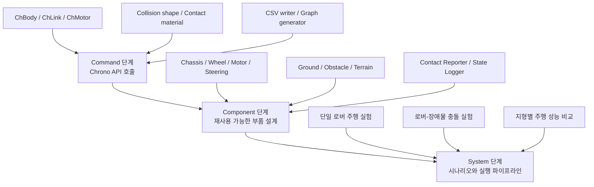
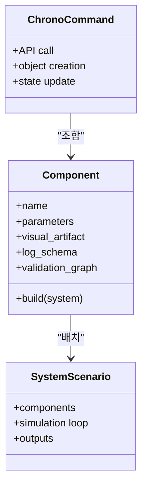

# 2.2.1 Component 단계의 정의와 역할

## 2.2.1.1 Component 단계의 위치

본 보고서에서 Component는 Project Chrono의 API를 단순히 나열한 목록이 아니라, 실제 가상환경을 만들 때 반복적으로 재사용할 수 있는 **시뮬레이션 부품 설계 단위**이다. Command 단계가 `ChBody`, `ChLink`, `ChMotor`, `ChContactMaterialNSC`, `RigidTerrain`처럼 하나의 기능을 호출하는 방법을 정리한다면, Component 단계는 그 Command들을 묶어 "차체", "바퀴", "조향부", "지형", "장애물", "접촉 로거"처럼 구현 대상의 구성요소로 재정의한다.

System 단계는 이러한 Component를 조합해 하나의 실험 시나리오를 만든다. 예를 들어 "로버가 장애물에 충돌하는 실험"은 Chassis Component, Collision Shape Component, Ground Component, Obstacle Component, Contact Reporter Component, State Logger Component가 결합된 System이다.



## 2.2.1.2 공식 module과 보고서 Component의 차이

Chrono 공식 문서에서 module은 Core, Vehicle, Sensor, Visualization, Postprocess처럼 빌드 옵션과 기능 경계를 뜻한다. Chrono::Vehicle 내부의 subsystem도 suspension, steering, driveline, tire처럼 공식 Component에 가까운 이름을 갖는다. 반면 본 절의 Component는 실제 모델링 과정에서 독립적으로 설계하고 재사용할 수 있는 "부품" 단위이다. 예를 들어 `ChBodyEasyBox`는 Command이지만, 질량, 시각 형상, 충돌 형상, 초기 위치, 초기 속도, 로깅 스키마까지 함께 정의하면 Chassis Component가 된다.

| 구분 | Chrono 관점 | 본 보고서의 Component 관점 |
|---|---|---|
| Core | `ChSystem`, `ChBody`, `ChLink`, `ChMotor` | 차체, 바퀴, 장애물, 축, 조인트, 구동 모터 |
| Vehicle | `WheeledVehicle`, `RigidTerrain`, `SCMTerrain` | 차량 하위 부품과 지형 부품을 조립하는 고수준 Component |
| Robot | Curiosity, Viper, Turtlebot 등 내장 로봇 모델 | 완성 로버 예시 또는 System 단계로 확장할 기준 모델 |
| Visualization | Irrlicht, VSG, visual shape | Render/Screenshot Component, 실제 렌더링 기반 시각 자료 |
| Sensor | Camera, LiDAR, GPS, IMU | 선택적 확장 Component. 본 절에서는 인터페이스와 배치 원칙 중심 |
| Postprocess/Python I/O | CSV, graph, export utility | State Logger, Control Logger, Graph Generator |

## 2.2.1.3 Component의 최소 구성

Component는 여러 Command를 조합해 만든 재사용 가능한 시뮬레이션 부품이다. 하나의 Component는 최소한 다음 정보를 포함한다.

| 항목 | 설명 | 예 |
|---|---|---|
| 물리 표현 | 질량, 관성, 위치, 속도, 고정 여부 | `ChBody`, `SetMass`, `SetPos`, `SetFixed` |
| 연결 표현 | 조인트, 모터, 제약 조건 | `ChLinkLockRevolute`, `ChLinkMotorRotationSpeed`, `ChLinkTSDA` |
| 접촉 표현 | 충돌 형상, 접촉 재질, 충돌 시스템 | `ChCollisionShapeBox`, `ChContactMaterialNSC` |
| 시각 표현 | 렌더링용 형상, 색, 텍스처 | `ChVisualShapeBox`, `ChVisualShapeCylinder`, mesh visual |
| 데이터 표현 | CSV 컬럼, 그래프, 이벤트 | `time_s`, `x_m`, `contact_force_N`, `event` |
| 검증 표현 | 렌더 이미지, 그래프, sanity check | VSG/Irrlicht 렌더, CSV 그래프, 접촉 개수 |



## 2.2.1.4 Component 기술 기준

Component 단계의 설명은 단순한 기능 소개가 아니라, Project Chrono에서 해당 부품을 어떻게 정의하고 검증할 수 있는지를 함께 제시해야 한다. 따라서 각 Component는 **정의 → 관련 API → 설계 변수 → 구현 예시 → 시각화 결과 → 데이터 검증 → 주의사항**의 흐름으로 정리하였다. 이 구성은 실제 모델링 절차와 검증 절차를 함께 보여주기 때문에, Command 단계의 API 지식을 System 단계의 완성 시나리오로 연결하는 기준이 된다.

| 기술 항목 | 기술 내용 |
|---|---|
| Component 정의 | 이 부품이 현실 세계에서 무엇에 해당하는지, System에서 어떤 역할을 하는지 |
| 주요 Command/API | 어떤 Chrono class와 method가 사용되는지 |
| 설계 변수 | 질량, 크기, 마찰, 위치, 속도, 강성, damping, grid spacing 등 |
| 코드 예시 | 최소 실행 스니펫과 실제 실행 파일 경로 |
| 시각화 결과 | 렌더 이미지 또는 시각 자료로 Component의 배치와 형상을 확인 |
| 그래프/CSV | 저장되는 값과 그래프가 검증하는 물리량을 설명 |
| 확장 방향 | Core 구현에서 Vehicle/Robot/Sensor 모듈로 확장하는 방법 |

실제로 Component를 고를 때는 API 이름만으로는 부족하다. 같은 바퀴라도 단순 형상 확인에는 Core cylinder가 충분하지만, 타이어 힘 모델이 필요하면 Vehicle tire subsystem을 선택해야 한다. 따라서 각 Component 설명은 다음 정보를 함께 제공한다.

| 선택 정보 | 확인할 내용 |
|---|---|
| 역할 | System 안에서 이 Component가 담당하는 물리 기능과 연결 대상 |
| 선택 기준 | 단순 형상, 동역학 정확도, 접촉 안정성, 센서 확장성 중 무엇을 우선하는지 |
| 주요 API/모듈 | Core API로 충분한지, Vehicle/Robot/Sensor 모듈이 필요한지 |
| 조정 변수 | 크기, 질량, 위치, 재질, 강성, 감쇠, 입력 명령처럼 실험자가 바꿀 수 있는 값 |
| 확인 산출물 | 렌더 이미지, CSV, 그래프 중 어떤 자료로 정상 배치와 정상 동작을 검증하는지 |
| 주의사항 | 초기 침투, 좌표계 불일치, visual/collision 불일치, 과도한 mesh 복잡도 같은 실패 조건 |
| 확장 경로 | 최소 Core 구현에서 고수준 subsystem 또는 실제 로봇 모델로 넘어가는 방법 |

## 2.2.1.5 Core 기본 형상과 custom Component

Core API로 직접 Component를 만들 때는 기본 형상을 조합해 시작한다. 단순 box와 cylinder만으로도 chassis, ground, wheel, obstacle을 빠르게 만들 수 있고, visual 품질이 필요할 때 mesh를 추가한다. 반대로 접촉 계산에서는 복잡한 visual mesh를 그대로 쓰기보다 box, sphere, cylinder, capsule 같은 단순 collision shape로 근사하는 편이 안정적이다. Chrono::Vehicle 또는 Chrono::Robot의 내장 모델이 제공하는 component mesh는 2.2.2의 차량 Component 절에서 별도로 다룬다.

| 시각 자료 |
|---|
|  |

**설명.** box, sphere, cylinder, capsule, ellipsoid, triangle mesh의 기본 형상 예시이다. 같은 형상이라도 visual shape와 collision shape의 목적이 다르므로 Component 설계에서 따로 선택한다.

아래 코드는 같은 box 형상을 visual과 collision 목적으로 동시에 켜는 가장 작은 예시이다. 실제 Component 문서에서는 이 한 줄을 그대로 끝내지 않고, 질량, 위치, 재질, 검증 이미지까지 함께 기록한다.

```python
material = chrono.ChContactMaterialNSC()
body = chrono.ChBodyEasyBox(
    1.0, 0.6, 0.3,
    350,
    True, True,  # visual shape, collision shape
    material,
)
body.SetName("component_box")
system.AddBody(body)
```

| 기본 형상 | 이미지 색 | 대표 API | 주 사용처 | 선택 기준 |
|---|---|---|---|---|
| Box | 파란색 | `ChVisualShapeBox`, `ChCollisionShapeBox`, `ChBodyEasyBox` | chassis, ground, obstacle, payload | 가장 빠르고 안정적인 기본 형상. 평면, 벽, 박스형 부품에 우선 사용 |
| Sphere | 초록색 | `ChVisualShapeSphere`, `ChCollisionShapeSphere` | marker, ball, 단순 접촉 probe | 방향성이 없고 접촉이 안정적이다. 센서 위치 표시나 검증용 물체에 적합 |
| Cylinder | 검은색 | `ChVisualShapeCylinder`, `ChCollisionShapeCylinder`, `ChBodyEasyCylinder` | wheel, roller, axle, pulley | 회전 부품의 기본 형상. 축 방향과 local frame을 반드시 확인 |
| Capsule | 주황색 | `ChCollisionShapeCapsule` 계열 | rounded link, rod, protective envelope | 끝이 둥근 막대 접촉에 적합하다. link 충돌을 box보다 부드럽게 근사할 때 사용 |
| Ellipsoid | 보라색 | ellipsoid visual/collision 계열 또는 mesh 근사 | sensor housing, 완만한 외피 | 시각 표현에는 유용하지만 collision은 단순 primitive 조합으로 근사하는 편이 안정적 |
| Triangle Mesh | 빨간색 | `ChVisualShapeTriangleMesh`, mesh collision | CAD 외형, 복잡한 장애물, 지형 mesh | visual에는 좋지만 collision mesh는 계산량과 안정성을 확인한 뒤 제한적으로 사용 |

## 2.2.1.6 Component 분류 체계

본 절에서는 다음 Component를 다룬다. MVP0 하나에 한정하지 않고, Chrono를 이용해 로버/환경/접촉/데이터를 구축할 때 반복적으로 등장하는 부품을 기준으로 분류했다.

| 분류 | 대표 Component | 주요 산출물 |
|---|---|---|
| 로버/차량 Component | Chassis, Payload/Sensor Mount, Wheel/Tire, Axle/Joint, Motor/Drive, Steering, Suspension, Visual Shape, Collision Shape, Driveline, Brake, Powertrain, Track Shoe | 렌더 이미지, 상태 CSV, 속도 그래프, 구조 이미지 |
| 환경/Terrain Component | Ground, Obstacle, Contact Material, RigidTerrain, Heightmap/Mesh Patch, SCMTerrain, FlatTerrain, CRGTerrain, GranularTerrain, FEATerrain, CRMTerrain, 외력/중력 설정 | 지형 렌더, 높이/마찰/침하 CSV, 접촉력 그래프 |
| 충돌/접촉 측정 Component | Collision Shape, Contact Material, Contact Reporter, Contact Force Logger, Collision Event Detector, Debug Visualization | 접촉 렌더, 접촉력 CSV, 접촉 개수/이벤트 그래프 |
| 데이터 출력/시각화 Component | State Logger, Control Logger, CSV Schema, Metadata Logger, Graph Generator, Render/Screenshot, Camera, LiDAR, GPS, IMU | 상태/제어 CSV, 궤적 그래프, 센서 배치 렌더 |

## 2.2.1.7 시각화 자료와 데이터 검증의 역할

Component 단계에서는 시각화 자료와 수치 데이터가 서로 다른 검증 역할을 맡는다. 렌더 이미지는 각 부품이 공간적으로 어디에 배치되고 어떤 형상으로 표현되는지 보여준다. 반면 CSV와 그래프는 그 부품이 시간에 따라 어떤 물리량을 만들어내는지 확인한다. 두 자료를 함께 제시하면, 단순히 "코드가 실행되었다"는 수준을 넘어 "어떤 Component가 어떤 물리 현상을 담당하는지"를 설명할 수 있다.

| 자료 유형 | 확인할 수 있는 내용 | 예 |
|---|---|---|
| 렌더 이미지 | Component의 공간 배치, 형상, 색, 상대 위치 | chassis와 wheel의 상대 위치, collision envelope |
| 그래프 | 시간에 따른 물리량 변화 | chassis 속도, 접촉력 peak, sinkage profile |
| CSV | 후처리와 재현 가능한 원본 데이터 | `time_s`, `x_m`, `contact_force_N` |
| Mermaid/구조도 | Component 간 관계 | Command-Component-System 연결 구조 |

## 2.2.1.8 Component 설계 원칙

1. Component는 단일 API 설명으로 끝내지 않고, 어떤 시뮬레이션 대상의 어느 부품인지 명확히 적는다.
2. Visual Shape와 Collision Shape를 분리한다. 보기 좋은 모델이 반드시 좋은 충돌 모델은 아니다.
3. 로깅 컬럼은 Component 설계 단계에서 정한다. System 단계에서 뒤늦게 CSV 스키마를 맞추면 다중 실험 비교가 어려워진다.
4. RigidTerrain과 SCMTerrain은 일반 Core body가 아니라 Chrono::Vehicle의 Terrain 계열 Component로 설명한다.
5. 렌더 이미지는 "무엇이 부품인지"를 보여주고, 그래프는 "그 부품이 실제로 어떻게 움직였는지"를 보여준다.
6. 모든 Component는 최소 예제와 확장 경로를 함께 적는다. 예를 들어 Core cylinder wheel에서 Vehicle tire subsystem으로 어떻게 넘어가는지 설명한다.

## 2.2.1.9 참고 문헌

- Project Chrono 공식 저장소: https://github.com/projectchrono/chrono
- Project Chrono API 문서: https://api.projectchrono.org/
- Chrono Vehicle Terrain system: https://api.projectchrono.org/group__vehicle__terrain.html
- Chrono Sensor overview: https://api.projectchrono.org/sensor_overview.html
- Chrono Visualization overview: https://api.projectchrono.org/vehicle_visualization.html
- 로컬 참고: `README.md`, `docs/core/`, `docs/vehicle/`, `docs/visualization/`, `docs/postprocess/`, `lessons/phase4/hojin/`
