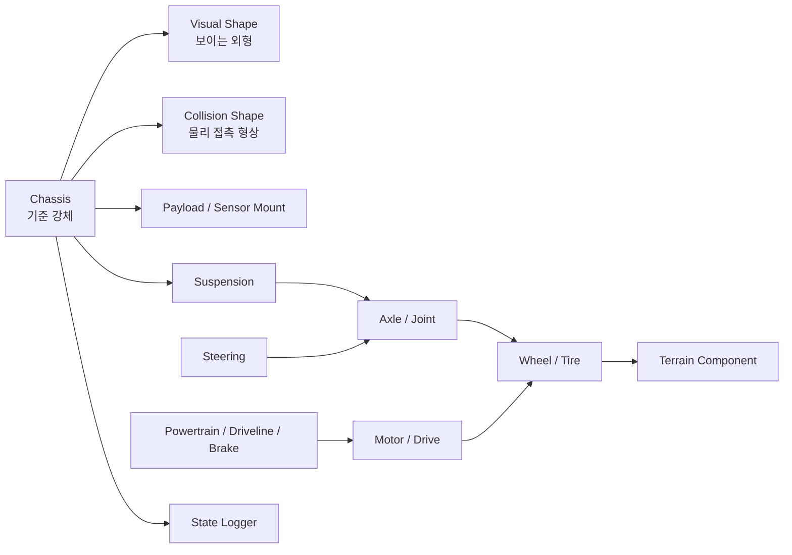

# 2.2.2 로버/차량 Component 설계

로버/차량 Component는 차체, 바퀴, 축, 구동부, 조향부, 서스펜션, 시각 형상, 충돌 형상, 초기 상태, 데이터 로깅 대상을 분리해 설계한다. Chrono Core만으로도 단순 로버를 만들 수 있고, 더 정교한 차량 동역학이 필요하면 Chrono::Vehicle의 wheeled/tracked subsystem 또는 Chrono::Robot의 Curiosity/Viper 모델로 확장할 수 있다.

이 절의 목표는 특정 MVP0 코드 하나를 설명하는 것이 아니라, Project Chrono에서 로버를 구성할 때 반복적으로 등장하는 Component를 선택 기준 중심으로 정리하는 것이다. 각 Component는 정의, 주요 API, 코드 예시, 시각화 관찰 기준, 그래프/CSV 해석이 연결되도록 구성하였다.

## 2.2.2.1 로버 Component 관계



## 2.2.2.2 Component 요약 표

| Component | 선택 기준 | 주요 API/모듈 | 조정 변수 | 확인 산출물 |
|---|---|---|---|---|
| Chassis | 기준 body가 필요하고 모든 하위 부품을 같은 좌표계에 묶어야 할 때 | `ChBody`, `ChBodyEasyBox`, `SetMass`, `SetInertiaXX` | 크기, 질량, 관성, 초기 pose, 초기 속도 | 차체 기준 배치 렌더, 위치/속도 그래프 |
| Payload/Sensor Mount | 탑재체 질량 또는 센서 기준 좌표계를 로버 위에 명확히 배치해야 할 때 | `AddVisualShape`, `ChVisualShapeBox`, `ChFramed`, Sensor pose | 상대 위치, 높이, 방향, 질량 반영 여부 | 탑재체/센서 기준점 렌더 |
| Wheel/Tire | 지형 접촉, 구름 반경, 구동 토크 전달을 표현해야 할 때 | Core `ChBodyEasyCylinder`, `ChLinkRevolute`, Vehicle tire subsystem | 반경, 폭, 질량, 마찰, 타이어 모델 | 바퀴/축/접촉 패치 렌더, 접촉 데이터 |
| Axle/Joint | 바퀴 회전 자유도와 축 방향을 명시해야 할 때 | `ChLinkLockRevolute`, `ChLinkRevolute`, joint frame | 축 위치, 축 방향, 회전 제한 | 축/조인트 기준 렌더 |
| Motor/Drive | 속도 명령 또는 토크 명령으로 바퀴를 구동해야 할 때 | `ChLinkMotorRotationSpeed`, `ChLinkMotorRotationTorque`, driveline subsystem | 목표 속도, 토크, throttle, 구동 배분 | 구동 경로 렌더, control log |
| Steering | 진행 방향을 바꾸거나 좌우 휠 속도 차를 제어해야 할 때 | steering joint/subsystem, tie rod, skid steering speed command | steering ratio, 입력 범위, 좌우 속도 차 | steering rack 렌더, steering input graph |
| Suspension | 바퀴 하중 경로와 지형 추종성을 표현해야 할 때 | `ChLinkTSDA`, `ChLinkRSDA`, Vehicle suspension subsystem | stiffness, damping, rest length, travel limit | 서스펜션 렌더 |
| Visual Shape | 사람이 보는 외형, 부품 색, mesh 표현이 필요할 때 | `ChVisualShapeBox`, `ChVisualShapeCylinder`, mesh visual, material color | mesh, 색, 스케일, 장착 pose | visual/collision 비교 렌더 |
| Collision Shape | 접촉 안정성과 계산 속도를 우선해야 할 때 | `ChCollisionShapeBox`, `ChCollisionShapeCylinder`, collision model | primitive 크기, envelope, contact material | collision envelope 렌더, contact force graph |

### Chrono 제공 Component visual asset

화면에 보이는 형상은 body 또는 subsystem에 붙어 있는 visual shape와 mesh asset으로 결정된다. custom Core body는 사용자가 `ChVisualShape*` 또는 mesh를 직접 붙이는 방식이고, Chrono::Vehicle/Chrono::Robot의 내장 모델은 모델 데이터에 포함된 component mesh를 visualization type으로 선택하는 방식이다.

| 사용 방식 | 기본 형상 제공 여부 | 대표 API | 선택 기준 |
|---|---|---|---|
| Core custom body | Component 단위 mesh 없음. primitive visual은 직접 부착 | `ChBodyEasyBox`, `ChBodyEasyCylinder`, `AddVisualShape` | 빠른 prototype, 단순 충돌/렌더 확인 |
| Wheeled Vehicle 내장 모델 | chassis, wheel, tire, suspension, steering visual type 제공 | `SetChassisVisualizationType`, `SetWheelVisualizationType`, `SetTireVisualizationType` | HMMWV, Gator, Sedan 등 검증된 차량 subsystem을 바로 사용할 때 |
| Tracked Vehicle 내장 모델 | chassis, sprocket, idler, road wheel, suspension, track shoe visual type 제공 | `SetSprocketVisualizationType`, `SetRoadWheelVisualizationType`, `SetTrackShoeVisualizationType` | 궤도차량 주행, track contact, sprocket/idler 구조가 필요할 때 |
| Robot 내장 모델 | 모델별 chassis/wheel visual toggle 또는 mesh 제공 | `SetChassisVisualization`, `SetWheelVisualization` | Viper, Curiosity처럼 로버 구조 자체를 기준 모델로 삼을 때 |

| 시각 자료 |
|---|
|  |

**설명.** Chrono data의 HMMWV visual asset preview이다. chassis, rim, tire mesh를 분리해 보여준다. 해당 Component에 `VisualizationType_MESH`를 선택하면 VSG/Irrlicht가 mesh asset을 렌더링한다.

| 시각 자료 |
|---|
|  |

**설명.** Chrono data의 M113 visual asset preview이다. chassis, sprocket, road wheel, track shoe처럼 tracked subsystem이 Component 단위 mesh를 가진다.

| 시각 자료 |
|---|
|  |

**설명.** Chrono Robot의 Viper/Curiosity visual asset preview이다. 로버 chassis와 wheel을 직접 설계하지 않고 내장 로봇 모델을 기준으로 사용할 수 있다.

```python
hmmwv.SetChassisVisualizationType(chrono.VisualizationType_MESH)
hmmwv.SetWheelVisualizationType(chrono.VisualizationType_MESH)
hmmwv.SetTireVisualizationType(chrono.VisualizationType_MESH)

m113.SetSprocketVisualizationType(chrono.VisualizationType_MESH)
m113.SetRoadWheelVisualizationType(chrono.VisualizationType_MESH)
m113.SetTrackShoeVisualizationType(chrono.VisualizationType_MESH)

viper.SetChassisVisualization(True)
viper.SetWheelVisualization(True)
```

## 2.2.2.3 Chassis Component

Chassis는 로버의 기준 body이다. 다른 Component는 대부분 Chassis 좌표계에 상대적으로 배치된다. 따라서 Chassis를 설계할 때는 "보기 좋은 박스"가 아니라 **질량 중심, 관성, 기준 좌표계, 초기 위치, 로깅 대상**까지 함께 정의해야 한다.

| 항목 | 설계 내용 |
|---|---|
| 역할 | 로버의 기준 강체, 센서/바퀴/링크가 붙는 부모 body |
| 주요 API | `chrono.ChBody`, `chrono.ChBodyEasyBox`, `SetMass`, `SetInertiaXX`, `SetPos`, `SetPosDt`, `AddVisualShape` |
| 주요 변수 | 길이/폭/높이, 질량, 질량 중심 높이, 초기 위치, 초기 속도 |
| 주의사항 | 질량 중심이 높으면 전복되기 쉽고, 초기 z 위치가 낮으면 ground와 처음부터 침투한다. |

아래 코드는 Chassis를 단순 visual로만 두지 않고 collision과 logging 대상 body로 함께 등록하는 최소 예시이다. `SetName`, `SetPos`, `SetPosDt`는 뒤의 CSV와 그래프가 어떤 body를 기록하는지 결정한다.

```python
import pychrono as chrono

system = chrono.ChSystemNSC()
system.SetGravitationalAcceleration(chrono.ChVector3d(0, 0, -9.81))

material = chrono.ChContactMaterialNSC()
material.SetFriction(0.45)

chassis = chrono.ChBodyEasyBox(
    1.4, 0.8, 0.28,      # length, width, height [m]
    350,                 # density [kg/m^3]
    True, True,          # visual=True, collision=True
    material,
)
chassis.SetName("rover_chassis")
chassis.SetPos(chrono.ChVector3d(-2.0, 0.0, 0.45))
chassis.SetPosDt(chrono.ChVector3d(1.3, 0.0, 0.0))
system.AddBody(chassis)
```

| 렌더링 관찰 기준 | 해석 기준 |
|---|---|
| Chassis 전체 배치 | 바퀴, 탑재체, 센서 마운트가 chassis 기준 좌표에 상대 배치되어야 한다. |

| 시각/그래프 자료 |
|---|
|  |

**설명.** 파란 박스가 Chassis Component이다. 바퀴, 탑재체, 센서 마운트가 모두 이 기준 body의 상대 좌표로 배치된다.

| 시각/그래프 자료 |
|---|
|  |

**설명.** `rover_vehicle_chassis_probe.csv`에서 시간에 따른 x 위치와 속도를 그린 그래프이다. Chassis는 거의 모든 System 실험에서 공통으로 기록해야 할 기본 상태량이다.

실행 코드: `../code/rover_vehicle/generate_rover_vehicle_components.py`  
CSV: `../outputs/csv/rover_vehicle_chassis_probe.csv`

## 2.2.2.4 Payload / Sensor Mount Component

Payload/Sensor Mount는 로버 위에 올라가는 배터리, 컴퓨터, 카메라, LiDAR, IMU 브래킷 같은 부품이다. 물리적으로 질량이 크면 별도 `ChBody`로 만들고, 단순 표시용이면 Chassis에 visual shape만 추가해도 된다.

| 항목 | 설계 내용 |
|---|---|
| 역할 | 탑재체 위치와 센서 기준 좌표계 정의 |
| 주요 API | `AddVisualShape`, `ChVisualShapeBox`, `ChFramed`, Sensor module의 camera/LiDAR pose |
| 주요 변수 | chassis 기준 상대 위치, 높이, 방향, 질량 반영 여부 |
| 주의사항 | 센서 pose와 chassis pose를 혼동하면 후처리 좌표 변환이 틀어진다. |

아래 예시는 별도 body를 만들지 않고 Chassis에 visual shape를 붙이는 방식이다. 실제 질량이 큰 배터리나 장비라면 같은 위치 정보를 사용하되 별도 `ChBody`와 joint로 분리한다.

```python
payload_shape = chrono.ChVisualShapeBox(0.36, 0.42, 0.20)
payload_shape.SetColor(chrono.ChColor(0.95, 0.58, 0.08))

chassis.AddVisualShape(
    payload_shape,
    chrono.ChFramed(chrono.ChVector3d(0.45, 0.0, 0.22), chrono.QUNIT),
)
```

| 렌더링 관찰 기준 | 해석 기준 |
|---|---|
| Payload/Sensor Mount 배치 | 탑재체가 chassis 위 상대 좌표에 고정되어 이동 중에도 기준 body를 따라 움직인다. |

| 시각 자료 |
|---|
|  |

**설명.** 반투명 chassis 위의 초록색 박스는 payload, 청록색 기둥은 sensor mast이다. 빨간 점은 camera 기준점, 노란 ray는 LiDAR 방향, 초록 점은 GPS/IMU 기준 위치를 나타낸다.

## 2.2.2.5 Wheel/Tire Component

Wheel/Tire는 지형과 직접 접촉하는 Component이다. Core 수준에서는 cylinder body와 revolute joint로 바퀴를 만들 수 있다. Vehicle 수준에서는 `RigidTire`, `TMeasyTire`, `FialaTire`, `Pacejka` 계열처럼 타이어 힘 모델을 별도로 선택한다.

| 항목 | 설계 내용 |
|---|---|
| 역할 | 지형과 접촉해 하중, 마찰, 구동력, 제동력을 전달 |
| 주요 API | `ChBodyEasyCylinder`, `ChLinkRevolute`, Vehicle tire subsystem |
| 주요 변수 | 반지름, 폭, 질량, 회전축 방향, 접촉 재질, 타이어 모델 |
| 주의사항 | 시각 반지름, 충돌 반지름, 타이어 유효 반지름이 항상 같은 것은 아니다. |

아래 코드는 Core 수준에서 wheel body를 만드는 형태이다. `ChAxis_Y`가 wheel 회전축과 맞아야 뒤의 revolute joint, motor 방향도 같은 기준으로 해석된다.

```python
wheel = chrono.ChBodyEasyCylinder(
    chrono.ChAxis_Y,     # wheel axle direction
    0.28,                # radius [m]
    0.18,                # width [m]
    800,                 # density [kg/m^3]
    True, True,
    material,
)
wheel.SetName("front_left_wheel")
wheel.SetPos(chrono.ChVector3d(0.55, 0.62, 0.30))
system.AddBody(wheel)
```

| 렌더링 관찰 기준 | 해석 기준 |
|---|---|
| Wheel/Tire 형상과 접촉 위치 | wheel radius, 폭, 축 방향, 지형 접촉점이 물리 모델과 일치해야 한다. |

| 시각 자료 |
|---|
|  |

**설명.** 검은 원통은 wheel visual, 밝은 원통은 rim/축 기준, 주황색 패치는 지형과 만나는 contact patch 개념이다. Core에서는 원통 강체와 revolute joint로 시작하고, Vehicle에서는 tire subsystem이 이 접촉 영역의 힘을 계산한다.

## 2.2.2.6 Axle / Joint Component

Axle/Joint Component는 Chassis와 Wheel을 연결하는 회전 자유도를 정의한다. 바퀴는 굴러야 하므로 wheel body를 chassis에 완전히 고정하면 안 되고, 회전축 방향을 가진 revolute joint 또는 motor joint를 사용해야 한다.

| 항목 | 설계 내용 |
|---|---|
| 역할 | 바퀴가 정해진 축을 중심으로 회전하게 제한 |
| 주요 API | `ChLinkRevolute`, `ChLinkLockRevolute`, `ChFramed`, `QuatFromAngleX` |
| 주요 변수 | joint 위치, 회전축 방향, chassis-wheel 연결 body |
| 주의사항 | 축 방향이 틀리면 바퀴가 옆으로 굴러가거나 회전이 이상하게 보인다. |

아래 코드의 핵심은 joint frame 위치와 회전축이다. 렌더의 노란 점과 회색 축이 이 코드의 `ChFramed` 위치/방향에 해당한다.

```python
joint_frame = chrono.ChFramed(
    chrono.ChVector3d(0.55, 0.62, 0.30),
    chrono.QuatFromAngleX(chrono.CH_PI_2),
)
wheel_joint = chrono.ChLinkRevolute()
wheel_joint.Initialize(wheel, chassis, joint_frame)
system.AddLink(wheel_joint)
```

| 렌더링 관찰 기준 | 해석 기준 |
|---|---|
| Axle/Joint 방향 | 바퀴 중심과 회전축이 일치해야 하며, 축 방향 오류가 있으면 wheel motion이 비정상적으로 나타난다. |

| 시각 자료 |
|---|
|  |

**설명.** 회색 축은 wheel center를 통과하는 revolute joint 축을 나타낸다. 노란 점은 joint frame 기준 위치이며, 축 방향이 wheel 원통의 중심선과 맞아야 바퀴가 의도한 방향으로 회전한다.

## 2.2.2.7 Motor / Drive Component

Motor/Drive Component는 바퀴 또는 궤도 스프로킷에 회전 입력을 전달한다. Core에서는 속도 모터와 토크 모터를 구분해야 한다. 속도 모터는 "목표 속도를 강제로 맞추는 구속"에 가깝고, 토크 모터는 실제 구동 토크를 넣는 방식에 가깝다.

| 항목 | 설계 내용 |
|---|---|
| 역할 | wheel/sprocket에 구동 입력 전달 |
| 주요 API | `ChLinkMotorRotationSpeed`, `ChLinkMotorRotationTorque`, `ChFunctionConst`, Vehicle driveline |
| 주요 변수 | 목표 각속도, 토크, throttle 입력, 좌우 구동 배분 |
| 주의사항 | 주행 성능을 보려면 속도 모터보다 토크/드라이브라인 기반 모델이 더 물리적이다. |

아래 예시는 한 wheel joint에 속도 모터를 붙이는 가장 작은 형태이다. Vehicle subsystem으로 확장할 때는 같은 역할이 powertrain, driveline, differential, brake subsystem으로 나뉜다.

```python
motor = chrono.ChLinkMotorRotationSpeed()
motor.Initialize(wheel, chassis, joint_frame)
motor.SetSpeedFunction(chrono.ChFunctionConst(8.0))  # rad/s
system.AddLink(motor)
```

| 렌더링 관찰 기준 | 해석 기준 |
|---|---|
| Motor/Drive 연결 방향 | motor가 연결된 wheel pair와 회전 방향이 구동 의도와 일치해야 한다. |

| 시각 자료 |
|---|
|  |

**설명.** 빨간 박스와 선은 motor/powertrain에서 differential 또는 driveline을 거쳐 각 wheel로 회전 입력이 전달되는 경로이다. 주황색 얇은 원판은 wheel 쪽 brake 위치를 따로 표시하므로, 구동 입력과 제동 입력을 같은 이미지에서 구분해 볼 수 있다.

## 2.2.2.8 Steering Component

Steering Component는 로버의 진행 방향을 바꾸는 부품이다. Ackermann 차량은 앞바퀴 조향각을 바꾸고, skid-steering 로버는 좌우 바퀴 속도 차이로 회전한다. 두 방식의 차이는 System 단계의 주행 실험에서 경로 추종, 회전 반경, 미끄러짐 해석으로 이어진다.

| 방식 | 구현 개념 | 장점 | 주의사항 |
|---|---|---|---|
| Ackermann steering | 앞바퀴 spindle/joint 방향을 회전 | 자동차형 주행에 적합 | steering linkage가 필요 |
| Skid steering | 좌우 wheel speed 차이로 yaw 생성 | 로버/궤도 차량에 적합 | 지형 마찰과 slip 영향이 큼 |
| Path follower | 목표 경로를 따라 steering 입력 자동 생성 | 반복 실험 자동화 | controller gain 튜닝 필요 |

아래 코드는 skid steering의 입력 분배만 떼어낸 예시이다. 실제 구현에서는 `left_speed`, `right_speed`가 좌우 wheel motor 또는 track sprocket 명령으로 연결된다.

```python
# Skid-steering style conceptual input
left_speed = base_speed - turn_gain * steering_cmd
right_speed = base_speed + turn_gain * steering_cmd
```

| 렌더링 관찰 기준 | 해석 기준 |
|---|---|
| Steering 방식 | Ackermann steering은 앞바퀴 조향각으로, skid-steering은 좌우 wheel speed 차이로 방향 전환이 나타난다. |

| 시각 자료 |
|---|
|  |

**설명.** 초록색 rack/tie rod가 조향 입력을 조향 대상 wheel assembly로 전달하고, 초록 화살표가 wheel heading 변화를 나타낸다. 조향 입력은 주행 결과 해석을 위해 Control Logger에 함께 기록한다.

## 2.2.2.9 Suspension Component

Suspension은 Chassis와 Wheel 사이의 링크, 스프링, 댐퍼를 묶는다. 단순 실험은 rigid axle로 시작해도 되지만, 험지 주행이나 wheel load 변화를 보려면 `ChLinkTSDA` 같은 spring-damper Component가 필요하다.

| 항목 | 설계 내용 |
|---|---|
| 역할 | 지형 충격 흡수, 바퀴 접지 유지, 차체 자세 안정 |
| 주요 API | `ChLinkTSDA`, `ChLinkRSDA`, `ChLinkRevolute`, Vehicle suspension subsystem |
| 주요 변수 | spring stiffness, damping, rest length, link 위치 |
| 주의사항 | stiffness/damping이 너무 작으면 차체가 바닥에 닿고, 너무 크면 수치적으로 불안정해질 수 있다. |

아래 코드는 chassis와 wheel 사이에 TSDA spring-damper를 추가한다. 렌더의 보라색 coil은 `ChLinkTSDA`, 주황색 arm은 별도 link/joint로 확장되는 구조를 나타낸다.

```python
spring = chrono.ChLinkTSDA()
spring.Initialize(
    chassis,
    wheel,
    False,
    chrono.ChVector3d(0.55, 0.45, 0.55),
    chrono.ChVector3d(0.55, 0.62, 0.30),
)
spring.SetSpringCoefficient(18000.0)
spring.SetDampingCoefficient(1200.0)
system.AddLink(spring)
```

| 렌더링 관찰 기준 | 해석 기준 |
|---|---|
| Suspension link와 spring/damper | chassis와 wheel 사이의 링크, 스프링, 댐퍼가 분리되어 보이면 지형 충격 전달 경로를 해석하기 쉽다. |

| 시각 자료 |
|---|
|  |

**설명.** 주황색 링크는 suspension arm, 보라색 coil은 spring-damper, 초록색 링크는 steering rack/tie rod 개념이다. 실제 Chrono 구현에서는 link, revolute joint, TSDA/RSDA를 조합해 현가장치를 만든다.

## 2.2.2.10 Visual Shape Component

Visual Shape는 사람이 보는 외형이다. 렌더링 이미지, 디버깅 화면, 센서 렌더링에는 중요하지만 접촉 계산에는 직접 사용되지 않을 수 있다. 복잡한 CAD mesh를 visual로 쓰더라도 collision은 단순 primitive로 따로 잡는 것이 일반적이다.

| 항목 | 설계 내용 |
|---|---|
| 역할 | 사람이 부품을 식별할 수 있게 표시 |
| 주요 API | `ChVisualShapeBox`, `ChVisualShapeCylinder`, `ChVisualShapeTriangleMesh`, `AddVisualShape`, texture |
| 주요 변수 | 색, 투명도, mesh 파일, body 기준 상대 pose |
| 주의사항 | visual mesh를 그대로 collision mesh로 쓰면 계산 비용과 불안정성이 커질 수 있다. |

아래 코드는 외형만 추가하는 예시이다. `AddVisualShape`는 사람이 보는 형상을 붙이며, 접촉 계산이 필요하면 별도의 collision shape 설정을 확인해야 한다.

```python
shape = chrono.ChVisualShapeBox(1.8, 0.9, 0.34)
shape.SetColor(chrono.ChColor(0.05, 0.26, 0.78))
chassis.AddVisualShape(shape)
```

| 렌더링 관찰 기준 | 해석 기준 |
|---|---|
| Visual Shape 식별성 | chassis, wheel, payload가 색과 형상으로 구분되어야 모델 구조를 직관적으로 파악할 수 있다. |

| 시각 자료 |
|---|
|  |

**설명.** 파란 외형은 사람이 보는 Visual Shape이다. 시각화와 디버깅에는 중요하지만, 물리 접촉 계산 자체는 Collision Shape가 담당한다.

## 2.2.2.11 Collision Shape Component

Collision Shape는 접촉 검출과 접촉력 계산에 쓰인다. 단순 박스/구/실린더를 우선 사용하고, 반드시 필요한 경우에만 mesh collision을 사용한다. Collision Shape가 너무 복잡하면 계산량이 늘고, 너무 단순하면 실제 형상과 접촉 위치가 달라질 수 있다.

| 항목 | 설계 내용 |
|---|---|
| 역할 | 접촉 판정, 침투 깊이, 접촉 법선 계산 |
| 주요 API | `ChBodyEasyBox`, `ChCollisionShapeBox`, `ChCollisionShapeCylinder`, `ChContactMaterialNSC` |
| 주요 변수 | collision envelope 크기, 마찰/반발 계수, body별 collision enable |
| 주의사항 | Visual Shape와 Collision Shape를 분리해 시각화 자료에서 함께 확인한다. |

아래 예시는 visual을 끄고 collision만 켠 body를 만드는 형태이다. 실제 모델에서는 visual body와 collision envelope가 같은 body에 함께 있을 수도 있지만, 검토 단계에서는 분리해 보면 차이를 확인하기 쉽다.

```python
collision_body = chrono.ChBodyEasyBox(
    1.7, 0.78, 0.30,
    350,
    False, True,  # visual=False, collision=True
    material,
)
collision_body.SetName("chassis_collision_envelope")
```

| 렌더링 관찰 기준 | 해석 기준 |
|---|---|
| Collision envelope | visual shape와 collision envelope의 차이가 드러나야 충돌 계산에 사용되는 실제 형상을 검증할 수 있다. |

| 시각 자료 |
|---|
|  |

**설명.** 붉은 반투명 envelope가 Collision Shape 개념이다. 실제 로버 mesh가 복잡해도 충돌 형상은 단순화해야 계산이 안정적이다.

## 2.2.2.12 Initial State Component

초기 위치와 속도는 별도 Component처럼 관리한다. 같은 로버라도 시작 위치, 방향, 속도, 바퀴 회전 속도에 따라 완전히 다른 결과가 나오기 때문이다.

| 항목 | 설계 내용 |
|---|---|
| 역할 | 실험 시작 조건 정의 |
| 주요 API | `SetPos`, `SetRot`, `SetPosDt`, `SetAngVelParent`, motor function 초기값 |
| 주요 변수 | 시작 위치, yaw/pitch/roll, 선속도, 각속도, wheel speed |
| 주의사항 | 지형과 초기 침투가 생기지 않도록 wheel radius와 ground height를 기준으로 z 위치를 잡는다. |

아래 코드는 System 실행 직전에 적용되는 초기 조건이다. 같은 Component라도 이 값이 바뀌면 접촉 시점, 충돌력, 궤적이 모두 달라진다.

```python
start_pos = chrono.ChVector3d(-2.0, 0.0, 0.45)
start_yaw = chrono.QuatFromAngleZ(0.0)
chassis.SetPos(start_pos)
chassis.SetRot(start_yaw)
chassis.SetPosDt(chrono.ChVector3d(1.3, 0.0, 0.0))
```

| 렌더링 관찰 기준 | 해석 기준 |
|---|---|
| 초기 pose와 속도 방향 | 시작 위치, 지면 높이, 진행 방향 화살표가 함께 맞아야 첫 step에서 침투나 반대 방향 이동을 피할 수 있다. |

| 시각 자료 |
|---|
|  |

**설명.** 진한 파란 차체는 초기 pose, 옅은 파란 박스는 진행 후 예상 위치를 나타낸다. 빨간 화살표는 초기 속도 방향, 초록 화살표는 ground 상면 기준 높이를 확인하는 z 기준이다.

## 2.2.2.13 Chrono::Vehicle 확장 Component

Core 기반 로버가 body/link/motor의 원리를 익히는 단계라면, Chrono::Vehicle은 완성 차량의 subsystem을 조합하는 단계이다. 아래 표는 직접 구성한 Component와 Vehicle module의 공식 subsystem이 어떻게 대응되는지 정리한 것이다.

| Component | 역할 | Chrono::Vehicle 관점 |
|---|---|---|
| Chassis | 차량 기준 body | `ChChassis`, vehicle chassis subsystem |
| Suspension | 차체와 wheel assembly 연결 | Double Wishbone, MacPherson, Multi-link, Solid Axle 등 |
| Steering | 조향 입력을 바퀴 방향으로 전달 | Pitman arm, rack-pinion 계열 steering subsystem |
| Tire | 지형과의 힘 계산 | Rigid, TMeasy, Fiala, Pacejka, FEA tire |
| Driveline | 엔진/모터 출력을 구동 바퀴로 배분 | AWD/RWD/FWD driveline subsystem |
| Brake | 바퀴 회전을 감속 | brake subsystem |
| Powertrain | throttle 입력을 torque로 변환 | engine, transmission, motor map |

아래 코드는 직접 만든 Core body/link 구조에서 Vehicle module의 완성 subsystem으로 넘어갈 때의 초기화 흐름이다. 실제 클래스와 enum 이름은 선택한 vehicle model에 따라 달라지므로, 여기서는 어떤 설정을 한 묶음으로 정해야 하는지만 보여준다.

```python
import pychrono.vehicle as veh

# 예시: Chrono 데모에서 많이 쓰는 패턴
# hmmwv = veh.HMMWV_Full()
# hmmwv.SetDriveType(veh.DrivelineTypeWV_AWD)
# hmmwv.SetTireType(veh.TireModelType_TMEASY)
# hmmwv.SetInitPosition(chrono.ChCoordsysd(init_pos, init_rot))
# hmmwv.Initialize()
```

| 렌더링 관찰 기준 | 해석 기준 |
|---|---|
| Vehicle subsystem 구조 | suspension, steering, tire visualization을 통해 Core Component가 Vehicle subsystem으로 어떻게 확장되는지 확인한다. |

| 시각 자료 |
|---|
|  |

**설명.** Chrono data의 HMMWV mesh asset은 Core primitive rover보다 실제 차량 subsystem에 가까운 chassis, rim, tire visual을 제공한다. Vehicle 확장 단계에서는 이런 내장 visual asset과 tire/driveline/suspension subsystem을 함께 선택한다.

## 2.2.2.14 Chrono::Robot 로버 확장

Chrono에는 Curiosity, Viper, Turtlebot 같은 로봇 모델 예제가 포함되어 있다. 직접 만든 Core 로버 Component는 기본 원리 학습에 적합하고, 내장 Robot 모델은 실제 로버 구조를 빠르게 실험하는 데 적합하다.

| 모델 | 특징 | 학습 포인트 |
|---|---|---|
| Curiosity | 화성 로버형 6륜 구조 | rocker-bogie, wheel motor, rigid terrain |
| Viper | 달 탐사용 소형 로버 예시 | suspension spring, wheel-ground interaction |
| Turtlebot | 실내 모바일 로봇 | differential drive, 단순 평면 이동 |

아래 경로의 데모는 Robot module을 선택할 때 확인할 기준 코드이다. 직접 만든 wheel/body를 쓰는 대신 모델 클래스가 chassis, wheel, suspension 구성을 내부적으로 제공한다.

```python
# 로컬 참고 데모
# chrono/src/demos/python/robot/demo_ROBOT_Curiosity_Rigid.py
# chrono/src/demos/python/robot/demo_ROBOT_Viper_Rigid.py
```

| 시각 자료 |
|---|
|  |

**설명.** Viper/Curiosity asset preview는 로버 body와 wheel 형상을 직접 설계하지 않고 Chrono Robot 모델을 기준으로 실험을 시작할 수 있음을 보여준다. Component를 직접 조립하는 방식과 내장 로봇 모델을 쓰는 방식의 선택 근거가 된다.

## 2.2.2.15 Tracked Vehicle 확장 Component

바퀴형 로버와 달리 궤도형 로버는 Track Shoe, Sprocket, Idler, Roller가 핵심 Component가 된다. 접촉점이 많아 주행 안정성이 좋아질 수 있지만 계산량도 증가한다.

| Component | 역할 | 설계 시 주의사항 |
|---|---|---|
| Track Shoe | 지면과 접촉하는 궤도 조각 | shoe 개수가 많아질수록 접촉 계산량 증가 |
| Sprocket | 구동 토크를 track에 전달 | tooth 형상과 track 간격 정합 필요 |
| Idler | track 장력과 경로 유지 | 위치 조절로 장력 안정화 |
| Roller | chassis 하중을 track에 분산 | 지형 요철에서 접촉 유지 확인 |

Tracked Vehicle은 바퀴형 로버와 달리 구동 sprocket, idler, roller, track shoe가 한 subsystem 안에서 맞물린다. 아래 예시는 실제 코드에서 track shoe visual과 sprocket visual을 어떤 단위로 켜는지 보여주는 개념 형태이다.

```python
tracked_vehicle.SetChassisVisualizationType(chrono.VisualizationType_MESH)
tracked_vehicle.SetSprocketVisualizationType(chrono.VisualizationType_MESH)
tracked_vehicle.SetIdlerVisualizationType(chrono.VisualizationType_MESH)
tracked_vehicle.SetRoadWheelVisualizationType(chrono.VisualizationType_MESH)
tracked_vehicle.SetTrackShoeVisualizationType(chrono.VisualizationType_MESH)
```

| 렌더링 관찰 기준 | 해석 기준 |
|---|---|
| Tracked Vehicle 구성 | track shoe, sprocket, idler, roller가 각각 구분되어야 궤도 주행의 접촉 경로와 구동 경로를 설명할 수 있다. |

| 시각 자료 |
|---|
|  |

**설명.** 궤도형 로버는 바퀴 하나가 아니라 여러 track shoe가 지형과 동시에 접촉한다. 따라서 Contact Logger와 계산 timestep 관리가 더 중요해진다.

| 시각 자료 |
|---|
|  |

**설명.** M113 asset preview는 tracked subsystem이 chassis, sprocket, road wheel, track shoe 단위의 visual mesh를 갖는다는 점을 보여준다. 직접 만든 단순 궤도 도식에서 Chrono::Vehicle tracked model로 확장할 때 확인할 기준 이미지이다.

## 2.2.2.16 로버 Component 검증 체크리스트

| 점검 항목 | 확인 방법 |
|---|---|
| 초기 침투 없음 | 시뮬레이션 시작 직후 contact force가 비정상적으로 크지 않은지 확인 |
| Chassis 속도 정상 | `rover_vehicle_chassis_probe.csv`의 `vx_mps` 확인 |
| wheel 축 방향 정상 | 렌더에서 wheel이 의도한 축을 중심으로 회전하는지 확인 |
| Visual/Collision 분리 | collision debug 렌더 또는 반투명 envelope 렌더 확인 |
| Control 입력 저장 | throttle, brake, steering, motor speed/torque를 CSV에 함께 기록 |

## 2.2.2.17 로컬 참고 코드 반영

`lessons/phase4/hojin/lesson_19_hojin_rover_mvp0_collision_dummy.py`는 단일 차체, 장애물, 접촉 CSV를 갖춘 기초 예제이다. 본 절의 `generate_rover_vehicle_components.py`는 그 구조를 그대로 반복하지 않고, Chassis/Wheel/Suspension/Tracked 확장 구조를 Component 매뉴얼 형태로 재구성했다.

## 2.2.2.18 참고 문헌

- Project Chrono API 문서: https://api.projectchrono.org/
- Chrono Vehicle visualization and subsystem context: https://api.projectchrono.org/vehicle_visualization.html
- Chrono Vehicle terrain system: https://api.projectchrono.org/group__vehicle__terrain.html
- 로컬 문서: `docs/vehicle/wheeled/`, `docs/vehicle/Tracked/`, `docs/robot/`, `lessons/phase4/hojin/`
