# 2.2.2 로버/차량 Component 설계

로버/차량 Component는 차체, 바퀴, 축, 구동부, 조향부, 서스펜션, 시각 형상, 충돌 형상, 초기 상태, 데이터 로깅 대상을 분리해 설계한다. Chrono Core만으로도 단순 로버를 만들 수 있고, 더 정교한 차량 동역학이 필요하면 Chrono::Vehicle의 wheeled/tracked subsystem 또는 Chrono::Robot의 Curiosity/Viper 모델로 확장할 수 있다.

이 절의 목표는 특정 MVP0 코드 하나를 설명하는 것이 아니라, Project Chrono에서 로버를 구성할 때 반복적으로 등장하는 Component를 선택 기준 중심으로 정리하는 것이다. 각 Component는 정의, 주요 API, 코드 예시, 시각화 관찰 기준, 그래프/CSV 해석이 연결되도록 구성하였다.

## 2.2.2.1 로버 Component 관계


| Rover / Vehicle subsystem ownership map |
|---|
| 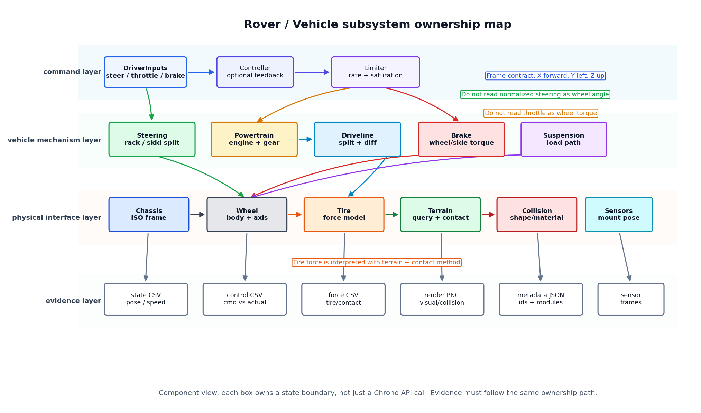 |

**설명.** 이 ownership map은 2.2.2 전체의 읽는 순서이다. `DriverInputs`는 명령 provenance를 소유하고, steering/powertrain/driveline/brake가 물리 상태로 변환하며, wheel/tire/terrain/collision/sensor가 실제 접촉과 산출물 경계를 만든다.

## 2.2.2.2 Component 요약 표

| Component | 선택 기준 | 주요 API/모듈 | 조정 변수 | 확인 산출물 |
|---|---|---|---|---|
| Chassis | 기준 body가 필요하고 모든 하위 부품을 같은 좌표계에 묶어야 할 때 | `ChBody`, `ChBodyEasyBox`, `SetMass`, `SetInertiaXX` | 크기, 질량, 관성, 초기 pose, 초기 속도 | 차체 기준 배치 렌더, 위치/속도 그래프 |
| Payload/Sensor Mount | 탑재체 질량 또는 센서 기준 좌표계를 로버 위에 명확히 배치해야 할 때 | `AddVisualShape`, `ChVisualShapeBox`, `ChFramed`, Sensor pose | 상대 위치, 높이, 방향, 질량 반영 여부 | 탑재체/센서 기준점 렌더 |
| Wheel/Tire | 지형 접촉, 구름 반경, 구동 토크 전달을 표현해야 할 때 | Core `ChBodyEasyCylinder`, `ChLinkRevolute`, Vehicle tire subsystem | 반경, 폭, 질량, 마찰, 타이어 모델 | 바퀴/축/접촉 패치 렌더, 접촉 데이터 |
| Axle/Joint | 바퀴 회전 자유도와 축 방향을 명시해야 할 때 | `ChLinkLockRevolute`, `ChLinkRevolute`, joint frame | 축 위치, 축 방향, 회전 제한 | 축/조인트 기준 렌더 |
| Motor/Drive | 속도 명령 또는 토크 명령으로 바퀴를 구동해야 할 때 | `ChLinkMotorRotationSpeed`, `ChLinkMotorRotationTorque`, driveline subsystem | 목표 속도, 토크, throttle, 구동 배분 | 구동 경로 렌더, control log |
| Driver/Input/Controller | 운전자 입력, scripted replay, path follower, 폐루프 제어 입력을 분리해야 할 때 | `DriverInputs`, `ChDriver`, `ChInteractiveDriver`, `ChDataDriver`, path follower driver | steering/throttle/braking, target path, target speed, gain | 입력 CSV, 상태-입력 비교 그래프 |
| Powertrain | throttle 입력을 engine/motor torque와 driveshaft torque로 변환해야 할 때 | `ChPowertrainAssembly`, `ChEngine`, `ChTransmission` | engine map, gear, motor speed, throttle | engine speed/torque log |
| Driveline | powertrain 출력 토크를 driven axle/wheel로 배분해야 할 때 | Vehicle driveline subsystem, differential/shaft model | drive type, torque split, gear ratio, differential lock | wheel torque 분배 log |
| Brake | braking 입력으로 wheel 회전을 감속해야 할 때 | `ChBrake`, `ChBrakeShafts`, `ChBrakeSimple` | braking input, max torque, lock enable | brake torque, 감속 구간 log |
| Steering | 진행 방향을 바꾸거나 좌우 휠 속도 차를 제어해야 할 때 | steering joint/subsystem, tie rod, skid steering speed command | steering ratio, 입력 범위, 좌우 속도 차 | steering rack 렌더, steering input graph |
| Suspension | 바퀴 하중 경로와 지형 추종성을 표현해야 할 때 | `ChLinkTSDA`, `ChLinkRSDA`, Vehicle suspension subsystem | stiffness, damping, rest length, travel limit | 서스펜션 렌더 |
| Anti-roll Bar | 좌우 suspension travel을 roll stiffness로 결합해야 할 때 | Vehicle anti-roll bar subsystem, RSDA/arm abstraction | axle index, stiffness, arm geometry, output enabled | anti-roll torque, constraint violation |
| Visual Shape | 사람이 보는 외형, 부품 색, mesh 표현이 필요할 때 | `ChVisualShapeBox`, `ChVisualShapeCylinder`, mesh visual, material color | mesh, 색, 스케일, 장착 pose | visual/collision 비교 렌더 |
| Collision Shape | 접촉 안정성과 계산 속도를 우선해야 할 때 | `ChCollisionShapeBox`, `ChCollisionShapeCylinder`, collision model | primitive 크기, envelope, contact material | collision envelope 렌더, contact force graph |

### 개발자용 선택 카탈로그

아래 표는 같은 "로버" 요구사항을 Core prototype, Chrono::Vehicle subsystem, Chrono::Robot 내장 모델 중 어디로 보낼지 정하는 라우팅 표이다. 단순 형상 확인은 Core Component로 충분하지만, tire force, driveline, suspension kinematics, 검증된 로버 모델이 필요하면 공식 subsystem을 우선 검토한다.

| 설계 대상 | Core prototype | Vehicle subsystem | Robot/Tracked 대안 | 검증 산출물 |
|---|---|---|---|---|
| 기준 차체 | `ChBody` 또는 `ChBodyEasyBox`로 기준 강체 구성 | `ChChassis` 계열 chassis subsystem | Viper/Curiosity chassis 또는 tracked chassis | `images/renders/rover_vehicle_component_overview.png`, chassis state CSV |
| 바퀴 외형 | `ChBodyEasyCylinder`와 revolute joint | wheel subsystem과 tire visualization type | Robot wheel, tracked road wheel | wheel/tire render, contact patch 확인 |
| 타이어 힘 | 단순 cylinder contact material | `RigidTire`, `TMeasyTire`, `FialaTire`, Pacejka/FEA tire | wheel-soil interaction 로버 모델 | contact force graph, slip/속도 로그 |
| 조향 | joint frame 회전 또는 좌우 속도 차 | steering subsystem, driver input | skid steering robot, track differential input | steering render, control log |
| 운전자/제어 입력 | scripted speed/steering profile | `DriverInputs`, interactive/data/path follower driver | robot command source, teleop/replay | steering/throttle/braking CSV |
| 구동 | speed/torque motor link | powertrain, driveline, differential, brake | wheel motor, sprocket drive | motor path render, throttle/torque CSV |
| 동력 생성/전달 | 단일 motor link로 단순화 | powertrain + driveline + brake subsystem | wheel motor, sprocket drive, track brake | engine/driveshaft/wheel torque log |
| 현가 | rigid axle 또는 `ChLinkTSDA/RSDA` | double wishbone, MacPherson, multi-link, solid axle | rocker-bogie 또는 robot suspension | suspension render, wheel load/pose 로그 |
| 외형 | primitive visual shape 또는 mesh visual | model data mesh와 visualization type | 내장 robot/tracked mesh asset | VSG/asset capture |
| 충돌 | 단순 collision primitive | subsystem별 collision type | robot/tracked collision shape | visual/collision 비교 render |

### Chrono::Vehicle Subsystem Ownership Matrix

공식 Chrono::Vehicle 문서는 wheeled vehicle을 chassis, driveline, axle, steering, tire 같은 subsystem의 조합으로 설명한다. 따라서 Vehicle 단계의 Component는 Core body/link/motor를 단순히 더 많이 쓰는 것이 아니라, subsystem별 ownership과 데이터 교환 경계를 분리하는 방식으로 정리해야 한다.

| Vehicle subsystem | Owns | Consumes | Produces | Required logs / metadata | Common confusion |
|---|---|---|---|---|---|
| Chassis | vehicle reference frame, sprung mass, chassis inertia, attach coordinate source | initial pose, payload/sensor mounts, suspension locations | chassis pose, speed, acceleration, visual/collision asset | `chassis_pose_world`, `chassis_mass_kg`, ISO frame convention | chassis frame과 world frame 혼동 |
| Subchassis | secondary beam/body frame for balancer or linked axle support | chassis frame, suspension attach request | subchassis body pose, beam reaction, attach transform | `subchassis_type`, `subchassis_location`, beam body ids | suspension hardpoint를 chassis에 직접 붙였다고 오해 |
| Suspension / Axle | spindle/upright body, hardpoints, spring/damper, travel and wheel load path | chassis frame, steering link, wheel/tire, brake | wheel center pose, suspension travel, reaction/load | `suspension_type`, hardpoint source, `travel_FL_m`, `wheel_load_FL_N` | spring-damper 하나를 complete suspension으로 오해 |
| Anti-roll bar | roll-coupling arms/RSD stiffness and anti-roll constraint path | chassis, independent suspension travel, anti-roll location | anti-roll torque, constraint violation check | `antirollbar_type`, `arb_location`, `arb_stiffness`, constraint log | roll stiffness를 suspension spring data 안에 숨김 |
| Steering | steering mechanism, rack/pitman relation, steerable axle connection | normalized steering input, suspension/axle geometry | wheel heading, steering link state | `steering_input`, `steering_angle_FL_rad`, steering subsystem type | driver `m_steering`을 wheel angle로 직접 해석 |
| Wheel | rotating wheel/spindle visual and inertial addition | suspension spindle, brake, tire | wheel angular speed, wheel visual pose | `wheel_omega_FL_radps`, wheel mass/inertia, visualization type | tire model과 wheel body를 같은 Component로 합침 |
| Tire | terrain interface force law, slip/contact state | wheel state, terrain query/contact, tire parameter file | tire force/moment, slip, contact patch state | `tire_model`, `tire_Fx_FL_N`, `tire_Fz_FL_N`, `slip_ratio_FL` | wheel collision material을 tire force model로 오해 |
| Powertrain | engine/motor torque generation, transmission/gear state, driveshaft torque | throttle input, driveshaft angular speed feedback | output torque, engine speed, gear | `engine_speed_radps`, `engine_torque_Nm`, `gear`, `driveshaft_torque_Nm` | throttle을 wheel torque로 직접 저장 |
| Driveline | driven axle selection, torque split, differential/shaft connection | powertrain driveshaft torque, wheel axle speeds | per-axle/per-wheel torque, driveshaft speed feedback | `drive_type`, `torque_split`, `wheel_torque_FL_Nm`, differential lock/bias | AWD/RWD/FWD와 torque split metadata 누락 |
| Brake | per-side/per-wheel braking torque and optional locking | braking input, wheel/suspension side | brake torque, wheel deceleration state | `brake_input`, `brake_torque_FL_Nm`, `brake_lock_enabled` | brake를 negative throttle로 대체 |
| Anti-roll bar | left/right suspension travel coupling and roll stiffness | chassis, target axle/suspension, anti-roll hardpoints | anti-roll torque, arm/link state, constraint violation | `antirollbar_type`, `axle_index`, `arb_stiffness`, output flag | spring stiffness와 anti-roll stiffness를 같은 값으로 합침 |

### Vehicle Model Spec Component

Chrono::Vehicle model은 단일 class 호출이 아니라 top-level vehicle template과 여러 subsystem JSON/file이 resolve된 결과이다. `ChWheeledVehicle`은 axle, suspension, steering, wheel, tire, brake, driveline, powertrain handle과 component list/export API를 제공하므로, Component catalog에서는 어떤 원본 파일이 어떤 Chrono subsystem으로 해석되었는지 별도 manifest로 남긴다.

| Spec field | Required content |
|---|---|
| `vehicle_model` / `template_name` | HMMWV, Gator, M113, Viper-like custom 등 model id와 Chrono template name |
| `top_level_json` | top-level vehicle JSON or model config path, path base, hash |
| `contact_method` | vehicle/system contact method and material family compatibility |
| `chassis_file` / `subchassis_file` | chassis/subchassis JSON, body ids, collision/visual policy |
| `axle_index` | Chrono axle index, front-to-rear order, axle role/name |
| `suspension_file` / `suspension_location` | suspension template source and chassis-local attach location |
| `steering_file` | steering subsystem source, steering index, steerable axle map |
| `wheel_file_L/R` | wheel source by axle/side/location, wheel mass/inertia and visualization type |
| `brake_file_L/R` | brake source by axle/side and output enable flag |
| `driveline_file` | driven axle list, shaft/simple model, differential/bias/lock settings |
| `tire_file_by_wheel` | tire source by axle/side/location and terrain compatibility |
| `asset_base_path` | Vehicle data root, mesh/texture base path, fallback behavior |
| `source_hash` / `resolved_hash` | raw model hash and fully resolved model hash |
| `source_to_chrono_name_map` | JSON subsystem names to `ChVehicle`/body/link/component ids |

### Vehicle Frame / Hardpoint Map Component

Chrono wheeled vehicle reference frame follows the ISO convention: X forward, Y left, Z up. Hardpoint tables and subsystem locations are meaningful only when their parent frame and transform checks are explicit. This map is separate from body pose logging because it describes design-time attachment geometry.

| Frame/hardpoint field | Required content |
|---|---|
| `vehicle_frame` | `ISO_8855` / X-forward Y-left Z-up convention or explicit override |
| `world_frame` | world up axis, terrain frame, import transform if different |
| `subsystem_frame_id` | chassis, subchassis, axle, suspension, steering, wheel, tire, brake, sensor mount |
| `parent_frame_id` | parent frame used by each subsystem location |
| `subsystem_location` / `subsystem_orientation` | parent-frame transform used during initialization |
| `hardpoint_table_source` | JSON/template/class/table source and hash |
| `hardpoint_name` | named point such as spindle, arm pivot, tie-rod, spring/damper mount |
| `hardpoint_xyz_local` / `axis_xyz_local` | local coordinates and joint/steering/spring axis |
| `axle_index` / `side` | front-to-rear axle id and left/right side, if applicable |
| `transform_check_world_xyz` | computed world position used to confirm render/logger alignment |

### Rover Component Contract Matrix

Component 카탈로그에서 중요한 것은 "어떤 API를 호출하는가"보다 "어떤 부품이 어떤 상태와 산출물을 책임지는가"이다. 아래 표는 로버를 조립할 때 각 Component의 ownership과 dependency를 명시해 Command 단계의 단일 호출 설명과 구분한다.

| Component | Owns | Depends on | Outputs | Failure modes | Upgrade path |
|---|---|---|---|---|---|
| Chassis | 질량, 관성, 기준 pose, 기준 body name, state log 대상 | Initial State, Visual Shape, Collision Shape | chassis render, `rover_vehicle_chassis_probe.csv`, trajectory graph | 질량 중심 과다 상승, 초기 지면 침투, child component 좌표계 불일치 | Core `ChBody` -> Vehicle `ChChassis` -> Robot chassis |
| Payload/Sensor Mount | 탑재체 상대 pose, sensor frame, optional payload mass | Chassis frame, Sensor Logger, Metadata Logger | sensor mount render, sensor pose metadata | chassis pose와 sensor pose 혼동, 질량 누락 | visual-only mount -> separate payload body -> Sensor module |
| Wheel | wheel body, 회전축, rim/visual radius, wheel state | Chassis, Axle/Joint, Contact Material, Terrain | wheel/tire render, contact patch 확인 | 축 방향 오류, visual radius와 collision radius 불일치 | Core cylinder -> Vehicle wheel subsystem |
| Wheel Surface Feature/Grouser | wheel에 고정된 tread/grouser visual 또는 optional collision subshape | Wheel, Collision policy, Terrain | wheel surface render, contact count 변화 | 장식용 grouser가 과도한 접촉점 생성, wheel inertia 반영 누락 | visual tread -> calibrated collision grouser |
| Tire | 지형 접촉 힘 모델, slip/force interpretation | Wheel, Terrain interface, Contact Material | tire/contact graph, slip 또는 force log | 단순 wheel collision과 tire force model 혼동 | rigid contact -> `RigidTire` -> `TMeasy/Fiala/Pacejka/FEA` |
| Axle/Joint | wheel rotational DOF, joint frame, limit/constraint | Chassis, Wheel, Suspension | axle/joint render | joint frame 방향 오류, over-constraint | `ChLinkRevolute` -> Vehicle spindle/suspension joint |
| Steering Knuckle/Upright | steering motor와 wheel drive motor 사이의 intermediate body/frame | Chassis, Steering, Wheel, Axle/Joint | steering body/frame metadata, joint render | motor parent body 오류, knuckle self-collision, joint axis mismatch | direct wheel joint -> knuckle/upright assembly |
| Motor/Drive | speed/torque command, drive path, throttle mapping | Wheel joint, Control Logger, Driveline | motor path render, control log | speed motor를 실제 torque model처럼 해석, 좌우 구동 부호 오류 | Core motor link -> driveline/powertrain subsystem |
| Actuator Command Limiter | steering/drive command rate, saturation, actual command state | Driver/Input/Controller, Motor/Drive, Control Logger | commanded-vs-actual input log | ideal speed motor를 torque/rate limited actuator로 오해, command jump로 수치 불안정 | direct command -> rate-limited actuator -> motor map |
| Driver/Input/Controller | input source, normalized `DriverInputs`, controller gain/state, target path/speed | Simulation loop, Vehicle/Rover state, Control Logger | steering/throttle/braking CSV, state-vs-input graph | normalized steering을 wheel angle로 해석, replay input을 feedback control로 착각, 입력 미로깅 | constant profile -> data driver -> interactive driver -> path follower/ACC driver |
| Powertrain | engine/motor torque generation, transmission state, output driveshaft torque | Driver throttle, driveshaft speed feedback, Driveline | engine speed/torque log, gear log | throttle을 wheel torque로 직접 해석, engine/transmission feedback 누락 | Core torque motor -> `ChPowertrainAssembly` |
| Driveline | driven axle 선택, front/rear/left/right torque split, differential behavior | Powertrain output torque, Wheel/Tire speed | wheel torque distribution log | drive type(AWD/RWD/FWD) 불명확, differential lock/bias 누락 | simple split -> kinematic driveline -> shafts-based driveline |
| Brake | braking command, brake torque, lock/parking brake policy | Driver braking input, Wheel/axle subsystem | brake torque log, deceleration segment | brake를 negative throttle로 대체, wheel lock 설정 누락 | no brake -> simple brake -> shaft brake/locking brake |
| Steering | steering command, tie rod/rack relation, yaw control mode | Axle/Joint, Wheel, Control Logger | steering render, steering input log | Ackermann steering과 skid steering 혼용 | joint steering -> Vehicle steering subsystem -> Robot skid steering |
| Suspension | spring/damper/link geometry, wheel load path | Chassis, Wheel, Axle/Joint, Terrain | suspension render, wheel pose/load log | stiffness/damping scale 오류, travel limit 누락 | rigid axle -> TSDA/RSDA -> Vehicle suspension subsystem |
| Visual Shape | 사람이 보는 mesh/primitive, color, texture | Chassis/Wheel/Payload body frame | visual render, asset preview | visual mesh를 collision shape로 착각 | primitive visual -> Chrono data mesh asset |
| Collision Shape | contact primitive, envelope, collision material | Chassis/Wheel/Obstacle body, Contact Logger | collision comparison render, contact graph | mesh collision 과다 복잡도, visual/collision offset | primitive envelope -> compound/convex/mesh collision |

### Cross-document Handoff Table

로버/차량 Component는 다른 2.2 문서의 canonical owner와 자주 맞물린다. 2.2.2에서는 장착 위치와 차량 쪽 상태를 소유하고, terrain/contact/logger/sensor output의 해석 권한은 아래 owner 문서로 넘긴다.

| Vehicle-side item | Canonical owner to read with it | Handoff metadata | 2.2.2 owns | 2.2.2 does not own |
|---|---|---|---|---|
| Tire / Track interface | `2.2.3` Terrain x Tire/Track, terrain query/contact authority | `terrain_component_id`, `tire_model`, `track_contact_count`, `terrain_mu_query` | wheel/track body, tire choice, drive-side state | soil law, terrain height/sinkage authority |
| Collision Shape | `2.2.4` Collision Shape / Filter / Contact Material | `contact_material_id`, `contact_method`, `shape_family`, filter rule | vehicle body shape placement | contact aggregation, reporter schema |
| Driver / Powertrain / Brake | `2.2.5` Control Logger and artifact schema | `command_source`, `steering_cmd`, `throttle_cmd`, `braking_cmd`, `actual_command` | command ownership and conversion boundary | graph provenance and artifact registry |
| Sensor Mount | `2.2.5` Sensor Manifest / Sensor output | `parent_body`, mount offset pose, frame convention, update rate | physical mount frame on chassis/payload | raw camera/LiDAR/IMU output contract |
| Runtime frame/config | `2.2.1` Runtime / Config Component | `frame_convention`, `resolved_config_hash`, module availability | vehicle-local frame use | global run policy and fallback policy |

### Custom Rover Detail Component Cards

Rover prototype을 Core body/link로 직접 만들 때는 Vehicle subsystem 이름에는 없지만 Component ownership으로는 분리해야 하는 세부 부품이 생긴다. 아래 세 항목은 matrix에만 남겨두면 "구현 디테일"처럼 보이므로, 카탈로그에서는 독립 카드로 취급한다.

| Component | Owns | 기록할 metadata | 확인 기준 |
|---|---|---|---|
| Wheel Surface Feature/Grouser | wheel local frame에 고정된 tread/grouser visual, optional collision primitive, inertia 반영 여부 | `wheel_surface_feature`, `feature_collision_enabled`, local pose list | 장식용 feature가 contact count를 폭증시키지 않고, collision off/on 차이가 의도대로 나타나는가 |
| Steering Knuckle/Upright | steering body frame, wheel hub frame, steering motor parent, drive motor parent | `knuckle_body`, `steering_axis`, `hub_axis`, disallowed self-collision pair | wheel drive axis와 steering axis가 분리되어 있고, self-collision이 reporter noise로 들어오지 않는가 |
| Actuator Command Limiter | target command, saturation, rate limit, actual command state | `steering_rate_limit`, `drive_rate_limit`, `command_source`, `actual_command_log` | input CSV에서 command jump가 완화되고, ideal speed motor를 실제 torque-limited actuator처럼 해석하지 않는가 |

### Wheel과 Tire를 분리해서 선택하기

Chrono에서 wheel은 회전하는 부품의 위치와 관성을 나타내고, tire는 지형과의 힘 계산을 담당하는 별도 선택지로 보는 편이 안전하다.

| 요구사항 | 적합한 선택 | 이유 |
|---|---|---|
| 배치와 회전축만 검증 | Core cylinder wheel | 빠르고 의존성이 적어 초기 좌표계 검증에 좋다. |
| 단단한 바퀴 접촉 | Vehicle `RigidTire` 또는 단순 collision tire | 변형 타이어가 필요 없고 rigid terrain 테스트에 적합하다. |
| 일반 차량 주행력 | `TMeasyTire`, `FialaTire`, Pacejka 계열 | slip, lateral force, longitudinal force를 모델링한다. |
| 고정밀 변형 타이어 | FEA tire | 계산량은 크지만 타이어 구조 변형까지 다룬다. |
| 모래/흙 로버 mobility | tire/track + `SCMTerrain` 또는 고급 terrain | 타이어 선택만으로는 부족하고 soil parameter와 함께 보정해야 한다. |

### Tire Model Selection Table

공식 Tire 문서는 Chrono::Vehicle tire를 rigid, handling semi-empirical, finite-element 계열로 나눈다. Component 카탈로그에서는 "바퀴가 굴러간다"는 수준을 넘어서, 어떤 terrain과 어떤 출력/파라미터를 요구하는지 함께 선택해야 한다.

| Tire model family | Terrain compatibility | Required parameter source | Owned outputs | Contact/material assumption | Failure modes | Upgrade path |
|---|---|---|---|---|---|---|
| Core cylinder collision | flat rigid ground, obstacle smoke test | radius/width/density/contact material in code | wheel pose, contact force from body/reporter | ordinary rigid body collision material | tire slip/longitudinal force를 해석할 수 없음 | Core wheel -> `RigidTire` |
| `RigidTire` | rigid terrain, soft terrain where tire deformation is unnecessary, off-road debug | tire JSON, contact material, radius/width/mass/inertia, optional mesh | contact force, wheel load, contact patch indication | rigid tire interacts through Chrono contact algorithms | mesh contact가 과도하게 복잡하거나 material method mismatch | rigid tire -> FEA tire for tire flexibility |
| `TMeasyTire` | paved/handling tests, moderate road undulation | TMeasy JSON, design data, friction, rolling resistance | slip ratio, slip angle, longitudinal/lateral force | semi-empirical handling tire, terrain query 기반 | SCM/granular 같은 deformable terrain mobility에 부적합 | TMeasy -> Pacejka/Fiala validation |
| `FialaTire` | low/medium fidelity handling and controller tests | stiffness/damping/friction/relaxation parameter set | combined slip force, lateral/longitudinal force | brush-model handling tire assumption | high-fidelity handling에는 부족, zero-camber assumption 확인 필요 | Fiala -> Pacejka or measured tire data |
| Pacejka `Pac89/Pac02` | paved handling, tire test-data 기반 vehicle dynamics | Magic Formula/TIR-style parameter source | handling force/moment, transient slip state | calibrated semi-empirical road tire | parameter provenance 없으면 결과 해석 불가 | Pacejka -> validation against tire/vehicle test |
| FEA tire | high-fidelity tire flexibility, obstacle crossing, off-road tire deformation | mesh, element/material law, contact material, solver settings | tire deformation, contact stress/force, structural response | nonlinear FEA + contact; Runtime solver/timestep 영향 큼 | 계산량 큼, mesh/material calibration 필요 | rigid/handling -> FEA only when needed |

### Chrono 제공 Component visual asset

화면에 보이는 형상은 body 또는 subsystem에 붙어 있는 visual shape와 mesh asset으로 결정된다. custom Core body는 사용자가 `ChVisualShape*` 또는 mesh를 직접 붙이는 방식이고, Chrono::Vehicle/Chrono::Robot의 내장 모델은 모델 데이터에 포함된 component mesh를 visualization type으로 선택하는 방식이다.

| 사용 방식 | 기본 형상 제공 여부 | 대표 API | 선택 기준 |
|---|---|---|---|
| Core custom body | Component 단위 mesh 없음. primitive visual은 직접 부착 | `ChBodyEasyBox`, `ChBodyEasyCylinder`, `AddVisualShape` | 빠른 prototype, 단순 충돌/렌더 확인 |
| Wheeled Vehicle 내장 모델 | chassis, wheel, tire, suspension, steering visual type 제공 | `SetChassisVisualizationType`, `SetWheelVisualizationType`, `SetTireVisualizationType` | HMMWV, Gator, Sedan 등 검증된 차량 subsystem을 바로 사용할 때 |
| Tracked Vehicle 내장 모델 | chassis, sprocket, idler, road wheel, suspension, track shoe visual type 제공 | `SetSprocketVisualizationType`, `SetRoadWheelVisualizationType`, `SetTrackShoeVisualizationType` | 궤도차량 주행, track contact, sprocket/idler 구조가 필요할 때 |
| Robot 내장 모델 | 모델별 chassis/wheel visual toggle 또는 mesh 제공 | `SetChassisVisualization`, `SetWheelVisualization` | Viper, Curiosity처럼 로버 구조 자체를 기준 모델로 삼을 때 |

| 시각 자료 |
|---|
| 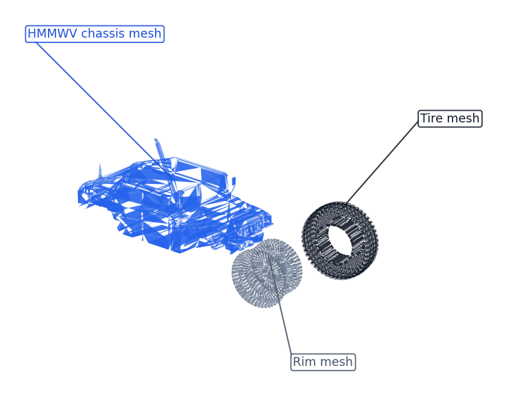 |

**설명.** Chrono data의 HMMWV visual asset을 `pychrono.vsg3d`로 캡처한 이미지이다. chassis, rim, tire mesh가 Chrono OBJ asset에서 직접 로드되어 VSG visual model로 렌더링된다. 해당 Component에 `VisualizationType_MESH`를 선택하면 VSG/Irrlicht가 같은 계열의 mesh asset을 런타임 visual로 사용한다.

| 시각 자료 |
|---|
| 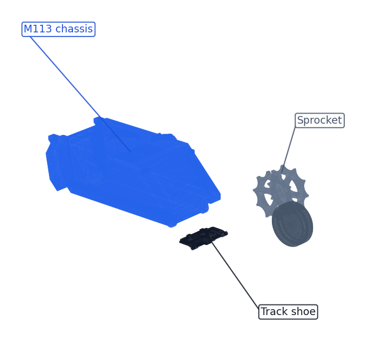 |

**설명.** Chrono data의 M113 visual asset을 `pychrono.vsg3d`로 캡처한 이미지이다. chassis, sprocket, idler, road wheel, track shoe가 Chrono OBJ asset에서 직접 로드되어 tracked subsystem의 Component 단위 mesh 경계를 보여준다.

| 시각 자료 |
|---|
| 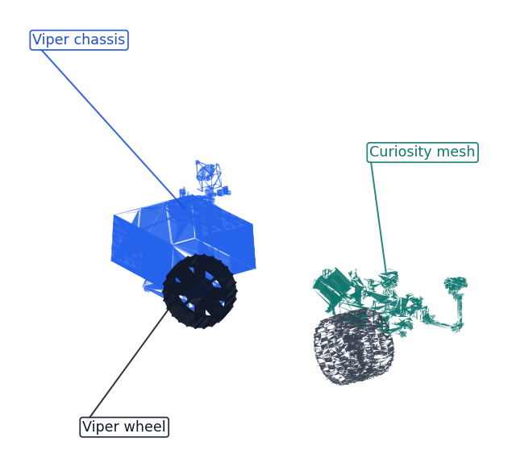 |

**설명.** Chrono Robot의 Viper/Curiosity VSG capture이다. `pychrono.vsg3d`를 사용할 수 있는 빌드에서는 Robot model을 실제로 초기화해 VSG framebuffer를 저장하고, VSG가 없을 때만 schema용 fallback preview로 대체한다. 로버 chassis와 wheel을 직접 설계하지 않고 내장 로봇 모델을 기준으로 사용할 수 있다.

```python
hmmwv.SetChassisVisualizationType(chrono.VisualizationType_MESH)
hmmwv.SetWheelVisualizationType(chrono.VisualizationType_MESH)
hmmwv.SetTireVisualizationType(chrono.VisualizationType_MESH)

m113.SetSprocketVisualizationType(chrono.VisualizationType_MESH)
m113.SetRoadWheelVisualizationType(chrono.VisualizationType_MESH)
m113.SetTrackShoeVisualizationType(chrono.VisualizationType_MESH)

viper.SetChassisVisualization(True)
viper.SetWheelVisualization(True)
```

## 2.2.2.3 Chassis Component

Chassis는 로버의 기준 body이다. 다른 Component는 대부분 Chassis 좌표계에 상대적으로 배치된다. 따라서 Chassis를 설계할 때는 "보기 좋은 박스"가 아니라 **질량 중심, 관성, 기준 좌표계, 초기 위치, 로깅 대상**까지 함께 정의해야 한다.

| 항목 | 설계 내용 |
|---|---|
| 역할 | 로버의 기준 강체, 센서/바퀴/링크가 붙는 부모 body |
| 주요 API | `chrono.ChBody`, `chrono.ChBodyEasyBox`, `SetMass`, `SetInertiaXX`, `SetPos`, `SetPosDt`, `AddVisualShape` |
| 주요 변수 | 길이/폭/높이, 질량, 질량 중심 높이, 초기 위치, 초기 속도 |
| 주의사항 | 질량 중심이 높으면 전복되기 쉽고, 초기 z 위치가 낮으면 ground와 처음부터 침투한다. |

아래 코드는 Chassis를 단순 visual로만 두지 않고 collision과 logging 대상 body로 함께 등록하는 최소 예시이다. `SetName`, `SetPos`, `SetPosDt`는 뒤의 CSV와 그래프가 어떤 body를 기록하는지 결정한다.

```python
import pychrono as chrono

system = chrono.ChSystemNSC()
system.SetGravitationalAcceleration(chrono.ChVector3d(0, 0, -9.81))

material = chrono.ChContactMaterialNSC()
material.SetFriction(0.45)

chassis = chrono.ChBodyEasyBox(
    1.4, 0.8, 0.28,      # length, width, height [m]
    350,                 # density [kg/m^3]
    True, True,          # visual=True, collision=True
    material,
)
chassis.SetName("rover_chassis")
chassis.SetPos(chrono.ChVector3d(-2.0, 0.0, 0.45))
chassis.SetPosDt(chrono.ChVector3d(1.3, 0.0, 0.0))
system.AddBody(chassis)
```

| 렌더링 관찰 기준 | 해석 기준 |
|---|---|
| Chassis 전체 배치 | 바퀴, 탑재체, 센서 마운트가 chassis 기준 좌표에 상대 배치되어야 한다. |

| 시각/그래프 자료 |
|---|
|  |

**설명.** 파란 박스가 Chassis Component이다. 바퀴, 탑재체, 센서 마운트가 모두 이 기준 body의 상대 좌표로 배치된다.

| 시각/그래프 자료 |
|---|
| 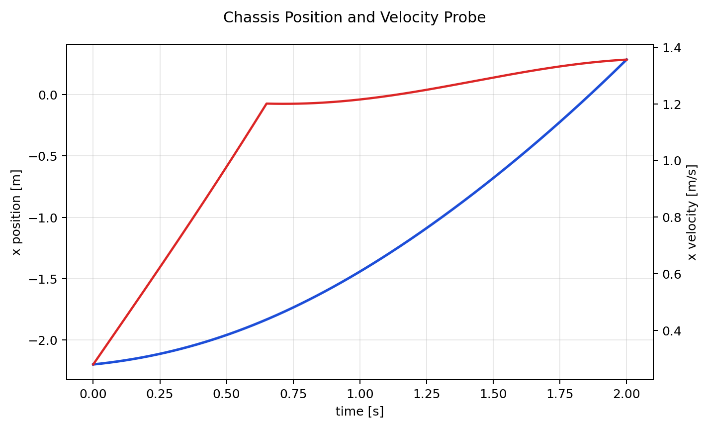 |

**설명.** `rover_vehicle_chassis_probe.csv`에서 시간에 따른 x 위치와 속도를 그린 그래프이다. Chassis는 거의 모든 System 실험에서 공통으로 기록해야 할 기본 상태량이다.

실행 코드: `code/rover_vehicle/generate_rover_vehicle_components.py`
CSV: `outputs/csv/rover_vehicle_chassis_probe.csv`

## 2.2.2.4 Payload / Sensor Mount Component

Payload/Sensor Mount는 로버 위에 올라가는 배터리, 컴퓨터, 카메라, LiDAR, IMU 브래킷 같은 부품이다. 물리적으로 질량이 크면 별도 `ChBody`로 만들고, 단순 표시용이면 Chassis에 visual shape만 추가해도 된다.

| 항목 | 설계 내용 |
|---|---|
| 역할 | 탑재체 위치와 센서 기준 좌표계 정의 |
| 주요 API | `AddVisualShape`, `ChVisualShapeBox`, `ChFramed`, Sensor module의 camera/LiDAR pose |
| 주요 변수 | chassis 기준 상대 위치, 높이, 방향, 질량 반영 여부 |
| 주의사항 | 센서 pose와 chassis pose를 혼동하면 후처리 좌표 변환이 틀어진다. |

아래 예시는 별도 body를 만들지 않고 Chassis에 visual shape를 붙이는 방식이다. 실제 질량이 큰 배터리나 장비라면 같은 위치 정보를 사용하되 별도 `ChBody`와 joint로 분리한다.

```python
payload_shape = chrono.ChVisualShapeBox(0.36, 0.42, 0.20)
payload_shape.SetColor(chrono.ChColor(0.95, 0.58, 0.08))

chassis.AddVisualShape(
    payload_shape,
    chrono.ChFramed(chrono.ChVector3d(0.45, 0.0, 0.22), chrono.QUNIT),
)
```

| 렌더링 관찰 기준 | 해석 기준 |
|---|---|
| Payload/Sensor Mount 배치 | 탑재체가 chassis 위 상대 좌표에 고정되어 이동 중에도 기준 body를 따라 움직인다. |

| 시각 자료 |
|---|
| 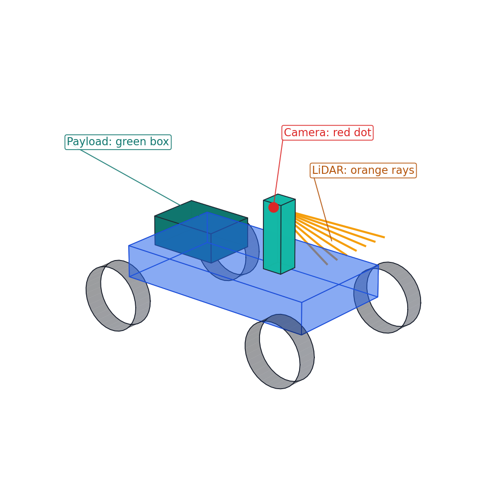 |

**설명.** 반투명 chassis 위의 초록색 박스는 payload, 청록색 기둥은 sensor mast이다. 빨간 점은 camera 기준점, 노란 ray는 LiDAR 방향, 초록 점은 GPS/IMU 기준 위치를 나타낸다.

## 2.2.2.5 Wheel and Tire Components

Chrono에서 Wheel과 Tire는 같은 부품처럼 보이지만 ownership이 다르다. **Wheel**은 회전하는 body/spindle의 위치, 관성, 축 방향, visual radius를 책임지고, **Tire**는 terrain과의 접촉/힘 모델, slip, 유효 반지름, 접촉 상태 출력을 책임진다. Core prototype에서는 하나의 cylinder collision으로 둘을 합쳐도 되지만, Vehicle subsystem으로 넘어가면 반드시 분리해서 선택해야 한다.

### Wheel Component

| 항목 | 설계 내용 |
|---|---|
| 역할 | 회전축과 질량/관성, wheel body 또는 spindle 기준 좌표 정의 |
| 주요 API | Core `ChBodyEasyCylinder`, `ChLinkRevolute`, Vehicle `ChWheel` 계열 |
| 주요 변수 | wheel radius/width, 질량, 관성, 회전축 방향, spindle attach point |
| 출력 | wheel angular speed, wheel pose, spindle/body state |
| 주의사항 | visual radius와 tire effective radius, collision radius가 항상 같다고 가정하면 안 된다. |

아래 코드는 Core 수준에서 wheel body를 만드는 형태이다. `ChAxis_Y`가 wheel 회전축과 맞아야 뒤의 revolute joint, motor 방향도 같은 기준으로 해석된다.

```python
wheel = chrono.ChBodyEasyCylinder(
    chrono.ChAxis_Y,     # wheel axle direction
    0.28,                # radius [m]
    0.18,                # width [m]
    800,                 # density [kg/m^3]
    True, True,
    material,
)
wheel.SetName("front_left_wheel")
wheel.SetPos(chrono.ChVector3d(0.55, 0.62, 0.30))
system.AddBody(wheel)
```

### Tire Component

| 항목 | 설계 내용 |
|---|---|
| 역할 | wheel-terrain interface에서 longitudinal/lateral/vertical force와 moment 계산 |
| 주요 API | `RigidTire`, `TMeasyTire`, `FialaTire`, `ChPac89Tire`, `ChPac02Tire`, FEA tire 계열 |
| 주요 변수 | tire model, effective radius, contact material, slip stiffness/curve, rolling resistance |
| 출력 | slip ratio, slip angle, normal load, longitudinal/lateral force, aligning moment, sinkage/contact state |
| 주의사항 | throttle/brake torque는 tire contact patch를 통해서만 차량 추진/감속 힘으로 바뀐다. |

타이어는 wheel에 "붙는 형상"이 아니라 terrain과 차량을 연결하는 힘 생성 Component이다. 따라서 로버 mobility를 평가할 때는 wheel pose만 보지 말고 tire output과 terrain output을 함께 저장해야 한다.

| 렌더링 관찰 기준 | 해석 기준 |
|---|---|
| Wheel/Tire 형상과 접촉 위치 | wheel radius, 폭, 축 방향, 지형 접촉점이 물리 모델과 일치해야 한다. |

| 시각 자료 |
|---|
| 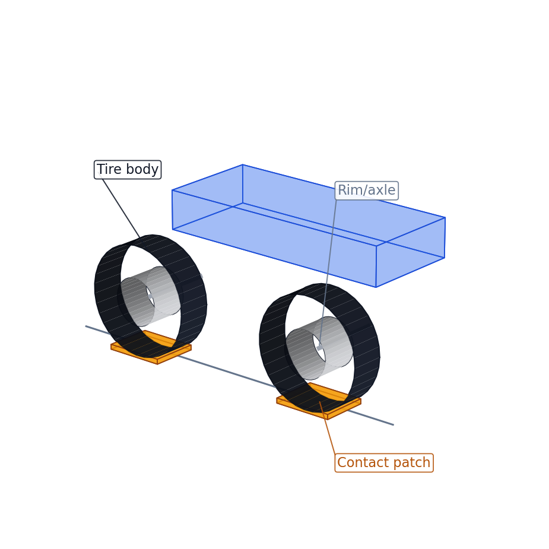 |

**설명.** 검은 원통은 wheel visual, 밝은 원통은 rim/축 기준, 주황색 패치는 지형과 만나는 contact patch 개념이다. Core에서는 원통 강체와 revolute joint로 시작하고, Vehicle에서는 tire subsystem이 이 접촉 영역의 힘을 계산한다.

## 2.2.2.6 Axle / Joint Component

Axle/Joint Component는 Chassis와 Wheel을 연결하는 회전 자유도를 정의한다. 바퀴는 굴러야 하므로 wheel body를 chassis에 완전히 고정하면 안 되고, 회전축 방향을 가진 revolute joint 또는 motor joint를 사용해야 한다.

| 항목 | 설계 내용 |
|---|---|
| 역할 | 바퀴가 정해진 축을 중심으로 회전하게 제한 |
| 주요 API | `ChLinkRevolute`, `ChLinkLockRevolute`, `ChFramed`, `QuatFromAngleX` |
| 주요 변수 | joint 위치, 회전축 방향, chassis-wheel 연결 body |
| 주의사항 | 축 방향이 틀리면 바퀴가 옆으로 굴러가거나 회전이 이상하게 보인다. |

아래 코드의 핵심은 joint frame 위치와 회전축이다. 렌더의 노란 점과 회색 축이 이 코드의 `ChFramed` 위치/방향에 해당한다.

```python
joint_frame = chrono.ChFramed(
    chrono.ChVector3d(0.55, 0.62, 0.30),
    chrono.QuatFromAngleX(chrono.CH_PI_2),
)
wheel_joint = chrono.ChLinkRevolute()
wheel_joint.Initialize(wheel, chassis, joint_frame)
system.AddLink(wheel_joint)
```

| 렌더링 관찰 기준 | 해석 기준 |
|---|---|
| Axle/Joint 방향 | 바퀴 중심과 회전축이 일치해야 하며, 축 방향 오류가 있으면 wheel motion이 비정상적으로 나타난다. |

| 시각 자료 |
|---|
| 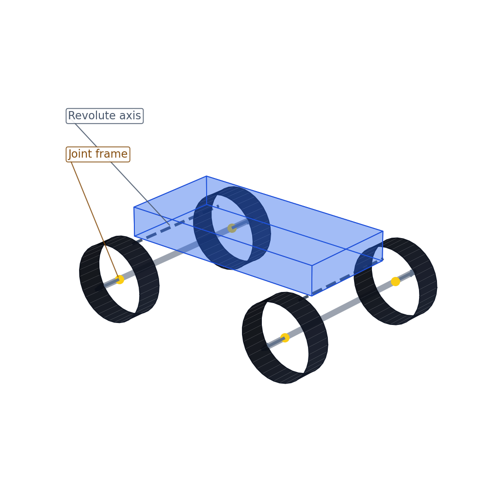 |

**설명.** 회색 축은 wheel center를 통과하는 revolute joint 축을 나타낸다. 노란 점은 joint frame 기준 위치이며, 축 방향이 wheel 원통의 중심선과 맞아야 바퀴가 의도한 방향으로 회전한다.

## 2.2.2.7 Motor / Drive Component

Motor/Drive Component는 바퀴 또는 궤도 스프로킷에 회전 입력을 전달한다. Core에서는 속도 모터와 토크 모터를 구분해야 한다. 속도 모터는 "목표 속도를 강제로 맞추는 구속"에 가깝고, 토크 모터는 실제 구동 토크를 넣는 방식에 가깝다.

| 항목 | 설계 내용 |
|---|---|
| 역할 | wheel/sprocket에 구동 입력 전달 |
| 주요 API | `ChLinkMotorRotationSpeed`, `ChLinkMotorRotationTorque`, `ChFunctionConst`, Vehicle driveline |
| 주요 변수 | 목표 각속도, 토크, throttle 입력, 좌우 구동 배분 |
| 주의사항 | 주행 성능을 보려면 속도 모터보다 토크/드라이브라인 기반 모델이 더 물리적이다. |

아래 예시는 한 wheel joint에 속도 모터를 붙이는 가장 작은 형태이다. Vehicle subsystem으로 확장할 때는 같은 역할이 powertrain, driveline, differential, brake subsystem으로 나뉜다.

```python
motor = chrono.ChLinkMotorRotationSpeed()
motor.Initialize(wheel, chassis, joint_frame)
motor.SetSpeedFunction(chrono.ChFunctionConst(8.0))  # rad/s
system.AddLink(motor)
```

| 렌더링 관찰 기준 | 해석 기준 |
|---|---|
| Motor/Drive 연결 방향 | motor가 연결된 wheel pair와 회전 방향이 구동 의도와 일치해야 한다. |

| 시각 자료 |
|---|
| 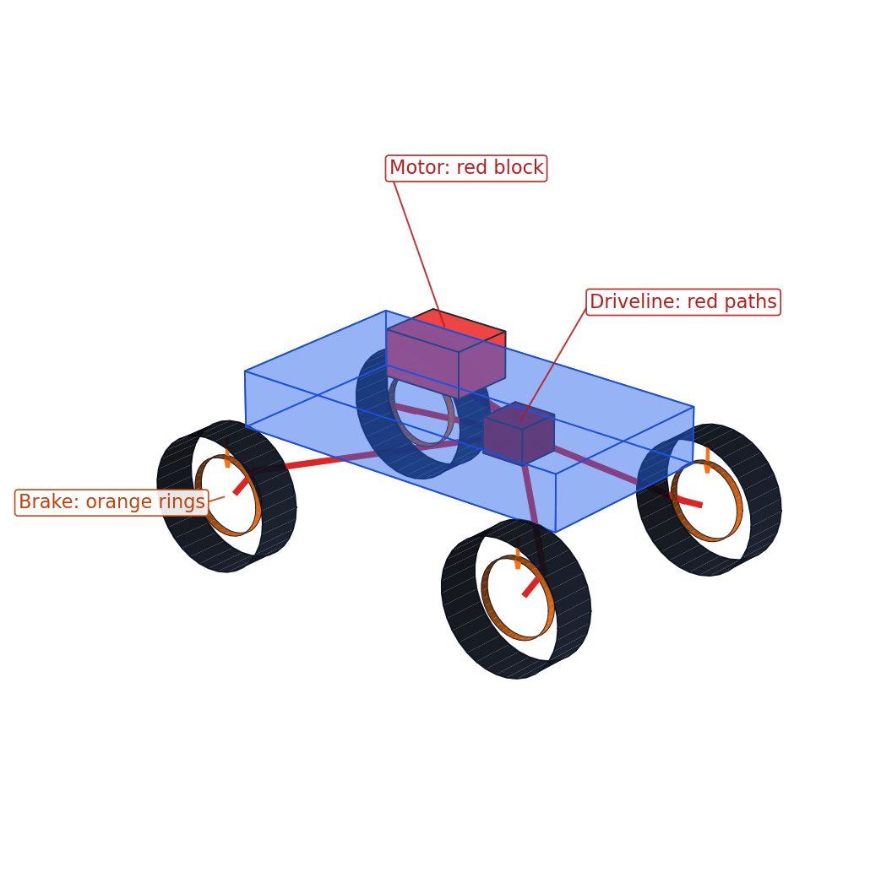 |

**설명.** 빨간 박스와 선은 motor/powertrain에서 differential 또는 driveline을 거쳐 각 wheel로 회전 입력이 전달되는 경로이다. 주황색 얇은 원판은 wheel 쪽 brake 위치를 따로 표시하므로, 구동 입력과 제동 입력을 같은 이미지에서 구분해 볼 수 있다.

## 2.2.2.8 Driver / Input / Controller Component

Driver/Input/Controller Component는 "차량을 어떻게 움직이라고 명령하는가"를 담당한다. Chrono::Vehicle의 `DriverInputs`는 steering, throttle, braking을 담는 normalized input 묶음이며, `m_steering = 0.5`가 wheel angle 0.5 rad를 뜻하지 않는다. 실제 wheel heading, throttle torque, brake torque는 steering, powertrain, driveline, brake subsystem이 각자 변환한다.

| Component | Owns | 대표 Chrono 선택 | 출력 |
|---|---|---|---|
| Input profile | 시간에 따른 steering/throttle/braking command | 직접 time function, CSV replay | input CSV |
| Interactive driver | keyboard/joystick 등 사용자 입력 | `ChInteractiveDriver` 계열 | human command log |
| Data driver | 재현 가능한 scripted 입력 | `ChDataDriver` 또는 CSV 기반 wrapper | replay trace |
| Path follower controller | 목표 path/speed와 controller gain/state | `ChPathFollowerDriver`, `ChPathFollowerACCDriver` 계열 | target-vs-state log |

```python
driver_inputs = veh.DriverInputs()
driver_inputs.m_steering = 0.0   # normalized [-1, 1], not wheel angle
driver_inputs.m_throttle = 0.4   # normalized [0, 1]
driver_inputs.m_braking = 0.0    # normalized [0, 1]

vehicle.Synchronize(time, driver_inputs, terrain)
vehicle.Advance(step_size)
```

| 검증 항목 | 해석 기준 |
|---|---|
| 입력과 상태 동시 저장 | steering/throttle/braking 없이 pose/속도만 저장하면 원인-결과를 분리하기 어렵다. |
| replay와 feedback control 구분 | CSV replay는 입력 재현이고, path follower는 상태 feedback을 포함한 controller이다. |
| steering scale 확인 | normalized steering은 steering subsystem limit을 통과한 뒤 실제 wheel heading이 된다. |

| Driver / Input / Controller component |
|---|
| 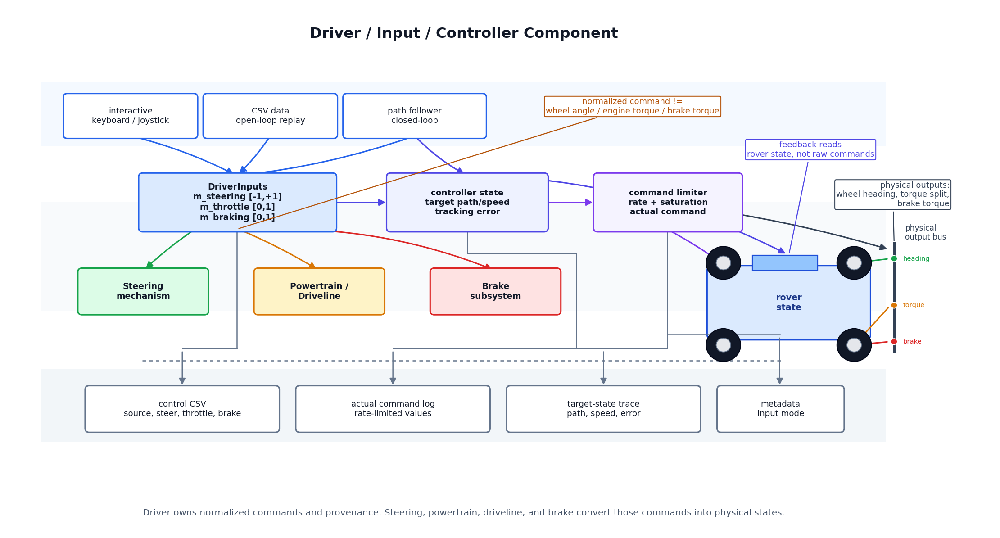 |

**설명.** Driver Component는 interactive input, CSV replay, path follower/controller가 만든 normalized command와 provenance를 소유한다. Steering, Powertrain/Driveline, Brake는 이 command를 wheel heading, torque split, brake torque로 변환하므로, control CSV에는 command와 actual physical output을 분리해서 기록한다.

### Driver / Steering / Drive Boundary Table

Driver, controller, steering, driveline은 모두 "차량이 방향을 바꾼다"는 결과에 관여하지만 소유하는 상태가 다르다. 이 경계를 분리해야 2.1 Command처럼 입력 변수만 설명하는 수준을 넘어 Component 카탈로그가 된다.

| Boundary | Owns | Does not own | Required output |
|---|---|---|---|
| Driver/Input | normalized `steering`, `throttle`, `braking`, replay source, input timestamp | 실제 wheel angle, engine torque, brake torque | `steering_cmd`, `throttle_cmd`, `braking_cmd`, input source |
| Controller | target path/speed, feedback gain/state, command generation policy | physical steering linkage or driveline torque split | target-vs-state trace, controller error |
| Steering mechanism | rack/pitman/tie-rod/steered axle relation, steering limit | throttle torque, skid-steer drive distribution | wheel heading, steering link state, steering angle |
| Driveline / Drive | left/right/front/rear torque or speed distribution, differential behavior | path tracking gain or steering linkage geometry | wheel torque split, wheel speed feedback |
| Tire / Terrain | steering/brake/throttle 결과가 만든 contact force와 slip | driver command interpretation | tire force, slip, contact patch/load |

## 2.2.2.9 Powertrain / Driveline / Brake Components

Core prototype에서는 wheel joint에 motor 하나를 붙여도 되지만, Chrono::Vehicle에서는 구동 명령이 Powertrain, Driveline, Brake로 나뉜다. 세 Component를 분리해야 throttle이 만든 토크, axle/wheel 토크 분배, 제동 토크를 각각 로깅하고 해석할 수 있다.

```text
Driver throttle
    -> Engine / Motor
    -> Transmission
    -> Driveline
    -> Wheel torque
    -> Tire longitudinal force

Driver braking
    -> Brake
    -> Wheel deceleration
    -> Tire braking force
```

| Component | 역할 | 주요 API/클래스 | 반드시 기록할 값 |
|---|---|---|---|
| Powertrain | throttle과 driveshaft speed feedback으로 engine/motor torque와 transmission 출력 torque 계산 | `ChPowertrainAssembly`, `ChEngine`, `ChTransmission` | engine speed, engine torque, gear, driveshaft torque |
| Driveline | powertrain 출력 토크를 driven axle/wheel로 배분 | 2WD/4WD/XWD driveline, shaft/kinematic driveline, differential | drive type, torque split, wheel torque |
| Brake | braking input으로 wheel brake torque를 적용하고 lock/parking 상태 처리 | `ChBrake`, `ChBrakeSimple`, `ChBrakeShafts` | braking input, brake torque, lock state |

| 시각 자료 |
|---|
| 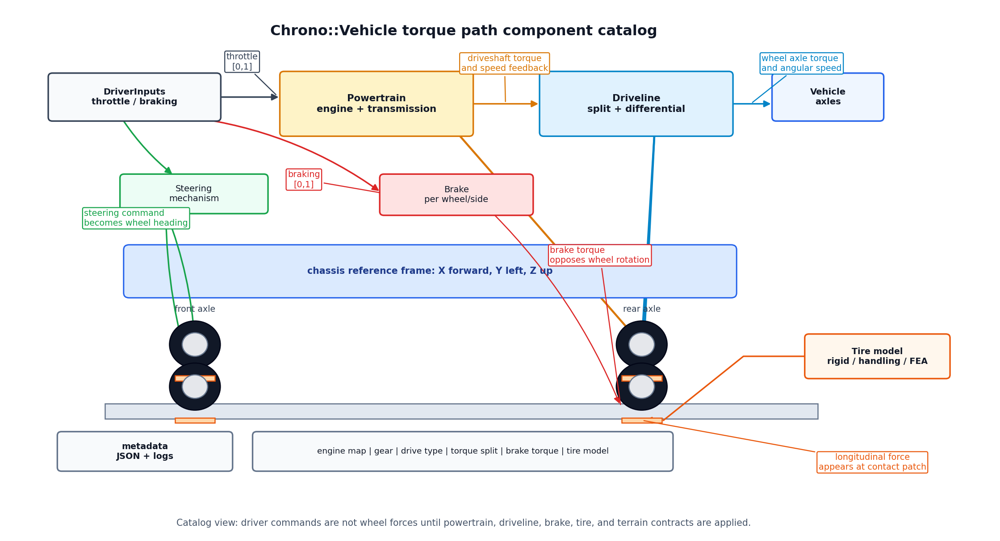 |

**설명.** 위쪽 흐름은 `DriverInputs`의 throttle이 Powertrain, Driveline, wheel torque를 거쳐 Tire contact patch의 longitudinal force가 되는 경로이다. 빨간 brake 경로는 braking input이 각 wheel/side brake torque로 들어가 wheel deceleration과 braking force를 만드는 흐름이다. 회색 metadata 화살표는 이 경로를 재현하려면 engine map, gear, drive type, torque split, brake torque, tire model을 함께 기록해야 함을 나타낸다.

### Powertrain Component Catalog

공식 Powertrain 문서는 powertrain이 driver system에서 throttle을 받고, vehicle driveline에서 driveshaft angular speed를 받아 driveshaft torque를 보낸다고 설명한다. 따라서 Powertrain Component는 "토크 상수 하나"가 아니라 engine/motor, transmission, gear state, feedback speed를 함께 소유한다.

| Powertrain choice | Owns | Consumes | Produces | Required metadata/logs | Failure modes |
|---|---|---|---|---|---|
| Core torque motor | one wheel/shaft torque function | scripted command, wheel joint frame | motor torque at one link | `motor_torque_Nm`, command source, target wheel | driveline/gear/tire feedback이 없어서 vehicle powertrain으로 오해 |
| Simple powertrain | simple speed-torque dependency, no detailed gearbox | throttle, driveshaft speed | engine torque, driveshaft torque | max torque/power/speed, driveshaft speed | gear/torque converter 효과를 설명할 수 없음 |
| Engine map + transmission | speed-torque maps, zero/full throttle maps, gear ratios, shift policy | throttle, engine speed, driveshaft speed | engine torque, gear, output torque | engine map source, gear, shift RPM/latency, losses | map provenance 누락, gear shift를 continuous torque로 착각 |
| Shafts-based powertrain | `ChShaft` engine/transmission/torque converter and chassis reaction | throttle, driveline shaft speed | shaft torque, motor block reaction, transmission state | shaft inertias, torque converter maps, gear box parameters | 1D shaft state와 body dynamics output을 섞어 해석 |
| External powertrain | third-party engine/transmission model adapter | throttle, vehicle state, sync clock | driveshaft torque/speed interface | external model id, interface variables, sync step | lag/update rate 미기록으로 재현 실패 |

### Driveline Component Catalog

공식 Driveline 문서는 driveline을 driven wheel로 power를 전달하는 subsystem으로 설명하고, powertrain-driveline과 driveline-wheel 사이에서 torque와 angular velocity를 교환한다고 설명한다. 이 교환은 constraint/shaft 기반일 수도 있고 kinematic split일 수도 있다.

| Driveline choice | Use when | Owns | Consumes | Produces | Required metadata/logs | Failure modes |
|---|---|---|---|---|---|---|
| Core direct split | 단순 rover prototype에서 좌우 wheel command만 필요 | manual left/right torque or speed split | motor command, steering/skid input | wheel command per side | `left_cmd`, `right_cmd`, split rule | physical differential이나 driveshaft feedback으로 오해 |
| Shafts 2WD | front-wheel 또는 rear-wheel drive axle 하나를 물리적으로 구동 | driveshaft, differential box, conical gear, locking limit | powertrain torque, driven axle wheel speeds | left/right wheel torque on one axle | driven axle index, shaft inertia, gear ratio, locking limit | driven axle index 누락, front/rear torque 혼동 |
| Shafts 4WD | front/rear axle 모두에 shaft/differential dynamics가 필요 | central/front/rear differentials, driveshafts, clutches | powertrain torque, four wheel axle speeds | front/rear and left/right torque | front/rear gear ratio, differential bias/lock, shaft inertias | differential lock/bias를 기록하지 않아 결과 비교 불가 |
| Simple 4WD | 빠른 vehicle model에서 fixed torque split이면 충분 | front torque fraction, simple differential bias | driveshaft torque, wheel speeds | approximate axle/wheel torque | front torque fraction, max bias | 실제 shaft/clutch dynamics로 해석 |
| Simple XWD | 6x6, 8x8 또는 다축 vehicle에서 많은 driven axle를 간단히 처리 | equal/defined torque split over many axles | driveshaft torque, all driven wheel speeds | per-axle torque approximation | driven axle list, max bias | axle count/drive type metadata 누락 |

### Brake Component Catalog

Brake Component는 throttle의 부호를 반대로 바꾸는 것이 아니다. 공식 Brake class는 braking input을 받아 brake torque를 갱신하며, simple brake와 shafts brake는 서로 다른 물리 추상화다.

| Brake choice | Owns | Consumes | Produces | Required metadata/logs | Failure modes |
|---|---|---|---|---|---|
| No explicit brake | coast-down 또는 구동만 보는 smoke test | drivetrain losses or no brake command | no brake torque | `brake_enabled=false` | 감속을 negative throttle로 기록해 해석 불가 |
| `ChBrakeSimple` / `BrakeSimple` | speed-dependent opposing torque at wheel side | normalized braking input, wheel angular speed | current brake torque | `brake_input`, `max_brake_torque_Nm`, `brake_torque_FL_Nm` | sticking/locking brake처럼 해석 |
| `ChBrakeShafts` / `BrakeShafts` | shaft/clutch-based brake connection | braking input, axle shaft state | clutch/brake torque | brake shaft inertia, max torque, lock option | shaft state와 wheel state mapping 누락 |
| Track brake | tracked vehicle steering/braking side effect | track command, sprocket/track state | side braking torque | side brake torque, track side, lock state | skid steering과 service brake가 섞임 |

### Vehicle Subsystem Probe Schema

현재 Core prototype CSV는 chassis pose와 drive motor speed 중심이다. Chrono::Vehicle 카탈로그 품질로 넘어가려면 subsystem별 evidence column을 별도 schema로 요구해야 한다. 이때 `FL/FR/RL/RR` 고정 column만 쓰면 dual wheel, 다축 차량, tracked/robot 확장으로 넘어갈 때 schema가 깨진다. Chrono wheeled vehicle API는 axle, side, wheel location으로 wheel/tire/brake를 식별하므로, catalog schema도 같은 식별자를 가진 long-form row와 dynamic wide-form column을 함께 허용한다.

### Vehicle Axle / Wheel Map Schema

| Map field | Required content |
|---|---|
| `axle_index` | front-to-rear axle id used by Chrono accessors |
| `side` | `left`, `right`, or tracked side where applicable |
| `wheel_location` | `single`, `inner`, `outer` for dual-wheel axle support |
| `steering_index` | steering subsystem id connected to the axle/wheel, or `none` |
| `suspension_id` | suspension/road-wheel assembly id |
| `wheel_id` / `tire_id` / `brake_id` | stable component ids and Chrono names |
| `driven` / `steerable` / `dual_wheel` | boolean capability flags |
| `source_json` | subsystem spec source file or class template source |
| `body_ids` / `link_ids` | Chrono body/link ids exported for this wheel path |

| Column group | Required columns | Purpose |
|---|---|---|
| Driver input | `time_s`, `steering_cmd`, `throttle_cmd`, `braking_cmd`, `input_source` | replay/controller 입력과 vehicle response 연결 |
| Powertrain | `engine_speed_radps`, `engine_torque_Nm`, `gear`, `driveshaft_speed_radps`, `driveshaft_torque_Nm` | throttle이 torque로 변환되는 과정 검증 |
| Driveline | `drive_type`, `front_torque_fraction`, `wheel_torque_FL_Nm`, `wheel_torque_FR_Nm`, `wheel_torque_RL_Nm`, `wheel_torque_RR_Nm` | axle/wheel torque split 검증 |
| Brake | `brake_torque_FL_Nm`, `brake_torque_FR_Nm`, `brake_torque_RL_Nm`, `brake_torque_RR_Nm`, `brake_lock_state` | braking command와 wheel deceleration 분리 |
| Tire | `tire_Fx_FL_N`, `tire_Fz_FL_N`, `slip_ratio_FL`, `slip_angle_FL_rad`, `contact_patch_FL` | tire model이 만든 force/slip evidence |
| Steering/Suspension | `steering_angle_FL_rad`, `suspension_travel_FL_m`, `wheel_load_FL_N`, `camber_FL_rad`, `toe_FL_rad` | mechanism geometry와 wheel load path 검증 |

Wide-form output may use semantic names only after the axle map proves them. Preferred generated column pattern is `wheel_torque_axle0_left_outer_Nm`, `tire_Fz_axle1_right_single_N`, `steering_angle_axle0_left_single_rad`, and `brake_torque_axle2_right_inner_Nm`; `FL` is only a display alias derived from the map, not the canonical key.

현재 이 폴더의 live-style generated evidence는 Core chassis/motor smoke probe이다. `outputs/csv/rover_vehicle_chassis_probe.csv`는 `schema_id=rover.chassis_smoke_probe.v0`, `run_id`, `scenario_id`, `step_index`, catalog-level `component_id`, `vehicle_model`, `terrain_component_id`, chassis pose/velocity, motor speed, contact force, `source`를 가진 최소 검증 산출물이다. Chrono::Vehicle 확장부는 schema-only fallback artifact로도 인덱싱되어 있으며 `outputs/csv/vehicle_subsystem_probe.csv`, `outputs/csv/vehicle_axle_wheel_map.csv`, `outputs/csv/vehicle_frame_hardpoint_map.csv`, `outputs/json/vehicle_model_spec_manifest.json`, `outputs/json/vehicle_component_list.json`, `outputs/json/vehicle_subsystem_types.json`, `outputs/json/vehicle_subsystem_output_policy.json`을 생성한다. `vehicle_component_list.json`은 catalog id (`component_id`, `catalog_component_id`)와 concrete row id (`instance_id`, `chrono_item_id`)를 분리하므로 `vehicle.axle.front` 같은 instance id가 Global Component Catalog id와 섞이지 않는다. 이들은 `source=fallback_vehicle_schema_only_*`인 upgrade contract이므로, 검증 완료로 취급하려면 같은 schema를 `source=pychrono_vehicle`로 생성하고 Chrono version, 실제 Vehicle JSON/source map, 입력/힘/토크 graph link를 함께 남겨야 한다.

Vehicle 모델을 사용할 때 사용자는 보통 engine/transmission/brake를 직접 advance하지 않는다. `vehicle.Synchronize(time, driver_inputs, terrain)`가 driver input, terrain, tire, driveline, powertrain을 같은 시간 기준으로 맞추고, `vehicle.Advance(step_size)`가 각 subsystem 상태를 전진시킨다.

## 2.2.2.10 Steering Component

Steering Component는 Driver가 만든 normalized `m_steering`을 실제 mechanical steering motion으로 바꾸는 부품이다. Ackermann 차량은 rack/pitman arm/spindle을 통해 wheel heading을 바꾸고, skid-steering 로버는 좌우 wheel speed 차이로 yaw를 만든다. Path follower 같은 controller는 앞 절의 Driver/Input/Controller에 속하고, Steering은 그 입력을 기구적으로 해석하는 쪽에 둔다.

| 방식 | 구현 개념 | 장점 | 주의사항 |
|---|---|---|---|
| Ackermann steering | 앞바퀴 spindle/joint 방향을 회전 | 자동차형 주행에 적합 | steering linkage가 필요 |
| Skid steering | 좌우 wheel speed 차이로 yaw 생성 | 로버/궤도 차량에 적합 | 지형 마찰과 slip 영향이 큼 |

아래 코드는 skid steering의 입력 분배만 떼어낸 예시이다. 실제 구현에서는 `left_speed`, `right_speed`가 좌우 wheel motor 또는 track sprocket 명령으로 연결된다.

```python
# Skid-steering style conceptual input
left_speed = base_speed - turn_gain * steering_cmd
right_speed = base_speed + turn_gain * steering_cmd
```

| 렌더링 관찰 기준 | 해석 기준 |
|---|---|
| Steering 방식 | Ackermann steering은 앞바퀴 조향각으로, skid-steering은 좌우 wheel speed 차이로 방향 전환이 나타난다. |

| 시각 자료 |
|---|
| 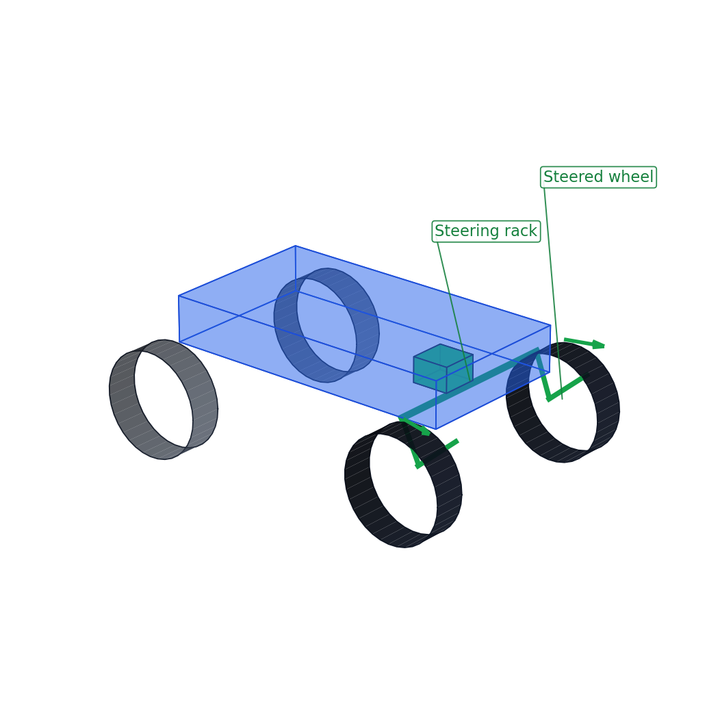 |

**설명.** 초록색 rack/tie rod가 조향 입력을 조향 대상 wheel assembly로 전달하고, 초록 화살표가 wheel heading 변화를 나타낸다. 조향 입력은 주행 결과 해석을 위해 Control Logger에 함께 기록한다.

## 2.2.2.11 Suspension Component

Suspension은 Chassis와 Wheel 사이의 링크, 스프링, 댐퍼를 묶는다. 단순 실험은 rigid axle로 시작해도 되지만, 험지 주행이나 wheel load 변화를 보려면 `ChLinkTSDA` 같은 spring-damper Component가 필요하다.

| 항목 | 설계 내용 |
|---|---|
| 역할 | 지형 충격 흡수, 바퀴 접지 유지, 차체 자세 안정 |
| 주요 API | `ChLinkTSDA`, `ChLinkRSDA`, `ChLinkRevolute`, Vehicle suspension subsystem |
| 주요 변수 | spring stiffness, damping, rest length, link 위치 |
| 주의사항 | stiffness/damping이 너무 작으면 차체가 바닥에 닿고, 너무 크면 수치적으로 불안정해질 수 있다. |

### Suspension Family Selection Table

| Suspension family | Owns | Required parameters | Outputs to validate | Typical use | Failure modes |
|---|---|---|---|---|---|
| Rigid axle / rigid suspension | wheel location with little/no compliance | axle pose, spindle frame, wheel inertia | wheel pose, axle reaction | smoke test, simple rover | wheel load path가 과도하게 단순화됨 |
| Double wishbone / reduced double wishbone | upper/lower arm hardpoints, spindle/upright, spring-damper | hardpoint table, spring/damper curves, steering tie-rod attach | suspension travel, camber/toe, wheel load | off-road vehicle, HMMWV style | hardpoint frame 오류, over-constraint |
| MacPherson strut | strut top mount, lower arm, steering axis | strut location, spring/damper, spindle geometry | strut travel, camber change | passenger car front suspension | steering axis와 strut axis 혼동 |
| Multi-link / semi-trailing arm | multiple links and compliance path | link hardpoints, bushing/compliance, limits | wheel alignment, travel, reaction forces | higher-fidelity handling | hardpoint provenance 누락 |
| Solid axle / leaf spring | left-right wheel coupling, axle housing, leaf/coil support | axle mass/inertia, leaf/spring data, shock data | axle roll, wheel load transfer | trucks, bus, utility vehicle | independent suspension처럼 해석 |
| Robot rocker-bogie | passive rocker/bogie link geometry and wheel motor frames | link lengths, pivot frames, wheel motor axes | wheel-ground contact continuity, chassis pitch/roll | Curiosity/Viper style rover | steering/driveline assumptions을 car-like로 가져옴 |

아래 코드는 chassis와 wheel 사이에 TSDA spring-damper를 추가한다. 렌더의 보라색 coil은 `ChLinkTSDA`, 주황색 arm은 별도 link/joint로 확장되는 구조를 나타낸다.

```python
spring = chrono.ChLinkTSDA()
spring.Initialize(
    chassis,
    wheel,
    False,
    chrono.ChVector3d(0.55, 0.45, 0.55),
    chrono.ChVector3d(0.55, 0.62, 0.30),
)
spring.SetSpringCoefficient(18000.0)
spring.SetDampingCoefficient(1200.0)
system.AddLink(spring)
```

| 렌더링 관찰 기준 | 해석 기준 |
|---|---|
| Suspension link와 spring/damper | chassis와 wheel 사이의 링크, 스프링, 댐퍼가 분리되어 보이면 지형 충격 전달 경로를 해석하기 쉽다. |

| 시각 자료 |
|---|
| 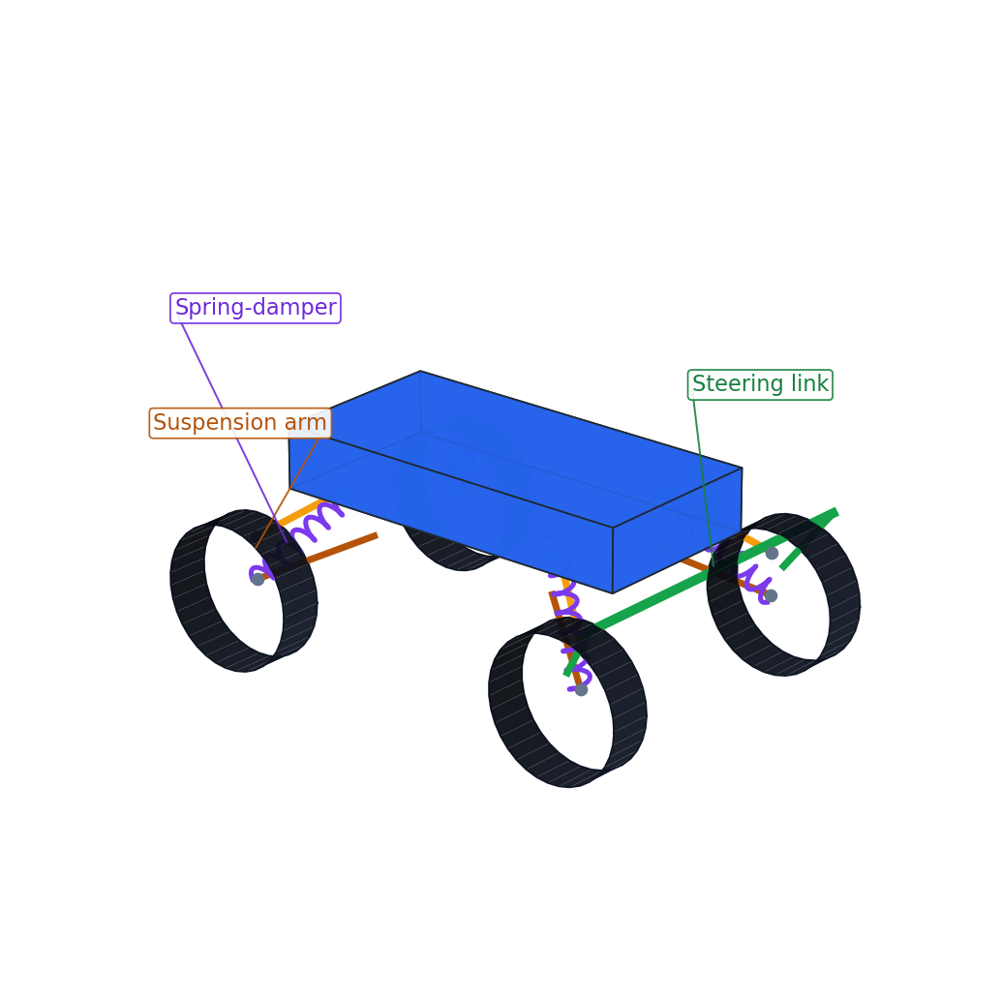 |

**설명.** 주황색 링크는 suspension arm, 보라색 coil은 spring-damper, 초록색 링크는 steering rack/tie rod 개념이다. 실제 Chrono 구현에서는 link, revolute joint, TSDA/RSDA를 조합해 현가장치를 만든다.

## 2.2.2.12 Visual Shape Component

Visual Shape는 사람이 보는 외형이다. 렌더링 이미지, 디버깅 화면, 센서 렌더링에는 중요하지만 접촉 계산에는 직접 사용되지 않을 수 있다. 복잡한 CAD mesh를 visual로 쓰더라도 collision은 단순 primitive로 따로 잡는 것이 일반적이다.

| 항목 | 설계 내용 |
|---|---|
| 역할 | 사람이 부품을 식별할 수 있게 표시 |
| 주요 API | `ChVisualShapeBox`, `ChVisualShapeCylinder`, `ChVisualShapeTriangleMesh`, `AddVisualShape`, texture |
| 주요 변수 | 색, 투명도, mesh 파일, body 기준 상대 pose |
| 주의사항 | visual mesh를 그대로 collision mesh로 쓰면 계산 비용과 불안정성이 커질 수 있다. |

아래 코드는 외형만 추가하는 예시이다. `AddVisualShape`는 사람이 보는 형상을 붙이며, 접촉 계산이 필요하면 별도의 collision shape 설정을 확인해야 한다.

```python
shape = chrono.ChVisualShapeBox(1.8, 0.9, 0.34)
shape.SetColor(chrono.ChColor(0.05, 0.26, 0.78))
chassis.AddVisualShape(shape)
```

| 렌더링 관찰 기준 | 해석 기준 |
|---|---|
| Visual Shape 식별성 | chassis, wheel, payload가 색과 형상으로 구분되어야 모델 구조를 직관적으로 파악할 수 있다. |

| 시각 자료 |
|---|
| 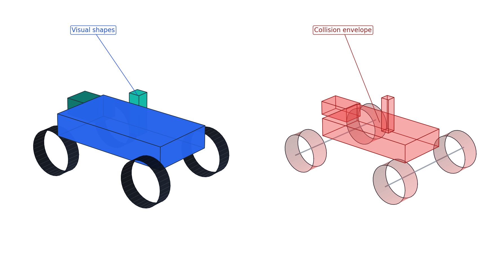 |

**설명.** 같은 비교 이미지의 왼쪽 panel은 사람이 보는 Visual Shape이다. 시각화와 디버깅에는 중요하지만, 물리 접촉 계산 자체는 오른쪽 panel의 Collision Shape가 담당한다.

## 2.2.2.13 Collision Shape Component

Collision Shape는 접촉 검출과 접촉력 계산에 쓰인다. 단순 박스/구/실린더를 우선 사용하고, 반드시 필요한 경우에만 mesh collision을 사용한다. Collision Shape가 너무 복잡하면 계산량이 늘고, 너무 단순하면 실제 형상과 접촉 위치가 달라질 수 있다.

| 항목 | 설계 내용 |
|---|---|
| 역할 | 접촉 판정, 침투 깊이, 접촉 법선 계산 |
| 주요 API | `ChBodyEasyBox`, `ChCollisionShapeBox`, `ChCollisionShapeCylinder`, `ChContactMaterialNSC` |
| 주요 변수 | collision envelope 크기, 마찰/반발 계수, body별 collision enable |
| 주의사항 | Visual Shape와 Collision Shape를 분리해 시각화 자료에서 함께 확인한다. |

아래 예시는 visual을 끄고 collision만 켠 body를 만드는 형태이다. 실제 모델에서는 visual body와 collision envelope가 같은 body에 함께 있을 수도 있지만, 검토 단계에서는 분리해 보면 차이를 확인하기 쉽다.

```python
collision_body = chrono.ChBodyEasyBox(
    1.7, 0.78, 0.30,
    350,
    False, True,  # visual=False, collision=True
    material,
)
collision_body.SetName("chassis_collision_envelope")
```

| 렌더링 관찰 기준 | 해석 기준 |
|---|---|
| Collision envelope | visual shape와 collision envelope의 차이가 드러나야 충돌 계산에 사용되는 실제 형상을 검증할 수 있다. |

| 시각 자료 |
|---|
|  |

**설명.** 같은 비교 이미지의 오른쪽 panel은 붉은 반투명 Collision Shape envelope를 보여준다. 실제 로버 mesh가 복잡해도 충돌 형상은 단순화해야 계산이 안정적이다.

## 2.2.2.14 Initial State Component

초기 위치와 속도는 별도 Component처럼 관리한다. 같은 로버라도 시작 위치, 방향, 속도, 바퀴 회전 속도에 따라 완전히 다른 결과가 나오기 때문이다.

| 항목 | 설계 내용 |
|---|---|
| 역할 | 실험 시작 조건 정의 |
| 주요 API | `SetPos`, `SetRot`, `SetPosDt`, `SetAngVelParent`, motor function 초기값 |
| 주요 변수 | 시작 위치, yaw/pitch/roll, 선속도, 각속도, wheel speed |
| 주의사항 | 지형과 초기 침투가 생기지 않도록 wheel radius와 ground height를 기준으로 z 위치를 잡는다. |

아래 코드는 System 실행 직전에 적용되는 초기 조건이다. 같은 Component라도 이 값이 바뀌면 접촉 시점, 충돌력, 궤적이 모두 달라진다.

```python
start_pos = chrono.ChVector3d(-2.0, 0.0, 0.45)
start_yaw = chrono.QuatFromAngleZ(0.0)
chassis.SetPos(start_pos)
chassis.SetRot(start_yaw)
chassis.SetPosDt(chrono.ChVector3d(1.3, 0.0, 0.0))
```

| 렌더링 관찰 기준 | 해석 기준 |
|---|---|
| 초기 pose와 속도 방향 | 시작 위치, 지면 높이, 진행 방향 화살표가 함께 맞아야 첫 step에서 침투나 반대 방향 이동을 피할 수 있다. |

| 시각 자료 |
|---|
| 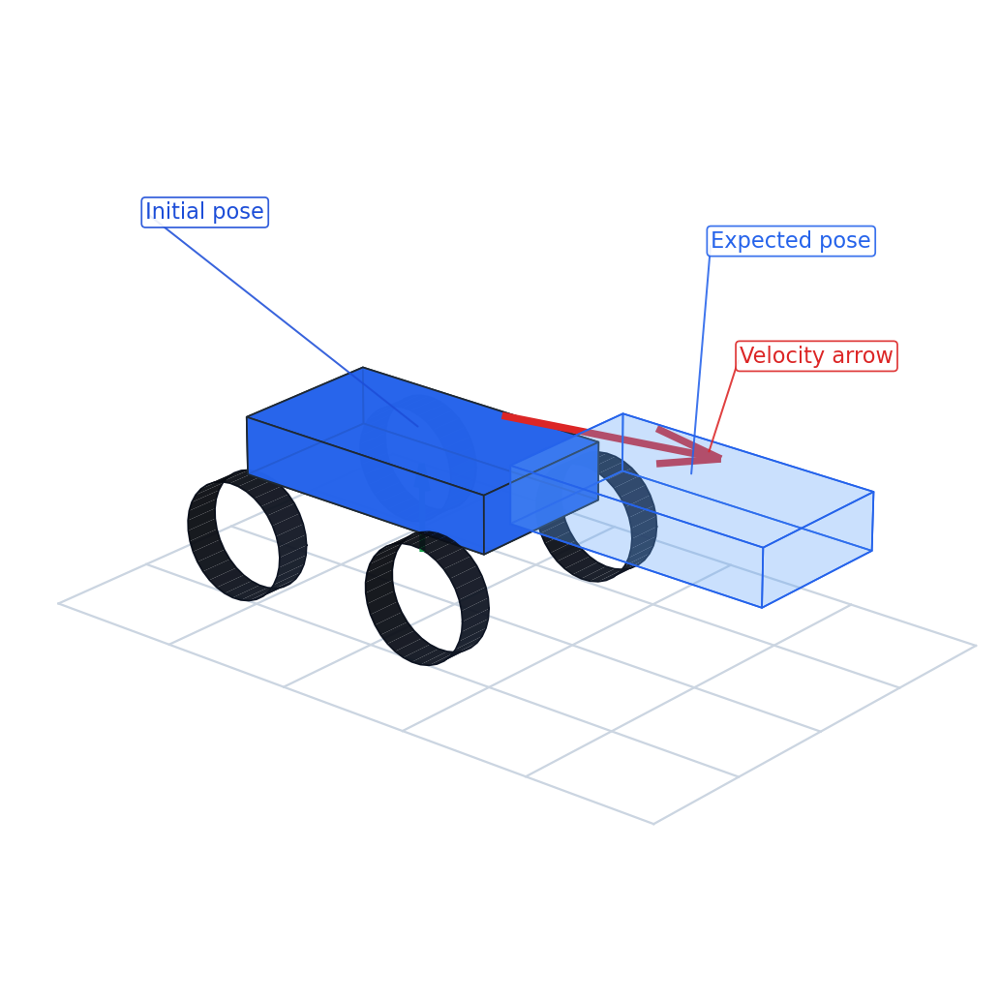 |

**설명.** 진한 파란 차체는 초기 pose, 옅은 파란 박스는 진행 후 예상 위치를 나타낸다. 빨간 화살표는 초기 속도 방향, 초록 화살표는 ground 상면 기준 높이를 확인하는 z 기준이다.

## 2.2.2.15 Chrono::Vehicle 확장 Component

Core 기반 로버가 body/link/motor의 원리를 익히는 단계라면, Chrono::Vehicle은 완성 차량의 subsystem을 조합하는 단계이다. 아래 표는 직접 구성한 Component와 Vehicle module의 공식 subsystem이 어떻게 대응되는지 정리한 것이다.

| Component | 역할 | Chrono::Vehicle 관점 |
|---|---|---|
| Vehicle Model Spec | top-level template과 nested subsystem 파일 hierarchy resolve | vehicle JSON/template, nested source files, component list/export manifest |
| Frame / Hardpoint Map | ISO vehicle frame, subsystem frame, hardpoint 좌표계 고정 | chassis/subsystem location, hardpoint table, world transform check |
| Chassis | 차량 기준 body | `ChChassis`, vehicle chassis subsystem |
| Subchassis | suspension/axle support를 위한 secondary body/beam | subchassis/balancer subsystem, chassis-relative location |
| Axle | suspension, wheel, tire, brake의 front-to-rear bundle index | `ChAxle`, axle/side/wheel-location accessors |
| Suspension | 차체와 wheel assembly 연결 | Double Wishbone, MacPherson, Multi-link, Solid Axle 등 |
| Anti-roll bar | 좌우 suspension travel을 roll stiffness로 연결 | anti-roll bar subsystem, RSD/constraint output |
| Steering | 조향 입력을 바퀴 방향으로 전달 | Pitman arm, rack-pinion 계열 steering subsystem |
| Wheel | rotating wheel/spindle body와 visualization | wheel subsystem, tire force model과 분리 |
| Tire | 지형과의 힘 계산 | Rigid, TMeasy, Fiala, Pacejka, FEA tire |
| Driveline | 엔진/모터 출력을 구동 바퀴로 배분 | AWD/RWD/FWD driveline subsystem |
| Brake | 바퀴 회전을 감속 | brake subsystem |
| Powertrain | throttle 입력을 torque로 변환 | engine, transmission, motor map |

아래 코드는 직접 만든 Core body/link 구조에서 Vehicle module의 완성 subsystem으로 넘어갈 때의 초기화 흐름이다. 실제 클래스와 enum 이름은 선택한 vehicle model에 따라 달라지므로, 여기서는 어떤 설정을 한 묶음으로 정해야 하는지만 보여준다.

```python
import pychrono.vehicle as veh

# 예시: Chrono 데모에서 많이 쓰는 패턴
# hmmwv = veh.HMMWV_Full()
# hmmwv.SetDriveType(veh.DrivelineTypeWV_AWD)
# hmmwv.SetTireType(veh.TireModelType_TMEASY)
# hmmwv.SetInitPosition(chrono.ChCoordsysd(init_pos, init_rot))
# hmmwv.Initialize()
```

| 렌더링 관찰 기준 | 해석 기준 |
|---|---|
| Vehicle subsystem 구조 | suspension, steering, tire visualization을 통해 Core Component가 Vehicle subsystem으로 어떻게 확장되는지 확인한다. |

| 시각 자료 |
|---|
|  |

**설명.** HMMWV VSG visual asset capture는 Core primitive rover보다 실제 차량 subsystem에 가까운 chassis, rim, tire visual을 제공한다. `outputs/json/vehicle_vsg_capture_manifest.json`은 camera pose/FOV, resolution, image hash, visible vehicle part id, fallback 여부를 기록한다. Vehicle 확장 단계에서는 이런 내장 visual asset과 tire/driveline/suspension subsystem을 함께 선택한다.

## 2.2.2.16 Chrono::Robot 로버 확장

Chrono에는 Curiosity, Viper, Turtlebot 같은 로봇 모델 예제가 포함되어 있다. 직접 만든 Core 로버 Component는 기본 원리 학습에 적합하고, 내장 Robot 모델은 실제 로버 구조를 빠르게 실험하는 데 적합하다.

| 모델 | 특징 | 학습 포인트 |
|---|---|---|
| Curiosity | 화성 로버형 6륜 구조 | rocker-bogie, wheel motor, rigid terrain |
| Viper | 달 탐사용 소형 로버 예시 | suspension spring, wheel-ground interaction |
| Turtlebot | 실내 모바일 로봇 | differential drive, 단순 평면 이동 |

### Robot Model Contract

Chrono::Robot 모델은 Chrono::Vehicle subsystem이 아니라 조립된 robot parts catalog이다. 따라서 Vehicle의 tire/driveline/suspension 표와 같은 이름을 쓰더라도, 실제 ownership은 robot model class가 제공하는 chassis, wheel, arm/upright, driver/motor command 경계로 해석한다.

| Robot model | Owns | Inputs / driver | Required logs / metadata | Failure modes | Upgrade path |
|---|---|---|---|---|---|
| Curiosity | chassis, wheel, rocker, bogie, upright/differential parts, wheel IDs, visual/collision asset policy | rover driver, wheel motor speed/torque command, terrain sync | `robot_model=Curiosity`, wheel id map, rocker-bogie frame, wheel type, chassis type | Vehicle suspension/driveline assumptions을 그대로 적용, wheel id mapping 누락 | Core rover -> Curiosity robot model -> mission terrain/sensor bundle |
| Viper | chassis, wheels, upper/lower arms, uprights, suspension spring, driver objects, wheel type choices | Viper driver or per-wheel command, terrain sync | `robot_model=Viper`, wheel id map, suspension state, wheel-ground evidence | robot suspension을 generic vehicle suspension으로 오해, driver source 미기록 | Core rover -> Viper robot model -> SCM/rigid terrain mobility study |
| Turtlebot | chassis/plates/rods, active drive wheels, passive wheels, collision families | left/right active wheel speed command | `robot_model=Turtlebot`, `WheelID`, active/passive wheel state, collision family | differential-drive command와 car-like steering 혼동 | differential-drive prototype -> Turtlebot robot model -> indoor sensor/logging setup |

아래 경로의 데모는 Robot module을 선택할 때 확인할 기준 코드이다. 직접 만든 wheel/body를 쓰는 대신 모델 클래스가 chassis, wheel, suspension 구성을 내부적으로 제공한다.

```python
# 로컬 참고 데모
# chrono/src/demos/python/robot/demo_ROBOT_Curiosity_Rigid.py
# chrono/src/demos/python/robot/demo_ROBOT_Viper_Rigid.py
```

| 시각 자료 |
|---|
|  |

**설명.** Viper/Curiosity VSG capture는 로버 body와 wheel 형상을 직접 설계하지 않고 Chrono Robot 모델을 기준으로 실험을 시작할 수 있음을 보여준다. `outputs/json/robot_vsg_capture_manifest.json`은 어떤 Chrono build/data path에서 캡처했는지, camera pose/FOV, resolution, image hash, visible robot part id, fallback 여부를 기록한다. Component를 직접 조립하는 방식과 내장 로봇 모델을 쓰는 방식의 선택 근거가 된다.

## 2.2.2.17 Tracked Vehicle 확장 Component

바퀴형 로버와 달리 궤도형 로버는 Track Shoe, Sprocket, Idler, Roller가 핵심 Component가 된다. 접촉점이 많아 주행 안정성이 좋아질 수 있지만 계산량도 증가한다.

| Component | 역할 | 설계 시 주의사항 |
|---|---|---|
| Track Shoe | 지면과 접촉하는 궤도 조각 | shoe 개수가 많아질수록 접촉 계산량 증가 |
| Sprocket | 구동 토크를 track에 전달 | tooth 형상과 track 간격 정합 필요 |
| Idler | track 장력과 경로 유지 | 위치 조절로 장력 안정화 |
| Roller | chassis 하중을 track에 분산 | 지형 요철에서 접촉 유지 확인 |

### Tracked Subsystem Contract

Chrono::Vehicle tracked model은 track assembly가 sprocket, idler/tensioner, roller/road wheel, suspension, track-shoe mechanism을 담는 container이다. 바퀴형 로버의 wheel/tire 표와 달리, shoe type과 sprocket profile의 compatibility, track tension, contact count, timestep 안정성이 함께 기록되어야 한다.

| Tracked subsystem | Owns | Required metadata | Evidence to validate | Failure modes |
|---|---|---|---|---|
| Track Assembly | left/right track container, automatic shoe assembly path, assembly topology | `track_assembly_type`, side, `shoe_count`, assembly routine, `track_contact_count` | tracked component render, contact count/time graph | shoe 수나 assembly path mismatch, excessive contact count |
| Track Shoe | pad body, connector bodies, guiding pin/contact geometry | `shoe_type`, `guide_pin_type`, pad mass/inertia, collision geometry | shoe pose/contact sample, sprocket engagement render | single-pin/double-pin/band assumption mismatch |
| Sprocket | driveline-to-track engagement, gear profile, custom shoe collision processing | `sprocket_profile`, gear radius/path, compatible `shoe_type` | sprocket/shoe alignment render, torque/contact log | sprocket profile과 shoe type 불일치 |
| Idler / Tensioner | idler wheel, translational/distance mechanism, preload/spring-damper | `idler_tensioner`, preload, travel limit, idler frame | tension/travel log, track sag render | 나쁜 tension으로 derailment/contact noise |
| Roller / Road Wheel | chassis load support and track path shaping | road wheel count, radius, spacing, suspension link | roller contact distribution | roller spacing 오류, track penetration |
| Track Brake / Driveline | side drive/braking torque and skid-steer behavior | side torque, brake torque, differential/drive type | side speed/torque log | service brake와 skid-steer brake 혼동 |

Tracked Vehicle은 바퀴형 로버와 달리 구동 sprocket, idler, roller, track shoe가 한 subsystem 안에서 맞물린다. 아래 예시는 실제 코드에서 track shoe visual과 sprocket visual을 어떤 단위로 켜는지 보여주는 개념 형태이다.

```python
tracked_vehicle.SetChassisVisualizationType(chrono.VisualizationType_MESH)
tracked_vehicle.SetSprocketVisualizationType(chrono.VisualizationType_MESH)
tracked_vehicle.SetIdlerVisualizationType(chrono.VisualizationType_MESH)
tracked_vehicle.SetRoadWheelVisualizationType(chrono.VisualizationType_MESH)
tracked_vehicle.SetTrackShoeVisualizationType(chrono.VisualizationType_MESH)
```

| 렌더링 관찰 기준 | 해석 기준 |
|---|---|
| Tracked Vehicle 구성 | track shoe, sprocket, idler, roller가 각각 구분되어야 궤도 주행의 접촉 경로와 구동 경로를 설명할 수 있다. |

| 시각 자료 |
|---|
| 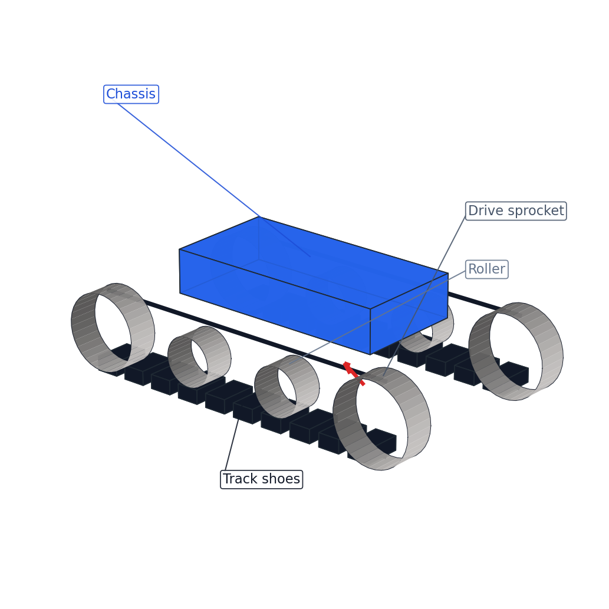 |

**설명.** 궤도형 로버는 바퀴 하나가 아니라 여러 track shoe가 지형과 동시에 접촉한다. 따라서 Contact Logger와 계산 timestep 관리가 더 중요해진다.

| 시각 자료 |
|---|
|  |

**설명.** M113 VSG visual asset capture는 tracked subsystem이 chassis, sprocket, idler, road wheel, track shoe 단위의 visual mesh를 갖는다는 점을 보여준다. 직접 만든 단순 궤도 도식에서 Chrono::Vehicle tracked model로 확장할 때 확인할 기준 이미지이며, 캡처 provenance는 `outputs/json/vehicle_vsg_capture_manifest.json`에 기록된다.

## 2.2.2.18 로버 Component 검증 체크리스트

| 점검 항목 | 확인 방법 |
|---|---|
| 초기 침투 없음 | 시뮬레이션 시작 직후 contact force가 비정상적으로 크지 않은지 확인 |
| Chassis 속도 정상 | `rover_vehicle_chassis_probe.csv`의 `vx_mps` 확인 |
| wheel 축 방향 정상 | 렌더에서 wheel이 의도한 축을 중심으로 회전하는지 확인 |
| Visual/Collision 분리 | collision debug 렌더 또는 반투명 envelope 렌더 확인 |
| Control 입력 저장 | throttle, brake, steering, motor speed/torque를 CSV에 함께 기록 |
| Driver/Controller 분리 | normalized `DriverInputs`, replay source, path follower gain/state를 steering mechanism과 따로 기록 |
| Powertrain/Driveline/Brake 분리 | throttle torque path와 braking torque path를 별도 column/section으로 저장 |
| Vehicle schema 검증 상태 표시 | Core smoke probe와 Chrono::Vehicle subsystem probe schema를 구분하고, upgrade schema는 별도 CSV/metadata가 생기기 전까지 validated artifact로 표시하지 않는다. |

## 2.2.2.19 로컬 참고 코드 반영

`lessons/phase4/hojin/lesson_19_hojin_rover_mvp0_collision_dummy.py`는 단일 차체, 장애물, 접촉 CSV를 갖춘 기초 예제이다. 본 절의 `generate_rover_vehicle_components.py`는 그 구조를 그대로 반복하지 않고, Chassis/Wheel/Suspension/Tracked 확장 구조를 Component 매뉴얼 형태로 재구성했다.

## 2.2.2.20 참고 문헌

- Project Chrono API 문서: https://api.projectchrono.org/
- Chrono Vehicle overview: https://api.projectchrono.org/vehicle_overview.html
- Chrono wheeled vehicle class reference: https://api.projectchrono.org/classchrono_1_1vehicle_1_1_ch_wheeled_vehicle.html
- Chrono wheeled vehicle subsystem overview: https://api.projectchrono.org/wheeled_vehicle.html
- Chrono Vehicle powertrain models: https://api.projectchrono.org/vehicle_powertrain.html
- Chrono Vehicle driveline models: https://api.projectchrono.org/wheeled_driveline.html
- Chrono Vehicle tire models: https://api.projectchrono.org/wheeled_tire.html
- Chrono Vehicle visualization and subsystem context: https://api.projectchrono.org/vehicle_visualization.html
- Chrono wheeled subsystem index: https://api.projectchrono.org/group__vehicle__wheeled.html
- Chrono Vehicle subchassis class: https://api.projectchrono.org/classchrono_1_1vehicle_1_1_ch_subchassis.html
- Chrono Vehicle anti-roll bar subsystem: https://api.projectchrono.org/group__vehicle__wheeled__antirollbar.html
- Chrono Vehicle terrain system: https://api.projectchrono.org/group__vehicle__terrain.html
- Chrono tracked vehicle overview: https://api.projectchrono.org/tracked_vehicle.html
- Chrono tracked assembly: https://api.projectchrono.org/tracked_assembly.html
- Chrono `ChTrackAssembly`: https://api.projectchrono.org/classchrono_1_1vehicle_1_1_ch_track_assembly.html
- Chrono track shoe models: https://api.projectchrono.org/tracked_shoe.html
- Chrono sprocket models: https://api.projectchrono.org/tracked_sprocket.html
- Chrono idler models: https://api.projectchrono.org/tracked_idler.html
- Chrono Robot model index: https://api.projectchrono.org/group__robot__models.html
- Chrono Turtlebot model: https://api.projectchrono.org/group__robot__models__turtlebot.html
- 로컬 문서: `docs/vehicle/wheeled/`, `docs/vehicle/Tracked/`, `docs/robot/`, `lessons/phase4/hojin/`
