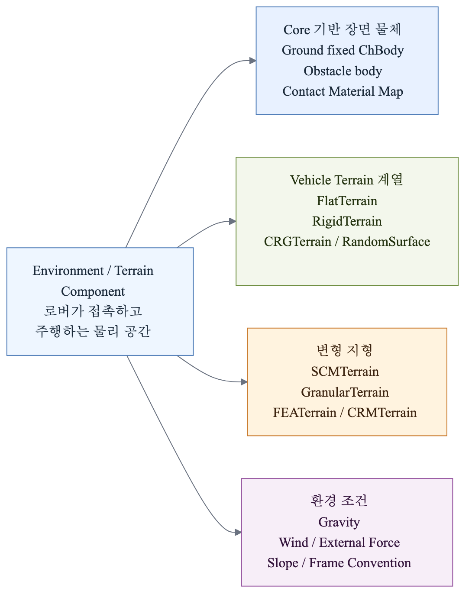
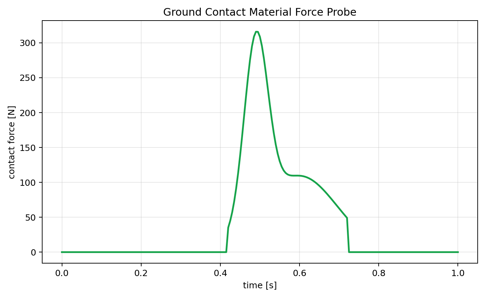
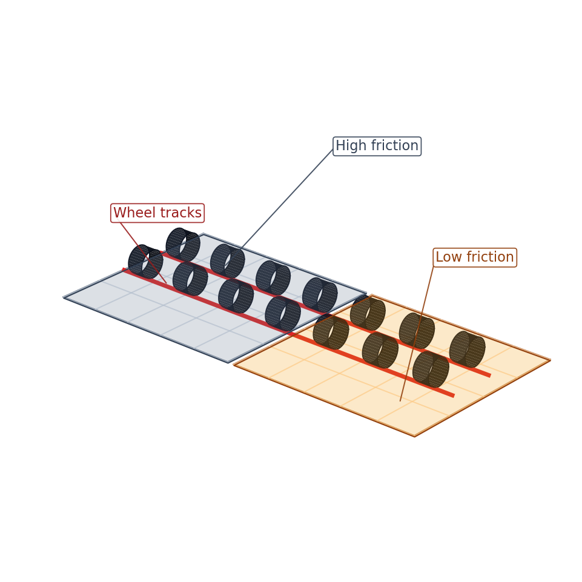
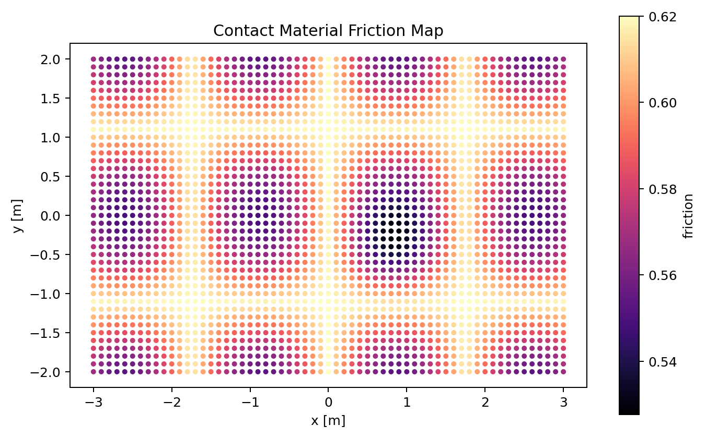
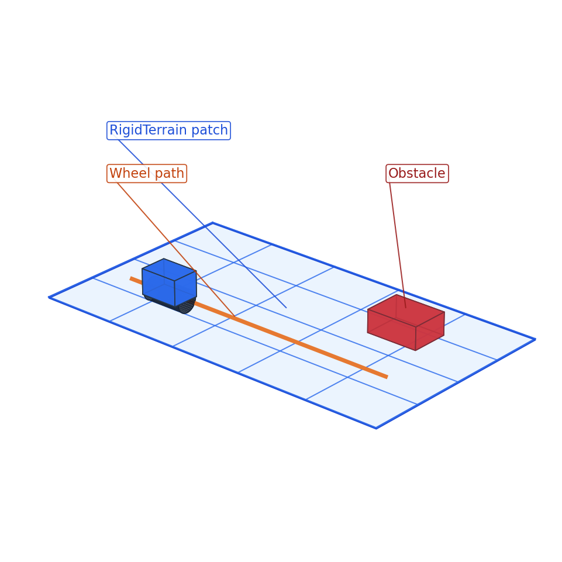
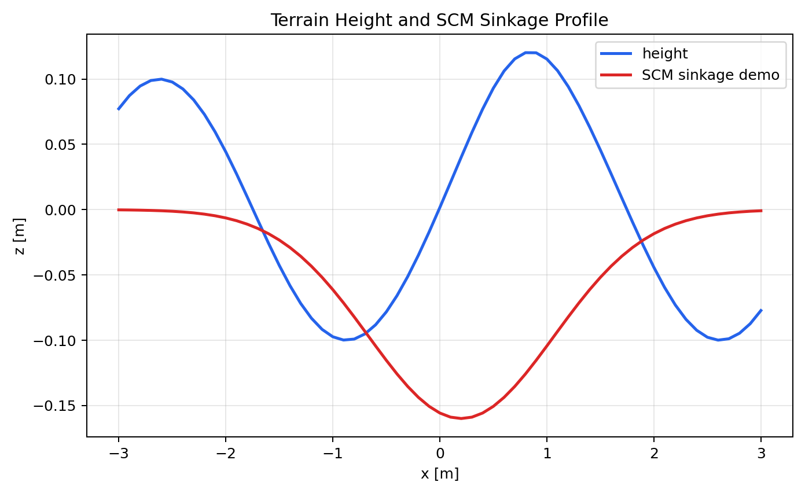
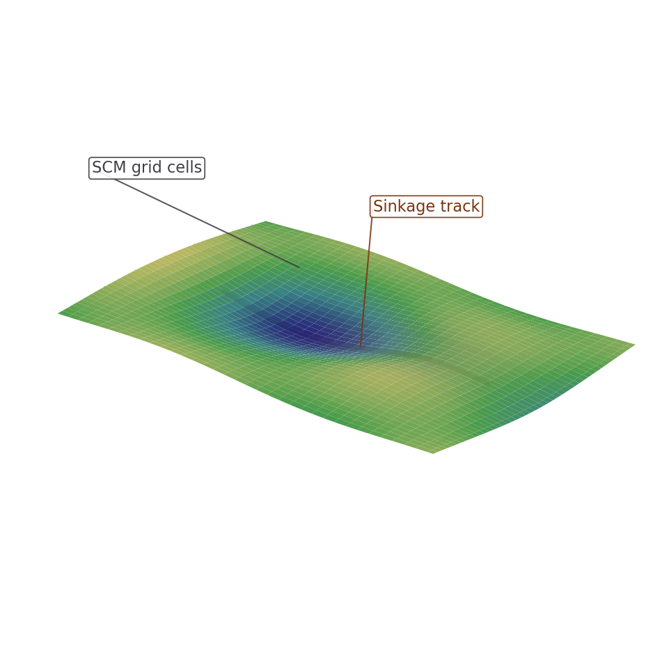
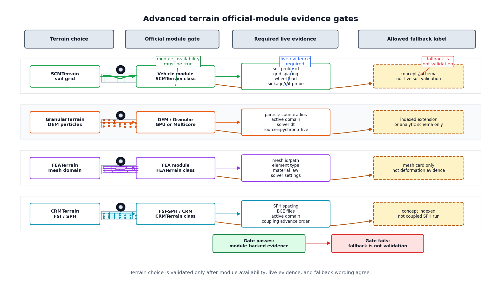

# 2.2.3 환경/Terrain Component 설계

환경/Terrain Component는 로버가 놓이는 물리 공간을 정의한다. 단순 바닥은 Core의 고정 `ChBody`로 충분하지만, 차량 주행 실험에서는 Chrono::Vehicle의 `RigidTerrain`, `SCMTerrain`, `CRGTerrain` 같은 Terrain 계열을 명확히 구분해 사용해야 한다.

이 절에서는 Ground, Obstacle, Contact Material, RigidTerrain, Heightmap/Mesh Patch, SCMTerrain, 외력/중력 설정, 고급 지형 확장까지 Component 단위로 정리한다. 각 지형 Component는 형상, 접촉 재질, 변형 여부, 로버와의 상호작용을 기준으로 구분하였다.

## 2.2.3.1 Terrain Component 관계



## 2.2.3.2 Component 요약 표

| Component | 선택 기준 | 주요 API/모듈 | 조정 변수 | 확인 산출물 |
|---|---|---|---|---|
| Ground | 평평한 기준면과 초기 접촉 디버깅이 필요할 때 | fixed `ChBodyEasyBox`, `ChContactMaterialNSC/SMC` | 크기, 두께, 상면 높이, 마찰 | 바닥/장애물 렌더, 접촉력 그래프 |
| Obstacle | 충돌, 회피, 턱 넘기처럼 국소 접촉 대상을 넣어야 할 때 | `ChBodyEasyBox`, `ChBodyEasyCylinder`, fixed/dynamic `ChBody` | 위치, 크기, 질량, 고정 여부, 재질 | 장애물 렌더, 충돌 이벤트 |
| Contact Material | 표면별 마찰/반발/강성을 바꿔 비교해야 할 때 | `ChContactMaterialNSC`, `ChContactMaterialSMC` | friction, restitution, stiffness, damping | 마찰 영역 렌더, 접촉력 변화 |
| FlatTerrain | Vehicle tire/controller smoke test에 infinite flat query plane이 필요할 때 | `veh.FlatTerrain`, `ChTerrain` query interface | height, friction, query frame, no-collision flag | flat terrain 메타데이터 |
| RigidTerrain | 차량 주행용 단단한 patch를 Vehicle 모듈 방식으로 구성할 때 | `veh.RigidTerrain`, `AddPatch`, `Initialize` | patch 크기, 위치, 재질, texture | rigid patch 렌더 |
| Heightmap/Mesh Patch | 도로 요철, 경사, 불규칙 지형 형상을 파일로 넣을 때 | heightmap patch, mesh patch, terrain data file | 해상도, 높이 스케일, mesh scale, 좌표 원점 | height profile 그래프, 지형 렌더 |
| CRGTerrain | OpenCRG 도로 profile을 vehicle road frame으로 재현해야 할 때 | `veh.CRGTerrain`, OpenCRG file | CRG file hash, s/l bounds, road-to-world frame | CRG manifest, height/normal probe |
| RandomSurfaceTerrain | 반복 가능한 rough surface sweep가 필요할 때 | random surface terrain family | seed, roughness, patch size, generated statistics | roughness 메타데이터, height profile |
| ObsModTerrain | obstacle-modified procedural terrain 조건을 써야 할 때 | obstacle modifier terrain family | obstacle rule, seed, filter/material policy | generated obstacle manifest |
| SCMTerrain | 흙/모래 침하와 wheel-soil interaction이 필요할 때 | `veh.SCMTerrain`, Bekker/Mohr-Coulomb/Janosi parameter | cohesion, friction angle, Bekker 계수, grid spacing | sinkage graph, 침하 렌더 |
| GranularTerrain | DEM particle bed와 wheel/track particle contact가 필요할 때 | `veh.GranularTerrain`, DEM/Multicore/GPU backend | particle count/radius/density, domain, backend, dt | particle domain manifest |
| FEATerrain | deformable terrain mesh, stress/strain, boundary condition이 필요할 때 | `veh.FEATerrain`, Chrono::FEA | mesh/element/material law, boundary, solver | FEA terrain manifest |
| CRMTerrain | SPH/FSI continuum terrain coupling이 필요할 때 | `veh.CRMTerrain`, FSI-SPH | SPH spacing, BCE files, active domain, coupled step | CRM/FSI domain manifest |
| Environment Field | 중력, 경사, 바람, 외력 같은 실험 조건을 명시해야 할 때 | `SetGravitationalAcceleration`, `ChForce`, slope frame | 중력 벡터, 외력 크기/방향, 경사각 | 메타데이터, 조건 비교 그래프 |

### 2.1 Command 카탈로그와의 경계

Terrain 문서에는 API 이름이 많이 나오지만, 이 절의 목적은 호출 순서 암기가 아니라 Component가 소유하는 지형 조건, 접촉 기준, 검증 출력, 대체 표기 기준을 고정하는 것이다.

| API 호출 | 2.1 Command 관심사 | 2.2 Terrain Component 관심사 | 필요한 산출물/검증 데이터 |
|---|---|---|---|
| `veh.RigidTerrain(system)` | 객체 생성 방법 | patch 경계, material, terrain query, tire 호환성 | patch render, `terrain_component_id`, `contact_material_id` |
| `terrain.AddPatch(...)` | 인자 순서 | patch pose, 크기, frame, friction source | patch bounds, height/friction query log |
| `veh.SCMTerrain(system)` | class import와 초기화 | soil parameter, grid spacing, wheel/track load coupling | sinkage/rut profile, soil 메타데이터 |
| `terrain.GetHeight(loc)` | method 호출 | query frame, 보간 방식, height source | `x_m`, `y_m`, `height_m`, `normal_*`, `source` |
| `terrain.Advance(step)` | loop 위치 | deformable terrain 상태가 어느 timestep에서 갱신되는지 | `solver_dt_s`, `terrain_advance_order`, stability note |

### Chrono Terrain 계열 선택표

Vehicle 계열 지형은 공통적으로 vehicle이 질의할 수 있는 terrain interface를 제공한다. 모델링 관점에서는 "평평한지", "형상이 파일에서 오는지", "바퀴 하중으로 변형되는지", "입자/연속체 해석이 필요한지"를 먼저 나누면 선택이 빠르다.

| Terrain 계열 | 변형 여부 | 대표 입력 | 의존성/비용 | Component로 기록할 핵심 |
|---|---|---|---|---|
| Core fixed ground | 변형 없음 | box/cylinder body, material | 가장 낮음 | 상면 높이, 마찰, 고정 여부 |
| `FlatTerrain` | 변형 없음 | height, friction | 낮음 | 빠른 controller/driver smoke test 조건 |
| `RigidTerrain` box patch | 변형 없음 | patch pose, length, width, texture | 낮음 | patch 경계, material, texture scale |
| `RigidTerrain` mesh/heightmap patch | 변형 없음 | mesh 또는 heightmap file, scale | 중간 | 파일 경로, 높이 범위, 좌표 원점 |
| `CRGTerrain` | 변형 없음 | OpenCRG road profile | 중간 | 도로 profile 버전, 길이 좌표 |
| `ObsModTerrain` | 변형 없음 | obstacle modifier 지형 설정 | 중간 | obstacle generation rule, seed, collision filtering |
| `RandomSurfaceTerrain` | 변형 없음 | roughness, patch size, random seed | 중간 | roughness parameter, seed, generated height statistics |
| `SCMTerrain` | 격자 기반 변형 | Bekker/Mohr-Coulomb/Janosi parameter | 중간~높음 | soil parameter, grid spacing, sinkage plot |
| Granular/DEM terrain | 입자 기반 변형 | particle radius, material, domain | 높음, GPU/특수 빌드 가능 | 입자 수, domain, time step |
| FEA terrain | 유한요소 변형 | mesh, element type, material law | 높음 | mesh 해상도, constitutive law, coupling 조건 |
| CRM terrain | SPH 연속체 변형 | particle/BCE files, SPH material, active domain | 높음, FSI/SPH 의존 | SPH spacing, rheology, active domain, terrain advance rule |

### Terrain x Tire/Track 호환성 표

Terrain Component는 "height/friction을 질의하는 interface"와 "solver가 실제 접촉을 계산하는 collision/contact source"를 분리해서 봐야 한다. `FlatTerrain`은 빠른 terrain query 성격이 강하고, SCM/Granular/FEA/CRM 계열은 tire/track 모델과 timestep/module 조건까지 함께 맞아야 한다.

| Terrain | Tire/Track 조합 | 접촉 출처 | 모듈 의존성 | 주의할 점 |
|---|---|---|---|---|
| Core fixed ground | Core cylinder wheel, simple rover body | body collision + `ChContactMaterial*` | Core | terrain query가 아니라 solver contact가 직접 힘을 만든다. |
| `FlatTerrain` | driver/controller smoke test, simple Vehicle model | terrain height/friction query 중심 | Vehicle | obstacle/collision geometry를 제공하지 않으므로 접촉 이벤트 분석용 ground와 혼동하지 않는다. |
| `RigidTerrain` patch | `RigidTire`, `TMeasy`, `Fiala`, simple track shoe | terrain patch material + tire model/contact | Vehicle | patch material, tire model, contact method(NSC/SMC)를 메타데이터에 같이 저장한다. |
| Heightmap/Mesh/CRG | wheel/tire 주행, road profile validation | terrain profile query + patch collision/road data | Vehicle, data files | height scale, origin, file version이 contact/pose 해석을 바꾼다. |
| `SCMTerrain` | wheel-soil, track-soil mobility | soil grid deformation + tire/track load | Vehicle | tire/track force와 soil parameter를 함께 보정해야 하며 grid spacing이 비용을 좌우한다. |
| DEM/Granular | wheel/track particle terrain test | particle contact/coupling | Granular/Multicore/GPU build 가능 | particle 수, domain, timestep이 안정성과 성능을 지배한다. |
| FEA terrain/tire | deformable tire/terrain 구조 해석 | finite element contact/coupling | FEA | mesh/material law와 solver 설정을 Runtime 메타데이터로 고정해야 한다. |
| CRM/FSI terrain | wet soil/fluid-like continuum interaction | SPH/FSI coupling + active domain | FSI/CRM | fluid/soil spacing, BCE files, coupling timestep을 일반 terrain friction과 분리해 기록한다. |

### Terrain Component 관리 기준표

Terrain 카탈로그는 "표면을 어떻게 그리는가"가 아니라 "vehicle/tire/contact가 어떤 query와 접촉 조건을 받는가"를 소유권 기준으로 나눈다.

| Component | 소유 책임 | 의존 대상 | 산출물 | 주의/실패 조건 | 확장 경로 |
|---|---|---|---|---|---|
| Ground | fixed body, top-surface frame, contact material reference, ground name | Runtime, Contact Material | ground render, contact force probe | 상면 z 계산 오류, material method mismatch, fixed flag 누락 | Core ground -> `FlatTerrain` |
| Obstacle | obstacle body pose, fixed/dynamic policy, collision primitive, material | Runtime, Collision Shape, Event Detector | obstacle render, event/contact log | mass/inertia 누락, 진행 경로와 위치 불명확, self-collision noise | box/cylinder -> compound obstacle -> generated obstacle field |
| Contact Material Region | spatial material assignment, friction/restitution/stiffness profile | Contact Method, Ground/RigidTerrain patch | friction map, material effect graph | terrain query friction과 solver material friction 혼동 | uniform material -> region map -> calibrated terrain material |
| RigidTerrain Patch | patch pose, extents, material, texture, mesh/heightmap file path | `ChSystem`, `ChTerrain` interface, Runtime | rigid patch render, height/friction 메타데이터 | `Initialize()` 누락, origin/scale 오류, patch boundary 미기록 | flat patch -> mesh/heightmap patch -> CRG road |
| Heightmap/Mesh Patch | height source file, scale, origin, interpolation assumption | RigidTerrain, CSV/메타데이터 Logger | height profile graph, terrain render | height scale 부호 오류, file path drift, z offset 누락 | synthetic height -> measured heightmap/mesh |
| SCMTerrain | soil parameters, grid spacing, sinkage plot/output policy | Vehicle module, Wheel/Tire, Runtime timestep | sinkage graph, deformation render | soil parameter 미보정, grid 과세분화, wheel/tire output 미저장 | SCM demo -> calibrated soil -> CRM/DEM/FEA |
| Environment Field | gravity vector, slope frame, wind/external force convention | Runtime, Chassis, 메타데이터 Logger | environment field render, run 메타데이터 | 중력 방향/단위 오류, 외력 frame 미기록 | constant gravity -> slope/wind profile |
| Advanced Terrain | DEM/FEA/CRM domain, particle/mesh spacing, active domain, coupling rule | Chrono modules, Runtime, solver/timestep policy | domain 메타데이터, performance/stability log | 계산 비용 과대, module availability 누락, coupling timestep 불일치 | SCM/RigidTerrain -> DEM/FEA/CRM |

## 2.2.3.3 Ground Component

Ground는 가장 기본적인 환경 Component이다. 보통 고정된 `ChBody`와 충돌 재질로 만든다. 단순 낙하, 충돌, 주행 테스트에서는 Ground만 잘 잡아도 대부분의 초기 디버깅이 가능하다.

| 항목 | 설계 내용 |
|---|---|
| 역할 | 로버가 떨어지지 않고 접촉할 기준 평면 제공 |
| 주요 API | `ChBodyEasyBox`, `SetFixed(True)`, `ChContactMaterialNSC` |
| 주요 변수 | ground 크기, 두께, 상면 높이, 마찰 계수 |
| 주의사항 | ground 중심 z와 두께를 고려해 상면 높이를 정확히 맞춘다. 예: 두께 0.12 m, 중심 z -0.06 m이면 상면은 z=0이다. |

아래 코드는 ground를 고정 body로 등록하는 최소 형태이다. `SetFixed(True)`와 중심 z 위치가 핵심이며, 렌더에서는 회색 평판의 상면이 지형 기준 높이로 보인다.

```python
material = chrono.ChContactMaterialNSC()
material.SetFriction(0.62)
material.SetRestitution(0.05)

ground = chrono.ChBodyEasyBox(8.0, 4.0, 0.12, 1000, True, True, material)
ground.SetName("ground_component")
ground.SetFixed(True)
ground.SetPos(chrono.ChVector3d(0.0, 0.0, -0.06))
system.AddBody(ground)
```

| 렌더링 관찰 기준 | 해석 기준 |
|---|---|
| Ground 상면 기준 | ground 상면 높이와 로버/장애물의 초기 z 위치가 일치해야 초기 침투를 피할 수 있다. |

| 시각/그래프 자료 |
|---|
|  |

**설명.** 같은 full-scene 이미지에서 회색 평판이 Ground Component이다. 가장 단순한 환경이지만 모든 충돌/주행 실험의 기준 높이와 기준 마찰을 제공한다.

| 시각/그래프 자료 |
|---|
|  |

**설명.** body가 ground와 접촉할 때 발생하는 접촉력 변화를 기록한 probe 그래프이다. 접촉력 peak가 너무 크면 초기 침투나 timestep 문제를 의심한다.

## 2.2.3.4 Obstacle Component

Obstacle은 지형 위에 놓인 박스, 원통, 돌, 벽, 턱 같은 충돌 대상이다. 장애물은 고정 body일 수도 있고, 질량을 가진 동적 body일 수도 있다. 회피 실험, 충돌 실험, 바퀴 턱 넘기 실험에서 환경의 핵심 Component가 된다.

| 항목 | 설계 내용 |
|---|---|
| 역할 | 회피, 충돌, 접촉력 측정 대상 |
| 주요 API | `ChBodyEasyBox`, `ChBodyEasyCylinder`, `SetFixed`, `SetPos`, `SetMass` |
| 주요 변수 | 위치, 크기, 고정 여부, 표면 마찰, 충돌 형상 |
| 주의사항 | 고정 장애물은 무한히 강한 벽처럼 작동한다. 동적 장애물은 질량/관성을 반드시 정해야 한다. |

아래 코드는 벽/턱처럼 움직이지 않는 장애물을 만든다. 같은 형상이라도 `SetFixed(False)`로 바꾸면 질량과 관성까지 검토해야 하므로 실험 의미가 달라진다.

```python
obstacle = chrono.ChBodyEasyBox(0.35, 1.2, 0.8, 1200, True, True, material)
obstacle.SetName("rigid_obstacle_box")
obstacle.SetFixed(True)
obstacle.SetPos(chrono.ChVector3d(0.65, 0.0, 0.40))
system.AddBody(obstacle)
```

| 렌더링 관찰 기준 | 해석 기준 |
|---|---|
| 장애물 위치와 진행 방향 | 로버 진행 경로와 장애물 위치 관계가 명확해야 회피/충돌 실험 조건을 해석할 수 있다. |

| 시각 자료 |
|---|
|  |

**설명.** 같은 full-scene 이미지에서 빨간 박스와 갈색 원통이 Obstacle Component이다. 고정 장애물은 충돌 기준점이 되고, 동적 장애물은 별도 질량과 관성을 가진 body로 다룬다.

## 2.2.3.5 Contact Material Component

Contact Material은 지형 Component와 로버 Collision Shape 사이의 접촉 거동을 정한다. 로버가 미끄러지는지, 튀어오르는지, 접촉력이 얼마나 크게 튀는지가 material 설정에 직접 영향을 받는다.

| 파라미터 | 의미 | 결과에 미치는 영향 |
|---|---|---|
| friction | 마찰 계수 | 구동력, 미끄러짐, 제동 거리 |
| restitution | 반발 계수 | 충돌 후 튀어오름 |
| cohesion | 점착력 | 흙/모래에서 접지력과 저항 |
| stiffness/damping | 접촉 강성/감쇠 | 침투량, 접촉력 peak, 수치 안정성 |

아래 코드는 서로 다른 표면을 나누기 위한 material 정의 예시이다. 렌더의 `High friction`, `Low friction` patch는 이 설정 차이가 공간적으로 배치된 상황을 보여준다.

```python
rubber_soil = chrono.ChContactMaterialNSC()
rubber_soil.SetFriction(0.80)
rubber_soil.SetRestitution(0.02)

low_friction = chrono.ChContactMaterialNSC()
low_friction.SetFriction(0.20)
low_friction.SetRestitution(0.05)
```

| 렌더링 관찰 기준 | 해석 기준 |
|---|---|
| 마찰 영역 구분 | 서로 다른 contact material 영역이 시각적으로 구분되면 마찰 변화와 주행 결과의 관계를 설명할 수 있다. |

| 시각/그래프 자료 |
|---|
|  |

**설명.** 회색/주황색 patch는 서로 다른 contact material 영역을 나타낸다. 같은 wheel path라도 영역별 마찰이 달라지면 구동력, slip, 제동거리 해석이 달라진다.

| 시각/그래프 자료 |
|---|
|  |

**설명.** 위치별 마찰 계수 map 예시이다. 같은 로버라도 contact material이 달라지면 미끄러짐, 제동거리, 접촉력 peak가 달라진다.

### Terrain Interface 관리 기준

Vehicle 계열 로버, tire, controller는 지형 구현체의 내부 형식을 직접 읽기보다 `ChTerrain` interface를 통해 높이, 표면점, 법선, 위치별 마찰을 질의한다. 따라서 Terrain Component는 단순 surface 그림이 아니라 vehicle/tire subsystem에 전달되는 query 계약으로 기록해야 한다.

| Query/계약 | 반환 의미 | 단위/좌표계 | 주로 호출하는 Component | 주의사항 |
|---|---|---|---|---|
| `Synchronize(time)` | terrain 상태를 현재 simulation time과 맞춤 | s | System loop | Vehicle loop에서는 `terrain.Synchronize(time)` 뒤 `vehicle.Synchronize(time, inputs, terrain)` 순서로 연결한다. |
| `Advance(step)` | 변형 terrain 또는 내부 상태를 한 step 진행 | s | System loop, SCM/CRM/DEM terrain | rigid terrain은 변화가 작아도 interface 계약은 유지한다. |
| `GetHeight(loc)` | 지정 위치 아래 terrain 높이 | m, world frame | Wheel/Tire, Initial State, controller | heightmap/SCM/rigid patch마다 보간 방식이 다를 수 있다. |
| `GetPoint(loc)` | surface 위의 3D 점 | m, world frame | tire contact, render/debug | mesh/CRG terrain은 좌표 원점과 진행 방향을 메타데이터에 남긴다. |
| `GetNormal(loc)` | surface normal vector | unit vector, world frame | tire force, contact debug, slope logic | normal이 뒤집히면 접촉력과 slope 해석이 틀어진다. |
| `GetCoefficientFriction(loc)` | 위치별 terrain friction query | dimensionless | tire model, driver/controller 비교 | contact material friction과 같은 목적이지만 항상 동일한 값이라고 가정하지 않는다. |
| `GetProperties(loc, ...)` | point, height, normal, friction 일괄 반환 | mixed | tire model, logging/debug | CSV에는 height/friction/normal을 분리 컬럼으로 저장한다. |

Terrain friction query와 `ChContactMaterialNSC/SMC`의 friction은 서로 연결될 수 있지만 같은 계층의 값은 아니다. 전자는 Vehicle terrain interface가 tire/controller에 제공하는 위치별 정보이고, 후자는 collision/contact solver가 body pair에 적용하는 접촉 재질이다. 보고서나 CSV에서는 둘을 `terrain_mu_query`, `contact_material_mu`처럼 구분해 기록하는 편이 안전하다.

### ChTerrain Query Scope Guard

공식 terrain 문서 기준으로 height/normal/friction query는 모든 terrain 결과를 검증하는 만능 증거가 아니다. 이 query는 주로 semi-empirical tire model이 terrain surface를 읽을 때 중요하고, SCM/Granular/FEA terrain처럼 Chrono collision/contact 또는 coupling으로 상호작용하는 변형 지형에서는 별도 contact/deformation 검증 자료가 필요하다.

| Terrain family | Query 검증 자료로 충분한가 | 추가로 필요한 검증 자료 |
|---|---|---|
| `FlatTerrain` | height/friction query smoke test에는 충분 | collision/event 검증에는 부적합. FlatTerrain은 collision/contact geometry를 소유하지 않는다는 메타데이터가 필요 |
| `RigidTerrain` | patch height/normal/friction probe에 유효 | patch collision material, patch bounds, source mesh/heightmap/hash, tire force/contact log |
| `CRGTerrain` | road frame의 height/normal/profile probe에 유효 | CRG file hash, s/l bounds, road-to-world transform, tire force log |
| `SCMTerrain` | initial surface query나 plot 메타데이터에는 유효 | soil parameter, grid spacing, sinkage/rut/node 검증 자료, moving patch, contact/coupling source |
| `GranularTerrain` | particle-bed summary에는 보조적 | particle domain, particle contact material, moving patch, settling checkpoint, timestep/backend |
| `FEATerrain` | mesh surface query에는 보조적 | mesh/element/material/boundary condition, stress/strain/deformation output |
| `CRMTerrain` | surface probe에는 보조적 | SPH spacing, BCE/marker files, active domain, coupled MBD/FSI advance order |

### ChTerrain Query Consumer Fields

Query probe는 어느 consumer가 그 값을 쓰는지와 query placeholder 여부를 함께 기록해야 한다. 특히 CRM 문서의 placeholder-style query처럼 값이 terrain force/coupling validation을 의미하지 않는 경우가 있으므로, query가 유효한 범위를 메타데이터로 제한한다.

| Query 메타데이터 field | 필요한 내용 |
|---|---|
| `query_frame` | `world` by default; road/CRG local frame이면 transform id 포함 |
| `consumer_family` | semi-empirical tire, controller/driver, initial state placer, visual/debug logger, contact reporter, CRM placeholder |
| `valid_for_semi_empirical_tires` | `true/false`; `TMeasy/Fiala/Pacejka`가 height/normal/friction을 읽을 수 있는지 |
| `uses_contact_solver` | query 값이 solver contact force와 직접 연결되는지, 또는 separate query-only 값인지 |
| `friction_functor_id` | uniform value, material map, CRG/file, SCM callback, placeholder 등 |
| `height_functor_id` | flat, patch, heightmap, mesh, CRG, SCM grid, generated roughness 등 |
| `normal_functor_id` | analytic plane, patch normal, mesh/height interpolation, CRG road normal, computed finite difference |
| `placeholder_policy` | CRM/extension/대체 예시에서 query가 approximate 또는 not-valid-for-force인지 |

## 2.2.3.6 RigidTerrain Component

`RigidTerrain`은 Chrono::Vehicle의 Terrain 계열 Component이다. 변형되지 않는 지면을 여러 patch로 구성하며, 각 patch는 충돌 형상과 접촉 재질을 가진다. 일반 Core ground보다 차량 subsystem과 함께 쓰기 좋은 인터페이스를 제공한다.

| 항목 | 설계 내용 |
|---|---|
| 역할 | 변형되지 않는 차량 주행 지형 |
| 주요 API | `chrono.vehicle.RigidTerrain`, `AddPatch`, `Initialize` |
| 주요 변수 | patch 위치, patch 크기, material, texture, mesh/heightmap 파일 |
| 사용 상황 | 포장도로, 단단한 평지, 경사로, heightmap 기반 험지 |
| 주의사항 | RigidTerrain은 바퀴 하중에 의해 지형 자체가 내려앉지 않는다. |

아래 코드는 Vehicle module의 `RigidTerrain`을 만들고 patch를 추가하는 흐름이다. `RigidTerrain` 객체가 `ChTerrain` interface를 구현하고 patch들을 소유하므로, Core ground처럼 body 하나만 보는 것이 아니라 patch 위치, 크기, material, texture를 함께 관리한다.

```python
import pychrono.vehicle as veh

terrain = veh.RigidTerrain(system)
patch_mat = chrono.ChContactMaterialNSC()
patch_mat.SetFriction(0.75)

# 실제 프로젝트에서는 AddPatch로 box/mesh/heightmap patch를 추가한 뒤 Initialize한다.
# patch = terrain.AddPatch(patch_mat, chrono.ChCoordsysd(...), length, width)
# patch.SetTexture(chrono.GetChronoDataFile("terrain/textures/dirt.jpg"), 8, 8)
# terrain.Initialize()
```

| 렌더링 관찰 기준 | 해석 기준 |
|---|---|
| Rigid patch 경계와 접촉점 | patch 경계, texture, wheel contact 위치가 보이면 rigid terrain의 공간 범위와 접촉 조건을 확인할 수 있다. |

| 시각 자료 |
|---|
|  |

**설명.** 파란 반투명 영역은 `RigidTerrain` patch의 공간 범위, 주황 선은 wheel path, 빨간 박스는 같은 patch 위에 놓인 obstacle 예시이다. Ground body와 달리 Vehicle module에서는 patch 단위로 재질, texture, heightmap/mesh 형상을 묶어 terrain interface를 구성한다.

### RigidTerrain Patch Manifest

`AddPatch` 호출은 Command 단계의 syntax이고, 2.2 Component 카탈로그에서는 patch가 어떤 source, frame, material, tiling, collision authority를 소유하는지 manifest로 남긴다.

| Patch manifest field | 필요한 내용 |
|---|---|
| `patch_id` | stable terrain patch id and owner component |
| `patch_type` | `box`, `mesh`, `height_map`, `point_cloud`, `crg` |
| `coordsys_world_frame` | patch center/orientation in world frame and source frame transform |
| `top_surface_center` / `normal` | top surface reference point and normal used by initial placement/probes |
| `length_m` / `width_m` / `thickness_m` | physical extents and collision thickness where relevant |
| `tiled` / `max_tile_size_m` | large patch tiling policy and max tile size |
| `mesh_file_hash` / `heightmap_file_hash` | source asset hashes and path base |
| `h_min_m` / `h_max_m` | heightmap scaling bounds |
| `sweep_sphere_radius_m` | mesh/point-cloud sweep radius where used |
| `connected_mesh` | whether mesh source is connected or treated as isolated faces |
| `contact_material_id` | solver contact material id and NSC/SMC compatibility |
| `texture_file_hash` / `texture_scale` | visual texture provenance and repeat scale |

## 2.2.3.7 Heightmap / Mesh Patch Component

Heightmap과 mesh patch는 지형 형상을 파일로부터 읽어오는 Component이다. 평평한 ground보다 실제 시험장, 도로, 험지 형상을 표현하는 데 적합하다.

| 방식 | 특징 | 적합한 상황 |
|---|---|---|
| Box patch | 가장 빠르고 단순 | 초기 주행/충돌 테스트 |
| Heightmap patch | grayscale 이미지 높이값 사용 | 요철 지형, 완만한 험지 |
| Mesh patch | 삼각형 mesh 사용 | 복잡한 장애물, 실제 지형 스캔 |

아래 코드는 heightmap 파일 경로와 scale이 한 Component의 입력값이 되는 상황을 보여준다. 렌더에서는 격자 셀의 높낮이와 색 변화가 이미지 높이값이 terrain surface로 변환되는 과정을 보여준다.

```python
# 개념 예시: heightmap patch는 terrain data 파일과 scale을 함께 관리한다.
heightmap_file = chrono.GetChronoDataFile("vehicle/terrain/height_maps/bump64.bmp")
# terrain.AddPatch(material, coordsys, heightmap_file, length, width, h_min, h_max)
```

| 렌더링 관찰 기준 | 해석 기준 |
|---|---|
| Heightmap 높낮이 | 지형의 요철과 wheel contact 위치가 함께 드러나야 heightmap이 주행 조건에 주는 영향을 설명할 수 있다. |

| 시각/그래프 자료 |
|---|
|  |

**설명.** VSG로 캡처한 Heightmap 형태의 rigid patch 개념이다. RigidTerrain은 바퀴 하중에 의해 변형되지 않고, 지형 높이/법선/마찰 정보를 차량 subsystem에 제공한다.

| 시각/그래프 자료 |
|---|
|  |

**설명.** 이 그래프에서는 높이 profile을 지형 형상 입력/reference로 읽는다. Heightmap은 형상 입력이고, sinkage는 변형 지형에서 나타나는 결과로 구분해야 한다.

## 2.2.3.8 SCMTerrain Component

`SCMTerrain`은 Soil Contact Model 기반의 변형 지형 Component이다. 바퀴나 track이 지나가면 격자 높이가 바뀌는 방식으로 침하를 표현한다. 로버 mobility, sinkage, drawbar pull, wheel slip 같은 주제를 다룰 때 중요하다.

| 항목 | 설계 내용 |
|---|---|
| 역할 | 모래, 흙, 달/화성 유사 지반처럼 변형되는 지형 표현 |
| 주요 API | `chrono.vehicle.SCMTerrain`, `SetSoilParameters`, `Initialize`, `SetPlotType` |
| 주요 변수 | Bekker 계수, cohesion, friction angle, Janosi shear, elastic stiffness, damping, grid spacing |
| 주의사항 | soil parameter는 문헌값이나 실험값으로 보정해야 한다. 격자가 촘촘할수록 계산량이 증가한다. |

아래 코드는 soil parameter를 한 번에 지정하는 예시이다. 렌더에서는 `SCM grid`와 `Sinkage track`을 분리해, 격자 해상도와 바퀴 자국을 별도로 확인하도록 했다.

```python
terrain = veh.SCMTerrain(system)
terrain.SetSoilParameters(
    2.0e6, 0.0, 1.1,   # Bekker Kphi, Kc, n
    0.0, 30.0, 0.01,   # cohesion, friction angle, Janosi shear
    4.0e7, 3.0e4       # elastic stiffness, damping
)
# terrain.Initialize(length, width, grid_spacing)
# terrain.SetPlotType(veh.SCMTerrain.PLOT_SINKAGE, 0, 0.1)
```

| 렌더링 관찰 기준 | 해석 기준 |
|---|---|
| SCM sinkage 분포 | wheel/track 통과 후 낮아진 지형 또는 sinkage color plot을 통해 변형 지형의 효과를 확인한다. |

| 시각/그래프 자료 |
|---|
|  |

**설명.** 붉은 marker는 wheel/track path이고, 표면의 낮아진 셀은 SCM 변형 지형에서 기대하는 침하/바퀴 자국 개념이다.

| 시각/그래프 자료 |
|---|
|  |

**설명.** 이 그래프에서는 sinkage profile을 SCM/변형 지형의 출력으로 읽는다. 실제 SCM에서는 soil parameter와 wheel load에 따라 침하량이 결정된다.

## 2.2.3.9 Environment Field Component

환경은 지형 형상만이 아니다. 중력, 바람, 경사, 대기 조건 같은 실험 조건도 Component처럼 기록해야 한다. 특히 드론/로버/행성 지형을 다루는 프로젝트에서는 달/화성 중력, 바람 외력, 경사각이 System 결과를 크게 바꾼다.

| 환경 요소 | Chrono 구현 | 기록 방식 |
|---|---|---|
| 중력 | `system.SetGravitationalAcceleration()` | 메타데이터 JSON 또는 CSV header |
| 바람 | `ChForce` 또는 force functor | force vector, 적용 body |
| 경사 | ground/terrain pose 회전 | slope angle, terrain frame |
| 온도/기압 | 직접 물리 영향 없음 | 실험 메타데이터로 기록 |

아래 코드는 중력만 바꾸는 예시이지만, 실제 실험에서는 이 값도 메타데이터에 남겨야 한다. 같은 로버와 같은 지형이라도 gravity가 달라지면 normal force와 접촉력이 달라진다.

```python
# Mars gravity example
system.SetGravitationalAcceleration(chrono.ChVector3d(0, 0, -3.72))
```

| 렌더링 관찰 기준 | 해석 기준 |
|---|---|
| 중력/외력/경사 방향 | 지형 frame, 중력 방향, 외력 방향이 함께 기록되어야 같은 로버라도 왜 다른 궤적이나 접촉력을 보였는지 해석할 수 있다. |

| 시각 자료 |
|---|
|  |

**설명.** 기울어진 patch는 slope frame, 빨간 화살표는 gravity, 주황 화살표는 wind/외력, 초록 화살표는 진행 방향 조건을 나타낸다. Environment Field는 형상이 아니라 실험 조건 Component로 기록해야 한다.

## 2.2.3.10 고급 지형 Component 확장

고급 지형은 "더 복잡한 surface"가 아니라 query 권한, contact 권한, tire/track 호환성, 모듈 사용 가능성, timestep 비용이 함께 바뀌는 Component 선택이다. 따라서 factory는 class 이름만 고르는 함수가 아니라 메타데이터와 대체 표기 기준까지 같이 내보내는 카탈로그 항목이어야 한다.

| 시각 자료 |
|---|
|  |

**설명.** 왼쪽은 지형 선택지, 가운데는 공식 모듈 조건, 오른쪽은 실제 실행 검증 자료와 대체 표기 기준이다. DEM/Granular, FEA, CRM 계열은 모듈 사용 가능성과 실제 실행 산출물이 없으면 "공식 검증"이 아니라 개념 설명, 기능 색인, 스키마 예시 상태로만 표기한다.

### 공식 고급 Terrain 대응 기준

Chrono Vehicle terrain 계열은 `chrono::vehicle::ChTerrain`을 기준으로 height, normal, friction query와 `Synchronize`/`Advance` lifecycle을 맞춘다. 고급 지형은 여기서 끝나지 않고, 지형 내부가 particle domain, FEA mesh, SPH-FSI coupling 중 무엇을 소유하는지까지 카탈로그 identity에 포함해야 한다.

| 공식 terrain | Chrono 구현 기반 | 모듈/빌드 조건 | 최소 실제 검증 자료 | 카탈로그에서 주장 가능한 범위 |
|---|---|---|---|---|
| `chrono::vehicle::GranularTerrain` | 직사각형 입자층, DEM 접촉, 선택적 moving patch | Vehicle terrain과 contact backend, `multicore`/DEM/legacy `granular_gpu`/custom co-sim 식별자 기록 | particle radius/density/count, domain size, contact material, contact method, timestep, moving-patch state, source tag | 입자 domain/contact 검증까지만 주장하고, 연속체 토양 해석으로 확장하지 않는다. |
| `chrono::vehicle::FEATerrain` | `chrono::fea` mesh/elements와 Drucker-Prager 계열 토양 parameter를 쓰는 FEA 변형 지형 | Vehicle + FEA 지원, mesh와 element 구현 사용 가능 | mesh id, element type/count, material law, boundary conditions, solver dt, deformation/stress/strain 산출물 | mesh 상태와 재료 응답 산출물이 있을 때만 FEA terrain 검증으로 본다. |
| `chrono::vehicle::CRMTerrain` | Chrono::FSI-SPH를 통한 SPH 기반 연속체 지형 모델 | Vehicle + FSI-SPH 지원, SPH/BCE 파일 또는 생성된 SPH domain 사용 가능 | SPH spacing, BCE/marker files 또는 generated domain, active domain, CFD/MBD step sizes, coupled advance order | CRM 검증은 SPH/FSI coupling 출력이 있을 때만 주장한다. |

### 고급 Terrain 선택 카탈로그

| Terrain Component | 소유 책임 | 적합한 사용 | 호환 tire/track/contact | 필요한 메타데이터 | 주의/실패 조건 |
|---|---|---|---|---|---|
| `FlatTerrain` | 평면 height/friction query | controller, driver, vehicle smoke test | terrain query를 읽는 tire/controller | height, friction, query frame, `terrain_component_id` | collision ground로 오해, obstacle/contact event 분석 누락 |
| `RigidTerrain` box/mesh/heightmap | patch geometry, material, texture, height source | 포장도로, 단단한 험지, measured profile | `RigidTire`, `TMeasy`, `Fiala`, simple track shoe | patch bounds, material id, height source path/hash, contact method | patch origin/scale drift, `Initialize()` 누락, material mismatch |
| `CRGTerrain` | OpenCRG road profile query와 road frame | 도로 profile 재현, ride/handling validation | road profile을 쓰는 tire/vehicle test | CRG path/hash, s-range, lateral bounds, road-to-world transform | 좌표축/진행방향 오류, profile version drift, collision source 혼동 |
| `RandomSurfaceTerrain`/`ObsModTerrain` | procedural roughness 또는 obstacle generation rule | 반복 가능한 rough terrain sweep | rigid tire/track 또는 contact body | seed, roughness, obstacle rule, generated height statistics | seed 미기록, obstacle filtering 누락, replay 불가 |
| `SCMTerrain` | soil grid deformation, sinkage/rut state | wheel-soil, track-soil mobility | wheel load, track shoe, soil-calibrated tire model | soil profile id, Bekker/Mohr-Coulomb/Janosi values, grid spacing | soil 미보정, grid 과세분화, wheel load/probe 미저장 |
| `GranularTerrain`/DEM terrain | particle domain, spherical particle material, DEM contact state | particle-scale sand/soil interaction | rigid/FEA tire, track shoe, contact/coupling layer | particle count/radius/density, domain size, contact method, backend identity, settling/checkpoint hash, dt | particle 수 과대, timestep instability, backend/module dependency 누락, 대체 예시을 validation으로 오해 |
| `FEATerrain` | `chrono::fea` mesh, ANCF/solid element type, constitutive law | local structural deformation, deformable road/soil block | FEA tire, rigid body contact, mesh contact | mesh id/path, element type/count, material law, boundary condition id, solver settings, stress/strain 산출물 | mesh 품질 문제, boundary condition 누락, stress/strain log 없음, material parameter drift |
| `CRMTerrain`/FSI-SPH terrain | SPH continuum domain, BCE markers, active domain, FSI coupling step | wet soil, slurry, continuum soil flow/deformation | SPH/FSI coupled wheel/body interaction | SPH spacing, BCE files/hash, rheology, active domain, CFD/MBD step, coupled advance order | FSI advance order 오류, active domain 누락, 일반 height/friction terrain처럼 해석 |

### DEM / Granular Backend 식별 카드

DEM 계열은 `GranularTerrain` 하나로만 끝나지 않는다. 같은 "granular" label이라도 공식 Vehicle terrain, 외부 DEM engine, OpenMP co-sim, SPH-style extension은 검증 자료와 실패 모드가 다르므로 backend identity를 먼저 기록해야 한다.

| Backend 식별자 | 허용 의미 | 필요한 메타데이터 | 주장 기준 |
|---|---|---|---|
| `vehicle_granular` | `chrono::vehicle::GranularTerrain` live run | `chrono_class`, particle radius/density/count, length/width/layers, contact material id, contact method, moving-patch flag, `solver_dt_s`, source tag | `module_availability=true`와 particle/contact output이 있을 때만 모듈 기반 검증 자료 |
| `dem_gpu` | DEM-Engine 또는 legacy GPU granular 경로로 관리되는 확장 | backend name/version, GPU/device, particle radius/density/count, domain size, kernel/contact model, checkpoint hash, timestep | local live 산출물 없으면 indexed extension으로만 표기 |
| `granular_cosim_omp` | OpenMP/multicore granular co-simulation wrapper | co-sim boundary ids, exchange cadence, contact method, particle domain, settling checkpoint hash, source tag | Chrono Vehicle terrain 검증과 co-sim 검증을 분리 표기 |
| `granular_cosim_sph` | SPH/continuum coupling으로 granular-like response를 근사하는 확장 | SPH spacing, coupling body ids, rheology, active domain, timestep, output directory hash | DEM validation이라고 쓰지 말고 CRM/SPH-derived 검증 자료로 표기 |

### FEA Terrain 최소 검증 기준

`FEATerrain`은 mesh card만 있다고 검증된 지형으로 볼 수 없다. 아래 필드가 빠지면 FEA terrain 카탈로그에서는 설계 항목으로만 다루고, stress/strain/deformation 산출물이 생긴 뒤에야 실제 검증 자료로 인정한다.

| 검증 묶음 | 필수 항목 |
|---|---|
| Identity | `chrono_class=chrono::vehicle::FEATerrain`, `mesh_id`, `source`, `module_availability` |
| Domain/discretization | `terrain_dimension_m`, `terrain_discretization`, `element_type` |
| Material law | `rho`, `Emod`, `nu`, `yield_stress`, `hardening_slope`, `friction_angle`, `dilatancy_angle` |
| Boundary/solver | `boundary_condition_id`, `contact_method`, `solver_dt_s` |
| 실행 산출물 | `deformation_or_stress_artifact`, stress/strain 출력 경로 또는 deformation render snapshot |

### CRM 검증 기준

CRM은 `GetHeight`/`GetCoefficientFriction` query가 아니라 SPH-FSI coupling output으로 판단해야 한다. 따라서 일반 height/friction 검증 CSV만 있는 경우에는 `CRMTerrain` 검증이 아니라 terrain interface 동작 확인 자료로만 취급한다.

| 검증 자료 출처 | 허용되는 주장 | 금지되는 주장 |
|---|---|---|
| `CRMTerrain` 실제 SPH/FSI 출력과 SPH particles, BCE markers, active domain, coupled step | CRM 모듈 기반 검증 | 단순 rigid/flat terrain과 동일한 friction terrain으로 해석 |
| CRM API/index 항목만 있고 로컬 실행 산출물이 없음 | 공식 기능 색인 | 로컬 검증, 힘/침하 정확도 주장 |
| 해석식 기반 height/friction 예시 데이터 | schema 동작 확인 또는 plotting 예시 | CRM soil flow, SPH continuum 검증 |
| 개념 렌더 | Component 책임과 모듈 조건 설명 | 실행 정확도 또는 모듈 사용 가능성 증거 |

### Query 권한과 Contact 권한

| Component | Query 권한 | Contact 권한 | Component 해석 |
|---|---|---|---|
| Core fixed ground | 없음 또는 별도 helper | `ChBody` collision + `ChContactMaterial*` | solver 접촉용 기준면이다. Vehicle terrain query를 소유하지 않는다. |
| `FlatTerrain` | height/friction/normal query | 자체 collision geometry 없음 | 빠른 vehicle/controller 조건이다. 충돌 이벤트 ground와 분리해 둔다. |
| `RigidTerrain` patch | terrain query와 patch geometry | patch material + tire/contact model | 단단한 주행 지형의 기본 선택이다. |
| `CRGTerrain` | road s/l frame 기반 profile query | tire model 또는 별도 road contact 설정 | OpenCRG profile의 좌표계와 version을 Component 검증 자료로 남긴다. |
| `SCMTerrain` | deformable grid state | soil grid와 wheel/track load coupling | sinkage와 rut가 terrain 출력이다. |
| `GranularTerrain`/DEM | particle field와 contact state | particle contact/coupling | domain, particle material, backend identity, timestep이 Component 기준의 일부다. |
| `FEATerrain` | mesh surface/state query | finite element contact/coupling | mesh, element type, material law, boundary condition이 지형의 identity이다. |
| `CRMTerrain`/FSI-SPH | SPH/continuum active domain | SPH-FSI coupling | terrain loop가 별도 advance order를 가지며 일반 friction query로 검증하지 않는다. |

### FlatTerrain vs Core Ground vs RigidTerrain Patch

| 후보 | Collision geometry 생성 | `ChTerrain` query 제공 | 대표 tire/contact | 쓰지 말아야 할 경우 | 메타데이터 항목 |
|---|---|---|---|---|---|
| Core fixed ground | 예 | 아니오 | core wheel/body collision | Vehicle tire가 terrain height/friction query를 기대할 때 | body name, top_z_m, material id |
| `FlatTerrain` | 아니오 | 예 | driver/controller smoke test | obstacle/contact event, patch boundary, material region 분석 | height_m, friction, query frame |
| `RigidTerrain` patch | 예 | 예 | `RigidTire`, `TMeasy`, `Fiala`, track shoe | 바퀴 하중으로 지형 변형을 검증해야 할 때 | patch id, bounds, contact material, texture/source |

### CRGTerrain Component Card

| 항목 | 기록 내용 | 검증 기준 |
|---|---|---|
| CRG file/path/hash | OpenCRG 입력 파일과 버전 | 같은 hash로 재실행 가능해야 한다. |
| s-coordinate range | 도로 진행방향 유효 범위 | wheel path가 profile 범위를 벗어나지 않아야 한다. |
| lateral bounds | 차선/도로 폭과 lateral limit | tire contact point가 lateral bounds 안에 있어야 한다. |
| road frame to world frame | CRG frame의 origin, heading, up-axis | 차량 진행방향과 road s-axis가 일치해야 한다. |
| friction source | CRG profile 값, uniform terrain mu, contact material 중 어느 값인지 | `terrain_mu_query`와 `contact_material_mu`를 분리 기록한다. |
| validation probes | height, normal, s/l coordinate, tire force | profile 변화가 height/normal probe에 반영되어야 한다. |

### Tire/Track 선택 Matrix

| Tire/Track 계열 | `FlatTerrain` | `RigidTerrain` | `CRG` | `SCM` | DEM | FEA | CRM/FSI | 필요한 검증 자료 |
|---|---|---|---|---|---|---|---|---|
| Core cylinder wheel | possible but limited | possible | avoid | avoid | possible with coupling | possible with contact | possible with coupling | contact patch, `contact_fz_N`, slip note |
| `RigidTire` | recommended smoke test | recommended | recommended | possible but limited | possible with coupling | possible with contact | avoid unless coupled | `slip_ratio`, `tire_Fz_N`, terrain mu |
| `TMeasy`/`Fiala`/`Pacejka` | recommended smoke test | recommended | recommended | possible only with calibrated assumptions | avoid | avoid | avoid | tire force, normal, height profile |
| FEA tire | possible but expensive | possible | possible | possible with calibration | possible with coupling | recommended | possible with coupling | contact patch, stress/strain, solver dt |
| Track shoe | possible but limited | recommended | possible | recommended | recommended with coupling | possible | possible with coupling | drawbar pull, sinkage, contact count |

### Terrain 메타데이터 관리 기준

| 항목 | 의미 |
|---|---|
| `terrain_component_id` | run 안에서 지형을 식별하는 안정 ID |
| `terrain_type` | `core_ground`, `flat`, `rigid_patch`, `crg`, `scm`, `dem`, `fea`, `crm` 같은 카탈로그 type |
| `chrono_class` | 실제 Chrono/PyChrono class 또는 대체 예시 helper 이름 |
| `module_dependency` | Vehicle, FEA, FSI/CRM, Granular, Multicore 등 필요한 module |
| `module_availability` | 현재 환경에서 import/build 가능한지와 대체 예시 여부 |
| `backend_identity` | `vehicle_granular`, `dem_gpu`, `granular_cosim_omp`, `granular_cosim_sph`, `fea`, `crm_fsi_sph` 같은 고급 지형 backend id |
| `contact_method` | NSC/SMC 또는 coupling contact 방식 |
| `terrain_mu_query_source` | uniform value, material map, CRG/file, soil model 등 friction query 출처 |
| `contact_material_id` | solver contact material과 연결되는 id |
| `height_source_path_hash` | heightmap, mesh, CRG, generated profile 파일과 hash |
| `origin_frame` | terrain-local frame에서 world frame으로 가는 기준 |
| `grid_spacing_m` | SCM/height grid 해상도 |
| `soil_profile_id` | Bekker/Mohr-Coulomb/Janosi parameter 묶음 |
| `particle_spacing_m` | DEM/CRM/FSI particle 또는 SPH spacing |
| `particle_radius_m` | DEM spherical particle 반지름 |
| `particle_density_kg_m3` | DEM particle density 또는 SPH material density |
| `particle_count` | DEM/SPH domain의 particle 또는 marker count |
| `active_domain_m` | moving patch, CRM active domain, FSI computation box 크기 |
| `mesh_id` | FEA/mesh terrain의 안정 id 또는 파일 hash |
| `bce_file_hash` | CRM/FSI boundary marker 파일 또는 생성 설정 hash |
| `solver_dt_s` | terrain/coupling 안정성에 필요한 timestep |
| `terrain_advance_order` | `terrain.Synchronize`, vehicle synchronize, `terrain.Advance` 순서 |
| 대체 예시 사용 여부 | PyChrono 또는 특정 module을 사용할 수 없을 때 분석식/렌더 대체 예시를 사용했는지 여부 |

### Terrain Manifest 분리 기준

System 단계에서 terrain을 재현하려면 하나의 `terrain_type`만으로는 부족하다. rigid patch, material region, deformable domain, query probe를 서로 다른 manifest로 나누면 예시 schema와 실제 모듈 실행 자료가 섞이지 않는다.

| Manifest | 담당 Component | 필수 항목 |
|---|---|---|
| `terrain_component_manifest.json` | `terrain.interface` | `terrain_component_id`, `terrain_type`, `chrono_class`, `module_dependency`, `module_availability`, `query_authority`, `contact_authority`, `sync_order`, `advance_order`, 대체 처리 정책 |
| `terrain_patch_manifest.csv/json` | `terrain.rigid_patch`, `terrain.heightmap_mesh`, `terrain.crg` | `patch_id`, patch type, pose, bounds, material id, texture, source path/hash, height scale, origin frame, CRG s/l bounds |
| `terrain_material_region_map.csv/json` | `terrain.material_region` | region id, bounds, `terrain_mu_query`, `contact_material_mu`, material class, friction functor id, calibration source |
| `terrain_deformable_domain_manifest.json` | `terrain.scm`, `terrain.granular_dem`, `terrain.fea`, `terrain.crm` | grid/particle/mesh/SPH spacing, active domain, moving patch, backend identity, timestep, coupling order |
| `scm_soil_profile_manifest.csv/json` | `terrain.scm` | Bekker/Mohr-Coulomb/Janosi parameters, grid spacing, moving patch policy, profile source, calibration provenance |
| `terrain_surface_probe.csv` | `terrain.interface` | sampled height/normal/friction values and source tag used to validate query frame and interpolation |

예시 생성 스크립트는 `terrain_component_manifest.json`, `terrain_patch_manifest.csv/json`, `terrain_material_region_map.csv/json`, `terrain_deformable_domain_manifest.json`, `scm_soil_profile_manifest.csv/json`, 표준 `terrain_surface_probe.csv`를 만든다. `environment_terrain_height_friction_sinkage.csv`는 같은 surface probe schema를 그래프 설명용 이름으로 유지한 호환 파일이다.

### SCM Node / Moving Patch 검증 기준

`SCMTerrain`은 deformable height-field model이며, grid 전체를 항상 materialized object로 보지 않는다. 따라서 SCM 검증 자료는 surface picture만이 아니라 touched/deformed node와 moving patch policy를 기록해야 한다.

| SCM 검증 항목 | 필요한 내용 |
|---|---|
| `soil_profile_id` | Bekker `Kphi/Kc/n`, Mohr cohesion/friction angle, Janosi shear, elastic stiffness, damping provenance |
| `grid_spacing_m` | SCM grid spacing and length/width or heightmap/mesh initialization source |
| `plane_frame` | `SetPlane` reference or world-frame assumption |
| `moving_patch` | body id, OOBB center/dims, active patch count, no-patch 대체 예시 |
| `plot_type` | `PLOT_SINKAGE`, `PLOT_PRESSURE`, `PLOT_SHEAR`, touched/island/mass-remain plot where used |
| `node_fields` | node level, sinkage elastic/plastic, pressure, shear, Janosi `k`, touched/island id if exported |
| `interaction_source` | rigid tire, track shoe, core collision body, or other contactable source |
| `sinkage_artifact` | profile CSV/graph, rut render, 또는 실제 node export path/hash |

### Terrain 생애주기 / 시간 전진 기준

Terrain Component는 object 생성 후 자동으로 의미가 생기는 것이 아니라, System loop에서 누가 synchronize/advance를 소유하는지에 따라 검증 자료 해석이 달라진다.

| Terrain 계열 | `synchronize_owner` | `advance_owner` | Vehicle advance와의 관계 | 접촉력 담당 | `dt_field` | 모듈 조건 | 대체/예시 표기 기준 |
|---|---|---|---|---|---|---|---|
| `FlatTerrain` | terrain wrapper or scenario loop | normally no internal state | `vehicle.Synchronize(time, inputs, terrain)` reads query values | tire model/controller, not terrain collision | `vehicle_dt_s` | Vehicle | query 동작 확인용 예시로 허용 |
| `RigidTerrain` | terrain wrapper | optional/no deformation state | vehicle/tire uses terrain patch/query during vehicle advance | tire/contact solver + patch material | `vehicle_dt_s`, `solver_dt_s` | Vehicle | concept/render if no live vehicle run |
| `CRGTerrain` | CRG terrain wrapper | profile itself static | vehicle/tire consumes road-frame profile query | tire model/contact, not CRG file alone | `vehicle_dt_s` | Vehicle + OpenCRG data availability | indexed unless CRG probe and tire log exist |
| `SCMTerrain` | SCM terrain wrapper | 접촉/하중 갱신 이후 SCM grid state 전진 | terrain과 vehicle은 같은 step/order를 공유해야 하며 moving patch는 기준 body를 따라간다 | SCM soil-wheel/track coupling | `solver_dt_s`, `terrain_dt_s`, grid spacing | Vehicle SCM | 대체 예시 그래프는 침하량 스키마 확인용으로만 사용 |
| `GranularTerrain` | granular backend wrapper | particle/contact backend advances domain | vehicle/contactable exchanges forces with particle domain | DEM/contact backend | DEM `dt_s`, settle dt, MBD dt | Granular/Multicore/GPU backend | indexed unless particle domain log exists |
| `FEATerrain` | FEA/vehicle terrain wrapper | FEA solver advances mesh state | tire/body contact couples to FEA mesh | FEA contact/coupling + solver | FEA solver dt, MBD dt | Vehicle + FEA | mesh-only render is not deformation validation |
| `CRMTerrain` | FSI/CRM wrapper | SPH/FSI problem advances active domain | MBD bodies register with FSI problem and advance in coupled order | FSI/SPH coupling | MBD dt, CFD/FSI dt, coupling dt | FSI-SPH/CRM | placeholder query is not coupled SPH validation |

### Terrain Probe Schema

| Schema | 필수 및 파생 컬럼 |
|---|---|
| `terrain_surface_probe_schema` | 필수: `run_id`, `schema_id`, `scenario_id`, `sample_index`, `terrain_component_id`, `terrain_type`, `x_m`, `y_m`, `height_m`, `normal_x`, `normal_y`, `normal_z`, `terrain_mu_query`, `contact_material_mu`, `sinkage_m`, `source`; 파생/compat: `estimated_friction`, `scm_sinkage_demo_m` |
| `terrain_contact_probe_schema` | `run_id`, `schema_id`, `scenario_id`, `time_s`, `step_index`, `terrain_component_id`, `wheel_id`, `tire_model`, `x_m`, `y_m`, `contact_fx_N`, `contact_fy_N`, `contact_fz_N`, `contact_force_N`, `slip_ratio`, `drawbar_pull_N`, `contact_patch`, `source` |
| `terrain_deformable_probe_schema` | `time_s`, `terrain_component_id`, `soil_profile_id`, `grid_spacing_m`, `rut_depth_m`, `wheel_load_N`, `particle_count`, `active_box`, `mesh_id`, `element_type`, `crm_force_N`, `coupling_step_s` |
| `terrain_advanced_domain_schema` | `time_s`, `terrain_component_id`, `terrain_type`, `chrono_class`, `module_dependency`, `module_availability`, `backend_identity`, `domain_size_m`, `active_domain_m`, `particle_radius_m`, `particle_density_kg_m3`, `particle_count`, `sph_spacing_m`, `bce_file_hash`, `mesh_id`, `element_type`, `terrain_dimension_m`, `terrain_discretization`, `contact_method`, `solver_dt_s`, `settling_checkpoint_hash`, `source` |

### 검증 수준

| 검증 수준 | 의미 | 보고서 예시 |
|---|---|---|
| 개념 렌더 | Component 소유 책임과 경계 설명용 그림 | `terrain_advanced_selection_catalog.png`, `terrain_scm_deformation_component.png` |
| 해석식 예시 데이터 | PyChrono 없이 생성한 예시 CSV/그래프 | `environment_terrain_height_friction_sinkage.csv`, `terrain_height_sinkage_profile.png` |
| PyChrono 실행 데이터 | 실제 Chrono terrain/tire run에서 나온 height/contact probe | 향후 실행 로그와 CSV에 실제 실행 출처를 기록 |
| Chrono 모듈 검증 | DEM/FEA/CRM module까지 포함한 검증 run | module availability, build hash, timestep, active domain을 메타데이터에 포함 |

| 검증 단계 | 통과 조건 | 금지되는 과장 해석 |
|---|---|---|
| 공식 모듈 기반 검증 | `module_availability=true`, 공식 class identity, 실제 실행 산출물 path/hash, 필수 schema field가 모두 존재 | 해석식 예시 plot을 module validation으로 표기 |
| 공식 기능 색인 | 공식 API/reference와 카탈로그 메타데이터는 있으나 로컬 실행 산출물 없음 | 힘, 침하, 변형, soil-flow 정확도 주장 |
| 해석식/Schema 예시 | PyChrono/module 없이 생성한 deterministic fixture 또는 schema example | `GranularTerrain`/`FEATerrain`/`CRMTerrain` 실제 실행 검증 주장 |
| 개념 렌더 | Component 경계, 모듈 조건, 소유 책임 설명용 그림 | 실행 정확도, 모듈 사용 가능성, solver 안정성 주장 |

고급 지형은 module과 빌드 옵션 의존성이 커서 동일한 코드 경로로 무리하게 실행하기보다, terrain factory처럼 선택지를 분리해 두는 편이 관리하기 쉽다. factory 반환값은 terrain 객체뿐 아니라 카탈로그 메타데이터를 함께 내보내야 한다.

```python
def make_terrain(kind, system, material, module_availability):
    meta = {
        "terrain_kind": kind,
        "module_availability": module_availability,
        "query_authority": None,
        "contact_authority": None,
        "compatible_tire_models": [],
        "advance_order": "terrain.Synchronize -> vehicle.Synchronize -> terrain.Advance",
        "alternative_policy": "fail_closed",
    }
    if kind == "flat":
        terrain = veh.FlatTerrain(0.0, 0.8)
        meta.update(
            query_authority="height/friction plane",
            contact_authority="none",
            compatible_tire_models=["driver_smoke_test", "semi_empirical_tire"],
        )
        return terrain, meta
    if kind == "rigid_patch":
        terrain = veh.RigidTerrain(system)
        meta.update(
            query_authority="rigid patch profile",
            contact_authority="patch contact material",
            compatible_tire_models=["RigidTire", "TMeasy", "Fiala", "track_shoe"],
        )
        return terrain, meta
    if kind == "scm":
        terrain = veh.SCMTerrain(system)
        terrain.SetSoilParameters(...)
        meta.update(
            query_authority="deformable soil grid",
            contact_authority="SCM soil-wheel coupling",
            compatible_tire_models=["soil_calibrated_wheel", "track_shoe"],
        )
        return terrain, meta
    raise ValueError(f"unsupported terrain kind: {kind}")
```

| 렌더링 관찰 기준 | 해석 기준 |
|---|---|
| 지형 유형 비교 | Flat, Rigid, SCM, Granular/DEM, FEA, CRM 계열 지형은 query/contact authority와 계산 비용이 다르므로 시각적 차이, module availability, probe schema를 함께 비교한다. |

## 2.2.3.11 Terrain Component 검증 체크리스트

| 점검 항목 | 확인 방법 |
|---|---|
| ground 상면 높이 | 렌더에서 wheel/box가 ground에 자연스럽게 놓이는지 확인 |
| 초기 침투 | 첫 step 접촉력이 비정상적으로 크지 않은지 확인 |
| 마찰 영향 | friction map 또는 동일 로버의 속도/접촉력 차이 확인 |
| SCM 침하 | sinkage plot 또는 height profile 그래프 확인 |
| 지형 좌표계 | `world_frame`, ISO `vehicle_frame`, `render_camera_up`을 분리해 확인. 이 보고서의 차량/지형 schema는 X-forward/Y-left/Z-up을 사용하고, 렌더 camera up은 시각화 backend 메타데이터로 별도 기록한다. |

## 2.2.3.12 실행 산출물

실행 코드: `code/environment_terrain/generate_environment_terrain_components.py`
CSV: `outputs/csv/environment_terrain_height_friction_sinkage.csv`, `outputs/csv/terrain_surface_probe.csv`, `outputs/csv/terrain_query_probe.csv`, `outputs/csv/environment_terrain_contact_probe.csv`
JSON: `outputs/json/terrain_component_manifest.json`

## 2.2.3.13 참고 문헌

- Chrono Vehicle Terrain system: https://api.projectchrono.org/group__vehicle__terrain.html
- Chrono Vehicle terrain overview: https://api.projectchrono.org/vehicle_terrain.html
- Chrono Vehicle terrain models (development): https://api.projectchrono.org/development/vehicle_terrain.html
- ChTerrain class reference: https://api.projectchrono.org/classchrono_1_1vehicle_1_1_ch_terrain.html
- SCMTerrain class reference: https://api.projectchrono.org/classchrono_1_1vehicle_1_1_s_c_m_terrain.html
- GranularTerrain class reference: https://api.projectchrono.org/classchrono_1_1vehicle_1_1_granular_terrain.html
- CRM terrain API guide: https://api.projectchrono.org/vehicle_terrain_crm_api_.html
- CRM active domains guide: https://api.projectchrono.org/development/vehicle_terrain_crm_performance.html
- DEM-Engine installation: https://api.projectchrono.org/deme_installation.html
- DEM-Engine usage: https://api.projectchrono.org/development/deme_usage.html
- Chrono Vehicle slides: https://www.projectchrono.org/assets/slides_3_0_0/5_Vehicle/1_ChronoVehicle.pdf
- 로컬 문서: `docs/vehicle/terrain.md`, `docs/dem/`, `docs/fsi/`, `docs/fea/`
