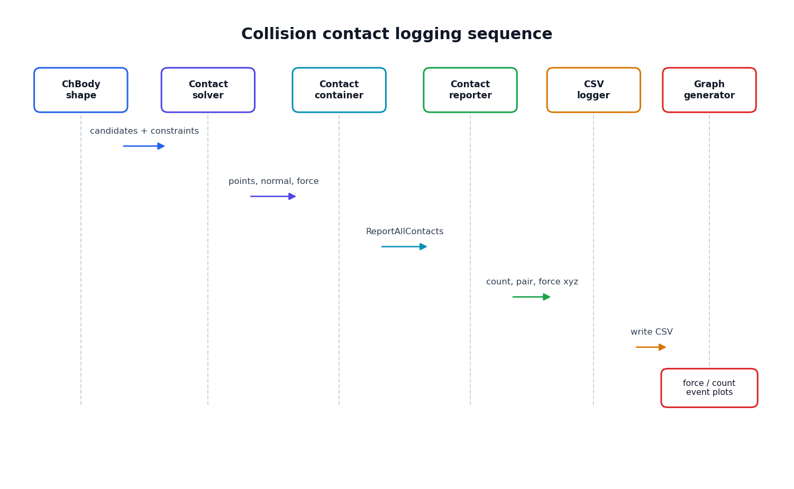
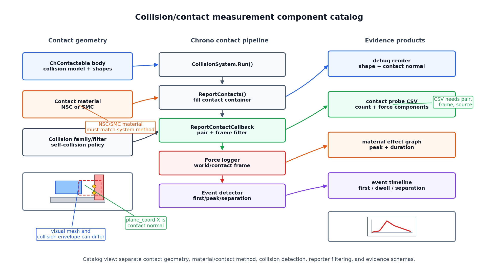
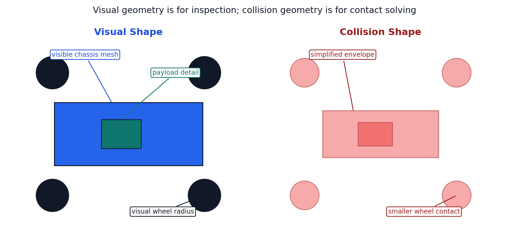
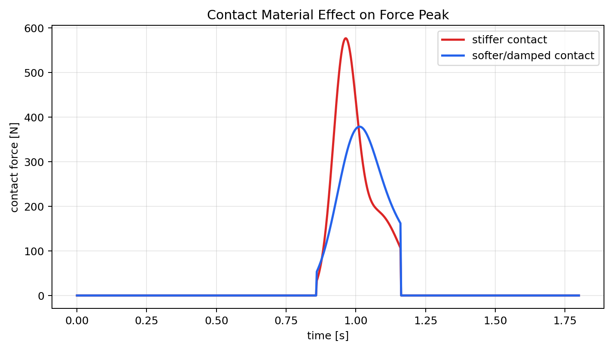
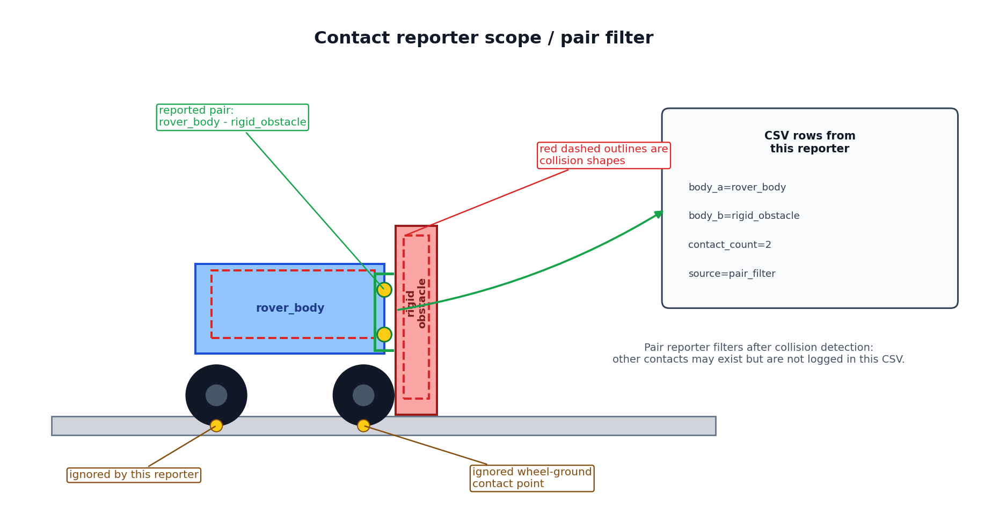
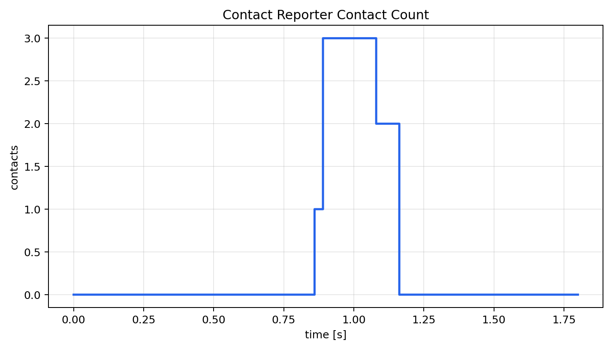
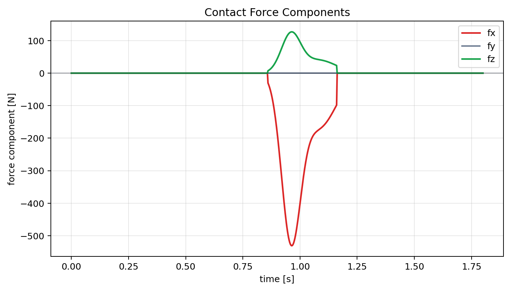
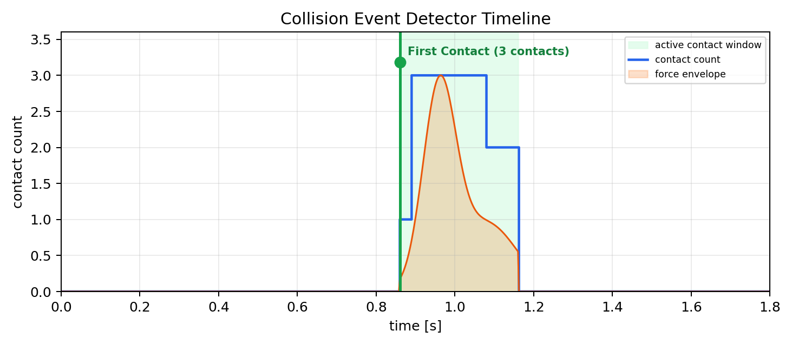
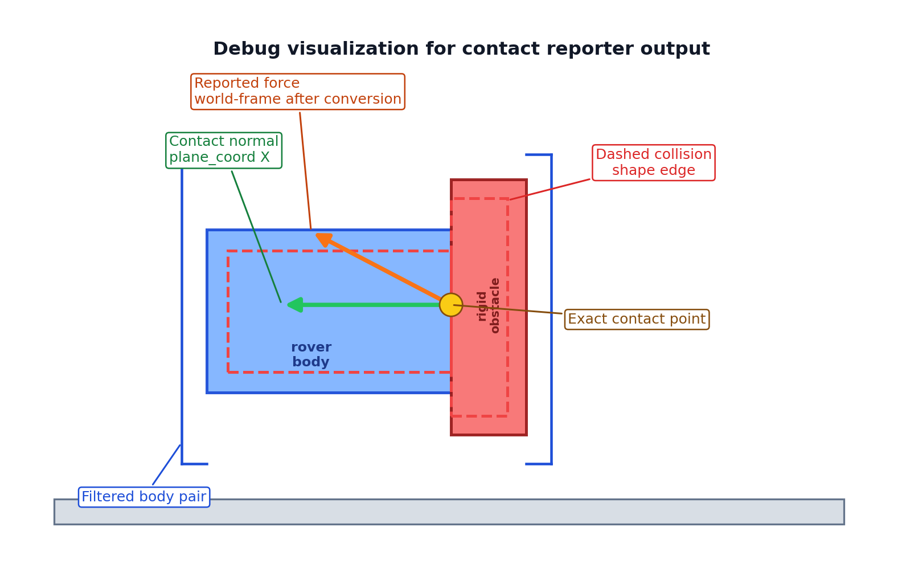

# 2.2.4 충돌/접촉 측정 Component 설계

충돌/접촉 측정 Component는 "무엇이 닿았는가", "얼마나 큰 힘이 발생했는가", "언제 충돌 이벤트가 시작되었는가"를 기록한다. 로버 실험에서 접촉은 단순 시각 효과가 아니라 성능 평가 데이터이다. 따라서 Collision Shape, Contact Material, Contact Reporter, Force Logger, Event Detector, Debug Visualization을 분리해 설계해야 한다.

이 절에서는 충돌/접촉 Component를 물리 형상, 접촉 재질, 측정 callback, 로그, 이벤트 검출, 시각적 검증으로 나누어 설명한다. 렌더링 자료는 접촉 형상과 접촉 방향을 확인하는 근거로 사용하고, 그래프와 CSV는 접촉력의 시간 이력을 검증하는 근거로 사용한다.

## 2.2.4.1 측정 흐름



## 2.2.4.2 Component 요약 표

| Component | 선택 기준 | 주요 API/모듈 | 조정 변수 | 확인 산출물 |
|---|---|---|---|---|
| Collision Shape | visual mesh와 별도로 안정적인 접촉 형상을 정의해야 할 때 | `ChCollisionShape*`, `ChBodyEasy*`, collision model | primitive 종류, 크기, 위치, collision enable | collision envelope 렌더 |
| Collision Backend / Envelope | broadphase/narrowphase backend와 collision tolerance가 접촉 결과에 영향을 줄 때 | collision system/backend, envelope/margin 설정 | backend, envelope, margin, thread/backend metadata | backend/envelope metadata, visual/collision 비교 |
| Collision Filter / Family | self-collision과 reporter noise를 분리해야 할 때 | collision family/mask, pair filter, reporter scope | family, mask, disallow pair, reported pair | filtered pair debug render, pair scope CSV |
| Contact Material | 마찰, 반발, 강성 차이가 결과에 영향을 줄 때 | `ChContactMaterialNSC`, `ChContactMaterialSMC` | friction, restitution, stiffness, damping | 조건별 접촉력 그래프 |
| Contact Reporter | 어떤 body pair가 실제로 접촉했는지 순회해야 할 때 | `ReportContactCallback`, `ReportAllContacts` | pair 필터, 법선/점/힘 기록 여부 | pair별 접촉 개수 CSV |
| Contact Force Logger | 접촉력 peak와 시간 이력을 비교해야 할 때 | `GetContactForce`, reporter force sum, CSV writer | 샘플링 간격, force norm/axis component, 대상 body | contact force CSV/graph |
| Event Detector | first contact, separation, threshold exceed 같은 이벤트가 필요할 때 | threshold check, state transition, event label | force threshold, debounce, event name | event timeline CSV/graph |
| Debug Visualization | 접촉점, 법선 방향, 형상 불일치를 눈으로 확인해야 할 때 | VSG/Irrlicht debug draw, component render | 법선 scale, 표시 색, shape transparency | debug vector 렌더 |

### 접촉/충돌 선택 카탈로그

충돌 Component는 geometry, material, solver/reporting을 분리해서 고른다. 같은 body라도 어떤 collision primitive를 쓰는지, NSC/SMC 중 어떤 접촉 모델을 쓰는지, 어떤 reporter로 데이터를 뽑는지에 따라 결과 해석이 달라진다.

| 선택 항목 | 빠른 prototype | 정밀/확장 선택 | 기록해야 할 metadata |
|---|---|---|---|
| Collision geometry | box, sphere, cylinder, capsule | convex hull, triangle mesh, compound shape | primitive 종류, 크기, body 기준 pose |
| Contact model | `ChContactMaterialNSC` | `ChContactMaterialSMC` with stiffness/damping | NSC/SMC, friction, restitution, stiffness, damping |
| Collision backend | 기본 collision system | Bullet/Multicore 등 빌드별 backend | backend 이름, broadphase 설정, envelope |
| Pair filtering | body name pair filter | subsystem별 reporter 또는 contact family filter | `body_a`, `body_b`, filter rule |
| Force source | reporter 누적 force | body total contact force, sensor/contact callback | force source, 좌표계, 성분 축 |
| Event rule | `contact_count > 0` | threshold, debounce, dwell time | threshold, debounce time, event label |

| 시각 자료 |
|---|
|  |

**설명.** 왼쪽은 접촉을 만드는 body/collision/material/filter, 가운데는 Chrono contact pipeline, 오른쪽은 debug render/CSV/graph/event evidence이다. Component catalog에서는 이 흐름을 하나의 API 호출이 아니라 geometry, material, runtime, reporter, logger의 소유권 계약으로 나눠 기록한다.

### Collision/Contact Component Contract Matrix

| Component | Owns | Depends on | Outputs | Failure modes | Upgrade path |
|---|---|---|---|---|---|
| Collision Shape | solver가 보는 primitive/compound/mesh, local pose, body role | `ChContactable`, Contact Material, Runtime scale | visual/collision comparison render, shape metadata | visual mesh와 불일치, 얇은 형상, local pose 누락 | primitive -> compound -> convex/mesh policy |
| Collision Backend / Envelope | collision system type, broad/narrow phase backend, envelope/margin | Runtime Config, Chrono build | backend metadata, collision timing, debug shape render | early contact, tunneling, backend별 contact count 차이 | Bullet -> multicore/parallel backend |
| Collision Filter / Family | allowed pair, disallowed self-collision, reporter scope | Body taxonomy, Reporter | pair scope CSV, filtered debug render | self-collision noise, 필요한 pair 누락 | body-name filter -> family/mask policy |
| Contact Material | solver contact parameter and material id | Contact method, terrain/tire/chassis component | material effect graph, material metadata | NSC/SMC mismatch, copied material pointer 공유, unit/provenance 누락 | uniform material -> calibrated pair material |
| Contact Reporter | contact container scan scope, pair filter, frame conversion | Collision System, Contact Container | contact count, contact point/normal/force rows | filter 과다/과소, `reset()` 누락, frame/sign 혼동 | all-contact scan -> typed reporter family |
| Contact Force Logger | aggregation rule and CSV schema | Reporter, Data Logger | force norm/components graph, probe CSV | body total force와 pair force 혼동, aggregation 불명확 | single pair -> subsystem/contact map |
| Event Detector | first/peak/separation/dwell rule | Force Logger, threshold config | event timeline CSV/graph | threshold chattering, debounce 누락, event label 불명확 | first-contact -> state-machine event detector |
| Debug Visualization | contact point, normal, force vector, collision envelope render | Reporter, Collision Backend, Render backend | debug vector render and screenshot | arrow 방향과 CSV frame 불일치, shape 표시 누락 | static debug render -> per-frame validation capture |

### Contact Method Compatibility Matrix

Chrono contact method와 contact material class는 서로 맞아야 한다. `ChSystemNSC`에 `ChContactMaterialSMC`를 섞거나, 반대로 SMC system에서 NSC material을 쓰면 접촉 물리와 파라미터 해석이 어긋난다.

| System/contact method | Material class | 물리 해석 | 주로 조정하는 값 | 적합한 사용 |
|---|---|---|---|---|
| `ChSystemNSC` / `ChContactMethod_NSC` | `ChContactMaterialNSC` | hard contact를 constraint/complementarity 방식으로 처리 | friction, restitution, rolling/spinning friction | 로버 prototype, rigid obstacle, 비교적 큰 timestep |
| `ChSystemSMC` / `ChContactMethod_SMC` | `ChContactMaterialSMC` | penetration 기반 penalty spring-damper contact | friction, restitution, Young modulus/stiffness, damping, adhesion | compliant contact, track/terrain 실험, 접촉 강성 비교 |
| Vehicle model NSC | subsystem별 NSC material | tire/terrain/contact가 NSC 규칙으로 결합 | terrain friction, tire model, collision type | 빠른 wheeled vehicle test |
| Vehicle model SMC | subsystem별 SMC material | compliant terrain/contact 응답을 더 직접적으로 튜닝 | stiffness, damping, soil/contact parameters | tracked vehicle, deformable/compliant contact |

| 실패 조건 | 증상 | 점검 방법 |
|---|---|---|
| System과 material method 불일치 | contact parameter가 기대처럼 작동하지 않거나 예제가 불안정해짐 | System 생성 class와 material class 이름을 같이 확인 |
| SMC stiffness/damping 과대 | force peak가 너무 크고 timestep에 민감 | contact material effect graph와 timestep metadata 비교 |
| NSC에서 compliance를 기대 | 침투/변형량 기반 튜닝이 되지 않음 | SMC가 필요한 실험인지 Terrain/Tire 요구사항 재검토 |

### Contact Runtime Contract

Contact 결과는 shape나 material만으로 재현되지 않는다. System class, contact method, solver, timestep, backend, envelope/margin, module availability를 같은 run metadata로 묶어야 한다.

| contact_method | system_class | material_class | solver/runtime | dt_s | collision_backend | envelope_m / margin_m | module availability | failure symptom |
|---|---|---|---|---|---|---|---|---|
| NSC | `ChSystemNSC` | `ChContactMaterialNSC` | iterative/complementarity solver | `run_config.dt_s` | Bullet or Multicore | global suggested values | Core collision backend | hard contact force가 불안정하거나 contact count가 backend별로 바뀜 |
| SMC | `ChSystemSMC` | `ChContactMaterialSMC` | penalty spring-damper contact | stiffness 기준으로 더 작게 요구될 수 있음 | Bullet or Multicore | shape tolerance + penetration policy | SMC contact support | force spike, 과도한 침투, stiffness/damping 단위 오류 |
| Vehicle terrain contact | Vehicle system contact method와 terrain/tire material | terrain/tire subsystem material | tire/terrain loop와 동기화 | vehicle step과 terrain step 일치 | build/runtime backend | terrain patch/shape policy | Vehicle module | tire force와 body contact force가 같은 의미로 섞임 |
| FEA/Granular/FSI contact | module-specific system/coupling | module-specific contact or coupling material | module solver/coupling step | coupling step 기록 | module backend | domain/contact tolerance | FEA/Granular/FSI availability | contact evidence가 module state 없이 재현 불가 |

### Collision Shape Family Catalog

Collision Shape는 visual mesh의 디테일을 따라가는 것이 아니라 solver가 안정적으로 처리할 접촉 envelope를 고르는 과정이다. 아래 표는 Component 설계 시 우선순위를 정하는 기준이다.

| Shape family | 대표 API | 장점 | 주의사항 | 사용 예 |
|---|---|---|---|---|
| Box | `ChCollisionShapeBox`, `ChBodyEasyBox` | 빠르고 안정적이며 ground/벽/차체 envelope에 적합 | 둥근 물체를 과도하게 각지게 근사할 수 있음 | chassis collision, obstacle, rigid ground |
| Sphere | `ChCollisionShapeSphere`, `ChBodyEasySphere` | 방향성이 없어 접촉이 안정적 | wheel처럼 축 방향이 중요한 부품에는 부적합 | marker, ball probe, 단순 접촉 테스트 |
| Cylinder | `ChCollisionShapeCylinder`, `ChBodyEasyCylinder` | wheel/roller/pulley의 기본 형상 | cylinder axis와 joint/motor axis 불일치 주의 | wheel collision, roller, axle housing |
| Capsule | `ChCollisionShapeCapsule` | 끝이 둥근 rod/link 접촉을 부드럽게 근사 | visual mesh와 길이/반경 offset 확인 필요 | suspension link, rounded guard |
| Convex/compound | convex hull, multiple primitives | mesh보다 안정적이면서 복잡한 외형 근사 가능 | primitive별 local pose metadata 필요 | 로버 하부 envelope, 복합 장애물 |
| Triangle mesh | triangle mesh collision | 복잡한 terrain/obstacle 형상 표현 | 계산량과 수치 안정성 비용이 큼 | 고정 terrain mesh, 상세 obstacle 검증 |

### Extended Collision Shape Type Registry

공식 `ChCollisionShape::Type`은 기본 primitive보다 넓다. 보고서의 shape manifest는 사람이 붙인 family 이름과 Chrono enum을 모두 저장해야, 나중에 compound/mesh/2D/FEA 접촉으로 확장해도 같은 schema로 비교할 수 있다.

| Type group | Official enum values | Typical class/API family | Catalog fields that must not be omitted | Main risk |
|---|---|---|---|---|
| Primitive 3D | `SPHERE`, `ELLIPSOID`, `BOX`, `CYLINDER`, `CAPSULE`, `CONE` | `ChCollisionShapeSphere`, `ChCollisionShapeEllipsoid`, `ChCollisionShapeBox`, `ChCollisionShapeCylinder`, `ChCollisionShapeCapsule`, `ChCollisionShapeCone` | `shape_type_enum`, dimensions/radius/height, `body_REF_frame`, `material_id`, `contact_method`, `bounding_box` | axis/frame mismatch, extreme aspect ratio |
| Rounded/shell | `ROUNDEDBOX`, `ROUNDEDCYL`, `CYLSHELL`, `BARREL` | rounded box/cylinder, cylindrical shell, barrel shape families | rounding radius or shell thickness, local frame, `thin_shape_risk`, envelope/margin | visual corner와 solver rounded contact 혼동 |
| Convex/mesh | `CONVEXHULL`, `TRIANGLEMESH`, `CONNECTEDTRIANGLE` | convex hull, triangle mesh, connected triangle in mesh | mesh path/hash, scale, convexity, `parent_shape_id`, `is_mutable`, source simplification rule | concave mesh cost, stale mutable mesh, parent 누락 |
| Low-level primitives | `POINT`, `SEGMENT`, `TRIANGLE`, `TETRAHEDRON` | point/segment/triangle/tetrahedron contact shapes | vertex coordinates, topology id, parent mesh/contact surface, material id | body-only reporter가 target type을 잃음 |
| 2D/path | `PATH2D`, `SEGMENT2D`, `ARC2D` | path/segment/arc shape families | path id, curve parameters, plane/frame, parent id | 3D body frame과 2D curve frame 혼동 |
| Unknown/fallback | `UNKNOWN_SHAPE` | imported or unsupported shape | source class string, fallback reason, unsupported behavior | shape policy가 실제 solver shape를 재현하지 못함 |

| `collision_shape_manifest.csv/json` column | Meaning |
|---|---|
| `shape_id`, `parent_shape_id`, `owner_contactable_id` | compound/mesh/FEA target 안에서 shape를 stable하게 찾기 위한 key |
| `shape_type_enum`, `shape_class`, `shape_family` | Chrono enum, concrete API family, 보고서 분류명을 모두 저장 |
| `body_REF_frame`, `local_pos_xyz_m`, `local_rot_quat`, `scale_xyz` | collision shape가 body REF frame 기준으로 어디에 붙었는지 기록 |
| `material_id`, `contact_method`, `is_mutable` | material sharing, NSC/SMC compatibility, deformable/updated shape 여부 |
| `bounding_box_min/max`, `mesh_path`, `mesh_hash`, `mesh_convexity` | broadphase/debug/asset 재현을 위한 geometry evidence |
| `thin_shape_risk`, `envelope_m`, `margin_m`, `debug_render` | tunneling, rounded-corner effect, visual/collision mismatch를 추적 |

### Collision Shape API Metadata Policy

Chrono collision model은 `ChCollisionShape` 목록과 contact material을 가진다. Component catalog에서는 shape family 이름만 저장하지 말고, solver가 실제로 본 형상의 source, local frame, mesh policy를 같이 남긴다.

| Shape case | Required metadata | Guardrail |
|---|---|---|
| Primitive shape | `shape_type`, dimensions, body-local `shape_frame`, material id, enable/collision flag | visual frame과 collision REF frame을 혼동하지 않는다. |
| Compound primitive | primitive list, per-shape local frame, per-shape material id, compound purpose | compound shape가 늘어나면 collision detection 비용이 증가한다. |
| Convex hull | source points/mesh hash, hull generation method, local frame, scale/unit transform | visual mesh 전체를 그대로 쓰지 말고 hull source와 simplification 기준을 기록한다. |
| Triangle mesh | mesh path/hash, `is_static`, `is_convex`, sphere-swept radius/thickness, local frame, material id | 움직이는 concave mesh는 성능/안정성 비용이 크므로 명시적 justification이 있어야 한다. |
| FEA contact surface | mesh id, contact surface type, swept thickness/radius, material id, node/face selection rule | `ChBody` collision model과 `ChMesh` contact surface를 같은 소유자로 기록하지 않는다. |

### Collision Backend / Envelope Component

Collision backend와 envelope/margin은 개별 body가 아니라 Runtime과 collision system 사이의 계약이다. 보고서에서는 body shape만 기록하지 말고, 어떤 collision backend와 margin 조건에서 생성된 접촉인지 metadata로 남긴다.

| Component | Owns | Depends on | Metadata key | Failure modes |
|---|---|---|---|---|
| Collision Backend | broadphase/narrowphase backend, collision system type | Runtime, Chrono build | `collision_backend`, `collision_system_type` | 다른 backend에서 접촉 개수/시점이 달라짐 |
| Collision Envelope/Margin | collision detection tolerance, shape inflation/skin assumption | Collision Shape, Contact Reporter | `collision_envelope_m`, `collision_margin_m` | visual보다 먼저 닿거나 접촉 누락처럼 보임 |
| Shape Family Policy | primitive/compound/mesh 허용 범위 | Runtime stability, performance budget | `collision_shape_policy` | mesh collision 과다, primitive local pose 누락 |
| Debug Export Policy | collision envelope와 visual shape 동시 출력 여부 | Render/Screenshot, Debug Visualization | `debug_collision_render` | 문제 발생 시 실제 contact geometry를 재현하지 못함 |

### Backend Evidence Contract

`ChSystem::SetCollisionSystemType()`로 선택한 backend는 결과 해석의 일부이다. Bullet과 Multicore는 같은 shape/material을 보더라도 contact count, broad/narrowphase timing, callback 지원 범위가 달라질 수 있으므로 run artifact에 backend evidence를 남긴다.

| Evidence field | Why it belongs in the artifact |
|---|---|
| `chrono_version`, `system_class`, `contact_method` | contact formulation과 container type을 재현하기 위한 최소 runtime context |
| `collision_system_type` | `ChCollisionSystem::Type::BULLET` 또는 `MULTICORE` 같은 backend 선택값 |
| `module_availability` | Multicore/parallel backend가 실제 빌드에서 활성화되었는지 또는 fallback인지 구분 |
| `thread_count_collision` | `SetNumThreads` 또는 system thread metadata가 broad/narrowphase timing에 영향을 줄 수 있음 |
| `collision_envelope_m`, `collision_margin_m`, `bullet_contact_breaking_threshold_m` | early contact, tunneling, rounded-corner 효과 해석에 필요 |
| `timer_collision_broad_s`, `timer_collision_narrow_s` | broadphase/narrowphase 비용 비교와 backend regression 감지 |
| `contact_count_total`, `contact_count_filtered` | backend가 만든 전체 contact와 reporter가 기록한 pair contact를 분리 |
| `source`, `fallback_reason` | 현재 PNG/CSV가 live Chrono run인지 deterministic fallback인지 구분 |

### Collision Filter / Family Component

다중 body 로버나 tracked vehicle은 self-collision과 reporter noise가 쉽게 생긴다. Collision Filter/Family Component는 "어떤 body끼리 충돌할 수 있는가"와 "어떤 pair를 기록할 것인가"를 분리해 소유한다.

| 항목 | 계약 |
|---|---|
| family | chassis, wheel, suspension link, terrain, obstacle 같은 collision family 이름을 metadata에 둔다. |
| mask/disallow rule | 같은 suspension assembly 안의 self-collision처럼 제외할 pair를 명시한다. |
| reported pair | 실제 collision은 허용하되 CSV reporter가 기록할 pair는 `body_a`, `body_b`로 별도 필터링한다. |
| contact logger scope | total body force, filtered pair force, terrain-wheel force를 `source` 컬럼으로 구분한다. |
| validation artifact | debug render에서 included/excluded pair와 reporter pair가 서로 다르게 보일 수 있음을 설명한다. |

#### Collision Family Filter Map Contract

Chrono collision family는 `ChCollisionModel`이 가진 0..15 범위의 family id와 allow/disallow mask로 작동한다. Component catalog에서는 "self-collision을 껐다" 같은 문장 대신 resolved map을 산출물로 남긴다.

| `collision_family_filter_map.csv/json` field | Required value |
|---|---|
| `family_id`, `family_name` | 0..15 id와 `chassis`, `wheel`, `terrain`, `obstacle`, `track_shoe` 같은 보고서 이름 |
| `owner_body_or_contactable_ids` | 해당 family를 가진 body/contactable 목록 |
| `set_family_api` | `GetCollisionModel()->SetFamily(family_id)` 또는 wrapper source |
| `allow_api`, `disallow_api` | `AllowCollisionsWith()` / `DisallowCollisionsWith()`로 선언한 rule |
| `resolved_family_mask` | 최종 mask 또는 included/excluded family list |
| `included_pairs`, `excluded_pairs` | solver collision 허용 pair와 차단 pair를 이름으로 풀어쓴 목록 |
| `reporter_scope` | collision은 허용하지만 CSV reporter가 읽는 pair scope |
| `debug_artifact` | included/excluded pair가 표시된 render 또는 pair CSV |
| `failure_mode` | self-collision noise, 필요한 pair 누락, reporter over-filter 같은 위험 |

| Example family | Collides with | Disallowed | Reporter scope |
|---|---|---|---|
| `chassis` | `obstacle`, `terrain`, `wheel` | same chassis payload internals | rover-obstacle body pair |
| `wheel` | `terrain`, selected obstacle | same axle wheel/suspension internals | wheel-terrain contact logger |
| `track_shoe` | `terrain`, sprocket/idler policy pair | same belt segment when excluded by model policy | shoe-terrain or shoe-sprocket audit |
| `terrain` | chassis/wheel/track/obstacle depending scenario | terrain-terrain self-pair | terrain-wheel evidence |

### Contactable Target Catalog

Chrono contact는 두 `ChContactable` 객체 사이의 관계이다. 이 문서의 예시는 `ChBody` 중심이지만, Component contract는 contact target 종류를 명시해야 한다.

| Contact target | Collision ownership | Reporter requirement |
|---|---|---|
| Rigid `ChBody` | body의 `ChCollisionModel`과 shape/material | `CastToChBody()` 기반 pair reporter 사용 가능 |
| Particle or point contactable | contactable type과 variable DOF metadata | body name filter가 통하지 않으므로 contactable id/type filter 필요 |
| FEA node/segment/triangle | `ChMesh` contact surface와 selected nodes/faces | body-only reporter는 unsupported target으로 기록 |
| Vehicle tire/track terrain contact | vehicle/terrain subsystem contact surface or collision body | wheel/tire/track id와 terrain component id를 별도 schema로 기록 |
| Multicore contactable set | multicore container/backend availability | contact reaction force/torque reporting support를 backend별로 확인 |

## 2.2.4.3 Visual Shape와 Collision Shape의 차이

| 구분 | Visual Shape | Collision Shape |
|---|---|---|
| 목적 | 사람이 볼 렌더링 | 물리 접촉 계산 |
| 대표 API | `ChVisualShapeBox`, `ChVisualShapeCylinder`, mesh visual | `ChCollisionShapeBox`, `ChBodyEasyBox`, collision model |
| 복잡도 | 디테일이 많아도 됨 | 단순할수록 안정적이고 빠름 |
| 실패 양상 | 보기만 어색함 | 접촉 누락, 과도한 침투, 수치 불안정 |

## 2.2.4.4 Contact Material과 Contact Reporter의 역할 차이

| 구분 | Contact Material | Contact Reporter |
|---|---|---|
| 역할 | 접촉이 발생했을 때의 물리 파라미터 정의 | 발생한 접촉을 순회하며 측정값 추출 |
| 입력 | 마찰, 반발, stiffness/damping | contact container의 contact pair |
| 출력 | 솔버가 사용하는 접촉 조건 | 접촉 개수, 접촉점, 접촉력, 이벤트 |
| 설계 위치 | body/terrain 생성 시 | simulation loop 내부 |

### Contact Container vs Reporter

Contact Container는 Chrono가 한 step의 contact를 담는 runtime 객체이고, Reporter는 그 container를 어떤 schema로 읽을지 정하는 Component이다. `GetContactContainer().ReportAllContacts(callback)` 호출은 syntax가 아니라 아래 계약을 실행하는 지점이다.

| Runtime item | Chrono role | Component evidence requirement |
|---|---|---|
| `GetContactContainer()` | system이 가진 contact container 접근 | container class/type, contact method, backend를 run metadata에 기록 |
| `ReportAllContacts(callback)` | container의 모든 contact를 순회하며 callback 호출 | callback class, pair filter, reset policy, returned rows/count 기록 |
| `ComputeContactForces()` | contactable별 resultant force/torque cache 계산 | body/contactable total force와 pair reporter force를 다른 `force_source`로 구분 |
| `GetContactableForce/Torque()` | 특정 `ChContactable`에 작용한 resultant contact force/torque | body-only `GetContactForce()`와 contactable-general force API를 구분 |
| NSC/SMC container | hard-contact or penalty-contact container semantics | `ChContactContainerNSC`/`ChContactContainerSMC`와 material class 일치 여부 기록 |
| Multicore container | parallel collision/contact backend의 container | callback force/torque 지원 범위와 fallback reason을 명시 |

코드 블록은 구현 anchor일 뿐이다. 이 2.2 문서는 문법 walkthrough가 아니라 ownership, metadata, evidence, failure mode, upgrade path를 고정하는 카탈로그이고, API 호출 순서 자체를 가르치는 내용은 2.1 Command 단계로 넘긴다.

### Contact Callback Family Catalog

Chrono의 callback은 모두 같은 "reporter"가 아니다. Broadphase/narrowphase callback은 contact 생성 전 collision pipeline에 개입하고, add-contact callback은 container에 contact가 들어갈 때 pair composite material을 바꿀 수 있으며, report callback은 이미 추가된 contact를 읽어 CSV/graph로 후처리한다. Debug visualization callback은 shape/contact 표시용 evidence hook이다.

| Callback family | Phase | Chrono hook | Input object | Can modify contact/material? | Catalog artifact | Unsupported/fallback behavior |
|---|---|---|---|---|---|---|
| Broadphase callback | near-enough pair after broadphase | `ChCollisionSystem::RegisterBroadphaseCallback` / `OnBroadphase` | two `ChCollisionModel` pointers | can skip narrowphase pair by return value | `contact_callback_manifest.csv/json`, family filter map | backend/PyChrono binding 미지원이면 family/mask와 reporter filter로 대체 |
| Narrowphase callback | overlapping pair after narrowphase | `RegisterNarrowphaseCallback` / `OnNarrowphase` | `ChCollisionInfo` | can decide whether generated collision info becomes contact; geometry override must be explicitly documented | callback manifest, modified contactinfo log | mutation unsupported이면 report-only evidence로 낮춰 기록 |
| Add-contact callback | contact point added to container | `ChContactContainer::RegisterAddContactCallback` / `OnAddContact` | `ChCollisionInfo`, `ChContactMaterialComposite` | yes, composite material can be modified per pair | `contact_pair_material_policy.csv/json` | material mutation disabled이면 original/composite material ids만 기록 |
| Report-contact callback | contact already in container | `ReportAllContacts(callback)` / `OnReportContact` | pA, pB, contact frame, force/torque, contactables | report/post-process only; return false stops scanning | contact probe CSV, force/torque graph, reporter scope render | non-body contactable cast 실패를 `unsupported_contactable_type`으로 남김 |
| Visualization callback | collision debug render | `RegisterVisualizationCallback` / `Visualize(flags)` | collision shape/contact visualization request | no physics mutation; debug drawing only | `contact_frame_debug_manifest.csv/json`, render PNG | backend 미지원이면 deterministic schematic에 `fallback_reason` 기록 |

| `contact_callback_manifest.csv/json` field | Meaning |
|---|---|
| `callback_id`, `callback_family`, `class_name` | user callback과 Chrono hook family를 stable하게 구분 |
| `registered_on`, `phase`, `chrono_hook` | collision system인지 contact container인지, 어느 phase에서 호출되는지 |
| `input_contract` | `ChCollisionModel`, `ChCollisionInfo`, `ChContactMaterialComposite`, `ReportContactCallback` arguments |
| `mutation_policy` | skip pair, geometry override, composite material edit, report-only, visualize-only 중 하나 |
| `filter_rule`, `pair_scope`, `contactable_type_policy` | body pair, family/mask, non-body target 처리 |
| `artifact`, `evidence_level`, `fallback_reason` | CSV/render/manifest와 live/fallback 구분 |

### Contact Reporter Component Contract

Reporter는 "반복문에서 callback을 호출하는 코드"가 아니라 접촉 데이터를 어떤 범위와 좌표계로 집계할지 정하는 Component이다. 아래 계약을 먼저 정해두면 2.1 Command 단계의 `ReportAllContacts` 호출 설명과 혼동되지 않는다.

| 계약 항목 | Component가 소유하는 결정 | 로그/metadata 컬럼 |
|---|---|---|
| pair scope | 전체 contact, 특정 body pair, terrain-wheel pair, self-collision 제외 pair 중 무엇을 기록할지 | `body_a`, `body_b`, `filter_rule` |
| force source | reporter force 합, body total contact force, tire/terrain force 중 어느 값을 대표 force로 둘지 | `source`, `force_source` |
| frame conversion | world frame, body local frame, contact normal/tangent frame 중 어떤 좌표계로 성분을 저장할지 | `frame`, `normal_x/y/z`, `contact_fx/fy/fz` |
| aggregation rule | 여러 contact point를 count, sum, max, mean 중 어떻게 압축할지 | `contact_count`, `aggregation` |
| event rule | first contact, separation, threshold exceed, dwell time을 어떻게 정의할지 | `event`, `threshold_N`, `debounce_s` |
| debug link | 어떤 render/debug image와 같은 pair를 보여주는지 | `debug_render`, `shape_family`, `collision_backend` |

## 2.2.4.5 Collision Shape Component

Collision Shape Component는 로버, 바퀴, 장애물, ground의 접촉 영역을 정의한다. 접촉 계산에서 가장 중요한 것은 "보기 좋은 모양"이 아니라 "물리적으로 안정적인 단순 형상"이다.

| 항목 | 설계 내용 |
|---|---|
| 역할 | 접촉 판정, 침투 깊이, 접촉 법선 계산 |
| 주요 API | `ChBodyEasyBox`, `ChBodyEasyCylinder`, `ChCollisionShapeBox`, `ChCollisionModel` |
| 주요 변수 | 크기, 위치, collision enable, contact material |
| 주의사항 | visual mesh와 collision primitive를 분리해 렌더에서 확인한다. |

아래 코드는 장애물을 collision 가능한 body로 만들고 고정하는 예시이다. 렌더의 붉은 고정 벽은 이 body가 접촉 pair의 한쪽 대상임을 보여준다.

```python
material = chrono.ChContactMaterialNSC()
material.SetFriction(0.35)
material.SetRestitution(0.05)

obstacle = chrono.ChBodyEasyBox(0.35, 1.2, 0.8, 1200, True, True, material)
obstacle.SetName("collision_obstacle")
obstacle.SetFixed(True)
obstacle.SetPos(chrono.ChVector3d(0.65, 0.0, 0.40))
system.AddBody(obstacle)
```

| 렌더링 관찰 기준 | 해석 기준 |
|---|---|
| Collision envelope | 로버 visual shape와 collision envelope가 구분되어야 실제 접촉 계산에 쓰이는 형상을 검증할 수 있다. |

| 시각 자료 |
|---|
|  |

**설명.** 접촉 측정 장면을 설명하는 deterministic schematic이다. 파란 body와 빨간 obstacle은 각각 collision shape을 가진 contactable이고, 하늘색 화살표는 approach velocity, 초록 화살표는 contact normal, 주황 화살표는 reporter가 기록할 contact force 방향을 나타낸다.

| 시각 자료 |
|---|
|  |

**설명.** 왼쪽은 사람이 보는 visual shape, 오른쪽은 물리 계산에 쓰는 단순 collision primitive를 분리해 보여준다. 시각화용 외형과 물리 계산용 형상은 서로 다를 수 있다.

## 2.2.4.6 Contact Material Component

Contact Material은 충돌이 발생한 뒤 솔버가 어떤 조건으로 접촉력을 계산할지 정한다. 같은 collision shape이어도 마찰 계수와 반발 계수가 다르면 로버의 정지 거리, 튀어오름, 미끄러짐이 달라진다.

| 파라미터 | 의미 | 관찰할 결과 |
|---|---|---|
| friction | 접선 방향 저항 | 미끄러짐, 주행력, 제동거리 |
| restitution | 반발 정도 | 충돌 후 튀어오름 |
| compliance/stiffness | 접촉 변형 또는 강성 | 침투량, contact force peak |
| damping | 충격 감쇠 | 진동, 접촉력 지속 시간 |

아래 코드는 NSC contact material을 정의하는 최소 예시이다. NSC에서는 friction/restitution 같은 hard-contact parameter가 중심이고, stiffness/damping이나 Young modulus 기반 튜닝은 SMC material과 System에서 별도로 다뤄야 한다. 그래프에서는 material 설정 차이가 force peak와 지속 시간 차이로 나타난다.

```python
soft_contact = chrono.ChContactMaterialNSC()
soft_contact.SetFriction(0.45)
soft_contact.SetRestitution(0.02)
```

NSC material도 friction/restitution만으로 끝나지 않는다. Cohesion, normal/tangential compliance, damping factor, rolling/spinning friction은 rigid rover contact에서도 force peak, residual rolling resistance, solver cost에 영향을 줄 수 있다. SMC material은 Young modulus/Poisson ratio 또는 explicit stiffness/damping 계열 값을 더 직접적으로 노출하므로, material schema는 NSC와 SMC field를 같은 표에서 구분해야 한다.

| Material API family | Fields to record | Interpretation note |
|---|---|---|
| Common `ChContactMaterial` | static/sliding friction, rolling/spinning friction, restitution | sliding/rolling/spinning resistance와 bounce metadata |
| `ChContactMaterialNSC` | cohesion, compliance, complianceT, compliance rolling/spinning, dampingF | hard-contact solver 안의 compliance/damping metadata; zero compliance는 rigid contact assumption |
| `ChContactMaterialSMC` | Young modulus, Poisson ratio, adhesion, Kn/Kt, Gn/Gt | penalty/contact stiffness와 damping; timestep sensitivity를 함께 기록 |
| `ChContactMaterialData` | mu, cr, Y, nu, kn, gn, kt, gt and `CreateMaterial(contact_method)` | config-driven material을 NSC/SMC에 맞게 생성할 때 source schema로 사용 |

### Contact Material Contract

| Field | 기록 내용 | 주의사항 |
|---|---|---|
| `material_id` | body/terrain/patch에서 참조할 안정 ID | copied/cloned body가 같은 material object를 공유할 수 있으므로 변경 provenance를 남긴다. |
| `method` | `NSC` 또는 `SMC` | System contact method와 material class가 맞아야 한다. |
| `applies_to_body_or_patch` | chassis, wheel, obstacle, terrain patch, track shoe 등 적용 대상 | terrain query friction, tire parameter, SCM soil parameter와 구분한다. |
| `friction`, `restitution` | 무차원 접촉 parameter | calibration source와 단위를 함께 둔다. |
| `rolling_friction`, `spinning_friction` | rolling/spinning 저항 | wheel/tire 실험에서는 sliding friction만으로 충분하지 않을 수 있다. |
| `stiffness_Npm`, `damping_Nspm` | SMC penalty 계열 강성/감쇠 | NSC 예시 코드와 혼동하지 않는다. |
| `young_modulus`, `poisson_ratio`, `adhesion` | SMC 또는 advanced contact에서 필요한 material law | timestep 안정성과 force peak를 함께 검증한다. |
| `source`, `calibration_note` | 문헌, 실험, fallback 값 구분 | fallback analytic graph는 실제 Chrono material calibration으로 과대 해석하지 않는다. |
| `compatible_system` | `ChSystemNSC`, `ChSystemSMC`, Vehicle/terrain coupling 조건 | Runtime metadata와 같은 값이어야 한다. |

### Contact Pair Material Policy Contract

표면 material catalog는 각 shape가 가진 material을 설명하고, pair material policy는 두 material이 만났을 때 composite property를 그대로 쓸지 callback으로 바꿀지를 설명한다. 이 둘을 분리해야 terrain patch friction, tire model friction, solver contact material이 섞이지 않는다.

| `contact_pair_material_policy.csv/json` field | Why it is required |
|---|---|
| `material_a_id`, `material_b_id`, `body_or_shape_a`, `body_or_shape_b` | pair-specific override가 어느 표면 조합에 적용되는지 고정 |
| `contact_method`, `NSC_SMC_compatibility` | composite material class가 runtime method와 맞는지 확인 |
| `composite_material_class` | NSC/SMC composite contact material family를 구분 |
| `mixing_rule` | default combine, min/max/average/custom callback 같은 계산 규칙 |
| `add_contact_callback_class` | `AddContactCallback`이 pair material을 바꾸는 경우 class/source를 기록 |
| `modified_fields` | friction, restitution, cohesion, compliance, Kn/Kt/Gn/Gt, adhesion 등 실제 변경 field |
| `contactinfo_filter` | pair name, family, shape type, terrain patch id 등 callback 조건 |
| `calibration_source` | 실험값, 문헌값, fallback analytic value 구분 |
| `evidence_graph`, `debug_artifact` | material effect graph와 contact pair render link |

| Policy case | Component interpretation |
|---|---|
| surface-only material | 각 collision shape의 `material_id`만 사용하고 pair override는 없음 |
| pair override | `AddContactCallback` 또는 contact creation hook이 특정 pair의 composite material을 수정 |
| terrain/tire split | terrain query friction은 2.2.3 terrain authority, solver contact material은 2.2.4 contact authority로 기록 |
| fallback graph | material trend를 보여주는 deterministic graph이며 live material calibration proof는 아님 |

| 렌더링 관찰 기준 | 해석 기준 |
|---|---|
| Contact material 비교 | 마찰이 다른 두 표면에서 이동 거리, 미끄러짐, 접촉력 peak 차이가 나타난다. |

| 그래프 |
|---|
|  |

**설명.** 같은 충돌이라도 접촉 재질이 더 단단하면 짧고 큰 force peak가 나타나고, 더 부드럽거나 damping이 큰 조건은 peak가 낮고 지속 시간이 길어진다. Contact Material은 "닿았는가"가 아니라 "닿은 뒤 어떤 힘으로 반응하는가"를 바꾸는 Component이다.

## 2.2.4.7 Contact Reporter Component

Contact Reporter는 `ReportContactCallback`을 상속해 contact container가 가진 접촉 정보를 필요한 형식으로 변환한다. 전체 접촉 개수만 세면 ground-wheel 접촉과 rover-obstacle 접촉이 섞이므로, 특정 body pair만 필터링하는 reporter가 필요하다.

### Contact Reporter Family

| Reporter family | Owns | Expected schema | When not to use |
|---|---|---|---|
| all contacts scan | 전체 contact count와 global sanity check | `time_s`, `contact_count`, `collision_backend`, `source` | 특정 wheel/obstacle force를 비교해야 할 때 |
| body-pair reporter | 지정한 `body_a`/`body_b` pair만 필터링 | pair names, contact points, normal, force components, filter rule | self-collision 또는 terrain-wheel 전체 map이 필요할 때 |
| terrain-wheel reporter | wheel/tire/track shoe와 terrain/patch pair | wheel id, terrain component id, slip/load/sinkage link | obstacle collision과 terrain contact를 구분하지 않을 때 |
| self-collision audit reporter | 같은 subsystem 내부 pair 점검 | family/mask, excluded pair, active pair | 성능 로그나 일반 force graph만 필요할 때 |
| event-only reporter | threshold/event 상태만 압축 | event label, threshold, debounce, dwell time | force vector 방향이나 contact point 검증이 필요할 때 |

아래 코드는 `body_a`, `body_b`로 지정한 pair만 세고, 그 pair의 접촉력 성분만 누적한다. Debug 렌더에서 노란 contact point가 보이더라도 reporter filter를 통과하지 않는 pair는 CSV에 기록하지 않는다.

```python
class PairContactReporter(chrono.ReportContactCallback):
    def __init__(self, body_a, body_b):
        super().__init__()
        self.body_a = body_a
        self.body_b = body_b
        self.count = 0
        self.fx = 0.0
        self.fy = 0.0
        self.fz = 0.0

    def reset(self):
        self.count = 0
        self.fx = self.fy = self.fz = 0.0

    def OnReportContact(self, pA, pB, plane_coord, distance, eff_radius,
                        cforce, ctorque, modA, modB, cnstr_offset):
        body_a = chrono.CastToChBody(modA)
        body_b = chrono.CastToChBody(modB)
        is_target_pair = (
            body_a == self.body_a and body_b == self.body_b
        ) or (
            body_a == self.body_b and body_b == self.body_a
        )
        if is_target_pair:
            global_force = plane_coord * cforce
            fx, fy, fz = vec_xyz(global_force)
            self.count += 1
            self.fx += fx
            self.fy += fy
            self.fz += fz
        return True
```

여기서 `vec_xyz`는 PyChrono 버전에 따른 `vec.x`/`vec.x()` 접근 차이를 흡수하는 작은 helper이다. 시뮬레이션 루프에서는 다음처럼 사용한다.

```python
reporter.reset()
system.GetContactContainer().ReportAllContacts(reporter)
force_norm = (reporter.fx**2 + reporter.fy**2 + reporter.fz**2) ** 0.5
```

| 렌더링 관찰 기준 | 해석 기준 |
|---|---|
| Contact pair 구분 | 전체 접촉 중 rover-obstacle pair가 구분되어야 reporter가 어떤 접촉만 기록하는지 해석할 수 있다. |

| 시각 자료 |
|---|
|  |

**설명.** 노란 점은 모두 실제 접촉 후보이지만, 초록 bracket이 감싼 rover-obstacle pair만 이 reporter의 CSV로 들어간다. wheel-ground contact는 같은 step에 존재해도 `body_a`/`body_b` filter 밖이면 다른 logger나 terrain probe에서 다뤄야 한다.

## 2.2.4.8 Contact Force Logger Component

Contact Force Logger는 시간별 접촉력과 접촉 개수를 CSV에 저장한다. body의 `GetContactForce()`는 해당 body에 작용한 총 접촉력이고, reporter는 원하는 pair의 접촉만 필터링할 수 있다. 두 값을 혼동하지 않는 것이 중요하다.

### Collision Contact Probe Schema

| Schema | 필수 컬럼 |
|---|---|
| `collision_contact_probe_schema` | `run_id`, `schema_id`, `scenario_id`, `time_s`, `step_index`, `contact_component_id`, `body_a`, `body_b`, `body_role_a`, `body_role_b`, `contactable_a_type`, `contactable_b_type`, `pair_order`, `force_on`, `contact_count`, `point_x_m`, `point_y_m`, `point_z_m`, `point_a_x/y/z_m`, `point_b_x/y/z_m`, `normal_x/y/z`, `tangent_u_x/y/z`, `tangent_v_x/y/z`, `plane_coord_3x3`, `distance_m`, `penetration_m`, `eff_radius_m`, `constraint_offset`, `react_fx/fy/fz_contact_N`, `react_tx/ty/tz_contact_Nm`, `contact_fx/fy/fz_N`, `contact_force_N`, `contact_tx/ty/tz_Nm`, `contact_torque_Nm`, `frame`, `torque_frame`, `aggregation`, `force_source`, `ComputeContactForces_called`, `material_a_id`, `material_b_id`, `contact_method`, `collision_backend`, `filter_rule`, `source` |
| `collision_contact_container_schema` | `run_id`, `scenario_id`, `time_s`, `step_index`, `system_class`, `contact_method`, `contact_container_class`, `collision_system_type`, `collision_backend`, `thread_count_collision`, `module_availability`, `collision_envelope_m`, `collision_margin_m`, `contact_count_total`, `contact_count_filtered`, `timer_collision_broad_s`, `timer_collision_narrow_s`, `callback_class`, `callback_filter_rule`, `reset_each_step`, `force_frame`, `source`, `fallback_reason` |
| `contact_force_torque_probe_schema` | pair reporter와 body/contactable resultant force를 비교하는 확장 schema: `force_source`, `torque_source`, `body_total_force_N`, `body_total_torque_Nm`, `contactable_total_force_N`, `contactable_total_torque_Nm`, `pair_reporter_force_N`, `pair_reporter_torque_Nm`, `frame_conversion`, `sign_check_debug_artifact` |
| `collision_event_schema` | `run_id`, `schema_id`, `scenario_id`, `event`, `time_s`, `step_index`, `body_a`, `body_b`, `threshold_N`, `debounce_s`, `dwell_s`, `contact_count`, `peak_force_N`, `source` |

현재 생성되는 `outputs/csv/collision_contact_probe.csv`는 `contact.force_torque` component id로 force/torque, frame, pair-order, `ComputeContactForces_called` 필드를 inline 포함한다. 별도 `contact_force_torque_probe.csv`는 body/contactable total과 pair reporter sum을 비교하는 live 확장 산출물로 남겨둔다.

| CSV 컬럼 | 의미 |
|---|---|
| `time_s` | 시뮬레이션 시간 |
| `body_a`, `body_b` | 필터링 대상 접촉 pair 이름 |
| `contact_count` | 현재 step에서 필터링된 접촉 개수 |
| `contact_force_N` | 접촉력 크기 |
| `contact_fx_N`, `contact_fy_N`, `contact_fz_N` | 접촉력 성분 |
| `source` | 데이터 생성 경로 |

### Contact Force / Torque Source Comparison

Chrono에서 contact force는 여러 경로로 읽을 수 있다. `ReportContactCallback`의 force/torque는 contact frame 기준 pair contact evidence이고, `ChBody::GetContactForce()`/`GetContactTorque()`나 contact container의 `ComputeContactForces()` 이후 `GetContactableForce/Torque()`는 body/contactable별 resultant evidence이다. 카탈로그는 어느 값이 대표 force인지 명시해야 한다.

| Force or torque source | Scope | Required metadata | Failure if mixed |
|---|---|---|---|
| Pair reporter force | filtered contact point or pair | `body_a`, `body_b`, `pair_order`, `plane_coord`, `force_on`, world/contact frame | 특정 pair force를 body 전체 force처럼 해석 |
| Pair reporter torque | rolling/spinning torque if computed | `react_torques`, `torque_frame`, rolling/spinning material fields | unsupported zero와 measured zero 혼동 |
| Body total force/torque | all contacts acting on a `ChBody` | body id, `GetContactForce`, `GetContactTorque`, aggregation step | terrain/wheel/obstacle contact가 모두 섞임 |
| Contactable total force/torque | generic `ChContactable` resultant | `ComputeContactForces_called`, contactable id/type, container class | non-body target을 누락하거나 stale cache 사용 |
| Tire/terrain subsystem force | vehicle/terrain-specific output | tire id, terrain id, sync/advance order | solver body contact force와 tire model force 혼동 |

### Force Convention

Chrono `ReportContactCallback`의 `react_forces`는 contact frame(`plane_coord`)에서 표현된다. `contact_fx_N`, `contact_fy_N`, `contact_fz_N`을 world frame 성분으로 저장하려면 `global_force = plane_coord * cforce`처럼 변환한 뒤 기록해야 한다.

| Callback field | Contract in this report | Required check |
|---|---|---|
| `pA`, `pB` | absolute contact points for the two contactables | point coordinates must be in meters and tied to `body_a/body_b` or contactable ids |
| `plane_coord` | contact frame; X column is contact normal | normal vector in CSV/debug render must match this basis |
| `distance` | signed separation/penetration distance | store `penetration_m = max(0, -distance)` when using penetration magnitude |
| `eff_radius` | effective curvature radius at contact | useful for mesh/rounded/capsule contact diagnostics |
| `react_forces` | reaction forces expressed in contact frame | world-frame components require frame transform and `frame=world` metadata |
| `react_torques` | rolling/spinning torque if computed | record zero/unsupported separately from measured zero |
| `contactobjA/contactobjB` | generic `ChContactable` pointers | body-only casts must declare unsupported non-body contactables |
| pair sign | force direction depends on pair order and normal orientation | validate aggregate sign against debug vector and body total contact force |

| 항목 | 계약 |
|---|---|
| reported pair | `body_a`와 `body_b`가 지정한 필터링 대상 pair만 기록한다. 전체 ground-wheel 접촉과 rover-obstacle 접촉을 섞지 않는다. |
| force source | reporter callback에서 받은 pair force를 world frame으로 변환해 누적한다. body의 `GetContactForce()`를 쓰는 경우 `source`에 별도로 표시한다. |
| coordinate frame | CSV의 `contact_fx_N`, `contact_fy_N`, `contact_fz_N`은 world frame 기준이다. contact local frame이면 컬럼명 또는 metadata에 `local`을 명시한다. |
| sign convention | 성분 부호는 reporter pair 순서와 contact normal 방향에 영향을 받을 수 있으므로, pair 이름과 normal 방향을 함께 기록한다. |
| norm vs components | 충돌 강도 비교에는 `contact_force_N`, 방향 검증과 debug vector 비교에는 force component 컬럼을 사용한다. |

아래 코드는 `collision.contact_probe.v1` row를 쓰는 핵심 필드 발췌이다. 실제 writer는 schema 표의 point/frame/torque/material/backend 필드를 같은 row에 함께 채워야 한다. `body_a`, `body_b`, `pair_order`, `force_on`을 같이 저장해야 나중에 그래프만 보아도 어떤 접촉 pair의 힘인지 추적할 수 있다.

```python
writer.writerow({
    "run_id": run_id,
    "schema_id": "collision.contact_probe.v1",
    "scenario_id": scenario_id,
    "time_s": f"{system.GetChTime():.4f}",
    "step_index": step_index,
    "contact_component_id": "contact.reporter.rover_obstacle",
    "body_a": "rover_body",
    "body_b": "rigid_obstacle",
    "body_role_a": "moving_rover",
    "body_role_b": "fixed_obstacle",
    "pair_order": "A_to_B",
    "force_on": "body_a",
    "contact_count": reporter.count,
    "normal_x": f"{reporter.normal_x:.5f}",
    "normal_y": f"{reporter.normal_y:.5f}",
    "normal_z": f"{reporter.normal_z:.5f}",
    "contact_fx_N": f"{reporter.fx:.5f}",
    "contact_fy_N": f"{reporter.fy:.5f}",
    "contact_fz_N": f"{reporter.fz:.5f}",
    "contact_force_N": f"{force_norm:.5f}",
    "frame": "world",
    "aggregation": "pair_sum_per_step",
    "force_source": "ReportContactCallback",
    "contact_method": contact_method,
    "collision_backend": collision_backend,
    "filter_rule": "body_a==rover_body && body_b==rigid_obstacle",
    "source": "pair_contact_reporter_world",
})
```

| 그래프 |
|---|
|  |

**설명.** 충돌 순간 접촉력 peak가 발생한다. peak 크기와 지속 시간은 충돌 강도와 timestep 안정성 평가에 사용된다.

| 그래프 |
|---|
|  |

**설명.** 접촉 개수는 충돌이 몇 개의 contact point/pair로 해석되는지 보여준다. 급격히 튀는 값은 timestep, collision shape, solver 설정을 점검해야 한다는 신호일 수 있다.

| 그래프 |
|---|
|  |

**설명.** 접촉력 성분을 분리해 보여준다. 진행 방향 반대 성분과 수직 성분을 함께 보면 force vector가 렌더의 contact normal과 맞는지 검증할 수 있다.

## 2.2.4.9 Collision Event Detector Component

Collision Event Detector는 연속 로그에서 상태 변화를 이벤트로 압축한다. 예를 들어 `contact_count`가 0에서 양수로 바뀌는 순간을 `first_contact`로 기록하면, 긴 CSV를 읽지 않아도 충돌 시작 시점을 바로 알 수 있다.

아래 코드는 접촉이 처음 발생한 한 순간만 이벤트로 남기는 구조이다. 이후 contact count가 계속 양수여도 `hit_started`가 이미 참이면 중복 이벤트를 만들지 않는다.

```python
hit_started = False
if contact_count > 0 and not hit_started:
    events.append({
        "run_id": run_id,
        "schema_id": "collision.event_timeline.v1",
        "scenario_id": scenario_id,
        "event": "first_contact",
        "time_s": f"{system.GetChTime():.4f}",
        "step_index": step_index,
        "body_a": "rover_body",
        "body_b": "rigid_obstacle",
        "threshold_N": f"{threshold_N:.3f}",
        "debounce_s": "0.000",
        "dwell_s": "0.000",
        "contact_count": contact_count,
        "peak_force_N": f"{peak_force_N:.5f}",
        "source": "event_detector_from_collision_contact_probe",
    })
    hit_started = True
```

| 그래프 |
|---|
|  |

**설명.** `first_contact` 시점을 타임라인으로 보여준다. System 실험에서는 이 event를 성공/실패 판정, 충돌 전후 상태 비교, 자동 리포트 생성에 연결할 수 있다.

## 2.2.4.10 Debug Visualization Component

충돌/접촉은 숫자만 보면 원인을 찾기 어렵다. 따라서 렌더 창에서 collision shape, contact normal, contact point, force vector를 직접 확인하는 Debug Visualization Component가 필요하다.

| 확인할 항목 | 렌더에서 봐야 하는 것 |
|---|---|
| collision envelope | visual shape보다 단순한 충돌 형상이 body를 적절히 감싸는가 |
| contact point | 실제 닿는 위치에 접촉점이 생기는가 |
| contact normal | 법선 방향이 surface 밖을 향하는가 |
| force vector | 충돌 순간 힘 방향이 물리적으로 납득되는가 |

실제 VSG/Irrlicht debug draw는 사용하는 visualization backend에 따라 API가 달라질 수 있지만, Component 관점에서는 접촉점, 법선, 힘 방향을 같은 좌표계에서 그리는 것이 핵심이다.

```python
for contact in reported_contacts:
    draw_point(contact.point, color="yellow")
    draw_arrow(contact.point, contact.normal, color="green")
    draw_arrow(contact.point, contact.force, color="orange")
```

| 렌더링 관찰 기준 | 해석 기준 |
|---|---|
| 접촉점과 접촉력 방향 | 충돌 순간의 contact point와 force vector 방향이 물리적으로 타당한지 확인한다. |
| Visual/Collision 비교 | visual shape와 collision shape를 동시에 확인해 렌더링 형상과 물리 계산 형상의 차이를 검증한다. |

| Debug 렌더 |
|---|
|  |

**설명.** 노란 점은 contact point, 초록/주황 marker는 contact normal과 force vector 개념을 나타낸다. Contact Force Logger의 `contact_fx_N`, `contact_fz_N` 성분과 함께 보면 접촉 방향이 물리적으로 일관적인지 확인할 수 있다.

### Failure Mode Catalog

| Failure mode | Symptom | Likely owner | Probe/evidence | Fix |
|---|---|---|---|---|
| tunneling | 빠른 body가 얇은 obstacle을 통과 | collision envelope, dt, shape thickness | event timeline 누락, visual replay | dt 축소, envelope 조정, 두꺼운 primitive 사용 |
| initial penetration | 시작 직후 force spike | initial state, collision shape pose | 첫 step contact force peak | spawn height/local pose 수정 |
| SMC stiffness/dt mismatch | force가 진동하거나 폭주 | Contact Material, Runtime | material effect graph, dt metadata | stiffness/damping 재조정, timestep 축소 |
| wrong normal/sign convention | force vector가 렌더와 반대 | Reporter frame conversion | debug vector render, `normal_*` columns | contact frame/world frame 변환 명시 |
| body total force vs pair force 혼동 | 그래프가 다른 접촉까지 포함 | Force Logger | `force_source`, pair scope | body force와 reporter force를 별도 컬럼/그래프로 분리 |
| self-collision noise | 의미 없는 내부 pair가 contact count를 지배 | Collision Filter / Family | body pair CSV, debug render | family/mask 또는 reporter filter 정리 |
| reporter filter too broad/narrow | 필요한 contact가 CSV에 없거나 과다 | Contact Reporter | reporter scope image, `filter_rule` | pair names/body roles 재검토 |
| envelope causing early contact | 시각적으로 닿기 전에 contact count 발생 | Collision Backend / Envelope | envelope metadata, debug collision render | envelope/margin 조정 |
| mesh collision overload | step time 증가, 불안정 contact count | Collision Shape policy | backend timer, contact count graph | primitive/compound shape로 단순화 |
| missing `reset()` | contact force/count가 누적되어 감소하지 않음 | Reporter implementation | monotonically increasing count/force | step마다 reporter state 초기화 |
| method/material mismatch | parameter가 기대대로 작동하지 않음 | Runtime/Material | system class vs material class metadata | NSC/SMC system-material 일치 |
| terrain query friction vs solver material 혼동 | tire/terrain 결과와 body contact 결과가 불일치 | Terrain/Contact Material boundary | `terrain_mu_query`, `contact_material_mu` | 2.2.3 terrain probe와 collision probe를 분리 |

## 2.2.4.11 접촉 측정 검증 체크리스트

| 점검 항목 | 확인 방법 |
|---|---|
| 접촉 발생 전 force가 0인가 | 충돌 전 구간의 `contact_force_N` 확인 |
| first contact 시점이 렌더와 맞는가 | 이벤트 타임라인과 렌더링 프레임 비교 |
| 접촉력 방향이 타당한가 | `contact_fx_N`, `contact_fy_N`, `contact_fz_N`와 렌더 force vector 비교 |
| 접촉 개수가 과도하게 튀지 않는가 | contact count graph 확인 |
| collision shape가 너무 복잡하지 않은가 | 렌더에서 envelope 단순성 확인 |

### Cross-section Interfaces

| 연결 대상 | 2.2.4에서 받는 것 | 2.2.4에서 내보내는 것 |
|---|---|---|
| `2.2.2` Rover/Vehicle | chassis/wheel/tire/track shoe body id, collision shape policy, tire/contact family | body-pair contact force, wheel/obstacle event, shape failure evidence |
| `2.2.3` Terrain | ground/obstacle/rigid patch/SCM component id, `terrain_mu_query`, `contact_material_id` | solver contact force, `contact_material_mu`, terrain-wheel pair evidence |
| `2.2.5` Data/Visualization | CSV schema, metadata logger, graph/render output policy | contact probe CSV, event timeline, debug render links |
| `2.2.1` Runtime/Config | contact method, solver, dt, backend, module availability | runtime-sensitive failure modes and reproducibility metadata |

## 2.2.4.12 실행 산출물

실행 코드: `code/collision_contact/generate_collision_contact_components.py`
CSV: `outputs/csv/collision_contact_probe.csv`, `outputs/csv/collision_event_timeline.csv`
Generated collision contract artifacts:

| Artifact | Role |
|---|---|
| `outputs/json/collision_system_manifest.json` | collision system lifecycle, backend, callback registration, peak contact summary |
| `outputs/csv/collision_backend_comparison.csv` / `outputs/json/collision_backend_comparison.json` | backend/contact-method comparison row for fallback or live source |
| `outputs/csv/collision_shape_manifest.csv` / `outputs/json/collision_shape_manifest.json` | solver collision shape ids, owner contactables, material ids, local frames |
| `outputs/json/collision_model_registry.json` | contactable-to-collision-model registry and shape/material ownership |
| `outputs/csv/collision_family_filter_map.csv` / `outputs/json/collision_family_filter_map.json` | collision family/filter map and reporter scope |
| `outputs/csv/contact_material_manifest.csv` / `outputs/json/contact_material_manifest.json` | NSC/SMC material fields and shape usage |
| `outputs/csv/contact_pair_material_policy.csv` / `outputs/json/contact_pair_material_policy.json` | pair material mixing and AddContactCallback policy |
| `outputs/csv/contact_container_manifest.csv` / `outputs/json/contact_container_manifest.json` | contact container, callback class, frame conversion, reset policy |
| `outputs/csv/contact_callback_manifest.csv` / `outputs/json/contact_callback_manifest.json` | report/debug callback family catalog |
| `outputs/csv/contact_frame_debug_manifest.csv` / `outputs/json/contact_frame_debug_manifest.json` | contact frame basis, force vector columns, debug render linkage |

## 2.2.4.13 참고 문헌

- Chrono collision system manual: https://api.projectchrono.org/collisions.html
- ChContactable class reference: https://api.projectchrono.org/classchrono_1_1_ch_contactable.html
- ChSystem class reference: https://api.projectchrono.org/classchrono_1_1_ch_system.html
- ChCollisionSystem class reference: https://api.projectchrono.org/classchrono_1_1_ch_collision_system.html
- ChCollisionSystemBullet class reference: https://api.projectchrono.org/classchrono_1_1_ch_collision_system_bullet.html
- ChCollisionSystemMulticore class reference: https://api.projectchrono.org/classchrono_1_1_ch_collision_system_multicore.html
- ChCollisionSystem VisualizationCallback class reference: https://api.projectchrono.org/classchrono_1_1_ch_collision_system_1_1_visualization_callback.html
- ChCollisionShape class reference: https://api.projectchrono.org/classchrono_1_1_ch_collision_shape.html
- ChCollisionShapeTriangleMesh class reference: https://api.projectchrono.org/classchrono_1_1_ch_collision_shape_triangle_mesh.html
- ChCollisionModel class reference: https://api.projectchrono.org/classchrono_1_1_ch_collision_model.html
- ChContactContainer class reference: https://api.projectchrono.org/classchrono_1_1_ch_contact_container.html
- ChContactContainer AddContactCallback class reference: https://api.projectchrono.org/classchrono_1_1_ch_contact_container_1_1_add_contact_callback.html
- ChContactContainerNSC class reference: https://api.projectchrono.org/classchrono_1_1_ch_contact_container_n_s_c.html
- ChContactContainerSMC class reference: https://api.projectchrono.org/classchrono_1_1_ch_contact_container_s_m_c.html
- ChContactContainerMulticore class reference: https://api.projectchrono.org/classchrono_1_1_ch_contact_container_multicore.html
- ReportContactCallback class reference: https://api.projectchrono.org/classchrono_1_1_ch_contact_container_1_1_report_contact_callback.html
- ReportContactCallbackNSC class reference: https://api.projectchrono.org/classchrono_1_1_ch_contact_container_n_s_c_1_1_report_contact_callback_n_s_c.html
- ChContact class reference: https://api.projectchrono.org/classchrono_1_1_ch_contact.html
- ChBody class reference: https://api.projectchrono.org/classchrono_1_1_ch_body.html
- ChContactMaterialNSC class reference: https://api.projectchrono.org/classchrono_1_1_ch_contact_material_n_s_c.html
- ChContactMaterialSMC class reference: https://api.projectchrono.org/classchrono_1_1_ch_contact_material_s_m_c.html
- ChContactMaterialData class reference: https://api.projectchrono.org/classchrono_1_1_ch_contact_material_data.html
- Chrono collision local note: `docs/core/collisions.md`
- 로컬 MVP0 참고: `lessons/phase4/hojin/lesson_19_hojin_rover_mvp0_collision_dummy.py`
