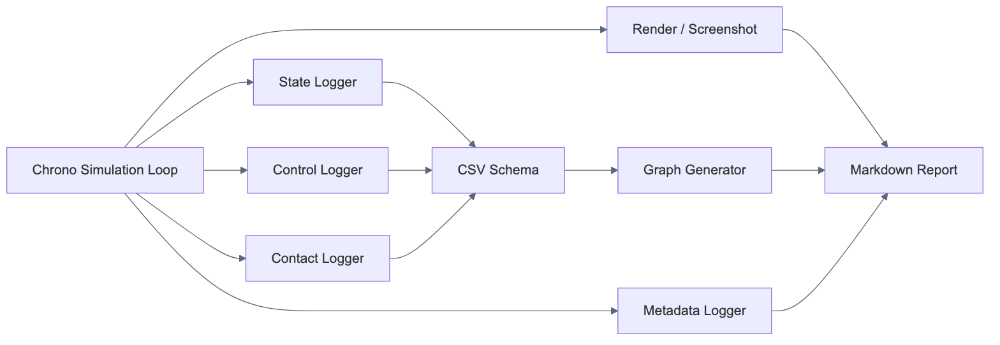
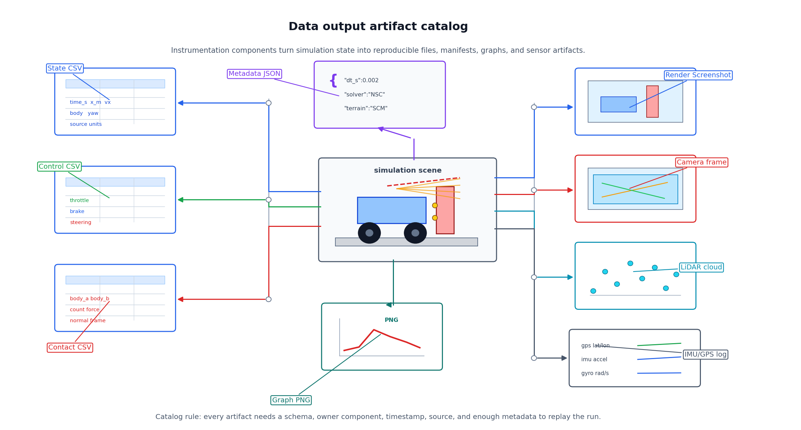
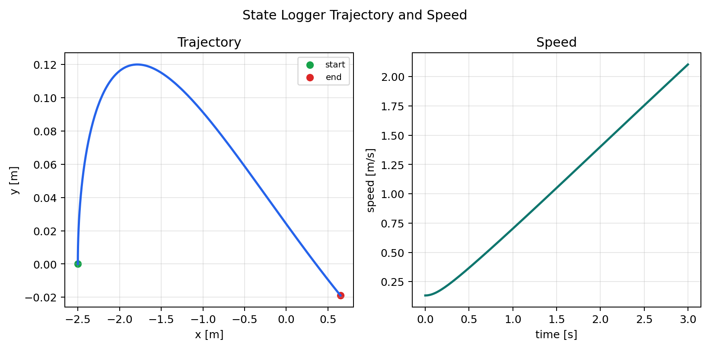
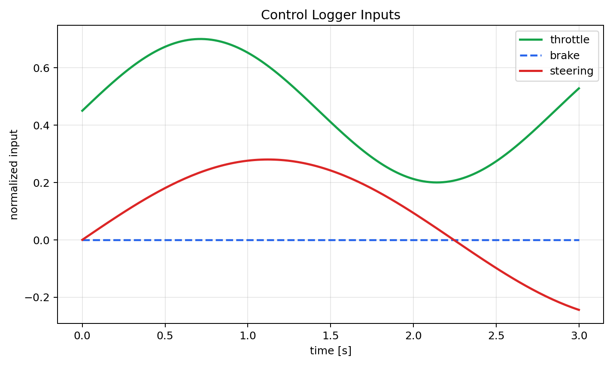
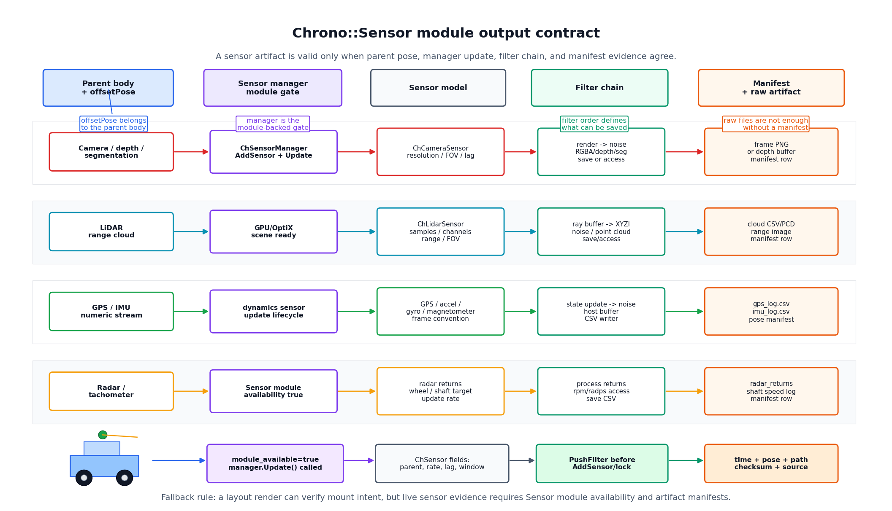

# 2.2.5 데이터 출력/시각화 Component 설계

데이터 출력/시각화 Component는 시뮬레이션 결과를 후처리 단계가 읽을 수 있는 형태로 바꾸는 부품이다. Chrono 시뮬레이션은 화면에서 움직이는 장면만으로 끝나면 재현과 비교가 어렵다. 따라서 State Logger, Control Logger, Contact Logger, CSV Schema, 메타데이터 Logger, Graph Generator, Render/Screenshot Component를 설계 단계에서 함께 정해야 한다.

이 절에서는 시뮬레이션 결과를 상태 로그, 제어 입력 로그, 접촉 로그, 메타데이터, 그래프, 렌더링 자료로 구조화한다. 데이터 출력 Component는 단순한 저장 기능이 아니라, System 단계에서 여러 실험을 비교하고 재현하기 위한 공통 인터페이스 역할을 한다.

## 2.2.5.1 데이터 흐름



*그림 2.2.5-1. 시뮬레이션 상태, 제어 입력, 접촉 정보, 메타데이터가 CSV/그래프/렌더/센서 산출물로 저장되는 흐름*

## 2.2.5.2 Component 요약 표

| Component | 선택 기준 | 주요 API/모듈 | 조정 변수 | 확인 산출물 |
| --- | --- | --- | --- | --- |
| State Logger | 위치, 속도, 자세처럼 모든 실험에서 비교할 기본 상태가 필요할 때 | body getter, `GetPos`, `GetPosDt`, CSV writer | 기록 대상, 샘플링 간격, 좌표계, 단위 | `*_state_log.csv`, trajectory graph |
| Control Logger | 결과의 원인이 되는 throttle, brake, steering, torque를 남겨야 할 때 | driver input, motor command, CSV writer | 입력 범위, 명령 주기, torque/speed mode | `*_control_log.csv`, input graph |
| Contact Logger | 접촉력, 접촉 개수, body pair를 후처리해야 할 때 | contact reporter, force query, CSV writer | force threshold, 대상 pair, force component | `*_contact_probe.csv`, force graph |
| Logger Timebase / Sampling | state/control/contact/sensor가 서로 다른 주기로 기록될 때 | simulation clock, `step_index`, sensor update rate | sample rate, resampling, dropped row policy | logger timebase manifest |
| CSV Schema | 여러 실험과 팀원이 같은 컬럼으로 데이터를 비교해야 할 때 | `csv.DictWriter`, schema table | 컬럼명, 단위, precision, 누락값 표기 | 단위 포함 CSV, schema 표 |
| 메타데이터 Logger | 실험 조건을 재현 가능하게 남겨야 할 때 | JSON writer, Markdown table, run config | run id, timestep, solver, seed, component parameter | JSON/Markdown 메타데이터 |
| Chrono Native Output | Chrono subsystem output database를 그대로 보존해야 할 때 | `ChOutput`, `ChOutputASCII`, `ChOutputHDF5`, Vehicle subsystem `Output` | output type/mode, frame id, enabled subsystem | output database manifest |
| Checkpoint / Replay | state 재시작이나 body/shape snapshot이 필요할 때 | `ChCheckpoint`, checkpoint utilities | checkpoint path/hash, restore assumptions | checkpoint manifest |
| Graph Generator | CSV를 보고서용 그래프로 변환해야 할 때 | `matplotlib`, `pandas` 또는 표준 CSV reader | 축 단위, smoothing, event marker, legend | PNG graph |
| Render/Screenshot | Component 배치와 형상을 시각 자료로 검증해야 할 때 | VSG/Irrlicht screenshot, matplotlib render | camera pose, 색, 투명도, 해상도 | render image |
| Sensor Logger | camera/LiDAR/GPS/IMU 데이터를 System 출력으로 확장할 때 | Chrono Sensor module, image/point cloud/IMU writer | sensor pose, update rate, resolution, noise | image path, point cloud path, sensor CSV |
| Sensor Filter Chain | sensor buffer를 저장/접근/변환/노이즈 적용해야 할 때 | `ChFilterSave`, access filters, point cloud/noise filters | filter order, output path, buffer type | saved image/point cloud, access buffer |

### Command와 Component 경계

이 절에서 `csv.DictWriter`, `matplotlib.plot`, `PushFilter`, `ChSensorManager.Update`, screenshot/save 호출은 2.1 Command 단계의 API 사용법에 해당한다. 2.2.5가 소유하는 것은 호출 순서 자체가 아니라 산출물 관리 기준이다. 즉 생성 주체, schema, timestamp, frame convention, 출처/검증 수준, 검증 산출물, 실패 조건, replay 메타데이터를 Component 단위로 고정한다.

| API/Command 관점 | 2.2.5 Component 관점 |
| --- | --- |
| `DictWriter.writerow(...)` | 어떤 schema/version/unit/source를 가진 row인지 |
| `matplotlib.plot(...)` | 어떤 CSV/hash/schema/axis/event marker에서 파생된 그래프 산출물인지 |
| `PushFilter(...)` | filter chain이 어떤 buffer를 어떤 원본 산출물/access buffer로 바꾸는지 |
| `ChSensorManager.Update()` | 센서 생애주기, scheduling, dropped/late frame 검증 자료 |
| `SaveScreenshot(...)` 또는 backend capture | camera pose, render backend, visible component ids, screenshot manifest |
| `ChOutput`/`ChCheckpoint` 생성 | output database type/mode, enabled subsystem, checkpoint restore 기준 |

### 출력 Component 선택 카탈로그

데이터 출력은 물리 Component가 만든 상태를 해석 가능한 산출물로 바꾸는 instrumentation Component이다. 따라서 "무엇을 저장할지"보다 "나중에 어떤 질문에 답할지"를 먼저 정해야 한다.

| 질문 | 우선 Component | 필수 컬럼/메타데이터 | 검증 자료 |
| --- | --- | --- | --- |
| 로버가 어디로 얼마나 빨리 움직였는가 | State Logger | `time_s`, pose, velocity, body name, unit | trajectory/speed graph |
| 왜 그 입력이 들어갔는가 | Control Logger | throttle, brake, steering, wheel speed, torque | input graph |
| 언제 무엇과 충돌했는가 | Contact Logger + Event Detector | body pair, contact count, force components, event label | contact force/count/timeline graph |
| 실험을 재현할 수 있는가 | 메타데이터 Logger | timestep, solver, gravity, terrain, seed, module status | 메타데이터 table/JSON |
| 보고서에서 형상을 설명할 수 있는가 | Render/Screenshot | camera pose, renderer, image path, callout target | component render |
| 실제 센서 데이터를 저장할 것인가 | Sensor Logger | sensor pose, update rate, resolution, noise, output path | image/point cloud/sensor CSV |
| 센서 buffer를 파일/코드 접근으로 바꿀 것인가 | Sensor Filter Chain | filter order, buffer type, output path, noise model | saved frame, point cloud, access buffer |

| 시각 자료 |
| --- |
|  |

*그림 2.2.5-2. 중앙의 simulation scene에서 상태/제어/접촉 CSV, 메타데이터 JSON, graph PNG, render screenshot, camera frame, LiDAR cloud, IMU/GPS log로 갈라지는 출력 산출물 카탈로그이다. 각 산출물은 "파일을 저장했다"는 사실만으로 충분하지 않고, 담당 Component, schema, timestamp, source, 메타데이터를 함께 가져야 재현 가능한 검증 자료가 된다.*

### Data/Visualization Component 관리 기준표

| Component | 소유 책임 | 의존 대상 | 산출물 | 주의/실패 조건 | 확장 경로 |
| --- | --- | --- | --- | --- | --- |
| State Logger | body/component 상태 sampling, 좌표계/단위 기준, sample rate | Runtime, Rover/Vehicle body IDs | state CSV, trajectory/speed graph | body name drift, 좌표계/단위 불일치, sample aliasing | chassis-only -> multi-body state registry |
| Control Logger | 명령 입력과 실제 적용 입력의 시간 이력, actuator 대상 | Driver, Motor/Powertrain, Runtime clock | control CSV, input graph | command와 actual 혼동, actuator target 누락 | driver input -> actuator feedback logger |
| Contact Logger | pair scope, contact force schema, event link | Collision Reporter, Terrain contact authority | contact probe CSV, force/count graph | body-total force와 pair force 혼동, stale contact CSV | single pair -> contact map/event bundle |
| Logger Timebase | 실행 clock, sample 주기, row 정렬, dropped sample 정책 | Runtime, Sensor Manager, Graph Generator | timebase manifest, sample audit | state/control/contact/sensor 시간축 drift, aliasing | implicit `time_s` -> explicit clock 기준 |
| CSV Schema Registry | canonical columns, units, optional fields, missing-value policy | all logger components | schema table, writer fieldnames | ad hoc columns, unit 없는 값, consumer breakage | local schema -> versioned schema registry |
| 메타데이터 Logger | 실행 재현 조건과 산출물 hash | Runtime Config, 모든 Component 카드 | `run_metadata.json`, manifest fields | 예시 데이터와 실제 실행 자료 혼동, config hash 누락 | manual 메타데이터 -> resolved config bundle |
| Chrono Native Output | Chrono output database and subsystem output enable policy | Runtime, Vehicle/Parsers, Data Writer Backend | ASCII/HDF5 output manifest, frame/series database | native output과 report CSV를 서로 다른 run으로 해석 | 예시 CSV -> 모듈 기반 output DB |
| Checkpoint/Replay | 재시작/debug snapshot과 body/shape checkpoint | Runtime, Collision Shape, 산출물 manifest | checkpoint file/hash, restore notes | checkpoint를 validation graph로 과대 해석 | one-shot run -> replayable state bundle |
| Graph Generator | CSV-to-PNG transform and interpretation policy | CSV Schema, Matplotlib/Postprocess | graph PNG, graph manifest | stale CSV, smoothing hides event, axis unit 누락 | one-off graph -> manifest 기반 plot build |
| Render/Screenshot | camera pose, backend, image dimensions, 시각 검증 자료 | VSG/Irrlicht/개념 렌더, Component scene | render PNG, screenshot manifest | camera pose 미기록, render와 run state 불일치 | static render -> replayable frame capture |
| Sensor Logger | sensor timestamp, pose, raw 산출물 색인 | Sensor Manager, Sensor Filter Chain | image/point cloud/GPS/IMU manifest | dropped frames, lag/collection window 누락 | layout render -> 모듈 기반 sensor dataset |

### 검증 수준 / 재현성 기준표

| 산출물 계열 | 예시 경로 | 생성 주체 | `source` / 검증 수준 | 재현성 필수 항목 |
| --- | --- | --- | --- | --- |
| 개념 렌더 | `images/renders/data_visualization_artifact_catalog.png` | 이미지별 렌더 스크립트 | 개념 렌더 | 스크립트 경로, 이미지 hash, 설계 의도 |
| 예시 CSV | `outputs/csv/data_visualization_state_log.csv` | data visualization 생성기 | PyChrono를 사용할 수 없는 환경에서 만든 대체 예시 | run id, script, source, schema version, CSV hash |
| PyChrono 실행 데이터 | 로컬 Chrono 실행에서 나온 state/control/contact CSV | PyChrono를 import한 Component 생성기 | `pychrono` | Chrono version, modules, dt, solver/contact method, config hash |
| 연결 Component 그래프 | `images/graphs/collision_contact_force_graph.png` | collision/contact graph 생성기 | 연결된 CSV에서 파생 | input CSV path/hash, graph script, axis units, event marker |
| Sensor 모듈 출력 | camera/LiDAR/GPS/IMU 산출물 | Chrono::Sensor manager + filters | 모듈 기반 검증 | sensor module availability, filter chain id, 원본 산출물 checksum, dropped-frame flag |
| 보고서 묶음 | Markdown + image + CSV + 메타데이터 | README/run-all pipeline | 보고서 조립 산출물 | README mapping row, 생성 스크립트, 산출물 색인, git revision |

### 문서 간 연결 관계

| 연결 문서 | 2.2.5가 받는 정보 | 2.2.5가 제공하는 정보 |
| --- | --- | --- |
| `2.2.1` Runtime/Config | `dt_s`, solver/timestepper, contact method, module availability, seed, 대체/예시 표기 기준, resolved config hash | run 메타데이터, 산출물 hash manifest, 검증 수준 |
| `2.2.2` Rover/Vehicle | chassis/body/control id, wheel/tire/track 이름, sensor mount id, actuator command | state/control CSV, trajectory/input graph, sensor pose manifest |
| `2.2.3` Terrain | terrain component id, query/contact 권한, `terrain_mu_query`, terrain probe schema | terrain graph link, terrain probe manifest, run bundle의 terrain 메타데이터 |
| `2.2.4` Collision/Contact | contact/event/debug schema, body pair filter, contact method/backend | contact graph link, event timeline link, contact 산출물 색인 |
| `2.2.5` Data/Visualization | schema registry, 메타데이터, graph/render/sensor 관리 기준 | 보고서용 산출물 묶음과 재현성 검증 자료 |

## 2.2.5.3 State Logger Component

State Logger는 body의 위치, 속도, 자세, 접촉력을 시간별로 기록한다. Chassis, wheel, obstacle처럼 움직이는 body는 모두 State Logger 대상이 될 수 있지만, 본 구성에서는 Chassis를 기준 body로 두어 로버 전체 거동을 대표하게 했다.

| 컬럼 | 단위 | 설명 |
| --- | ---: | --- |
| `run_id`, `scenario_id` | - | 같은 run/bundle과 scenario를 묶는 key |
| `schema_id` | - | `data.state_log.v1` 같은 machine-readable schema version |
| `time_s` | s | 시뮬레이션 시간 |
| `step_index` | - | dynamics/logger row 정렬용 step 번호 |
| `component_id`, `body_role` | - | 카탈로그 component와 body 역할 |
| `body_name` | - | 기록 대상 body 이름 |
| `x_m`, `y_m`, `z_m` | m | 위치 |
| `vx_mps`, `vy_mps`, `vz_mps` | m/s | 선속도 |
| `roll_rad`, `pitch_rad`, `yaw_rad` | rad | 자세. 단순 예제에서는 0으로 두고 Vehicle 확장에서 quaternion 변환 |
| `contact_force_N` | N | body에 작용한 접촉력 크기 |
| `source` | - | 데이터 생성 경로 |

아래 코드는 한 body의 위치와 속도를 CSV 행으로 변환하는 부분이다. 핵심은 Chrono 객체를 그대로 저장하지 않고, 단위가 붙은 숫자 컬럼으로 풀어 저장하는 것이다.

```python
pos = rover.GetPos()
vel = rover.GetPosDt()
x, y, z = vec_xyz(pos)
vx, vy, vz = vec_xyz(vel)

writer.writerow({
    "run_id": run_id,
    "schema_id": "data.state_log.v1",
    "scenario_id": scenario_id,
    "time_s": f"{system.GetChTime():.3f}",
    "step_index": step_index,
    "component_id": "vehicle.chassis",
    "body_name": rover.GetName(),
    "body_role": "logged_chassis",
    "x_m": f"{x:.5f}",
    "y_m": f"{y:.5f}",
    "z_m": f"{z:.5f}",
    "vx_mps": f"{vx:.5f}",
    "vy_mps": f"{vy:.5f}",
    "vz_mps": f"{vz:.5f}",
    "roll_rad": "0.00000",
    "pitch_rad": "0.00000",
    "yaw_rad": "0.00000",
    "contact_force_N": f"{contact_force:.5f}",
    "source": source,
})
```

`vec_xyz`는 PyChrono 버전에 따른 `vec.x`/`vec.x()` 접근 차이를 피하기 위해 사용하는 helper이다.

| 그래프 |
| --- |
|  |

*그림 2.2.5-3. `data_visualization_state_log.csv`에서 위치/속도 값을 읽어 궤적과 속도 변화를 함께 그린 결과이다. State Logger는 모든 System 실험의 공통 데이터 인터페이스가 된다.*

실행 코드: `code/data_visualization/generate_data_visualization_components.py`
CSV: `outputs/csv/data_visualization_state_log.csv`

## 2.2.5.4 Control Logger Component

Control Logger는 시뮬레이션에 넣은 throttle, brake, steering, wheel speed, torque command를 기록한다. 결과 그래프만 보면 로버가 왜 빨라졌는지, 왜 멈췄는지, 왜 회전했는지 알기 어렵다. Control Logger는 결과를 해석하는 원인 데이터이다.

| 컬럼 | 단위/범위 | 설명 |
| --- | ---: | --- |
| `run_id`, `scenario_id` | - | state/control/contact log를 같은 run으로 묶는 key |
| `schema_id` | - | `data.control_log.v1` 같은 machine-readable schema version |
| `time_s` | s | 입력이 적용된 시간 |
| `step_index` | - | state row와 command row를 맞추는 index |
| `component_id` | - | command schema를 소유하는 Global Component 카탈로그 id |
| `catalog_component_id` | - | `component_id`와 같은 카탈로그 owner; instance id와 혼동하지 않기 위한 중복 안전 필드 |
| `controller_id` | - | `driver.controller`, path follower, replay source 같은 concrete command producer id |
| `target_component_id` | - | 명령이 실제 물리 출력으로 전달되는 대상 Component, 예: `vehicle.drive` |
| `actuator_instance_id` | - | torque/speed/brake 같은 물리 actuator instance id |
| `ownership_role` | - | command owner와 physical target이 한 row에 같이 있을 때의 해석 규칙 |
| `command_type` | - | normalized driver input, actuator command, replay command 같은 command family |
| `command_source` | - | driver, scripted profile, controller, replay input 등 명령 출처 |
| `throttle` | 0~1 | 구동 입력 |
| `brake` | 0~1 | 제동 입력 |
| `steering` | -1~1 또는 rad | 조향 입력 |
| `drive_torque_Nm` | N m | 구동 토크 추정 또는 명령값 |
| `wheel_speed_radps` | rad/s | speed motor 또는 wheel angular speed |
| `source` | - | 실행 출처 |

아래 코드는 제어 입력과 그 입력에서 파생되는 wheel speed/torque 명령을 같은 시간축에 저장한다. 결과 그래프만으로는 원인을 알기 어려우므로 control log는 state log와 같은 `time_s` 기준을 사용한다.

```python
wheel_speed = 8.0 + 5.0 * throttle
control_writer.writerow({
    "run_id": run_id,
    "schema_id": "data.control_log.v1",
    "scenario_id": scenario_id,
    "time_s": f"{t:.3f}",
    "step_index": step_index,
    "component_id": "core.function_input",
    "catalog_component_id": "core.function_input",
    "controller_id": "driver.controller",
    "target_component_id": "vehicle.drive",
    "actuator_instance_id": "actuator.drive_motor.demo",
    "ownership_role": "command_owner_with_physical_target",
    "command_type": "normalized_driver_inputs",
    "command_source": "analytic_driver_profile",
    "throttle": f"{throttle:.5f}",
    "brake": f"{brake:.5f}",
    "steering": f"{steering:.5f}",
    "drive_torque_Nm": f"{120.0 * throttle:.5f}",
    "wheel_speed_radps": f"{wheel_speed:.5f}",
    "source": source,
})
```

`component_id`/`catalog_component_id`는 command schema의 소유자를 뜻한다. `drive_torque_Nm`이나 `wheel_speed_radps`처럼 물리 actuator로 넘어가는 값은 `target_component_id`와 `actuator_instance_id`를 같이 읽어야 하며, 이 row 자체가 `vehicle.drive`의 state 소유 책임을 가져간다는 뜻은 아니다.

| 그래프 |
| --- |
|  |

*그림 2.2.5-4. throttle, brake, steering 입력을 시간축에서 함께 보여준다. 주행 결과를 해석할 때 "차량이 왜 그렇게 움직였는가"를 설명하는 근거가 된다.*

CSV: `outputs/csv/data_visualization_control_log.csv`

## 2.2.5.5 Contact Logger Component

Contact Logger는 충돌/접촉 Component와 데이터 출력 Component를 연결한다. 같은 contact force라도 "전체 body에 작용한 총 접촉력"인지, "특정 body pair 사이의 접촉력"인지 구분해야 한다.

| 컬럼 | 단위 | 설명 |
| --- | ---: | --- |
| `time_s` | s | 시뮬레이션 시간 |
| `body_a`, `body_b` | - | 접촉 pair 이름 |
| `contact_count` | - | 접촉점 또는 접촉 pair 개수 |
| `contact_fx_N`, `contact_fy_N`, `contact_fz_N` | N | 접촉력 성분 |
| `contact_force_N` | N | 접촉력 크기 |
| `source` | - | reporter, body total force, deterministic example 등 데이터 출처 |

아래 코드는 Contact Reporter에서 얻은 힘 성분을 logger 행으로 넘기는 부분이다. `force_norm`은 그래프용 크기이고, `contact_fx_N` 등 성분은 디버그 벡터와 방향을 맞춰 보는 데 필요하다.

```python
force_norm = (fx * fx + fy * fy + fz * fz) ** 0.5
contact_writer.writerow({
    "time_s": f"{system.GetChTime():.4f}",
    "body_a": "rover",
    "body_b": "obstacle",
    "contact_count": contact_count,
    "contact_force_N": f"{force_norm:.5f}",
    "contact_fx_N": f"{fx:.5f}",
    "contact_fy_N": f"{fy:.5f}",
    "contact_fz_N": f"{fz:.5f}",
    "source": "pair_contact_reporter_world",
})
```

| 연결 그래프 |
| --- |
|  |

*그림 2.2.5-5. 2.2.4 충돌/접촉 Component에서 생성한 linked output이다. 데이터 출력 절에서는 이 그래프를 Contact Logger CSV가 후처리 그래프로 연결되는 예로 사용한다.*

| 연결 그래프 |
| --- |
|  |

*그림 2.2.5-6. 2.2.4 충돌/접촉 Component에서 가져온 linked output이다. 접촉점/접촉 pair 개수 변화로 collision shape 안정성을 확인한다.*

| 연결 그래프 |
| --- |
|  |

*그림 2.2.5-7. 2.2.4 충돌/접촉 Component에서 가져온 linked output이다. `contact_fx_N`, `contact_fy_N`, `contact_fz_N` 성분을 분리해 접촉력 방향을 확인한다.*

CSV: `outputs/csv/collision_contact_probe.csv`

## 2.2.5.6 CSV Schema Component

CSV는 Component 간 약속이다. 실험이 많아질수록 "나중에 대충 맞추기"가 매우 어려워지므로, Component 단계에서 컬럼명과 단위를 정해야 한다.

| 원칙 | 설명 |
| --- | --- |
| 단위 포함 | `x` 대신 `x_m`, `speed` 대신 `speed_mps`처럼 컬럼명에 단위를 붙인다. |
| 식별자 prefix | 가능한 CSV는 `run_id`, `schema_id`, `scenario_id`를 앞쪽에 두어 bundle과 schema version을 먼저 판별한다. |
| 시간 기준 통일 | time-series CSV는 `time_s`와 `step_index`를 포함한다. surface sampling처럼 시간축이 없는 probe는 `sample_index`를 사용하고 예외를 명시한다. |
| 대상 이름 포함 | 다중 로버 실험을 위해 `body_name`, `component_name`, `body_a`, `body_b`를 둔다. |
| 원본 보존 | 그래프용으로 가공하기 전 raw CSV를 `outputs/csv/`에 저장한다. |
| 결측값 처리 | 센서가 없는 환경에서는 빈 문자열보다 `source` 또는 `available=false`를 명시한다. |

아래처럼 schema를 먼저 코드에 고정해 두면 writer, 그래프 생성기, 문서 표가 같은 컬럼 목록을 공유한다. Component가 늘어날수록 문자열을 흩뿌리는 방식보다 이 구조가 유지보수에 유리하다.

```python
import csv

STATE_SCHEMA = [
    "run_id", "schema_id", "scenario_id", "time_s", "step_index",
    "component_id", "body_name", "body_role",
    "x_m", "y_m", "z_m",
    "vx_mps", "vy_mps", "vz_mps",
    "roll_rad", "pitch_rad", "yaw_rad",
    "contact_force_N", "source",
]

writer = csv.DictWriter(handle, fieldnames=STATE_SCHEMA)
writer.writeheader()
```

실행 산출물:

| CSV | 연결 그래프 |
| --- | --- |
| `outputs/csv/data_visualization_state_log.csv` | `images/graphs/data_visualization_state_trajectory.png` |
| `outputs/csv/data_visualization_control_log.csv` | `images/graphs/data_visualization_control_inputs.png` |
| `outputs/csv/collision_contact_probe.csv` | `images/graphs/collision_contact_force_graph.png`, `images/graphs/collision_contact_count_graph.png`, `images/graphs/collision_contact_force_components_graph.png` |
| `outputs/csv/environment_terrain_height_friction_sinkage.csv` | `images/graphs/terrain_height_sinkage_profile.png`, `images/graphs/terrain_contact_material_friction_map.png` |

이 절의 `data_visualization_*` CSV는 표준 Logger 형식을 설명하는 예시이고, `rover_vehicle_chassis_probe.csv`, `environment_terrain_contact_probe.csv`, `environment_terrain_height_friction_sinkage.csv`는 특정 Component를 설명하기 위한 축약형 probe schema이다. 축약형 probe는 필요한 컬럼만 남길 수 있지만, 보고서에서는 데이터 출처, 단위, 대상 Component를 명시해 표준 schema와 혼동하지 않게 한다.

### 표준 Logger Schema 정리

| Schema | 담당 Component | 필수 컬럼 | 선택/확장 컬럼 | 좌표계/단위 | 생성 주체 | 활용 대상 |
| --- | --- | --- | --- | --- | --- | --- |
| `state_log_schema` | State Logger | `run_id`, `schema_id`, `scenario_id`, `time_s`, `step_index`, `component_id`, `body_name`, `body_role`, `x_m`, `y_m`, `z_m`, `vx_mps`, `vy_mps`, `vz_mps`, `source` | quaternion `qx/qy/qz/qw`, angular velocity, contact force, frame name | world frame 또는 명시한 body frame, SI 단위 | rover/vehicle/core physics 생성기 | trajectory graph, 메타데이터 bundle |
| `control_log_schema` | Control Logger | `run_id`, `schema_id`, `scenario_id`, `time_s`, `step_index`, `component_id`, `catalog_component_id`, `controller_id`, `command_type`, `command_source`, `throttle`, `brake`, `steering`, `source` | 명령값과 실제 torque/speed, actuator id, saturation flag | 정규화 입력 또는 명시적 rad/Nm/radps | driver/controller/powertrain component | control graph, 원인-결과 분석 |
| `contact_probe_schema` | Contact Logger | 2.2.4 contact schema: pair, count, point, normal, distance/penetration, force components, frame, method/backend, source | material ids, filter rule, aggregation, event link | world/contact frame 명시 | contact reporter | force/count/component graph |
| `terrain_probe_schema` | Terrain/Terrain Logger | `terrain_component_id`, `terrain_type`, `x_m`, `y_m`, `height_m`, `normal_*`, `terrain_mu_query`, `source` | sinkage, rut depth, soil/particle/mesh 메타데이터 | 필요한 경우 world frame과 terrain-local frame 병기 | terrain component | height/sinkage/friction graph |
| `sensor_manifest_schema` | Sensor Logger | `run_id`, `time_s`, `sensor_name`, `sensor_type`, `component_id`, `catalog_component_id`, `instance_id`, `frame_index`, `output_path`, `available`, `source` | pose, layout component id, filter chain, checksum, dropped-frame reason | sensor frame과 parent/world pose 명시 | sensor manager/filter chain | dataset loader/보고서 묶음 |
| `artifact_manifest_schema` | 메타데이터 Logger | `run_id`, `artifact_path`, `artifact_type`, `producer_script`, `input_path`, `input_hash`, `artifact_hash`, `created_time`, `evidence_level` | image size, graph axis, camera pose, backend, module availability | path/hash 메타데이터 | run-all/report build | 재현성 점검 |

### 데이터 Writer 방식 카탈로그

Data Writer는 단순한 Python helper가 아니라 출력 방식을 선택하고 관리하는 Component이다. 보고서 예제는 Python `csv.DictWriter`로 schema와 그래프 연결을 확인하지만, 실제 Chrono 실행에서는 Chrono 기본 writer와 Postprocess writer도 같은 카탈로그 안에서 비교해야 한다.

| Writer 방식 | 적합한 사용 | Component가 기록할 정보 | 검증 경계 |
| --- | --- | --- | --- |
| Python CSV 예시 | PyChrono가 없거나 보고서 schema/graph 연결만 확인할 때 | schema id, fieldnames, units, producer script, 생성 방식 | 물리 검증 자료가 아니라 예시 데이터임을 `source`에 표시 |
| `chrono::utils::ChWriterCSV` | C++/Chrono utility에서 작은 ASCII table을 직접 쓸 때 | delimiter, header, file path, schema id, units, row count | delimiter/header와 report schema가 일치해야 함 |
| `ChOutputASCII` / `ChOutputHDF5` | body, marker, shaft, joint, motor, load 같은 Chrono model state를 frame/series database로 저장할 때 | output type, output mode `FRAMES`/`SERIES`, sections written, frame id, time | component별 schema와 HDF5/ASCII section names를 매핑해야 함 |
| `ChCheckpointASCII` / shape checkpoint utilities | restart/debug 또는 body/collision shape checkpoint가 필요할 때 | checkpoint path/hash, body count, collision shape count, restore assumptions | checkpoint는 보고서 그래프가 아니라 재시작/디버깅 산출물 |
| `ChGnuPlot` | Chrono C++ 쪽에서 GNUplot script/PNG/PDF/EPS를 만들 때 | input vector/file, gpl script path, terminal/output format, axis labels | 생성된 plot도 matplotlib output과 같은 graph manifest가 필요함 |
| Local matplotlib graph | Python 보고서 생성 과정에서 CSV를 PNG로 변환할 때 | input CSV/hash, axis units, smoothing, event markers, dpi/backend | 오래된 그래프 사용을 막기 위해 input hash와 producer script를 기록 |

| Writer manifest 항목 | 필요한 값 |
| --- | --- |
| `writer_backend` | `python_csv`, `ChWriterCSV`, `ChOutputASCII`, `ChOutputHDF5`, `ChGnuPlot`, `matplotlib` |
| `schema_id`, `schema_version`, `unit_policy` | CSV/HDF5/plot consumer가 해석할 schema와 단위 |
| `output_mode` | HDF5/ASCII는 `FRAMES` 또는 `SERIES`, CSV는 row stream, graph는 image export |
| `path`, `artifact_hash`, `input_hash` | 파일 무결성과 stale 산출물 검증 |
| `source`, `evidence_level`, `generation_note` | 실제 Chrono 출력인지, 설명용 예시 데이터인지 구분 |

### Logger 시간 기준 / 샘플링 기준

State, control, contact, terrain, sensor logger는 같은 `time_s`를 쓰더라도 실제 sample cadence가 다를 수 있다. Chrono dynamics는 더 작은 timestep으로 진행하고 Sensor module은 별도 update rate, lag, collection window, render thread를 가질 수 있으므로, 데이터 카탈로그는 row 값뿐 아니라 "언제 샘플링했고 어떤 row가 누락되었는가"를 별도 Component로 기록한다.

| 항목 | Component 관리 기준 |
| --- | --- |
| `clock_source` | `ChSystem::GetChTime`, controller command time, sensor ready time, postprocess export time 중 어느 기준인지 |
| `step_index`, `substep_index` | dynamics step과 logger row를 재연결하기 위한 index |
| `logger_sample_period_s` | state/control/contact logger가 몇 step마다 기록되는지 |
| `sensor_update_rate_hz` | sensor family별 update rate; dynamics `dt_s`와 별도 |
| `sensor_lag_s`, `collection_window_s` | frame이 실제 장면을 수집한 시간 범위와 사용자가 읽을 수 있게 되는 지연 |
| `row_ready_time_s` | asynchronous sensor/filter output이 실제로 manifest에 기록된 시간 |
| `dropped_sample`, `drop_reason` | late frame, missing filter, unavailable module, skipped logger interval |
| `resampling_policy` | graph에서 raw rows, nearest, hold-last, interpolation, moving average 중 무엇을 썼는지 |
| `alignment_key` | `run_id + sequence_id + frame_index` 또는 `run_id + step_index` |

| 주의/실패 조건 | 예시 증상 | 필요한 확인 자료 |
| --- | --- | --- |
| state/control drift | throttle event가 state response보다 늦거나 빠르게 보임 | shared `step_index`, command application time, state sample time |
| sensor aliasing | camera/LiDAR frame이 충돌 이벤트를 건너뜀 | update rate, collection window, event marker alignment |
| stale access buffer | controller가 이전 sensor frame을 읽음 | `row_ready_time_s`, latest buffer timestamp, dropped/stale flag |
| graph resampling 산출물 | force peak나 steering pulse가 smoothing으로 사라짐 | graph manifest의 resampling/smoothing policy |

### Chrono 기본 출력 / Checkpoint 카탈로그

Python CSV 예시는 보고서의 schema 연결을 확인하기 위한 산출물이다. System 단계에서 실제 실행을 재현하려면 Chrono 기본 output database와 checkpoint도 별도 Component로 다뤄야 한다. `ChOutput` 계열은 ASCII/HDF5 output type과 `FRAMES`/`SERIES` mode를 가지며, Vehicle/FEA/Parser 계열 subsystem은 자신의 `Output(...)`을 통해 database에 Component 상태를 기록할 수 있다. `ChCheckpoint`와 body/shape checkpoint utility는 재시작과 디버깅을 위한 자료이지, 그래프용 측정 CSV를 대체하지 않는다.

| Component | 소유 책임 | Chrono class/hook | 기록할 정보 | 산출물 |
| --- | --- | --- | --- | --- |
| Chrono 기본 output database | output type/mode와 database path | `ChOutput`, `ChOutputASCII`, `ChOutputHDF5` | `output_type`, `output_mode`, schema/section map, frame/series mode | `chrono_output_database_manifest.json` |
| Vehicle subsystem output | enabled subsystem output과 frame counter | Vehicle subsystem `Output(frame, database)` patterns | vehicle id, subsystem ids, output enable flags, output step, frame id | native vehicle output database |
| YAML/parser output | spec 기반 output policy | parser output parameters / `SaveOutput(frame)` | source YAML hash, output FPS, output directory, output type/mode | parser output manifest |
| Checkpoint database | replay/restart state snapshot | `ChCheckpoint`, `ChCheckpointASCII` | checkpoint time, body/item count, restore preconditions | `checkpoint_manifest.json` |
| Body/shape checkpoint | collision/debug shape snapshot | body/collision shape checkpoint utilities | body count, shape count, material ids, shape policy | body shape checkpoint CSV |

| 기본 출력 사용 시 주의점 | 이유 |
| --- | --- |
| Native output section name은 Component id와 다시 연결되어야 한다. | HDF5/ASCII database가 report CSV와 같은 body/subsystem을 뜻하는지 확인해야 한다. |
| Checkpoint는 측정 검증 자료가 아니다. | restart 가능성을 보여주지만 force/trajectory graph 해석을 대체하지 않는다. |
| Output enable flag는 run 메타데이터에 속한다. | vehicle subsystem output이 꺼져 있으면 database가 비어 있어도 failure가 아니라 configuration일 수 있다. |
| Parser/YAML output은 source hash를 보존해야 한다. | output database만으로는 어떤 model spec에서 나온 결과인지 재현할 수 없다. |

### Sensor Buffer / 산출물 Schema

Chrono Sensor output은 frame buffer, point cloud, GPS/IMU numeric buffer처럼 형태가 다르다. 따라서 공통 CSV 하나에 모든 값을 억지로 넣기보다, sensor manifest CSV가 frame/file 경로를 가리키고 sensor별 원본 산출물를 따로 두는 방식이 안전하다.

| Sensor output | Manifest/CSV 필드 | Raw 산출물 |
| --- | --- | --- |
| RGB Camera | `time_s`, `sensor_name`, `frame_index`, `width_px`, `height_px`, `image_path`, `hfov_rad`, `lens_model` | `camera/rgb/frame_000000.png` |
| Physics-based RGB Camera | `time_s`, `frame_index`, `image_path`, `aperture`, `exposure_s`, `iso`, `focus_dist_m`, `motion_blur` | physically parameterized camera frame |
| Depth Camera | `time_s`, `frame_index`, `width_px`, `height_px`, `depth_image_path`, `depth_unit`, `clip_near_m`, `max_range_m` | depth image or float buffer |
| Segmentation Camera | `time_s`, `frame_index`, `class_id_map`, `instance_id_map`, `segmentation_path` | semantic/instance segmentation image or buffer |
| Normal-map Camera | `time_s`, `frame_index`, `normal_map_path`, `frame`, `encoding` | normal image/buffer |
| LiDAR raw depth/intensity | `time_s`, `frame_index`, `horizontal_samples`, `vertical_channels`, `hfov_rad`, `vfov_rad`, `max_range_m`, `return_mode`, `range_intensity_path` | range/intensity buffer |
| LiDAR XYZI point cloud | `time_s`, `frame_index`, `point_cloud_path`, `points`, `filter_chain_id`, `noise_model` | `x_m,y_m,z_m,intensity` point cloud |
| GPS | `time_s`, `sensor_name`, `latitude`, `longitude`, `altitude_m`, `gps_reference`, `z_up_x_east_y_north`, `source` | GPS CSV row |
| IMU | `time_s`, `accel_x_mps2`, `accel_y_mps2`, `accel_z_mps2`, `gyro_x_radps`, `gyro_y_radps`, `gyro_z_radps`, `mag_x`, `mag_y`, `mag_z`, `sensor_frame` | accelerometer/gyroscope/magnetometer CSV rows |
| Radar | `time_s`, `range_m`, `azimuth_rad`, `elevation_rad`, `velocity_mps`, `amplitude`, `object_id`, `hfov_rad`, `vfov_rad` | radar return CSV/point cloud |
| Tachometer | `time_s`, `sensor_name`, `angular_velocity_radps`, `rpm`, `axis`, `target_body` | tachometer CSV row |

## 2.2.5.7 메타데이터 Logger Component

메타데이터 Logger는 CSV에는 매 step 반복해서 쓰기 애매한 실험 조건을 기록한다. 예를 들어 Chrono version, timestep, solver type, gravity, terrain type, soil parameter, renderer, 렌더링 환경을 기록한다.

| 항목 | 예 |
| --- | --- |
| simulation | timestep, duration, solver, collision system |
| environment | gravity, terrain type, friction, soil parameters |
| rover | mass, wheel radius, motor type, initial pose |
| output | CSV path, graph path, render path |
| platform | OS, Python version, Chrono modules, renderer |

외부 통합 Component를 사용하는 경우 메타데이터 Logger는 일반 simulation 조건 외에 adapter 계약도 함께 남긴다. 이 정보가 없으면 FMU, ROS topic, co-simulation node, CAD/STEP import가 어떤 좌표계와 시간축으로 Chrono Component에 연결되었는지 재현하기 어렵다.

| 메타데이터 field | 적용 대상 | 기록 내용 |
| --- | --- | --- |
| `extension_owner_card` | 모든 외부 통합 | 본문에서 소유 책임을 가진 Component 카드/절 이름 |
| `external_artifact_ref` | FMU, STEP, URDF/YAML, modal basis, co-sim config | 파일 경로, hash, format/schema version |
| `interface_map` | ROS, FMI, co-sim, modal boundary, asset import | 외부 이름/topic/variable/node가 Chrono Component/field에 매핑되는 규칙 |
| `sync_contract` | ROS, FMI, co-sim, sensor bridge | timestep, update rate, clock source, sync order, latency/대체 예시 |
| `frame_unit_transform` | CAD/STEP, ROS, sensor, co-sim, modal | unit conversion, axis convention, parent/local/world frame |

### Run 메타데이터 Schema

| Key | Owner | Source section | Example | Why it affects reproducibility |
| --- | --- | --- | --- | --- |
| `run_id`, `scenario_id` | 메타데이터 Logger | 2.2.5 | `chrono_component_demo_001` | 모든 CSV/graph/render를 같은 run으로 묶는다. |
| `chrono_version`, `build_hash` | Runtime Config | 2.2.1 | `10.0.0` or local build string | solver/contact/sensor behavior가 version/build에 따라 달라질 수 있다. |
| `enabled_modules` | Runtime Config | 2.2.1 | `Vehicle,VSG,Sensor` | 대체 예시인지 모듈 기반 output인지 판단한다. |
| `dt_s`, `duration_s`, `timestepper`, `solver_type` | Runtime Config | 2.2.1 | `0.002`, `ADMM`, `EulerImplicit` | state/contact/sensor sampling의 시간 기준이다. |
| `contact_method`, `collision_backend`, `envelope_m`, `margin_m` | Collision/Runtime | 2.2.4 | `NSC`, `Bullet`, `0.001`, `0.0005` | contact count/force/event가 backend와 tolerance에 민감하다. |
| `gravity_mps2`, `terrain_component_id`, `terrain_type` | Terrain/Environment | 2.2.3 | `[0,0,-9.81]`, `terrain_scm_01` | 상태/접촉/센서 결과의 물리 조건이다. |
| `rover_component_id`, `body_registry`, `sensor_mount_registry` | Rover/Vehicle | 2.2.2 | `rover_demo`, body id map | CSV의 body/component 이름을 재해석하게 해준다. |
| `resolved_config_hash`, `seed`, 대체 처리 정책 | Runtime Config | 2.2.1 | `sha256:...`, `42`, PyChrono 미사용 대체 예시 | 같은 입력과 대체 예시 조건인지 증명한다. |
| `artifact_hashes` | 메타데이터 Logger | 2.2.5 | `{csv: sha256, png: sha256}` | 그래프가 stale CSV에서 나온 것인지 검증한다. |

아래 코드는 CSV에 반복해서 쓰기 어려운 실험 조건을 JSON으로 남기는 형태이다. 나중에 같은 CSV를 다시 해석할 때 timestep, gravity, terrain이 무엇이었는지 확인할 수 있다.

```python
import json

metadata = {
    "timestep_s": 0.002,
    "duration_s": 5.0,
    "gravity_mps2": [0, 0, -9.81],
    "terrain": "RigidTerrain",
    "renderer": "VSG manual screenshot",
}

with open("run_metadata.json", "w", encoding="utf-8") as handle:
    json.dump(metadata, handle, indent=2)
```

## 2.2.5.8 Graph Generator Component

Graph Generator는 CSV를 읽어 궤적, 속도, 접촉력, 제어 입력을 이미지로 저장한다. macOS에서는 Irrlicht/VSG 창과 matplotlib 창이 충돌할 수 있으므로, 그래프 생성에는 창을 띄우지 않는 `Agg` backend를 사용하는 것이 안전하다.

아래 코드는 CSV 원본을 읽어 그래프 파일로 저장하는 최소 흐름이다. 보고서에서는 그래프 자체보다 축 단위, legend, 해석 문장이 같이 있어야 데이터 의미가 유지된다.

```python
import matplotlib
matplotlib.use("Agg")
import matplotlib.pyplot as plt
import numpy as np

data = np.genfromtxt("state_log.csv", delimiter=",", names=True)

fig, ax = plt.subplots(figsize=(8, 4.5))
ax.plot(data["x_m"], data["y_m"], linewidth=2)
ax.set_xlabel("x [m]")
ax.set_ylabel("y [m]")
ax.set_title("Rover trajectory")
ax.grid(True, alpha=0.3)
fig.savefig("trajectory.png", dpi=180)
```

| 그래프 작성 원칙 | 설명 |
| --- | --- |
| 축 단위 표시 | `time [s]`, `force [N]`, `speed [m/s]`처럼 명확히 표시 |
| 비교 대상 명시 | 로버 이름, 지형 이름, material 이름을 legend에 표시 |
| raw CSV 보존 | 그래프 이미지와 원본 CSV를 함께 보존 |
| 해석 문장 포함 | 그래프 아래에 peak, steady state, first contact 등 의미를 설명 |

### Graph 산출물 Manifest

| 항목 | 기록 내용 |
| --- | --- |
| `artifact_path` | 생성된 PNG 경로 |
| `input_path`, `input_hash` | 그래프가 읽은 원본 CSV와 hash |
| `producer_script` | 그래프 생성 스크립트 경로 |
| `schema_id` | 입력 CSV가 따르는 schema |
| `source`, `row_count` | 입력 CSV의 실행 출처와 row 수 |
| `axis_units` | x/y축 단위와 컬럼명 |
| `smoothing_policy` | raw, moving average, resample 등 적용 여부 |
| `event_markers` | first contact, mode switch 같은 marker source |
| `dpi`, `figsize`, `backend` | 보고서 재생성을 위한 rendering 조건 |
| `source_run_id` | 원 simulation run id |

### Postprocess / Gnuplot Backend 관리 기준

Matplotlib graph는 현재 Python report build의 기본 경로이고, Chrono Postprocess의 `ChGnuPlot`은 C++/Chrono side에서 `.gpl` script와 external data plot을 만들 때 쓰는 별도 backend이다. 공식 `ChGnuPlot`은 system shell의 GNUplot 실행 파일에 의존하므로, GNUplot이 없을 때 "조용히 산출물이 없는" 실패를 manifest로 잡아야 한다.

| `gnuplot_plot_manifest.csv/json` field | 의미 |
| --- | --- |
| `plot_backend` | `ChGnuPlot`, local `matplotlib`, notebook/export script 등 |
| `gpl_script_path`, `gpl_script_hash` | generated GNUplot script와 hash |
| `gnuplot_available`, `gnuplot_version` | executable availability and version gate |
| `terminal`, `output_format` | PNG, PDF, EPS, interactive/persist terminal 등 |
| `input_dat_path`, `input_dat_hash` | `Plot(datfile, colX, colY, ...)`가 읽은 source data |
| `axis_labels`, `legend_policy`, `subplot_layout` | `SetLabelX/Y`, legend, subplot 관리 기준 |
| `output_path`, `artifact_hash` | 실제 생성된 그래프 산출물 |
| `failure_mode` | missing executable, silent no-output, stale `.dat`, 미지원 terminal |

## 2.2.5.9 Render/Screenshot Component

Render/Screenshot Component는 시뮬레이션 장면을 시각 자료로 남기는 기능이다. Component 단계에서는 렌더링 결과가 단순 장식이 아니라, 부품의 위치, 형상, 상대 좌표계, 접촉 상태를 검증하는 자료로 쓰인다.

| 경로 | 설명 | 역할 |
| --- | --- | --- |
| Chrono VSG | Vulkan Scene Graph 기반 렌더러 | 실제 시뮬레이션 장면을 고품질로 확인 |
| Chrono Irrlicht | OpenGL 기반 렌더러 | 기본 시각화와 디버깅 화면 확인 |
| 개념 렌더 | matplotlib 3D 도식 | Component 구조 설명용 보조 이미지 |
| Graph image | CSV 기반 그래프 | 물리 결과 검증 |

### Visualization Backend 선택 기준표

렌더링은 "화면에 보였다"가 아니라 어떤 backend가 어떤 산출물을 책임지는지로 기록한다. 아래 예시의 `render_backend.SaveScreenshot(...)`는 backend에 종속되지 않는 의사 코드이며, 실제 구현에서는 VSG/Irrlicht/offline writer의 구체 API 이름과 screenshot path를 메타데이터에 남겨야 한다.

| Backend/Component | 적합한 사용 | Component가 기록할 메타데이터 | 산출물 관리 기준 |
| --- | --- | --- | --- |
| `ChVisualSystemVSG` | 실행 중 상호작용 시각화, Vulkan 기반 화면, debug overlay | VSG 모듈 사용 가능성, 카메라, 목표 FPS, 보이는 Component id | screenshot/frame capture manifest 또는 수동 렌더 검증 자료 |
| Irrlicht visual system | 기존 Vehicle demo와 디버깅 화면 확인 | Irrlicht 사용 가능성, 카메라, GUI/debug 설정 | screenshot manifest, 대체/디버그 상태 |
| Vehicle visualization wrappers | Vehicle demo의 HUD, driver view, contact/terrain 표시 | vehicle model id, terrain id, camera mode, 표시된 contact/debug layer | vehicle Component id와 연결된 렌더 검증 자료 |
| `WriteVisualizationAssets` / POV-Ray / Blender | 고품질 offline frame, asset export, 재현 가능한 scene 파일 | output directory, frame index, visual asset source, exporter version | offline render/export manifest |
| `ChGnuPlot` / local matplotlib | CSV/probe 데이터를 그래프로 변환 | input CSV/hash, axes, smoothing/event marker policy | graph manifest와 PNG/PDF 산출물 |

### Runtime Visualization과 Offline Export 구분 기준

Runtime visualizer는 실행 중 장면을 확인하는 Component이고, offline export는 같은 simulation frame을 재생성 가능한 외부 renderer 입력으로 남기는 Component이다. 둘을 같은 screenshot으로 취급하면 재현성과 검증 수준이 흐려진다.

| Component | 소유 책임 | 필요한 메타데이터 | 주의/실패 조건 |
| --- | --- | --- | --- |
| `visual.runtime.vsg` | `ChVisualSystemVSG` 연결, camera, light, background, visible asset | VSG 사용 가능성, window/camera parameter, light/shadow 설정, visible component id | screenshot은 있지만 어떤 camera/backend인지 알 수 없음 |
| `visual.runtime.irrlicht` | legacy/debug view, vehicle HUD/debug layer | Irrlicht 사용 가능성, GUI/debug flag, vehicle app wrapper, contact/terrain overlay 상태 | VSG와 Irrlicht render capability를 혼동 |
| `visual.offline_assets` | `WriteVisualizationAssets` frame CSV와 mesh/export file | frame index, system time, body pose, visual asset type/pose/scale, joint type, mesh path/hash | runtime screenshot만 있고 offline replay input이 없음 |
| `visual.offline_renderer` | POV-Ray/Blender script와 rendered frame | renderer script path/hash, camera, material, coordinate transform, output image path/hash | exported frame과 rendered frame을 서로 추적할 수 없음 |
| `postprocess.plot_export` | GNUplot/matplotlib plot export | graph script, source data, output PNG/PDF/EPS, axis units | plot image를 재생성하거나 입력 데이터와 연결할 수 없음 |

아래는 렌더를 실험 산출물로 남길 때 필요한 최소 절차이다. 실제 VSG/Irrlicht 코드는 backend마다 다르지만, camera pose와 파일 경로를 메타데이터에 같이 남겨야 나중에 같은 장면을 재현할 수 있다.

```python
camera_pose = {"eye": [3.0, -3.0, 1.5], "target": [0.0, 0.0, 0.4]}
render_path = "images/renders/component_scene.png"
render_backend.SaveScreenshot(render_path)
metadata["render"] = {"path": render_path, "camera": camera_pose}
```

| 렌더링 관찰 기준 | 해석 기준 |
| --- | --- |
| Render pipeline 장면 | 로버, 지형, 카메라 시점이 함께 보이면 시뮬레이션 장면과 시각 자료의 연결성을 확인할 수 있다. |
| Sensor layout 장면 | camera, LiDAR, GPS/IMU 배치가 chassis 기준 좌표계와 일치해야 센서 데이터 해석이 가능하다. |

| 시각 자료 |
| --- |
|  |

*그림 2.2.5-8. 센서 배치 검증용 렌더이다. 빨간 점은 외부 camera, 노란 ray는 LiDAR scan 방향, 초록 점은 GPS/IMU 기준 위치를 나타낸다. 이 이미지는 `Sensor Layout Render Component`로서 mount pose와 시야 방향을 검증하며, 실제 Chrono Sensor output은 별도의 sensor manifest, image frame, point cloud, IMU/GPS CSV로 분리해 저장한다.*

### Render 산출물 Manifest

| 항목 | 기록 내용 |
| --- | --- |
| `artifact_path` | screenshot/render PNG 경로 |
| `producer_script` | VSG/Irrlicht/manual/개념 렌더 script |
| `render_backend` | VSG, Irrlicht, matplotlib 개념 렌더, offline renderer |
| `camera_eye`, `camera_target`, `camera_fov_deg` | 카메라 재현 조건 |
| `image_width_px`, `image_height_px`, `dpi`, `artifact_hash` | 출력 해상도와 이미지 무결성 |
| `scene_state_time_s` | 어떤 simulation time의 장면인지 |
| `visible_component_ids` | 이미지에서 검증하는 Component id 목록 |
| `callout_targets` | 라벨/leader line이 가리키는 object/point |
| `source`, `evidence_level` | 개념 렌더, 대체 예시, 실제 실행, VSG capture 검증 자료 구분 |

### Visual Asset Manifest

Render screenshot은 카메라와 image hash만으로 충분하지 않다. Chrono 시각 자료는 어떤 `ChVisualModel`/`ChVisualShape`가 어느 physics item에 붙었고, runtime visualizer와 sensor scene에서 실제로 보였는지까지 남겨야 한다. 이 manifest는 2.2.1의 core visual asset 카탈로그와 2.2.5의 render/sensor 검증 자료를 연결한다.

| `visual_asset_manifest.csv/json` 항목 | 의미 |
| --- | --- |
| `owner_physics_item`, `owner_component_id` | body, mesh, vehicle subsystem, terrain patch 같은 소유자 |
| `visual_model_id`, `shape_id`, `shape_class` | visual model and shape family |
| `shape_local_frame`, `REF_or_COG_frame` | visual shape pose가 body REF/COG 중 어느 frame 기준인지 |
| `material_slots`, `visual_material_id` | color/texture/reflectance/material source |
| `mesh_path`, `mesh_hash`, `texture_path_hash` | OBJ/MTL/texture source integrity |
| `visible_in_runtime`, `visible_in_sensor_scene` | VSG/Irrlicht view와 Sensor OptiX scene coverage를 분리 |
| `sensor_scene_material_policy` | camera/LiDAR/radar에서 reflectance/material이 어떻게 해석되는지 |
| 대체 사유 | mesh missing, sensor scene 미지원, 개념 렌더 only 같은 대체 이유 |

## 2.2.5.10 Chrono Sensor Component 카탈로그

Sensor Component는 perception/measurement output을 만드는 확장 Component이다. 공식 Chrono::Sensor는 sensor를 임의의 `ChBody`에 붙이고, parent body 기준 `offsetPose`, update rate, lag, collection window, filter chain을 통해 데이터를 만든다. 이 절에서는 실행 환경에 sensor module이 없을 때도 설계를 잃지 않도록 manager, mount pose, sensor model, filter chain, output writer의 소유 책임을 분리한다.

공식 Sensor frame은 vehicle ISO 관례에 맞춰 Z-up, X-forward, Y-left를 기본으로 둔다. GPS는 별도로 +Z-up, +X-East, +Y-North와 reference location을 기록해야 latitude/longitude/altitude row가 재해석 가능하다.

이 절의 Sensor 산출물은 센서 배치와 schema를 설명하는 수준이다. `outputs/json/sensor_module_capability_manifest.json`에는 실행 환경에서 `pychrono`, `pychrono.sensor`, `pychrono.vsg3d`를 사용할 수 있는지 기록한다. 실제 camera/LiDAR/GPS/IMU frame, point cloud, log를 검증하려면 `pychrono.sensor`가 포함된 Chrono 실행과 `ChSensorManager.Update()` 기반 산출물이 필요하다.

| Sensor pipeline 카탈로그 |
| --- |
|  |

*그림 2.2.5-9. `ChBody` parent와 `offsetPose`, `ChSensorManager` module gate, sensor model, filter chain, 원본 산출물/manifest가 순서대로 이어지는 Sensor output 관리 기준이다. 배치 렌더는 mount intent를 설명할 수 있지만, 실제 센서 검증 자료는 manager update와 filter output, manifest checksum이 함께 있어야 한다.*

### Sensor 실행 생애주기

| 생애주기 단계 | Chrono 동작 | Component가 남길 검증 자료 |
| --- | --- | --- |
| Module gate | Sensor module, GPU/OptiX/VSG 관련 runtime availability 확인 | `module_availability.sensor`, device list, 대체/예시 표기 기준 |
| Manager create | `ChSensorManager`를 `ChSystem`에 연결 | manager id, device ids, scene/light/background policy |
| Parent binding | 각 sensor를 parent `ChBody`에 붙임 | parent body id, sensor component id, mount registry link |
| Offset pose | parent frame 기준 `offsetPose` 설정 | translation, quaternion, frame convention, Z-up/X-forward/Y-left note |
| Timing | update rate, lag, collection window 설정 | `update_rate_hz`, `lag_s`, `collection_window_s`, dynamics `dt_s` |
| Filter chain | save/access/noise/convert/visualize filter를 순서대로 push | `filter_chain_id`, ordered filter list, input/output buffer types |
| Manager registration | sensor를 manager에 추가 | manager sensor list, filter list lock state if available |
| Simulation loop | dynamics step과 `manager.Update()`를 같은 run timeline에서 호출 | update order, timestamp source, late/dropped frame fields |
| 산출물 manifest | raw frame/cloud/log와 manifest row를 함께 기록 | 산출물 path, checksum, frame index, pose, 출처/검증 수준 |

### Sensor Timing Schedule 관리 기준

Chrono Sensor는 dynamics timestep보다 낮은 update rate에서 별도 render/filter 작업을 수행할 수 있다. `ChSensor`에는 update rate, lag, collection window, launch count가 있고, `ChSensorManager`는 GPU device list와 OptiX engine grouping을 관리한다. 따라서 실제 센서 산출물은 frame 파일뿐 아니라 timing schedule을 함께 가져야 한다.

| `sensor_timing_schedule.csv/json` 항목 | 의미 |
| --- | --- |
| `dynamics_dt_s`, `dynamics_step_index` | parent simulation step context |
| `sensor_name`, `sensor_type`, `sensor_update_rate_hz` | sensor 주기와 계열 |
| `frame_index`, `num_launches` | sensor launch/frame 식별자 |
| `frame_requested_time_s` | manager가 frame 생성을 요청한 simulation time |
| `collection_start_s`, `collection_end_s` | shutter/collection window 구간 |
| `lag_s`, `frame_ready_time_s` | ready time과 처리/가용 지연 |
| `engine_id`, `device_id`, `max_engines` | render engine/device 배정 정보 |
| `filter_chain_id`, `filter_list_locked` | manager 등록 후 output pipeline 상태 |
| `dropped_frame`, `drop_reason`, `stale_buffer` | 지연, 모듈 부재, filter 누락으로 인한 실패 상태 |

### Sensor Scene / 호환성 관리 기준

Chrono::Sensor는 core rigid body simulation, Chrono::Vehicle, SCM terrain에 붙여 perception output을 만들 수 있다. 다만 FSI 문제처럼 일반 sensor 장면으로 바로 해석하기 어려운 경우에는 적용 범위를 명확히 적어야 한다. Sensor Manager Component는 sensor 객체 목록뿐 아니라 scene reconstruction과 rendering capability도 함께 소유한다.

| 관리 항목 | 필요한 정보 | 중요한 이유 |
| --- | --- | --- |
| `sensor_module_available` | Sensor module build/runtime 상태, GPU/OptiX/VSG device 가용성 | layout render와 실제 sensor output을 구분 |
| `compatible_simulation_domain` | core rigid body, Vehicle, SCM terrain, FSI/기타 coupling 적용 제한 | sensor frame/cloud 검증 자료의 적용 범위 |
| `manager_scene` | lights, ambient/background mode, sky/environment, shadow policy | rendered camera/LiDAR/radar output 재현 |
| `device_list`, `max_engines`, `ray_recursions` | GPU id, render engine 수, ray recursion count | multi-sensor timing과 output 결정성 |
| `visual_asset_coverage` | body visual shape, OBJ/MTL mesh, material/reflectance coverage | camera/radar/LiDAR scene가 실제 body/component를 보는지 검증 |
| `update_order` | `manager.Update()`와 `DoStepDynamics()` 순서, timestamp source | lag/dropped frame 해석 |
| 대체 처리 정책 | 모듈 없음, GPU 없음, save/access filter 없음, 미지원 domain | `available=false`와 `drop_reason`을 manifest에 기록 |

### Sensor 모델 명세 / JSON Import Component

Sensor 모델을 코드에서 직접 만들 수도 있지만, 공식 Sensor workflow는 JSON model을 읽어 parent body와 attachment pose에 붙이는 방식도 제공한다. JSON import는 단순 파일 읽기가 아니라 Sensor Component spec resolver이다.

| 항목 | Component 관리 기준 |
| --- | --- |
| `sensor_json_path`, `sensor_json_hash` | 어떤 camera/LiDAR/GPS/IMU/radar/tachometer model spec을 읽었는지 |
| `chrono_data_path_resolution` | `GetChronoDataFile(...)` 기준인지, project-local path인지, missing file 대체 예시인지 |
| `parent_body`, `component_id` | JSON으로 생성한 sensor가 어느 body/component에 붙는지 |
| `offset_pose_override` | JSON 기본 pose를 runtime mount registry가 덮어썼는지 |
| `model_type`, `declared_sensor_family` | Camera/LiDAR/GPS/IMU/radar/tachometer 중 어떤 schema와 연결되는지 |
| `filter_chain_from_json` | JSON 안의 filter chain과 코드에서 추가한 filter를 분리 |
| `missing_field_policy` | resolution/FOV/range/noise/update rate 누락 시 default 사용, reject, or 대체 예시 |

| Sensor Component | 대표 Chrono 클래스 | 소유 책임 | 산출물 |
| --- | --- | --- | --- |
| Sensor Manager | `ChSensorManager` | scene update, sensor scheduling, filter execution | sensor frame availability |
| Base Sensor | `ChSensor` | parent body, `offsetPose`, update rate, lag, collection window, filter list | timestamped buffer |
| Camera | `ChCameraSensor`, `ChPhysCameraSensor`, depth/normal/segmentation camera | resolution, FOV, lens model, exposure/gamma, render filters | RGB/depth/normal/segmentation image path |
| LiDAR | `ChLidarSensor` | horizontal/vertical FOV, channel/sample count, range, beam divergence, return mode | raw depth/intensity or XYZI point cloud |
| GPS | `ChGPSSensor` | antenna pose, reference location, noise model | position CSV |
| IMU | accelerometer/gyroscope/magnetometer sensor | sensor frame, acceleration/gyro/magnetic field filters, noise | acceleration, angular velocity, orientation-related CSV |
| Radar | `ChRadarSensor` | radar FOV/range and return processing filters | radar point returns |
| Tachometer | `ChTachometerSensor` | rotating body/shaft measurement target | angular speed CSV |

### Sensor Pipeline 관리 기준

Sensor는 Logger와 비슷하게 보이지만, 단순 CSV writer가 아니다. Sensor Component는 물리 body에 붙은 좌표계와 비동기 update 주기를 가지며, filter chain을 통과한 buffer 또는 파일 경로가 최종 산출물이 된다.

| 단계 | 설계 질문 | 기록해야 할 메타데이터 |
| --- | --- | --- |
| Parent binding | 어떤 `ChBody` 기준으로 센서를 붙이는가 | parent body name, sensor frame name |
| Offset pose | chassis 좌표계에서 센서가 어디를 보는가 | translation [m], rotation/quaternion, frame convention |
| Sampling | dynamics timestep과 sensor update rate가 어떻게 다른가 | update rate [Hz], lag [s], collection window [s] |
| Optical/range model | camera/LiDAR/radar의 관측 범위는 무엇인가 | resolution, FOV, max distance, beam/lens parameters |
| Filter/output chain | buffer를 어떤 파일이나 접근 객체로 내보내는가 | filter list, output path, buffer type, noise model |

### Sensor Component 관리 기준표

| Component | 목적 | 소유 책임 | 의존 대상 | Chrono 클래스 | 조정 변수 | 산출물 | 주의/실패 조건 | 확장 경로 |
| --- | --- | --- | --- | --- | --- | --- | --- | --- |
| Sensor Manager | sensor update lifecycle 관리 | manager lifetime, `AddSensor`, `Update`, device list, scene reconstruction | `ChSystem`, optional OptiX scene | `ChSensorManager` | GPU device ids, max engines, ray recursion, verbose/debug | synchronized sensor buffers/files | dynamics step만 advance하고 manager update 누락 | no sensor -> manager with saved frames |
| Sensor Mount/Pose | sensor frame을 로버 body에 고정 | parent body, offset pose, frame name | Chassis/Payload mount | `ChSensor` parent + `offsetPose` | xyz, quaternion, update frame convention | sensor pose 메타데이터 | chassis pose와 sensor local pose 혼동 | visual mount -> physical sensor frame |
| Camera/Depth/Segmentation | image 기반 perception output | resolution, FOV, lens/exposure, render filter | Sensor Manager, visual scene, mount pose | `ChCameraSensor`, depth/segmentation camera | width/height, HFOV, lens model, sample factor | RGB/depth/segmentation frames | image file만 있고 pose/time 메타데이터 누락 | RGB -> depth/semantic/multi-camera |
| LiDAR | range/point cloud output | scan size, FOV, range, beam/return model | Sensor Manager, visual/collision scene, mount pose | `ChLidarSensor` | samples, channels, HFOV/VFOV, max distance, return mode | point cloud/range/intensity files | near clip 때문에 자기 body를 스캔, FOV 단위 오류 | 2D scan -> 3D point cloud |
| GPS | 위치 측정 output | antenna pose, reference frame, noise | vehicle pose, world frame | `ChGPSSensor` | reference location, update rate, noise | GPS CSV | local xyz와 geodetic 좌표 혼동 | ideal GPS -> noisy GPS |
| IMU | 가속도/각속도 output | accelerometer/gyro/magnetometer frames | chassis motion, sensor pose | accelerometer/gyroscope/magnetometer sensor | update rate, noise, collection window | accel/gyro/magnetic CSV | body frame/world frame 혼동 | ideal IMU -> noisy/filter-integrated IMU |
| Radar | radar return output | range/velocity/amplitude return schema | Sensor Manager, scene material/geometry | `ChRadarSensor` | FOV, range, return processing filters | radar return CSV/point cloud | object id/amplitude 없이 range만 저장 | simple radar -> clustered radar returns |
| Tachometer | wheel/shaft speed measurement | target rotating body/shaft, rpm/radps schema | Wheel/Driveline component | `ChTachometerSensor` | target, update rate, units | rpm/radps CSV | wheel speed와 vehicle speed 혼동 | wheel state log -> dedicated tachometer |
| Filter Chain | sensor buffer 후처리 | ordered filters, save/access/noise/conversion policy | Sensor output buffer | `ChFilter*` family | filter order, output directory, visualization/access/noise choice | saved image/point cloud/access buffer | sensor는 생성됐지만 저장/access filter 없음 | save-only -> access + noise + conversion |
| Sensor Output Writer | 보고서 산출물 연결 | manifest CSV, 원본 산출물 paths, 메타데이터 JSON | Filter Chain, CSV Schema | save/access filters + writer | path pattern, frame index, available flag | `sensor_manifest.csv`, frame files | 파일명과 timestamp 불일치 | 임의 파일 저장 -> manifest 기반 dataset |

### 공식 Sensor 모델 대응

| Sensor 계열 | 공식 모델/출처 | 필수 변수 | 원본/접근 산출물 | 검증 경계 |
| --- | --- | --- | --- | --- |
| RGB camera | `ChCameraSensor` | parent body, update rate, `offsetPose`, image width/height, HFOV, lens/supersample options | RGBA/image buffer 또는 saved image | pose/time/filter manifest 없이 image file만 있으면 검증 자료로 부족하다. |
| Physics-based camera | `ChPhysCameraSensor` | lens model, exposure, ISO, aperture/focus, optional blur/noise settings | 물리 광학 parameter가 포함된 RGB frame | 광학 parameter가 기록된 경우에만 physics-based camera로 해석한다. |
| Depth / segmentation / normal camera | Sensor camera variants/pipelines | resolution, FOV, class/instance map 또는 normal encoding | depth/semantic/normal buffer | class map과 frame convention을 산출물과 함께 보관한다. |
| LiDAR | `ChLidarSensor` | horizontal samples, vertical channels, FOV, range, beam divergence, return mode, clip near | depth/intensity buffer 또는 `ChFilterPCfromDepth` 이후 `XYZI` point cloud | XYZI point cloud는 conversion/access filter가 chain에 있을 때만 주장한다. |
| GPS | `ChGPSSensor` | GPS reference location, parent pose, update rate, noise model | latitude, longitude, altitude, time | reference mapping 없이는 local xyz를 GPS 검증 자료로 보지 않는다. |
| IMU | accelerometer, gyroscope, magnetometer sensors | sensor frame, noise model, lag/collection window | acceleration, angular rate, magnetic field buffer | IMU 묶음은 활성 sub-sensor와 frame label을 함께 기록해야 한다. |
| Radar | `ChRadarSensor` | HFOV/VFOV, range, sample grid, return processing filters | raw radar return 또는 radar point cloud | velocity/amplitude/object field 없이 range만 있으면 full radar return으로 보지 않는다. |
| Tachometer | `ChTachometerSensor` | parent/target body, rotation axis, update rate, units | angular velocity/rpm buffer | wheel state logger의 speed와 전용 tachometer 검증 자료를 섞지 않는다. |

### Filter Chain Component

Filter Chain Component는 각 `ChSensor`에 push되는 `ChFilter` 객체의 순서와 목적을 소유한다. 같은 camera라도 save filter를 붙이면 파일 산출물이 되고, access filter를 붙이면 코드에서 buffer를 읽으며, noise/conversion filter를 붙이면 perception dataset 형태가 달라진다.

| Filter 역할 | 공식 class family 예 | 예시 출력 | 사용 기준 |
| --- | --- | --- | --- |
| Save image/buffer | `ChFilterSave` | PNG/image file | camera/depth/segmentation frame을 파일로 남길 때 |
| Save point cloud/radar | `ChFilterSavePtCloud`, `ChFilterRadarSavePC` | point cloud file, radar cloud | LiDAR/radar point output을 원본 산출물로 남길 때 |
| Access latest buffer | `ChFilterRGBA8Access`, `ChFilterXYZIAccess`, `ChFilterDIAccess`, GPS/IMU/tachometer access filters | host buffer pointer or numeric row | controller/postprocess가 즉시 읽어야 할 때 |
| Convert | `ChFilterPCfromDepth`, depth/normal/RGBD conversion filters | XYZI point cloud, displayable depth/normal image | downstream format이 원 sensor buffer와 다를 때 |
| Process radar | `ChFilterRadarProcess` | clustered returns, velocity/centroid fields | radar output을 range-only가 아닌 object return으로 해석할 때 |
| Noise | camera noise filters, `ChFilterLidarNoiseXYZI`, GPS/IMU update/noise filters | noisy image/cloud/numeric stream | 실제 sensor uncertainty를 반영할 때 |
| Visualize | `ChFilterVisualize`, `ChFilterVisualizePointCloud` | debug viewer | 저장 산출물가 아니라 사람이 보는 runtime debug임을 표시 |

### Sensor Filter 카탈로그 Manifest

Filter chain은 순서뿐 아니라 class coverage가 중요하다. `ChFilterSave`와 access filter는 산출물 존재 여부를 결정하고, conversion/noise/radar process filter는 buffer meaning 자체를 바꾼다.

| `sensor_filter_catalog.csv/json` 항목 | 의미 |
| --- | --- |
| `filter_chain_id`, `filter_index`, `filter_class` | filter 순서와 실제 class 계열 |
| `filter_role` | save, access, convert, noise, visualize, update, radar process |
| `input_buffer_type`, `output_buffer_type` | RGBA, depth, DI, XYZI, GPS row, accel/gyro row, radar return |
| `output_path_pattern` | save filter가 만드는 file/folder naming rule |
| `CPU_copy_required` | access filter가 host buffer copy를 요구하는지 |
| `noise_model`, `seed`, `parameters` | stochastic filter reproducibility |
| `visualize_only` | debug viewer filter이며 보고서 산출물가 아님을 표시 |
| `failure_behavior` | save/access filter 누락, filter list 고정, 지원되지 않는 buffer 변환 |

아래 코드는 Sensor module이 있는 환경에서의 연결 형태이다. 현재 보고서 이미지는 실제 sensor output이 아니라 `Render camera`, `LiDAR rays`, `GPS/IMU` 위치를 설명하는 배치 검토용 렌더이다.

```python
# Sensor module이 있는 환경에서의 개념 구조
# import pychrono.sensor as sens
# manager = sens.ChSensorManager(system)
# camera = sens.ChCameraSensor(chassis, update_rate, offset_pose, width, height, fov)
# camera.SetName("front_rgb_camera")
# camera.PushFilter(sens.ChFilterRGBA8Access())
# manager.AddSensor(camera)
#
# while system.GetChTime() < end_time:
#     system.DoStepDynamics(step_size)
#     manager.Update()
```

### Sensor Logger Schema

실제 sensor frame 파일은 이미지/point cloud처럼 바이너리 또는 대용량 파일로 저장하고, CSV에는 파일 경로와 pose 메타데이터를 남기는 편이 안전하다.

| 컬럼 | 설명 |
| --- | --- |
| `time_s` | sensor frame timestamp |
| `sensor_name` | camera, lidar, gps, imu 등 component name |
| `parent_body` | 센서가 붙은 Chrono body |
| `x_m`, `y_m`, `z_m` | sensor world pose 또는 parent 기준 pose |
| `qx`, `qy`, `qz`, `qw` | sensor orientation |
| `update_rate_hz` | sensor sampling rate |
| `frame_index` | image/point cloud frame number |
| `output_path` | image, point cloud, sensor CSV 등 산출물 경로 |
| `available` | 현재 실행 환경에서 실제 sensor output이 생성되었는지 여부 |

### Sensor Manifest Schema

| 항목 | 의미 |
| --- | --- |
| `run_id`, `sequence_id`, `frame_index`, `time_s` | sensor output을 simulation/run timeline에 연결한다. |
| `sensor_name`, `sensor_type`, `parent_body`, `component_id` | sensor 소유 책임과 부착 대상 |
| `parent_frame`, `sensor_frame`, `world_pose_frame` | `x/y/z`와 quaternion이 어느 frame 기준인지 명시 |
| `parent_x/y/z_m`, `parent_qx/qy/qz/qw` | parent 기준 mount pose |
| `world_x/y/z_m`, `world_qx/qy/qz/qw` | logging 시점의 world pose |
| `update_rate_hz`, `lag_s`, `collection_window_s` | dynamics timestep과 다른 sensor timing 조건 |
| `filter_chain_id`, `raw_buffer_format`, `output_path_pattern` | buffer가 어떤 filter를 지나 어떤 산출물로 저장됐는지 |
| `artifact_path`, `artifact_checksum`, `available` | 실제 파일과 무결성 확인 |
| `dropped_frame`, `drop_reason`, `source` | module unavailable, late frame, no save filter 같은 failure 기록 |

### Filter Chain 관리 기준

| 관리 항목 | 기록 내용 |
| --- | --- |
| `filter_chain_id` | sensor별 filter list의 안정 ID |
| `filter_order` | render/noise/convert/save/access/visualize filter 순서 |
| `input_buffer_type`, `output_buffer_type` | RGBA8, depth, lidar range, point cloud, GPS/IMU row 등 |
| `save_filter` | 저장 경로, 파일명 pattern, overwrite policy |
| `access_filter` | controller/postprocess가 읽는 latest buffer type |
| `noise_filter` | noise model, seed, parameter |
| `convert_filter` | depth-to-point-cloud, lidar-to-XYZI 같은 변환 |
| `timestamp_source` | dynamics time, sensor manager time, delayed ready time |
| `failure_behavior` | dropped frame, stale buffer, missing GPU/OptiX/module unavailable 처리 |

권장 산출물 구조는 `sensor_manifest.csv`, `sensor_pose_metadata.json`, `camera/frame_000000.png`, `lidar/cloud_000000.csv`, `imu_log.csv`, `gps_log.csv`, `radar_returns.csv`, `tachometer_log.csv`처럼 sensor별 원본 파일과 manifest를 분리하는 방식이다. Sensor module이 없는 환경에서는 배치, 시간 기준, filter chain, 출력 경로를 설명하는 예시 manifest를 먼저 만들고, 실제 센서 실행이 가능해졌을 때 raw frame/cloud/log를 같은 schema에 연결한다.

## 2.2.5.11 시각 자료와 그래프의 역할

| 자료 | 제시 위치 | 목적 |
| --- | --- | --- |
| 렌더 이미지 | 각 Component 설명 바로 아래 | 부품을 눈으로 식별 |
| 시각 자료 | 구조를 더 명확히 보여줄 때 | 구성 관계 설명 |
| CSV 그래프 | 코드 예시와 실행 산출물 뒤 | 물리 결과 검증 |
| Mermaid | Component 관계 또는 데이터 흐름 설명 | 전체 구조 요약 |

### 데이터/시각화 실패 유형

| 실패 유형 | 증상 | 주로 점검할 Component | 확인 자료 | 보완 방법 |
| --- | --- | --- | --- | --- |
| 시간 기준 불일치 | state/control/contact 그래프의 사건 시점이 서로 어긋남 | Logger clock, sampling scheduler | `time_s`, `step_index`, sample rate 메타데이터 | 공통 clock과 resampling rule을 고정한다. |
| 샘플링 주기 차이 | sensor/control 이벤트가 그래프에 누락됨 | Sensor Logger, Graph Generator | update rate, lag, collection window | sensor rate와 dynamics `dt`를 메타데이터에 기록하고 event marker를 사용한다. |
| 좌표계/단위 불일치 | 궤적, IMU, contact 방향이 렌더 이미지와 다르게 보임 | Schema Registry, 메타데이터 Logger | frame column, axis units, debug render | frame convention과 단위 접미사를 강제한다. |
| body 이름 불안정 | CSV를 읽는 스크립트가 대상 body를 찾지 못함 | Rover/Vehicle registry | body registry, component id | body id registry와 display name을 분리한다. |
| 산출물 덮어쓰기 | 이전 실행 이미지/CSV가 사라짐 | 산출물 Manifest | run id, path pattern | 실행 단위 output directory와 overwrite policy를 둔다. |
| CSV 일부만 저장 | 마지막 구간이 그래프에 나타나지 않음 | Logger writer lifecycle | row count, end time | context manager와 flush policy를 사용한다. |
| 오래된 CSV로 만든 그래프 | 문서 그래프와 CSV 내용이 맞지 않음 | Graph Generator | input hash, 산출물 색인 | graph manifest에 입력 CSV hash를 저장한다. |
| 과도한 smoothing | force peak 또는 first contact가 실제보다 낮게 보임 | Graph Generator | smoothing policy, event marker | raw graph와 smoothed graph를 분리한다. |
| sensor save/access filter 누락 | sensor는 생성됐지만 파일이나 buffer가 없음 | Sensor Filter Chain | filter chain id, available flag | save/access filter와 failure behavior를 명시한다. |
| sensor frame 누락 | frame index나 time에 빈 구간이 생김 | Sensor Manager, Filter Chain | dropped frame, drop reason | lag, collection window, GPU load를 함께 기록한다. |
| 파일/시간 불일치 | frame file과 manifest row가 다른 시점을 가리킴 | Sensor Output Writer | 산출물 checksum, timestamp source | manifest 기반 writer와 checksum 검증을 사용한다. |

## 2.2.5.12 실행 산출물

실행 코드: `code/data_visualization/generate_data_visualization_components.py`
CSV: `outputs/csv/data_visualization_state_log.csv`, `outputs/csv/data_visualization_control_log.csv`, `outputs/csv/sensor_manifest.csv`, `outputs/csv/sensor_timing_schedule.csv`, `outputs/csv/sensor_filter_catalog.csv`

### 실행 산출물 검증 기준

데이터/시각화 Component의 산출물은 단순 파일 목록이 아니라, 실행 조건과 입력 자료를 추적할 수 있어야 한다. 아래 항목은 System 단계에서 실제 Chrono 실행 결과를 재현 가능한 보고서 묶음으로 만들기 위한 기준이다.

| 산출물 | 담당 Component | 최소 포함 내용 | 보고서에서 확인할 점 |
| --- | --- | --- | --- |
| `run_metadata.json` | 메타데이터 Logger | run id, Chrono version/build, 활성 모듈, `dt`, solver/contact method, terrain, body registry, seed | 다른 CSV/PNG가 같은 실행에서 나온 것인지 판단한다. |
| `artifact_manifest.csv/json` | 메타데이터 Logger / 보고서 묶음 | 산출물 경로/유형, 생성 스크립트, 입력 파일/hash, 산출물 hash, 검증 수준 | 그래프와 렌더 이미지가 어떤 입력에서 만들어졌는지 추적한다. |
| `logger_timebase_manifest.csv/json` | Logger Timebase | clock source, step index, sample period, sensor ready time, dropped sample, resampling policy | state/control/contact/sensor 데이터의 시간축을 맞춘다. |
| 그래프 manifest | Graph Generator | graph path, input CSV/hash, schema id, axis units, smoothing, event marker | 오래된 CSV로 그래프를 다시 그리는 오류를 막는다. |
| `render_manifest.csv/json` | Render/Screenshot | backend, camera pose, visible component ids, screenshot path/hash, source run id | 렌더 이미지가 어떤 장면과 카메라 조건에서 나온 것인지 설명한다. |
| `visual_asset_manifest.csv/json` | Visual Asset Manifest | owner item, visual model/shape/material ids, local frame, mesh/texture hash, sensor scene visibility | 화면에 보이는 mesh가 어떤 physics item에 붙어 있는지 확인한다. |
| `writer_backend_manifest.csv/json` | Data Writer Backend | writer backend, output mode, schema id, unit policy, path/hash, row/frame count | Python CSV, Chrono native output, Postprocess output을 같은 기준으로 비교한다. |
| `checkpoint_manifest.csv/json` | Checkpoint/Replay | checkpoint path/hash, scope, body count, collision shape count, restore assumptions | 재시작/디버깅 자료와 측정 CSV를 구분한다. |
| `sensor_manifest.csv/json` | Sensor Logger | sensor name/type, parent/world pose, update rate, filter chain, 산출물 path/checksum, dropped frame | 실제 센서 frame/cloud/log와 pose/timing 정보를 연결한다. |
| `sensor_timing_schedule.csv/json` | Sensor Timing Schedule | dynamics dt, update rate, frame requested/ready time, collection window, engine/device id | dynamics timestep과 sensor update rate가 다른 경우를 추적한다. |
| `sensor_filter_catalog.csv/json` | Sensor Filter 카탈로그 | filter class/order, input/output buffer, save/access/convert/noise/visualize behavior | sensor는 만들었지만 저장 파일이 없는 상황을 방지한다. |
| raw sensor folder | Sensor Output Writer | `camera/`, `depth/`, `segmentation/`, `lidar/`, `gps/`, `imu/`, `radar/`, `tachometer/`와 checksum | 실제 Sensor module 실행에서 나온 원본 데이터를 보관한다. |
| `offline_visual_export_manifest.csv/json` | Offline Visualization Export | frame id, system time, visual asset CSV, mesh path/hash, renderer script, rendered image hash | VSG/Irrlicht 외부 렌더나 후처리 렌더를 추적한다. |
| `sensor_scene_manifest.json` | Sensor Manager | module compatibility, device list, scene lights/background, max engines, visual asset coverage | Sensor scene이 실제 body/component를 관측하는지 확인한다. |

## 2.2.5.13 참고 문헌

- Chrono Sensor overview: https://api.projectchrono.org/sensor_overview.html
- ChSensorManager class reference: https://api.projectchrono.org/10.0.0/classchrono_1_1sensor_1_1_ch_sensor_manager.html
- Chrono Camera Sensor model: https://api.projectchrono.org/camera_sensor.html
- Chrono Lidar Sensor model: https://api.projectchrono.org/lidar_sensor.html
- Chrono Sensor tutorials: https://api.projectchrono.org/tutorial_table_of_content_chrono_sensor.html
- Chrono Sensor filters: https://api.projectchrono.org/group__sensor__filters.html
- Chrono Sensor class 카탈로그: https://api.projectchrono.org/group__sensor__sensors.html
- Chrono GPS Sensor model: https://api.projectchrono.org/_g_p_s_sensor.html
- Chrono IMU Sensor model: https://api.projectchrono.org/_i_m_u_sensor.html
- Chrono Radar Sensor model: https://api.projectchrono.org/radar_sensor.html
- Chrono Tachometer Sensor model: https://api.projectchrono.org/tachometer_sensor.html
- Chrono Visualization system: https://api.projectchrono.org/visualization_system.html
- Chrono VSG visualization: https://api.projectchrono.org/vsg_visualization.html
- Chrono input/output module: https://api.projectchrono.org/10.0.0/group__chrono__io.html
- ChWriterCSV class reference: https://api.projectchrono.org/classchrono_1_1utils_1_1_ch_writer_c_s_v.html
- ChOutput class reference: https://api.projectchrono.org/10.0.0/classchrono_1_1_ch_output.html
- ChOutputHDF5 class reference: https://api.projectchrono.org/classchrono_1_1_ch_output_h_d_f5.html
- ChGnuPlot class reference: https://api.projectchrono.org/classchrono_1_1postprocess_1_1_ch_gnu_plot.html
- Chrono Visualization overview: https://api.projectchrono.org/vehicle_visualization.html
- Chrono Postprocess installation: https://api.projectchrono.org/module_postprocess_installation.html
- Chrono visualization local notes: `docs/visualization/`
- Chrono postprocess local notes: `docs/postprocess/index.md`
