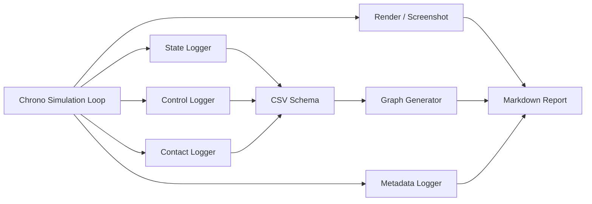

# 2.2.5 데이터 출력/시각화 Component 설계

데이터 출력/시각화 Component는 시뮬레이션 결과를 후처리 단계가 읽을 수 있는 형태로 바꾸는 부품이다. Chrono 시뮬레이션은 화면에서 움직이는 장면만으로 끝나면 재현과 비교가 어렵다. 따라서 State Logger, Control Logger, Contact Logger, CSV Schema, Metadata Logger, Graph Generator, Render/Screenshot Component를 설계 단계에서 함께 정해야 한다.

이 절에서는 시뮬레이션 결과를 상태 로그, 제어 입력 로그, 접촉 로그, 메타데이터, 그래프, 렌더링 자료로 구조화한다. 데이터 출력 Component는 단순한 저장 기능이 아니라, System 단계에서 여러 실험을 비교하고 재현하기 위한 공통 인터페이스 역할을 한다.

## 2.2.5.1 데이터 흐름



## 2.2.5.2 Component 요약 표

| Component | 선택 기준 | 주요 API/모듈 | 조정 변수 | 확인 산출물 |
|---|---|---|---|---|
| State Logger | 위치, 속도, 자세처럼 모든 실험에서 비교할 기본 상태가 필요할 때 | body getter, `GetPos`, `GetPosDt`, CSV writer | 기록 대상, 샘플링 간격, 좌표계, 단위 | `*_state_log.csv`, trajectory graph |
| Control Logger | 결과의 원인이 되는 throttle, brake, steering, torque를 남겨야 할 때 | driver input, motor command, CSV writer | 입력 범위, 명령 주기, torque/speed mode | `*_control_log.csv`, input graph |
| Contact Logger | 접촉력, 접촉 개수, body pair를 후처리해야 할 때 | contact reporter, force query, CSV writer | force threshold, 대상 pair, force component | `*_contact_probe.csv`, force graph |
| CSV Schema | 여러 실험과 팀원이 같은 컬럼으로 데이터를 비교해야 할 때 | `csv.DictWriter`, schema table | 컬럼명, 단위, precision, 누락값 표기 | 단위 포함 CSV, schema 표 |
| Metadata Logger | 실험 조건을 재현 가능하게 남겨야 할 때 | JSON writer, Markdown table, run config | run id, timestep, solver, seed, component parameter | JSON/Markdown metadata |
| Graph Generator | CSV를 보고서용 그래프로 변환해야 할 때 | `matplotlib`, `pandas` 또는 표준 CSV reader | 축 단위, smoothing, event marker, legend | PNG graph |
| Render/Screenshot | Component 배치와 형상을 시각 자료로 검증해야 할 때 | VSG/Irrlicht screenshot, matplotlib render | camera pose, 색, 투명도, 해상도 | render image |
| Sensor Logger | camera/LiDAR/GPS/IMU 데이터를 System 출력으로 확장할 때 | Chrono Sensor module, image/point cloud/IMU writer | sensor pose, update rate, resolution, noise | image path, point cloud path, sensor CSV |

## 2.2.5.3 State Logger Component

State Logger는 body의 위치, 속도, 자세, 접촉력을 시간별로 기록한다. Chassis, wheel, obstacle처럼 움직이는 body는 모두 State Logger 대상이 될 수 있지만, 본 구성에서는 Chassis를 기준 body로 두어 로버 전체 거동을 대표하게 했다.

| 컬럼 | 단위 | 설명 |
|---|---:|---|
| `time_s` | s | 시뮬레이션 시간 |
| `body_name` | - | 기록 대상 body 이름 |
| `x_m`, `y_m`, `z_m` | m | 위치 |
| `vx_mps`, `vy_mps`, `vz_mps` | m/s | 선속도 |
| `roll_rad`, `pitch_rad`, `yaw_rad` | rad | 자세. 단순 예제에서는 0으로 두고 Vehicle 확장에서 quaternion 변환 |
| `contact_force_N` | N | body에 작용한 접촉력 크기 |
| `source` | - | 데이터 생성 경로 |

아래 코드는 한 body의 위치와 속도를 CSV 행으로 변환하는 부분이다. 핵심은 Chrono 객체를 그대로 저장하지 않고, 단위가 붙은 숫자 컬럼으로 풀어 저장하는 것이다.

```python
pos = rover.GetPos()
vel = rover.GetPosDt()
x, y, z = vec_xyz(pos)
vx, vy, vz = vec_xyz(vel)

writer.writerow({
    "time_s": f"{system.GetChTime():.3f}",
    "body_name": rover.GetName(),
    "x_m": f"{x:.5f}",
    "y_m": f"{y:.5f}",
    "z_m": f"{z:.5f}",
    "vx_mps": f"{vx:.5f}",
    "vy_mps": f"{vy:.5f}",
    "vz_mps": f"{vz:.5f}",
})
```

`vec_xyz`는 PyChrono 버전에 따른 `vec.x`/`vec.x()` 접근 차이를 피하기 위해 사용하는 helper이다.

| 그래프 |
|---|
|  |

**설명.** `data_visualization_state_log.csv`에서 위치/속도 값을 읽어 궤적과 속도 변화를 함께 그린 결과이다. State Logger는 모든 System 실험의 공통 데이터 인터페이스가 된다.

실행 코드: `../code/data_visualization/generate_data_visualization_components.py`  
CSV: `../outputs/csv/data_visualization_state_log.csv`

## 2.2.5.4 Control Logger Component

Control Logger는 시뮬레이션에 넣은 throttle, brake, steering, wheel speed, torque command를 기록한다. 결과 그래프만 보면 로버가 왜 빨라졌는지, 왜 멈췄는지, 왜 회전했는지 알기 어렵다. Control Logger는 결과를 해석하는 원인 데이터이다.

| 컬럼 | 단위/범위 | 설명 |
|---|---:|---|
| `time_s` | s | 입력이 적용된 시간 |
| `throttle` | 0~1 | 구동 입력 |
| `brake` | 0~1 | 제동 입력 |
| `steering` | -1~1 또는 rad | 조향 입력 |
| `drive_torque_Nm` | N m | 구동 토크 추정 또는 명령값 |
| `wheel_speed_radps` | rad/s | speed motor 또는 wheel angular speed |
| `source` | - | 실행 출처 |

아래 코드는 제어 입력과 그 입력에서 파생되는 wheel speed/torque 명령을 같은 시간축에 저장한다. 결과 그래프만으로는 원인을 알기 어려우므로 control log는 state log와 같은 `time_s` 기준을 사용한다.

```python
wheel_speed = 8.0 + 5.0 * throttle
control_writer.writerow({
    "time_s": f"{t:.3f}",
    "throttle": f"{throttle:.5f}",
    "brake": f"{brake:.5f}",
    "steering": f"{steering:.5f}",
    "drive_torque_Nm": f"{120.0 * throttle:.5f}",
    "wheel_speed_radps": f"{wheel_speed:.5f}",
})
```

| 그래프 |
|---|
|  |

**설명.** throttle, brake, steering 입력을 시간축에서 함께 보여준다. 주행 결과를 해석할 때 "차량이 왜 그렇게 움직였는가"를 설명하는 근거가 된다.

CSV: `../outputs/csv/data_visualization_control_log.csv`

## 2.2.5.5 Contact Logger Component

Contact Logger는 충돌/접촉 Component와 데이터 출력 Component를 연결한다. 같은 contact force라도 "전체 body에 작용한 총 접촉력"인지, "특정 body pair 사이의 접촉력"인지 구분해야 한다.

| 컬럼 | 단위 | 설명 |
|---|---:|---|
| `time_s` | s | 시뮬레이션 시간 |
| `body_a`, `body_b` | - | 접촉 pair 이름 |
| `contact_count` | - | 접촉점 또는 접촉 pair 개수 |
| `contact_fx_N`, `contact_fy_N`, `contact_fz_N` | N | 접촉력 성분 |
| `contact_force_N` | N | 접촉력 크기 |

아래 코드는 Contact Reporter에서 얻은 힘 성분을 logger 행으로 넘기는 부분이다. `force_norm`은 그래프용 크기이고, `contact_fx_N` 등 성분은 디버그 벡터와 방향을 맞춰 보는 데 필요하다.

```python
force_norm = (fx * fx + fy * fy + fz * fz) ** 0.5
contact_writer.writerow({
    "time_s": f"{system.GetChTime():.4f}",
    "body_a": "rover",
    "body_b": "obstacle",
    "contact_count": contact_count,
    "contact_force_N": f"{force_norm:.5f}",
})
```

| 연결 그래프 |
|---|
|  |

**설명.** 충돌 순간 접촉력 peak를 보여준다.

| 연결 그래프 |
|---|
|  |

**설명.** 접촉점/접촉 pair 개수 변화로 collision shape 안정성을 확인한다.

| 연결 그래프 |
|---|
|  |

**설명.** `contact_fx_N`, `contact_fy_N`, `contact_fz_N` 성분을 분리해 접촉력 방향을 확인한다.

CSV: `../outputs/csv/collision_contact_probe.csv`

## 2.2.5.6 CSV Schema Component

CSV는 Component 간 약속이다. 실험이 많아질수록 "나중에 대충 맞추기"가 매우 어려워지므로, Component 단계에서 컬럼명과 단위를 정해야 한다.

| 원칙 | 설명 |
|---|---|
| 단위 포함 | `x` 대신 `x_m`, `speed` 대신 `speed_mps`처럼 컬럼명에 단위를 붙인다. |
| 시간 기준 통일 | 모든 CSV는 `time_s`를 첫 컬럼으로 둔다. |
| 대상 이름 포함 | 다중 로버 실험을 위해 `body_name`, `component_name`, `body_a`, `body_b`를 둔다. |
| 원본 보존 | 그래프용으로 가공하기 전 raw CSV를 `outputs/csv/`에 저장한다. |
| 결측값 처리 | 센서가 없는 환경에서는 빈 문자열보다 `source` 또는 `available=false`를 명시한다. |

아래처럼 schema를 먼저 코드에 고정해 두면 writer, 그래프 생성기, 문서 표가 같은 컬럼 목록을 공유한다. Component가 늘어날수록 문자열을 흩뿌리는 방식보다 이 구조가 유지보수에 유리하다.

```python
import csv

STATE_SCHEMA = [
    "time_s", "body_name",
    "x_m", "y_m", "z_m",
    "vx_mps", "vy_mps", "vz_mps",
    "roll_rad", "pitch_rad", "yaw_rad",
    "contact_force_N", "source",
]

writer = csv.DictWriter(handle, fieldnames=STATE_SCHEMA)
writer.writeheader()
```

실행 산출물:

| CSV | 연결 그래프 |
|---|---|
| `../outputs/csv/data_visualization_state_log.csv` | `../images/graphs/data_visualization_state_trajectory.png` |
| `../outputs/csv/data_visualization_control_log.csv` | `../images/graphs/data_visualization_control_inputs.png` |
| `../outputs/csv/collision_contact_probe.csv` | `../images/graphs/collision_contact_force_graph.png`, `../images/graphs/collision_contact_count_graph.png`, `../images/graphs/collision_contact_force_components_graph.png` |
| `../outputs/csv/environment_terrain_height_friction_sinkage.csv` | `../images/graphs/terrain_height_sinkage_profile.png`, `../images/graphs/terrain_contact_material_friction_map.png` |

## 2.2.5.7 Metadata Logger Component

Metadata Logger는 CSV에는 매 step 반복해서 쓰기 애매한 실험 조건을 기록한다. 예를 들어 Chrono version, timestep, solver type, gravity, terrain type, soil parameter, renderer, 렌더링 환경을 기록한다.

| 항목 | 예 |
|---|---|
| simulation | timestep, duration, solver, collision system |
| environment | gravity, terrain type, friction, soil parameters |
| rover | mass, wheel radius, motor type, initial pose |
| output | CSV path, graph path, render path |
| platform | OS, Python version, Chrono modules, renderer |

아래 코드는 CSV에 반복해서 쓰기 어려운 실험 조건을 JSON으로 남기는 형태이다. 나중에 같은 CSV를 다시 해석할 때 timestep, gravity, terrain이 무엇이었는지 확인할 수 있다.

```python
import json

metadata = {
    "timestep_s": 0.002,
    "duration_s": 5.0,
    "gravity_mps2": [0, 0, -9.81],
    "terrain": "RigidTerrain",
    "renderer": "VSG manual screenshot",
}

with open("run_metadata.json", "w", encoding="utf-8") as handle:
    json.dump(metadata, handle, indent=2)
```

## 2.2.5.8 Graph Generator Component

Graph Generator는 CSV를 읽어 궤적, 속도, 접촉력, 제어 입력을 이미지로 저장한다. macOS에서는 Irrlicht/VSG 창과 matplotlib 창이 충돌할 수 있으므로, 그래프 생성에는 창을 띄우지 않는 `Agg` backend를 사용하는 것이 안전하다.

아래 코드는 CSV 원본을 읽어 그래프 파일로 저장하는 최소 흐름이다. 보고서에서는 그래프 자체보다 축 단위, legend, 해석 문장이 같이 있어야 데이터 의미가 유지된다.

```python
import matplotlib
matplotlib.use("Agg")
import matplotlib.pyplot as plt
import numpy as np

data = np.genfromtxt("state_log.csv", delimiter=",", names=True)

fig, ax = plt.subplots(figsize=(8, 4.5))
ax.plot(data["x_m"], data["y_m"], linewidth=2)
ax.set_xlabel("x [m]")
ax.set_ylabel("y [m]")
ax.set_title("Rover trajectory")
ax.grid(True, alpha=0.3)
fig.savefig("trajectory.png", dpi=180)
```

| 그래프 작성 원칙 | 설명 |
|---|---|
| 축 단위 표시 | `time [s]`, `force [N]`, `speed [m/s]`처럼 명확히 표시 |
| 비교 대상 명시 | 로버 이름, 지형 이름, material 이름을 legend에 표시 |
| raw CSV 보존 | 그래프 이미지와 원본 CSV를 함께 보존 |
| 해석 문장 포함 | 그래프 아래에 peak, steady state, first contact 등 의미를 설명 |

## 2.2.5.9 Render/Screenshot Component

Render/Screenshot Component는 시뮬레이션 장면을 시각 자료로 남기는 기능이다. Component 단계에서는 렌더링 결과가 단순 장식이 아니라, 부품의 위치, 형상, 상대 좌표계, 접촉 상태를 검증하는 자료로 쓰인다.

| 경로 | 설명 | 역할 |
|---|---|---|
| Chrono VSG | Vulkan Scene Graph 기반 렌더러 | 실제 시뮬레이션 장면을 고품질로 확인 |
| Chrono Irrlicht | OpenGL 기반 렌더러 | 기본 시각화와 디버깅 화면 확인 |
| Concept render | matplotlib 3D 도식 | Component 구조 설명용 보조 이미지 |
| Graph image | CSV 기반 그래프 | 물리 결과 검증 |

아래는 렌더를 실험 산출물로 남길 때 필요한 최소 절차이다. 실제 VSG/Irrlicht 코드는 backend마다 다르지만, camera pose와 파일 경로를 metadata에 같이 남겨야 나중에 같은 장면을 재현할 수 있다.

```python
camera_pose = {"eye": [3.0, -3.0, 1.5], "target": [0.0, 0.0, 0.4]}
render_path = "images/renders/component_scene.png"
render_backend.SaveScreenshot(render_path)
metadata["render"] = {"path": render_path, "camera": camera_pose}
```

| 렌더링 관찰 기준 | 해석 기준 |
|---|---|
| Render pipeline 장면 | 로버, 지형, 카메라 시점이 함께 보이면 시뮬레이션 장면과 시각 자료의 연결성을 확인할 수 있다. |
| Sensor layout 장면 | camera, LiDAR, GPS/IMU 배치가 chassis 기준 좌표계와 일치해야 센서 데이터 해석이 가능하다. |

| 시각 자료 |
|---|
|  |

**설명.** VSG로 캡처한 센서 배치 장면이다. 빨간 점은 외부 camera, 노란 ray는 LiDAR scan 방향, 초록 점은 GPS/IMU 기준 위치를 나타낸다. 현재는 Sensor 모듈이 없어 실제 센서 데이터가 아니라 Component 배치 설명용 이미지이다.

## 2.2.5.10 선택적 Sensor Component

Sensor Component는 현재 필수 구현 대상이 아니라 확장 Component이다. 공식 Chrono::Sensor는 RGB camera, LiDAR, GPS, IMU 등을 지원하지만, 현재 Mac conda 환경에서는 `pychrono.sensor`가 설치되어 있지 않아 실제 Sensor 실행은 하지 않았다. 따라서 Sensor는 향후 확장 Component로 분류한다.

| Sensor | 역할 | 연결 데이터 |
|---|---|---|
| Camera | RGB/Depth/Segmentation 이미지 | frame index, pose, image path |
| LiDAR | point cloud 또는 range scan | timestamp, point cloud path |
| GPS | 전역 위치 측정 | latitude/longitude 또는 local xyz |
| IMU | 가속도/각속도 | acceleration, gyro, orientation |

아래 코드는 Sensor module이 있는 환경에서의 연결 형태이다. 현재 보고서 이미지는 실제 sensor output이 아니라 `Render camera`, `LiDAR rays`, `GPS/IMU` 위치를 설명하는 배치 검토용 렌더이다.

```python
# Sensor module이 있는 환경에서의 개념 구조
# import pychrono.sensor as sens
# manager = sens.ChSensorManager(system)
# camera = sens.ChCameraSensor(chassis, update_rate, offset_pose, width, height, fov)
# manager.AddSensor(camera)
```

## 2.2.5.11 시각 자료와 그래프의 역할

| 자료 | 제시 위치 | 목적 |
|---|---|---|
| 렌더 이미지 | 각 Component 설명 바로 아래 | 부품을 눈으로 식별 |
| 시각 자료 | 구조를 더 명확히 보여줄 때 | 구성 관계 설명 |
| CSV 그래프 | 코드 예시와 실행 산출물 뒤 | 물리 결과 검증 |
| Mermaid | Component 관계 또는 데이터 흐름 설명 | 전체 구조 요약 |

## 2.2.5.12 실행 산출물

실행 코드: `../code/data_visualization/generate_data_visualization_components.py`  
CSV: `../outputs/csv/data_visualization_state_log.csv`, `../outputs/csv/data_visualization_control_log.csv`

## 2.2.5.13 참고 문헌

- Chrono Sensor overview: https://api.projectchrono.org/sensor_overview.html
- Chrono Visualization overview: https://api.projectchrono.org/vehicle_visualization.html
- Chrono visualization local notes: `docs/visualization/`
- Chrono postprocess local notes: `docs/postprocess/index.md`
