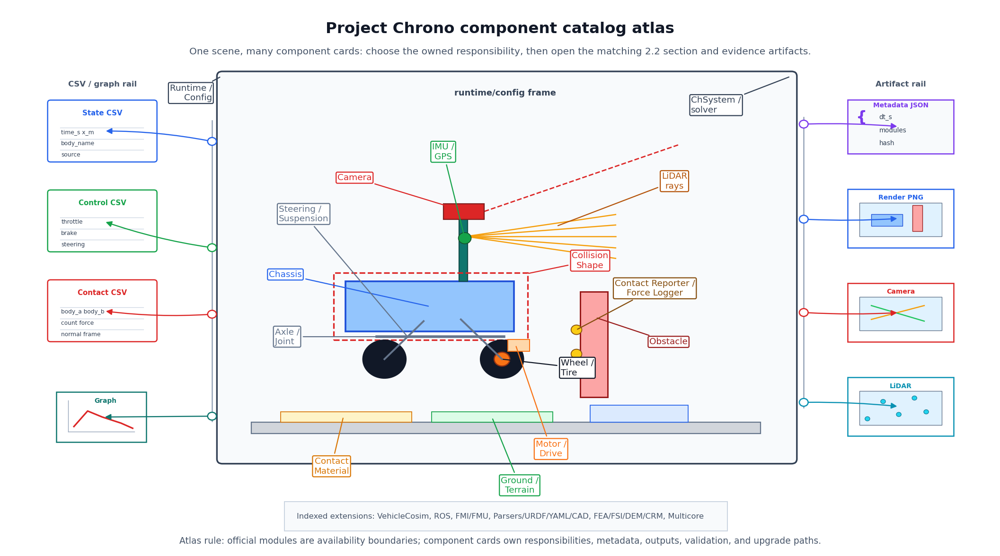
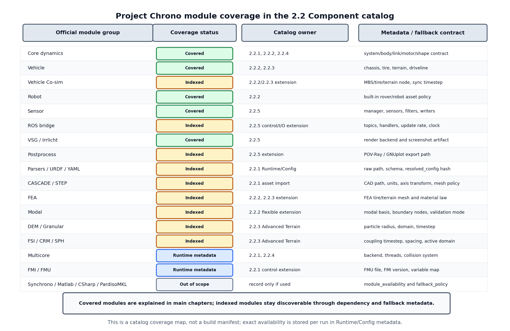
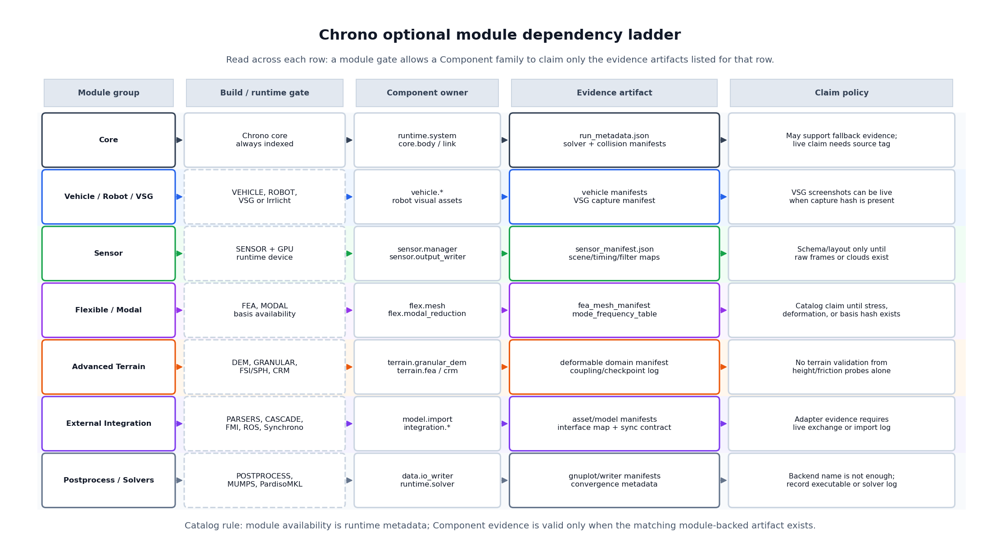
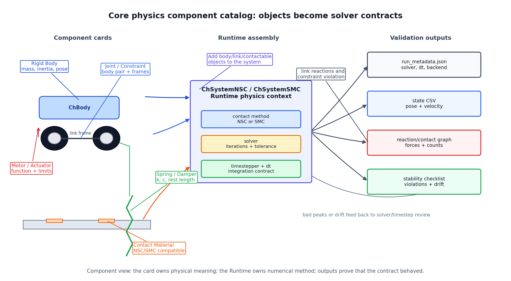
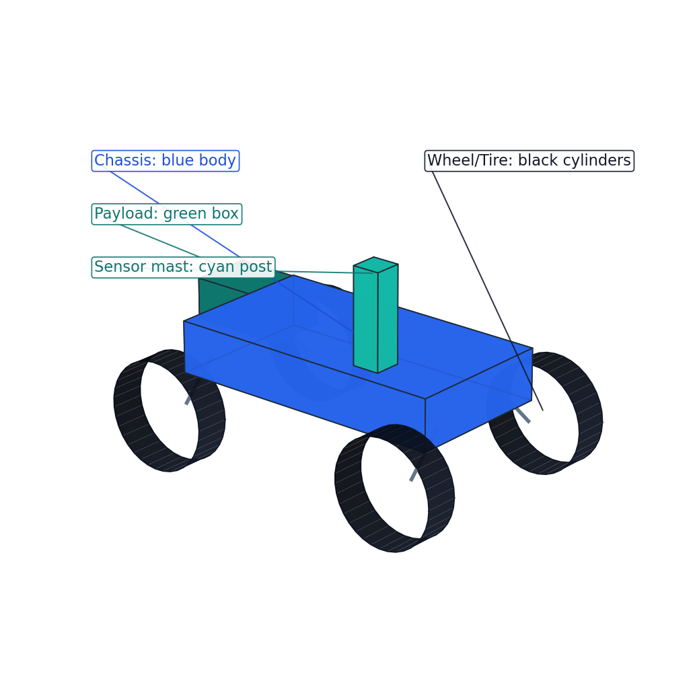
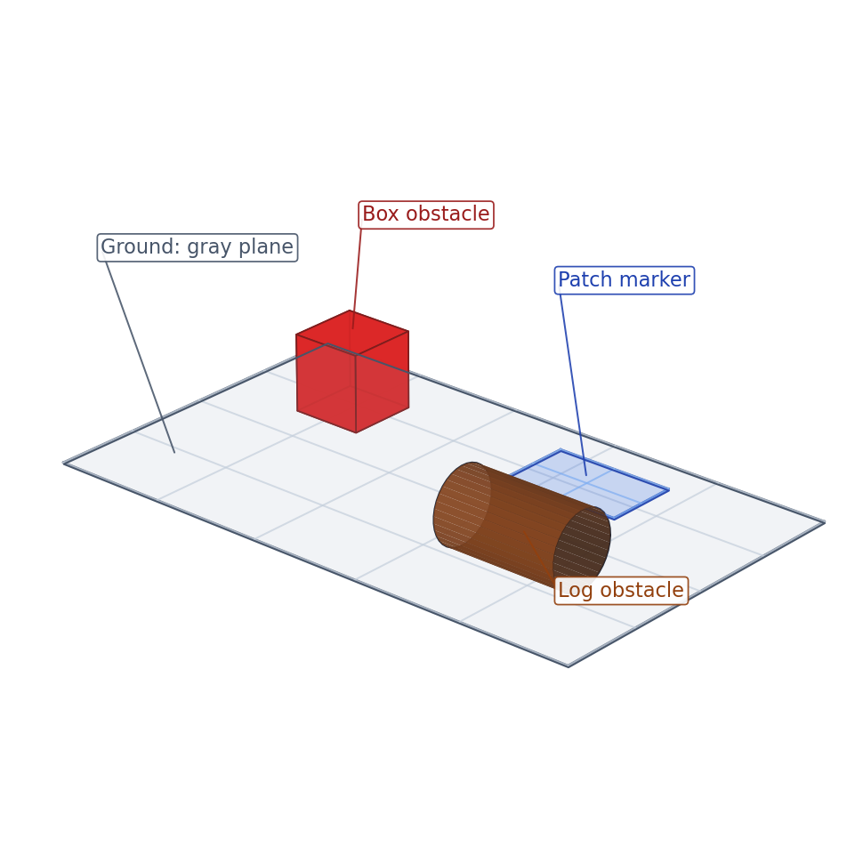
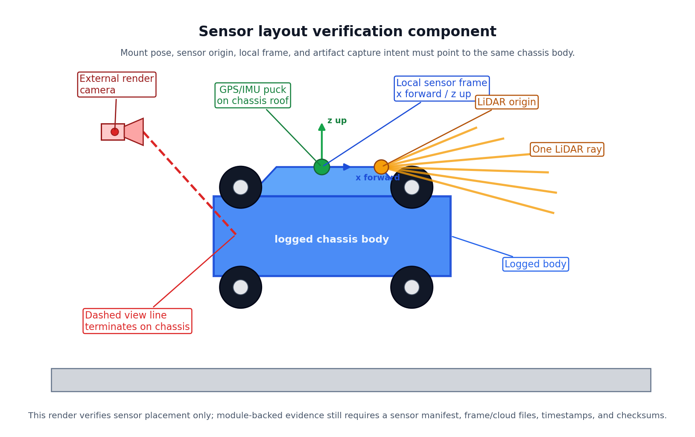

# 2.2 Component

`2.2 Component`는 Command 단계의 Chrono API를 실제 구현 대상의 부품 단위로 묶어 설명한 보고서 폴더이다. Core Physics/Solver, 로버/차량, 환경/Terrain, 충돌/접촉 측정, 데이터 출력/시각화 Component를 각각 카탈로그처럼 정리하고, 관련 코드와 렌더 이미지, 그래프, CSV 산출물을 함께 보관한다.

## 파일 목록

- [2.2.1 Component 단계의 정의와 역할](2.2.1_component_definition.md) - Core Physics/Solver와 Runtime/Config cross-cutting Component 포함
- [2.2.2 로버/차량 Component 설계](2.2.2_rover_vehicle_components.md) - Wheeled/Tracked Vehicle, Driver, Powertrain, Chrono::Robot 로버 family card 포함
- [2.2.3 환경/Terrain Component 설계](2.2.3_environment_terrain_components.md)
- [2.2.4 충돌/접촉 측정 Component 설계](2.2.4_collision_contact_components.md)
- [2.2.5 데이터 출력/시각화 Component 설계](2.2.5_data_visualization_components.md)

## 읽는 순서

| 순서 | 문서 | 핵심 내용 |
| --- | --- | --- |
| 1 | `2.2.1_component_definition.md` | Component 단계의 의미, Core Physics/Solver 계약, Runtime/Config 계약, Command와 System 사이의 역할, 설명 기준 |
| 2 | `2.2.2_rover_vehicle_components.md` | Chassis, wheel/tire, joint, motor, powertrain/driveline/brake, steering, suspension, visual/collision shape |
| 3 | `2.2.3_environment_terrain_components.md` | Ground, obstacle, contact material, RigidTerrain, heightmap, SCMTerrain, advanced terrain selection |
| 4 | `2.2.4_collision_contact_components.md` | Collision shape, contact material, reporter, force logger, event detector |
| 5 | `2.2.5_data_visualization_components.md` | CSV schema, state/control/contact logging, graph generation, screenshot/sensor output |

| Component 카탈로그 개요도 |
|---|
|  |

**설명.** 이 그림은 2.2 전체의 전역 색인이다. 중앙 장면의 로버, 지형, 장애물, 접촉점, 센서, 출력 산출물을 먼저 보고, 어떤 Component를 설계해야 하는지 정한 뒤 해당 문서의 Component 카드로 들어간다.

## 전체 Component 카탈로그

Component 단계는 Project Chrono의 command를 그대로 나열하는 단계가 아니라, 구현하려는 대상과 환경을 실제 부품 단위로 나누어 설명하는 단계이다. 따라서 아래 카탈로그는 API 호출 이름보다 “무엇을 구현하는 부품인가”, “어떤 Chrono 기능으로 만들 수 있는가”, “어떤 산출물로 확인하는가”를 중심으로 정리한다.

### 범위 표기 기준

2.2 Component는 현재 구현한 로버-지형-접촉-데이터 흐름과 향후 확장 가능한 고급 모듈을 함께 담고 있다. 다만 보고서 본문에서 두 범위를 혼동하지 않도록 아래 기준으로 읽는다.

| 범위 | 의미 | 본문에서의 취급 |
|---|---|---|
| 현재 구현/검증 완료 | 이번 학기 코드, 렌더, CSV, 그래프로 실제 확인한 Component | Core body/link/motor, Curiosity/Viper 계열 로버, RigidTerrain/SCMTerrain, 충돌/접촉 logger, CSV/그래프/렌더 |
| 현재 구현 기반 확장 | 현재 구조를 조금 확장하면 바로 실험 가능한 Component | waypoint driver, PPO driver, heightmap/obstacle 지형 변형, 실행 메타데이터 |
| 향후 확장 색인 | 공식 Chrono 기능이지만 이번 본론의 필수 구현 범위를 넘어서는 Component | Sensor, FEA, Modal, FMI, ROS, VehicleCosim, SynChrono, DEM/CRM 등 |

따라서 Sensor, FEA, ROS, FMI 같은 항목은 "이미 동역학 검증이 끝난 결과"가 아니라, 최종 프로젝트 또는 2학기 확장을 위해 어떤 Command와 산출물이 추가되어야 하는지 보여주는 roadmap entry로 해석한다.

| Component 묶음 | 대표 Chrono 기능/클래스 | 구현 대상 | 주요 산출물 | 담당 문서 |
|---|---|---|---|---|
| Runtime / Config | `ChSystemNSC`, `ChSystemSMC`, solver, timestepper, gravity 설정 | 모든 물리 Component가 들어가는 실행 환경과 재현 조건 | `run_metadata.json`, solver/contact 설정표, Runtime 관계도 | `2.2.1` |
| Core Physics | `ChBody`, `ChLink`, `ChMotor`, `ChFunction`, `ChContactMaterial*`, visual/collision shape | body, joint, motor, spring, material 같은 기본 물리 부품 | 기본 형상 렌더, body/link/motor 관리 표 | `2.2.1`, `2.2.2`, `2.2.4` |
| Rover / Vehicle | `ChWheeledVehicle`, `ChTrackedVehicle`, Vehicle JSON, `ChChassis`, `ChWheel`, `ChTire`, driveline, brake, steering | 로버와 차량을 구성하는 chassis, wheel/tire, suspension, steering, powertrain, track assembly | 로버 렌더, 차량 하위 시스템 표, chassis CSV/그래프 | `2.2.2` |
| Robot 모델 | Chrono::Robot Curiosity, Viper, Turtlebot 계열 | 이미 조립된 로버/로봇 모델을 기준 Component로 사용하는 경우 | 내장 로봇 렌더, wheel id map, robot model card | `2.2.2` |
| Environment / Terrain | fixed ground, obstacle body, `FlatTerrain`, `RigidTerrain`, heightmap/mesh patch, `SCMTerrain`, 고급 terrain 계열 | 로버가 움직이는 지면, 장애물, 마찰 영역, 변형 토양 | 지형 렌더, height/friction/sinkage CSV, 지형 그래프 | `2.2.3` |
| Collision / Contact | collision shape, contact material, collision backend, reporter, force logger, event detector | 충돌 형상, 접촉 재질, 접촉력 측정, 이벤트 판정 | contact CSV, force graph, debug vector render | `2.2.4` |
| Data / Visualization | CSV writer, 메타데이터 logger, graph generator, VSG/Irrlicht render, screenshot manifest | 시뮬레이션 결과를 보고서와 후처리에서 읽을 수 있게 만드는 출력 부품 | state/control/contact CSV, 그래프 PNG, render manifest | `2.2.5` |
| Sensor | `ChSensorManager`, camera, LiDAR, GPS, IMU, radar, tachometer, filter chain | 로버에 부착되는 가상 센서와 센서 출력 흐름 | sensor layout render, sensor manifest, raw frame/cloud/log 구조 | `2.2.5` |
| 확장/연동 Component | FEA, Modal, YAML/URDF/STEP import, FMI, ROS, Vehicle co-simulation, SynChrono | 고급 물리, 외부 모델 import, 외부 시뮬레이터/미들웨어 연동 | import manifest, interface map, sync log, module availability 기록 | `2.2.1`, `2.2.5` |

이 표는 2.2 전체의 길잡이이다. 자세한 구현 방법은 각 문서의 Component 카드, 코드 예시, 렌더 이미지, 그래프에서 확인한다.

## Component 활용 경로

| 작업 목적 | 먼저 볼 문서 | 함께 볼 문서 | 기대 산출물 | 함께 기록할 메타데이터/스키마 |
|---|---|---|---|---|
| Core 원형 구현을 Vehicle 하위 시스템으로 확장하기 | `2.2.1` Core 카탈로그 | `2.2.2` chassis/wheel/tire | 형상 렌더, chassis 상태 검증 CSV | body 등록표, 실행 설정 |
| 지형을 선택하거나 바꾸기 | `2.2.3` 지형 선택 기준 | `2.2.2` tire/track, `2.2.5` 지형 검증 데이터 | 지형 렌더, 높이/침하 그래프 | 지형 Component id, 지형 조회값과 접촉 계산의 기준 |
| 접촉력이 이상한 이유 찾기 | `2.2.4` 실패 조건 카탈로그 | `2.2.1` 실행 조건, `2.2.3` 재질/지형 | 접촉력/접촉 개수/성분 그래프, 디버그 렌더 | 접촉 방식, 충돌 백엔드, 재질 id, 필터 규칙 |
| 유연 차체, 타이어, beam/shell 모델링 | `2.2.1` Flexible Body / FEA 카탈로그 | `2.2.2` 타이어/구조 부품, `2.2.3` FEATerrain, `2.2.4` 접촉 | FEA Component 표, mesh manifest, 응력/변형률 산출물 | mesh id, node/element 개수, 재료 법칙, 경계 조건 map |
| FEA 조립체를 Modal 모델로 축약 | `2.2.1` Modal 축약 Component | `2.2.2` 차량 부착 지점, `2.2.5` 산출물 색인 | 모드 표, 모드 형상 렌더, modal basis manifest | 경계/내부 자유도 구분, basis hash, 고유진동수 표 |
| Camera/LiDAR/IMU 출력 추가하기 | `2.2.5` 센서 카탈로그 | `2.2.2` 센서 장착부, `2.2.1` 모듈 사용 가능성 | 센서 배치 렌더, manifest, 원본 frame/cloud/log | 센서 manifest, 필터 체인, 갱신 주기 |
| 증거 이미지/그래프 다시 만들기 | README 이미지 표 | 관련 담당 문서 | 재생성된 PNG/CSV | 생성 스크립트, 입력 hash, 검증 수준 |
| System 단계로 조립하기 | `2.2.1` 생애주기 기준 | 관련 모든 담당 문서 | 실행 메타데이터, 해석된 설정, 산출물 묶음 | Component id, 스키마 등록표, 대체/예시 표기 기준 |
| YAML/URDF/STEP 모델을 Chrono Component로 들이기 | `2.2.1` 외부 연동/자산 import | `2.2.2` body/vehicle, `2.2.4` collision, `2.2.5` manifest | 해석된 import manifest, 원본-Chrono 대응표, 충돌 proxy map | 원본 경로/hash, 단위/축 변환, 모듈 사용 가능성 |
| FMU/ROS/co-simulation을 연결하기 | `2.2.1` 외부 연동 경계 | `2.2.2` driver/vehicle, `2.2.5` data/sensor I/O | 변수/토픽/노드 manifest, 동기화 log | 갱신 주기, 동기화 순서, 지연/timeout 정책 |

## 문서 간 Component 책임 경계

| 공통 개념 | 기준 담당 문서 | 함께 보는 문서 | 기준 문서가 직접 설명하지 않는 것 | 넘겨줄 메타데이터 |
|---|---|---|---|---|
| Contact Material | `2.2.4` solver 접촉 재질 기준 | `2.2.3` 지형 patch, `2.2.2` tire/wheel, `2.2.1` 실행 접촉 방식 | 지형 조회용 마찰값 또는 SCM 토양 법칙 | `material_id`, `contact_method`, `contact_material_mu` |
| Collision Shape | `2.2.4` 충돌 형상과 접촉 측정 | `2.2.2` 로버 visual/collision, `2.2.3` obstacle/ground | 시각화 mesh의 미적 표현 | `shape_family`, local pose, envelope/margin, debug render |
| 지형 조회값과 접촉 계산 기준 | `2.2.3` 지형 카탈로그 | `2.2.2` tire/track, `2.2.4` contact logger | 타이어 모델 내부 계산 | `terrain_component_id`, `terrain_mu_query`, contact source |
| 센서 장착 위치/자세 | `2.2.2` 물리 장착 frame | `2.2.5` sensor manager/output | 센서 필터가 만든 원본 출력 | parent body, offset pose, frame convention |
| Flexible Body / FEA Mesh | `2.2.1` Chrono::FEA 일반 카탈로그 | `2.2.2` FEA tire/structure, `2.2.3` FEATerrain, `2.2.4` flexible contact | Vehicle 타이어/지형의 도메인 의미 또는 solver별 접촉 해석 | mesh id/hash, node/element 등록표, 재료 법칙, 경계 조건 map |
| Modal 축약 조립체 | `2.2.1` Chrono::Modal 축약 카탈로그 | `2.2.2` flexible vehicle attachment, `2.2.5` 산출물 색인 | 축약 가정 밖의 full FEA 응력/변형률 해석 | modal basis hash, mode frequency table, boundary/internal map |
| Runtime Config | `2.2.1` 실행 조건/config | 모든 문서 | 도메인별 물리 의미 | `run_id`, `resolved_config_hash`, `module_availability` |
| 산출물 메타데이터 | `2.2.5` 메타데이터/스키마 등록표 | 모든 문서 | 물리 검증 해석 자체 | 산출물 경로/hash, 생성 스크립트, 검증 수준 |
| Driver/Input과 Steering/Driveline | `2.2.2` 차량 하위 시스템 책임 | `2.2.5` control logger, `2.2.1` motor/actuator | UI 입력 명령의 세부 의미 | command source, actuator id, normalized 값과 물리 단위 구분 |

## 검증 자료/산출물 색인

| 산출물 경로 | 산출물 유형 | 검증 대상 | 담당 문서 | 생성 스크립트 | 검증 수준 |
|---|---|---|---|---|---|
| `images/renders/component_catalog_atlas.png` | 전역 렌더 개요도 | 보고서 탐색과 소유 책임 지도 | README / `2.2.1` | `code/common/generate_component_catalog_atlas_render.py` | 개념 렌더 |
| `images/renders/core_physics_solver_constraint_catalog.png` | 카탈로그 렌더 | runtime/core solver/link/motor 소유 책임 | `2.2.1` | `code/common/generate_core_physics_solver_constraint_catalog_render.py` | 개념 렌더 |
| `images/renders/flexible_body_fea_modal_component_catalog.png` | 카탈로그 렌더 | flexible body FEA/Modal 소유 책임과 검증 기준 | `2.2.1` | `code/common/generate_flexible_body_fea_modal_component_catalog_render.py` | 개념 렌더 |
| `images/renders/chrono_optional_module_dependency_ladder.png` | 카탈로그 렌더 | 선택 모듈 의존성과 검증 기준 | README / `2.2.1` | `code/common/generate_chrono_optional_module_dependency_ladder_render.py` | 개념 렌더 |
| `images/renders/chrono_builtin_wheeled_vehicle_assets.png` | VSG 렌더 캡처 | HMMWV visual asset과 Component 대응 | `2.2.2` | `code/common/generate_chrono_builtin_wheeled_vehicle_assets_render.py` | PyChrono VSG capture |
| `images/renders/chrono_builtin_tracked_vehicle_assets.png` | VSG 렌더 캡처 | M113 tracked visual asset과 Component 대응 | `2.2.2` | `code/common/generate_chrono_builtin_tracked_vehicle_assets_render.py` | PyChrono VSG capture |
| `images/renders/chrono_viper_vsg_capture.png` | VSG 렌더 캡처 | VIPER robot visual asset과 Component 대응 | `2.2.2` | `code/common/generate_chrono_builtin_robot_rover_assets_render.py` | PyChrono VSG capture |
| `images/renders/chrono_curiosity_vsg_capture.png` | VSG 렌더 캡처 | Curiosity robot visual asset과 Component 대응 | `2.2.2` | `code/common/generate_chrono_builtin_robot_rover_assets_render.py` | PyChrono VSG capture |
| `outputs/json/robot_vsg_capture_manifest.json` | VSG capture manifest | camera pose/FOV, image hash, build/data root, 보이는 robot part id | `2.2.2`, `2.2.5` | `code/common/generate_chrono_builtin_component_assets.py` | PyChrono VSG capture |
| `outputs/json/vehicle_vsg_capture_manifest.json` | VSG capture manifest | camera pose/FOV, image hash, build/data root, 보이는 HMMWV/M113 part id | `2.2.2`, `2.2.5` | `code/common/generate_chrono_builtin_component_assets.py` | PyChrono VSG capture |
| `images/renders/rover_vehicle_subsystem_ownership_map.png` | 카탈로그 렌더 | rover/vehicle 하위 시스템 소유 책임과 검증 경로 | `2.2.2` | `code/rover_vehicle/generate_rover_vehicle_subsystem_ownership_map_render.py` | 개념 렌더 |
| `images/renders/rover_driver_input_controller_component.png` | Component 렌더 | driver input/controller 경계와 control logger 관리 기준 | `2.2.2` | `code/rover_vehicle/generate_rover_driver_input_controller_component_render.py` | 개념 렌더 |
| `images/renders/rover_powertrain_driveline_brake_tire_flow.png` | 카탈로그 렌더 | vehicle drive/brake/tire 흐름 | `2.2.2` | `code/rover_vehicle/generate_rover_powertrain_driveline_brake_tire_flow_render.py` | 개념 렌더 |
| `images/renders/terrain_advanced_selection_catalog.png` | 카탈로그 렌더 | 고급 terrain 모듈과 검증 기준 | `2.2.3` | `code/environment_terrain/generate_terrain_advanced_selection_catalog_render.py` | 개념 렌더 |
| `images/renders/collision_contact_measurement_catalog.png` | 카탈로그 렌더 | 접촉 측정 흐름 | `2.2.4` | `code/collision_contact/generate_collision_contact_measurement_catalog_render.py` | 개념 렌더 |
| `images/renders/data_visualization_artifact_catalog.png` | 카탈로그 렌더 | 출력 산출물 소유 책임 | `2.2.5` | `code/data_visualization/generate_data_visualization_artifact_catalog_render.py` | 개념 렌더 |
| `images/renders/data_visualization_sensor_pipeline_catalog.png` | 카탈로그 렌더 | Chrono::Sensor 모듈 생애주기와 산출물 기준 | `2.2.5` | `code/data_visualization/generate_data_visualization_sensor_pipeline_catalog_render.py` | 개념 렌더 |
| `images/graphs/*` | 그래프 PNG | 연결된 CSV/probe 해석 | 관련 담당 문서 | per-image graph script | CSV `source`에 따라 예시 그래프 또는 PyChrono 기반 그래프로 구분 |
| `outputs/csv/*` | CSV probe/log | Component 원본 검증 자료 | 관련 담당 문서 | Component 생성 스크립트 | `source` 값으로 예시 데이터와 PyChrono 실행 probe를 구분 |

### 검증 산출물 읽는 기준

이 보고서의 CSV, 그래프, 렌더 이미지는 Component의 책임을 설명하기 위한 검증 자료이다. 산출물을 해석할 때는 파일 이름만 보지 않고 `source`, `schema_id`, `component_id`, 생성 스크립트, 입력 파일 해시를 함께 확인해야 한다. 실제 Chrono/PyChrono 실행에서 생성된 자료는 물리 검증 근거가 될 수 있지만, 모듈이 없는 환경에서 만든 예시 CSV나 개념 렌더는 스키마와 설명 구조를 확인하는 자료로만 사용한다.

| 산출물 구분 | 보고서에서의 역할 | 검증으로 인정하기 위한 조건 | 관련 문서 |
|---|---|---|---|
| 로버/차량 상태 CSV와 그래프 | chassis, wheel, tire, powertrain, brake 같은 차량 Component의 상태와 입력을 해석한다. | 실제 Vehicle/Robot 실행 자료라면 차량 모델명, 축/바퀴 식별자, terrain id, Chrono 버전, `source`를 함께 기록한다. | `2.2.2`, `2.2.5` |
| 지형/환경 CSV와 그래프 | height, normal, friction, sinkage, terrain contact force의 기준을 설명한다. | RigidTerrain/SCM/DEM/FEA/CRM 중 어떤 지형인지와 query/contact 권한, 모듈 사용 가능성, timestep을 명시한다. | `2.2.3`, `2.2.5` |
| 충돌/접촉 CSV와 이벤트 그래프 | 접촉 쌍, 접촉점, 법선, 접촉력, 이벤트 시점을 확인한다. | contact method, material class, collision backend, reporter filter, force frame이 함께 기록되어야 한다. | `2.2.4`, `2.2.5` |
| 센서/시각화 산출물 | sensor mount, filter chain, render backend, screenshot/graph 연결 관계를 설명한다. | 실제 센서 검증은 raw frame/cloud/log, pose, timing, checksum, dropped-frame 정보가 있을 때만 인정한다. | `2.2.5` |
| 실행 메타데이터와 산출물 색인 | 여러 CSV/PNG/JSON을 하나의 재현 가능한 보고서 묶음으로 연결한다. | `run_metadata.json`, `artifact_manifest.csv/json`, 입력 해시, 출력 해시, 생성 스크립트를 함께 관리한다. | `README`, `2.2.5` |

### 향후 보강 산출물

System 단계에서 재현 가능한 시뮬레이션으로 확장하려면 아래 산출물이 Component별로 연결되어야 한다. 이 목록은 현재 파일 생성 여부를 보고하는 내부 메모가 아니라, 보고서의 카탈로그가 어떤 검증 자료까지 확장될 수 있는지 보여주는 기준이다.

| 보강 영역 | 필요한 산출물 | 확인할 내용 |
|---|---|---|
| 실행 조건 | `run_metadata.json`, `resolved_config.json`, solver/contact 기록 | Chrono 버전, 활성 모듈, timestep, 중력, 접촉 방식, seed, 입력 설정 |
| 차량 모델 | `vehicle_model_spec_manifest.json`, 축/바퀴 map, hardpoint map, subsystem output policy | 모델 JSON 계층, chassis/suspension/steering/wheel/tire/brake/driveline 연결, 바퀴 식별 체계 |
| 지형 모델 | terrain component/patch/material/deformable-domain manifest, surface/contact probe | 지형 종류, patch bounds, 재질 영역, soil/particle/mesh/SPH domain, query/contact 분리 |
| 충돌 모델 | collision shape/material/filter/reporter manifest, contact frame debug 자료 | visual shape와 collision shape 차이, 재질 조합, contact pair 필터, force frame |
| 데이터 출력 | logger timebase manifest, writer backend manifest, graph/render manifest | 시간 기준, 샘플링 주기, 파일 해시, 그래프 입력 CSV, 렌더 카메라/백엔드 |
| 센서 출력 | sensor manifest, timing schedule, filter 카탈로그, raw frame/cloud/log 폴더 | parent body, offset pose, update rate, filter chain, 저장 파일, checksum |
| 외부 연동 | FMI/ROS/VehicleCosim/SynChrono interface map과 sync log | 외부 변수/토픽/노드가 Chrono Component와 어떤 시간 기준으로 교환되는지 |

## 2.1 Command와 2.2 Component 경계 점검

| API/Command 관점 | 2.2 Component 관점 | 필요한 소유권 정보 | 필요한 검증 자료 | 2.1로 연결할 경우 |
|---|---|---|---|---|
| 클래스 생성 방법 | 해당 클래스가 맡는 물리/데이터 책임 | `component_id`, 소유 항목, 의존 항목 | Component와 연결된 렌더/그래프/CSV | 문법, import, 인자 순서가 중심일 때 |
| `ChBodyEasyBox(...)` 호출 | chassis, ground, obstacle, payload, collision envelope 구현 | 질량, pose, visual/collision 참조, 재질 id | body 렌더, 상태/접촉 검증 CSV | primitive 생성자 동작을 설명할 때 |
| `RigidTerrain.AddPatch(...)` 호출 | 지형 patch의 식별자와 지형 조회/접촉 기준 | patch id, frame, 재질, 높이 데이터 출처 | 지형 렌더, 높이/마찰 검증 데이터 | patch overload 목록을 정리할 때 |
| `ReportAllContacts(...)` 호출 | reporter 범위, 좌표 변환, 집계 방식, 스키마 | body pair, 필터 규칙, 힘 출처, 좌표계 | 접촉 CSV, 디버그 vector | callback signature 설명이 중심일 때 |
| `PushFilter(...)` 호출 | 센서 필터 체인의 출력 책임 | filter chain id, 입력/출력 buffer, 저장/access 정책 | 센서 manifest, 원본 산출물 | 필터 API 문법을 열거할 때 |
| `ChSensorManager.Update()` 호출 | 센서 생애주기와 scheduling 책임 | manager id, sensor 목록, 갱신 순서, dropped/late frame 정책 | 센서 manifest, 원본 frame/cloud/log | loop 문법 또는 단일 데모 호출이 중심일 때 |
| `WriteVisualizationAssets(...)` 호출 | 오프라인 시각화 산출물 책임 | 출력 폴더, frame index, exporter/backend, 보이는 Component id | render/offline manifest | exporter API 옵션 설명이 중심일 때 |
| `ChWriterCSV` / `ChOutputHDF5` 호출 | 데이터 산출물 writer 책임 | schema id, 단위, 경로/hash, 출처/검증 수준 | CSV/HDF5 manifest | writer method 문법이 중심일 때 |
| YAML parser / `run_chrono` 호출 | 해석된 모델/solver/output 명세 책임 | 원본 YAML hash, resolved config, Component id map, 출력 정책 | import manifest | runner 옵션이나 parser 문법이 중심일 때 |
| `ChCascadeDoc.LoadSTEP(...)` 호출 | CAD import와 asset 해석 책임 | named-shape 계층, tessellation 설정, 질량/관성 정책, collision proxy map | CAD import manifest, visual/collision 검증 자료 | STEP loading 문법이 중심일 때 |
| FMU import/export helper 호출 | FMI adapter 책임 | FMU hash, 변수 map, causality, FMI version, co-sim step 순서 | 동기화 FMU log | FMU packaging API가 중심일 때 |
| ROS handler 구성 | ROS bridge 책임 | topic/message type, handler 목록, pub/sub 방향, update rate, frame transform | ROS topic/handler manifest | ROS class 생성자 문법이 중심일 때 |
| Vehicle co-simulation node 시작 | 분산 vehicle-terrain co-sim 책임 | MBS/tire/terrain node 역할, rank/process id, 교환 변수, sync timestep | node manifest, force/state 교환 log | MPI 실행 방식이 중심일 때 |
| SynChrono agent 실행 | 분산 multi-agent 동기화 책임 | agent id, 통신 backend, sync period, world/GPS frame, packet timing | agent sync manifest | 데모 실행 문법이 중심일 때 |
| `matplotlib.plot(...)` 호출 | 그래프 산출물의 출처와 해석 기준 | 입력 CSV/hash, 축 단위, 생성 스크립트 | 그래프 PNG와 manifest 항목 | 일반 plotting 문법이 중심일 때 |

## 공식 Chrono 모듈 대응

이 절은 Chrono API 호출 목록이 아니라 Project Chrono로 가상환경을 조립할 때 필요한 Component 카탈로그이다. 따라서 공식 모듈은 빌드/기능 경계로 보고, 본문에서는 실제 모델링 부품 단위로 다시 묶는다.

| 공식 영역 | Component 카탈로그에서 보는 단위 | 주요 문서 |
|---|---|---|
| Core dynamics | `ChSystem`, solver/timestepper, `ChBody`, `ChLink`, `ChMotor`, visual/collision shape를 묶은 physics system, rigid body, joint, actuator, chassis, wheel, obstacle | `2.2.1`, `2.2.2`, `2.2.4` |
| Chrono::Vehicle | chassis, suspension, steering, tire, powertrain, driveline, brake, terrain subsystem | `2.2.2`, `2.2.3` |
| Chrono::Robot | Curiosity, Viper, Turtlebot 같은 완성 로버/로봇 모델 | `2.2.2` |
| Contact/Collision | contact material, collision shape, reporter, event detector, force logger | `2.2.4` |
| Sensor | sensor manager, camera/depth/segmentation, LiDAR, GPS, IMU, radar, tachometer, filter/output writer | `2.2.5` |
| Visualization/Postprocess | VSG/Irrlicht render, screenshot, CSV, graph, 메타데이터 | `2.2.5` |
| Runtime/Config | timestep, solver/contact method, gravity, module availability, seed, resolved config, 메타데이터 소유 책임 | `2.2.1` cross-cutting component |

공식 API 기준은 Project Chrono API 문서(https://api.projectchrono.org/), Vehicle terrain 문서(https://api.projectchrono.org/group__vehicle__terrain.html), Sensor overview(https://api.projectchrono.org/sensor_overview.html)를 기준으로 삼는다.

### 공식 Chrono 모듈 대응 표

| 공식 모듈/기능 | 카탈로그 Component id | 담당 문서 | 보고서 내 취급 | 사용 가능성 키 | 검증 자료 |
|---|---|---|---|---|---|
| Core Chrono | `runtime.system`, `core.body`, `core.link_constraint`, `core.motor_constraint`, `core.motor_torque` | `2.2.1` | 본문 설명 | `core=true` | `core_physics_solver_constraint_catalog.png` |
| Vehicle | `vehicle.*`, `terrain.interface`, `terrain.rigid_patch`, `terrain.scm` | `2.2.2`, `2.2.3` | 본문 설명/확장 | `vehicle=true` | rover/terrain 카탈로그 렌더와 HMMWV/M113 VSG visual asset 캡처 |
| Robot | `vehicle.robot_assets` | `2.2.2` | 내장 모델 색인으로 설명 | `robot_assets=true` | Viper/Curiosity VSG visual asset 캡처 |
| Sensor layout | `sensor.layout` | `2.2.5` | 개념 배치 설명 | `sensor=true/false` | `data_visualization_sensor_components.png` |
| Sensor module output | `sensor.manager`, `sensor.filter_chain`, `sensor.output_writer` | `2.2.5` | 실제 센서 모듈 실행 산출물이 있을 때 검증으로 인정 | `sensor=true`, VSG/OptiX 사용 가능성 | `data_visualization_sensor_pipeline_catalog.png`, sensor capability/manifest files, frames/clouds/logs, dropped-frame 메타데이터 |
| VSG / Irrlicht / Postprocess | `visual.runtime`, `visual.offline_export`, `postprocess.plot_export` | `2.2.5` | 렌더/산출물 관리 기준으로 설명 | `vsg`, `irrlicht`, `postprocess` | render/screenshot/plot manifest |
| Parsers / YAML / URDF / Cascade | `model.spec_resolver`, `model.urdf_import`, `asset.cad_step` | `2.2.1` | 확장 색인 | `parsers`, `yaml`, `urdf`, `cascade` | import/asset manifests, `external_integration_component_map.png` |
| FMI / ROS / VehicleCosim / Synchrono | `integration.fmi`, `integration.ros`, `integration.vehicle_cosim`, `integration.synchrono` | `2.2.1` | 확장 색인 | `fmi`, `ros`, `vehicle_cosim`, `synchrono` | interface map, sync log, `external_integration_component_map.png` |
| FSI / DEM / FEA / Modal / Multicore | 고급 terrain/contact/runtime 확장 | `2.2.1`, `2.2.3`, `2.2.4` | 모듈이 있을 때만 실제 검증, 없으면 확장 색인 | 모듈별 사용 가능성 key | `chrono_module_coverage_map.png`, terrain advanced 카탈로그 |

| Chrono module coverage |
|---|
|  |

| Chrono optional module dependency ladder |
|---|
|  |

### Chrono 모듈 조회표

이 표는 Chrono 빌드 설정이나 `find_package` 구성에서 등장할 수 있는 모듈을 Component 보고서 관점으로 찾아보기 위한 색인이다. `본문 설명`은 2.2 본문에서 독립 Component 카드로 다룬다는 뜻이고, `확장 색인`은 의존성, 인터페이스, 보강 조건만 기록하며 실제 모듈 실행 검증으로 주장하지 않는다는 뜻이다.

| Chrono 구성 요소 | 카탈로그 담당 | Component 카드 상태 | 사용 가능성 키 | 검증 수준 | 범위 밖/대체 표기 기준 |
|---|---|---|---|---|---|
| `Vehicle` | `2.2.2`, `2.2.3` | 본문 설명 | `vehicle` | 로버/지형 렌더와 HMMWV/M113 VSG visual asset 캡처. 실제 Vehicle 실행 CSV가 있을 때 동역학 검증으로 인정 | 실제 검증에는 `vehicle_model`, tire/terrain id 필요 |
| `VehicleCosim` | `2.2.1`, `2.2.2`, `2.2.3` | 확장 색인 | `vehicle_cosim` | 실제 교환 log가 생기기 전에는 interface 메타데이터로만 취급 | MBS/tire/terrain node manifest, BODY/MESH interface, sync timestep, state/force exchange log 필요 |
| `Robot` | `2.2.2` | 내장 모델 카탈로그 | `robot` | Viper/Curiosity VSG visual asset 캡처 | 실제 robot 실행 검증에는 robot model, wheel id, driver source 필요 |
| `Sensor` | `2.2.5` | 배치 설명, 모듈 출력은 확장 | `sensor` | 배치/스키마 검증 자료로 우선 설명하고, 실제 센서 실행은 별도 manifest로 구분 | Sensor-enabled 실행에서 나온 sensor manifest와 원본 frames/clouds/logs 필요 |
| `VSG`, `Irrlicht` | `2.2.5` | 렌더 backend 설명 | `vsg`, `irrlicht` | render/screenshot manifest | backend와 camera/view policy를 함께 기록 |
| `Postprocess` | `2.2.5` | 확장 색인 | `postprocess` | export path 메타데이터 | POV-Ray/GNUplot 출력은 실제 생성 자료가 있을 때만 검증으로 인정 |
| `Parsers`, `YAML`, `URDF` | `2.2.1` | 설정/import 확장 색인 | `parsers`, `yaml`, `urdf` | import manifest까지만 설명 | 실제 동역학 검증이 아니라 원본 경로, hash, 단위/축 변환, 원본-Chrono 대응표 검증에 사용 |
| `Cascade` / STEP | `2.2.1` | CAD asset import 확장 색인 | `cascade` | CAD import manifest까지만 설명 | named-shape 계층, tessellation, 질량/관성, visual/collision 분리 정책 필요 |
| `FMI` / FMU | `2.2.1`, `2.2.5` | 외부 연동 색인 | `fmi` | 실제 교환 log가 생기기 전에는 interface 메타데이터로만 취급 | FMU hash, variable map, causality, co-sim step, timestamped exchange log 필요 |
| `ROS` | `2.2.1`, `2.2.5` | I/O bridge 확장 색인 | `ros` | 실제 log가 생기기 전에는 topic/handler manifest로만 취급 | `/clock`, topic handler, message type, frame transform, latency/drop 메타데이터 필요 |
| `Synchrono` | `2.2.1` | 분산 agent 확장 색인 | `synchrono` | 실제 sync log가 생기기 전에는 availability/agent 메타데이터로만 취급 | agent manifest와 heartbeat exchange log가 필요하며, 이것만으로 접촉력 coupling 검증을 주장하지 않는다. |
| `DEM` / `Granular` / `GPU` | `2.2.3` | 고급 지형 확장 색인 | `dem`, `granular`, `gpu` | terrain advanced 카탈로그 | particle domain, timestep, 실제 모듈 source 필요 |
| `FSI`, `FSI_SPH`, `FSI_TDPF`, `CRM` | `2.2.3` | 고급 지형 확장 색인 | `fsi`, `fsi_sph`, `fsi_tdpf`, `crm` | terrain advanced 카탈로그 | coupling timestep, spacing, active domain 필요 |
| `FEA`, `Modal` | `2.2.1`, `2.2.2`, `2.2.3` | flexible upgrade 확장 색인 | `fea`, `modal` | flexible/tire/terrain 메타데이터 | mesh/basis/material law 산출물 필요 |
| `Multicore` | `2.2.1`, `2.2.4` | runtime 메타데이터 | `multicore` | 모듈/백엔드 메타데이터 | thread count와 collision backend 비교 필요 |
| `MUMPS`, `PardisoMKL` | `2.2.1` | solver backend 색인 | `mumps`, `pardisomkl` | solver 메타데이터 | direct solver 사용 가능성과 convergence log 필요 |
| `CSharp`, `Matlab` | README / `2.2.1` | language binding/interface 색인 | `csharp`, `matlab` | 사용 가능성 메타데이터 | adapter를 실제로 사용할 때만 현재 Python 보고서 범위에 포함 |

| Core physics solver/constraint 카탈로그 |
|---|
|  |

### 고급/외부 의존 Component 범위

아래 항목은 공식 Chrono 기능 경계에는 존재하지만, 이 2.2 카탈로그에서는 기본 로버-지형-접촉-데이터 흐름의 확장 Component로 둔다. 본문에서 직접 다루지 않는 경우에도 실행 메타데이터에는 모듈 사용 가능성과 대체 표기 기준을 남긴다.

| 고급 영역 | Component 관점 | 이번 2.2에서의 취급 |
|---|---|---|
| Vehicle Co-simulation | MBS node, Tire node, Terrain node, BODY/MESH interface, sync timestep | Vehicle/Terrain 확장 Component로 색인 |
| ROS Bridge | topic, handler, update rate, `/clock`, external driver/sensor I/O | Data/Control/Sensor I/O 확장으로 색인 |
| FMI/FMU | FMU file, FMI 2/3, model exchange/co-simulation, variable map | Runtime/Control 외부 동역학 Component로 색인 |
| FSI/CRM/SPH | fluid/soil continuum domain, BCE/particle spacing, coupling timestep | Advanced Terrain 확장으로 색인 |
| DEM/Granular | particle terrain/contact domain, particle material, active box | Advanced Terrain 확장으로 색인 |
| FEA/FEA tire | mesh, element/material law, tire/terrain coupling | Tire/Terrain upgrade path로 색인 |
| Modal | modal basis, reduction type, boundary nodes, mode-shape validation | FEA/flexible structure upgrade path로 색인 |
| Parsers/URDF/YAML/CAD | model spec, asset path, unit/axis transform, collision mesh policy | Run Config / Model Spec / Asset Import Component로 색인 |
| Multicore/parallel collision | collision backend, thread count, solver/backend 메타데이터 | Collision Backend / Runtime 메타데이터로 색인 |
| Blender/POV-Ray/GNUplot | offline render/export, plot backend, postprocess script | Visualization/Postprocess 확장으로 색인 |

## 산출물 구조

| 폴더 | 역할 |
| --- | --- |
| [code/](code/) | Component 예시 코드와 이미지/그래프 생성 스크립트 |
| [code/common/](code/common/) | 공통 유틸리티, 전체 실행 스크립트, VSG/Irrlicht 관련 보조 코드 |
| [images/renders/](images/renders/) | Component별 렌더링 이미지 |
| [images/graphs/](images/graphs/) | CSV 또는 예시 데이터 기반 그래프 |
| [images/mermaid_rendered/](images/mermaid_rendered/) | Mermaid 관계도 원본 `.mmd`와 렌더링 이미지 |
| [outputs/csv/](outputs/csv/) | 예시 코드 실행으로 생성된 CSV 데이터 |
| [outputs/raw/](outputs/raw/) | 실행 로그와 실험용 원본 이미지 |

## 대표 시각 자료

| 로버/차량 | 환경/Terrain |
| --- | --- |
|  |  |

| 충돌/접촉 | 데이터/센서 |
| --- | --- |
|  |  |

## 코드 실행

전체 Component 예시를 다시 생성하려면 프로젝트 루트에서 Chrono 환경을 활성화한 뒤 다음 스크립트를 실행한다. 이 통합 실행 스크립트는 영역별 CSV/통합 산출물 생성기, 아래 이미지 표에 등록된 PNG별 개별 생성 스크립트, 산출물 색인 생성기를 순서대로 호출한다.

```bash
conda activate chrono
source setup_chrono_env.sh
python "3-layer_report/2.2 Component/code/common/run_all_component_examples.py"
```

개별 영역만 다시 생성할 때는 아래 스크립트를 사용한다.

| 영역 | 실행 스크립트 |
| --- | --- |
| 로버/차량 | `code/rover_vehicle/generate_rover_vehicle_components.py` |
| 환경/Terrain | `code/environment_terrain/generate_environment_terrain_components.py` |
| 충돌/접촉 | `code/collision_contact/generate_collision_contact_components.py` |
| 데이터/시각화 | `code/data_visualization/generate_data_visualization_components.py` |
| Chrono 기본 형상 | `code/common/generate_chrono_default_shapes.py` |
| Chrono 내장 차량/로봇 asset | `code/common/generate_chrono_builtin_component_assets.py` |
| 산출물 색인 / 실행 메타데이터 | `code/common/generate_component_artifact_manifest.py` |
| Mermaid 관계도 | `code/common/render_mermaid_01.py` ~ `code/common/render_mermaid_06.py` |

## 이미지 생성 스크립트 규칙

보고서 이미지는 수정 중 롤백을 줄이기 위해 가능하면 PNG 하나당 생성 스크립트 하나를 둔다. 전체 재생성 통합 실행 스크립트도 이 표의 개별 스크립트를 호출하므로, 보정이 잦은 이미지는 해당 PNG 행의 스크립트만 다시 실행하면 된다.

| 이미지 | 개별 생성 스크립트 |
|---|---|
| `images/mermaid_rendered/2_2_mermaid_01.png` | `code/common/render_mermaid_01.py` |
| `images/mermaid_rendered/2_2_mermaid_02.png` | `code/common/render_mermaid_02.py` |
| `images/mermaid_rendered/2_2_mermaid_03.png` | `code/common/render_mermaid_03.py` |
| `images/mermaid_rendered/2_2_mermaid_04.png` | `code/common/render_mermaid_04.py` |
| `images/mermaid_rendered/2_2_mermaid_05.png` | `code/common/render_mermaid_05.py` |
| `images/mermaid_rendered/2_2_mermaid_06.png` | `code/common/render_mermaid_06.py` |
| `images/mermaid_rendered/2_2_mermaid_07.png` | `code/common/render_mermaid_07.py` |
| `images/renders/runtime_config_component_map.png` | `code/common/generate_runtime_config_component_map_render.py` |
| `images/renders/core_physics_solver_constraint_catalog.png` | `code/common/generate_core_physics_solver_constraint_catalog_render.py` |
| `images/renders/flexible_body_fea_modal_component_catalog.png` | `code/common/generate_flexible_body_fea_modal_component_catalog_render.py` |
| `images/renders/chrono_module_coverage_map.png` | `code/common/generate_chrono_module_coverage_map_render.py` |
| `images/renders/chrono_optional_module_dependency_ladder.png` | `code/common/generate_chrono_optional_module_dependency_ladder_render.py` |
| `images/renders/component_catalog_atlas.png` | `code/common/generate_component_catalog_atlas_render.py` |
| `images/renders/external_integration_component_map.png` | `code/common/generate_external_integration_component_map_render.py` |
| `images/renders/chrono_default_shape_types.png` | `code/common/generate_chrono_default_shape_types_render.py` |
| `images/renders/chrono_builtin_wheeled_vehicle_assets.png` | `code/common/generate_chrono_builtin_wheeled_vehicle_assets_render.py` |
| `images/renders/chrono_builtin_tracked_vehicle_assets.png` | `code/common/generate_chrono_builtin_tracked_vehicle_assets_render.py` |
| `images/renders/chrono_builtin_robot_rover_assets.png` | `code/common/generate_chrono_builtin_robot_rover_assets_render.py` |
| `images/renders/chrono_viper_vsg_capture.png` | `code/common/generate_chrono_builtin_robot_rover_assets_render.py` |
| `images/renders/chrono_curiosity_vsg_capture.png` | `code/common/generate_chrono_builtin_robot_rover_assets_render.py` |
| `images/renders/rover_vehicle_component_overview.png` | `code/rover_vehicle/generate_rover_vehicle_component_overview_render.py` |
| `images/renders/rover_vehicle_subsystem_ownership_map.png` | `code/rover_vehicle/generate_rover_vehicle_subsystem_ownership_map_render.py` |
| `images/renders/rover_payload_sensor_mount_component.png` | `code/rover_vehicle/generate_rover_payload_sensor_mount_component_render.py` |
| `images/renders/rover_wheel_tire_component.png` | `code/rover_vehicle/generate_rover_wheel_tire_component_render.py` |
| `images/renders/rover_axle_joint_component.png` | `code/rover_vehicle/generate_rover_axle_joint_component_render.py` |
| `images/renders/rover_motor_drive_component.png` | `code/rover_vehicle/generate_rover_motor_drive_component_render.py` |
| `images/renders/rover_driver_input_controller_component.png` | `code/rover_vehicle/generate_rover_driver_input_controller_component_render.py` |
| `images/renders/rover_powertrain_driveline_brake_tire_flow.png` | `code/rover_vehicle/generate_rover_powertrain_driveline_brake_tire_flow_render.py` |
| `images/renders/rover_steering_component.png` | `code/rover_vehicle/generate_rover_steering_component_render.py` |
| `images/renders/rover_suspension_steering_components.png` | `code/rover_vehicle/generate_rover_suspension_steering_components_render.py` |
| `images/renders/rover_visual_collision_shapes.png` | `code/rover_vehicle/generate_rover_visual_collision_shapes_render.py` |
| `images/renders/rover_initial_state_component.png` | `code/rover_vehicle/generate_rover_initial_state_component_render.py` |
| `images/renders/tracked_vehicle_components.png` | `code/rover_vehicle/generate_tracked_vehicle_components_render.py` |
| `images/graphs/rover_vehicle_chassis_probe_graph.png` | `code/rover_vehicle/generate_rover_vehicle_chassis_probe_graph.py` |
| `images/renders/terrain_ground_obstacle_components.png` | `code/environment_terrain/generate_terrain_ground_obstacle_components_render.py` |
| `images/renders/terrain_rigid_patch_component.png` | `code/environment_terrain/generate_terrain_rigid_patch_component_render.py` |
| `images/renders/terrain_contact_material_regions.png` | `code/environment_terrain/generate_terrain_contact_material_regions_render.py` |
| `images/renders/terrain_heightmap_component.png` | `code/environment_terrain/generate_terrain_heightmap_component_render.py` |
| `images/renders/terrain_scm_deformation_component.png` | `code/environment_terrain/generate_terrain_scm_deformation_component_render.py` |
| `images/renders/terrain_environment_field_component.png` | `code/environment_terrain/generate_terrain_environment_field_component_render.py` |
| `images/renders/terrain_advanced_selection_catalog.png` | `code/environment_terrain/generate_terrain_advanced_selection_catalog_render.py` |
| `images/graphs/terrain_height_sinkage_profile.png` | `code/environment_terrain/generate_terrain_height_sinkage_profile_graph.py` |
| `images/graphs/terrain_contact_material_friction_map.png` | `code/environment_terrain/generate_terrain_contact_material_friction_map_graph.py` |
| `images/graphs/terrain_contact_force_probe.png` | `code/environment_terrain/generate_terrain_contact_force_probe_graph.py` |
| `images/renders/collision_contact_components.png` | `code/collision_contact/generate_collision_contact_components_render.py` |
| `images/renders/collision_contact_measurement_catalog.png` | `code/collision_contact/generate_collision_contact_measurement_catalog_render.py` |
| `images/renders/collision_visual_vs_collision_shape.png` | `code/collision_contact/generate_collision_visual_vs_collision_shape_render.py` |
| `images/renders/collision_contact_debug_vectors.png` | `code/collision_contact/generate_collision_contact_debug_vectors_render.py` |
| `images/renders/collision_contact_reporter_scope.png` | `code/collision_contact/generate_collision_contact_reporter_scope_render.py` |
| `images/graphs/collision_contact_force_graph.png` | `code/collision_contact/generate_collision_contact_force_graph.py` |
| `images/graphs/collision_contact_count_graph.png` | `code/collision_contact/generate_collision_contact_count_graph.py` |
| `images/graphs/collision_contact_force_components_graph.png` | `code/collision_contact/generate_collision_contact_force_components_graph.py` |
| `images/graphs/collision_contact_material_effect_graph.png` | `code/collision_contact/generate_collision_contact_material_effect_graph.py` |
| `images/graphs/collision_event_timeline_graph.png` | `code/collision_contact/generate_collision_event_timeline_graph.py` |
| `images/renders/data_visualization_artifact_catalog.png` | `code/data_visualization/generate_data_visualization_artifact_catalog_render.py` |
| `images/renders/data_visualization_sensor_pipeline_catalog.png` | `code/data_visualization/generate_data_visualization_sensor_pipeline_catalog_render.py` |
| `images/renders/data_visualization_sensor_components.png` | `code/data_visualization/generate_data_visualization_sensor_components_render.py` |
| `images/graphs/data_visualization_state_trajectory.png` | `code/data_visualization/generate_data_visualization_state_trajectory_graph.py` |
| `images/graphs/data_visualization_control_inputs.png` | `code/data_visualization/generate_data_visualization_control_inputs_graph.py` |

## 문서 작성 기준

각 Component 문서는 같은 흐름으로 정리한다.

1. Component가 어떤 구현 대상을 표현하는지 설명한다.
2. 관련 Chrono API와 Command 단계의 연결 관계를 정리하되, 먼저 소유 책임, 의존 대상, 조정 변수, 산출물, 검증 기준, 주의/실패 조건, 확장 경로를 고정한다.
3. 코드 예시로 구현 절차를 보여준다.
4. 렌더 이미지와 그래프를 통해 물리적 의미를 확인한다.
5. CSV/로그 등 데이터 산출물이 있으면 검증 기준과 함께 제시한다.
