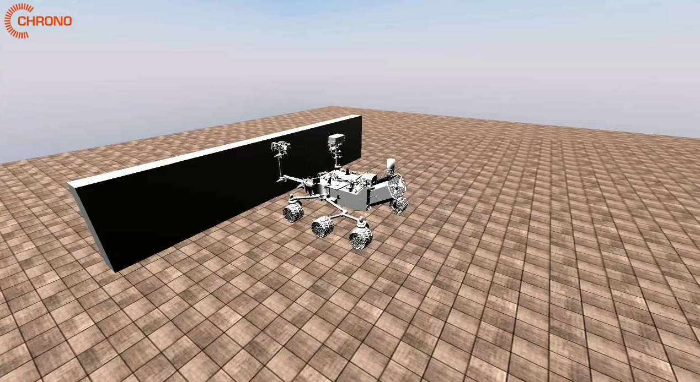
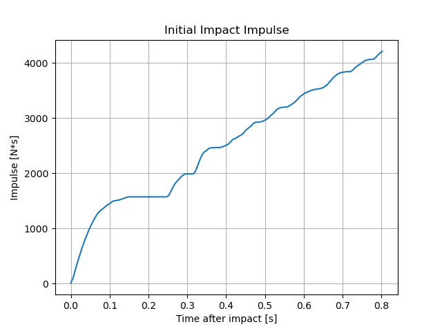

# 2.3.1 충돌 시스템 구현

## 2.3.1.1 시스템 구성

본 예제는 Chrono Robot Module과 Contact Dynamics 기능을 이용하여 Curiosity Rover의 충돌 응답 특성을 분석하기 위해 수행하였다. 단순히 로버를 생성하고 충돌 장면을 구현하는 것에 그치지 않고, 충돌 과정에서 발생하는 접촉력과 충격량을 추출하여 정량적으로 분석하는 것을 목표로 하였다.

충돌 실험에서는 지면의 변형이나 지반 거동을 고려하는 것이 목적이 아니므로 계산 효율이 높고 안정적인 강체 지형 모델인 `veh.RigidTerrain(system)`을 사용하였다. 또한 충돌 대상은 `chrono.ChBodyEasyBox()`를 이용하여 생성하였으며, `SetFixed(True)`를 적용하여 충돌 시 벽은 움직이지 않고 로버만 운동하도록 구성하였다.
로버는 Chrono Robot Module에서 제공하는 `robot.Curiosity(system)`을 사용하여 생성하였으며, `robot.CuriositySpeedDriver()`를 이용하여 일정한 속도로 직진하도록 설정하였다. 이를 통해 실제 Curiosity Rover 모델의 충돌 거동을 재현할 수 있는 시뮬레이션 환경을 구축하였다.

## 2.3.1.2 충돌력 분석

충돌 과정에서 벽에 작용하는 접촉력을 실시간으로 측정하였다. 이를 위해 Chrono Contact API인 `wall.GetContactForce()`를 사용하였다.

위 그래프를 통해 충돌 직후 약 27 kN 수준의 최대 접촉력이 발생하는 것을 알 수 있다. 이후 접촉력이 반복적으로 나타나는데, 이는 단순 수치 오차라기보다 Curiosity Rover의 바퀴와 서스펜션 구조에서 발생하는 재접촉 현상으로 해석된다.
이를 통해 Chrono가 단순 충돌 여부뿐 아니라 실제 충돌 과정의 동역학적 거동까지 계산할 수 있음을 확인하였다.

## 2.3.1.3 충격량 분석

충격량은 접촉력을 시간에 대해 적분하여 계산하였다. 충돌 직후 접촉력이 크게 발생하는 구간에서 그래프 기울기가 급격히 증가하였으며 이후 접촉력이 감소함에 따라 증가율도 감소하는 것을 확인할 수 있었다.

최종적으로 약 4200 N·s 수준의 충격량이 측정되었다. 이를 통해 Chrono에서 추출한 접촉력을 활용하여 단순 시각화가 아닌 정량적 충돌 분석이 가능함을 확인하였다. 특히 Contact Force와 Impulse는 향후 자율주행 차량, 군용 차량, 우주 탐사 로버 등의 충돌 안전성 분석에도 활용 가능할 것으로 판단된다.
