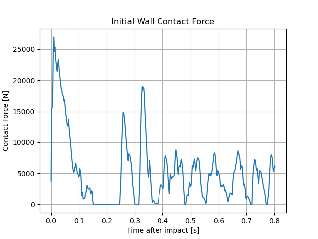

# 2.3.1 충돌 시스템 구현
## 2.3.1.1 시스템 구성

본 예제는 Chrono Robot Module과 Contact Dynamics 기능을 이용하여 Curiosity Rover의 충돌 응답 특성을 분석하기 위해 수행하였다. 단순히 로버를 생성하고 충돌 장면을 구현하는 것에 그치지 않고, 충돌 과정에서 발생하는 접촉력(Contact Force)과 충격량(Impulse)을 추출하여 정량적으로 분석하는 것을 목표로 하였다.  

충돌 실험에서는 지면의 변형이나 지반 거동을 고려하는 것이 목적이 아니므로 계산 효율이 높고 안정적인 강체 지형 모델인 `veh.RigidTerrain(system)`을 사용하였다. 이를 통해 지형 변형 계산에 소요되는 자원을 줄이고 충돌 해석에 집중할 수 있도록 구성하였다.
  
충돌 대상인 벽은 `chrono.ChBodyEasyBox()`를 이용하여 생성하였다. 또한 `SetFixed(True)`를 적용하여 벽을 완전히 고정된 강체로 설정함으로써 충돌 시 벽의 운동을 제거하고 Curiosity Rover의 동적 응답만 분석할 수 있도록 하였다.

로버는 Chrono Robot Module에서 제공하는 `robot.Curiosity(system)` 모델을 사용하였다. Curiosity Rover는 NASA 화성 탐사 로버를 기반으로 제작된 모델로서 6륜 구조와 Rocker-Bogie 서스펜션을 포함하고 있다. 또한 `robot.CuriositySpeedDriver()`를 이용하여 일정 속도로 직진하도록 설정함으로써 반복 가능한 충돌 조건을 구성하였다.
  
본 시스템은 Terrain Component(RigidTerrain), Rover Component(Curiosity Rover), Obstacle Component(고정 벽)를 조합하여 구성하였다. 이를 통해 Command 단계에서 학습한 Terrain, Collision, Robot 관련 기능이 실제 충돌 해석 시스템으로 연결되는 과정을 확인할 수 있었다.
  ![[system_figure_01.png]]

## 2.3.1.2 충돌력 분석

충돌 과정에서 벽에 작용하는 접촉력을 분석하기 위하여 Chrono Contact API인 `wall.GetContactForce()`를 사용하였다. 해당 함수는 충돌 시 벽에 작용하는 접촉력 벡터를 반환하며, 이를 이용하여 접촉력의 크기를 계산하였다.  
  
실험 결과 충돌 직후 약 27 kN 수준의 최대 접촉력이 발생하였다. 이후 접촉력이 반복적으로 발생하는 현상이 관찰되었는데, 이는 Curiosity Rover의 Rocker-Bogie 서스펜션 구조와 6륜 시스템에 의해 충돌 후 차체가 진동하면서 벽과 반복적으로 접촉하였기 때문이다.  
  
충돌력 그래프는 충돌 직후 급격한 최대값을 보인 뒤 감소하는 경향을 나타냈으며, 이후에도 일정 수준의 접촉력이 반복적으로 발생하였다. 이를 통해 Chrono가 단순한 충돌 여부 판정뿐 아니라 실제 차량 구조에 의한 동적 응답까지 계산하고 있음을 확인할 수 있었다.

## 2.3.1.3 충격량 분석

충격량은 충돌 과정에서 발생한 접촉력을 시간에 대해 적분하여 계산하였다. 충격량은 충돌 전후 운동량 변화와 직접적으로 관련되는 물리량으로서 충돌의 전체적인 영향을 평가하는 데 활용된다.
  
그래프를 보면 충돌 직후 접촉력이 크게 발생하는 구간에서 충격량이 급격히 증가하는 것을 확인할 수 있다. 이후에는 접촉력이 감소함에 따라 증가율이 완만해지는 경향을 보였다.  
  
최종적으로 약 4200 N·s 수준의 충격량이 측정되었으며, 이를 통해 Curiosity Rover와 벽 사이에서 전달된 전체 충격의 크기를 정량적으로 평가할 수 있었다.  
  
특히 충격량 그래프는 순간적인 최대 충돌력만으로는 확인하기 어려운 충돌의 누적 효과를 보여주며, 충돌 이후에도 지속적으로 발생하는 접촉 현상이 전체 충격량 증가에 영향을 미친다는 점을 확인할 수 있었다.

![[impulse.png]]

## 2.3.1.4 구현 결과 및 의의

본 예제는 Chrono에서 제공하는 Contact Dynamics 기능을 실제 충돌 해석 시스템에 적용한 사례이다.

Command 단계에서 학습한 RigidTerrain, ChBodyEasyBox, Curiosity Rover, Contact API 기능을 이용하여 Terrain Component, Rover Component, Obstacle Component를 구성하였으며, 이를 조합하여 하나의 충돌 해석 시스템을 구축하였다.

실험 결과 Curiosity Rover와 벽 사이에서 발생하는 접촉력과 충격량을 정량적으로 추출할 수 있었으며, 충돌 직후 최대 접촉력 발생과 이후 반복 접촉 현상을 확인할 수 있었다. 또한 충격량 계산을 통해 충돌 과정에서 전달된 전체 충격의 크기를 평가할 수 있었다.

이를 통해 Chrono는 단순히 차량이나 로봇을 움직여 보는 시뮬레이션 도구가 아니라 실제 충돌 과정에서 발생하는 물리량을 추출하고 분석할 수 있는 해석 플랫폼임을 확인할 수 있었다.

또한 개별 Command를 사용하는 수준을 넘어 Terrain, Rover, Obstacle과 같은 Component를 조합하여 하나의 충돌 해석 System으로 확장할 수 있음을 확인하였으며, 향후 다양한 이동체의 충돌 안전성 분석에도 활용 가능함을 확인하였다.