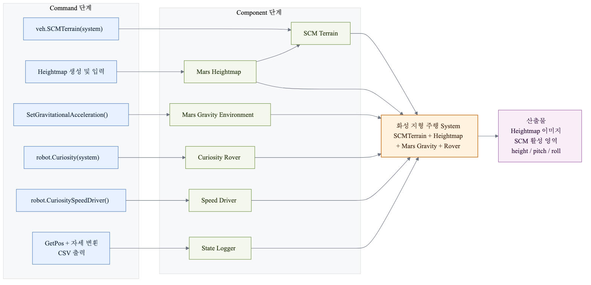
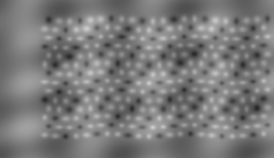
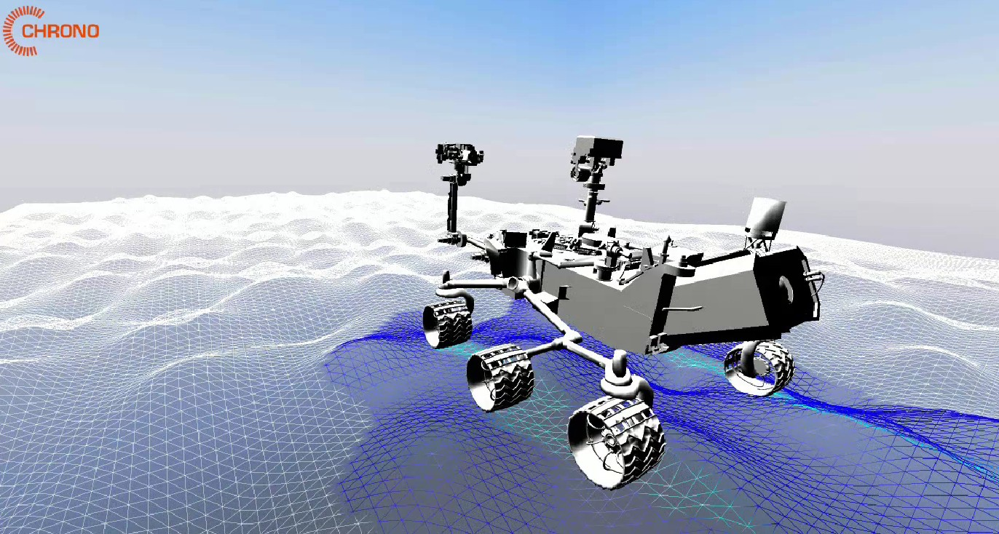
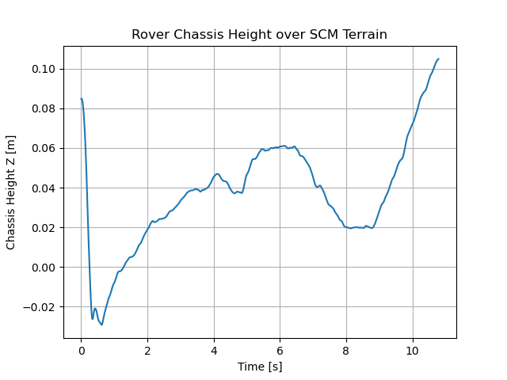
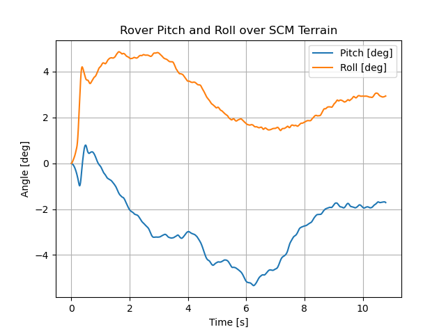

# 2.3.2 Curiosity Rover 화성 지형 주행 시스템 구현

## 2.3.2.1 시스템 구성

본 예제는 Chrono::Vehicle의 Terrain 계열 클래스와 Chrono::Robot 모델을 이용하여 화성 지형 환경에서의 Curiosity Rover 주행 특성을 분석하기 위해 수행하였다. 충돌 실험과 달리 본 실험의 목적은 지형 형상이 차량 거동에 미치는 영향을 확인하는 것이므로 강체 지형 모델인 `veh.RigidTerrain(system)` 대신 `veh.SCMTerrain(system)`을 사용하였다.

좌표계는 Chrono::Vehicle/Chrono::Robot에서 사용하는 ISO 차량 관례에 맞춰 X-forward, Y-left, Z-up을 기준으로 두었다. 따라서 화성 중력은 world frame의 -Z 방향으로 설정하며, height, pitch, roll 결과도 이 기준에서 해석한다.

SCMTerrain은 Soil Contact Model 기반의 지반 모델로서 Heightmap을 이용하여 다양한 형태의 비정형 지형을 생성할 수 있다. 본 프로젝트에서는 단순 평면 지형이나 기본 예제 지형을 사용하는 대신 Heightmap 생성 코드를 작성하여 돌출부와 함몰부가 반복적으로 나타나는 화성형 지형을 구현하였다. 이를 통해 Curiosity Rover가 다양한 경사면과 요철을 통과하도록 구성하였다.

또한 실제 Curiosity Rover의 운용 환경을 고려하기 위해 중력을 지구 중력인 9.81 m/s²가 아닌 화성 중력인 3.71 m/s²로 설정하였다. 이를 통해 실제 화성 환경과 유사한 조건에서 로버의 거동을 분석할 수 있도록 하였다.

로버는 Chrono Robot Module에서 제공하는 `robot.Curiosity(system)` 모델을 사용하였다. Curiosity Rover는 NASA 화성 탐사 로버를 기반으로 제작된 모델로서 6륜 구조와 Rocker-Bogie 서스펜션을 포함하고 있다. 또한 `robot.CuriositySpeedDriver()`를 이용하여 일정 속도로 직진하도록 설정하여 반복 가능한 주행 조건을 구성하였다.

본 시스템은 Terrain Component(SCMTerrain), Rover Component(Curiosity Rover), Gravity Component(화성 중력), Heightmap Component를 조합하여 구성하였다. 이를 통해 Command 단계에서 학습한 Terrain, Robot, Environment 관련 기능들이 실제 행성 탐사 시뮬레이션 시스템으로 연결되는 과정을 확인할 수 있었다.

| Command 단계 | Component 단계 | System에서의 역할 | 확인 산출물 |
|---|---|---|---|
| `veh.SCMTerrain(system)` | SCMTerrain Component | 바퀴와 지반 사이의 변형 접촉 계산 | SCM 활성 영역 렌더 |
| Heightmap 생성 및 입력 | Heightmap Component | crater와 요철을 가진 화성형 지형 형상 제공 | heightmap 이미지 |
| `SetGravitationalAcceleration()` | Gravity / Environment Component | 지구가 아닌 화성 중력 조건 적용 | 실행 조건 메타데이터 |
| `robot.Curiosity(system)` | Rover Component | 6륜 rocker-bogie 로버 모델 제공 | 주행 렌더 이미지 |
| `robot.CuriositySpeedDriver()` | Driver Component | 일정 속도 주행 조건 설정 | 주행 조건 로그 |
| `GetPos`, 자세 변환, CSV 출력 | State Logger Component | 차체 높이, pitch, roll 추출 | 높이/자세 그래프 |

## 2.3.2.2 Heightmap 기반 지형 생성

SCMTerrain을 이용하여 화성 지형을 구현하기 위해 Heightmap 기반 지형 생성 기법을 사용하였다. Heightmap은 각 픽셀의 밝기값을 지형의 높이로 해석하는 방식으로 동작하며, Chrono는 해당 이미지를 이용하여 3차원 지형을 생성할 수 있다. 본 프로젝트에서는 단순 평면 지형이 아닌 실제 화성 표면과 유사한 환경을 구현하기 위하여 Heightmap 생성 코드를 직접 작성하였다. 생성 과정에서는 crater 형태의 함몰부와 돌출부를 반복적으로 생성하여 다양한 요철을 가지는 지형을 구성하였다. 또한 Gaussian 분포를 이용하여 자연스러운 경사면이 형성되도록 하였으며, 급격한 높이 변화 대신 실제 지형과 유사한 완만한 형상이 나타나도록 설계하였다.

그림은 시뮬레이션에 사용된 Heightmap 이미지이다. 밝은 영역은 상대적으로 높은 지형을 의미하며, 어두운 영역은 낮은 지형 또는 crater 형태의 함몰부를 의미한다. 생성된 Heightmap은 PNG 형식으로 저장한 후 SCMTerrain에 입력하여 실제 주행 지형으로 사용하였다. 이를 통해 Chrono::Vehicle의 Terrain 계열에서 제공하는 기본 지형뿐 아니라 사용자가 직접 설계한 지형을 시뮬레이션에 적용할 수 있음을 확인하였다.

## 2.3.2.3 SCM 결과 해석

SCMTerrain 시뮬레이션에서는 로버 바퀴가 지나간 영역에 하늘색 영역과 파란색 영역이 생성된다.

하늘색 영역은 로버가 실제로 주행한 영역을 나타내며, 파란색 영역은 SCM 계산이 활성화된 영역을 의미한다. 즉, 바퀴와 지반 사이의 접촉 계산이 수행되는 영역을 시각적으로 표시한 것이다.

이를 통해 단순히 로버가 이동하는 것이 아니라 Terrain Component와 Rover Component 사이에서 실제 접촉 및 하중 전달 계산이 수행되고 있음을 확인할 수 있었다.

또한 Heightmap 기반 지형을 적용함으로써 로버가 평탄한 지면이 아닌 실제 화성 환경과 유사한 비정형 지형을 통과하도록 구성할 수 있었으며, Chrono::Vehicle Terrain Component가 차량 거동에 직접적인 영향을 미치는 것을 확인할 수 있었다.

## 2.3.2.4 차체 높이 분석

주행 과정에서는 Curiosity Rover 차체 중심의 높이 데이터를 지속적으로 추출하였다.

위의 그래프를 통해 초기 구간에서 차체 높이가 급격히 감소하는 현상이 나타나는 것을 알 수 있다. 이는 로버를 지형 위에 안정적으로 배치하기 위해 초기 높이를 부여하였기 때문이며, 이후 중력에 의해 안정화되는 과정에서 발생한 현상이다.

초기 안정화 이후에는 지형 형상에 따라 차체 높이가 약 ±0.05 m 범위에서  지속적으로 변화하는 것을 확인할 수 있다. 이는 Heightmap으로 생성한 돌출부와 함몰부가 실제로 차량의 수직 방향 거동에 영향을 미치고 있음을 의미한다.

또한 그래프를 통해 로버가 지형 변화에 따라 반복적으로 상승과 하강을 수행하는 것을 확인할 수 있었으며, 이를 통해 Terrain Component와 Rover Component 사이의 상호작용을 정량적으로 분석할 수 있었다.

## 2.3.2.5 Pitch / Roll 분석

주행 과정에서는 차체의 Pitch와 Roll 데이터도 함께 추출하였다.

Pitch는 차량의 전후 방향 기울기를 의미하며 Roll은 좌우 방향 기울기를 의미한다.

위의 그래프를 통해 Curiosity Rover가 지형을 통과하는 동안 지속적인 자세 변화가 발생하는 것을 확인할 수 있다. 특히 Pitch 변화가 Roll 변화보다 크게 나타나는 경향을 보였는데, 이는 진행 방향을 따라 배치된 요철의 영향이 크게 작용하였기 때문으로 판단된다.

또한 Roll 변화는 좌우 지형 높이 차이에 의해 발생하였으며, 이를 통해 Heightmap 기반 지형이 실제 차량 자세 변화에 영향을 미치는 동적 지형으로 작동하고 있음을 확인할 수 있었다.

Pitch 및 Roll 데이터는 단순한 차량 이동 여부를 확인하는 것이 아니라 차량의 주행 안정성과 지형 적응 능력을 평가하는 데 활용할 수 있는 중요한 지표임을 확인할 수 있었다.

## 2.3.2.6 구현 결과 및 의의

본 예제는 Chrono::Vehicle의 Terrain 계열 클래스와 Chrono::Robot 모델을 이용하여 실제 화성 탐사 환경을 모사한 사례이다.

Command 단계에서 학습한 SCMTerrain, Heightmap 생성, Curiosity Rover, 중력 설정 기능을 이용하여 Terrain Component, Rover Component, Environment Component를 구성하였으며, 이를 조합하여 하나의 화성 주행 시뮬레이션 시스템을 구현하였다.

실험 결과 Heightmap 기반 지형이 Curiosity Rover의 차체 높이와 자세 변화에 직접적인 영향을 미치는 것을 확인할 수 있었으며, Height, Pitch, Roll 데이터를 이용하여 차량 거동을 정량적으로 분석할 수 있었다.

또한 SCMTerrain을 이용하여 지형과 차량 사이의 상호작용을 시각적으로 확인할 수 있었으며, 단순한 차량 이동 시뮬레이션을 넘어 실제 행성 탐사 환경을 분석할 수 있는 수준의 시스템을 구현할 수 있었다.

이를 통해 Chrono는 단순한 물체 운동 시뮬레이터가 아니라 Chrono::Vehicle Terrain 계열, Chrono::Robot 모델, Contact Model을 결합하여 실제 공학적 문제를 분석할 수 있는 동역학 해석 플랫폼임을 확인할 수 있었다.
