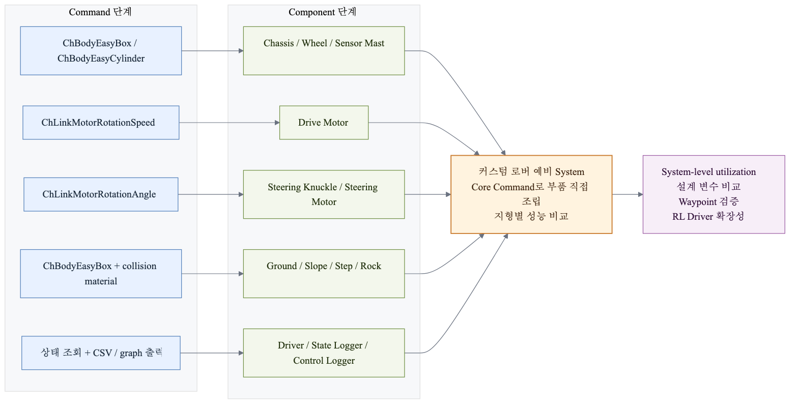

# 2.3.3 커스텀 로버 시스템 설계 목적

본 절은 앞선 2.1절과 2.2절에서 학습한 Project Chrono의 command 및 component 관련 지식을 바탕으로, 개별 기능 단위의 이해를 system 단위의 로버 설계와 주행 실험으로 확장하는 것을 목적으로 한다. 이를 위해 차체, 바퀴, 조향부, 구동부, 지형 환경, Driver를 하나의 통합 시뮬레이션 시스템으로 구성하고, 각 구성요소가 로버의 주행 성능에 미치는 영향을 확인하고자 하였다.

또한 본 실험은 2학기 캡스톤디자인 최종 주제 선정에 앞서 수행한 예비 실험 및 미니 프로젝트의 성격을 가진다. 다양한 지형 조건에서 커스텀 로버의 주행 성능을 평가하고, Waypoint Tracking 및 강화학습 기반 Driver의 적용 가능성을 확인함으로써 향후 환경 변수에 따른 최적 로버 설계와 같은 최종 연구 주제를 구체화하는 데 필요한 기초 자료를 확보하고자 하였다.

이를 위해 기존에 제공되는 완성형 차량 모델을 사용하는 대신 차체(Chassis), 바퀴(Wheel), 조향부(Knuckle), 구동 모터(Drive Motor), 시각화 구조물(Sensor Mast, Science Deck)을 각각 독립적인 강체(Body)와 조인트(Joint)로 구현하였다. 또한 설계한 로버의 성능을 평가하기 위해 평지, 경사면, 단차, 암석 장애물로 구성된 커스텀 장애물 환경을 구축하였으며, 사용자가 Driver 모드를 선택하여 다양한 주행 실험을 수행할 수 있도록 프로그램을 구성하였다.

커스텀 로버 System은 완성형 Robot 모델을 그대로 사용하는 2.3.1, 2.3.2와 달리 Core Command를 직접 조합한다. 따라서 이 절의 목적은 "Chrono 내장 모델을 실행할 수 있다"에서 한 단계 더 나아가, 로버를 구성하는 부품을 직접 설계하고 실험 조건에 맞게 교체할 수 있는 구조를 확보하는 것이다.

| 구현 목표 | 사용하는 주요 Command | 조합되는 Component | System 수준 의미 |
| --- | --- | --- | --- |
| 로버 구조 직접 설계 | `ChBodyEasyBox`, `ChBodyEasyCylinder` | Chassis, Wheel, Sensor Mast | 내장 모델이 아닌 custom rover 생성 |
| 바퀴 회전 구현 | `ChLinkMotorRotationSpeed` | Drive Motor, Wheel/Axle | 직진, 회전, pivot turn 실험 가능 |
| 전륜 조향 구현 | `ChLinkMotorRotationAngle`, joint frame | Steering Knuckle, Steering Motor | Ackermann 조향 구조 구현 |
| 장애물 환경 구성 | `ChBodyEasyBox`, collision material | Ground, Slope, Step, Rock Obstacle | 다양한 지형 조건 비교 |
| 주행 성능 평가 | 상태 조회, CSV/graph 출력 | State Logger, Control Logger | yaw, roll, pitch, trajectory 분석 |

*그림 2.3.3-1. Core Command로 직접 설계한 커스텀 로버 System의 예비 조합 구조*
