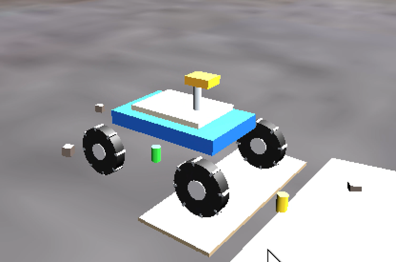
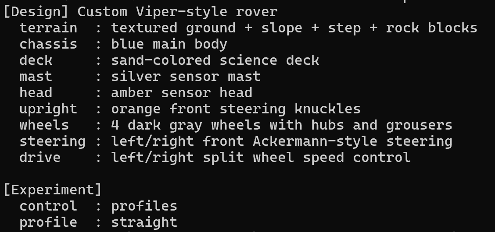

# 2.3.4 커스텀 로버 설계

## 2.3.4.1 전체 구조

로버는 차체(Chassis)를 중심으로 전륜 조향부(Front Steering System), 사륜 구동부(Four-Wheel Drive System), 그리고 센서 구조물(Sensor Assembly)로 구성된다. 주요 구성요소는 Main Chassis, Front Steering Knuckle, Front Wheel(Left/Right), Rear Wheel(Left/Right), Drive Motor, Steering Motor, Science Deck, Sensor Mast 및 Sensor Head이다.

메인 차체는 로버의 기준 프레임 역할을 수행하며, 전륜에는 조향을 위한 Knuckle과 Steering Motor를 배치하고 후륜을 포함한 모든 바퀴에는 Drive Motor를 적용하여 사륜 구동 구조를 구현하였다. 또한 실제 탐사 로버의 형상을 모사하기 위해 Science Deck, Sensor Mast, Sensor Head를 추가하였다.

전체 구조는 아래 그림과 같이 차체를 중심으로 전륜 조향(Front Steering)과 사륜 구동(Four-Wheel Drive) 방식을 채택하여 설계하였다.

| 전체 로버 형상 | 구동/조향 구조 확인 |
| --- | --- |
|  |  |

## 2.3.4.2 차체 설계

메인 차체는 직육면체(Box) 형상의 강체로 설계하였다.

| Parameter | Value |
| --- | --- |
| Length | 1.18 m |
| Width | 0.74 m |
| Height | 0.14 m |
| Density | 460 kg/m³ |

차체는 로버의 기준 프레임 역할을 수행하며, 모든 조향부와 구동부가 차체에 연결된다. Chrono의 ChBodyEasyBox를 이용하여 생성하였으며, 밀도 기반 질량 계산을 사용하여 관성 모멘트가 자동으로 산출되도록 구성하였다.

## 2.3.4.3 바퀴 설계

로버는 총 4개의 바퀴를 사용한다.

| Parameter | Value |
| --- | --- |
| Radius | 0.24 m |
| Width | 0.11 m |
| Density | 720 kg/m³ |

각 바퀴는 `ChBodyEasyCylinder`를 이용하여 생성하였다. 바퀴 중심은 지면과 자연스럽게 접촉하도록 `z = wheel_radius` 조건으로 배치하였다. 실제 지형과의 충돌 및 접촉력 계산은 원통형 Wheel Body가 담당한다.

## 2.3.4.4 전륜 조향 시스템

본 로버는 자동차와 유사한 전륜 조향 방식을 사용한다. 이를 위해 차체와 앞바퀴 사이에 Knuckle Body를 추가하였다.

Knuckle은 다음 역할을 수행한다.

* 조향 회전축 제공
* 차체와 바퀴 연결
* 조향 모터 부착

조향은 `ChLinkMotorRotationAngle`을 이용하여 구현하였다.

조향 입력이 발생하면 좌우 전륜 조향각을 각각 계산하며 Ackermann Steering Geometry를 적용하여 회전 시 타이어 슬립을 최소화하도록 하였다. Ackermann 조향 기법은 내측 바퀴와 외측 바퀴의 조향각을 다르게 설정하여 회전 시 타이어 슬립을 최소화하는 방식이다. 이를 통해 급격한 회전 상황에서도 보다 안정적인 궤적 추종이 가능하다.

## 2.3.4.5 구동 시스템

구동 방식은 Four-Wheel Drive (4WD)를 채택하였다. 각 바퀴에는 `ChLinkMotorRotationSpeed` 기반 회전 속도 모터가 연결되어 있다. 구동 모터는 목표 속도에 따라 각 바퀴의 각속도를 계산하여 전달한다. 본 연구에서는 두 가지 회전 방식을 지원한다.

### Normal Steering Mode

좌우 바퀴 속도 차이를 최소화하여 일반적인 차량 조향 특성을 구현한다.

### Pivot Turn Mode

좌우 바퀴 속도 차이를 크게 증가시켜 제자리 회전에 가까운 기동을 수행한다. 이를 통해 좁은 공간에서의 방향 전환 능력을 향상시킬 수 있다.

## 2.3.4.6 시각화 구조물 설계

실제 탐사 로버 형상을 모사하기 위해 다음 부품을 추가하였다. 이 부품들은 Collision을 비활성화하고 ChLinkLockLock 조인트를 통해 차체에 고정하였다. 따라서 동역학 계산에는 영향을 주지 않으며 시각적 표현만 담당한다.

- Science Deck: 상부 장비 탑재 공간
- Sensor Mast: 카메라 및 센서 지지 구조
- Sensor Head: 탐사 센서 모듈
