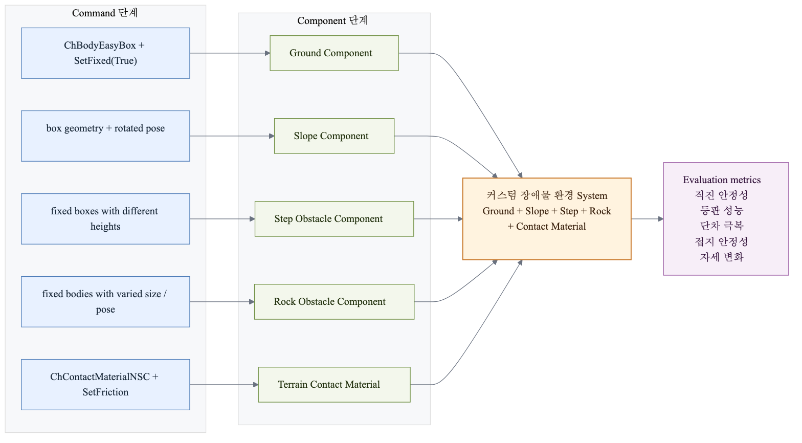
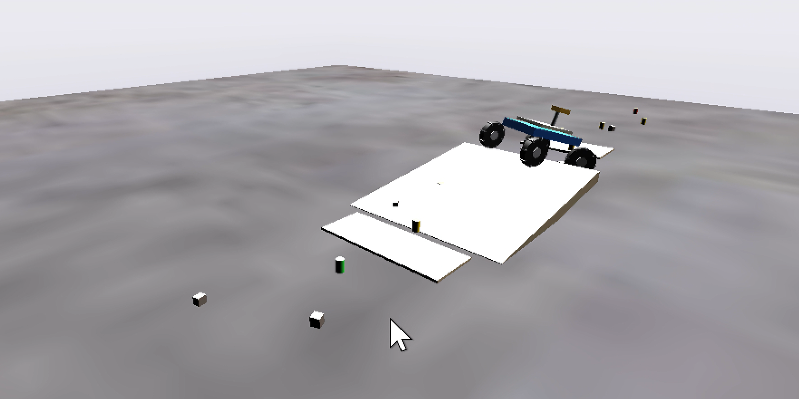

# 2.3.5 커스텀 환경 시스템 설계

커스텀 환경 System은 로버의 주행 성능을 여러 조건에서 비교하기 위해 Ground, Slope, Step, Rock Obstacle Component를 조합한 것이다. 각 장애물은 별도의 물체로 만들지만, System 관점에서는 모두 같은 지형 실험장 안에 배치되어 로버의 등판, 단차 극복, 접지 안정성, 자세 변화를 평가하는 역할을 한다.

| 환경 요소 | 사용 Command | Component 의미 | System에서 평가하는 항목 |
| --- | --- | --- | --- |
| 평지 | `ChBodyEasyBox`, `SetFixed(True)` | Ground Component | 기본 직진 안정성, 조향 응답 |
| 경사면 | box geometry + 회전 pose | Slope Component | 등판 성능, pitch 변화 |
| 단차 | 높이가 다른 fixed box | Step Obstacle Component | 단차 극복, wheel contact 유지 |
| 암석 장애물 | 크기/위치/회전이 다른 fixed body | Rock Obstacle Component | 비정형 지형 적응성 |
| 접촉 재질 | `ChContactMaterialNSC`, `SetFriction` | Terrain Contact Material | 마찰 조건과 접지력 |

*그림 2.3.5-1. Ground, Slope, Step, Rock Obstacle, Contact Material을 조합한 커스텀 환경 System 구조*

## 2.3.5.1 기본 평지 환경

기본 지면은 다음과 같이 생성하였다.

| Parameter | Value |
| --- | --- |
| Length | 30 m |
| Width | 30 m |
| Thickness | 1 m |

*표 2.3.5-1. 기본 평지 환경 파라미터*

지면 마찰계수는 0.9로 설정하였다. 이를 통해 일반적인 토양 환경 수준의 접지력을 제공하고, 평지 조건에서 로버의 기본 직진 안정성 및 조향 응답을 평가할 수 있도록 하였다.

## 2.3.5.2 커스텀 장애물 환경

### 경사면 환경

등판 성능을 평가하기 위해 경사로를 추가하였다. 경사면은 차체 Pitch 변화와 접지력 변화를 확인하기 위한 목적으로 설계하였으며, 로버가 경사 지형에서 안정적으로 추진력을 유지할 수 있는지 검토하는 데 활용하였다.

| Parameter | Value |
| --- | --- |
| Angle | 6° |
| Length | 3.2 m |
| Width | 2.4 m |

*표 2.3.5-2. 경사면 환경 파라미터*

### 단차 장애물

장애물 극복 성능을 확인하기 위해 두 개의 단차를 생성하였다. 단차 통과 시 휠 접촉 상태, 차체 자세 변화, 주행 안정성을 평가할 수 있으며, 바퀴 반경과 구동력 설계가 장애물 극복 성능에 미치는 영향을 분석하는 데 활용할 수 있다.

| Obstacle | Height |
| --- | --- |
| Step 1 | 3.5 cm |
| Step 2 | 4.5 cm |

*표 2.3.5-3. 단차 장애물 높이*

### 암석 장애물

실제 비정형 지형을 모사하기 위해 다수의 Rock Block을 생성하였다. 각 장애물은 크기, 위치, 회전각을 서로 다르게 설정하여 불규칙 지형 환경을 재현하였다. 이러한 지형 요소들은 단순 평지 주행만으로는 확인하기 어려운 등판 성능, 접지 안정성, 바퀴-지면 접촉 변화, 차체 자세 변화를 평가하기 위해 구성하였다.

*그림 2.3.5-2. 평지, 경사면, 단차, 암석 장애물로 구성한 커스텀 환경 장면*

| 환경 | 구성 |
| --- | --- |
| Flat | 30 m × 30 m 평지 |
| Slope | 6° 경사면 |
| Step | 3.5 cm, 4.5 cm 단차 |
| Rock | 불규칙 암석 장애물 |

*표 2.3.5-4. 커스텀 환경 구성 요약*
