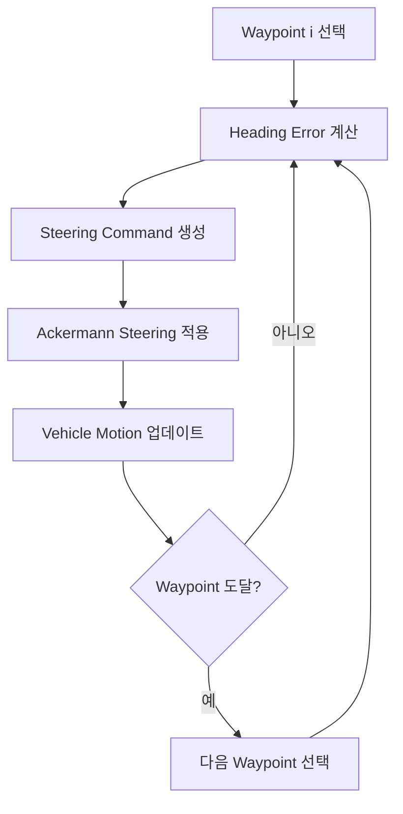

# 2.3.6 주행 실험

본 실험에서는 설계한 로버의 기동 성능과 지형 적응성을 검증하기 위하여 총 6개의 주행 실험을 수행하였다. 평지 환경에서는 직진 및 조향 특성을 평가하였으며, 장애물 환경에서는 Waypoint Tracking 기반 자율주행 성능을 분석하였다. 또한 Gymnasium 기반 PPO 강화학습 Driver를 적용하여 강화학습을 통한 로버 제어 가능성을 검증하였다. 각 실험의 목적 및 평가 항목은 아래 표에 정리하였다.

| 구분 | 실험 | 지형 | 입력 조건 | 평가 항목 | 목적 |
| --- | --- | --- | --- | --- | --- |
| 실험1 | 직진 안정성 (Straight Driving Test) | 평지 환경 | 일정 속도 직진 | 횡방향 편차, Yaw 변화, 차체 안정성 | 구동계 좌우 균형 및 기본 주행 안정성 평가 |
| 실험2 | Step Steering Test | 평지 환경 | 계단형 조향 입력 | 조향 응답 시간, 회전 반경, Yaw 응답 | 조향 시스템의 응답 특성 평가 |
| 실험3 | Slalom Profile Test | 평지 환경 | 반복 좌우 조향 입력 | 경로 추종 성능, 조향 안정성 | 연속 조향 상황에서의 주행 성능 평가 |
| 실험4 | Pivot Turn / Spin Test | 평지 환경 | 좌우 바퀴 속도 차 부여 | 회전 반경, 회전 속도, 기동성 | 제자리 회전 및 차동 구동 성능 평가 |
| 실험5 | 장애물 통과 실험 (Obstacle Traversal Test) | 장애물 환경 | Waypoint Tracking | 등판 성능, 단차 극복, 접지 안정성 | 복합 지형 적응성 및 종합 주행 성능 평가 |
| 실험6 | 강화학습 기반 주행 실험 (PPO RL Driver Test) | 평지 환경 | PPO Policy 기반 속도·조향·turn mode 제어 | waypoint 도달률, 목표점 오차, 주행 거리, 평균 속도, 정체 여부 | 강화학습 기반 자율주행 제어 적용 가능성 및 초기 policy 성능 평가 |

## 2.3.6.1 평지 환경 주행 성능 평가

### 실험 1. 직진 안정성 평가 결과 (Straight Driving Test)

로버는 일정 속도 입력에 대해 직선 경로를 안정적으로 유지하며 주행하였다. Yaw 변화와 횡방향 편차가 거의 발생하지 않아 차체의 좌우 균형과 구동계의 안정성이 양호함을 확인하였다. 또한 Roll 및 Pitch 변화가 매우 작아 평지 환경에서 안정적인 주행 성능을 보였다.

|  |  |  |
| --- | --- | --- |

### 실험 2. Step Steering Test

계단형 조향 입력이 인가된 이후 로버는 새로운 방향으로 부드럽게 선회하며 안정적으로 응답하였다. 급격한 진동이나 불안정한 거동 없이 목표 조향각에 수렴하는 모습을 보였으며, 조향 시스템이 정상적으로 동작함을 확인하였다. 이를 통해 전륜 조향 구조와 Ackermann 조향 기법의 효과를 검증할 수 있었다.

|  |  |  |
| --- | --- | --- |

### 실험 3. Slalom Profile Test

반복적인 좌우 조향 입력에 따라 로버는 S자 형태의 경로를 안정적으로 추종하였다. 연속적인 방향 전환 과정에서도 큰 자세 불안정 현상은 발생하지 않았으며, 조향 명령에 대한 응답성이 양호하게 나타났다. 이를 통해 곡선 주행 및 경로 추종 성능을 확인하였다.

|  |  |  |
| --- | --- | --- |

### 실험 4. Pivot Turn / Spin Test

좌우 바퀴 속도 차를 이용한 Pivot Turn 실험 결과, 로버는 작은 회전 반경으로 방향 전환이 가능하였다. 일반 조향 방식보다 높은 기동성을 보였으며, 제한된 공간에서의 방향 전환 능력을 확인할 수 있었다. 이를 통해 차동 구동 기반 회전 기능이 정상적으로 구현되었음을 검증하였다.

|  |  |  |
| --- | --- | --- |

## 2.3.6.2 장애물 환경 Waypoint Tracking (실험 5)

본 실험에서는 GPS 기반 자율주행과 유사한 Waypoint Tracking 방식을 사용하였다. 로버는 미리 정의된 다음의 목표점들을 순차적으로 방문한다.

(0.0,0.0) → (1.4,0.0) → (2.8,0.55) → … → (11.8,0.0)

경로는 X축 방향으로 전진하면서 Y축 방향으로 좌우 이동하는 Slalom 형태로 구성하였다. 로버는 현재 위치와 목표 Waypoint의 오차를 계산하여 조향 명령을 생성한다. 이를 통해 직진 성능, 곡선 추종 성능 그리고 장애물 회피 성능을 동시에 평가 가능하다.

Waypoint Tracking 제어 흐름은 다음과 같이 정리할 수 있다.

|  |  |
| --- | --- |

로버는 사륜 구동과 전륜 조향 구조를 사용하며, Ackermann 조향 기법을 적용하여 안정적인 주행이 가능하도록 설계하였다. 또한 평지, 경사면, 단차, 암석 장애물로 구성된 시험 환경과 Waypoint 기반 자율주행 알고리즘을 구현함으로써 향후 환경 변수에 따른 최적 로버 설계 연구를 수행할 수 있는 기반 플랫폼을 구축하였다.

## 2.3.6.3 강화학습 Driver (실험 6)

본 실험에서는 기존 Waypoint 기반 규칙 제어 방식과 더불어 강화학습 적용 가능성을 검증하기 위해 PPO(Proximal Policy Optimization) 기반 RL Driver를 구현하였다. 이를 위해 로버의 위치, 자세, 목표점 정보 등을 상태(State)로 구성하고, 강화학습 정책이 생성한 속도 명령(speed command), 조향 명령(steering command), 회전 모드(turn mode)를 차량 제어 입력으로 사용하도록 Gymnasium 환경을 구축하였다.

학습된 정책을 이용한 주행 실험 결과, 로버는 초기 Waypoint 방향으로 이동하며 기본적인 경로 추종 행동을 보였으나 전체 경로를 완주하지는 못하였다. 약 15초 동안 주행하여 총 4.35 m를 이동하였으며, 세 번째 Waypoint를 추적하는 과정에서 목표점까지 약 1.10 m의 오차를 남긴 채 정체되는 현상이 관찰되었다. 반면 차체의 Roll 및 Pitch 변화는 각각 0.40°, 0.67° 이하로 유지되어 자세 안정성은 양호한 것으로 확인되었다. 이는 PPO 학습을 10,000 timestep만 수행한 초기 결과이며, 정책 성능 검증보다는 강화학습 적용 가능성 확인에 목적이 있다.

실험 결과 현재 정책은 경로 추종 능력이 제한적이며, 보상 함수 설계와 학습량이 충분하지 않아 아직 완전한 수렴 단계에는 도달하지 못한 것으로 판단된다. 그러나 PPO 기반 강화학습 파이프라인이 정상적으로 구축되었고, 로버 제어에 강화학습을 적용할 수 있음을 확인하였다. 향후에는 학습 시간 증가, 보상 함수 개선, Curriculum Learning 적용 등을 통해 경로 추종 성능을 향상시킬 예정이다.

|  |  |
| --- | --- |

### PPO 학습의 한계

PPO policy는 초기 waypoint 방향으로 이동하는 기본 행동은 일부 학습하였으나, 다중 waypoint를 안정적으로 완주할 수준까지 수렴하지 못하였다. 이는 학습 timestep이 약 10,000 step으로 제한되어 episode 수가 충분하지 않았고, 초기 action space에 speed, steering, turn\_mode가 동시에 포함되어 탐색 난이도가 높았기 때문으로 판단된다. 또한 reward 함수에 정체 상황을 직접적으로 벌주는 항이 없어, 목표점 접근 중 속도 명령이 감소하며 정체되는 국소 최적해(local optimum)이 발생한 것으로 보인다.

### 향후 개선 사항

향후 연구에서는 PPO policy의 성능 향상을 위해 학습 timestep을 충분히 증가시키고, 목표점 접근 보상과 정체 penalty를 포함하도록 reward 함수를 개선할 필요가 있다. 또한 초기 학습 단계에서는 turn mode를 고정하여 action space를 단순화하고, 이후 점진적으로 회전 모드와 장애물 지형을 포함하는 curriculum learning 방식을 적용할 수 있다. 이를 통해 로버가 단순 평지 주행에서 다중 waypoint 추종 및 복합 지형 주행까지 단계적으로 학습하도록 개선할 계획이다.
