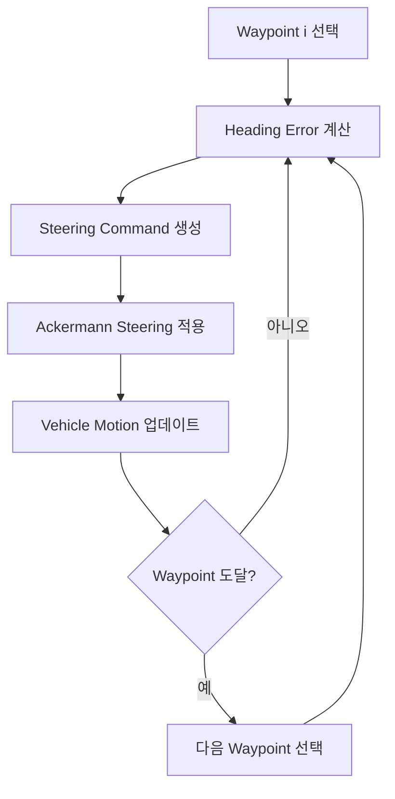

2026학년도 1학기 캡스톤디자인 보고서  
프로젝트 크로노

**서론**  
**1.1 프로젝트 개요**  
**1.2 프로젝트 목적**

**본론**  
# 2.1 Command: Chrono 기능 분류와 사용법 - 진성님

# 2.1.1 System

`ChSystem`은 Chrono 시뮬레이션의 최상위 컨테이너이다. 시뮬레이션에 사용되는 강체, 조인트, 링크, 힘, 접촉 조건, 솔버 등이 모두 `ChSystem` 내부에 포함된다. 사용자는 먼저 시스템을 생성한 뒤, 여기에 물체와 구속 조건을 추가하고, `DoStepDynamics(dt)`를 반복 호출하여 시간을 전진시켜 상태를 업데이트 한다.

Chrono에서는 접촉 처리 방식에 따라 대표적으로 `ChSystemNSC`와 `ChSystemSMC`를 사용한다. `ChSystemNSC`는 Non-Smooth Contact 방식으로, 접촉을 상보성 조건 기반으로 처리한다. 일반적인 강체 접촉 문제에서 비교적 빠르게 사용할 수 있다. 반면 `ChSystemSMC`는 Smooth Contact 방식으로, 접촉을 스프링-댐퍼 형태의 페널티 힘으로 처리한다. 이 방식은 고무, 타이어, FEA 연동 등 더 부드러운 접촉 모델이 필요한 경우에 적합하다.

주요 함수는 다음과 같다.

| 메서드 | 설명 | 기타 |
| --- | --- | --- |
| AddBody(body) / Add(body) | 강체 추가 |  |
| Add(link) | 조인트/링크 추가 |  |
| Add(shaft) | 1D 회전축 추가 |  |
| DoStepDynamics(dt) | 시간을 dt초만큼 전진 |  |
| GetChTime() | 현재 시뮬레이션 시간 |  |
| GetBodyCount() | 시스템 내 물체 수 |  |
| SetGravitationalAcceleration(v) | 중력 벡터 설정 |  |
| GetGravitationalAcceleration() | 중력 벡터 조회 |  |
| SetSolverType(type) | 솔버 변경 | 아래 참조 |
| SetTimestepperType(type) | 적분기 변경 | EULER\_IMPLICIT\_LINEARIZED(기본값, 빠르고 안정적, 1차, 반복불필요), HHT,(정밀, 수치 감쇠 조절 가능, 2차, 반복필요) NEWMARK(FEA에서 주로 사용, 1차, 반복필요) 사용 가능 |
| SetMaxPenetrationRecoverySpeed(v) | 관통 복원 속도 제한 |  |
| SetMinBounceSpeed(v) | 최소 반발 속도 임계값 |  |

사용 가능한 솔버는 다음과 같다.

| 솔버 | 정밀도 | 속도 | NSC 지원 | FEA 지원 |
| --- | --- | --- | --- | --- |
| PSOR | 보통 | 빠름 | O | X |
| APGD | 높음 | 보통 | O | X |
| BARZILAIBORWEIN | 높음 | 보통 | O | X |
| MINRES | 높음 | 느림 | X | O |
| PardisoMKL | 최고 | 느림 | O | O |

System 사용에서 중요한 점은 Chrono의 기본 중력이 자동으로 설정되어 있지 않을 수 있다는 것이다. 따라서 일반적인 낙하, 접촉, 차량 주행 문제를 구성할 때는 반드시 `SetGravitationalAcceleration()`을 사용하여 중력을 설정해야 한다.

또한 시뮬레이션은 `DoStepDynamics(dt)` 호출을 통해 진행되며, 시간 간격 `dt`는 해석 정확도와 계산 속도에 직접적인 영향을 준다. 일반적인 확인용 시뮬레이션에서는 0.005 s 수준을 사용할 수 있고, 더 정밀한 접촉이나 고주파 진동이 포함된 경우에는 더 작은 시간 간격이 필요하다.

# 2.1.2 Collision

Chrono는 단순히 두 물체가 닿았는지를 감지해 화면에 보여주는 도구가 아니라, 접촉 지점에서 발생하는 힘, 마찰, 반발, 충격량까지 계산할 수 있는 물리 시뮬레이션 엔진이다. Collision 기능을 사용하면 물체의 형상, 접촉 재질, 충돌 방식(NSC/SMC), 충돌 활성화 여부를 명시적으로 정의할 수 있다.

Chrono에서 물체 충돌을 구현하기 위해서는 다음 요소를 결정해야 한다.

| 조건 | 코드 | 설명 |
| --- | --- | --- |
| 충돌 시스템의 설정 | sys.SetCollisionSystemType(...)   | collision의 종류 설정 |
| 접촉 재질 생성 | chrono.ChContactMaterialNSC() | 마찰, 반발 계수 등 |
| 충돌 형상 추가 | body.AddCollisionShape(...) | 물리 계산용 형상 |
| 충돌 활성화 | body.EnableCollision(True) | 이 body가 충돌 계산에 참여 |

Collision 방식으로는 NSC(Non-Smooth Contact)와 SMC(Smooth Contact)를 선택할 수 있다. NSC는 물체를 강체로 설정하고 변형이 없다고 가정하여 접촉을 처리한다. 반대로 SMC는 접촉면 변형을 허용하며, 충돌 시 침투량에 비례한 penalty method로 접촉력을 계산한다.
NSC의 경우 ChSystemNSC()로 시스템을 불러오며 ChContactMaterialNSC()로 재질을 설정하게 된다.
SMC의 경우 ChSystemSMC()로 시스템을 불러오며 ChContactMaterialSMC()로 재질을 설정하게 된다.
단, 시스템과 재질 설정은 서로 섞지 않는 것이 좋다.

Collision에 사용될 물체의 재질은 사용자가 직접 정의할 수 있다. PyChrono에서는 `mat.SetFriction(mu)`처럼 접촉 재질 객체의 setter method로 값을 지정한다.
대표적 속성으로는 다음이 있다.

| 속성 | 메서드 | 의미 |
| --- | --- | --- |
| 마찰 | SetFriction(mu) | 정지/동마찰을 같은 값으로 설정 |
| 정지 마찰 | SetStaticFriction(mu) | 미끄러지기 전 버티는 정도 |
| 동마찰 | SetSlidingFriction(mu) | 미끄러지는 중 저항 |
| 반발 | SetRestitution(e) | 튕기는 정도 |
| 구름 저항 | SetRollingFriction(r) | 굴러가는 물체의 저항 |
| 스핀 저항 | SetSpinningFriction(r) | 접촉점에서 회전 저항 |

Collision에 사용될 물체의 형상 또한 사용자가 정의할 수 있다. 일반적으로 `chrono.ChCollisionShape...` 계열 객체를 만들고 body에 추가한다.
대표적 속성으로는 다음이 있다.

| 형상 | 클래스 |
| --- | --- |
| 상자 | ChCollisionShapeBox |
| 구 | ChCollisionShapeSphere |
| 실린더 | ChCollisionShapeCylinder |
| 캡슐 | ChCollisionShapeCapsule |
| 삼각 메시 | ChCollisionShapeTriangleMesh |

또는 `ChBodyEasy*` 계열을 사용하면 질량, 관성, 시각화 형상, 충돌 형상을 한 번에 만들 수 있다. 예를 들어 구체는 `chrono.ChBodyEasySphere(radius, density, True, True, mat)` 형태로 생성할 수 있다.

# 2.1.3 Force Spring

물체의 운동 상태를 바꾸는 직접적인 원인은 힘과 토크이며, 스프링과 댐퍼는 이러한 힘을 생성하는 대표적인 요소이다.
Chrono는 물체의 위치를 단순히 애니메이션처럼 이동시키는 것이 아니라, 힘-가속도-속도-위치의 계산 과정을 통해 운동을 해석한다.
Chrono에서 DoStepDynamics(dt)를 호출할 경우 다음과 같은 과정을 내부적으로 수행한다.

1. 현재 시간에서의 물체 상태 확인
2. 중력, 접촉력, 스프링 힘 등 모든 힘 계산
3. 제약 조건 및 접촉 조건 계산
4. 운동방정식 구성
5. 수치 적분을 통해 다음 상태 계산
6. 시간을 dt만큼 증가
7. 위 과정 반복

스프링은 Hooke 법칙에 따라 `F = -k x`로 표현된다. 여기서 `k`는 스프링 강성, `x`는 기준 길이에서 벗어난 변위이다. 댐퍼는 상대 속도 `v`에 비례하는 `F = -c v` 형태로 표현된다.
따라서 스프링과 댐퍼가 함께 있는 시스템의 힘은 `F = -k x - c v`로 정리할 수 있다.
병진 방향 스프링-댐퍼(TSDA: Translational Spring Damper Actuator)는 `chrono.ChLinkTSDA()`로 생성하며, 주요 설정 method는 다음과 같다.

| 코드 | 의미 |
| --- | --- |
| ChLinkTSDA() | TSDA 객체 생성 |
| spring.Initialize(bodyA, bodyB, False, pointA, pointB) | 연결할 두 물체와 연결점 설정 |
| spring.SetRestLength(rest\_length) | 기준 길이 설정 |
| spring.SetSpringCoefficient(k) | 스프링 강성 설정 |
| spring.SetDampingCoefficient(c) | 감쇠 계수 설정 |
| system.AddLink(spring) | Chrono 시스템에 추가 |

회전 방향 스프링-댐퍼(RSDA: Rotational Spring Damper Actuator)는 `chrono.ChLinkRSDA()`로 생성한다.

# 2.1.4 Joint and Links

링크는 두 강체 사이에 구속 조건을 부여하여 상대 운동을 제한한다. 예를 들어 회전 조인트는 두 물체 사이에서 하나의 축 방향 회전만 허용하고 나머지 자유도를 제거한다. Chrono에서는 이러한 링크를 통해 실제 기계 시스템의 힌지, 슬라이더, 볼조인트, 기어, 풀리 등을 모델링할 수 있다.

Chrono의 링크 계열은 크게 ChLinkMate, ChLinkLock, ChLinkMotor 및 독립 조인트 계열로 구분된다. ChLinkMate 계열은 비교적 빠르고 단순한 구속에 적합하며, ChLinkLock 계열은 조인트 한계와 마찰 등 더 많은 기능을 제공한다. ChLinkMotor 계열은 모터 또는 액추에이터 기능을 포함한다.

## 2.1.4.1 Mate 계열

| 클래스 | 제거 DOF | 허용 운동 |
| --- | --- | --- |
| ChLinkMateFix | 6 | 없음 (완전 고정) |
| ChLinkMateGeneric | 1\~6 | 선택적 구속 |

## 2.1.4.2 Lock 계열

| 클래스 | 제거 DOF | 허용 운동 | 실제 예시 |
| --- | --- | --- | --- |
| ChLinkLockLock | 6 | 없음 (용접) | 강체 결합 |
| ChLinkLockRevolute | 5 | 1축 회전 | 한계 있는 경첩 |
| ChLinkLockCylindrical | 4 | 1축 회전 \+ 1축 직선 | 실린더 피스톤 |
| ChLinkLockPrismatic | 5 | 1축 직선 | 슬라이더 |
| ChLinkLockSpherical | 3 | 3축 회전 | 볼조인트 (한계 가능) |
| ChLinkLockPlaneLock | 3 | 2축 직선 \+ 1축 회전 | 평면 위 이동 |
| ChLinkLockOldham | 4 | 2축 직선 | 올덤 커플링 |
| ChLinkLockGear | 1 | 기어비 구속 | 기어 맞물림 |
| ChLinkLockPulley | 1 | 풀리비 구속 | 벨트-풀리 |

## 2.1.4.3 Motor 계열

| 클래스 | 기능 | 입력 함수 |
| --- | --- | --- |
| ChLinkMotorRotationSpeed | 일정 각속도 회전 | SetSpeedFunction() |
| ChLinkMotorRotationAngle | 각도 궤적 추종 | SetAngleFunction() |
| ChLinkMotorRotationTorque | 토크 입력 | SetTorqueFunction() |
| ChLinkMotorLinearSpeed | 일정 속도 직선 | SetSpeedFunction() |
| ChLinkMotorLinearPosition | 위치 궤적 추종 | SetDistanceFunction() |
| ChLinkMotorLinearForce | 힘 입력 | SetForceFunction() |

조인트는 일반적으로 joint.Initialize() 함수를 통해 두 물체와 조인트 프레임을 지정하여 초기화한다. 이때 조인트 프레임의 위치와 방향은 어떤 축이 회전축 또는 병진축이 되는지를 결정하므로 매우 중요하다. 초기화 이후에는 반드시 sys.Add(joint) 또는 이에 해당하는 시스템 추가 함수를 통해 조인트를 시스템에 포함해야 한다. 그렇지 않으면 코드상으로 조인트 객체가 존재하더라도 실제 물리 계산에는 반영되지 않는다.

조인트에 걸리는 반력과 반토크는 GetReaction2() 등을 통해 확인할 수 있다. 이는 구조물 연결부 하중 확인, 모터 토크 검토, 구속 조건 검증 등에 사용할 수 있다. PyChrono에서는 GetReaction2()가 반환하는 객체의 힘과 토크를 .force, .torque 속성으로 접근한다.

# 2.1.5 Math

Chrono의 수학 도구는 벡터, 행렬, 쿼터니언, 함수 객체 등을 포함한다. 일반적인 PyChrono 사용에서는 `ChVector3d`, `ChQuaterniond`, `ChMatrix33d`, `ChFramed` 등이 주로 사용된다. 한편 팀 문서에서 정리한 `Multicore Math`는 Chrono Multicore 모듈 내부에서 사용되는 저수준 수학 자료형으로, 병렬 계산 효율을 위해 `real`, `real3`, `real4`, `quaternion`, `Mat33` 등의 자료형을 사용한다.

| Multicore Math | 일반 PyChrono 대응 | 설명 |
| --- | --- | --- |
| `real` | `float` 또는 scalar 값 | 기본 실수 값 |
| `real3` | `ChVector3d` | 3차원 벡터 값(x, y, z) |
| `real4` | 4성분 벡터 또는 quaternion 개념 | 4차원 벡터(4개의 실수) |
| `quaternion` | `ChQuaterniond` | 회전을 표현하는 자료형(scalar, vector, vector, vector) |
| `Mat33` | `ChMatrix33d` | 3 \* 3 matrix |

회전 표현에는 쿼터니언이 사용된다. 쿼터니언은 오일러각과 달리 짐벌락 문제가 없어 3차원 회전 시뮬레이션에 적합하다. PyChrono에서는 `ChQuaterniond`, `QuatFromAngleX()`, `QuatFromAngleY()`, `QuatFromAngleZ()`, `QuatFromAngleAxis()` 등을 이용해 회전을 정의할 수 있다. 또한 `ChFramed`는 위치와 회전을 함께 가진 프레임을 나타내며, 강체 위치, 조인트 프레임, 초기 조건 설정 등에 사용된다.

이외에도 다음과 같은 주요 수학 함수를 가진다.

| 함수 또는 연산 | 설명 |
| --- | --- |
| `Dot(a, b)` 또는 `a.Dot(b)` | 벡터 내적 |
| `Cross(a, b)` 또는 `a.Cross(b)` | 벡터 외적 |
| `GetNormalized()` | 단위 벡터 반환 |
| `Length()` | 벡터 크기 계산 |
| `Length2()` | 벡터 크기의 제곱 계산 |
| `Clamp()` | 값을 지정 범위 안으로 제한 |
| `SkewSymmetric()` | 외적 연산을 행렬 형태로 표현 |

예시는 다음과 같다.

```python
import pychrono as chrono

v = chrono.ChVector3d(3, 4, 0)
print(v.Length())
```

일반적인 차량 또는 로버 시뮬레이션 수준에서는 Multicore 내부 자료형을 직접 사용할 일은 많지 않다. 다만 접촉 solver, 병렬 충돌 검출, granular dynamics, GPU/CUDA 기반 계산 등 Chrono 내부 구조를 이해할 때 이러한 저수준 수학 자료형을 알고 있으면 유리하다.

# 2.1.6 Motors

Motor는 두 물체 사이에 상대 운동을 부여하거나, 특정 힘 또는 토크를 가하는 액추에이터 기능이다. Chrono의 모터는 크게 회전 모터와 선형 모터로 나눌 수 있으며, 다시 운동을 강제로 부여하는 방식, 속도를 부여하는 방식, 힘 또는 토크를 가하는 방식으로 구분된다.

| 구분 | 회전 모터 | 선형 모터 | 1D shaft 모터 |
| --- | --- | --- | --- |
| 변위/각도 입력 | `ChLinkMotorRotationAngle` | `ChLinkMotorLinearPosition` | `ChShaftsMotorPosition` |
| 속도 입력 | `ChLinkMotorRotationSpeed` | `ChLinkMotorLinearSpeed` | `ChShaftsMotorSpeed` |
| 하중 입력 | `ChLinkMotorRotationTorque` | `ChLinkMotorLinearForce` | `ChShaftsMotorLoad` |
| 드라이브라인 연결 | `ChLinkMotorRotationDriveline` | `ChLinkMotorLinearDriveline` | 해당 없음 |

회전 모터는 `ChLinkMotorRotation` 계열에서 파생되며, 기본적으로 모터 프레임의 Z축을 기준으로 상대 회전을 정의한다.

또한 회전에 의해 발생하는 회전 각도, 각속도, 각가속도는 각각 `GetMotorAngle()`, `GetMotorAngleDt()`, `GetMotorAngleDt2()`를 통해 그 값을 불러올 수 있다. 회전축의 구속 방식은 `SetSpindleConstraint()`로 설정할 수 있으며, 아래와 같은 옵션이 있다.

* FREE: 회전축에 정해진 제약조건(방향이나 정렬)이 없음
* REVOLUTE: x, y, z, rx, ry의 제약조건을 정함
* CYLINDRICAL: x, y, rx, ry의 제약조건을 정함
* OLDHAM: rx, ry의 제약조건을 정함

선형 모터는 `ChLinkMotorLinear` 계열에서 파생되며, 기본적으로 모터 프레임의 Z축 방향 병진 운동을 제어한다. 회전 모터와 비슷하게 선형 모터에 의해 발생하는 상대 위치, 속도, 가속도는 `GetMotorPos()`, `GetMotorPosDt()`, `GetMotorPosDt2()`로 불러올 수 있다. 선형 모터 역시 `SetGuideConstraint()`를 통해 가이드 구속 조건을 설정할 수 있으며, 다음과 같은 옵션을 사용할 수 있다.

* FREE: 롤러의 방향, 정렬에 제약조건을 두지 않음
* PRISMATIC: X, Y, RX, RY, RZ 제약조건을 둠(기본)
* SPHERICAL: X, Y 제약조건을 둠

대부분의 모터 입력은 `ChFunction`을 통해 정의된다. 예를 들어 일정 속도 모터는 상수 함수, 사인파 입력은 사인 함수, 시간에 따라 변하는 입력은 별도의 함수 객체를 사용하여 구현할 수 있다. 모터를 사용할 때의 일반적인 절차는 모터 객체 생성, `Initialize()`로 두 물체와 모터 프레임 연결, `ChFunction` 설정, 시스템에 추가의 순서이다.

# 2.1.7 Rigid Bodies

Rigid Body는 Chrono에서 변형을 고려하지 않는 강체 물체를 의미하며, 기본적으로 ChBody 클래스를 통해 표현된다. 강체는 3차원 공간에서 병진 3자유도와 회전 3자유도를 합쳐 총 6자유도를 가진다. Chrono 내부에서는 위치 3개와 쿼터니언 4개를 사용해 자세를 저장하지만, 쿼터니언은 단위 길이 조건을 가지므로 실제 회전 자유도는 3개이다.

강체를 생성하는 방식은 Collision과 마찬가지로 크게 두 가지로 나눌 수 있다.

| 방식 | 설명 |
| --- | --- |
| `ChBody` | 질량, 관성, 위치, 시각 형상, 충돌 형상을 사용자가 직접 설정 |
| `ChBodyEasy*` | 상자, 구, 실린더 등 기본 형상을 지정하면 질량과 관성을 자동 계산 |

`ChBody`를 사용할 경우 물체의 질량, 관성, 위치, 자세, 속도 등을 직접 설정한다. 예를 들어 위치는 `body.SetPos(chrono.ChVector3d(0, 10, 0))`처럼 `body.Set...()` 형태의 setter 함수로 지정한다. 또한 Chrono에서는 회전을 쿼터니언으로 표현하므로, 단순 회전 없음은 `chrono.QUNIT`, 축-각도 기반 회전은 `QuatFromAngleZ()`, `QuatFromAngleAxis()` 등의 함수를 사용한다.

| 주요 함수 | 설명 |
| --- | --- |
| `SetMass(m)` / `GetMass()` | 질량 설정 및 조회 |
| `SetInertiaXX(v)` | 관성 텐서 대각 성분 설정 |
| `SetPos(v)` / `GetPos()` | 위치 설정 및 조회 |
| `SetRot(q)` / `GetRot()` | 자세 설정 및 조회 |
| `SetPosDt(v)` | 초기 속도 설정 |
| `GetPosDt()` | 선속도 조회 |
| `GetPosDt2()` | 선가속도 조회 |
| `SetFixed(True/False)` | 물체 고정 여부 설정 |
| `AccumulateForce(f, p, local)` | 특정 위치에 힘 적용 |
| `AccumulateTorque(t)` | 토크 적용 |

Chrono에서 시각화 형상과 충돌 형상은 독립적으로 정의된다. 즉, 물체가 화면에 보이도록 시각화 형상을 추가하더라도 충돌 형상을 별도로 추가하지 않으면 물리적으로는 다른 물체와 충돌하지 않는다. 반대로 `ChBodyEasyBox`, `ChBodyEasySphere`, `ChBodyEasyCylinder`와 같은 간편 생성 클래스를 사용하면 시각화 형상과 충돌 형상을 동시에 설정할 수 있다.

강체가 현재 가지는 물리량은 다음 함수로 조회할 수 있다.

| 함수 | 의미 | 수학 표현 |
| --- | --- | --- |
| GetPos() | 위치 | r |
| GetPosDt() | 속도 (위치의 1차 미분) | dr/dt |
| GetPosDt2() | 가속도 (위치의 2차 미분) | d²r/dt² |
| GetAngVelLocal() | 로컬 좌표 각속도 | ω_local |
| GetAngVelParent() | 월드 좌표 각속도 | ω_world |

만일 기준점과 무게중심이 일치하지 않을 경우,  `ChBodyAuxRef`를 사용하여 물체를 표현할 수 있다. CAD 모델을 가져오는 경우 모델 원점과 실제 무게중심이 다를 수 있으므로, 이때 `SetFrame_COG_to_REF()`를 이용해 기준 프레임과 무게중심 프레임 사이의 관계를 설정할 수 있다.

# 2.1.8 Solver

Solver는 Chrono 시스템이 구성한 수학적 문제를 실제로 푸는 모듈로, 단순히 하나의 방정식을 계산하는 것이 아닌 저장된 변수, 구속 조건, 접촉 조건 등을 기반으로 전체 물리 시스템의 상태를 계산한다. Solver의 기본 상위 클래스는 `ChSolver`이며, 아래와 같은 기능을 제공한다.

* 종류를 식별하는 `GetType()`
* 반복형인지 확인하는 `IsIterative()`
* 직접형인지 확인하는 `IsDirect()`
* 계산 전 준비를 수행하는 `Setup()`
* 실제 계산을 수행하는 `Solve()`

Chrono의 solver는 크게 선형 시스템을 푸는 `ChSolverLS` 계열과 접촉 및 마찰이 포함된 보완성 문제를 푸는 `ChSolverVI` 계열로 나눌 수 있다.

## 2.1.8.1 선형 문제

선형 연립방정식을 푸는 문제를 다룬다. 제약이 있어도 최종적으로는 선형 시스템으로 정리되는 경우에 사용된다. 이때 선형 계열은 다시 희소 행렬 직접해법과 반복형 선형해법으로 구분된다.

희소해법은 행렬을 분해하여 해를 구하므로 안정성과 정확도가 높지만, 메모리 사용량과 계산 비용이 클 수 있다. 반복형 해법은 최대 반복 횟수와 허용 오차를 설정하고, 반복 계산을 통해 해에 수렴한다.

## 2.1.8.2 보완성 문제

보완성 문제는 단순한 선형 연립방정식과 달리, 접촉(contact)이나 마찰(friction)과 같은 부등식 제약을 포함하는 문제를 의미한다. 이때 보완성 문제는 일반적으로 LCP (Linear Complementarity Problem)와 CCP (Cone Complementarity Problem) 형태로 표현된다.

* LCP: 접촉 조건과 같은 부등식 제약을 포함한 문제
* CCP: LCP에 마찰까지 포함된 보다 현실적인 문제

아래와 같이 구분할 수 있다.

| Solver 계열 | 대표 solver | 특징 |
| --- | --- | --- |
| 희소 선형해법 | `ChSolverSparseLU`, `ChSolverSparseQR` | 행렬 분해 기반, 정확하지만 큰 시스템에서 부담 |
| 반복 선형해법 | `ChSolverGMRES`, `ChSolverMINRES`, `ChSolverBiCGSTAB` | 반복 계산 기반, tolerance와 iteration 설정 |
| 보완성 문제 해법 | `ChSolverPSOR`, `ChSolverPJacobi`, `ChSolverBB`, `ChSolverAPGD`, `ChSolverADMM` | 접촉, 마찰, 부등식 제약 처리 |

# 2.1.9 Vehicle

Chrono::Vehicle은 차량 시스템을 구성하기 위한 고수준 모듈이다. Command 단계에서는 차량을 구성하는 하위 subsystem과 driver, powertrain, tire, terrain 관련 API를 구분해 이해하는 것이 중요하다.

| 범주 | 역할 | System 단계에서의 사용 예 |
| --- | --- | --- |
| Tracked | 궤도 차량 subsystem 구성 | M113, tracked rover 등 궤도형 플랫폼 |
| Wheeled | 바퀴 차량 subsystem 구성 | HMMWV, Sedan, custom wheeled rover |
| Driver | throttle, steering, braking 입력 생성 | 경로 추종, 키보드 조작, 데이터 기반 입력 |
| Powertrain | 엔진/모터 출력과 driveline 전달 | 구동력 생성, 차동장치, drivetrain 비교 |

Vehicle 모듈은 단일 Command라기보다 여러 Component를 조합한 프레임워크에 가깝다. 따라서 Command 단계에서는 각 subsystem을 호출하는 API 이름과 초기화 순서를 파악하고, Component/System 단계에서는 이를 실제 로버나 차량 시나리오에 맞게 조합한다.

# 2.1.10 Robot

Chrono::Robot은 완성된 로봇 모델을 제공하는 모듈이다. 본 프로젝트와 직접 관련된 대표 모델은 Curiosity와 Viper이며, 로버 System 예시를 빠르게 구성할 때 유용하다.

| 모델 | 특징 | 사용 목적 |
| --- | --- | --- |
| Curiosity | 화성 탐사 로버 형태의 내장 모델 | 로버 주행, 충돌, 지형 상호작용 예제 |
| Viper | 달 탐사 로버 형태의 내장 모델 | 저중력/탐사 로버 주행 예제 |

Robot 모듈의 장점은 복잡한 로버 구조를 직접 조립하지 않아도 검증된 모델을 즉시 사용할 수 있다는 점이다. 반면 차체 치수, 바퀴 배치, 조향 구조를 세밀하게 바꾸려면 Core와 Vehicle Command를 조합해 커스텀 로버를 직접 구성해야 한다.

# 2.2 Component: 구현 대상별 부품 설계 - 호진님

Component 단계는 Project Chrono의 개별 Command를 실제 시뮬레이션 대상의 부품 단위로 묶는 단계이다. 본 절에서는 로버/차량, 환경/Terrain, 충돌/접촉 측정, 데이터 출력/시각화 Component를 구분하고, 각 Component의 역할, 관련 API, 구현 예시, 시각화 관찰 기준, CSV/그래프 검증 방법을 정리한다.


# 2.2.1 Component 단계의 정의와 역할

## 2.2.1.1 Component 단계의 위치

본 보고서에서 Component는 Project Chrono의 API를 단순히 나열한 목록이 아니라, 실제 가상환경을 만들 때 반복적으로 재사용할 수 있는 **시뮬레이션 부품 설계 단위**이다. Command 단계가 `ChBody`, `ChLink`, `ChMotor`, `ChContactMaterialNSC`, `RigidTerrain`처럼 하나의 기능을 호출하는 방법을 정리한다면, Component 단계는 그 Command들을 묶어 "차체", "바퀴", "조향부", "지형", "장애물", "접촉 로거"처럼 구현 대상의 구성요소로 재정의한다.

System 단계는 이러한 Component를 조합해 하나의 실험 시나리오를 만든다. 예를 들어 "로버가 장애물에 충돌하는 실험"은 Chassis Component, Collision Shape Component, Ground Component, Obstacle Component, Contact Reporter Component, State Logger Component가 결합된 System이다.

{width=6.2in}

*그림 2.2-1. Command-Component-System 관계*

## 2.2.1.2 공식 module과 보고서 Component의 차이

Chrono 공식 문서에서 module은 Core, Vehicle, Sensor, Visualization, Postprocess처럼 빌드 옵션과 기능 경계를 뜻한다. Chrono::Vehicle 내부의 subsystem도 suspension, steering, driveline, tire처럼 공식 Component에 가까운 이름을 갖는다. 반면 본 절의 Component는 실제 모델링 과정에서 독립적으로 설계하고 재사용할 수 있는 "부품" 단위이다. 예를 들어 `ChBodyEasyBox`는 Command이지만, 질량, 시각 형상, 충돌 형상, 초기 위치, 초기 속도, 로깅 스키마까지 함께 정의하면 Chassis Component가 된다.

| 구분 | Chrono 관점 | 본 보고서의 Component 관점 |
|---|---|---|
| Core | `ChSystem`, `ChBody`, `ChLink`, `ChMotor` | 차체, 바퀴, 장애물, 축, 조인트, 구동 모터 |
| Vehicle | `WheeledVehicle`, `RigidTerrain`, `SCMTerrain` | 차량 하위 부품과 지형 부품을 조립하는 고수준 Component |
| Robot | Curiosity, Viper, Turtlebot 등 내장 로봇 모델 | 완성 로버 예시 또는 System 단계로 확장할 기준 모델 |
| Visualization | Irrlicht, VSG, visual shape | Render/Screenshot Component, 실제 렌더링 기반 시각 자료 |
| Sensor | Camera, LiDAR, GPS, IMU | 선택적 확장 Component. 본 절에서는 인터페이스와 배치 원칙 중심 |
| Postprocess/Python I/O | CSV, graph, export utility | State Logger, Control Logger, Graph Generator |

## 2.2.1.3 Component의 최소 구성

Component는 여러 Command를 조합해 만든 재사용 가능한 시뮬레이션 부품이다. 하나의 Component는 최소한 다음 정보를 포함한다.

| 항목 | 설명 | 예 |
|---|---|---|
| 물리 표현 | 질량, 관성, 위치, 속도, 고정 여부 | `ChBody`, `SetMass`, `SetPos`, `SetFixed` |
| 연결 표현 | 조인트, 모터, 제약 조건 | `ChLinkLockRevolute`, `ChLinkMotorRotationSpeed`, `ChLinkTSDA` |
| 접촉 표현 | 충돌 형상, 접촉 재질, 충돌 시스템 | `ChCollisionShapeBox`, `ChContactMaterialNSC` |
| 시각 표현 | 렌더링용 형상, 색, 텍스처 | `ChVisualShapeBox`, `ChVisualShapeCylinder`, mesh visual |
| 데이터 표현 | CSV 컬럼, 그래프, 이벤트 | `time_s`, `x_m`, `contact_force_N`, `event` |
| 검증 표현 | 렌더 이미지, 그래프, sanity check | VSG/Irrlicht 렌더, CSV 그래프, 접촉 개수 |

{width=6.2in}

*그림 2.2-2. Component 객체 구성*

## 2.2.1.4 Component 기술 기준

Component 단계의 설명은 단순한 기능 소개가 아니라, Project Chrono에서 해당 부품을 어떻게 정의하고 검증할 수 있는지를 함께 제시해야 한다. 따라서 각 Component는 **정의 → 관련 API → 설계 변수 → 구현 예시 → 시각화 결과 → 데이터 검증 → 주의사항**의 흐름으로 정리하였다. 이 구성은 실제 모델링 절차와 검증 절차를 함께 보여주기 때문에, Command 단계의 API 지식을 System 단계의 완성 시나리오로 연결하는 기준이 된다.

| 기술 항목 | 기술 내용 |
|---|---|
| Component 정의 | 이 부품이 현실 세계에서 무엇에 해당하는지, System에서 어떤 역할을 하는지 |
| 주요 Command/API | 어떤 Chrono class와 method가 사용되는지 |
| 설계 변수 | 질량, 크기, 마찰, 위치, 속도, 강성, damping, grid spacing 등 |
| 코드 예시 | 최소 실행 스니펫과 실제 실행 파일 경로 |
| 시각화 결과 | 렌더 이미지 또는 개념 도식으로 Component의 배치와 형상을 확인 |
| 그래프/CSV | 저장되는 값과 그래프가 검증하는 물리량을 설명 |
| 확장 방향 | Core 구현에서 Vehicle/Robot/Sensor 모듈로 확장하는 방법 |

## 2.2.1.5 Component 분류 체계

본 절에서는 다음 Component를 다룬다. MVP0 하나에 한정하지 않고, Chrono를 이용해 로버/환경/접촉/데이터를 구축할 때 반복적으로 등장하는 부품을 기준으로 분류했다.

| 분류 | 대표 Component | 주요 산출물 |
|---|---|---|
| 로버/차량 Component | Chassis, Payload/Sensor Mount, Wheel/Tire, Axle/Joint, Motor/Drive, Steering, Suspension, Visual Shape, Collision Shape, Driveline, Brake, Powertrain, Track Shoe | 렌더 이미지, 상태 CSV, 속도 그래프, 구조 도식 |
| 환경/Terrain Component | Ground, Obstacle, Contact Material, RigidTerrain, Heightmap/Mesh Patch, SCMTerrain, FlatTerrain, CRGTerrain, GranularTerrain, FEATerrain, CRMTerrain, 외력/중력 설정 | 지형 렌더, 높이/마찰/침하 CSV, 접촉력 그래프 |
| 충돌/접촉 측정 Component | Collision Shape, Contact Material, Contact Reporter, Contact Force Logger, Collision Event Detector, Debug Visualization | 접촉 렌더, 접촉력 CSV, 접촉 개수/이벤트 그래프 |
| 데이터 출력/시각화 Component | State Logger, Control Logger, CSV Schema, Metadata Logger, Graph Generator, Render/Screenshot, Camera, LiDAR, GPS, IMU | 상태/제어 CSV, 궤적 그래프, 센서 배치 렌더 |

## 2.2.1.6 시각화 자료와 데이터 검증의 역할

Component 단계에서는 시각화 자료와 수치 데이터가 서로 다른 검증 역할을 맡는다. 렌더 이미지는 각 부품이 공간적으로 어디에 배치되고 어떤 형상으로 표현되는지 보여준다. 반면 CSV와 그래프는 그 부품이 시간에 따라 어떤 물리량을 만들어내는지 확인한다. 두 자료를 함께 제시하면, 단순히 "코드가 실행되었다"는 수준을 넘어 "어떤 Component가 어떤 물리 현상을 담당하는지"를 설명할 수 있다.

| 자료 유형 | 확인할 수 있는 내용 | 예 |
|---|---|---|
| 렌더 이미지 | Component의 공간 배치, 형상, 색, 상대 위치 | chassis와 wheel의 상대 위치, collision envelope |
| 그래프 | 시간에 따른 물리량 변화 | chassis 속도, 접촉력 peak, sinkage profile |
| CSV | 후처리와 재현 가능한 원본 데이터 | `time_s`, `x_m`, `contact_force_N` |
| Mermaid/구조도 | Component 간 관계 | Command-Component-System 연결 구조 |

## 2.2.1.7 Component 설계 원칙

1. Component는 단일 API 설명으로 끝내지 않고, 어떤 시뮬레이션 대상의 어느 부품인지 명확히 적는다.
2. Visual Shape와 Collision Shape를 분리한다. 보기 좋은 모델이 반드시 좋은 충돌 모델은 아니다.
3. 로깅 컬럼은 Component 설계 단계에서 정한다. System 단계에서 뒤늦게 CSV 스키마를 맞추면 다중 실험 비교가 어려워진다.
4. RigidTerrain과 SCMTerrain은 일반 Core body가 아니라 Chrono::Vehicle의 Terrain 계열 Component로 설명한다.
5. 렌더 이미지는 "무엇이 부품인지"를 보여주고, 그래프는 "그 부품이 실제로 어떻게 움직였는지"를 보여준다.
6. 모든 Component는 최소 예제와 확장 경로를 함께 적는다. 예를 들어 Core cylinder wheel에서 Vehicle tire subsystem으로 어떻게 넘어가는지 설명한다.

## 2.2.1.8 참고 문헌

- Project Chrono 공식 저장소: https://github.com/projectchrono/chrono
- Project Chrono API 문서: https://api.projectchrono.org/
- Chrono Vehicle Terrain system: https://api.projectchrono.org/group__vehicle__terrain.html
- Chrono Sensor overview: https://api.projectchrono.org/sensor_overview.html
- Chrono Visualization overview: https://api.projectchrono.org/vehicle_visualization.html
- 로컬 참고: `README.md`, `docs/core/`, `docs/vehicle/`, `docs/visualization/`, `docs/postprocess/`, `lessons/phase4/hojin/`

# 2.2.2 로버/차량 Component 설계

로버/차량 Component는 차체, 바퀴, 축, 구동부, 조향부, 서스펜션, 시각 형상, 충돌 형상, 초기 상태, 데이터 로깅 대상을 분리해 설계한다. Chrono Core만으로도 단순 로버를 만들 수 있고, 더 정교한 차량 동역학이 필요하면 Chrono::Vehicle의 wheeled/tracked subsystem 또는 Chrono::Robot의 Curiosity/Viper 모델로 확장할 수 있다.

이 절의 목표는 특정 MVP0 코드 하나를 설명하는 것이 아니라, Project Chrono에서 로버를 구성할 때 반복적으로 등장하는 Component를 매뉴얼처럼 정리하는 것이다. 각 Component는 정의, 주요 API, 코드 예시, 시각화 관찰 기준, 그래프/CSV 해석이 연결되도록 구성하였다.

## 2.2.2.1 로버 Component 관계

{width=6.2in}

*그림 2.2-3. 로버 Component 관계*

## 2.2.2.2 Component 요약 표

| Component | 현실 대상 | Chrono 구현 핵심 | 검증 자료 |
|---|---|---|---|
| Chassis | 로버 본체 프레임 | `ChBody`, `ChBodyEasyBox`, mass/inertia/pose | 차체 렌더, 위치/속도 그래프 |
| Payload/Sensor Mount | 배터리, 탑재체, 센서 브래킷 | 추가 visual/collision body 또는 chassis에 붙은 visual shape | 센서/탑재체 배치 렌더 |
| Wheel/Tire | 바퀴와 타이어 | Core cylinder body 또는 Vehicle tire subsystem | 바퀴 렌더, 지형 접촉 설명 |
| Axle/Joint | 바퀴 회전축 | `ChLinkLockRevolute`, `ChLinkRevolute` | 회전축 방향 렌더 |
| Motor/Drive | 구동 모터 | `ChLinkMotorRotationSpeed`, `ChLinkMotorRotationTorque` | 구동 방향 렌더, control log |
| Steering | 조향 장치 | 조향 joint, steering subsystem, 좌우 속도 차 | 조향 화살표 렌더, steering input graph |
| Suspension | 현가장치 | `ChLinkTSDA`, `ChLinkRSDA`, Vehicle suspension subsystem | 링크/스프링 렌더 |
| Visual Shape | 사람이 보는 외형 | `ChVisualShape*`, mesh, texture | 외형 렌더 |
| Collision Shape | 물리 접촉 형상 | primitive collision, contact material | collision envelope 렌더, contact force graph |

## 2.2.2.3 Chassis Component

Chassis는 로버의 기준 body이다. 다른 Component는 대부분 Chassis 좌표계에 상대적으로 배치된다. 따라서 Chassis를 설계할 때는 "보기 좋은 박스"가 아니라 **질량 중심, 관성, 기준 좌표계, 초기 위치, 로깅 대상**까지 함께 정의해야 한다.

| 항목 | 설계 내용 |
|---|---|
| 역할 | 로버의 기준 강체, 센서/바퀴/링크가 붙는 부모 body |
| 주요 API | `chrono.ChBody`, `chrono.ChBodyEasyBox`, `SetMass`, `SetInertiaXX`, `SetPos`, `SetPosDt`, `AddVisualShape` |
| 주요 변수 | 길이/폭/높이, 질량, 질량 중심 높이, 초기 위치, 초기 속도 |
| 주의사항 | 질량 중심이 높으면 전복되기 쉽고, 초기 z 위치가 낮으면 ground와 처음부터 침투한다. |

```python
import pychrono as chrono

system = chrono.ChSystemNSC()
system.SetGravitationalAcceleration(chrono.ChVector3d(0, 0, -9.81))

material = chrono.ChContactMaterialNSC()
material.SetFriction(0.45)

chassis = chrono.ChBodyEasyBox(
    1.4, 0.8, 0.28,      # length, width, height [m]
    350,                 # density [kg/m^3]
    True, True,          # visual=True, collision=True
    material,
)
chassis.SetName("rover_chassis")
chassis.SetPos(chrono.ChVector3d(-2.0, 0.0, 0.45))
chassis.SetPosDt(chrono.ChVector3d(1.3, 0.0, 0.0))
system.AddBody(chassis)
```

| 렌더링 관찰 기준 | 해석 기준 |
|---|---|
| Chassis 전체 배치 | 바퀴, 탑재체, ground가 chassis 기준 좌표에 상대 배치되어야 한다. |

| 개념 도식/그래프 | 해석 |
|---|---|
| {width=2.35in} | 파란 박스가 Chassis Component이다. 바퀴, steering 표시, driveline 표시가 모두 이 기준 body에 대해 상대 배치된다. |
| {width=2.35in} | `rover_vehicle_chassis_probe.csv`에서 시간에 따른 x 위치와 속도를 그린 그래프이다. Chassis는 거의 모든 System 실험에서 공통으로 기록해야 할 기본 상태량이다. |

실행 코드: `Component/code/rover_vehicle/generate_rover_vehicle_components.py`  
CSV: `Component/outputs/csv/rover_vehicle_chassis_probe.csv`

## 2.2.2.4 Payload / Sensor Mount Component

Payload/Sensor Mount는 로버 위에 올라가는 배터리, 컴퓨터, 카메라, LiDAR, IMU 브래킷 같은 부품이다. 물리적으로 질량이 크면 별도 `ChBody`로 만들고, 단순 표시용이면 Chassis에 visual shape만 추가해도 된다.

| 항목 | 설계 내용 |
|---|---|
| 역할 | 탑재체 위치와 센서 기준 좌표계 정의 |
| 주요 API | `AddVisualShape`, `ChVisualShapeBox`, `ChFramed`, Sensor module의 camera/LiDAR pose |
| 주요 변수 | chassis 기준 상대 위치, 높이, 방향, 질량 반영 여부 |
| 주의사항 | 센서 pose와 chassis pose를 혼동하면 후처리 좌표 변환이 틀어진다. |

```python
payload_shape = chrono.ChVisualShapeBox(0.36, 0.42, 0.20)
payload_shape.SetColor(chrono.ChColor(0.95, 0.58, 0.08))

chassis.AddVisualShape(
    payload_shape,
    chrono.ChFramed(chrono.ChVector3d(0.45, 0.0, 0.22), chrono.QUNIT),
)
```

| 렌더링 관찰 기준 | 해석 기준 |
|---|---|
| Payload/Sensor Mount 배치 | 탑재체가 chassis 위 상대 좌표에 고정되어 이동 중에도 기준 body를 따라 움직인다. |

## 2.2.2.5 Wheel/Tire Component

Wheel/Tire는 지형과 직접 접촉하는 Component이다. Core 수준에서는 cylinder body와 revolute joint로 바퀴를 만들 수 있다. Vehicle 수준에서는 `RigidTire`, `TMeasyTire`, `FialaTire`, `Pacejka` 계열처럼 타이어 힘 모델을 별도로 선택한다.

| 항목 | 설계 내용 |
|---|---|
| 역할 | 지형과 접촉해 하중, 마찰, 구동력, 제동력을 전달 |
| 주요 API | `ChBodyEasyCylinder`, `ChLinkRevolute`, Vehicle tire subsystem |
| 주요 변수 | 반지름, 폭, 질량, 회전축 방향, 접촉 재질, 타이어 모델 |
| 주의사항 | 시각 반지름, 충돌 반지름, 타이어 유효 반지름이 항상 같은 것은 아니다. |

```python
wheel = chrono.ChBodyEasyCylinder(
    chrono.ChAxis_Y,     # wheel axle direction
    0.28,                # radius [m]
    0.18,                # width [m]
    800,                 # density [kg/m^3]
    True, True,
    material,
)
wheel.SetName("front_left_wheel")
wheel.SetPos(chrono.ChVector3d(0.55, 0.62, 0.30))
system.AddBody(wheel)
```

| 렌더링 관찰 기준 | 해석 기준 |
|---|---|
| Wheel/Tire 형상과 접촉 위치 | wheel radius, 폭, 축 방향, 지형 접촉점이 물리 모델과 일치해야 한다. |

| 개념 도식 | 해석 |
|---|---|
| {width=2.35in} | 검은 원통들이 Wheel/Tire Component이다. Core에서는 원통 강체이지만, Vehicle에서는 타이어 subsystem이 지형과의 힘을 계산한다. |

## 2.2.2.6 Axle / Joint Component

Axle/Joint Component는 Chassis와 Wheel을 연결하는 회전 자유도를 정의한다. 바퀴는 굴러야 하므로 wheel body를 chassis에 완전히 고정하면 안 되고, 회전축 방향을 가진 revolute joint 또는 motor joint를 사용해야 한다.

| 항목 | 설계 내용 |
|---|---|
| 역할 | 바퀴가 정해진 축을 중심으로 회전하게 제한 |
| 주요 API | `ChLinkRevolute`, `ChLinkLockRevolute`, `ChFramed`, `QuatFromAngleX` |
| 주요 변수 | joint 위치, 회전축 방향, chassis-wheel 연결 body |
| 주의사항 | 축 방향이 틀리면 바퀴가 옆으로 굴러가거나 회전이 이상하게 보인다. |

```python
joint_frame = chrono.ChFramed(
    chrono.ChVector3d(0.55, 0.62, 0.30),
    chrono.QuatFromAngleX(chrono.CH_PI_2),
)
wheel_joint = chrono.ChLinkRevolute()
wheel_joint.Initialize(wheel, chassis, joint_frame)
system.AddLink(wheel_joint)
```

| 렌더링 관찰 기준 | 해석 기준 |
|---|---|
| Axle/Joint 방향 | 바퀴 중심과 회전축이 일치해야 하며, 축 방향 오류가 있으면 wheel motion이 비정상적으로 나타난다. |

## 2.2.2.7 Motor / Drive Component

Motor/Drive Component는 바퀴 또는 궤도 스프로킷에 회전 입력을 전달한다. Core에서는 속도 모터와 토크 모터를 구분해야 한다. 속도 모터는 "목표 속도를 강제로 맞추는 구속"에 가깝고, 토크 모터는 실제 구동 토크를 넣는 방식에 가깝다.

| 항목 | 설계 내용 |
|---|---|
| 역할 | wheel/sprocket에 구동 입력 전달 |
| 주요 API | `ChLinkMotorRotationSpeed`, `ChLinkMotorRotationTorque`, `ChFunctionConst`, Vehicle driveline |
| 주요 변수 | 목표 각속도, 토크, throttle 입력, 좌우 구동 배분 |
| 주의사항 | 주행 성능을 보려면 속도 모터보다 토크/드라이브라인 기반 모델이 더 물리적이다. |

```python
motor = chrono.ChLinkMotorRotationSpeed()
motor.Initialize(wheel, chassis, joint_frame)
motor.SetSpeedFunction(chrono.ChFunctionConst(8.0))  # rad/s
system.AddLink(motor)
```

| 렌더링 관찰 기준 | 해석 기준 |
|---|---|
| Motor/Drive 연결 방향 | motor가 연결된 wheel pair와 회전 방향이 구동 의도와 일치해야 한다. |

| 개념 도식 | 해석 |
|---|---|
| {width=2.35in} | 빨간 선은 구동력이 바퀴로 전달되는 driveline 개념을 표시한다. Vehicle 모듈에서는 이 역할이 powertrain, driveline, brake subsystem으로 분리된다. |

## 2.2.2.8 Steering Component

Steering Component는 로버의 진행 방향을 바꾸는 부품이다. Ackermann 차량은 앞바퀴 조향각을 바꾸고, skid-steering 로버는 좌우 바퀴 속도 차이로 회전한다. 두 방식의 차이는 System 단계의 주행 실험에서 경로 추종, 회전 반경, 미끄러짐 해석으로 이어진다.

| 방식 | 구현 개념 | 장점 | 주의사항 |
|---|---|---|---|
| Ackermann steering | 앞바퀴 spindle/joint 방향을 회전 | 자동차형 주행에 적합 | steering linkage가 필요 |
| Skid steering | 좌우 wheel speed 차이로 yaw 생성 | 로버/궤도 차량에 적합 | 지형 마찰과 slip 영향이 큼 |
| Path follower | 목표 경로를 따라 steering 입력 자동 생성 | 반복 실험 자동화 | controller gain 튜닝 필요 |

```python
# Skid-steering style conceptual input
left_speed = base_speed - turn_gain * steering_cmd
right_speed = base_speed + turn_gain * steering_cmd
```

| 렌더링 관찰 기준 | 해석 기준 |
|---|---|
| Steering 방식 | Ackermann steering은 앞바퀴 조향각으로, skid-steering은 좌우 wheel speed 차이로 방향 전환이 나타난다. |

| 개념 도식 | 해석 |
|---|---|
| {width=2.35in} | 초록 화살표는 조향 방향을 나타낸다. 조향 입력은 주행 결과 해석을 위해 Control Logger에 함께 기록한다. |

## 2.2.2.9 Suspension Component

Suspension은 Chassis와 Wheel 사이의 링크, 스프링, 댐퍼를 묶는다. 단순 실험은 rigid axle로 시작해도 되지만, 험지 주행이나 wheel load 변화를 보려면 `ChLinkTSDA` 같은 spring-damper Component가 필요하다.

| 항목 | 설계 내용 |
|---|---|
| 역할 | 지형 충격 흡수, 바퀴 접지 유지, 차체 자세 안정 |
| 주요 API | `ChLinkTSDA`, `ChLinkRSDA`, `ChLinkRevolute`, Vehicle suspension subsystem |
| 주요 변수 | spring stiffness, damping, rest length, link 위치 |
| 주의사항 | stiffness/damping이 너무 작으면 차체가 바닥에 닿고, 너무 크면 수치적으로 불안정해질 수 있다. |

```python
spring = chrono.ChLinkTSDA()
spring.Initialize(
    chassis,
    wheel,
    False,
    chrono.ChVector3d(0.55, 0.45, 0.55),
    chrono.ChVector3d(0.55, 0.62, 0.30),
)
spring.SetSpringCoefficient(18000.0)
spring.SetDampingCoefficient(1200.0)
system.AddLink(spring)
```

| 렌더링 관찰 기준 | 해석 기준 |
|---|---|
| Suspension link와 spring/damper | chassis와 wheel 사이의 링크, 스프링, 댐퍼가 분리되어 보이면 지형 충격 전달 경로를 해석하기 쉽다. |

| 개념 도식 | 해석 |
|---|---|
| {width=2.35in} | 주황색 선은 suspension link, 회색 선은 axle/hinge 개념이다. 실제 Chrono 구현에서는 link, revolute joint, TSDA/RSDA를 조합해 현가장치를 만든다. |

## 2.2.2.10 Visual Shape Component

Visual Shape는 사람이 보는 외형이다. 렌더링 이미지, 디버깅 화면, 센서 렌더링에는 중요하지만 접촉 계산에는 직접 사용되지 않을 수 있다. 복잡한 CAD mesh를 visual로 쓰더라도 collision은 단순 primitive로 따로 잡는 것이 일반적이다.

| 항목 | 설계 내용 |
|---|---|
| 역할 | 사람이 부품을 식별할 수 있게 표시 |
| 주요 API | `ChVisualShapeBox`, `ChVisualShapeCylinder`, `ChVisualShapeTriangleMesh`, `AddVisualShape`, texture |
| 주요 변수 | 색, 투명도, mesh 파일, body 기준 상대 pose |
| 주의사항 | visual mesh를 그대로 collision mesh로 쓰면 계산 비용과 불안정성이 커질 수 있다. |

```python
shape = chrono.ChVisualShapeBox(1.8, 0.9, 0.34)
shape.SetColor(chrono.ChColor(0.05, 0.26, 0.78))
chassis.AddVisualShape(shape)
```

| 렌더링 관찰 기준 | 해석 기준 |
|---|---|
| Visual Shape 식별성 | chassis, wheel, payload가 색과 형상으로 구분되어야 모델 구조를 직관적으로 파악할 수 있다. |

| 개념 도식 | 해석 |
|---|---|
| {width=2.35in} | 파란 외형은 사람이 보는 Visual Shape이다. 시각화와 디버깅에는 중요하지만, 물리 접촉 계산 자체는 Collision Shape가 담당한다. |

## 2.2.2.11 Collision Shape Component

Collision Shape는 접촉 검출과 접촉력 계산에 쓰인다. 단순 박스/구/실린더를 우선 사용하고, 반드시 필요한 경우에만 mesh collision을 사용한다. Collision Shape가 너무 복잡하면 계산량이 늘고, 너무 단순하면 실제 형상과 접촉 위치가 달라질 수 있다.

| 항목 | 설계 내용 |
|---|---|
| 역할 | 접촉 판정, 침투 깊이, 접촉 법선 계산 |
| 주요 API | `ChBodyEasyBox`, `ChCollisionShapeBox`, `ChCollisionShapeCylinder`, `ChContactMaterialNSC` |
| 주요 변수 | collision envelope 크기, 마찰/반발 계수, body별 collision enable |
| 주의사항 | Visual Shape와 Collision Shape를 분리해 시각화 자료에서 함께 확인한다. |

```python
collision_body = chrono.ChBodyEasyBox(
    1.7, 0.78, 0.30,
    350,
    False, True,  # visual=False, collision=True
    material,
)
collision_body.SetName("chassis_collision_envelope")
```

| 렌더링 관찰 기준 | 해석 기준 |
|---|---|
| Collision envelope | visual shape와 collision envelope의 차이가 드러나야 충돌 계산에 사용되는 실제 형상을 검증할 수 있다. |

| 개념 도식 | 해석 |
|---|---|
| {width=2.35in} | 붉은 반투명 envelope가 Collision Shape 개념이다. 실제 로버 mesh가 복잡해도 충돌 형상은 단순화해야 계산이 안정적이다. |

## 2.2.2.12 Initial State Component

초기 위치와 속도는 별도 Component처럼 관리한다. 같은 로버라도 시작 위치, 방향, 속도, 바퀴 회전 속도에 따라 완전히 다른 결과가 나오기 때문이다.

| 항목 | 설계 내용 |
|---|---|
| 역할 | 실험 시작 조건 정의 |
| 주요 API | `SetPos`, `SetRot`, `SetPosDt`, `SetAngVelParent`, motor function 초기값 |
| 주요 변수 | 시작 위치, yaw/pitch/roll, 선속도, 각속도, wheel speed |
| 주의사항 | 지형과 초기 침투가 생기지 않도록 wheel radius와 ground height를 기준으로 z 위치를 잡는다. |

```python
start_pos = chrono.ChVector3d(-2.0, 0.0, 0.45)
start_yaw = chrono.QuatFromAngleZ(0.0)
chassis.SetPos(start_pos)
chassis.SetRot(start_yaw)
chassis.SetPosDt(chrono.ChVector3d(1.3, 0.0, 0.0))
```

## 2.2.2.13 Chrono::Vehicle 확장 Component

Core 기반 로버가 body/link/motor의 원리를 익히는 단계라면, Chrono::Vehicle은 완성 차량의 subsystem을 조합하는 단계이다. 아래 표는 직접 구성한 Component와 Vehicle module의 공식 subsystem이 어떻게 대응되는지 정리한 것이다.

| Component | 역할 | Chrono::Vehicle 관점 |
|---|---|---|
| Chassis | 차량 기준 body | `ChChassis`, vehicle chassis subsystem |
| Suspension | 차체와 wheel assembly 연결 | Double Wishbone, MacPherson, Multi-link, Solid Axle 등 |
| Steering | 조향 입력을 바퀴 방향으로 전달 | Pitman arm, rack-pinion 계열 steering subsystem |
| Tire | 지형과의 힘 계산 | Rigid, TMeasy, Fiala, Pacejka, FEA tire |
| Driveline | 엔진/모터 출력을 구동 바퀴로 배분 | AWD/RWD/FWD driveline subsystem |
| Brake | 바퀴 회전을 감속 | brake subsystem |
| Powertrain | throttle 입력을 torque로 변환 | engine, transmission, motor map |

```python
import pychrono.vehicle as veh

# 예시: Chrono 데모에서 많이 쓰는 패턴
# hmmwv = veh.HMMWV_Full()
# hmmwv.SetDriveType(veh.DrivelineTypeWV_AWD)
# hmmwv.SetTireType(veh.TireModelType_TMEASY)
# hmmwv.SetInitPosition(chrono.ChCoordsysd(init_pos, init_rot))
# hmmwv.Initialize()
```

| 렌더링 관찰 기준 | 해석 기준 |
|---|---|
| Vehicle subsystem 구조 | suspension, steering, tire visualization을 통해 Core Component가 Vehicle subsystem으로 어떻게 확장되는지 확인한다. |

## 2.2.2.14 Chrono::Robot 로버 확장

Chrono에는 Curiosity, Viper, Turtlebot 같은 로봇 모델 예제가 포함되어 있다. 직접 만든 Core 로버 Component는 기본 원리 학습에 적합하고, 내장 Robot 모델은 실제 로버 구조를 빠르게 실험하는 데 적합하다.

| 모델 | 특징 | 학습 포인트 |
|---|---|---|
| Curiosity | 화성 로버형 6륜 구조 | rocker-bogie, wheel motor, rigid terrain |
| Viper | 달 탐사용 소형 로버 예시 | suspension spring, wheel-ground interaction |
| Turtlebot | 실내 모바일 로봇 | differential drive, 단순 평면 이동 |

```python
# 로컬 참고 데모
# chrono/src/demos/python/robot/demo_ROBOT_Curiosity_Rigid.py
# chrono/src/demos/python/robot/demo_ROBOT_Viper_Rigid.py
```

## 2.2.2.15 Tracked Vehicle 확장 Component

바퀴형 로버와 달리 궤도형 로버는 Track Shoe, Sprocket, Idler, Roller가 핵심 Component가 된다. 접촉점이 많아 주행 안정성이 좋아질 수 있지만 계산량도 증가한다.

| Component | 역할 | 설계 시 주의사항 |
|---|---|---|
| Track Shoe | 지면과 접촉하는 궤도 조각 | shoe 개수가 많아질수록 접촉 계산량 증가 |
| Sprocket | 구동 토크를 track에 전달 | tooth 형상과 track 간격 정합 필요 |
| Idler | track 장력과 경로 유지 | 위치 조절로 장력 안정화 |
| Roller | chassis 하중을 track에 분산 | 지형 요철에서 접촉 유지 확인 |

| 렌더링 관찰 기준 | 해석 기준 |
|---|---|
| Tracked Vehicle 구성 | track shoe, sprocket, idler, roller가 각각 구분되어야 궤도 주행의 접촉 경로와 구동 경로를 설명할 수 있다. |

| 개념 도식 | 해석 |
|---|---|
| {width=2.35in} | 궤도형 로버는 바퀴 하나가 아니라 여러 track shoe가 지형과 동시에 접촉한다. 따라서 Contact Logger와 계산 timestep 관리가 더 중요해진다. |

## 2.2.2.16 로버 Component 검증 체크리스트

| 점검 항목 | 확인 방법 |
|---|---|
| 초기 침투 없음 | 시뮬레이션 시작 직후 contact force가 비정상적으로 크지 않은지 확인 |
| Chassis 속도 정상 | `rover_vehicle_chassis_probe.csv`의 `speed_mps` 확인 |
| wheel 축 방향 정상 | 렌더에서 wheel이 의도한 축을 중심으로 회전하는지 확인 |
| Visual/Collision 분리 | collision debug 렌더 또는 반투명 envelope 렌더 확인 |
| Control 입력 저장 | throttle, brake, steering, motor speed/torque를 CSV에 함께 기록 |

## 2.2.2.17 로컬 참고 코드 반영

`lessons/phase4/hojin/lesson_19_hojin_rover_mvp0_collision_dummy.py`는 단일 차체, 장애물, 접촉 CSV를 갖춘 기초 예제이다. 본 절의 `generate_rover_vehicle_components.py`는 그 구조를 그대로 반복하지 않고, Chassis/Wheel/Suspension/Tracked 확장 구조를 Component 매뉴얼 형태로 재구성했다.

## 2.2.2.18 참고 문헌

- Project Chrono API 문서: https://api.projectchrono.org/
- Chrono Vehicle visualization and subsystem context: https://api.projectchrono.org/vehicle_visualization.html
- Chrono Vehicle terrain system: https://api.projectchrono.org/group__vehicle__terrain.html
- 로컬 문서: `docs/vehicle/wheeled/`, `docs/vehicle/Tracked/`, `docs/robot/`, `lessons/phase4/hojin/`

# 2.2.3 환경/Terrain Component 설계

환경/Terrain Component는 로버가 놓이는 물리 공간을 정의한다. 단순 바닥은 Core의 고정 `ChBody`로 충분하지만, 차량 주행 실험에서는 Chrono::Vehicle의 `RigidTerrain`, `SCMTerrain`, `CRGTerrain` 같은 Terrain 계열을 명확히 구분해 사용해야 한다.

이 절에서는 Ground, Obstacle, Contact Material, RigidTerrain, Heightmap/Mesh Patch, SCMTerrain, 외력/중력 설정, 고급 지형 확장까지 Component 단위로 정리한다. 각 지형 Component는 형상, 접촉 재질, 변형 여부, 로버와의 상호작용을 기준으로 구분하였다.

## 2.2.3.1 Terrain Component 관계

{width=6.2in}

*그림 2.2-4. 환경/Terrain Component 관계*

## 2.2.3.2 Component 요약 표

| Component | 현실 대상 | Chrono 구현 핵심 | 검증 자료 |
|---|---|---|---|
| Ground | 평면 바닥 | fixed `ChBodyEasyBox` | 바닥 렌더, 접촉력 그래프 |
| Obstacle | 벽, 박스, 돌, 턱 | fixed/dynamic `ChBody` | 장애물 렌더, 충돌 이벤트 |
| Contact Material | 표면 재질 | `ChContactMaterialNSC/SMC` | 마찰 map, 접촉력 변화 |
| RigidTerrain | 단단한 주행 지형 | `veh.RigidTerrain`, patch | patch/heightmap 렌더 |
| Heightmap/Mesh Patch | 요철 지형, 도로 형상 | heightmap/mesh terrain data | 높이 profile 그래프 |
| SCMTerrain | 변형 가능한 흙/모래 | `veh.SCMTerrain`, soil parameter | 침하 렌더, sinkage graph |
| Environment Field | 중력, 바람, 경사 | `SetGravitationalAcceleration`, `ChForce` | 실험 metadata |

## 2.2.3.3 Ground Component

Ground는 가장 기본적인 환경 Component이다. 보통 고정된 `ChBody`와 충돌 재질로 만든다. 단순 낙하, 충돌, 주행 테스트에서는 Ground만 잘 잡아도 대부분의 초기 디버깅이 가능하다.

| 항목 | 설계 내용 |
|---|---|
| 역할 | 로버가 떨어지지 않고 접촉할 기준 평면 제공 |
| 주요 API | `ChBodyEasyBox`, `SetFixed(True)`, `ChContactMaterialNSC` |
| 주요 변수 | ground 크기, 두께, 상면 높이, 마찰 계수 |
| 주의사항 | ground 중심 z와 두께를 고려해 상면 높이를 정확히 맞춘다. 예: 두께 0.12 m, 중심 z -0.06 m이면 상면은 z=0이다. |

```python
material = chrono.ChContactMaterialNSC()
material.SetFriction(0.62)
material.SetRestitution(0.05)

ground = chrono.ChBodyEasyBox(8.0, 4.0, 0.12, 1000, True, True, material)
ground.SetName("ground_component")
ground.SetFixed(True)
ground.SetPos(chrono.ChVector3d(0.0, 0.0, -0.06))
system.AddBody(ground)
```

| 렌더링 관찰 기준 | 해석 기준 |
|---|---|
| Ground 상면 기준 | ground 상면 높이와 로버/장애물의 초기 z 위치가 일치해야 초기 침투를 피할 수 있다. |

| 개념 도식/그래프 | 해석 |
|---|---|
| {width=2.35in} | 회색 평판이 Ground Component이다. 가장 단순한 환경이지만 모든 충돌/주행 실험의 기준 높이와 기준 마찰을 제공한다. |
| {width=2.35in} | PyChrono probe에서 body가 ground와 접촉할 때 발생하는 접촉력 변화를 기록한 그래프이다. 접촉력 peak가 너무 크면 초기 침투나 timestep 문제를 의심한다. |

## 2.2.3.4 Obstacle Component

Obstacle은 지형 위에 놓인 박스, 원통, 돌, 벽, 턱 같은 충돌 대상이다. 장애물은 고정 body일 수도 있고, 질량을 가진 동적 body일 수도 있다. 회피 실험, 충돌 실험, 바퀴 턱 넘기 실험에서 환경의 핵심 Component가 된다.

| 항목 | 설계 내용 |
|---|---|
| 역할 | 회피, 충돌, 접촉력 측정 대상 |
| 주요 API | `ChBodyEasyBox`, `ChBodyEasyCylinder`, `SetFixed`, `SetPos`, `SetMass` |
| 주요 변수 | 위치, 크기, 고정 여부, 표면 마찰, 충돌 형상 |
| 주의사항 | 고정 장애물은 무한히 강한 벽처럼 작동한다. 동적 장애물은 질량/관성을 반드시 정해야 한다. |

```python
obstacle = chrono.ChBodyEasyBox(0.35, 1.2, 0.8, 1200, True, True, material)
obstacle.SetName("rigid_obstacle_box")
obstacle.SetFixed(True)
obstacle.SetPos(chrono.ChVector3d(0.65, 0.0, 0.40))
system.AddBody(obstacle)
```

| 렌더링 관찰 기준 | 해석 기준 |
|---|---|
| 장애물 위치와 진행 방향 | 로버 진행 경로와 장애물 위치 관계가 명확해야 회피/충돌 실험 조건을 해석할 수 있다. |

| 개념 도식 | 해석 |
|---|---|
| {width=2.35in} | 빨간/주황색 물체가 Obstacle Component이다. 고정 장애물은 충돌 기준점이 되고, 동적 장애물은 별도 질량과 관성을 가진 body로 다룬다. |

## 2.2.3.5 Contact Material Component

Contact Material은 지형 Component와 로버 Collision Shape 사이의 접촉 거동을 정한다. 로버가 미끄러지는지, 튀어오르는지, 접촉력이 얼마나 크게 튀는지가 material 설정에 직접 영향을 받는다.

| 파라미터 | 의미 | 결과에 미치는 영향 |
|---|---|---|
| friction | 마찰 계수 | 구동력, 미끄러짐, 제동 거리 |
| restitution | 반발 계수 | 충돌 후 튀어오름 |
| cohesion | 점착력 | 흙/모래에서 접지력과 저항 |
| stiffness/damping | 접촉 강성/감쇠 | 침투량, 접촉력 peak, 수치 안정성 |

```python
rubber_soil = chrono.ChContactMaterialNSC()
rubber_soil.SetFriction(0.80)
rubber_soil.SetRestitution(0.02)

low_friction = chrono.ChContactMaterialNSC()
low_friction.SetFriction(0.20)
low_friction.SetRestitution(0.05)
```

| 렌더링 관찰 기준 | 해석 기준 |
|---|---|
| 마찰 영역 구분 | 서로 다른 contact material 영역이 시각적으로 구분되면 마찰 변화와 주행 결과의 관계를 설명할 수 있다. |

| 그래프 | 해석 |
|---|---|
| {width=2.35in} | 위치별 마찰 계수 map 예시이다. 같은 로버라도 contact material이 달라지면 미끄러짐, 제동거리, 접촉력 peak가 달라진다. |

## 2.2.3.6 RigidTerrain Component

`RigidTerrain`은 Chrono::Vehicle의 Terrain 계열 Component이다. 변형되지 않는 지면을 여러 patch로 구성하며, 각 patch는 충돌 형상과 접촉 재질을 가진다. 일반 Core ground보다 차량 subsystem과 함께 쓰기 좋은 인터페이스를 제공한다.

| 항목 | 설계 내용 |
|---|---|
| 역할 | 변형되지 않는 차량 주행 지형 |
| 주요 API | `chrono.vehicle.RigidTerrain`, `AddPatch`, `Initialize` |
| 주요 변수 | patch 위치, patch 크기, material, texture, mesh/heightmap 파일 |
| 사용 상황 | 포장도로, 단단한 평지, 경사로, heightmap 기반 험지 |
| 주의사항 | RigidTerrain은 바퀴 하중에 의해 지형 자체가 내려앉지 않는다. |

```python
import pychrono.vehicle as veh

terrain = veh.RigidTerrain(system)
patch_mat = chrono.ChContactMaterialNSC()
patch_mat.SetFriction(0.75)

# 실제 프로젝트에서는 AddPatch로 box/mesh/heightmap patch를 추가한 뒤 Initialize한다.
# patch = terrain.AddPatch(patch_mat, chrono.ChCoordsysd(...), length, width)
# patch.SetTexture(chrono.GetChronoDataFile("terrain/textures/dirt.jpg"), 8, 8)
# terrain.Initialize()
```

| 렌더링 관찰 기준 | 해석 기준 |
|---|---|
| Rigid patch 경계와 접촉점 | patch 경계, texture, wheel contact 위치가 보이면 rigid terrain의 공간 범위와 접촉 조건을 확인할 수 있다. |

## 2.2.3.7 Heightmap / Mesh Patch Component

Heightmap과 mesh patch는 지형 형상을 파일로부터 읽어오는 Component이다. 평평한 ground보다 실제 시험장, 도로, 험지 형상을 표현하는 데 적합하다.

| 방식 | 특징 | 적합한 상황 |
|---|---|---|
| Box patch | 가장 빠르고 단순 | 초기 주행/충돌 테스트 |
| Heightmap patch | grayscale 이미지 높이값 사용 | 요철 지형, 완만한 험지 |
| Mesh patch | 삼각형 mesh 사용 | 복잡한 장애물, 실제 지형 스캔 |

```python
# 개념 예시: heightmap patch는 terrain data 파일과 scale을 함께 관리한다.
heightmap_file = chrono.GetChronoDataFile("vehicle/terrain/height_maps/bump64.bmp")
# terrain.AddPatch(material, coordsys, heightmap_file, length, width, h_min, h_max)
```

| 렌더링 관찰 기준 | 해석 기준 |
|---|---|
| Heightmap 높낮이 | 지형의 요철과 wheel contact 위치가 함께 드러나야 heightmap이 주행 조건에 주는 영향을 설명할 수 있다. |

| 개념 도식/그래프 | 해석 |
|---|---|
| {width=2.35in} | Heightmap 형태의 rigid patch 개념을 보여준다. RigidTerrain은 바퀴 하중에 의해 변형되지 않고, 지형 높이/법선/마찰 정보를 차량 subsystem에 제공한다. |
| {width=2.35in} | 높이 profile과 sinkage profile을 비교한다. Heightmap은 형상 입력이고, sinkage는 변형 지형에서 나타나는 결과로 구분해야 한다. |

## 2.2.3.8 SCMTerrain Component

`SCMTerrain`은 Soil Contact Model 기반의 변형 지형 Component이다. 바퀴나 track이 지나가면 격자 높이가 바뀌는 방식으로 침하를 표현한다. 로버 mobility, sinkage, drawbar pull, wheel slip 같은 주제를 다룰 때 중요하다.

| 항목 | 설계 내용 |
|---|---|
| 역할 | 모래, 흙, 달/화성 유사 지반처럼 변형되는 지형 표현 |
| 주요 API | `chrono.vehicle.SCMTerrain`, `SetSoilParameters`, `Initialize`, `SetPlotType` |
| 주요 변수 | Bekker 계수, cohesion, friction angle, Janosi shear, elastic stiffness, damping, grid spacing |
| 주의사항 | soil parameter는 문헌값이나 실험값으로 보정해야 한다. 격자가 촘촘할수록 계산량이 증가한다. |

```python
terrain = veh.SCMTerrain(system)
terrain.SetSoilParameters(
    2.0e6, 0.0, 1.1,   # Bekker Kphi, Kc, n
    0.0, 30.0, 0.01,   # cohesion, friction angle, Janosi shear
    4.0e7, 3.0e4       # elastic stiffness, damping
)
# terrain.Initialize(length, width, grid_spacing)
# terrain.SetPlotType(veh.SCMTerrain.PLOT_SINKAGE, 0, 0.1)
```

| 렌더링 관찰 기준 | 해석 기준 |
|---|---|
| SCM sinkage 분포 | wheel/track 통과 후 낮아진 지형 또는 sinkage color plot을 통해 변형 지형의 효과를 확인한다. |

| 개념 도식/그래프 | 해석 |
|---|---|
| {width=2.35in} | 붉은 선은 wheel/track path이고, 표면의 낮아진 부분은 SCM 변형 지형에서 기대하는 침하/바퀴 자국 개념이다. |
| {width=2.35in} | 높이맵과 sinkage profile을 함께 보여준다. 실제 SCM에서는 soil parameter와 wheel load에 따라 침하량이 결정된다. |

## 2.2.3.9 Environment Field Component

환경은 지형 형상만이 아니다. 중력, 바람, 경사, 대기 조건 같은 실험 조건도 Component처럼 기록해야 한다. 특히 드론/로버/행성 지형을 다루는 프로젝트에서는 달/화성 중력, 바람 외력, 경사각이 System 결과를 크게 바꾼다.

| 환경 요소 | Chrono 구현 | 기록 방식 |
|---|---|---|
| 중력 | `system.SetGravitationalAcceleration()` | metadata JSON 또는 CSV header |
| 바람 | `ChForce` 또는 force functor | force vector, 적용 body |
| 경사 | ground/terrain pose 회전 | slope angle, terrain frame |
| 온도/기압 | 직접 물리 영향 없음 | 실험 metadata로 기록 |

```python
# Mars gravity example
system.SetGravitationalAcceleration(chrono.ChVector3d(0, 0, -3.72))
```

## 2.2.3.10 고급 지형 Component 확장

| Component | 성격 | 사용 판단 |
|---|---|---|
| FlatTerrain | Vehicle의 단순 평면 지형 | 제어 알고리즘 빠른 테스트 |
| CRGTerrain | OpenCRG 도로 데이터 기반 rigid road | 도로 프로파일 재현 |
| GranularTerrain | 입자 기반 granular 지형 | CUDA/특수 빌드 필요 가능 |
| FEATerrain | 유한요소 기반 변형 지형 | 국부 변형/응력 해석 필요 시 |
| CRMTerrain | SPH 기반 Continuum Representation Method 지형 | 고급 terramechanics 연구용 |

| 렌더링 관찰 기준 | 해석 기준 |
|---|---|
| 지형 유형 비교 | Flat, Rigid, SCM, Granular 계열 지형은 변형 여부와 계산 비용이 다르므로 시각적 차이와 적용 목적을 함께 비교한다. |

## 2.2.3.11 Terrain Component 검증 체크리스트

| 점검 항목 | 확인 방법 |
|---|---|
| ground 상면 높이 | 렌더에서 wheel/box가 ground에 자연스럽게 놓이는지 확인 |
| 초기 침투 | 첫 step 접촉력이 비정상적으로 크지 않은지 확인 |
| 마찰 영향 | friction map 또는 동일 로버의 속도/접촉력 차이 확인 |
| SCM 침하 | sinkage plot 또는 height profile 그래프 확인 |
| 지형 좌표계 | Vehicle Y-up/Z-up 설정, VSG camera vertical 설정 확인 |

## 2.2.3.12 실행 산출물

실행 코드: `Component/code/environment_terrain/generate_environment_terrain_components.py`  
CSV: `Component/outputs/csv/environment_terrain_height_friction_sinkage.csv`, `Component/outputs/csv/environment_terrain_contact_probe.csv`

## 2.2.3.13 참고 문헌

- Chrono Vehicle Terrain system: https://api.projectchrono.org/group__vehicle__terrain.html
- SCMTerrain class reference: https://api.projectchrono.org/classchrono_1_1vehicle_1_1_s_c_m_terrain.html
- Chrono Vehicle tutorial slides: https://www.projectchrono.org/assets/slides_3_0_0/5_Vehicle/1_ChronoVehicle.pdf
- 로컬 문서: `docs/vehicle/terrain.md`, `docs/dem/`, `docs/fsi/`, `docs/fea/`

# 2.2.4 충돌/접촉 측정 Component 설계

충돌/접촉 측정 Component는 "무엇이 닿았는가", "얼마나 큰 힘이 발생했는가", "언제 충돌 이벤트가 시작되었는가"를 기록한다. 로버 실험에서 접촉은 단순 시각 효과가 아니라 성능 평가 데이터이다. 따라서 Collision Shape, Contact Material, Contact Reporter, Force Logger, Event Detector, Debug Visualization을 분리해 설계해야 한다.

이 절에서는 충돌/접촉 Component를 물리 형상, 접촉 재질, 측정 callback, 로그, 이벤트 검출, 시각적 검증으로 나누어 설명한다. 렌더링 자료는 접촉 형상과 접촉 방향을 확인하는 근거로 사용하고, 그래프와 CSV는 접촉력의 시간 이력을 검증하는 근거로 사용한다.

## 2.2.4.1 측정 흐름

{width=6.2in}

*그림 2.2-5. 충돌/접촉 데이터 흐름*

## 2.2.4.2 Component 요약 표

| Component | 역할 | 주요 API | 결과물 |
|---|---|---|---|
| Collision Shape | 접촉 후보와 접촉 법선 정의 | `ChCollisionShape*`, `ChBodyEasy*` | collision envelope 렌더 |
| Contact Material | 마찰/반발/강성 정의 | `ChContactMaterialNSC`, `ChContactMaterialSMC` | 마찰별 접촉력 비교 |
| Contact Reporter | 발생한 contact pair 순회 | `ReportContactCallback`, `ReportAllContacts` | pair별 접촉 개수 |
| Contact Force Logger | 접촉력 시간 이력 저장 | `GetContactForce`, reporter force sum | contact force CSV/graph |
| Event Detector | first contact 등 이벤트 추출 | threshold, state transition | event timeline CSV/graph |
| Debug Visualization | 접촉점/법선/형상 확인 | VSG/Irrlicht debug draw | 접촉 형상 렌더 |

## 2.2.4.3 Visual Shape와 Collision Shape의 차이

| 구분 | Visual Shape | Collision Shape |
|---|---|---|
| 목적 | 사람이 볼 렌더링 | 물리 접촉 계산 |
| 대표 API | `ChVisualShapeBox`, `ChVisualShapeCylinder`, mesh visual | `ChCollisionShapeBox`, `ChBodyEasyBox`, collision model |
| 복잡도 | 디테일이 많아도 됨 | 단순할수록 안정적이고 빠름 |
| 실패 양상 | 보기만 어색함 | 접촉 누락, 과도한 침투, 수치 불안정 |

## 2.2.4.4 Contact Material과 Contact Reporter의 역할 차이

| 구분 | Contact Material | Contact Reporter |
|---|---|---|
| 역할 | 접촉이 발생했을 때의 물리 파라미터 정의 | 발생한 접촉을 순회하며 측정값 추출 |
| 입력 | 마찰, 반발, stiffness/damping | contact container의 contact pair |
| 출력 | 솔버가 사용하는 접촉 조건 | 접촉 개수, 접촉점, 접촉력, 이벤트 |
| 설계 위치 | body/terrain 생성 시 | simulation loop 내부 |

## 2.2.4.5 Collision Shape Component

Collision Shape Component는 로버, 바퀴, 장애물, ground의 접촉 영역을 정의한다. 접촉 계산에서 가장 중요한 것은 "보기 좋은 모양"이 아니라 "물리적으로 안정적인 단순 형상"이다.

| 항목 | 설계 내용 |
|---|---|
| 역할 | 접촉 판정, 침투 깊이, 접촉 법선 계산 |
| 주요 API | `ChBodyEasyBox`, `ChBodyEasyCylinder`, `ChCollisionShapeBox`, `ChCollisionModel` |
| 주요 변수 | 크기, 위치, collision enable, contact material |
| 주의사항 | visual mesh와 collision primitive를 분리해 렌더에서 확인한다. |

```python
material = chrono.ChContactMaterialNSC()
material.SetFriction(0.35)
material.SetRestitution(0.05)

obstacle = chrono.ChBodyEasyBox(0.35, 1.2, 0.8, 1200, True, True, material)
obstacle.SetName("collision_obstacle")
obstacle.SetFixed(True)
obstacle.SetPos(chrono.ChVector3d(0.65, 0.0, 0.40))
system.AddBody(obstacle)
```

| 렌더링 관찰 기준 | 해석 기준 |
|---|---|
| Collision envelope | 로버 visual shape와 collision envelope가 구분되어야 실제 접촉 계산에 쓰이는 형상을 검증할 수 있다. |

| 개념 도식 | 해석 |
|---|---|
| {width=2.35in} | 파란 body와 빨간 obstacle은 각각 collision shape을 가진 body이다. 초록 화살표는 속도, 주황 화살표는 접촉력 측정 방향을 나타낸다. |
| {width=2.35in} | 파란 visual mesh와 붉은 collision envelope를 분리해 표현했다. 시각화용 외형과 물리 계산용 형상은 서로 다를 수 있다. |

## 2.2.4.6 Contact Material Component

Contact Material은 충돌이 발생한 뒤 솔버가 어떤 조건으로 접촉력을 계산할지 정한다. 같은 collision shape이어도 마찰 계수와 반발 계수가 다르면 로버의 정지 거리, 튀어오름, 미끄러짐이 달라진다.

| 파라미터 | 의미 | 관찰할 결과 |
|---|---|---|
| friction | 접선 방향 저항 | 미끄러짐, 주행력, 제동거리 |
| restitution | 반발 정도 | 충돌 후 튀어오름 |
| compliance/stiffness | 접촉 변형 또는 강성 | 침투량, contact force peak |
| damping | 충격 감쇠 | 진동, 접촉력 지속 시간 |

```python
soft_contact = chrono.ChContactMaterialNSC()
soft_contact.SetFriction(0.45)
soft_contact.SetRestitution(0.02)
```

| 렌더링 관찰 기준 | 해석 기준 |
|---|---|
| Contact material 비교 | 마찰이 다른 두 표면에서 이동 거리, 미끄러짐, 접촉력 peak 차이가 나타난다. |

## 2.2.4.7 Contact Reporter Component

Contact Reporter는 `ReportContactCallback`을 상속해 contact container가 가진 접촉 정보를 필요한 형식으로 변환한다. 전체 접촉 개수만 세면 ground-wheel 접촉과 rover-obstacle 접촉이 섞이므로, 특정 body pair만 필터링하는 reporter가 필요하다.

```python
class PairContactReporter(chrono.ReportContactCallback):
    def __init__(self, body_a, body_b):
        super().__init__()
        self.body_a = body_a
        self.body_b = body_b
        self.count = 0
        self.fx = 0.0
        self.fy = 0.0
        self.fz = 0.0

    def reset(self):
        self.count = 0
        self.fx = self.fy = self.fz = 0.0

    def OnReportContact(self, pA, pB, plane_coord, distance, eff_radius,
                        cforce, ctorque, modA, modB, cnstr_offset):
        body_a = chrono.CastToChBody(modA)
        body_b = chrono.CastToChBody(modB)
        if {body_a, body_b} == {self.body_a, self.body_b}:
            self.count += 1
            self.fx += cforce.x
            self.fy += cforce.y
            self.fz += cforce.z
        return True
```

시뮬레이션 루프에서는 다음처럼 사용한다.

```python
reporter.reset()
system.GetContactContainer().ReportAllContacts(reporter)
force_norm = (reporter.fx**2 + reporter.fy**2 + reporter.fz**2) ** 0.5
```

| 렌더링 관찰 기준 | 해석 기준 |
|---|---|
| Contact pair 구분 | 전체 접촉 중 rover-obstacle pair가 구분되어야 reporter가 어떤 접촉만 기록하는지 해석할 수 있다. |

## 2.2.4.8 Contact Force Logger Component

Contact Force Logger는 시간별 접촉력과 접촉 개수를 CSV에 저장한다. body의 `GetContactForce()`는 해당 body에 작용한 총 접촉력이고, reporter는 원하는 pair의 접촉만 필터링할 수 있다. 두 값을 혼동하지 않는 것이 중요하다.

| CSV 컬럼 | 의미 |
|---|---|
| `time_s` | 시뮬레이션 시간 |
| `contact_count` | 현재 step에서 필터링된 접촉 개수 |
| `contact_force_N` | 접촉력 크기 |
| `contact_fx_N`, `contact_fy_N`, `contact_fz_N` | 접촉력 성분 |
| `source` | PyChrono 실행 또는 fallback 여부 |

```python
writer.writerow({
    "time_s": f"{system.GetChTime():.4f}",
    "contact_count": reporter.count,
    "contact_force_N": f"{force_norm:.5f}",
    "contact_fx_N": f"{reporter.fx:.5f}",
    "contact_fy_N": f"{reporter.fy:.5f}",
    "contact_fz_N": f"{reporter.fz:.5f}",
})
```

| 그래프 | 해석 |
|---|---|
| {width=2.35in} | 충돌 순간 접촉력 peak가 발생한다. peak 크기와 지속 시간은 충돌 강도와 timestep 안정성 평가에 사용된다. |
| {width=2.35in} | 접촉 개수는 충돌이 몇 개의 contact point/pair로 해석되는지 보여준다. 급격히 튀는 값은 timestep, collision shape, solver 설정을 점검해야 한다는 신호일 수 있다. |

## 2.2.4.9 Collision Event Detector Component

Collision Event Detector는 연속 로그에서 상태 변화를 이벤트로 압축한다. 예를 들어 `contact_count`가 0에서 양수로 바뀌는 순간을 `first_contact`로 기록하면, 긴 CSV를 읽지 않아도 충돌 시작 시점을 바로 알 수 있다.

```python
hit_started = False
if contact_count > 0 and not hit_started:
    events.append({
        "event": "first_contact",
        "time_s": f"{system.GetChTime():.4f}",
        "contacts": contact_count,
    })
    hit_started = True
```

| 그래프 | 해석 |
|---|---|
| {width=2.35in} | `first_contact` 시점을 타임라인으로 보여준다. System 실험에서는 이 event를 성공/실패 판정, 충돌 전후 상태 비교, 자동 리포트 생성에 연결할 수 있다. |

## 2.2.4.10 Debug Visualization Component

충돌/접촉은 숫자만 보면 원인을 찾기 어렵다. 따라서 렌더 창에서 collision shape, contact normal, contact point, force vector를 직접 확인하는 Debug Visualization Component가 필요하다.

| 확인할 항목 | 렌더에서 봐야 하는 것 |
|---|---|
| collision envelope | visual shape보다 단순한 충돌 형상이 body를 적절히 감싸는가 |
| contact point | 실제 닿는 위치에 접촉점이 생기는가 |
| contact normal | 법선 방향이 surface 밖을 향하는가 |
| force vector | 충돌 순간 힘 방향이 물리적으로 납득되는가 |

| 렌더링 관찰 기준 | 해석 기준 |
|---|---|
| 접촉점과 접촉력 방향 | 충돌 순간의 contact point와 force vector 방향이 물리적으로 타당한지 확인한다. |
| Visual/Collision 비교 | visual shape와 collision shape를 동시에 확인해 렌더링 형상과 물리 계산 형상의 차이를 검증한다. |

## 2.2.4.11 접촉 측정 검증 체크리스트

| 점검 항목 | 확인 방법 |
|---|---|
| 접촉 발생 전 force가 0인가 | 충돌 전 구간의 `contact_force_N` 확인 |
| first contact 시점이 렌더와 맞는가 | 이벤트 타임라인과 렌더링 프레임 비교 |
| 접촉력 방향이 타당한가 | `contact_fx_N`, `contact_fy_N`, `contact_fz_N`와 렌더 force vector 비교 |
| 접촉 개수가 과도하게 튀지 않는가 | contact count graph 확인 |
| collision shape가 너무 복잡하지 않은가 | 렌더에서 envelope 단순성 확인 |

## 2.2.4.12 실행 산출물

실행 코드: `Component/code/collision_contact/generate_collision_contact_components.py`  
CSV: `Component/outputs/csv/collision_contact_probe.csv`, `Component/outputs/csv/collision_event_timeline.csv`

## 2.2.4.13 참고 문헌

- Chrono Core contact/collision API: https://api.projectchrono.org/
- Chrono collision local note: `docs/core/collisions.md`
- 로컬 MVP0 참고: `lessons/phase4/hojin/lesson_19_hojin_rover_mvp0_collision_dummy.py`

# 2.2.5 데이터 출력/시각화 Component 설계

데이터 출력/시각화 Component는 시뮬레이션 결과를 후처리 단계가 읽을 수 있는 형태로 바꾸는 부품이다. Chrono 시뮬레이션은 화면에서 움직이는 장면만으로 끝나면 재현과 비교가 어렵다. 따라서 State Logger, Control Logger, Contact Logger, CSV Schema, Metadata Logger, Graph Generator, Render/Screenshot Component를 설계 단계에서 함께 정해야 한다.

이 절에서는 시뮬레이션 결과를 상태 로그, 제어 입력 로그, 접촉 로그, 메타데이터, 그래프, 렌더링 자료로 구조화한다. 데이터 출력 Component는 단순한 저장 기능이 아니라, System 단계에서 여러 실험을 비교하고 재현하기 위한 공통 인터페이스 역할을 한다.

## 2.2.5.1 데이터 흐름

{width=6.2in}

*그림 2.2-6. 데이터 출력 파이프라인*

## 2.2.5.2 Component 요약 표

| Component | 역할 | 주요 산출물 |
|---|---|---|
| State Logger | body 위치/속도/자세 기록 | `*_state_log.csv`, trajectory graph |
| Control Logger | throttle/brake/steering/motor 입력 기록 | `*_control_log.csv`, input graph |
| Contact Logger | 접촉력/접촉 개수 기록 | `*_contact_probe.csv`, force graph |
| CSV Schema | 팀 공통 데이터 컬럼 약속 | 단위 포함 CSV |
| Metadata Logger | 실험 조건 기록 | JSON 또는 Markdown 표 |
| Graph Generator | CSV를 그래프로 변환 | PNG graph |
| Render/Screenshot | 시뮬레이션 장면 기록 | VSG/Irrlicht 렌더 이미지 |
| Sensor Logger | camera/LiDAR/GPS/IMU 확장 | image path, point cloud path, sensor CSV |

## 2.2.5.3 State Logger Component

State Logger는 body의 위치, 속도, 자세, 접촉력을 시간별로 기록한다. Chassis, wheel, obstacle처럼 움직이는 body는 모두 State Logger 대상이 될 수 있지만, 본 구성에서는 Chassis를 기준 body로 두어 로버 전체 거동을 대표하게 했다.

| 컬럼 | 단위 | 설명 |
|---|---:|---|
| `time_s` | s | 시뮬레이션 시간 |
| `body_name` | - | 기록 대상 body 이름 |
| `x_m`, `y_m`, `z_m` | m | 위치 |
| `vx_mps`, `vy_mps`, `vz_mps` | m/s | 선속도 |
| `roll_rad`, `pitch_rad`, `yaw_rad` | rad | 자세. 단순 예제에서는 0으로 두고 Vehicle 확장에서 quaternion 변환 |
| `contact_force_N` | N | body에 작용한 접촉력 크기 |
| `source` | - | PyChrono 실행 또는 fallback 정보 |

```python
pos = rover.GetPos()
vel = rover.GetPosDt()

writer.writerow({
    "time_s": f"{system.GetChTime():.3f}",
    "body_name": rover.GetName(),
    "x_m": f"{pos.x:.5f}",
    "y_m": f"{pos.y:.5f}",
    "z_m": f"{pos.z:.5f}",
    "vx_mps": f"{vel.x:.5f}",
    "vy_mps": f"{vel.y:.5f}",
    "vz_mps": f"{vel.z:.5f}",
})
```

| 그래프 | 해석 |
|---|---|
| {width=2.35in} | `data_visualization_state_log.csv`에서 위치/속도 값을 읽어 궤적과 속도 변화를 그린 결과이다. State Logger는 모든 System 실험의 공통 데이터 인터페이스가 된다. |

실행 코드: `Component/code/data_visualization/generate_data_visualization_components.py`  
CSV: `Component/outputs/csv/data_visualization_state_log.csv`

## 2.2.5.4 Control Logger Component

Control Logger는 시뮬레이션에 넣은 throttle, brake, steering, wheel speed, torque command를 기록한다. 결과 그래프만 보면 로버가 왜 빨라졌는지, 왜 멈췄는지, 왜 회전했는지 알기 어렵다. Control Logger는 결과를 해석하는 원인 데이터이다.

| 컬럼 | 단위/범위 | 설명 |
|---|---:|---|
| `time_s` | s | 입력이 적용된 시간 |
| `throttle` | 0~1 | 구동 입력 |
| `brake` | 0~1 | 제동 입력 |
| `steering` | -1~1 또는 rad | 조향 입력 |
| `drive_torque_Nm` | N m | 구동 토크 추정 또는 명령값 |
| `wheel_speed_radps` | rad/s | speed motor 또는 wheel angular speed |
| `source` | - | 실행 출처 |

```python
control_writer.writerow({
    "time_s": f"{t:.3f}",
    "throttle": f"{throttle:.5f}",
    "brake": f"{brake:.5f}",
    "steering": f"{steering:.5f}",
    "drive_torque_Nm": f"{120.0 * throttle:.5f}",
})
```

| 그래프 | 해석 |
|---|---|
| {width=2.35in} | throttle, brake, steering 입력을 시간축에서 함께 보여준다. 주행 결과를 해석할 때 "차량이 왜 그렇게 움직였는가"를 설명하는 근거가 된다. |

CSV: `Component/outputs/csv/data_visualization_control_log.csv`

## 2.2.5.5 Contact Logger Component

Contact Logger는 충돌/접촉 Component와 데이터 출력 Component를 연결한다. 같은 contact force라도 "전체 body에 작용한 총 접촉력"인지, "특정 body pair 사이의 접촉력"인지 구분해야 한다.

| 컬럼 | 단위 | 설명 |
|---|---:|---|
| `time_s` | s | 시뮬레이션 시간 |
| `body_a`, `body_b` | - | 접촉 pair 이름 |
| `contact_count` | - | 접촉점 또는 접촉 pair 개수 |
| `contact_fx_N`, `contact_fy_N`, `contact_fz_N` | N | 접촉력 성분 |
| `contact_force_N` | N | 접촉력 크기 |

```python
force_norm = (fx * fx + fy * fy + fz * fz) ** 0.5
contact_writer.writerow({
    "time_s": f"{system.GetChTime():.4f}",
    "body_a": "rover",
    "body_b": "obstacle",
    "contact_count": contact_count,
    "contact_force_N": f"{force_norm:.5f}",
})
```

| 연결 그래프 | 해석 |
|---|---|
| {width=2.35in} | 충돌 순간 접촉력 peak를 보여준다. |
| {width=2.35in} | 접촉점/접촉 pair 개수 변화로 collision shape 안정성을 확인한다. |

CSV: `Component/outputs/csv/collision_contact_probe.csv`

## 2.2.5.6 CSV Schema Component

CSV는 Component 간 약속이다. 실험이 많아질수록 "나중에 대충 맞추기"가 매우 어려워지므로, Component 단계에서 컬럼명과 단위를 정해야 한다.

| 원칙 | 설명 |
|---|---|
| 단위 포함 | `x` 대신 `x_m`, `speed` 대신 `speed_mps`처럼 컬럼명에 단위를 붙인다. |
| 시간 기준 통일 | 모든 CSV는 `time_s`를 첫 컬럼으로 둔다. |
| 대상 이름 포함 | 다중 로버 실험을 위해 `body_name`, `component_name`, `body_a`, `body_b`를 둔다. |
| 원본 보존 | 그래프용으로 가공하기 전 raw CSV를 `outputs/csv/`에 저장한다. |
| 결측값 처리 | 센서가 없는 환경에서는 빈 문자열보다 `source` 또는 `available=false`를 명시한다. |

실행 산출물:

| CSV | 연결 그래프 |
|---|---|
| `Component/outputs/csv/data_visualization_state_log.csv` | `Component/images/graphs/data_visualization_state_trajectory.png` |
| `Component/outputs/csv/data_visualization_control_log.csv` | `Component/images/graphs/data_visualization_control_inputs.png` |
| `Component/outputs/csv/collision_contact_probe.csv` | `Component/images/graphs/collision_contact_force_graph.png`, `Component/images/graphs/collision_contact_count_graph.png` |
| `Component/outputs/csv/environment_terrain_height_friction_sinkage.csv` | `Component/images/graphs/terrain_height_sinkage_profile.png`, `Component/images/graphs/terrain_contact_material_friction_map.png` |

## 2.2.5.7 Metadata Logger Component

Metadata Logger는 CSV에는 매 step 반복해서 쓰기 애매한 실험 조건을 기록한다. 예를 들어 Chrono version, timestep, solver type, gravity, terrain type, soil parameter, renderer, 렌더링 환경을 기록한다.

| 항목 | 예 |
|---|---|
| simulation | timestep, duration, solver, collision system |
| environment | gravity, terrain type, friction, soil parameters |
| rover | mass, wheel radius, motor type, initial pose |
| output | CSV path, graph path, render path |
| platform | OS, Python version, Chrono modules, renderer |

```python
metadata = {
    "timestep_s": 0.002,
    "duration_s": 5.0,
    "gravity_mps2": [0, 0, -9.81],
    "terrain": "RigidTerrain",
    "renderer": "VSG manual screenshot",
}
```

## 2.2.5.8 Graph Generator Component

Graph Generator는 CSV를 읽어 궤적, 속도, 접촉력, 제어 입력을 이미지로 저장한다. macOS에서는 Irrlicht/VSG 창과 matplotlib 창이 충돌할 수 있으므로, 그래프 생성에는 창을 띄우지 않는 `Agg` backend를 사용하는 것이 안전하다.

```python
import matplotlib
matplotlib.use("Agg")
import matplotlib.pyplot as plt
import numpy as np

data = np.genfromtxt("state_log.csv", delimiter=",", names=True)

fig, ax = plt.subplots(figsize=(8, 4.5))
ax.plot(data["x_m"], data["y_m"], linewidth=2)
ax.set_xlabel("x [m]")
ax.set_ylabel("y [m]")
ax.set_title("Rover trajectory")
ax.grid(True, alpha=0.3)
fig.savefig("trajectory.png", dpi=180)
```

| 그래프 작성 원칙 | 설명 |
|---|---|
| 축 단위 표시 | `time [s]`, `force [N]`, `speed [m/s]`처럼 명확히 표시 |
| 비교 대상 명시 | 로버 이름, 지형 이름, material 이름을 legend에 표시 |
| raw CSV 보존 | 그래프 이미지와 원본 CSV를 함께 보존 |
| 해석 문장 포함 | 그래프 아래에 peak, steady state, first contact 등 의미를 설명 |

## 2.2.5.9 Render/Screenshot Component

Render/Screenshot Component는 시뮬레이션 장면을 시각 자료로 남기는 기능이다. Component 단계에서는 렌더링 결과가 단순 장식이 아니라, 부품의 위치, 형상, 상대 좌표계, 접촉 상태를 검증하는 자료로 쓰인다.

| 경로 | 설명 | 역할 |
|---|---|---|
| Chrono VSG | Vulkan Scene Graph 기반 렌더러 | 실제 시뮬레이션 장면을 고품질로 확인 |
| Chrono Irrlicht | OpenGL 기반 렌더러 | 기본 시각화와 디버깅 화면 확인 |
| Concept render | matplotlib 3D 도식 | Component 구조 설명용 보조 이미지 |
| Graph image | CSV 기반 그래프 | 물리 결과 검증 |

| 렌더링 관찰 기준 | 해석 기준 |
|---|---|
| Render pipeline 장면 | 로버, 지형, 카메라 시점이 함께 보이면 시뮬레이션 장면과 시각 자료의 연결성을 확인할 수 있다. |
| Sensor layout 장면 | camera, LiDAR, GPS/IMU 배치가 chassis 기준 좌표계와 일치해야 센서 데이터 해석이 가능하다. |

| 개념 도식 | 해석 |
|---|---|
| {width=2.35in} | Camera, LiDAR, GPS/IMU를 로버 위에 배치하는 개념을 보여준다. 현재는 Sensor 모듈이 없어 실제 센서 데이터가 아니라 Component 배치 설명용 이미지이다. |

## 2.2.5.10 선택적 Sensor Component

Sensor Component는 현재 필수 구현 대상이 아니라 확장 Component이다. 공식 Chrono::Sensor는 RGB camera, LiDAR, GPS, IMU 등을 지원하지만, 현재 Mac conda 환경에서는 `pychrono.sensor`가 설치되어 있지 않아 실제 Sensor 실행은 하지 않았다. 따라서 Sensor는 향후 확장 Component로 분류한다.

| Sensor | 역할 | 연결 데이터 |
|---|---|---|
| Camera | RGB/Depth/Segmentation 이미지 | frame index, pose, image path |
| LiDAR | point cloud 또는 range scan | timestamp, point cloud path |
| GPS | 전역 위치 측정 | latitude/longitude 또는 local xyz |
| IMU | 가속도/각속도 | acceleration, gyro, orientation |

```python
# Sensor module이 있는 환경에서의 개념 구조
# import pychrono.sensor as sens
# manager = sens.ChSensorManager(system)
# camera = sens.ChCameraSensor(chassis, update_rate, offset_pose, width, height, fov)
# manager.AddSensor(camera)
```

## 2.2.5.11 시각 자료와 그래프의 역할

| 자료 | 제시 위치 | 목적 |
|---|---|---|
| 렌더 이미지 | 각 Component 설명 바로 아래 | 부품을 눈으로 식별 |
| 개념 도식 | 구조를 더 명확히 보여줄 때 | 구성 관계 설명 |
| CSV 그래프 | 코드 예시와 실행 산출물 뒤 | 물리 결과 검증 |
| Mermaid | Component 관계 또는 데이터 흐름 설명 | 전체 구조 요약 |

## 2.2.5.12 실행 산출물

실행 코드: `Component/code/data_visualization/generate_data_visualization_components.py`  
CSV: `Component/outputs/csv/data_visualization_state_log.csv`, `Component/outputs/csv/data_visualization_control_log.csv`

## 2.2.5.13 참고 문헌

- Chrono Sensor overview: https://api.projectchrono.org/sensor_overview.html
- Chrono Visualization overview: https://api.projectchrono.org/vehicle_visualization.html
- Chrono visualization local notes: `docs/visualization/`
- Chrono postprocess local notes: `docs/postprocess/index.md`

# 2.3 System: Component 조합 예시

# 2.3.1 충돌 시스템 구현

## 2.3.1.1 시스템 구성

본 예제는 Chrono Robot Module과 Contact Dynamics 기능을 이용하여 Curiosity Rover의 충돌 응답 특성을 분석하기 위해 수행하였다. 단순히 로버를 생성하고 충돌 장면을 구현하는 것에 그치지 않고, 충돌 과정에서 발생하는 접촉력과 충격량을 추출하여 정량적으로 분석하는 것을 목표로 하였다.

충돌 실험에서는 지면의 변형이나 지반 거동을 고려하는 것이 목적이 아니므로 계산 효율이 높고 안정적인 강체 지형 모델인 `veh.RigidTerrain(system)`을 사용하였다. 또한 충돌 대상은 `chrono.ChBodyEasyBox()`를 이용하여 생성하였으며, `SetFixed(True)`를 적용하여 충돌 시 벽은 움직이지 않고 로버만 운동하도록 구성하였다.
로버는 Chrono Robot Module에서 제공하는 `robot.Curiosity(system)`을 사용하여 생성하였으며, `robot.CuriositySpeedDriver()`를 이용하여 일정한 속도로 직진하도록 설정하였다. 이를 통해 실제 Curiosity Rover 모델의 충돌 거동을 재현할 수 있는 시뮬레이션 환경을 구축하였다.

## 2.3.1.2 충돌력 분석


충돌 과정에서 벽에 작용하는 접촉력을 실시간으로 측정하였다. 이를 위해 Chrono Contact API인 `wall.GetContactForce()`를 사용하였다.


위 그래프를 통해 충돌 직후 약 27 kN 수준의 최대 접촉력이 발생하는 것을 알 수 있다. 이후 접촉력이 반복적으로 나타나는데, 이는 단순 수치 오차라기보다 Curiosity Rover의 바퀴와 서스펜션 구조에서 발생하는 재접촉 현상으로 해석된다.
이를 통해 Chrono가 단순 충돌 여부뿐 아니라 실제 충돌 과정의 동역학적 거동까지 계산할 수 있음을 확인하였다.

## 2.3.1.3 충격량 분석


충격량은 접촉력을 시간에 대해 적분하여 계산하였다. 충돌 직후 접촉력이 크게 발생하는 구간에서 그래프 기울기가 급격히 증가하였으며 이후 접촉력이 감소함에 따라 증가율도 감소하는 것을 확인할 수 있었다.

최종적으로 약 4200 N·s 수준의 충격량이 측정되었다. 이를 통해 Chrono에서 추출한 접촉력을 활용하여 단순 시각화가 아닌 정량적 충돌 분석이 가능함을 확인하였다. 특히 Contact Force와 Impulse는 향후 자율주행 차량, 군용 차량, 우주 탐사 로버 등의 충돌 안전성 분석에도 활용 가능할 것으로 판단된다.

# 2.3.2 Curiosity Rover 화성 지형 주행 시스템 구현

## 2.3.2.1 시스템 구성

본 예제는 Chrono Terrain Module과 Robot Module을 이용하여 화성 지형 환경에서의 로버 주행 특성을 분석하기 위해 수행하였다. 충돌 실험과 달리 지형 형상이 주행에 미치는 영향을 확인하는 것이 목적이므로 `veh.SCMTerrain(system)`을 사용하였다. SCMTerrain은 사용자가 Heightmap을 통해 원하는 지형을 생성할 수 있으며 실제 화성 지형과 유사한 비정형 환경을 구현하는 데 적합하다.

본 프로젝트에서는 단순한 평지나 장애물 배치가 아닌 Heightmap 생성 코드를 직접 작성하여 돌출부와 함몰부가 반복적으로 나타나는 화성형 지형을 구현하였다. 이를 통해 Curiosity Rover가 다양한 경사면과 요철을 통과하도록 구성하였다.

또한 실제 Curiosity Rover의 운용 환경을 고려하기 위해 중력을 지구 중력인 9.81 m/s²가 아닌 화성 중력인 3.71 m/s²로 설정하였다. 이를 통해 실제 화성 환경과 유사한 조건에서 로버의 주행 거동을 관찰할 수 있도록 하였다.


## 2.3.2.2 SCM 결과 해석

주행 중 로버 바퀴가 지나간 영역에는 파란색과 하늘색 영역이 생성되었다. 하늘색 영역은 바퀴가 실제로 지나간 지형 영역이다. 파란색 영역은 바퀴 접촉으로 인해 SCM 계산이 활성화된 영역으로, 지반과 바퀴 사이의 상호작용이 발생한 영역을 나타낸다. 이를 통해 단순히 차량이 이동하는 것이 아니라 지형과의 상호작용이 계산되고 있음을 확인할 수 있었다.

## 2.3.2.3 차체 높이 분석


위 그래프를 통해 초기 구간에서 높이가 급격히 감소하는 현상이 나타나는 것을 알 수 있다. 이는 로버를 지형 위에 안정적으로 배치하기 위해 초기 높이를 부여하였기 때문이며, 이후 중력에 의해 안정화되는 과정에서 발생한 현상이다. 안정화 이후에는 약 ±0.05 m 범위에서 지속적인 높이 변화가 발생하였다. 이를 통해 생성한 지형이 실제로 로버의 수직 거동에 영향을 주고 있음을 확인할 수 있었다.

## 2.3.2.4 Pitch / Roll 분석


Pitch는 전후 방향 기울기, Roll은 좌우 방향 기울기를 의미한다. 그래프를 통해 로버가 지형을 통과하는 동안 지속적으로 자세 변화가 발생하는 것을 확인할 수 있다. 특히 Pitch 변화가 Roll보다 크게 나타났는데, 이는 주행 방향을 따라 배치된 요철의 영향이 크기 때문으로 판단된다. 이를 통해 생성한 지형이 단순 시각적 효과가 아니라 실제 차량 자세에 영향을 주는 동역학적 지형으로 동작함을 확인하였다.

# 2.3.3 커스텀 로버 설계 목적

본 연구에서는 Project Chrono 환경에서 다양한 지형 조건에 대한 로버의 주행 성능을 평가하기 위해 커스텀 로버 모델을 설계하였다. 기존에 제공되는 완성형 차량 모델을 사용하는 대신 차체(Chassis), 바퀴(Wheel), 조향부(Knuckle), 구동 모터(Drive Motor), 시각화 구조물(Sensor Mast, Science Deck)을 각각 독립적인 강체(Body)와 조인트(Joint)로 구현하였다. 이를 통해 로버의 구조적 파라미터를 자유롭게 변경할 수 있으며, 향후 환경 조건에 따른 최적 로버 설계 연구에 활용할 수 있도록 모듈화된 구조를 구축하였다.

# 2.3.4 커스텀 로버 설계

## 2.3.4.1 전체 구조

로버는 차체(Chassis)를 중심으로 전륜 조향부(Front Steering System), 사륜 구동부(Four-Wheel Drive System), 그리고 센서 구조물(Sensor Assembly)로 구성된다. 주요 구성요소는 Main Chassis, Front Steering Knuckle, Front Wheel(Left/Right), Rear Wheel(Left/Right), Drive Motor, Steering Motor, Science Deck, Sensor Mast 및 Sensor Head이다.

메인 차체는 로버의 기준 프레임 역할을 수행하며, 전륜에는 조향을 위한 Knuckle과 Steering Motor를 배치하고 후륜을 포함한 모든 바퀴에는 Drive Motor를 적용하여 사륜 구동 구조를 구현하였다. 또한 실제 탐사 로버의 형상을 모사하기 위해 Science Deck, Sensor Mast, Sensor Head를 추가하였다.

전체 구조는 아래 그림과 같이 차체를 중심으로 전륜 조향(Front Steering)과 사륜 구동(Four-Wheel Drive) 방식을 채택하여 설계하였다.

| 전체 로버 형상 | 구동/조향 구조 확인 |
| --- | --- |
|  |  |

## 2.3.4.2 차체 설계

메인 차체는 직육면체(Box) 형상의 강체로 설계하였다.

| Parameter | Value |
| --- | --- |
| Length | 1.18 m |
| Width | 0.74 m |
| Height | 0.14 m |
| Density | 460 kg/m³ |

차체는 로버의 기준 프레임 역할을 수행하며, 모든 조향부와 구동부가 차체에 연결된다. Chrono의 ChBodyEasyBox를 이용하여 생성하였으며, 밀도 기반 질량 계산을 사용하여 관성 모멘트가 자동으로 산출되도록 구성하였다.

## 2.3.4.3 바퀴 설계

로버는 총 4개의 바퀴를 사용한다.

| Parameter | Value |
| --- | --- |
| Radius | 0.24 m |
| Width | 0.11 m |
| Density | 720 kg/m³ |

각 바퀴는 `ChBodyEasyCylinder`를 이용하여 생성하였다. 바퀴 중심은 지면과 자연스럽게 접촉하도록 `z = wheel_radius` 조건으로 배치하였다. 실제 지형과의 충돌 및 접촉력 계산은 원통형 Wheel Body가 담당한다.

## 2.3.4.4 전륜 조향 시스템

본 로버는 자동차와 유사한 전륜 조향 방식을 사용한다. 이를 위해 차체와 앞바퀴 사이에 Knuckle Body를 추가하였다.

Knuckle은 다음 역할을 수행한다.

* 조향 회전축 제공
* 차체와 바퀴 연결
* 조향 모터 부착

조향은 `ChLinkMotorRotationAngle`을 이용하여 구현하였다.

조향 입력이 발생하면 좌우 전륜 조향각을 각각 계산하며 Ackermann Steering Geometry를 적용하여 회전 시 타이어 슬립을 최소화하도록 하였다. Ackermann 조향 기법은 내측 바퀴와 외측 바퀴의 조향각을 다르게 설정하여 회전 시 타이어 슬립을 최소화하는 방식이다. 이를 통해 급격한 회전 상황에서도 보다 안정적인 궤적 추종이 가능하다.

## 2.3.4.5 구동 시스템

구동 방식은 Four-Wheel Drive (4WD)를 채택하였다. 각 바퀴에는 `ChLinkMotorRotationSpeed` 기반 회전 속도 모터가 연결되어 있다. 구동 모터는 목표 속도에 따라 각 바퀴의 각속도를 계산하여 전달한다. 본 연구에서는 두 가지 회전 방식을 지원한다.

### Normal Steering Mode

좌우 바퀴 속도 차이를 최소화하여 일반적인 차량 조향 특성을 구현한다.

### Pivot Turn Mode

좌우 바퀴 속도 차이를 크게 증가시켜 제자리 회전에 가까운 기동을 수행한다. 이를 통해 좁은 공간에서의 방향 전환 능력을 향상시킬 수 있다.

## 2.3.4.6 시각화 구조물 설계

실제 탐사 로버 형상을 모사하기 위해 다음 부품을 추가하였다. 이 부품들은 Collision을 비활성화하고 ChLinkLockLock 조인트를 통해 차체에 고정하였다. 따라서 동역학 계산에는 영향을 주지 않으며 시각적 표현만 담당한다.

- Science Deck: 상부 장비 탑재 공간
- Sensor Mast: 카메라 및 센서 지지 구조
- Sensor Head: 탐사 센서 모듈

# 2.3.5 커스텀 환경 설계

## 2.3.5.1 기본 평지 환경

기본 지면은 다음과 같이 생성하였다.

| Parameter | Value |
| --- | --- |
| Length | 30 m |
| Width | 30 m |
| Thickness | 1 m |

지면 마찰계수는 0.9로 설정하였다. 이를 통해 일반적인 토양 환경 수준의 접지력을 제공한다.

## 2.3.5.2 커스텀 장애물 환경

### 경사면 환경
등판 성능을 평가하기 위해 경사로를 추가하였다. 경사면은 차체 Pitch 변화와 접지력 변화를 확인하기 위한 목적으로 설계하였다.

| Parameter | Value |
| --- | --- |
| Angle | 6° |
| Length | 3.2 m |
| Width | 2.4 m |

### 단차 장애물

장애물 극복 성능을 확인하기 위해 두 개의 단차를 생성하였다. 단차 통과 시 휠 접촉 상태와 차체 안정성을 평가할 수 있다.

| Obstacle | Height |
| --- | --- |
| Step 1 | 3.5 cm |
| Step 2 | 4.5 cm |

### 암석 장애물

실제 비정형 지형을 모사하기 위해 다수의 Rock Block을 생성하였다.

각 장애물은 크기, 위치, 회전각을 서로 다르게 설정하였다. 이를 통해 평지 주행이 아닌 불규칙 지형 환경을 재현하였다.


| 환경 | 구성 |
| --- | --- |
| Flat | 30 m × 30 m 평지 |
| Slope | 6° 경사면 |
| Step | 3.5 cm, 4.5 cm 단차 |
| Rock | 불규칙 암석 장애물 |

# 2.3.6 주행 실험

본 실험에서는 설계한 로버의 기동 성능과 지형 적응성을 검증하기 위하여 총 6개의 주행 실험을 수행하였다. 평지 환경에서는 직진 및 조향 특성을 평가하였으며, 장애물 환경에서는 Waypoint Tracking 기반 자율주행 성능을 분석하였다. 또한 Gymnasium 기반 PPO 강화학습 Driver를 적용하여 강화학습을 통한 로버 제어 가능성을 검증하였다. 각 실험의 목적 및 평가 항목은 아래 표에 정리하였다.

| 구분 | 실험 | 지형 | 입력 조건 | 평가 항목 | 목적 |
| --- | --- | --- | --- | --- | --- |
| 실험1 | 직진 안정성 (Straight Driving Test) | 평지 환경 | 일정 속도 직진 | 횡방향 편차, Yaw 변화, 차체 안정성 | 구동계 좌우 균형 및 기본 주행 안정성 평가 |
| 실험2 | Step Steering Test | 평지 환경 | 계단형 조향 입력 | 조향 응답 시간, 회전 반경, Yaw 응답 | 조향 시스템의 응답 특성 평가 |
| 실험3 | Slalom Profile Test | 평지 환경 | 반복 좌우 조향 입력 | 경로 추종 성능, 조향 안정성 | 연속 조향 상황에서의 주행 성능 평가 |
| 실험4 | Pivot Turn / Spin Test | 평지 환경 | 좌우 바퀴 속도 차 부여 | 회전 반경, 회전 속도, 기동성 | 제자리 회전 및 차동 구동 성능 평가 |
| 실험5 | 장애물 통과 실험 (Obstacle Traversal Test) | 장애물 환경 | Waypoint Tracking | 등판 성능, 단차 극복, 접지 안정성 | 복합 지형 적응성 및 종합 주행 성능 평가 |
| 실험6 | 강화학습 기반 주행 실험 (PPO RL Driver Test) | 평지 환경 | PPO Policy 기반 속도·조향·turn mode 제어 | waypoint 도달률, 목표점 오차, 주행 거리, 평균 속도, 정체 여부 | 강화학습 기반 자율주행 제어 적용 가능성 및 초기 policy 성능 평가 |

## 2.3.6.1 평지 환경 주행 성능 평가

### 실험 1. 직진 안정성 평가 결과 (Straight Driving Test)

로버는 일정 속도 입력에 대해 직선 경로를 안정적으로 유지하며 주행하였다. Yaw 변화와 횡방향 편차가 거의 발생하지 않아 차체의 좌우 균형과 구동계의 안정성이 양호함을 확인하였다. 또한 Roll 및 Pitch 변화가 매우 작아 평지 환경에서 안정적인 주행 성능을 보였다.

|  |  |  |
| --- | --- | --- |

### 실험 2. Step Steering Test

계단형 조향 입력이 인가된 이후 로버는 새로운 방향으로 부드럽게 선회하며 안정적으로 응답하였다. 급격한 진동이나 불안정한 거동 없이 목표 조향각에 수렴하는 모습을 보였으며, 조향 시스템이 정상적으로 동작함을 확인하였다. 이를 통해 전륜 조향 구조와 Ackermann 조향 기법의 효과를 검증할 수 있었다.

|  |  |  |
| --- | --- | --- |

### 실험 3. Slalom Profile Test

반복적인 좌우 조향 입력에 따라 로버는 S자 형태의 경로를 안정적으로 추종하였다. 연속적인 방향 전환 과정에서도 큰 자세 불안정 현상은 발생하지 않았으며, 조향 명령에 대한 응답성이 양호하게 나타났다. 이를 통해 곡선 주행 및 경로 추종 성능을 확인하였다.

|  |  |  |
| --- | --- | --- |

### 실험 4. Pivot Turn / Spin Test

좌우 바퀴 속도 차를 이용한 Pivot Turn 실험 결과, 로버는 작은 회전 반경으로 방향 전환이 가능하였다. 일반 조향 방식보다 높은 기동성을 보였으며, 제한된 공간에서의 방향 전환 능력을 확인할 수 있었다. 이를 통해 차동 구동 기반 회전 기능이 정상적으로 구현되었음을 검증하였다.

|  |  |  |
| --- | --- | --- |

## 2.3.6.2 장애물 환경 Waypoint Tracking (실험 5)

본 실험에서는 GPS 기반 자율주행과 유사한 Waypoint Tracking 방식을 사용하였다. 로버는 미리 정의된 다음의 목표점들을 순차적으로 방문한다.

(0.0,0.0) → (1.4,0.0) → (2.8,0.55) → … → (11.8,0.0)

경로는 X축 방향으로 전진하면서 Y축 방향으로 좌우 이동하는 Slalom 형태로 구성하였다. 로버는 현재 위치와 목표 Waypoint의 오차를 계산하여 조향 명령을 생성한다. 이를 통해 직진 성능, 곡선 추종 성능 그리고 장애물 회피 성능을 동시에 평가 가능하다.

Waypoint Tracking 제어 흐름은 다음과 같이 정리할 수 있다.



|  |  |
| --- | --- |

로버는 사륜 구동과 전륜 조향 구조를 사용하며, Ackermann 조향 기법을 적용하여 안정적인 주행이 가능하도록 설계하였다. 또한 평지, 경사면, 단차, 암석 장애물로 구성된 시험 환경과 Waypoint 기반 자율주행 알고리즘을 구현함으로써 향후 환경 변수에 따른 최적 로버 설계 연구를 수행할 수 있는 기반 플랫폼을 구축하였다.

## 2.3.6.3 강화학습 Driver (실험 6)

본 실험에서는 기존 Waypoint 기반 규칙 제어 방식과 더불어 강화학습 적용 가능성을 검증하기 위해 PPO(Proximal Policy Optimization) 기반 RL Driver를 구현하였다. 이를 위해 로버의 위치, 자세, 목표점 정보 등을 상태(State)로 구성하고, 강화학습 정책이 생성한 속도 명령(speed command), 조향 명령(steering command), 회전 모드(turn mode)를 차량 제어 입력으로 사용하도록 Gymnasium 환경을 구축하였다.

학습된 정책을 이용한 주행 실험 결과, 로버는 초기 Waypoint 방향으로 이동하며 기본적인 경로 추종 행동을 보였으나 전체 경로를 완주하지는 못하였다. 약 15초 동안 주행하여 총 4.35 m를 이동하였으며, 세 번째 Waypoint를 추적하는 과정에서 목표점까지 약 1.10 m의 오차를 남긴 채 정체되는 현상이 관찰되었다. 반면 차체의 Roll 및 Pitch 변화는 각각 0.40°, 0.67° 이하로 유지되어 자세 안정성은 양호한 것으로 확인되었다. 이는 PPO 학습을 10,000 timestep만 수행한 초기 결과이며, 정책 성능 검증보다는 강화학습 적용 가능성 확인에 목적이 있다.

실험 결과 현재 정책은 경로 추종 능력이 제한적이며, 보상 함수 설계와 학습량이 충분하지 않아 아직 완전한 수렴 단계에는 도달하지 못한 것으로 판단된다. 그러나 PPO 기반 강화학습 파이프라인이 정상적으로 구축되었고, 로버 제어에 강화학습을 적용할 수 있음을 확인하였다. 향후에는 학습 시간 증가, 보상 함수 개선, Curriculum Learning 적용 등을 통해 경로 추종 성능을 향상시킬 예정이다.

|  |  |
| --- | --- |

### PPO 학습의 한계

PPO policy는 초기 waypoint 방향으로 이동하는 기본 행동은 일부 학습하였으나, 다중 waypoint를 안정적으로 완주할 수준까지 수렴하지 못하였다. 이는 학습 timestep이 약 10,000 step으로 제한되어 episode 수가 충분하지 않았고, 초기 action space에 speed, steering, turn\_mode가 동시에 포함되어 탐색 난이도가 높았기 때문으로 판단된다. 또한 reward 함수에 정체 상황을 직접적으로 벌주는 항이 없어, 목표점 접근 중 속도 명령이 감소하며 정체되는 국소 최적해(local optimum)이 발생한 것으로 보인다.

### 향후 개선 사항

향후 연구에서는 PPO policy의 성능 향상을 위해 학습 timestep을 충분히 증가시키고, 목표점 접근 보상과 정체 penalty를 포함하도록 reward 함수를 개선할 필요가 있다. 또한 초기 학습 단계에서는 turn mode를 고정하여 action space를 단순화하고, 이후 점진적으로 회전 모드와 장애물 지형을 포함하는 curriculum learning 방식을 적용할 수 있다. 이를 통해 로버가 단순 평지 주행에서 다중 waypoint 추종 및 복합 지형 주행까지 단계적으로 학습하도록 개선할 계획이다.

**결론**  
**3.1 프로젝트 종합 결론 및 보완할 점**    
**3.2 최종 프로젝트 주제 브레인스토밍 결과**   
**3.2 여름방학 및 2학기 향후 계획**  
