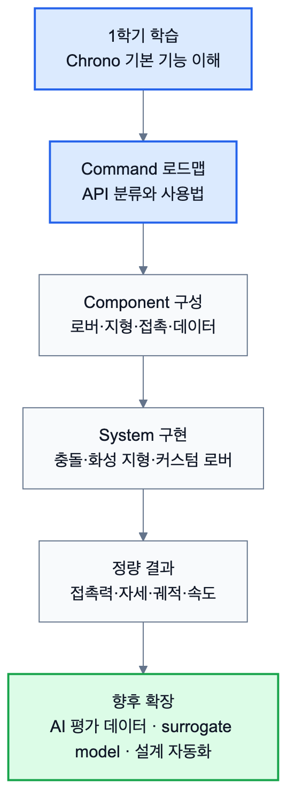

# 3.1 프로젝트 종합 결론 및 보완할 점

이번 학기의 목표는 Project Chrono를 이용해 완성된 응용 소프트웨어를 만드는 것보다, 팀원 전원이 처음 접하는 물리 시뮬레이션 환경을 이해하고 이후 프로젝트로 확장 가능한 학습 로드맵을 구축하는 데 있었다. 이를 위해 본 보고서는 Chrono의 기능을 Command, Component, System의 세 단계로 나누어 정리하였다. Command 단계에서는 `ChSystem`, `ChBody`, `ChLink`, `ChMotor`, 접촉 재질, 지형, 시각화, 데이터 출력 등 가상환경을 구성하는 기본 기능을 분류하였다. Component 단계에서는 이러한 기능을 차체, 바퀴, 조향부, 구동부, 지형, 장애물, 접촉 로거와 같은 구현 부품으로 재구성하였다. System 단계에서는 Component를 조합하여 Curiosity Rover 충돌 해석, 화성 지형 주행, 커스텀 로버 주행 실험과 같은 완성형 시뮬레이션 사례를 구성하였다.

이 과정을 통해 확인한 Chrono의 가장 큰 장점은 단순히 물체가 정해진 궤적을 따라 움직이도록 만드는 도구가 아니라는 점이다. 사용자는 물체의 질량, 관성, 마찰, 반발 계수, 접촉 방식, 조인트, 모터, 중력, 지형 특성 등을 직접 설정할 수 있으며, Chrono는 그 설정값을 바탕으로 실제 물리 법칙에 가까운 운동과 접촉 응답을 계산한다. 따라서 Chrono는 시각적 장면을 재현하는 수준을 넘어, 설계안이 특정 환경에서 어떻게 움직이고 어떤 힘을 받는지 검증할 수 있는 물리 기반 가상환경 구축 도구로 활용될 수 있다.

이번 학기 동안의 주요 성과는 다음과 같이 정리할 수 있다.

| 구분 | 성과 |
|---|---|
| Command 학습 | Chrono의 핵심 API, Vehicle Terrain 계열 기능, Vehicle/Robot 고수준 API를 분류하고, 각 기능이 어떤 모델링 문제에 쓰이는지 정리하였다. |
| Component 구성 | 로버, 지형, 장애물, 접촉 측정, 데이터 출력 요소를 Component 단위로 해석하여 재사용 가능한 설계 단위로 정리하였다. |
| System 구현 | Curiosity Rover 충돌 해석, 화성형 SCM 지형 주행, 커스텀 로버 주행 실험을 통해 Command와 Component가 실제 시뮬레이션으로 연결되는 과정을 확인하였다. |
| 데이터 분석 | 접촉력, 충격량, 차체 높이, pitch, roll, 주행 궤적 등의 결과를 CSV와 그래프로 출력하여 정량적 분석 가능성을 확인하였다. |

*그림 3.1-1. 1학기 Chrono 학습 성과가 구현 사례, 정량 결과, AI 확장 방향으로 이어지는 흐름*

특히 본 프로젝트는 AI 친화적 설계 표현 파이프라인에서 시뮬레이션 레이어의 가능성을 확인했다는 점에서 의미가 있다. 온톨로지 또는 설계 데이터베이스가 로버의 구조와 환경 조건을 정의하면, Chrono는 이를 실제 물리 시나리오로 변환하여 주행 성능, 접촉력, 자세 안정성, 환경 반응 데이터를 생성할 수 있다. 이 데이터는 다시 AI가 설계 대안을 평가하거나 다음 설계안을 생성하는 데 사용할 수 있다. 또한 Chrono에서 반복 생성한 고품질 물리 해석 결과는 AI 기반 surrogate model 또는 PINN(Physics-Informed Neural Network) 계열 모델을 학습하는 데이터로 활용될 수 있다. 즉, Chrono는 "설계 정보"와 "AI 학습 데이터" 사이를 연결하는 물리 검증 환경이자, 빠른 예측 모델을 만들기 위한 정밀 데이터 생성기로 확장될 수 있다.

다만 현재 단계에는 분명한 한계도 존재한다. 첫째, 이번 학기 구현은 주로 지상 로버와 강체 기반 물리 시뮬레이션에 집중되어 있어, 유연체, 입자 기반 지형, 센서 모듈, 드론 비행역학 등은 아직 충분히 다루지 못하였다. 둘째, 팀원별 운영체제와 그래픽 환경 차이로 인해 렌더링, 설치, 실행 재현성에서 추가 정리가 필요하다. 셋째, 현재 결과는 학습과 가능성 검증의 성격이 강하므로, 실제 설계 자동화에 사용하기 위해서는 입력 파라미터 표준화, 반복 실험 자동화, 결과 데이터 스키마 정리, AI 레이어와의 연동이 필요하다.

따라서 본 프로젝트의 결론은 Chrono를 단순 예제 실행 도구가 아니라, 물리 기반 가상환경을 생성하고 설계안을 검증하며 AI 학습용 데이터를 생산할 수 있는 기반 도구로 활용할 수 있다는 것이다. 이번 학기의 Command-Component-System 로드맵은 그 가능성을 체계적으로 학습하기 위한 출발점이며, 향후에는 이 구조를 바탕으로 실제 연구 주제 또는 응용 서비스로 확장하는 것이 다음 단계가 된다.
