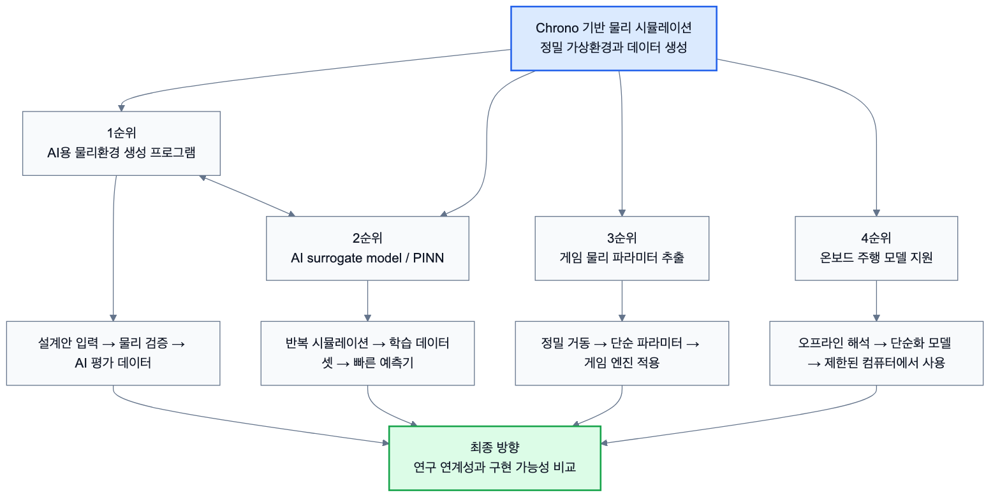

# 3.2 최종 프로젝트 주제 브레인스토밍 결과 및 구현 순서

본 절은 팀 회의를 통해 도출한 최종 프로젝트 후보를 정리하고, 각 후보가 2장에서 제시한 Command-Component-System 구조로 어떻게 구현될 수 있는지 검토한 것이다. 기존에 학습 과정에서 제안된 Curiosity 주행, 커스텀 로버, 충돌 해석, 센서 파이프라인 등의 후보는 기술적으로 유용한 세부 실험 주제로 유지하되, 최종 프로젝트 방향은 팀원들이 제안한 응용 가능성이 큰 주제를 우선적으로 검토한다.

## 3.2.1 핵심 브레인스토밍 방향

Chrono는 사용자가 설정한 물리적 특성을 기반으로 실제에 가까운 거동을 계산할 수 있기 때문에, 단순한 시각화 도구보다 더 넓은 응용 가능성을 가진다. 팀에서는 이 가능성을 바탕으로 네 가지 방향의 최종 주제를 도출하였다.

| 우선순위 | 후보 주제 | 핵심 아이디어 | 기대 산출물 |
|---|---|---|---|
| 1 | AI가 사용할 수 있는 물리환경 생성 프로그램 | 우주 개발 및 다환경 무인 모빌리티 설계 자동화를 위해 AI가 설계안을 검증할 수 있는 Chrono 기반 가상환경을 구축한다. | 시나리오 생성기, 로버/지형/환경 시뮬레이션, CSV/JSON 결과, AI 평가용 성능 지표 |
| 2 | Chrono 해석 결과 기반 AI surrogate model 개발 | 여러 모빌리티와 환경 조건에서 Chrono 물리 해석 데이터를 생성하고, 이를 바탕으로 빠른 예측이 가능한 surrogate model 또는 PINN 계열 모델을 학습한다. | 학습 데이터셋, surrogate model, 빠른 성능 예측기, 설계/환경 조건별 응답 예측 |
| 3 | 게임/콘텐츠용 물리 거동 파라미터 추출 서비스 | 게임 엔진이 실시간으로 계산하기 어려운 장비 물리를 Chrono에서 정밀 시뮬레이션하고, 이를 단순 수식 또는 파라미터로 변환한다. | 장비별 물리 파라미터, 간략화 거동 모델, 게임 적용용 튜닝 데이터 |
| 4 | 차량/로버 온보드 주행 프로그램 개발 지원 | 차량이나 탐사용 로버의 물리를 오프라인에서 정밀 시뮬레이션한 뒤, 제한된 온보드 컴퓨터에서도 사용할 수 있는 단순화 모델로 변환한다. | 지형별 주행 성능 데이터, 간략화 제어 모델, 온보드 적용용 lookup table 또는 surrogate model |

*그림 3.2-1. Chrono 기반 물리 시뮬레이션에서 파생되는 네 가지 최종 프로젝트 후보와 우선순위 관계*

이 중 첫 번째 주제는 강성구 교수님의 NRF 연구 방향인 다환경 무인 모빌리티 설계 자동화와 가장 직접적으로 연결된다. 해당 연구 방향은 도메인 지식과 데이터를 결합하여 다양한 작동 환경에서 무인 모빌리티 설계안을 검증하고 최적화하는 것을 목표로 한다. 본 프로젝트의 Chrono 학습 결과는 그중 "정밀한 가상환경을 구축하고 설계안의 물리적 성능을 평가하는 시뮬레이션 레이어"로 연결될 수 있다.

## 3.2.2 주제별 Command-Component-System 조합

### 3.2.2.1 AI용 물리환경 생성 프로그램

이 주제는 온톨로지 또는 설계 데이터에서 로버/드론/환경 파라미터를 받아 Chrono 가상환경을 자동 구성하고, 시뮬레이션 결과를 AI가 사용할 수 있는 데이터로 출력하는 것을 목표로 한다.

| 단계 | 구현 내용 |
|---|---|
| Command | `ChSystem`, `ChBody`, `ChLink`, `ChMotor`, `RigidTerrain`, `SCMTerrain`, `SetGravitationalAcceleration`, 접촉 재질, CSV/JSON writer |
| Component | Rover/Vehicle Component, Terrain Component, Environment Parameter Component, Driver Component, Contact Logger, State Logger, Metadata Logger |
| System | 설계안 입력 → Chrono 가상환경 생성 → 주행/충돌/지형 반응 시뮬레이션 → 성능 지표 출력 → AI 평가 데이터로 전달 |

이 방향의 장점은 본 보고서의 Command-Component-System 로드맵이 그대로 최종 시스템 구조가 된다는 점이다. Command는 Chrono 기능 호출 단위, Component는 AI가 조합할 설계 부품, System은 설계안의 성능을 평가하는 물리 검증 환경이 된다.

### 3.2.2.2 Chrono 해석 결과 기반 AI surrogate model 개발

이 주제는 Chrono를 대량의 정밀 물리 해석 데이터를 생성하는 도구로 사용하고, 그 결과를 이용하여 AI 기반 surrogate model을 학습하는 것을 목표로 한다. Surrogate model은 정밀 시뮬레이션을 매번 다시 수행하지 않고도 특정 설계 조건과 환경 조건에서의 결과를 빠르게 예측하는 근사 모델이다. 예를 들어 로버의 바퀴 크기, 질량, 조향 조건, 지형 거칠기, 마찰 계수, 중력 조건 등을 입력하면, 주행 안정성, 접촉력, 경로 오차, 에너지 사용량 등을 빠르게 예측하도록 학습시킬 수 있다.

특히 PINN(Physics-Informed Neural Network) 계열 접근을 활용하면 단순히 데이터만 맞추는 모델이 아니라, 물리 법칙이나 제약 조건을 학습 과정에 함께 반영하는 방향으로 확장할 수 있다. Chrono는 다양한 지형과 다양한 모빌리티를 반복적으로 테스트할 수 있으므로, 실제 실험만으로 확보하기 어려운 넓은 조건의 물리 데이터를 생성할 수 있다. 이 데이터가 충분히 축적되면, AI는 Chrono보다 훨씬 빠르게 설계안의 성능을 예측하고, 유망한 설계 후보를 선별하는 데 사용될 수 있다.

| 단계 | 구현 내용 |
|---|---|
| Command | `DoStepDynamics`, state getter, contact force getter, terrain parameter 설정, motor/driver input, CSV/JSON writer |
| Component | Simulation Dataset Generator, Mobility Parameter Component, Terrain Parameter Component, Response Logger, Physics Constraint Descriptor |
| System | 다양한 설계/환경 조건 샘플링 → Chrono 반복 시뮬레이션 → 물리 응답 데이터셋 구축 → surrogate model 또는 PINN 학습 → 빠른 성능 예측 |

이 주제는 1순위인 AI용 물리환경 생성 프로그램과 밀접하게 연결된다. 물리환경 생성 프로그램이 정밀한 데이터를 생산하는 시뮬레이션 레이어라면, surrogate model은 그 데이터를 학습하여 설계 탐색 속도를 높이는 AI 레이어가 된다. 따라서 두 주제는 경쟁 관계라기보다, Chrono 기반 설계 자동화 파이프라인의 전후 단계로 함께 구성할 수 있다.

### 3.2.2.3 게임/콘텐츠용 물리 거동 파라미터 추출 서비스

게임은 오픈월드, 복합 지형, 다양한 장비를 통해 몰입감을 제공하지만, 모든 장면에서 현실 수준의 물리 계산을 실시간으로 수행하기는 어렵다. 따라서 실제 게임에서는 단순화된 물리 모델로 현실 거동을 흉내 내는 경우가 많고, 이 과정에서 플레이어가 어색함을 느낄 수 있다. 이 문제를 해결하기 위해 Chrono를 오프라인 정밀 시뮬레이터로 사용하고, 그 결과를 게임 엔진에 적용 가능한 간단한 파라미터나 수식으로 변환하는 서비스를 구상할 수 있다.

| 단계 | 구현 내용 |
|---|---|
| Command | `ChBodyEasyBox/Cylinder`, 접촉 재질, 마찰/반발 설정, 모터 입력, 지형 생성, 상태/힘 로깅 |
| Component | 게임 내 장비 Component, 바퀴/궤도/서스펜션 Component, 지형/장애물 Component, 거동 측정 Logger |
| System | 장비별 표준 테스트 시나리오 실행 → 실제 거동 데이터 추출 → 단순 수식 또는 lookup table 생성 → 게임 엔진 적용용 파라미터 제공 |

예를 들어 게임에 등장하는 차량, 로버, 중장비를 Chrono에서 먼저 구현하고, 다양한 지형과 속도 조건에서 주행 데이터를 얻는다. 이후 이 데이터를 기반으로 게임에서 사용할 수 있는 가속, 제동, 선회, 충돌 반응의 고유값을 산출하면, 실시간 계산 부담은 낮추면서도 실제 거동에 가까운 움직임을 제공할 수 있다.

### 3.2.2.4 차량/로버 온보드 주행 프로그램 개발 지원

탐사용 로버나 자율주행 차량은 실제 운용 중 사용할 수 있는 컴퓨터 성능이 제한적이다. 따라서 모든 물리 상호작용을 실시간으로 정밀 계산하기보다, 사전에 다양한 환경을 시뮬레이션하여 단순화된 제어 모델이나 지형별 대응 규칙을 만드는 방식이 필요하다. 이는 게임 물리 파라미터 추출과 유사하지만, 목적이 몰입감이 아니라 실제 주행 안정성과 제어 성능이라는 점에서 차이가 있다.

| 단계 | 구현 내용 |
|---|---|
| Command | 차량/로버 모델, 지형 모델, 중력/마찰 조건, motor command, waypoint/RL driver, state/control logger |
| Component | Rover Component, Terrain Component, Driver Component, Stability Metric, Energy/Slip/Contact Logger |
| System | 다양한 지형 조건에서 로버 주행 실험 → 자세 안정성/경로 오차/접촉력 분석 → 온보드 제어에 사용할 단순화 모델 생성 |

이 방향은 향후 실제 로버 또는 차량 개발 과정에서 시뮬레이션 기반 설계 검증, 제어기 사전 평가, 지형별 운용 전략 생성으로 확장될 수 있다. Chrono가 계산한 정밀 물리 데이터를 간단한 제어 규칙으로 압축하면, 제한된 온보드 환경에서도 더 빠르고 안정적인 의사결정이 가능해질 수 있다.

## 3.2.3 후순위 세부 실험 후보

아래 주제들은 최종 프로젝트의 독립 주제라기보다, 위 네 가지 큰 방향을 구현하기 위한 세부 실험 또는 검증 모듈로 활용할 수 있다.

| 세부 후보 | 활용 위치 | 역할 |
|---|---|---|
| Curiosity Rover 화성 지형 주행 분석 | AI용 물리환경 생성 프로그램 | 화성 중력, SCMTerrain, heightmap 기반 지형 검증 예제 |
| 커스텀 로버 장애물 주행 플랫폼 | AI용 물리환경, surrogate model, 온보드 모델 | 직접 설계한 로버의 구조/제어/주행 데이터 생성 |
| 로버 충돌 안전성 분석 | 게임 물리 및 온보드 모델 | 접촉력, 충격량, 충돌 반응 파라미터 추출 |
| 로버 제어 방식 비교 | surrogate model 및 온보드 주행 프로그램 지원 | profile driver, waypoint driver, PPO driver 성능 비교 |
| 드론-로버 복합 탐사 | 장기 확장 | 로버와 드론이 함께 작동하는 복합 무인 모빌리티 환경 |
| 센서 데이터 파이프라인 | AI용 물리환경 생성 프로그램 | 카메라, LiDAR, IMU, GPS 등 AI 입력 데이터 확장 |

## 3.2.4 최종 주제 선정 방향

현재 단계에서 가장 우선적으로 검토할 주제는 **AI가 사용할 수 있는 Chrono 기반 물리환경 생성 프로그램**이다. 이 주제는 교수님의 연구 방향과 가장 직접적으로 연결되며, 본 보고서에서 정리한 Command-Component-System 구조를 그대로 활용할 수 있다. 여기에 **Chrono 해석 결과 기반 AI surrogate model 개발**을 결합하면, Chrono가 생성한 정밀 물리 데이터를 이용해 빠른 성능 예측기를 만들 수 있다. 또한 게임 물리 파라미터 추출과 온보드 주행 프로그램 지원은 같은 기술 기반에서 파생될 수 있는 응용 주제이므로, 최종 주제 선정 과정에서 부가적 활용 가능성으로 함께 검토할 수 있다.

따라서 여름방학 동안에는 네 주제 중 하나를 즉시 확정하기보다, Chrono가 생성할 수 있는 물리 데이터의 품질, 자동화 가능성, AI/온톨로지 레이어와의 연결 가능성, 팀의 구현 난이도를 비교하여 최종 방향을 결정할 예정이다. 이후 2학기에는 선택한 주제에 맞추어 하나의 완성된 System을 구현하고, 이를 통해 Chrono가 단순 학습 도구를 넘어 실제 연구 및 응용 서비스의 기반이 될 수 있음을 검증하는 것을 목표로 한다.
