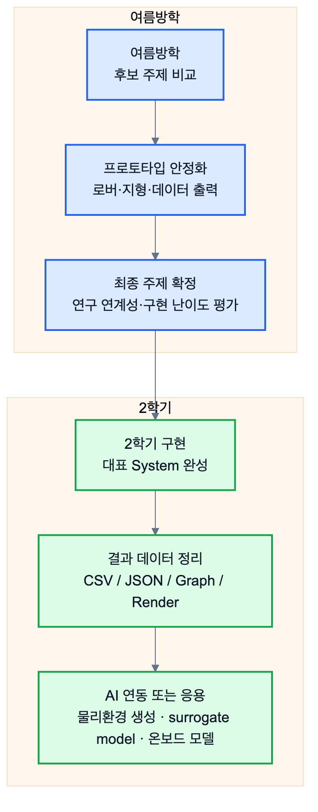

# 3.3 여름방학 및 2학기 향후 계획

3.2에서 정리한 브레인스토밍 결과를 바탕으로, 여름방학에는 최종 주제를 확정하기 위한 비교 검토와 기초 프로토타입 제작을 진행한다. 2학기에는 선택한 주제를 하나의 완성된 System으로 구현하고, 결과 데이터를 AI 또는 외부 응용 프로그램에서 사용할 수 있는 형태로 정리하는 것을 목표로 한다.

*그림 3.3-1. 여름방학의 주제 비교와 프로토타입 안정화가 2학기 대표 System 구현 및 AI/응용 연동으로 이어지는 계획*

## 3.3.1 여름방학 계획

여름방학의 핵심 목표는 네 가지 후보 주제의 실현 가능성을 비교하는 것이다. 이를 위해 각 주제를 동일한 기준으로 평가한다.

| 평가 기준      | 확인할 내용                                                        |
| --- | --- |
| 연구 연계성     | 강성구 교수님의 다환경 무인 모빌리티 설계 자동화 연구 방향과 얼마나 직접적으로 연결되는가            |
| Chrono 적합성 | Chrono의 물리 시뮬레이션 장점이 주제에서 충분히 드러나는가                           |
| 구현 가능성     | 현재 팀이 학습한 Command와 Component로 2학기 내 구현 가능한가                   |
| 데이터 산출물    | CSV, JSON, 그래프, 렌더 이미지 등 AI 또는 외부 프로그램이 사용할 수 있는 결과를 만들 수 있는가 |
| AI 모델화 가능성 | Chrono 결과를 surrogate model 또는 PINN 계열 모델의 학습 데이터로 사용할 수 있는가      |
| 확장성        | 로버에서 드론, 센서, 복합 환경으로 확장 가능한가                                  |

구체적으로는 다음 작업을 수행한다.

1. 커스텀 로버와 지형 시뮬레이션의 실행 안정성을 높인다.
2. 지형, 중력, 마찰, 장애물, 초기 위치 등 환경 파라미터를 외부 입력으로 바꿀 수 있도록 정리한다.
3. 접촉력, 자세, 속도, 경로 오차 등 주요 결과값의 CSV/JSON 출력 형식을 통일한다.
4. AI용 물리환경 생성 프로그램, Chrono 해석 결과 기반 surrogate model, 게임 물리 파라미터 추출, 온보드 주행 모델 지원 중 어떤 방향이 가장 적합한지 비교한다.
5. 최종 주제가 정해지면 2학기 구현 범위와 팀원별 역할을 확정한다.

## 3.3.2 2학기 구현 계획

2학기에는 선택한 주제에 따라 하나의 대표 System을 완성한다. 현재 가장 유력한 방향은 AI가 사용할 수 있는 Chrono 기반 물리환경 생성 프로그램이며, 여기에 Chrono 해석 결과를 학습 데이터로 사용하는 surrogate model 개발을 결합할 수 있다. 이 경우 구현 흐름은 다음과 같다.

| 단계 | 구현 목표 |
| --- | --- |
| 입력 정의 | 로버 구조, 지형 종류, 환경 조건, 주행 명령을 파라미터로 입력할 수 있게 한다. |
| 가상환경 생성 | 입력값을 바탕으로 Chrono System, Terrain, Rover, Driver, Logger를 자동 구성한다. |
| 시뮬레이션 실행 | 여러 환경 조건에서 주행, 충돌, 자세 변화를 계산한다. |
| 결과 출력 | CSV/JSON/그래프/렌더 이미지 형태로 결과를 저장한다. |
| AI 연동 준비 | 결과 데이터를 설계안 평가, 후보 비교, 학습 데이터 생성에 사용할 수 있도록 정리한다. |
| Surrogate model 학습 | Chrono 결과를 이용해 설계/환경 조건에 따른 성능을 빠르게 예측하는 AI 모델을 학습한다. |

만약 게임 물리 파라미터 추출 또는 온보드 주행 모델 지원을 최종 주제로 선택할 경우에도 기본 구조는 동일하다. Chrono에서 정밀한 물리 데이터를 먼저 생성하고, 그 결과를 더 간단한 수식, lookup table, surrogate model로 변환하는 방식으로 구현한다.

## 3.3.3 최종 목표

최종적으로 본 프로젝트는 Project Chrono를 이용해 사용자가 원하는 환경과 장비를 구성하고, 그 안에서 발생하는 물리 현상을 정량적으로 출력하는 시스템을 구축하는 것을 목표로 한다. 이 시스템은 연구 측면에서는 AI 기반 무인 모빌리티 설계 자동화의 시뮬레이션 레이어가 될 수 있고, Chrono 해석 결과를 이용한 surrogate model 또는 PINN 계열 예측 모델 개발로 이어질 수 있다. 응용 측면에서는 게임 물리 파라미터 추출이나 차량/로버 온보드 제어 모델 개발 지원으로 확장될 수 있다.

따라서 2학기 최종 산출물은 단순한 예제 모음이 아니라, 입력된 설계 조건과 환경 조건에 따라 Chrono 가상환경을 구성하고, 그 결과를 AI 또는 외부 응용 프로그램이 사용할 수 있는 데이터로 변환하는 하나의 프로토타입이 되어야 한다. 더 나아가 이 데이터가 빠른 AI 예측 모델의 학습 데이터로 사용될 수 있음을 보이면, 이번 학기에 구축한 Command-Component-System 로드맵을 실제 연구 및 응용 가능성으로 연결할 수 있다.
