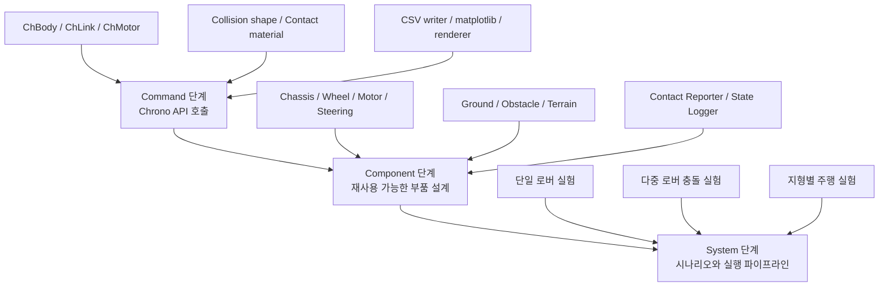
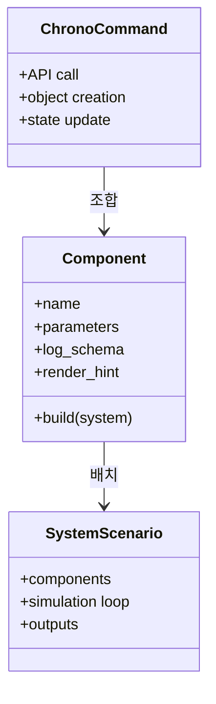

# 2.2.1 Component 단계의 정의와 역할

## Component 단계의 위치

본 보고서에서 Component는 Project Chrono의 공식 모듈 이름을 그대로 나열한 것이 아니라, 실제 시뮬레이션 대상을 구성하는 물리적 또는 기능적 부품 단위이다. Command 단계가 `ChBody`, `ChLink`, `ChMotor`, `ChContactMaterialNSC`, `RigidTerrain` 같은 API 호출 단위라면, Component 단계는 이런 Command를 조합해 "차체", "바퀴", "조향", "지형", "접촉 로거"처럼 재사용 가능한 설계 단위로 묶는다. System 단계는 여러 Component를 한 시나리오에 배치하고 실행 순서, 파라미터, 출력 파일을 통합한다.

## 공식 module/component와 구현 Component의 차이

Chrono 공식 문서에서 module은 Core, Vehicle, Sensor, Visualization, Postprocess처럼 빌드와 기능 경계를 뜻한다. Chrono::Vehicle 내부의 subsystem도 suspension, steering, driveline, tire처럼 공식 Component에 가까운 이름을 갖는다. 그러나 캡스톤 구현에서 필요한 Component는 팀원이 설계하고 재사용할 수 있는 "시뮬레이션 부품"이어야 한다. 예를 들어 `ChBodyEasyBox` 하나는 Command이지만, 질량, 충돌 형상, 시각 형상, 이름, 초기 위치, 로깅 컬럼을 함께 정하면 Chassis Component가 된다.

| 구분 | Chrono 관점 | 본 보고서 Component 관점 |
|---|---|---|
| Core | `ChSystem`, `ChBody`, `ChLink`, `ChMotor` | 차체, 바퀴, 장애물, 축, 조인트, 구동 모터 |
| Vehicle | `WheeledVehicle`, `RigidTerrain`, `SCMTerrain` | 차량 하위 부품과 지형 부품을 조립하는 고수준 Component |
| Visualization | Irrlicht, VSG, visual shape | Render/Screenshot Component, 제출용 시각 자료 |
| Sensor | Camera, LiDAR, GPS, IMU | 선택적 확장 Component. 본 절에서는 설계 인터페이스만 정리 |
| Postprocess/Python I/O | CSV, graph, postprocess utility | State Logger, Control Logger, Graph Generator |

## Component 정의

Component는 여러 Chrono Command를 조합해 만든 재사용 가능한 시뮬레이션 부품이다. 최소한 다음 정보를 가져야 한다.

| 항목 | 설명 | 예 |
|---|---|---|
| 물리 표현 | 질량, 관성, 위치, 속도, 고정 여부 | `ChBody`, `SetMass`, `SetPos` |
| 연결 표현 | 조인트, 모터, 제약 조건 | `ChLinkLockRevolute`, `ChLinkMotorRotationSpeed` |
| 접촉 표현 | 충돌 형상, 접촉 재질, 충돌 시스템 | `ChCollisionShapeBox`, `ChContactMaterialNSC` |
| 시각 표현 | 렌더링용 형상, 색, 텍스처 | `ChVisualShapeBox`, `ChVisualShapeCylinder` |
| 데이터 표현 | CSV 컬럼, 그래프, 이벤트 | `time_s`, `x_m`, `contact_force_N` |

## Component 분류 체계

| 분류 | 대표 Component | 주요 산출물 |
|---|---|---|
| 로버/차량 Component | Chassis, Wheel/Tire, Motor/Drive, Steering, Suspension, Visual Shape, Collision Shape, Driveline, Brake, Powertrain, Track Shoe | 렌더 이미지, 상태 CSV, 속도 그래프 |
| 환경/Terrain Component | Ground, Obstacle, RigidTerrain, SCMTerrain, Contact Material, FlatTerrain, CRGTerrain, GranularTerrain, FEATerrain, CRMTerrain | 지형 렌더, 높이/마찰/침하 CSV, 지형 그래프 |
| 충돌/접촉 측정 Component | Collision Shape, Contact Reporter, Contact Force Logger, Collision Event Detector | 접촉 렌더, 접촉력 CSV, 접촉 개수/이벤트 그래프 |
| 데이터 출력/시각화 Component | State Logger, Control Logger, CSV Schema, Graph Generator, Render/Screenshot, Camera, LiDAR, GPS, IMU | 상태/제어 CSV, 궤적 그래프, 센서 배치 렌더 |
| 선택적 확장 Component | Sensor, DEM, FSI, GranularTerrain, Robot model | 환경이 지원할 때만 실제 실행, 아니면 설계 인터페이스 기록 |

## Component 설계 원칙

1. Component는 단일 API 설명으로 끝내지 않고, 어떤 시뮬레이션 대상의 어느 부품인지 명확히 적는다.
2. Visual Shape와 Collision Shape를 분리한다. 보기 좋은 모델이 반드시 좋은 충돌 모델은 아니다.
3. 로깅 컬럼은 Component 설계 단계에서 정한다. System 단계에서 뒤늦게 CSV 스키마를 맞추면 다중 실험 비교가 어려워진다.
4. RigidTerrain과 SCMTerrain은 일반 Core body가 아니라 Chrono::Vehicle의 Terrain 계열 Component로 설명한다.
5. 실행 가능한 최소 예제를 둔다. 고급 모듈이 없어도 matplotlib 렌더와 CSV/그래프로 부품 의미를 확인할 수 있어야 한다.

## 참고 문헌

- Project Chrono Core/공식 저장소: https://github.com/projectchrono/chrono
- Chrono Vehicle Terrain system: https://api.projectchrono.org/group__vehicle__terrain.html
- Chrono Sensor overview: https://api.projectchrono.org/sensor_overview.html
- Chrono Visualization overview: https://api.projectchrono.org/vehicle_visualization.html
- 로컬 참고: `README.md`, `docs/core/`, `docs/vehicle/`, `docs/visualization/`, `docs/postprocess/`, `lessons/phase4/hojin/`
