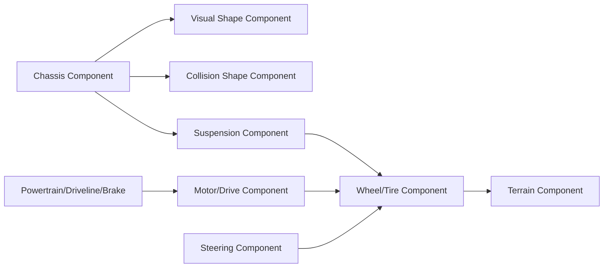

# 2.2.2 로버/차량 Component 설계

로버/차량 Component는 차체, 바퀴, 구동, 조향, 서스펜션, 시각 형상, 충돌 형상을 분리해 설계한다. Chrono Core만으로도 최소 로버를 만들 수 있고, 더 정교한 차량 동역학이 필요하면 Chrono::Vehicle의 wheeled/tracked subsystem을 사용한다.

| 생성 산출물 | 파일 |
|---|---|
| 로버 Component 렌더 |  |
| Visual/Collision 형상 비교 |  |
| 서스펜션/축 렌더 |  |
| Tracked Vehicle 확장 렌더 |  |
| Chassis 상태 그래프 |  |

## 로버 Component 관계



## Chassis Component

Chassis는 로버의 기준 body이다. 질량, 관성, 기준 좌표계, 이름, 대표 충돌 형상, 로깅 대상이 모두 Chassis에서 시작된다.

| 항목 | 설계 내용 |
|---|---|
| 역할 | 로버의 기준 강체, 센서/바퀴/링크가 붙는 부모 body |
| 관련 API | `chrono.ChBody`, `chrono.ChBodyEasyBox`, `SetMass`, `SetPos`, `SetPosDt`, `AddVisualShape` |
| 사용 상황 | 직접 제작 로버, MVP0 단일 강체, Vehicle 모델의 chassis frame 이해 |
| 주의사항 | 시각 모델의 크기와 충돌 모델의 크기를 혼동하지 않는다. 질량 중심 높이가 너무 높으면 쉽게 전복된다. |

```python
import pychrono as chrono

system = chrono.ChSystemNSC()
material = chrono.ChContactMaterialNSC()
material.SetFriction(0.45)

chassis = chrono.ChBodyEasyBox(1.4, 0.8, 0.28, 350, True, True, material)
chassis.SetName("component_demo_chassis")
chassis.SetPos(chrono.ChVector3d(-2.0, 0.0, 0.45))
chassis.SetPosDt(chrono.ChVector3d(1.3, 0.0, 0.0))
system.AddBody(chassis)
```

실행 코드: `../code/rover_vehicle/generate_rover_vehicle_components.py`  
CSV: `../outputs/csv/rover_vehicle_chassis_probe.csv`

## Wheel/Tire Component

Wheel/Tire는 회전 강체, 접촉 재질, 타이어 모델을 묶은 Component이다. Core 단계에서는 cylinder body와 revolute joint로 만들 수 있고, Vehicle 단계에서는 `ChTire`, `RigidTire`, `TMeasyTire` 같은 타이어 subsystem을 사용한다.

| 항목 | 설계 내용 |
|---|---|
| 역할 | 지형과 직접 접촉해 하중, 마찰, 구동력을 전달 |
| 관련 API | `ChBodyEasyCylinder`, `ChLinkLockRevolute`, Vehicle tire subsystem |
| 사용 상황 | 단순 바퀴 로버, HMMWV/Viper/Curiosity 계열 차량 모델 |
| 주의사항 | 바퀴 시각 반지름, 충돌 반지름, 타이어 유효 반지름을 같은 값으로 단정하지 않는다. |

```python
wheel = chrono.ChBodyEasyCylinder(
    chrono.ChAxis_Y, 0.28, 0.18, 800, True, True, material
)
wheel.SetName("front_left_wheel")
wheel.SetPos(chrono.ChVector3d(0.55, 0.62, 0.30))
system.AddBody(wheel)
```

## Motor/Drive Component

Motor/Drive Component는 회전 속도, 회전 각도, 토크 입력을 바퀴 또는 트랙 구동축에 전달한다. Core에서는 `ChLinkMotorRotationSpeed`, `ChLinkMotorRotationTorque` 계열을 사용할 수 있고, Vehicle에서는 driveline과 powertrain subsystem이 이 역할을 분담한다.

| 항목 | 설계 내용 |
|---|---|
| 역할 | 바퀴/스프로킷에 구동 입력 전달 |
| 관련 API | `ChLinkMotorRotationSpeed`, `ChLinkMotorRotationTorque`, `ChFunctionConst`, Vehicle driveline |
| 사용 상황 | 일정 속도 시험, throttle 입력 시험, 좌우 차동 구동 |
| 주의사항 | 속도 모터는 목표 속도 구속에 가깝고, 토크 모터는 동역학 응답을 더 직접적으로 보여준다. |

```python
motor = chrono.ChLinkMotorRotationSpeed()
motor.Initialize(wheel, chassis, chrono.ChFramed(chrono.ChVector3d(0.55, 0.62, 0.30)))
motor.SetMotorFunction(chrono.ChFunctionConst(8.0))
system.AddLink(motor)
```

## Steering Component

Steering은 바퀴 회전축 방향을 바꾸는 Component이다. 간단한 로버에서는 좌우 바퀴 속도 차이로 회전할 수 있고, 차량 모델에서는 steering subsystem이 tie rod, spindle, knuckle 관계를 표현한다.

| 항목 | 설계 내용 |
|---|---|
| 역할 | 진행 방향 제어 |
| 관련 API | `ChLinkLockRevolute`, `ChLinkMotorRotationAngle`, Vehicle steering subsystem |
| 사용 상황 | Ackermann steering, skid steering, waypoint follower |
| 주의사항 | 조향각 입력과 바퀴 회전 속도 입력을 분리해 기록해야 제어 분석이 쉽다. |

## Suspension Component

Suspension은 Chassis와 Wheel 사이의 링크, 스프링, 댐퍼를 묶는다. 단순 구현은 링크와 스프링으로 시작하고, Vehicle 모듈에서는 double wishbone, solid axle, multi-link 등 사전 정의 subsystem을 사용할 수 있다.

| 항목 | 설계 내용 |
|---|---|
| 역할 | 지형 충격 흡수, 바퀴 접지 유지, 차체 자세 안정 |
| 관련 API | `ChLinkTSDA`, `ChLinkLockRevolute`, Vehicle suspension subsystem |
| 사용 상황 | 바퀴가 지형 요철을 통과하는 실험 |
| 주의사항 | 스프링 강성과 감쇠가 너무 작으면 차체가 바닥에 닿고, 너무 크면 수치적으로 불안정해질 수 있다. |

## Visual Shape Component

Visual Shape는 보고서 이미지, 디버깅 화면, 센서 렌더링에 쓰이는 표현이다. 충돌 계산의 정확도를 위해 반드시 Collision Shape와 분리해서 생각한다.

| 항목 | 설계 내용 |
|---|---|
| 역할 | 사람이 부품을 식별할 수 있게 표시 |
| 관련 API | `ChVisualShapeBox`, `ChVisualShapeCylinder`, `AddVisualShape`, texture |
| 사용 상황 | 렌더링, 스크린샷, 발표 자료 |
| 주의사항 | 복잡한 mesh visual을 그대로 collision에 쓰면 계산 비용이 커질 수 있다. |

## Collision Shape Component

Collision Shape는 접촉 검출과 접촉력 계산에 쓰인다. 단순 박스/구/실린더를 우선 사용하고, 반드시 필요한 경우에만 mesh collision을 사용한다.

| 항목 | 설계 내용 |
|---|---|
| 역할 | 접촉 판정, 침투 깊이, 접촉 법선 계산 |
| 관련 API | `ChBodyEasyBox`, `ChCollisionShapeBox`, `ChContactMaterialNSC`, `SetCollisionSystemType` |
| 사용 상황 | 로버-지형 접촉, 로버-장애물 충돌 |
| 주의사항 | Visual Shape보다 약간 단순하고 안정적인 envelope로 잡는 것이 좋다. |

## Vehicle 확장 Component

| Component | 역할 | Chrono::Vehicle 관점 |
|---|---|---|
| Driveline | 엔진/모터 출력을 좌우 또는 전후 바퀴로 배분 | wheeled vehicle driveline subsystem |
| Brake | 바퀴 회전 감속, 정지 | brake subsystem |
| Powertrain | 엔진, 모터, 변속기, throttle-to-torque 관계 | engine/transmission/powertrain subsystem |

## Tracked Vehicle 확장 Component

| Component | 역할 | 설계 시 주의사항 |
|---|---|---|
| Track Shoe | 지면과 접촉하는 궤도 조각 | shoe 개수가 많아질수록 접촉 계산량 증가 |
| Sprocket | 구동 토크를 track에 전달 | tooth 형상과 track 간격 정합 필요 |
| Idler | track 장력과 경로 유지 | 위치 조절로 장력 안정화 |
| Roller | chassis 하중을 track에 분산 | 지형 요철에서 접촉 유지 확인 |

## 로컬 참고 코드 반영

`lessons/phase4/hojin/lesson_19_hojin_rover_mvp0_collision_dummy.py`는 단일 차체, 장애물, 접촉 CSV를 갖춘 MVP0 예제이다. 본 절의 `generate_rover_vehicle_components.py`는 해당 예제의 중심 주제를 그대로 반복하지 않고, Chassis/Wheel/Suspension/Tracked 확장 구조를 Component 매뉴얼 형태로 재구성했다.

## 참고 문헌

- Chrono Core rigid bodies: https://api.projectchrono.org/
- Chrono Vehicle visualization and subsystem context: https://api.projectchrono.org/vehicle_visualization.html
- Chrono Vehicle terrain system: https://api.projectchrono.org/group__vehicle__terrain.html
- 로컬 문서: `docs/vehicle/wheeled/`, `docs/vehicle/Tracked/`, `docs/robot/viper.md`, `lessons/phase4/hojin/`
