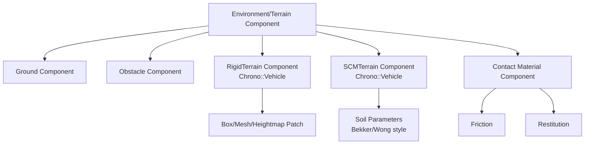

# 2.2.3 환경/Terrain Component 설계

환경/Terrain Component는 로버가 놓이는 물리 공간을 정의한다. 단순 바닥은 Core의 고정 `ChBody`로 충분하지만, 차량 주행 실험에서는 Chrono::Vehicle의 `RigidTerrain`, `SCMTerrain` 같은 Terrain 계열을 명확히 구분해 사용해야 한다.

| 생성 산출물 | 파일 |
|---|---|
| Ground/Obstacle/RigidTerrain 렌더 |  |
| Heightmap Terrain 렌더 |  |
| SCMTerrain 변형 개념 렌더 |  |
| 높이/침하 단면 그래프 |  |
| 마찰 계수 맵 |  |
| 접촉력 probe 그래프 |  |

## Terrain Component 관계



## Ground Component

Ground는 가장 기본적인 환경 Component이다. 보통 고정된 `ChBody`와 충돌 재질로 만든다.

| 항목 | 설계 내용 |
|---|---|
| 역할 | 로버가 떨어지지 않고 접촉할 기준 평면 제공 |
| 관련 API | `ChBodyEasyBox`, `SetFixed(True)`, `ChContactMaterialNSC` |
| 사용 상황 | 기본 낙하/주행/충돌 시험 |
| 주의사항 | ground 상면 높이와 로버 초기 z 위치를 맞춰야 초기 침투가 생기지 않는다. |

```python
material = chrono.ChContactMaterialNSC()
material.SetFriction(0.62)
ground = chrono.ChBodyEasyBox(8.0, 4.0, 0.12, 1000, True, True, material)
ground.SetFixed(True)
ground.SetPos(chrono.ChVector3d(0.0, 0.0, -0.06))
system.AddBody(ground)
```

## Obstacle Component

Obstacle은 지형 위에 놓인 박스, 원통, 돌, 벽, 턱 같은 충돌 대상이다.

| 항목 | 설계 내용 |
|---|---|
| 역할 | 회피, 충돌, 접촉력 측정 대상 |
| 관련 API | `ChBodyEasyBox`, `ChBodyEasyCylinder`, fixed/dynamic body |
| 사용 상황 | 로버 전면 충돌, 바퀴 턱 넘기, 장애물 회피 |
| 주의사항 | 장애물 고정 여부를 명시한다. 동적 장애물은 자체 질량과 관성을 가져야 한다. |

## RigidTerrain Component

`RigidTerrain`은 Chrono::Vehicle의 Terrain 계열 Component이다. 단단한 지면을 여러 patch로 구성하며, 각 patch는 충돌 형상과 접촉 재질을 가진다. 일반 Core ground보다 차량 subsystem과 함께 쓰기 좋은 인터페이스를 제공한다.

| 항목 | 설계 내용 |
|---|---|
| 역할 | 변형되지 않는 차량 주행 지형 |
| 관련 API | `chrono.vehicle.RigidTerrain`, patch, material, texture |
| 사용 상황 | 포장도로, 단단한 평지, 경사로, heightmap 기반 시험 |
| 주의사항 | rigid terrain은 바퀴 하중에 의해 지형 자체가 내려앉지 않는다. |

```python
import pychrono.vehicle as veh

terrain = veh.RigidTerrain(system)
# 실제 프로젝트에서는 patch 재질, 위치, 크기를 추가한 뒤 Initialize한다.
# terrain.Initialize()
```

## SCMTerrain Component

`SCMTerrain`도 Chrono::Vehicle Terrain 계열이다. Soil Contact Model 기반의 변형 지형이며, 바퀴나 track이 지나가면 격자 높이가 바뀌는 방식으로 침하를 표현한다. 공식 문서 기준 `SCMTerrain`은 `SetSoilParameters`로 Bekker 계수, Mohr-Coulomb 계수, Janosi shear 계수 등을 받는다.

| 항목 | 설계 내용 |
|---|---|
| 역할 | 모래, 흙, 달/화성 유사 지반처럼 변형되는 지형 표현 |
| 관련 API | `chrono.vehicle.SCMTerrain`, `SetSoilParameters`, `Initialize` |
| 사용 상황 | 로버 mobility, sinkage, drawbar pull, track shoe 지반 영향 |
| 주의사항 | soil parameter는 실험값 또는 문헌값으로 보정해야 한다. 격자가 촘촘할수록 계산량이 증가한다. |

```python
terrain = veh.SCMTerrain(system)
terrain.SetSoilParameters(
    2.0e6, 0.0, 1.1,   # Bekker Kphi, Kc, n
    0.0, 30.0, 0.01,   # cohesion, friction, Janosi shear
    4.0e7, 3.0e4       # elastic K, damping R
)
# terrain.Initialize(length, width, grid_spacing)
```

## Contact Material Component

Contact Material은 지형 Component와 로버 Collision Shape 사이의 접촉 거동을 정한다.

| 파라미터 | 의미 | 영향 |
|---|---|---|
| friction | 마찰 계수 | 구동력, 미끄러짐, 정지 거리 |
| restitution | 반발 계수 | 충돌 후 튀어오름 |
| Young/Poisson 또는 NSC/SMC 설정 | 접촉 모델 stiffness/damping | 접촉 안정성, 침투량 |

```python
material = chrono.ChContactMaterialNSC()
material.SetFriction(0.62)
material.SetRestitution(0.05)
```

## 확장 지형 Component

| Component | 성격 | 사용 판단 |
|---|---|---|
| FlatTerrain | Vehicle의 단순 평면 지형 | 빠른 제어 알고리즘 테스트 |
| CRGTerrain | OpenCRG 도로 데이터 기반 rigid road | 도로 프로파일 재현 |
| GranularTerrain | 입자 기반 granular 지형 | CUDA/특수 빌드 필요 가능 |
| FEATerrain | 유한요소 기반 변형 지형 | 국부 변형/응력 해석 필요 시 |
| CRMTerrain | SPH 기반 Continuum Representation Method 지형 | 고급 terramechanics 연구용 |

## 실행 산출물

실행 코드: `../code/environment_terrain/generate_environment_terrain_components.py`  
CSV: `../outputs/csv/environment_terrain_height_friction_sinkage.csv`, `../outputs/csv/environment_terrain_contact_probe.csv`

## 참고 문헌

- Chrono Vehicle Terrain system: https://api.projectchrono.org/group__vehicle__terrain.html
- SCMTerrain class reference: https://api.projectchrono.org/9.0.0/classchrono_1_1vehicle_1_1_s_c_m_terrain.html
- Chrono Vehicle tutorial slides: https://www.projectchrono.org/assets/slides_3_0_0/5_Vehicle/1_ChronoVehicle.pdf
- 로컬 문서: `docs/vehicle/terrain.md`, `docs/dem/`, `docs/fsi/`, `docs/fea/`
