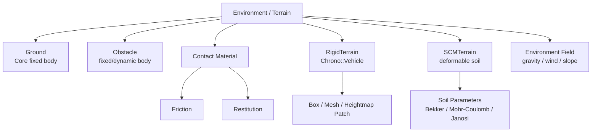
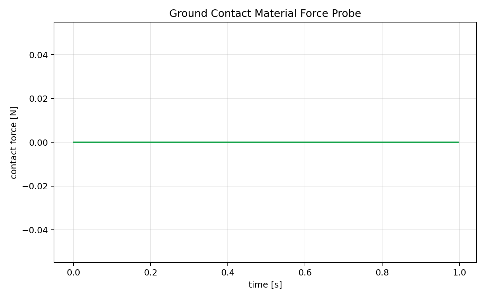
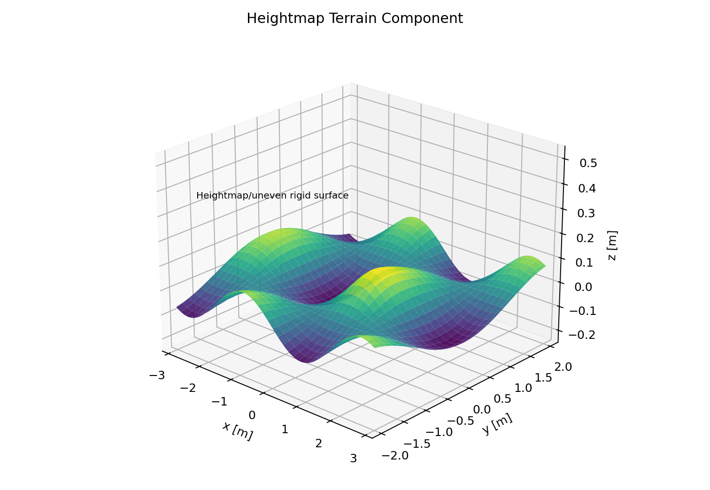
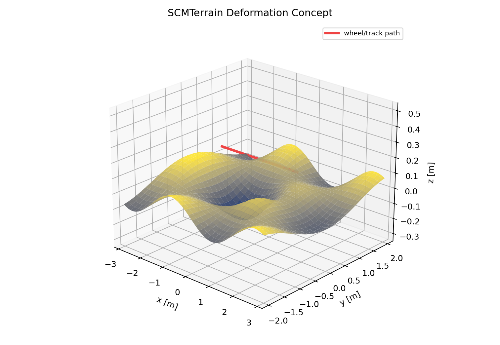

# 2.2.3 환경/Terrain Component 설계

환경/Terrain Component는 로버가 놓이는 물리 공간을 정의한다. 단순 바닥은 Core의 고정 `ChBody`로 충분하지만, 차량 주행 실험에서는 Chrono::Vehicle의 `RigidTerrain`, `SCMTerrain`, `CRGTerrain` 같은 Terrain 계열을 명확히 구분해 사용해야 한다.

이 절에서는 Ground, Obstacle, Contact Material, RigidTerrain, Heightmap/Mesh Patch, SCMTerrain, 외력/중력 설정, 고급 지형 확장까지 Component 단위로 정리한다. 각 지형 Component는 형상, 접촉 재질, 변형 여부, 로버와의 상호작용을 기준으로 구분하였다.

## 2.2.3.1 Terrain Component 관계



## 2.2.3.2 Component 요약 표

| Component | 현실 대상 | Chrono 구현 핵심 | 검증 자료 |
|---|---|---|---|
| Ground | 평면 바닥 | fixed `ChBodyEasyBox` | 바닥 렌더, 접촉력 그래프 |
| Obstacle | 벽, 박스, 돌, 턱 | fixed/dynamic `ChBody` | 장애물 렌더, 충돌 이벤트 |
| Contact Material | 표면 재질 | `ChContactMaterialNSC/SMC` | 마찰 map, 접촉력 변화 |
| RigidTerrain | 단단한 주행 지형 | `veh.RigidTerrain`, patch | patch/heightmap 렌더 |
| Heightmap/Mesh Patch | 요철 지형, 도로 형상 | heightmap/mesh terrain data | 높이 profile 그래프 |
| SCMTerrain | 변형 가능한 흙/모래 | `veh.SCMTerrain`, soil parameter | 침하 렌더, sinkage graph |
| Environment Field | 중력, 바람, 경사 | `SetGravitationalAcceleration`, `ChForce` | 실험 metadata |

## 2.2.3.3 Ground Component

Ground는 가장 기본적인 환경 Component이다. 보통 고정된 `ChBody`와 충돌 재질로 만든다. 단순 낙하, 충돌, 주행 테스트에서는 Ground만 잘 잡아도 대부분의 초기 디버깅이 가능하다.

| 항목 | 설계 내용 |
|---|---|
| 역할 | 로버가 떨어지지 않고 접촉할 기준 평면 제공 |
| 주요 API | `ChBodyEasyBox`, `SetFixed(True)`, `ChContactMaterialNSC` |
| 주요 변수 | ground 크기, 두께, 상면 높이, 마찰 계수 |
| 주의사항 | ground 중심 z와 두께를 고려해 상면 높이를 정확히 맞춘다. 예: 두께 0.12 m, 중심 z -0.06 m이면 상면은 z=0이다. |

```python
material = chrono.ChContactMaterialNSC()
material.SetFriction(0.62)
material.SetRestitution(0.05)

ground = chrono.ChBodyEasyBox(8.0, 4.0, 0.12, 1000, True, True, material)
ground.SetName("ground_component")
ground.SetFixed(True)
ground.SetPos(chrono.ChVector3d(0.0, 0.0, -0.06))
system.AddBody(ground)
```

| 렌더링 관찰 기준 | 해석 기준 |
|---|---|
| Ground 상면 기준 | ground 상면 높이와 로버/장애물의 초기 z 위치가 일치해야 초기 침투를 피할 수 있다. |

| 개념 도식/그래프 | 해석 |
|---|---|
|  | 회색 평판이 Ground Component이다. 가장 단순한 환경이지만 모든 충돌/주행 실험의 기준 높이와 기준 마찰을 제공한다. |
|  | PyChrono probe에서 body가 ground와 접촉할 때 발생하는 접촉력 변화를 기록한 그래프이다. 접촉력 peak가 너무 크면 초기 침투나 timestep 문제를 의심한다. |

## 2.2.3.4 Obstacle Component

Obstacle은 지형 위에 놓인 박스, 원통, 돌, 벽, 턱 같은 충돌 대상이다. 장애물은 고정 body일 수도 있고, 질량을 가진 동적 body일 수도 있다. 회피 실험, 충돌 실험, 바퀴 턱 넘기 실험에서 환경의 핵심 Component가 된다.

| 항목 | 설계 내용 |
|---|---|
| 역할 | 회피, 충돌, 접촉력 측정 대상 |
| 주요 API | `ChBodyEasyBox`, `ChBodyEasyCylinder`, `SetFixed`, `SetPos`, `SetMass` |
| 주요 변수 | 위치, 크기, 고정 여부, 표면 마찰, 충돌 형상 |
| 주의사항 | 고정 장애물은 무한히 강한 벽처럼 작동한다. 동적 장애물은 질량/관성을 반드시 정해야 한다. |

```python
obstacle = chrono.ChBodyEasyBox(0.35, 1.2, 0.8, 1200, True, True, material)
obstacle.SetName("rigid_obstacle_box")
obstacle.SetFixed(True)
obstacle.SetPos(chrono.ChVector3d(0.65, 0.0, 0.40))
system.AddBody(obstacle)
```

| 렌더링 관찰 기준 | 해석 기준 |
|---|---|
| 장애물 위치와 진행 방향 | 로버 진행 경로와 장애물 위치 관계가 명확해야 회피/충돌 실험 조건을 해석할 수 있다. |

| 개념 도식 | 해석 |
|---|---|
|  | 빨간/주황색 물체가 Obstacle Component이다. 고정 장애물은 충돌 기준점이 되고, 동적 장애물은 별도 질량과 관성을 가진 body로 다룬다. |

## 2.2.3.5 Contact Material Component

Contact Material은 지형 Component와 로버 Collision Shape 사이의 접촉 거동을 정한다. 로버가 미끄러지는지, 튀어오르는지, 접촉력이 얼마나 크게 튀는지가 material 설정에 직접 영향을 받는다.

| 파라미터 | 의미 | 결과에 미치는 영향 |
|---|---|---|
| friction | 마찰 계수 | 구동력, 미끄러짐, 제동 거리 |
| restitution | 반발 계수 | 충돌 후 튀어오름 |
| cohesion | 점착력 | 흙/모래에서 접지력과 저항 |
| stiffness/damping | 접촉 강성/감쇠 | 침투량, 접촉력 peak, 수치 안정성 |

```python
rubber_soil = chrono.ChContactMaterialNSC()
rubber_soil.SetFriction(0.80)
rubber_soil.SetRestitution(0.02)

low_friction = chrono.ChContactMaterialNSC()
low_friction.SetFriction(0.20)
low_friction.SetRestitution(0.05)
```

| 렌더링 관찰 기준 | 해석 기준 |
|---|---|
| 마찰 영역 구분 | 서로 다른 contact material 영역이 시각적으로 구분되면 마찰 변화와 주행 결과의 관계를 설명할 수 있다. |

| 그래프 | 해석 |
|---|---|
|  | 위치별 마찰 계수 map 예시이다. 같은 로버라도 contact material이 달라지면 미끄러짐, 제동거리, 접촉력 peak가 달라진다. |

## 2.2.3.6 RigidTerrain Component

`RigidTerrain`은 Chrono::Vehicle의 Terrain 계열 Component이다. 변형되지 않는 지면을 여러 patch로 구성하며, 각 patch는 충돌 형상과 접촉 재질을 가진다. 일반 Core ground보다 차량 subsystem과 함께 쓰기 좋은 인터페이스를 제공한다.

| 항목 | 설계 내용 |
|---|---|
| 역할 | 변형되지 않는 차량 주행 지형 |
| 주요 API | `chrono.vehicle.RigidTerrain`, `AddPatch`, `Initialize` |
| 주요 변수 | patch 위치, patch 크기, material, texture, mesh/heightmap 파일 |
| 사용 상황 | 포장도로, 단단한 평지, 경사로, heightmap 기반 험지 |
| 주의사항 | RigidTerrain은 바퀴 하중에 의해 지형 자체가 내려앉지 않는다. |

```python
import pychrono.vehicle as veh

terrain = veh.RigidTerrain(system)
patch_mat = chrono.ChContactMaterialNSC()
patch_mat.SetFriction(0.75)

# 실제 프로젝트에서는 AddPatch로 box/mesh/heightmap patch를 추가한 뒤 Initialize한다.
# patch = terrain.AddPatch(patch_mat, chrono.ChCoordsysd(...), length, width)
# patch.SetTexture(chrono.GetChronoDataFile("terrain/textures/dirt.jpg"), 8, 8)
# terrain.Initialize()
```

| 렌더링 관찰 기준 | 해석 기준 |
|---|---|
| Rigid patch 경계와 접촉점 | patch 경계, texture, wheel contact 위치가 보이면 rigid terrain의 공간 범위와 접촉 조건을 확인할 수 있다. |

## 2.2.3.7 Heightmap / Mesh Patch Component

Heightmap과 mesh patch는 지형 형상을 파일로부터 읽어오는 Component이다. 평평한 ground보다 실제 시험장, 도로, 험지 형상을 표현하는 데 적합하다.

| 방식 | 특징 | 적합한 상황 |
|---|---|---|
| Box patch | 가장 빠르고 단순 | 초기 주행/충돌 테스트 |
| Heightmap patch | grayscale 이미지 높이값 사용 | 요철 지형, 완만한 험지 |
| Mesh patch | 삼각형 mesh 사용 | 복잡한 장애물, 실제 지형 스캔 |

```python
# 개념 예시: heightmap patch는 terrain data 파일과 scale을 함께 관리한다.
heightmap_file = chrono.GetChronoDataFile("vehicle/terrain/height_maps/bump64.bmp")
# terrain.AddPatch(material, coordsys, heightmap_file, length, width, h_min, h_max)
```

| 렌더링 관찰 기준 | 해석 기준 |
|---|---|
| Heightmap 높낮이 | 지형의 요철과 wheel contact 위치가 함께 드러나야 heightmap이 주행 조건에 주는 영향을 설명할 수 있다. |

| 개념 도식/그래프 | 해석 |
|---|---|
|  | Heightmap 형태의 rigid patch 개념을 보여준다. RigidTerrain은 바퀴 하중에 의해 변형되지 않고, 지형 높이/법선/마찰 정보를 차량 subsystem에 제공한다. |
|  | 높이 profile과 sinkage profile을 비교한다. Heightmap은 형상 입력이고, sinkage는 변형 지형에서 나타나는 결과로 구분해야 한다. |

## 2.2.3.8 SCMTerrain Component

`SCMTerrain`은 Soil Contact Model 기반의 변형 지형 Component이다. 바퀴나 track이 지나가면 격자 높이가 바뀌는 방식으로 침하를 표현한다. 로버 mobility, sinkage, drawbar pull, wheel slip 같은 주제를 다룰 때 중요하다.

| 항목 | 설계 내용 |
|---|---|
| 역할 | 모래, 흙, 달/화성 유사 지반처럼 변형되는 지형 표현 |
| 주요 API | `chrono.vehicle.SCMTerrain`, `SetSoilParameters`, `Initialize`, `SetPlotType` |
| 주요 변수 | Bekker 계수, cohesion, friction angle, Janosi shear, elastic stiffness, damping, grid spacing |
| 주의사항 | soil parameter는 문헌값이나 실험값으로 보정해야 한다. 격자가 촘촘할수록 계산량이 증가한다. |

```python
terrain = veh.SCMTerrain(system)
terrain.SetSoilParameters(
    2.0e6, 0.0, 1.1,   # Bekker Kphi, Kc, n
    0.0, 30.0, 0.01,   # cohesion, friction angle, Janosi shear
    4.0e7, 3.0e4       # elastic stiffness, damping
)
# terrain.Initialize(length, width, grid_spacing)
# terrain.SetPlotType(veh.SCMTerrain.PLOT_SINKAGE, 0, 0.1)
```

| 렌더링 관찰 기준 | 해석 기준 |
|---|---|
| SCM sinkage 분포 | wheel/track 통과 후 낮아진 지형 또는 sinkage color plot을 통해 변형 지형의 효과를 확인한다. |

| 개념 도식/그래프 | 해석 |
|---|---|
|  | 붉은 선은 wheel/track path이고, 표면의 낮아진 부분은 SCM 변형 지형에서 기대하는 침하/바퀴 자국 개념이다. |
|  | 높이맵과 sinkage profile을 함께 보여준다. 실제 SCM에서는 soil parameter와 wheel load에 따라 침하량이 결정된다. |

## 2.2.3.9 Environment Field Component

환경은 지형 형상만이 아니다. 중력, 바람, 경사, 대기 조건 같은 실험 조건도 Component처럼 기록해야 한다. 특히 드론/로버/행성 지형을 다루는 프로젝트에서는 달/화성 중력, 바람 외력, 경사각이 System 결과를 크게 바꾼다.

| 환경 요소 | Chrono 구현 | 기록 방식 |
|---|---|---|
| 중력 | `system.SetGravitationalAcceleration()` | metadata JSON 또는 CSV header |
| 바람 | `ChForce` 또는 force functor | force vector, 적용 body |
| 경사 | ground/terrain pose 회전 | slope angle, terrain frame |
| 온도/기압 | 직접 물리 영향 없음 | 실험 metadata로 기록 |

```python
# Mars gravity example
system.SetGravitationalAcceleration(chrono.ChVector3d(0, 0, -3.72))
```

## 2.2.3.10 고급 지형 Component 확장

| Component | 성격 | 사용 판단 |
|---|---|---|
| FlatTerrain | Vehicle의 단순 평면 지형 | 제어 알고리즘 빠른 테스트 |
| CRGTerrain | OpenCRG 도로 데이터 기반 rigid road | 도로 프로파일 재현 |
| GranularTerrain | 입자 기반 granular 지형 | CUDA/특수 빌드 필요 가능 |
| FEATerrain | 유한요소 기반 변형 지형 | 국부 변형/응력 해석 필요 시 |
| CRMTerrain | SPH 기반 Continuum Representation Method 지형 | 고급 terramechanics 연구용 |

| 렌더링 관찰 기준 | 해석 기준 |
|---|---|
| 지형 유형 비교 | Flat, Rigid, SCM, Granular 계열 지형은 변형 여부와 계산 비용이 다르므로 시각적 차이와 적용 목적을 함께 비교한다. |

## 2.2.3.11 Terrain Component 검증 체크리스트

| 점검 항목 | 확인 방법 |
|---|---|
| ground 상면 높이 | 렌더에서 wheel/box가 ground에 자연스럽게 놓이는지 확인 |
| 초기 침투 | 첫 step 접촉력이 비정상적으로 크지 않은지 확인 |
| 마찰 영향 | friction map 또는 동일 로버의 속도/접촉력 차이 확인 |
| SCM 침하 | sinkage plot 또는 height profile 그래프 확인 |
| 지형 좌표계 | Vehicle Y-up/Z-up 설정, VSG camera vertical 설정 확인 |

## 2.2.3.12 실행 산출물

실행 코드: `../code/environment_terrain/generate_environment_terrain_components.py`  
CSV: `../outputs/csv/environment_terrain_height_friction_sinkage.csv`, `../outputs/csv/environment_terrain_contact_probe.csv`

## 2.2.3.13 참고 문헌

- Chrono Vehicle Terrain system: https://api.projectchrono.org/group__vehicle__terrain.html
- SCMTerrain class reference: https://api.projectchrono.org/classchrono_1_1vehicle_1_1_s_c_m_terrain.html
- Chrono Vehicle tutorial slides: https://www.projectchrono.org/assets/slides_3_0_0/5_Vehicle/1_ChronoVehicle.pdf
- 로컬 문서: `docs/vehicle/terrain.md`, `docs/dem/`, `docs/fsi/`, `docs/fea/`
