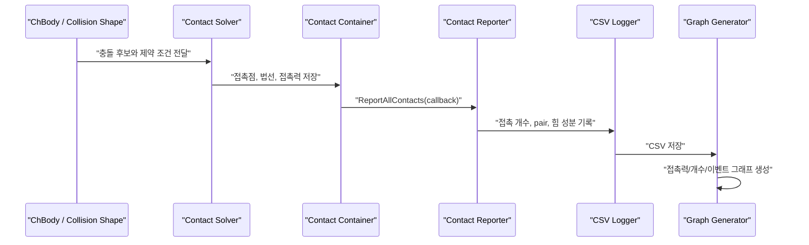
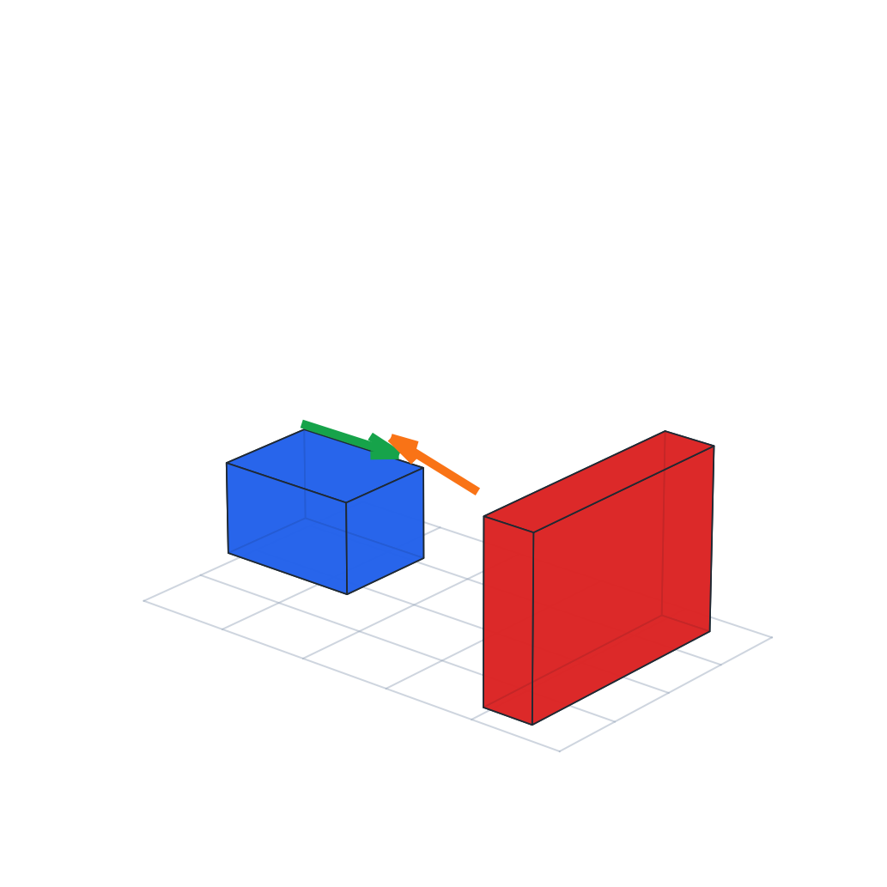
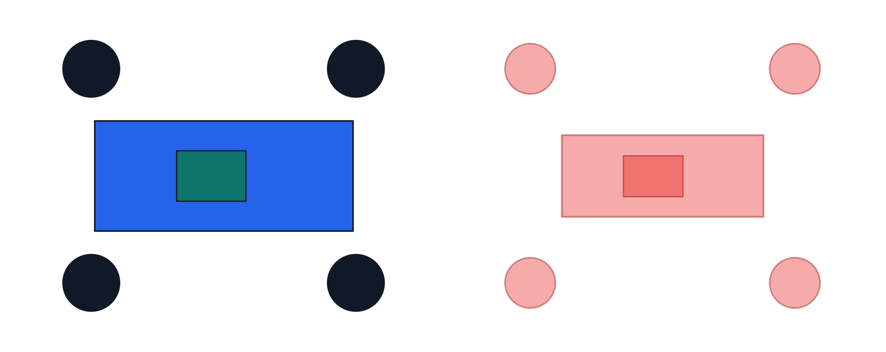
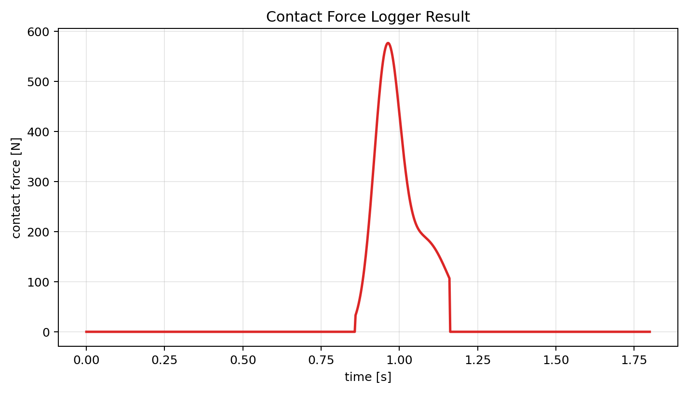
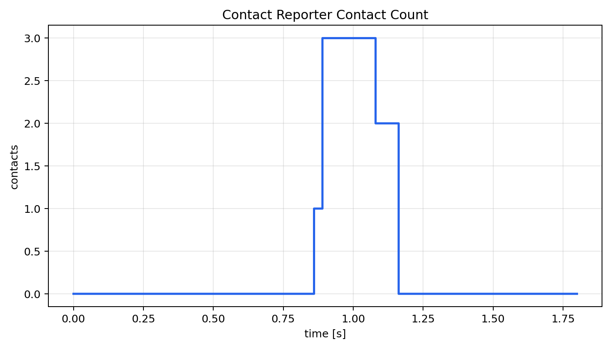
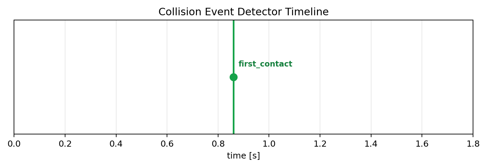
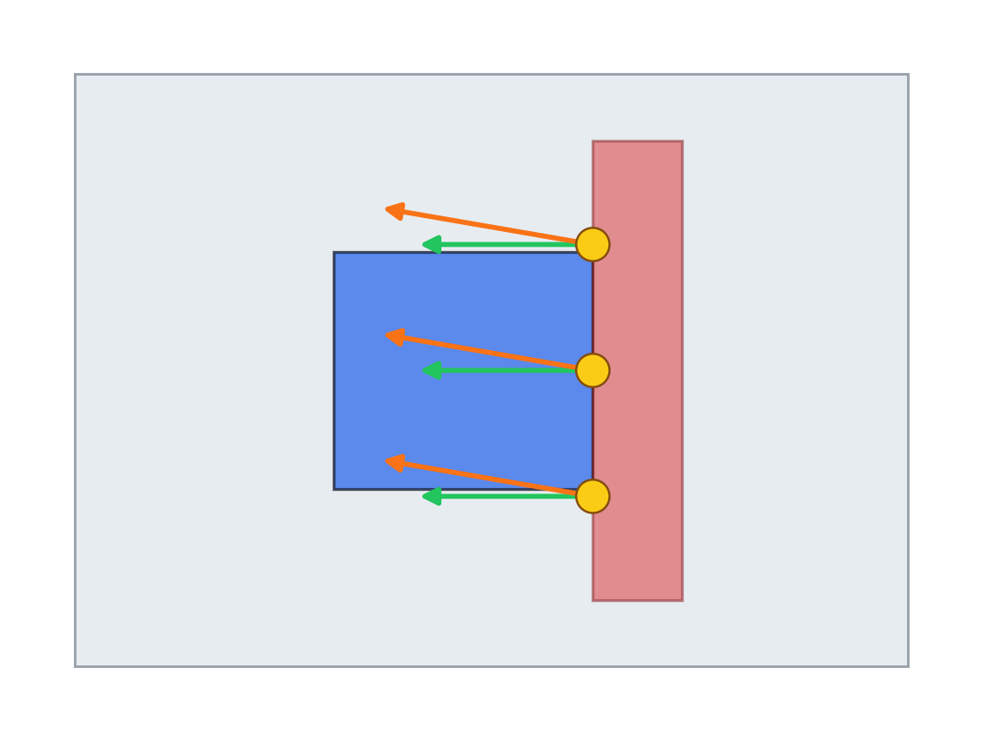

# 2.2.4 충돌/접촉 측정 Component 설계

충돌/접촉 측정 Component는 "무엇이 닿았는가", "얼마나 큰 힘이 발생했는가", "언제 충돌 이벤트가 시작되었는가"를 기록한다. 로버 실험에서 접촉은 단순 시각 효과가 아니라 성능 평가 데이터이다. 따라서 Collision Shape, Contact Material, Contact Reporter, Force Logger, Event Detector, Debug Visualization을 분리해 설계해야 한다.

이 절에서는 충돌/접촉 Component를 물리 형상, 접촉 재질, 측정 callback, 로그, 이벤트 검출, 시각적 검증으로 나누어 설명한다. 렌더링 자료는 접촉 형상과 접촉 방향을 확인하는 근거로 사용하고, 그래프와 CSV는 접촉력의 시간 이력을 검증하는 근거로 사용한다.

## 2.2.4.1 측정 흐름



## 2.2.4.2 Component 요약 표

| Component | 선택 기준 | 주요 API/모듈 | 조정 변수 | 확인 산출물 |
|---|---|---|---|---|
| Collision Shape | visual mesh와 별도로 안정적인 접촉 형상을 정의해야 할 때 | `ChCollisionShape*`, `ChBodyEasy*`, collision model | primitive 종류, 크기, 위치, collision enable | collision envelope 렌더 |
| Contact Material | 마찰, 반발, 강성 차이가 결과에 영향을 줄 때 | `ChContactMaterialNSC`, `ChContactMaterialSMC` | friction, restitution, stiffness, damping | 조건별 접촉력 그래프 |
| Contact Reporter | 어떤 body pair가 실제로 접촉했는지 순회해야 할 때 | `ReportContactCallback`, `ReportAllContacts` | pair 필터, 법선/점/힘 기록 여부 | pair별 접촉 개수 CSV |
| Contact Force Logger | 접촉력 peak와 시간 이력을 비교해야 할 때 | `GetContactForce`, reporter force sum, CSV writer | 샘플링 간격, force norm/axis component, 대상 body | contact force CSV/graph |
| Event Detector | first contact, separation, threshold exceed 같은 이벤트가 필요할 때 | threshold check, state transition, event label | force threshold, debounce, event name | event timeline CSV/graph |
| Debug Visualization | 접촉점, 법선 방향, 형상 불일치를 눈으로 확인해야 할 때 | VSG/Irrlicht debug draw, component render | 법선 scale, 표시 색, shape transparency | debug vector 렌더 |

## 2.2.4.3 Visual Shape와 Collision Shape의 차이

| 구분 | Visual Shape | Collision Shape |
|---|---|---|
| 목적 | 사람이 볼 렌더링 | 물리 접촉 계산 |
| 대표 API | `ChVisualShapeBox`, `ChVisualShapeCylinder`, mesh visual | `ChCollisionShapeBox`, `ChBodyEasyBox`, collision model |
| 복잡도 | 디테일이 많아도 됨 | 단순할수록 안정적이고 빠름 |
| 실패 양상 | 보기만 어색함 | 접촉 누락, 과도한 침투, 수치 불안정 |

## 2.2.4.4 Contact Material과 Contact Reporter의 역할 차이

| 구분 | Contact Material | Contact Reporter |
|---|---|---|
| 역할 | 접촉이 발생했을 때의 물리 파라미터 정의 | 발생한 접촉을 순회하며 측정값 추출 |
| 입력 | 마찰, 반발, stiffness/damping | contact container의 contact pair |
| 출력 | 솔버가 사용하는 접촉 조건 | 접촉 개수, 접촉점, 접촉력, 이벤트 |
| 설계 위치 | body/terrain 생성 시 | simulation loop 내부 |

## 2.2.4.5 Collision Shape Component

Collision Shape Component는 로버, 바퀴, 장애물, ground의 접촉 영역을 정의한다. 접촉 계산에서 가장 중요한 것은 "보기 좋은 모양"이 아니라 "물리적으로 안정적인 단순 형상"이다.

| 항목 | 설계 내용 |
|---|---|
| 역할 | 접촉 판정, 침투 깊이, 접촉 법선 계산 |
| 주요 API | `ChBodyEasyBox`, `ChBodyEasyCylinder`, `ChCollisionShapeBox`, `ChCollisionModel` |
| 주요 변수 | 크기, 위치, collision enable, contact material |
| 주의사항 | visual mesh와 collision primitive를 분리해 렌더에서 확인한다. |

아래 코드는 장애물을 collision 가능한 body로 만들고 고정하는 예시이다. 렌더의 붉은 고정 벽은 이 body가 접촉 pair의 한쪽 대상임을 보여준다.

```python
material = chrono.ChContactMaterialNSC()
material.SetFriction(0.35)
material.SetRestitution(0.05)

obstacle = chrono.ChBodyEasyBox(0.35, 1.2, 0.8, 1200, True, True, material)
obstacle.SetName("collision_obstacle")
obstacle.SetFixed(True)
obstacle.SetPos(chrono.ChVector3d(0.65, 0.0, 0.40))
system.AddBody(obstacle)
```

| 렌더링 관찰 기준 | 해석 기준 |
|---|---|
| Collision envelope | 로버 visual shape와 collision envelope가 구분되어야 실제 접촉 계산에 쓰이는 형상을 검증할 수 있다. |

| 시각 자료 |
|---|
|  |

**설명.** VSG로 캡처한 접촉 측정 장면이다. 파란 body와 빨간 obstacle은 각각 collision shape을 가진 body이고, 초록/주황 marker는 속도 방향과 접촉력 측정 방향을 개념적으로 나타낸다.

| 시각 자료 |
|---|
|  |

**설명.** 왼쪽은 사람이 보는 visual shape, 오른쪽은 물리 계산에 쓰는 단순 collision primitive를 분리해 보여준다. 시각화용 외형과 물리 계산용 형상은 서로 다를 수 있다.

## 2.2.4.6 Contact Material Component

Contact Material은 충돌이 발생한 뒤 솔버가 어떤 조건으로 접촉력을 계산할지 정한다. 같은 collision shape이어도 마찰 계수와 반발 계수가 다르면 로버의 정지 거리, 튀어오름, 미끄러짐이 달라진다.

| 파라미터 | 의미 | 관찰할 결과 |
|---|---|---|
| friction | 접선 방향 저항 | 미끄러짐, 주행력, 제동거리 |
| restitution | 반발 정도 | 충돌 후 튀어오름 |
| compliance/stiffness | 접촉 변형 또는 강성 | 침투량, contact force peak |
| damping | 충격 감쇠 | 진동, 접촉력 지속 시간 |

아래 코드는 같은 collision shape에 다른 접촉 조건을 줄 때의 material 정의이다. 그래프에서는 material 설정 차이가 force peak와 지속 시간 차이로 나타난다.

```python
soft_contact = chrono.ChContactMaterialNSC()
soft_contact.SetFriction(0.45)
soft_contact.SetRestitution(0.02)
```

| 렌더링 관찰 기준 | 해석 기준 |
|---|---|
| Contact material 비교 | 마찰이 다른 두 표면에서 이동 거리, 미끄러짐, 접촉력 peak 차이가 나타난다. |

| 그래프 |
|---|
|  |

**설명.** 같은 충돌이라도 접촉 재질이 더 단단하면 짧고 큰 force peak가 나타나고, 더 부드럽거나 damping이 큰 조건은 peak가 낮고 지속 시간이 길어진다. Contact Material은 "닿았는가"가 아니라 "닿은 뒤 어떤 힘으로 반응하는가"를 바꾸는 Component이다.

## 2.2.4.7 Contact Reporter Component

Contact Reporter는 `ReportContactCallback`을 상속해 contact container가 가진 접촉 정보를 필요한 형식으로 변환한다. 전체 접촉 개수만 세면 ground-wheel 접촉과 rover-obstacle 접촉이 섞이므로, 특정 body pair만 필터링하는 reporter가 필요하다.

아래 코드는 `body_a`, `body_b`로 지정한 pair만 세고, 그 pair의 접촉력 성분만 누적한다. Debug 렌더에서 노란 contact point가 보이더라도 reporter filter를 통과하지 않는 pair는 CSV에 기록하지 않는다.

```python
class PairContactReporter(chrono.ReportContactCallback):
    def __init__(self, body_a, body_b):
        super().__init__()
        self.body_a = body_a
        self.body_b = body_b
        self.count = 0
        self.fx = 0.0
        self.fy = 0.0
        self.fz = 0.0

    def reset(self):
        self.count = 0
        self.fx = self.fy = self.fz = 0.0

    def OnReportContact(self, pA, pB, plane_coord, distance, eff_radius,
                        cforce, ctorque, modA, modB, cnstr_offset):
        body_a = chrono.CastToChBody(modA)
        body_b = chrono.CastToChBody(modB)
        is_target_pair = (
            body_a == self.body_a and body_b == self.body_b
        ) or (
            body_a == self.body_b and body_b == self.body_a
        )
        if is_target_pair:
            fx, fy, fz = vec_xyz(cforce)
            self.count += 1
            self.fx += fx
            self.fy += fy
            self.fz += fz
        return True
```

여기서 `vec_xyz`는 PyChrono 버전에 따른 `vec.x`/`vec.x()` 접근 차이를 흡수하는 작은 helper이다. 시뮬레이션 루프에서는 다음처럼 사용한다.

```python
reporter.reset()
system.GetContactContainer().ReportAllContacts(reporter)
force_norm = (reporter.fx**2 + reporter.fy**2 + reporter.fz**2) ** 0.5
```

| 렌더링 관찰 기준 | 해석 기준 |
|---|---|
| Contact pair 구분 | 전체 접촉 중 rover-obstacle pair가 구분되어야 reporter가 어떤 접촉만 기록하는지 해석할 수 있다. |

## 2.2.4.8 Contact Force Logger Component

Contact Force Logger는 시간별 접촉력과 접촉 개수를 CSV에 저장한다. body의 `GetContactForce()`는 해당 body에 작용한 총 접촉력이고, reporter는 원하는 pair의 접촉만 필터링할 수 있다. 두 값을 혼동하지 않는 것이 중요하다.

| CSV 컬럼 | 의미 |
|---|---|
| `time_s` | 시뮬레이션 시간 |
| `body_a`, `body_b` | 필터링 대상 접촉 pair 이름 |
| `contact_count` | 현재 step에서 필터링된 접촉 개수 |
| `contact_force_N` | 접촉력 크기 |
| `contact_fx_N`, `contact_fy_N`, `contact_fz_N` | 접촉력 성분 |
| `source` | 데이터 생성 경로 |

아래 코드는 reporter가 만든 한 step의 값을 CSV 한 행으로 저장하는 부분이다. `body_a`, `body_b`를 같이 저장해야 나중에 그래프만 보아도 어떤 접촉 pair의 힘인지 추적할 수 있다.

```python
writer.writerow({
    "time_s": f"{system.GetChTime():.4f}",
    "body_a": "rover_body",
    "body_b": "rigid_obstacle",
    "contact_count": reporter.count,
    "contact_force_N": f"{force_norm:.5f}",
    "contact_fx_N": f"{reporter.fx:.5f}",
    "contact_fy_N": f"{reporter.fy:.5f}",
    "contact_fz_N": f"{reporter.fz:.5f}",
})
```

| 그래프 |
|---|
|  |

**설명.** 충돌 순간 접촉력 peak가 발생한다. peak 크기와 지속 시간은 충돌 강도와 timestep 안정성 평가에 사용된다.

| 그래프 |
|---|
|  |

**설명.** 접촉 개수는 충돌이 몇 개의 contact point/pair로 해석되는지 보여준다. 급격히 튀는 값은 timestep, collision shape, solver 설정을 점검해야 한다는 신호일 수 있다.

| 그래프 |
|---|
|  |

**설명.** 접촉력 성분을 분리해 보여준다. 진행 방향 반대 성분과 수직 성분을 함께 보면 force vector가 렌더의 contact normal과 맞는지 검증할 수 있다.

## 2.2.4.9 Collision Event Detector Component

Collision Event Detector는 연속 로그에서 상태 변화를 이벤트로 압축한다. 예를 들어 `contact_count`가 0에서 양수로 바뀌는 순간을 `first_contact`로 기록하면, 긴 CSV를 읽지 않아도 충돌 시작 시점을 바로 알 수 있다.

아래 코드는 접촉이 처음 발생한 한 순간만 이벤트로 남기는 구조이다. 이후 contact count가 계속 양수여도 `hit_started`가 이미 참이면 중복 이벤트를 만들지 않는다.

```python
hit_started = False
if contact_count > 0 and not hit_started:
    events.append({
        "event": "first_contact",
        "time_s": f"{system.GetChTime():.4f}",
        "contacts": contact_count,
    })
    hit_started = True
```

| 그래프 |
|---|
|  |

**설명.** `first_contact` 시점을 타임라인으로 보여준다. System 실험에서는 이 event를 성공/실패 판정, 충돌 전후 상태 비교, 자동 리포트 생성에 연결할 수 있다.

## 2.2.4.10 Debug Visualization Component

충돌/접촉은 숫자만 보면 원인을 찾기 어렵다. 따라서 렌더 창에서 collision shape, contact normal, contact point, force vector를 직접 확인하는 Debug Visualization Component가 필요하다.

| 확인할 항목 | 렌더에서 봐야 하는 것 |
|---|---|
| collision envelope | visual shape보다 단순한 충돌 형상이 body를 적절히 감싸는가 |
| contact point | 실제 닿는 위치에 접촉점이 생기는가 |
| contact normal | 법선 방향이 surface 밖을 향하는가 |
| force vector | 충돌 순간 힘 방향이 물리적으로 납득되는가 |

실제 VSG/Irrlicht debug draw는 사용하는 visualization backend에 따라 API가 달라질 수 있지만, Component 관점에서는 접촉점, 법선, 힘 방향을 같은 좌표계에서 그리는 것이 핵심이다.

```python
for contact in reported_contacts:
    draw_point(contact.point, color="yellow")
    draw_arrow(contact.point, contact.normal, color="green")
    draw_arrow(contact.point, contact.force, color="orange")
```

| 렌더링 관찰 기준 | 해석 기준 |
|---|---|
| 접촉점과 접촉력 방향 | 충돌 순간의 contact point와 force vector 방향이 물리적으로 타당한지 확인한다. |
| Visual/Collision 비교 | visual shape와 collision shape를 동시에 확인해 렌더링 형상과 물리 계산 형상의 차이를 검증한다. |

| Debug 렌더 |
|---|
|  |

**설명.** 노란 점은 contact point, 초록/주황 marker는 contact normal과 force vector 개념을 나타낸다. Contact Force Logger의 `contact_fx_N`, `contact_fz_N` 성분과 함께 보면 접촉 방향이 물리적으로 일관적인지 확인할 수 있다.

## 2.2.4.11 접촉 측정 검증 체크리스트

| 점검 항목 | 확인 방법 |
|---|---|
| 접촉 발생 전 force가 0인가 | 충돌 전 구간의 `contact_force_N` 확인 |
| first contact 시점이 렌더와 맞는가 | 이벤트 타임라인과 렌더링 프레임 비교 |
| 접촉력 방향이 타당한가 | `contact_fx_N`, `contact_fy_N`, `contact_fz_N`와 렌더 force vector 비교 |
| 접촉 개수가 과도하게 튀지 않는가 | contact count graph 확인 |
| collision shape가 너무 복잡하지 않은가 | 렌더에서 envelope 단순성 확인 |

## 2.2.4.12 실행 산출물

실행 코드: `../code/collision_contact/generate_collision_contact_components.py`  
CSV: `../outputs/csv/collision_contact_probe.csv`, `../outputs/csv/collision_event_timeline.csv`

## 2.2.4.13 참고 문헌

- Chrono Core contact/collision API: https://api.projectchrono.org/
- Chrono collision local note: `docs/core/collisions.md`
- 로컬 MVP0 참고: `lessons/phase4/hojin/lesson_19_hojin_rover_mvp0_collision_dummy.py`
