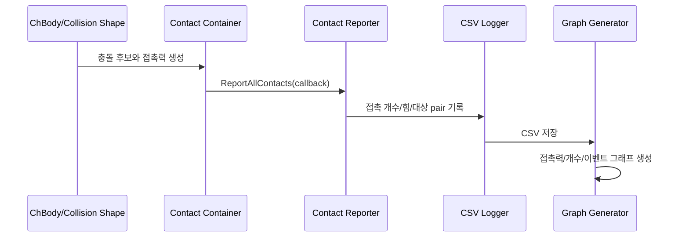

# 2.2.4 충돌/접촉 측정 Component 설계

충돌/접촉 측정 Component는 "무엇이 닿았는가", "얼마나 큰 힘이 발생했는가", "언제 충돌 이벤트가 시작되었는가"를 기록한다. 로버 실험에서 접촉은 단순 시각 효과가 아니라 성능 평가 데이터이므로, Collision Shape, Contact Material, Contact Reporter, Logger를 분리해 설계한다.

| 생성 산출물 | 파일 |
|---|---|
| Collision/Contact 측정 렌더 |  |
| Visual Shape와 Collision Shape 비교 |  |
| 접촉력 그래프 |  |
| 접촉 개수 그래프 |  |
| 충돌 이벤트 타임라인 |  |

## 측정 흐름



## Visual Shape와 Collision Shape의 차이

| 구분 | Visual Shape | Collision Shape |
|---|---|---|
| 목적 | 사람이 볼 렌더링 | 물리 접촉 계산 |
| 대표 API | `ChVisualShapeBox`, `ChVisualShapeCylinder`, mesh visual | `ChCollisionShapeBox`, `ChBodyEasyBox`, collision model |
| 복잡도 | 디테일이 많아도 됨 | 단순할수록 안정적이고 빠름 |
| 실패 양상 | 보기만 어색함 | 접촉 누락, 과도한 침투, 수치 불안정 |

## Contact Material과 Contact Reporter의 역할 차이

| 구분 | Contact Material | Contact Reporter |
|---|---|---|
| 역할 | 접촉이 발생했을 때의 물리 파라미터 정의 | 발생한 접촉을 순회하며 측정값 추출 |
| 입력 | 마찰, 반발, stiffness/damping | contact container의 contact pair |
| 출력 | 솔버가 사용하는 접촉 조건 | 접촉 개수, 접촉점, 접촉력, 이벤트 |
| 설계 위치 | body/terrain 생성 시 | simulation loop 내부 |

## Collision Shape Component

Collision Shape Component는 로버, 바퀴, 장애물, ground의 접촉 영역을 정의한다.

```python
material = chrono.ChContactMaterialNSC()
material.SetFriction(0.35)
material.SetRestitution(0.05)

obstacle = chrono.ChBodyEasyBox(0.35, 1.2, 0.8, 1200, True, True, material)
obstacle.SetFixed(True)
obstacle.SetPos(chrono.ChVector3d(0.65, 0.0, 0.40))
system.AddBody(obstacle)
```

## Contact Reporter Component

Contact Reporter는 `ReportContactCallback`을 상속해 contact container가 가진 접촉 정보를 필요한 형식으로 변환한다. 아래 코드는 특정 두 body 사이의 접촉만 세는 패턴이다.

```python
class PairContactReporter(chrono.ReportContactCallback):
    def __init__(self, body_a, body_b):
        super().__init__()
        self.body_a = body_a
        self.body_b = body_b
        self.count = 0
        self.force_sum = 0.0

    def reset(self):
        self.count = 0
        self.force_sum = 0.0

    def OnReportContact(self, pA, pB, plane_coord, distance, eff_radius,
                        cforce, ctorque, modA, modB, cnstr_offset):
        body_a = chrono.CastToChBody(modA)
        body_b = chrono.CastToChBody(modB)
        if {body_a, body_b} == {self.body_a, self.body_b}:
            self.count += 1
            self.force_sum += vec_length(cforce)
        return True
```

## Contact Force Logger Component

Contact Force Logger는 시간별 접촉력과 접촉 개수를 CSV에 저장한다. 본 예제는 body의 `GetContactForce()`와 contact container의 `GetNumContacts()`를 함께 기록했다.

| CSV 컬럼 | 의미 |
|---|---|
| `time_s` | 시뮬레이션 시간 |
| `contact_count` | 현재 step 접촉 개수 |
| `contact_force_N` | 접촉력 크기 |
| `contact_fx_N`, `contact_fy_N`, `contact_fz_N` | 접촉력 성분 |
| `source` | PyChrono 실행 또는 fallback 여부 |

```python
contact_force = rover.GetContactForce()
contact_count = system.GetContactContainer().GetNumContacts()
writer.writerow({
    "time_s": system.GetChTime(),
    "contact_count": contact_count,
    "contact_force_N": vec_length(contact_force),
})
```

## Collision Event Detector Component

Collision Event Detector는 연속 로그에서 상태 변화를 이벤트로 압축한다. 예를 들어 `contact_count`가 0에서 양수로 바뀌는 순간을 `first_contact`로 기록한다.

```python
hit_started = False
if contact_count > 0 and not hit_started:
    events.append({
        "event": "first_contact",
        "time_s": f"{system.GetChTime():.4f}",
        "contacts": contact_count,
    })
    hit_started = True
```

## 이미지와 그래프 해석

| 항목 | 해석 |
|---|---|
| 접촉력 그래프 | 충돌 순간의 peak force와 충돌 지속 시간을 확인한다. |
| 접촉 개수 그래프 | 접촉 pair가 증가/감소하는 구간으로 충돌 안정성을 확인한다. |
| 이벤트 타임라인 | 긴 CSV를 읽지 않고도 first contact 같은 주요 시점을 확인한다. |

실행 코드: `../code/collision_contact/generate_collision_contact_components.py`  
CSV: `../outputs/csv/collision_contact_probe.csv`, `../outputs/csv/collision_event_timeline.csv`

## 참고 문헌

- Chrono collision local note: `docs/core/collisions.md`
- Chrono Core contact/collision API: https://api.projectchrono.org/
- 로컬 MVP0 참고: `lessons/phase4/hojin/lesson_19_hojin_rover_mvp0_collision_dummy.py`
