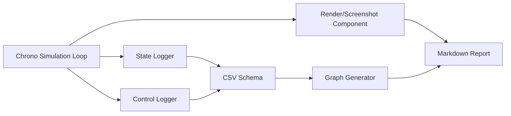

# 2.2.5 데이터 출력/시각화 Component 설계

데이터 출력/시각화 Component는 시뮬레이션 결과를 팀 보고서와 AI 전처리 레이어가 읽을 수 있는 형태로 바꾸는 부품이다. 본 절에서는 State Logger, Control Logger, CSV Schema, Graph Generator, Render/Screenshot Component를 필수 Component로 두고, Camera/LiDAR/GPS/IMU는 선택적 Sensor Component로 정리한다.

| 생성 산출물 | 파일 |
|---|---|
| Render/Sensor 배치 렌더 |  |
| State Logger 궤적 그래프 |  |
| Control Logger 입력 그래프 |  |

## 데이터 흐름



## State Logger Component

State Logger는 body의 위치, 속도, 자세, 접촉력을 시간별로 기록한다.

| 컬럼 | 단위 | 설명 |
|---|---:|---|
| `time_s` | s | 시뮬레이션 시간 |
| `body_name` | - | 기록 대상 body 이름 |
| `x_m`, `y_m`, `z_m` | m | 위치 |
| `vx_mps`, `vy_mps`, `vz_mps` | m/s | 선속도 |
| `roll_rad`, `pitch_rad`, `yaw_rad` | rad | 자세. 단순 예제에서는 0으로 두고 Vehicle 확장에서 quaternion 변환 |
| `contact_force_N` | N | body에 작용한 접촉력 크기 |
| `source` | - | PyChrono 실행 또는 fallback 정보 |

```python
pos = rover.GetPos()
vel = rover.GetPosDt()
writer.writerow({
    "time_s": f"{system.GetChTime():.3f}",
    "body_name": rover.GetName(),
    "x_m": pos.x,
    "y_m": pos.y,
    "z_m": pos.z,
    "vx_mps": vel.x,
    "vy_mps": vel.y,
    "vz_mps": vel.z,
})
```

## Control Logger Component

Control Logger는 시뮬레이션에 넣은 throttle, brake, steering, torque command를 기록한다. System 단계에서 제어기를 바꾸더라도 이 스키마를 유지하면 실험 비교가 쉬워진다.

| 컬럼 | 단위/범위 | 설명 |
|---|---:|---|
| `time_s` | s | 입력이 적용된 시간 |
| `throttle` | 0~1 | 구동 입력 |
| `brake` | 0~1 | 제동 입력 |
| `steering` | -1~1 또는 rad | 조향 입력 |
| `drive_torque_Nm` | N m | 구동 토크 추정 또는 명령값 |
| `source` | - | 실행 출처 |

```python
control_writer.writerow({
    "time_s": f"{t:.3f}",
    "throttle": f"{throttle:.5f}",
    "brake": f"{brake:.5f}",
    "steering": f"{steering:.5f}",
    "drive_torque_Nm": f"{120.0 * throttle:.5f}",
})
```

## CSV Schema

CSV는 Component 간 약속이다. 최소 원칙은 다음과 같다.

| 원칙 | 설명 |
|---|---|
| 단위 포함 | `x` 대신 `x_m`, `speed` 대신 `speed_mps`처럼 컬럼명에 단위를 붙인다. |
| 시간 기준 통일 | 모든 CSV는 `time_s`를 첫 컬럼으로 둔다. |
| 대상 이름 포함 | 다중 로버 실험을 위해 `body_name` 또는 `component_name`을 둔다. |
| 원본 보존 | 그래프용으로 가공하기 전 raw CSV를 `outputs/csv/`에 저장한다. |

실행 산출물:

| CSV | 연결 그래프 |
|---|---|
| `../outputs/csv/data_visualization_state_log.csv` | `../images/graphs/data_visualization_state_trajectory.png` |
| `../outputs/csv/data_visualization_control_log.csv` | `../images/graphs/data_visualization_control_inputs.png` |
| `../outputs/csv/collision_contact_probe.csv` | `../images/graphs/collision_contact_force_graph.png`, `../images/graphs/collision_contact_count_graph.png` |
| `../outputs/csv/environment_terrain_height_friction_sinkage.csv` | `../images/graphs/terrain_height_sinkage_profile.png`, `../images/graphs/terrain_contact_material_friction_map.png` |

## Graph Generator

Graph Generator는 CSV를 읽어 궤적, 속도, 접촉력, 제어 입력을 이미지로 저장한다. matplotlib는 창을 띄우지 않는 `Agg` backend를 사용한다.

```python
import matplotlib
matplotlib.use("Agg")
import matplotlib.pyplot as plt
import numpy as np

data = np.genfromtxt("state_log.csv", delimiter=",", names=True)
fig, ax = plt.subplots()
ax.plot(data["x_m"], data["y_m"])
ax.set_xlabel("x [m]")
ax.set_ylabel("y [m]")
fig.savefig("trajectory.png", dpi=180)
```

## Render/Screenshot Component

Render/Screenshot Component는 두 가지 경로를 가진다.

| 경로 | 설명 | 본 작업 적용 |
|---|---|---|
| Chrono VSG/Irrlicht | 실제 시뮬레이션 창을 렌더링 | 현재 환경은 Irrlicht import 가능, VSG 미설치. 자동 창 캡처는 보고서 생성 자동화에서 제외 |
| matplotlib 3D 렌더 | Component 배치를 3D 도식으로 안정적으로 저장 | 모든 제출용 렌더 이미지를 `images/renders/`에 생성 |

본 작업은 PyChrono Core를 실제 실행해 CSV를 만들고, 동일 Component 파라미터를 matplotlib 3D로 렌더링했다. 창 기반 렌더가 필수인 경우 `pychrono.irrlicht`를 사용해 `ChVisualSystemIrrlicht`를 붙이고 수동 또는 별도 스크린샷 루틴을 추가한다.

## 선택적 Sensor Component

Sensor Component는 현재 필수 구현 대상이 아니라 확장 Component이다. 공식 Chrono::Sensor는 RGB camera, LiDAR, GPS, IMU 등을 지원하지만, 현재 conda 환경에서는 `pychrono.sensor`가 설치되어 있지 않아 실제 Sensor 실행은 하지 않았다.

| Sensor | 역할 | 연결 데이터 |
|---|---|---|
| Camera | RGB/Depth/Segmentation 이미지 | frame index, pose, image path |
| LiDAR | point cloud 또는 range scan | timestamp, point cloud path |
| GPS | 전역 위치 측정 | latitude/longitude 또는 local xyz |
| IMU | 가속도/각속도 | acceleration, gyro, orientation |

## 실행 산출물

실행 코드: `../code/data_visualization/generate_data_visualization_components.py`  
CSV: `../outputs/csv/data_visualization_state_log.csv`, `../outputs/csv/data_visualization_control_log.csv`

## 참고 문헌

- Chrono Sensor overview: https://api.projectchrono.org/sensor_overview.html
- Chrono Visualization overview: https://api.projectchrono.org/vehicle_visualization.html
- Chrono visualization local notes: `docs/visualization/`
- Chrono postprocess local notes: `docs/postprocess/index.md`
