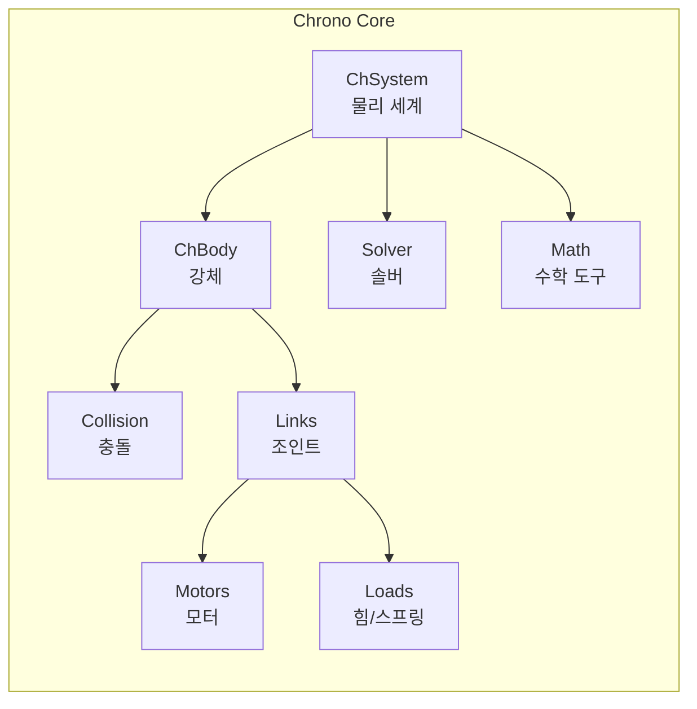

# Chrono Core — 물리 엔진의 심장

> 🟢 우리 팀 필수 | 💻 CPU만으로 동작
> 📖 [공식 매뉴얼](https://api.projectchrono.org/manual_core.html)

모든 Chrono 모듈의 기반이 되는 핵심 엔진입니다.
물리 세계 생성, 강체, 충돌, 조인트, 모터, 힘, 솔버 등 모든 기본 기능을 포함합니다.

## 하위 문서

| 주제    | 문서               | 핵심 클래스                                       |
| ----- | ---------------- | -------------------------------------------- |
| 시스템   | [[system]]       | `ChSystemNSC`, `ChSystemSMC`                 |
| 강체    | [[rigid_bodies]] | `ChBody`, `ChBodyEasy*`                      |
| 충돌    | [[collisions]]   | `ChCollisionShape*`, `ChContactMaterial*`    |
| 조인트   | [[links]]        | `ChLinkRevolute`, `ChLinkLockLock` 외 20+     |
| 모터    | [[motors]]       | `ChLinkMotorRotation*`, `ChLinkMotorLinear*` |
| 힘/스프링 | [[loads]]        | `ChLinkTSDA`, `ChForce`, `ForceFunctor`      |
| 솔버    | [[solver]]       | `PSOR`, `APGD`, `HHT`                        |
| 수학 도구 | [[math]]         | `ChVector3d`, `ChQuaterniond`, `ChFunction*` |
<<<<<<< HEAD
=======

## C++ API 문서 → PyChrono 변환 가이드

> [!important] 공식 API 문서는 C++ 기반
> Chrono 공식 사이트의 API 문서와 코드 예시는 모두 **C++**로 작성되어 있다.
> 하지만 PyChrono는 SWIG 자동 바인딩으로 **클래스명과 메서드명이 거의 동일**하므로,
> 아래 규칙만 알면 C++ 문서를 보고 Python으로 바로 옮길 수 있다. (==C++ 코드를 ai에게 물어보면 Python으로 알려줍니다!==)

| C++ 패턴 | Python (PyChrono) | 비고 |
|----------|-------------------|------|
| `auto body = chrono_types::make_shared<ChBody>()` | `body = chrono.ChBody()` | shared_ptr 불필요 |
| `body->SetPos(ChVector3d(1,2,3))` | `body.SetPos(chrono.ChVector3d(1,2,3))` | `->` → `.` |
| `sys.AddBody(body)` | `sys.AddBody(body)` | 동일 |
| `ChVector3<double>` | `chrono.ChVector3d` | 템플릿 → 접미사 `d` |
| `ChQuaternion<double>` | `chrono.ChQuaterniond` | 동일 패턴 |
| `#include "chrono/..."` | `import pychrono as chrono` | 모듈 임포트 |
| `std::cout << ...` | `print(...)` | 출력 |
| `ChFramed(pos, rot)` | `chrono.ChFramed(pos, rot)` | 동일 |
| `GetReaction2().GetForce()` | `GetReaction2().force` | 일부 getter → 속성 |

> [!tip] 팀원 작업 시
> 이 docs/ 폴더의 모든 코드 예시는 **PyChrono(Python)** 기준으로 작성한다.
> C++ API 문서 링크는 참고용으로 함께 표기하되, 코드는 Python으로 옮겨서 작성할 것.
> 실제 동작하는 Python 데모: `chrono/src/demos/python/`
>>>>>>> 83310e34b74ed969542c1b0a7343c5f62aad54ad

## 관련 레슨

- Phase 1 (lesson 01~06): 시스템, 강체, 충돌, 재질, 시각화
- Phase 2 (lesson 07~12): 조인트, 스프링, 모터, 기어

← [[../index|탐사 지도로 돌아가기]]
