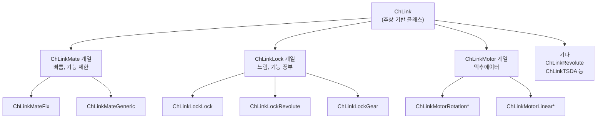

# 조인트와 링크 (Links)

> [!info] 코드 표기
> 이 문서의 코드 예시는 **PyChrono(Python)** 기준이다. C++ API 문서와의 차이점은 [[core/index#C++ API 문서 → PyChrono 변환 가이드|변환 가이드]] 참고.

**링크(Link)**는 두 [[core/rigid_bodies|강체]] 사이에 **구속 조건(Constraint)**을 부여하여 상대 운동을 제한한다. 예를 들어 문의 경첩(Revolute)은 한 축으로만 회전을 허용하고, 나머지 5개 자유도를 제거한다.

$$
\text{실제 자유도} = 6 \times N_\text{bodies} - \sum \text{제거된 DOF}
$$

> [!tip] 구속의 핵심
> 자유 공간에서 물체 하나는 6 DOF를 가진다. 조인트를 추가할 때마다 DOF가 줄어들어 원하는 운동만 남긴다.

---

## 링크 계층 구조


Chrono의 링크는 세 가지 계열(Family)로 나뉜다:



### 계열 비교

| | Mate 계열 | Lock 계열 | Motor 계열 |
|---|---|---|---|
| 성능 | 빠름 | 보통 | 보통 |
| 조인트 한계(Limits) | X | O | O |
| 마찰 | X | O | X |
| 반력 조회 | O | O | O |
| 사용 권장 | 단순 구속 | 한계/마찰 필요 시 | 액추에이터 |

> [!note] 독립 클래스
> `ChLinkRevolute`, `ChLinkSpherical` 등 자주 쓰는 조인트는 위 계열에 속하지 않는 **독립 클래스**다. 가장 효율적이고 사용이 간편하다.

---

## 조인트 종류 전체 표

### 자주 사용하는 조인트 (독립 클래스)

| 클래스 | 제거 DOF | 허용 운동 | 실제 예시 |
|--------|:--------:|----------|-----------|
| `ChLinkRevolute` | 5 | 1축 회전 | 문 경첩, 바퀴 축 |
| `ChLinkSpherical` | 3 | 3축 회전 | 볼조인트, 어깨 관절 |
| `ChLinkPrismatic` | 5 | 1축 직선 | 서랍 레일, 피스톤 |
| `ChLinkUniversal` | 4 | 2축 회전 | 유니버설 조인트 |

### Mate 계열

| 클래스 | 제거 DOF | 허용 운동 |
|--------|:--------:|----------|
| `ChLinkMateFix` | 6 | 없음 (완전 고정) |
| `ChLinkMateGeneric` | 1~6 | 선택적 구속 |

### Lock 계열

| 클래스 | 제거 DOF | 허용 운동 | 실제 예시 |
|--------|:--------:|----------|-----------|
| `ChLinkLockLock` | 6 | 없음 (용접) | 강체 결합 |
| `ChLinkLockRevolute` | 5 | 1축 회전 | 한계 있는 경첩 |
| `ChLinkLockCylindrical` | 4 | 1축 회전 + 1축 직선 | 실린더 피스톤 |
| `ChLinkLockPrismatic` | 5 | 1축 직선 | 슬라이더 |
| `ChLinkLockSpherical` | 3 | 3축 회전 | 볼조인트 (한계 가능) |
| `ChLinkLockPlaneLock` | 3 | 2축 직선 + 1축 회전 | 평면 위 이동 |
| `ChLinkLockOldham` | 4 | 2축 직선 | 올덤 커플링 |
| `ChLinkLockGear` | 1 | 기어비 구속 | 기어 맞물림 |
| `ChLinkLockPulley` | 1 | 풀리비 구속 | 벨트-풀리 |

### Motor 계열

| 클래스 | 기능 | 입력 함수 |
|--------|------|-----------|
| `ChLinkMotorRotationSpeed` | 일정 각속도 회전 | `SetSpeedFunction()` |
| `ChLinkMotorRotationAngle` | 각도 궤적 추종 | `SetAngleFunction()` |
| `ChLinkMotorRotationTorque` | 토크 입력 | `SetTorqueFunction()` |
| `ChLinkMotorLinearSpeed` | 일정 속도 직선 | `SetSpeedFunction()` |
| `ChLinkMotorLinearPosition` | 위치 궤적 추종 | `SetDistanceFunction()` |
| `ChLinkMotorLinearForce` | 힘 입력 | `SetForceFunction()` |

### 스프링-댐퍼

| 클래스 | 기능 | 설명 |
|--------|------|------|
| `ChLinkTSDA` | 1D 스프링-댐퍼 | 병진 방향 탄성체 |
| `ChLinkRSDA` | 회전 스프링-댐퍼 | 회전 방향 탄성체 |

> 모터 상세 → [[core/motors]], 스프링/힘 상세 → [[core/loads]]

---

## 주요 조인트 상세

### Revolute — 회전 조인트 (5 DOF 제거)

문의 경첩처럼 **한 축으로만 회전**을 허용한다. 가장 많이 사용하는 조인트.


```
     ┌──────────┐
     │  Body A  │
     └────┬─────┘
          │  ← 회전축 (Z)
     ┌────┴─────┐
     │  Body B  │
     └──────────┘
     
  허용: Z축 회전 (1 DOF)
  금지: x,y,z 이동 + X,Y 회전 (5 DOF)
```

```python
joint = chrono.ChLinkRevolute()

# 조인트 프레임: 위치와 방향 (월드 좌표)
frame = chrono.ChFramed(
    chrono.ChVector3d(0, 1, 0),    # 조인트 위치
    chrono.QUNIT                   # 기본 방향 (Z축 = 회전축)
)

joint.Initialize(body_A, body_B, frame)
sys.Add(joint)
```

### Prismatic — 직선 조인트 (5 DOF 제거)

서랍 레일처럼 **한 축으로만 직선 이동**을 허용한다.

```python
prismatic = chrono.ChLinkLockPrismatic()
prismatic.Initialize(
    slider, ground,
    chrono.ChFramed(
        chrono.ChVector3d(0, 0, 0),
        chrono.QuatFromAngleY(math.pi / 2)  # X축 방향으로 이동
    )
)
sys.Add(prismatic)
```

### Spherical — 볼조인트 (3 DOF 제거)


3축 회전을 모두 허용하지만, 위치는 고정된다. 어깨 관절과 유사.

```python
ball_joint = chrono.ChLinkSpherical()
ball_joint.Initialize(
    body_A, body_B,
    chrono.ChFramed(chrono.ChVector3d(1, 0, 0))
)
sys.Add(ball_joint)
```

### Fixed — 완전 고정 (6 DOF 제거)

두 물체를 **용접**한 것처럼 완전히 고정한다. 상대 운동 없음.

```python
weld = chrono.ChLinkMateFix()
weld.Initialize(body_A, body_B,
                chrono.ChFramed(chrono.ChVector3d(0, 0, 0)))
sys.Add(weld)
```

---

## 조인트 초기화 패턴

모든 조인트는 `Initialize()` 메서드로 두 물체를 연결한다. **월드 좌표계** 기준으로 조인트 위치/방향을 지정한다.

```python
joint.Initialize(
    body_1,                              # 첫 번째 물체
    body_2,                              # 두 번째 물체
    chrono.ChFramed(                     # 조인트 프레임 (월드 좌표)
        chrono.ChVector3d(x, y, z),      #   위치
        chrono.QuatFromAngleZ(angle)     #   방향 (회전축 결정)
    )
)
sys.Add(joint)    # 시스템에 추가하는 것을 잊지 말 것!
```

> [!warning] 흔한 실수
> `Initialize()` 호출 후 `sys.Add(joint)`를 빠뜨리면 조인트가 작동하지 않는다. 물체는 자유롭게 떨어진다.

---

## 반력(Reaction Force) 조회

조인트에 걸리는 힘과 토크를 조회할 수 있다. 구조 해석이나 모터 설계에 유용하다.

```python
# 반력 (Force) — Body 2 기준
reaction_wrench = joint.GetReaction2()
force = reaction_wrench.force       # ChVector3d
torque = reaction_wrench.torque     # ChVector3d

import math
force_magnitude = math.sqrt(force.x**2 + force.y**2 + force.z**2)
print(f"조인트 반력: {force_magnitude:.2f} N")
```

> [!note] PyChrono 주의사항
> `GetReaction2()`가 반환하는 `ChWrenchd` 객체는 `.GetForce()` 메서드가 아닌 **`.force`와 `.torque` 속성**으로 접근한다.

---

## 모터 조인트 — 간략 소개


조인트에 모터를 달면 외부 입력(속도, 각도, 힘)으로 운동을 제어할 수 있다.

```python
# 일정 속도 회전 모터
motor = chrono.ChLinkMotorRotationSpeed()
motor.Initialize(arm, ground,
    chrono.ChFramed(chrono.ChVector3d(0, 0, 0), chrono.QUNIT))

# 속도 함수: 상수 (일정 RPM)
motor.SetSpeedFunction(chrono.ChFunctionConst(3.14))  # π rad/s
sys.Add(motor)

# 모터 상태 조회
angle = motor.GetMotorAngle()     # 현재 각도 (rad)
torque = motor.GetMotorTorque()   # 모터 토크 (Nm)
```

> 모터 상세 → [[core/motors|모터 (Motors)]]

---

## 스프링-댐퍼 — 간략 소개

`ChLinkTSDA`는 두 물체 사이에 1D 스프링-댐퍼를 연결한다.

$$
F = -k(l - l_0) - c \cdot \dot{l}
$$

- $k$: 스프링 강성 (N/m)
- $c$: 감쇠 계수 (Ns/m)
- $l$: 현재 길이, $l_0$: 자연 길이

```python
spring = chrono.ChLinkTSDA()
spring.Initialize(body_A, body_B, True,
    chrono.ChVector3d(0, 0, 0),    # body_A 연결점 (로컬)
    chrono.ChVector3d(0, 0, 0))    # body_B 연결점 (로컬)
spring.SetRestLength(1.5)
spring.SetSpringCoefficient(50)    # k = 50 N/m
spring.SetDampingCoefficient(2)    # c = 2 Ns/m
sys.AddLink(spring)
```

> 스프링/힘 상세 → [[core/loads|힘과 스프링-댐퍼]]

---

## 관련 문서

- [[core/system|ChSystem]] — 조인트를 담는 시뮬레이션 세계
- [[core/rigid_bodies|강체]] — 조인트로 연결할 물체
- [[core/motors|모터]] — 조인트에 부착하는 액추에이터
- [[core/loads|힘과 스프링-댐퍼]] — TSDA, 외력, ForceFunctor
- [공식 API 문서 (C++)](https://api.projectchrono.org/classchrono_1_1_ch_link.html)
- [Links 매뉴얼 (C++)](https://api.projectchrono.org/links.html)
- Python 데모: `chrono/src/demos/python/mbs/demo_MBS_revolute.py`
- ← [[core/index|Core 개요로 돌아가기]]
