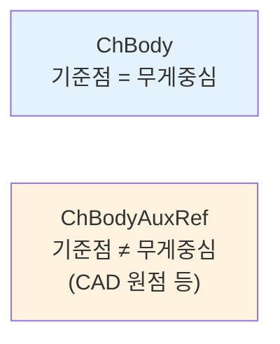

# 강체 (Rigid Bodies)

> [!info] 코드 표기
> 이 문서의 코드 예시는 **PyChrono(Python)** 기준이다. C++ API 문서와의 차이점은 [[core/index#C++ API 문서 → PyChrono 변환 가이드|변환 가이드]] 참고.

**강체(Rigid Body)**란 형태가 변하지 않는 단단한 물체다. Chrono에서 모든 물체는 `ChBody` 클래스로 표현되며, 3D 공간에서 **6자유도(DOF)**를 가진다.

$$
\text{6 DOF} = \underbrace{x, y, z}_{\text{병진 3}} + \underbrace{\phi, \theta, \psi}_{\text{회전 3}}
$$

> [!tip] 내부 표현
> Chrono는 위치를 7개 좌표(위치 3 + 쿼터니언 4)로 저장하지만, 실제 자유도는 6개다. 쿼터니언의 단위 길이 구속($|q|=1$)이 1개의 자유도를 제거한다.

---

### ChBody 좌표계

아래 그림에서 `ChBody`의 기준 프레임(Reference Frame)은 곧 **무게중심(COM)**이다. 모든 위치/회전 연산은 이 프레임을 기준으로 동작한다.


---

## 물체 생성 — 두 가지 방법

### 방법 A: `ChBody` (수동 설정)

질량, 관성, 위치를 직접 지정한다. 충돌 형상과 시각 형상도 별도로 추가해야 한다.

```python
import pychrono as chrono

body = chrono.ChBody()

# 질량 설정
body.SetMass(5.0)    # 5 kg

# 관성 텐서 설정 (대각 성분)
body.SetInertiaXX(chrono.ChVector3d(0.5, 0.5, 0.5))

# 초기 위치
body.SetPos(chrono.ChVector3d(0, 10, 0))    # (x=0, y=10, z=0)

# 초기 속도
body.SetPosDt(chrono.ChVector3d(1, 0, 0))   # x 방향으로 1 m/s

# 고정 여부
body.SetFixed(False)    # True면 움직이지 않음 (바닥 등)

# 시각화 형상 추가
box_shape = chrono.ChVisualShapeBox(1, 1, 1)    # 1m × 1m × 1m
box_shape.SetColor(chrono.ChColor(0.8, 0.2, 0.2))
body.AddVisualShape(box_shape)

# 시스템에 추가
sys.AddBody(body)
```

### 방법 B: `ChBodyEasy*` (간편 생성)

형태와 밀도만 지정하면 **질량과 관성이 자동 계산**된다.

```python
# 상자: 가로 1m × 세로 2m × 깊이 0.5m, 밀도 1000 kg/m³
box = chrono.ChBodyEasyBox(1, 2, 0.5, 1000, True)
#                          x  y  z    밀도   시각화

# 구: 반지름 0.3m, 밀도 2000 kg/m³
sphere = chrono.ChBodyEasySphere(0.3, 2000, True)

# 실린더: 반지름 0.2m, 높이 1m, 밀도 1500 kg/m³
cyl = chrono.ChBodyEasyCylinder(
    chrono.ChAxis_Y,    # 축 방향 (Y축)
    0.2, 1.0,           # 반지름, 높이
    1500, True          # 밀도, 시각화
)
```

> [!note] 자동 계산 원리
> 예를 들어 `ChBodyEasyBox(a, b, c, ρ, vis)`는 내부적으로:
> - 질량: $m = \rho \cdot a \cdot b \cdot c$
> - 관성: $I_{xx} = \frac{m}{12}(b^2 + c^2)$, $I_{yy} = \frac{m}{12}(a^2 + c^2)$, $I_{zz} = \frac{m}{12}(a^2 + b^2)$

---

## 위치와 회전

### 위치 — ChVector3d

```python
# 위치 설정/조회
body.SetPos(chrono.ChVector3d(1.0, 2.0, 3.0))
pos = body.GetPos()
print(f"x={pos.x}, y={pos.y}, z={pos.z}")
```

### 회전 — ChQuaterniond

Chrono는 회전을 **쿼터니언(Quaternion)**으로 표현한다. 쿼터니언은 4개의 숫자 $q = (e_0, e_1, e_2, e_3)$로 3D 회전을 나타내며, 짐벌 락(Gimbal Lock) 문제가 없다.

$$
q = e_0 + e_1\mathbf{i} + e_2\mathbf{j} + e_3\mathbf{k}, \quad |q| = 1
$$

축-각도(Axis-Angle) 변환:

$$
q = \cos\frac{\theta}{2} + \sin\frac{\theta}{2}(u_x\mathbf{i} + u_y\mathbf{j} + u_z\mathbf{k})
$$

여기서 $\theta$는 회전 각도, $(u_x, u_y, u_z)$는 회전 축의 단위 벡터.

```python
# 방법 1: 기본 (회전 없음)
body.SetRot(chrono.QUNIT)   # 단위 쿼터니언 = 회전 없음

# 방법 2: 축-각도로 회전
import math
# Z축 기준 45도 회전
q = chrono.QuatFromAngleZ(math.radians(45))
body.SetRot(q)

# 방법 3: 임의 축 기준 회전
axis = chrono.ChVector3d(1, 1, 0).GetNormalized()
q = chrono.QuatFromAngleAxis(math.radians(30), axis)
body.SetRot(q)
```

---

## 질량과 관성 텐서(Inertia Tensor)

관성 텐서는 물체가 **회전에 얼마나 저항하는지** 나타내는 $3 \times 3$ 대칭 행렬이다:

$$
\mathbf{I} = \begin{bmatrix} I_{xx} & -I_{xy} & -I_{xz} \\ -I_{xy} & I_{yy} & -I_{yz} \\ -I_{xz} & -I_{yz} & I_{zz} \end{bmatrix}
$$

Chrono에서는 대각 성분 $(I_{xx}, I_{yy}, I_{zz})$과 비대각 성분을 별도로 설정한다.

```python
# 대각 성분만 설정 (주축과 정렬된 경우)
body.SetInertiaXX(chrono.ChVector3d(Ixx, Iyy, Izz))

# 비대각 성분도 설정 (비대칭 물체)
body.SetInertiaXY(chrono.ChVector3d(Ixy, Ixz, Iyz))
```

| 기본 형상 | $I_{xx}$ | $I_{yy}$ | $I_{zz}$ |
|-----------|----------|----------|----------|
| 상자 $(a \times b \times c)$ | $\frac{m}{12}(b^2+c^2)$ | $\frac{m}{12}(a^2+c^2)$ | $\frac{m}{12}(a^2+b^2)$ |
| 구 (반지름 $r$) | $\frac{2}{5}mr^2$ | $\frac{2}{5}mr^2$ | $\frac{2}{5}mr^2$ |
| 실린더 (반지름 $r$, 높이 $h$) | $\frac{m}{12}(3r^2+h^2)$ | $\frac{m}{12}(3r^2+h^2)$ | $\frac{1}{2}mr^2$ |

---

## 시각화(Visual)와 충돌(Collision)

Chrono에서 **시각 형상**과 **충돌 형상**은 **독립적**이다. 시각화는 렌더링용이고, 충돌은 물리 계산용이다.

```python
body = chrono.ChBody()

# 시각 형상: 보이는 모양 (렌더링 전용)
vis_shape = chrono.ChVisualShapeSphere(0.5)
vis_shape.SetColor(chrono.ChColor(1, 0, 0))     # 빨간색
body.AddVisualShape(vis_shape)

# 충돌 형상: 물리 충돌 감지용
col_mat = chrono.ChContactMaterialNSC()
col_shape = chrono.ChCollisionShapeSphere(col_mat, 0.5)
body.AddCollisionShape(col_shape)
body.EnableCollision(True)
```

> [!warning] 흔한 실수
> 시각 형상만 추가하고 충돌 형상을 추가하지 않으면, 물체가 **보이지만 서로 통과**한다. `ChBodyEasy*`를 사용하면 시각화와 충돌이 동시에 설정된다.

---

## 속도와 힘

### 속도/가속도 조회

Chrono의 명명 규칙: **`Dt`는 시간 미분**을 의미한다.

| 메서드 | 의미 | 수학 표현 |
|--------|------|-----------|
| `GetPos()` | 위치 | $\mathbf{r}$ |
| `GetPosDt()` | 속도 (위치의 1차 미분) | $\dot{\mathbf{r}} = \frac{d\mathbf{r}}{dt}$ |
| `GetPosDt2()` | 가속도 (위치의 2차 미분) | $\ddot{\mathbf{r}} = \frac{d^2\mathbf{r}}{dt^2}$ |
| `GetAngVelLocal()` | 로컬 좌표 각속도 | $\boldsymbol{\omega}_\text{local}$ |
| `GetAngVelParent()` | 월드 좌표 각속도 | $\boldsymbol{\omega}_\text{world}$ |

### 고정/자유

```python
body.SetFixed(True)     # 움직이지 않는 물체 (바닥, 벽)
body.SetFixed(False)    # 자유롭게 움직이는 물체 (기본값)
```

### 힘/토크 직접 적용

```python
# 무게중심에 힘 적용
body.AccumulateForce(
    chrono.ChVector3d(0, 100, 0),     # 힘 벡터 (월드 좌표)
    chrono.ChVector3d(0, 0, 0),       # 적용 위치 (로컬 좌표)
    False                              # 로컬 좌표 사용 여부
)

# 토크 적용
body.AccumulateTorque(chrono.ChVector3d(0, 0, 10))  # Z축 토크
```

---

## ChBodyAuxRef — 기준점이 다른 물체

일반 `ChBody`는 **무게중심(COM)**이 곧 기준점이다. 하지만 CAD 모델을 임포트할 때, 모델의 원점과 무게중심이 다른 경우가 많다.

`ChBodyAuxRef`는 **보조 기준점(Auxiliary Reference Frame)**을 별도로 설정할 수 있다.




```python
body = chrono.ChBodyAuxRef()
body.SetMass(10.0)

# 무게중심 위치 (기준점 기준 로컬 좌표)
body.SetFrame_COG_to_REF(
    chrono.ChFramed(chrono.ChVector3d(0.3, 0, 0))
)
# → 기준점에서 x 방향으로 0.3m 떨어진 곳이 실제 무게중심
```

---

## 주요 메서드 정리

| 메서드 | 설명 |
|--------|------|
| `SetMass(m)` | 질량 설정 (kg) |
| `GetMass()` | 질량 조회 |
| `SetInertiaXX(v)` | 관성 텐서 대각 성분 |
| `SetPos(v)` / `GetPos()` | 위치 설정/조회 |
| `SetRot(q)` / `GetRot()` | 회전 설정/조회 (쿼터니언) |
| `SetPosDt(v)` | 초기 속도 설정 |
| `GetPosDt()` | 속도 조회 |
| `GetPosDt2()` | 가속도 조회 |
| `SetFixed(b)` | 고정 여부 |
| `EnableCollision(b)` | 충돌 활성화 |
| `AddVisualShape(s)` | 시각 형상 추가 |
| `AddVisualShape(s, frame)` | 오프셋 위치에 시각 형상 추가 |
| `AddCollisionShape(s)` | 충돌 형상 추가 |
| `AccumulateForce(f, p, local)` | 힘 적용 |
| `AccumulateTorque(t)` | 토크 적용 |

---

## 관련 문서

- [[core/system|ChSystem]] — 물체를 담는 시뮬레이션 세계
- [[core/collisions|충돌과 접촉 재질]] — 충돌 형상과 재질 설정
- [[core/links|조인트와 링크]] — 물체 간 연결
- [[core/math|수학 도구]] — ChVector3d, ChQuaterniond 상세
- [공식 API 문서 (C++)](https://api.projectchrono.org/classchrono_1_1_ch_body.html)
- [Rigid Bodies 매뉴얼 (C++)](https://api.projectchrono.org/rigid_bodies.html)
- Python 데모: `chrono/src/demos/python/core/demo_CH_buildsystem.py`
- ← [[core/index|Core 개요로 돌아가기]]
