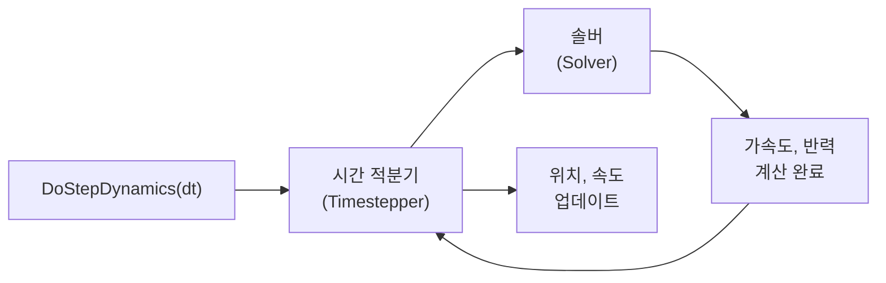

# ChSystem — 시뮬레이션 세계

> [!info] 코드 표기
> 이 문서의 코드 예시는 **PyChrono(Python)** 기준이다. C++ API 문서와의 차이점은 [[core/index#C++ API 문서 → PyChrono 변환 가이드|변환 가이드]] 참고.

`ChSystem`은 Chrono 시뮬레이션의 **최상위 컨테이너**다. 모든 물체([[core/rigid_bodies|강체]]), 조인트([[core/links|링크]]), 힘([[core/loads|스프링/외력]])이 이 시스템 안에 존재하며, 시간을 전진시키면 시스템이 물리 법칙에 따라 모든 요소의 상태를 업데이트한다.

> [!tip] 비유
> `ChSystem`은 **게임 월드**와 같다. 캐릭터(물체), 관절(조인트), 중력(힘)을 월드에 넣고, 매 프레임마다 월드를 업데이트하면 물리가 동작한다.

---


---

## NSC vs SMC — 두 가지 접촉 방식

Chrono는 접촉(Contact)을 처리하는 방식에 따라 두 가지 시스템을 제공한다.

| | ChSystemNSC | ChSystemSMC |
|---|---|---|
| 정식 명칭 | Non-Smooth Contact | Smooth Contact |
| 접촉 처리 | 상보성 문제(Complementarity) | 페널티 힘(Penalty Force) |
| 속도 | 빠름 | 느림 |
| 정확도 | 일반적 | 정밀 (부드러운 접촉) |
| 적합한 경우 | 대부분의 시뮬레이션 | 고무/타이어, FEA 연동 |
| 관통 허용 | 약간의 관통 후 복원 | 관통 시 반발력 적용 |

### NSC — 상보성 조건(Complementarity)

NSC는 접촉을 **불연속적 이벤트**로 처리한다. 두 물체가 접촉할 때, 다음 조건을 만족하는 반력 $\gamma$를 구한다:

$$
0 \le \gamma \perp \Phi(q) \ge 0
$$

- $\gamma$: 접촉 반력 (법선 방향)
- $\Phi(q)$: 간격 함수 (Gap function) — 양수면 떨어져 있음, 0이면 접촉

> [!note] 의미
> "반력은 0 이상이고, 간격이 0일 때만 반력이 존재한다" — 즉, 당기는 힘은 없고 밀어내는 힘만 있다.

> [!info] ⊥ 기호의 의미
> $0 \le \gamma \perp \Phi(q) \ge 0$ 을 풀어 쓰면 **세 조건의 동시 성립**이다:
> 1. $\gamma \ge 0$ — 반력은 0 이상 (당기지 않는다)
> 2. $\Phi(q) \ge 0$ — 간격은 0 이상 (관통 불가)
> 3. $\gamma \cdot \Phi(q) = 0$ — **둘의 곱은 반드시 0**
>
> 둘 다 $\ge 0$인데 곱이 0이므로, **최소 하나는 반드시 0**이어야 한다:
> - $\Phi > 0$ (떨어짐) → $\gamma = 0$ (반력 없음)
> - $\gamma > 0$ (반력 존재) → $\Phi = 0$ (접촉 중)
>
> "반력이 양수이면서 동시에 떨어져 있는" 상태는 불가 — 이것이 **상보성(complementarity)**의 핵심이다. 수학적으로는 LCP(Linear Complementarity Problem)에서 유래한 표기법이다.

### SMC — 페널티 힘(Penalty Force)

SMC는 접촉을 **연속적인 스프링-댐퍼**로 모델링한다. 관통 깊이 $\delta$에 비례하는 반발력을 적용한다:

$$
F_n = k \cdot \delta + c \cdot \dot{\delta}
$$

- $k$: 접촉 강성(Stiffness)
- $c$: 접촉 감쇠(Damping)
- $\delta$: 관통 깊이, $\dot{\delta}$: 관통 속도

---

## 시스템 생성과 설정

```python
import pychrono as chrono

# 1. 시스템 생성 — 대부분 NSC를 사용
sys = chrono.ChSystemNSC()

# 2. 중력 설정 (기본값: 없음 → 반드시 설정!)
sys.SetGravitationalAcceleration(chrono.ChVector3d(0, -9.81, 0))
#                                                  x    y     z
#                                          오른쪽  위쪽  앞쪽
# y축 아래 = 지구 중력 (m/s²)

# 3. 물체 추가
body = chrono.ChBody()
sys.AddBody(body)        # 또는 sys.Add(body)

# 4. 조인트 추가
joint = chrono.ChLinkRevolute()
sys.Add(joint)           # AddLink 대신 Add도 가능
```

> [!warning] 중력 기본값
> `ChSystem`의 기본 중력은 `(0, 0, 0)`이다. `SetGravitationalAcceleration()`을 호출하지 않으면 물체가 떠 있게 된다.

---

## 시뮬레이션 루프 — DoStepDynamics

시뮬레이션은 `DoStepDynamics(dt)`를 반복 호출하여 시간을 전진시킨다.

```python
dt = 0.005   # 시간 간격 (Time Step): 5ms

# 시각화 없는 경우
while sys.GetChTime() < 10.0:
    sys.DoStepDynamics(dt)
    
    t = sys.GetChTime()
    pos = body.GetPos()
    print(f"t={t:.3f}  y={pos.y:.4f}")

# 시각화 있는 경우
while vis.Run():
    vis.BeginScene()
    vis.Render()
    vis.EndScene()
    sys.DoStepDynamics(dt)
```

### 시간 간격(dt) 선택 가이드

| dt 값 | 정확도 | 속도 | 사용 상황 |
|--------|--------|------|-----------|
| 0.01 (10ms) | 낮음 | 빠름 | 대략적 확인, 실시간 시각화 |
| 0.005 (5ms) | 보통 | 보통 | 일반적 시뮬레이션 (추천) |
| 0.001 (1ms) | 높음 | 느림 | 정밀 해석, 이론값 비교 |
| 0.0001 (0.1ms) | 매우 높음 | 매우 느림 | FEA, 고주파 진동 |

> [!tip] 경험 법칙
> 시뮬레이션에서 가장 빠른 운동의 주기를 $T$라 하면, $dt < T/20$ 정도가 적절하다.

---

## 솔버(Solver)와 시간 적분기(Timestepper)

`DoStepDynamics(dt)` 내부에서 두 단계가 실행된다:



### 시간 적분기 비교

| 적분기 | 정확도 | 반복 필요 | 특징 |
|--------|--------|-----------|------|
| `EULER_IMPLICIT_LINEARIZED` | 1차 | 없음 | **기본값**, 빠르고 안정적 |
| `HHT` | 2차 | 있음 | 정밀, 수치 감쇠 조절 가능 |
| `NEWMARK` | 1차 | 있음 | FEA에서 주로 사용 |

### 솔버 비교

| 솔버 | 정밀도 | 속도 | NSC 지원 | FEA 지원 |
|------|--------|------|----------|----------|
| `PSOR` | 보통 | 빠름 | O | X |
| `APGD` | 높음 | 보통 | O | X |
| `BARZILAIBORWEIN` | 높음 | 보통 | O | X |
| `MINRES` | 높음 | 느림 | X | O |
| `PardisoMKL` | 최고 | 느림 | O | O |

```python
# 솔버 반복 횟수 조정 (구속이 많을 때 증가)
sys.GetSolver().AsIterative().SetMaxIterations(200)

# 시간 적분기 변경 (정밀 해석 시)
sys.SetTimestepperType(chrono.ChTimestepper.Type_HHT)
```

---

## 주요 메서드 정리

| 메서드 | 설명 |
|--------|------|
| `AddBody(body)` / `Add(body)` | 강체 추가 |
| `Add(link)` | 조인트/링크 추가 |
| `Add(shaft)` | 1D 회전축 추가 |
| `DoStepDynamics(dt)` | 시간을 dt초만큼 전진 |
| `GetChTime()` | 현재 시뮬레이션 시간 |
| `GetBodyCount()` | 시스템 내 물체 수 |
| `SetGravitationalAcceleration(v)` | 중력 벡터 설정 |
| `GetGravitationalAcceleration()` | 중력 벡터 조회 |
| `SetSolverType(type)` | 솔버 변경 |
| `SetTimestepperType(type)` | 적분기 변경 |
| `SetMaxPenetrationRecoverySpeed(v)` | 관통 복원 속도 제한 |
| `SetMinBounceSpeed(v)` | 최소 반발 속도 임계값 |

---

## 관련 문서

- [[core/rigid_bodies|강체 (Rigid Bodies)]] — 시스템에 넣을 물체
- [[core/links|조인트와 링크]] — 물체 간 연결
- [[core/loads|힘과 스프링-댐퍼]] — 외력 적용
- [[core/solver|솔버 상세]] — 솔버/적분기 심화
- [공식 API 문서 (C++)](https://api.projectchrono.org/group__chrono.html)
- [Simulation System 매뉴얼 (C++)](https://api.projectchrono.org/simulation_system.html)
- Python 데모: `chrono/src/demos/python/core/demo_CH_buildsystem.py`
- ← [[core/index|Core 개요로 돌아가기]]
