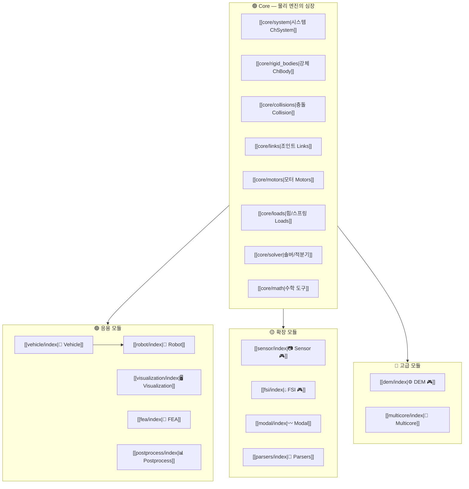
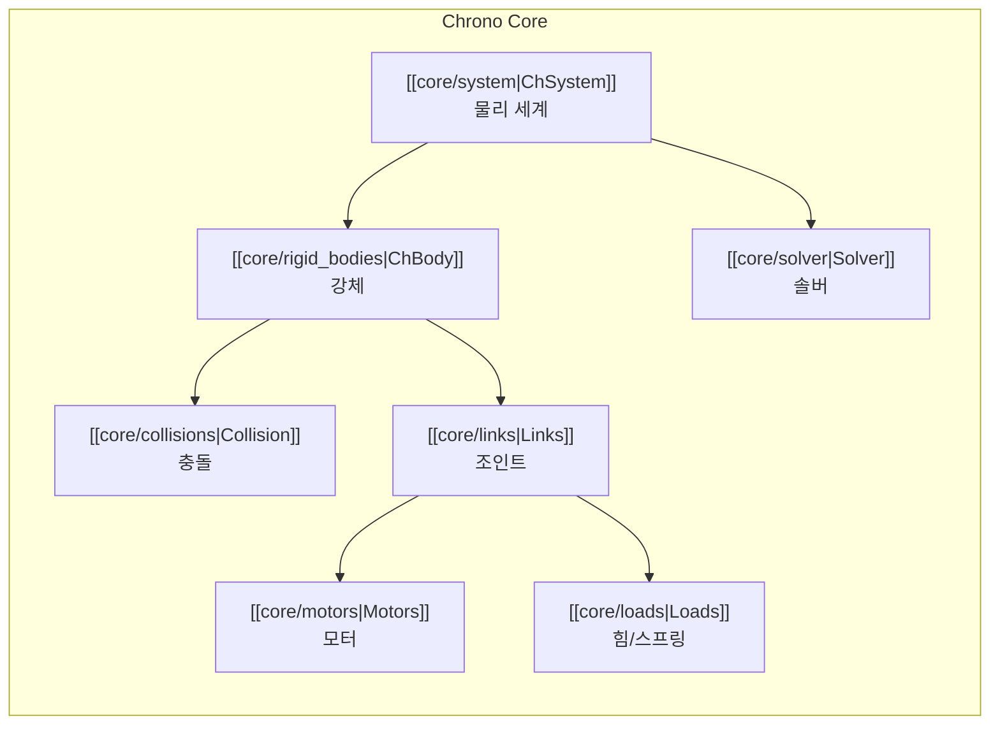
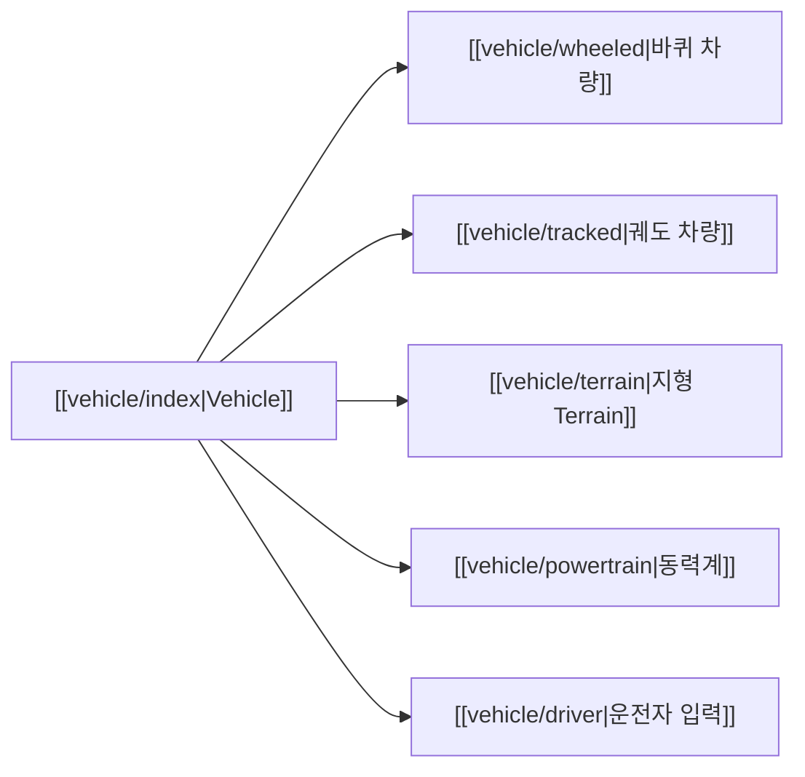
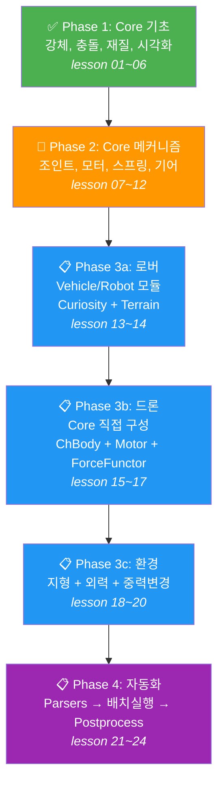

# Project Chrono 탐사 지도

> 이 문서는 Project Chrono의 전체 기능을 한눈에 보여주는 **클릭형 지도**입니다.
> 각 항목을 클릭하면 해당 기능의 한국어 가이드로 이동합니다.
>
> - 🟢 우리 팀 필수 (Phase 1~3)
> - 🟡 알아두면 좋음 (Phase 4 이후)
> - 🔴 현재 불필요 (GPU 전용 / 고급 연구)
> - 공식 문서: https://api.projectchrono.org/

---

## 전체 구조



---

## 🟢 Core — 물리 엔진의 심장

> 모든 모듈의 기반. 이 없이는 아무것도 안 됩니다.
> 📖 [공식 매뉴얼](https://api.projectchrono.org/manual_core.html)



| 주제 | 문서 | 핵심 클래스 | 설명 |
|---|---|---|---|
| 시스템 | [[core/system]] | `ChSystemNSC`, `ChSystemSMC` | 시뮬레이션 세계의 그릇 |
| 강체 | [[core/rigid_bodies]] | `ChBody`, `ChBodyEasy*` | 물체 생성과 속성 |
| 충돌 | [[core/collisions]] | `ChCollisionShape*`, `ChContactMaterial*` | 충돌 감지와 접촉 재질 |
| 조인트 | [[core/links]] | `ChLinkRevolute`, `ChLinkLockLock` 외 20+ | 물체 간 연결/구속 |
| 모터 | [[core/motors]] | `ChLinkMotorRotation*`, `ChLinkMotorLinear*` | 회전/직선 액추에이터 |
| 힘/스프링 | [[core/loads]] | `ChLinkTSDA`, `ChForce`, `ForceFunctor` | 외력, 스프링-댐퍼 |
| 솔버 | [[core/solver]] | `PSOR`, `APGD`, `HHT` | 방정식 풀기, 시간 적분 |
| 수학 도구 | [[core/math]] | `ChVector3d`, `ChQuaterniond`, `ChFunction*` | 벡터, 회전, 시간 함수 |

---

## 🟢 응용 모듈

### 🚗 Vehicle — 차량/로버 시뮬레이션

> Phase 3 로버 시뮬레이션의 핵심.
> 📖 [공식 매뉴얼](https://api.projectchrono.org/manual_vehicle.html)



| 주제 | 문서 | 설명 |
|---|---|---|
| 개요 | [[vehicle/index]] | 템플릿 기반 아키텍처, JSON 정의 |
| 바퀴 차량 | [[vehicle/wheeled]] | 서스펜션, 스티어링, 타이어, 구동계 |
| 궤도 차량 | [[vehicle/tracked]] | 궤도판, 스프로킷, 아이들러 |
| 지형 | [[vehicle/terrain]] | Rigid, SCM(변형토양), 높이맵 등 7종 |
| 동력계 | [[vehicle/powertrain]] | 엔진, 변속기 |
| 운전자 | [[vehicle/driver]] | 키보드, 경로 추종, 데이터 파일 |

**내장 차량 모델 19종**: HMMWV, Sedan, Gator, M113 등 → [[vehicle/models|모델 카탈로그]]

---

### 🤖 Robot — 로봇 모델

> Curiosity/Viper 로버, LittleHexy 드론 등 내장 모델.
> 📖 [공식 매뉴얼](https://api.projectchrono.org/group__robot__models.html)

| 모델 | 문서 | 종류 | 우선순위 |
|---|---|---|:---:|
| Curiosity | [[robot/curiosity]] | 화성 로버 (6륜) | 🟢 |
| Viper | [[robot/viper]] | 달 로버 (4륜) | 🟢 |
| LittleHexy | [[robot/littlehexy]] | 헥사콥터 (6프로펠러) | 🟡 |
| Turtlebot | [[robot/turtlebot]] | 2륜 차동구동 | 🟡 |
| RoboSimian | [[robot/robosimian]] | 4족 보행 | 🔴 |
| Industrial | [[robot/industrial]] | 로봇팔 (6축) | 🔴 |

---

### 🖥️ Visualization — 시각화

> 시뮬레이션을 눈으로 보기.
> 📖 [공식 매뉴얼](https://api.projectchrono.org/manual_visualization.html)

| 렌더러 | 문서 | 특징 |
|---|---|---|
| Irrlicht | [[visualization/irrlicht]] | 기본 제공, macOS에서 제한적 |
| VSG (Vulkan) | [[visualization/vsg]] | 고품질, macOS 권장 |
| POV-Ray | [[visualization/povray]] | 오프라인 레이트레이싱 |

---

### 🔩 FEA — 유한요소 해석

> 변형 가능한 물체(빔, 케이블, 쉘) 시뮬레이션.
> 📖 [공식 매뉴얼](https://api.projectchrono.org/manual_fea.html)

| 주제 | 문서 | 설명 |
|---|---|---|
| 개요 | [[fea/index]] | 노드, 요소, 메시 개념 |
| 노드 | [[fea/nodes]] | 위치/회전 자유도 |
| 요소 | [[fea/elements]] | 빔, 쉘, 케이블, 벽돌, 사면체 |

---

### 📊 Postprocess — 후처리

> 시뮬레이션 결과를 파일/영상으로 출력.
> 📖 [공식 매뉴얼](https://api.projectchrono.org/group__postprocess__module.html)

| 주제 | 문서 | 설명 |
|---|---|---|
| 개요 | [[postprocess/index]] | POV-Ray, GNUplot, CSV 출력 |

---

## 🟡 확장 모듈

| 모듈 | 문서 | 설명 | GPU |
|---|---|---|:---:|
| 📷 Sensor | [[sensor/index]] | 카메라, LiDAR, GPS, IMU | 🎮 |
| 💧 FSI | [[fsi/index]] | 유체-구조 상호작용 (SPH) | 🎮 |
| 〰️ Modal | [[modal/index]] | 고유진동수, 모달 해석 | 💻 |
| 📄 Parsers | [[parsers/index]] | YAML/JSON 모델 임포트 | 💻 |

---

## 🔴 고급 모듈

| 모듈 | 문서 | 설명 | GPU |
|---|---|---|:---:|
| ⚙️ DEM | [[dem/index]] | GPU 가속 입자 시뮬레이션 | 🎮 |
| 🔀 Multicore | [[multicore/index]] | CPU 병렬 대규모 충돌 | 💻 |
| 🌐 SynChrono | (미작성) | MPI 분산 시뮬레이션 | 💻 |
| 🤖 ROS | (미작성) | ROS2 연동 | 💻 |
| 📐 CASCADE | (미작성) | STEP CAD 파일 임포트 | 💻 |

---

## 탐사 루트 — 우리 팀의 추천 경로



---

## 튜토리얼 퀘스트 목록

> 공식 데모 코드 → [[tutorials/index|전체 목록]]
> Python 데모 위치: `chrono/src/demos/python/`

| 난이도 | 데모 | 주제 | 관련 모듈 |
|:---:|---|---|---|
| ★☆☆ | `demo_MBS_pendulum` | 진자 운동 | [[core/links]] |
| ★☆☆ | `demo_MBS_bricks` | 벽돌 충돌 | [[core/collisions]] |
| ★★☆ | `demo_MBS_fourbar` | 4절 링크 | [[core/links]] |
| ★★☆ | `demo_MBS_gears` | 기어 구속 | [[core/links]] |
| ★★☆ | `demo_MBS_motors` | 모터 | [[core/motors]] |
| ★★☆ | `demo_MBS_suspension` | 서스펜션 | [[core/loads]] |
| ★★★ | `demo_VEH_HMMWV` | HMMWV 주행 | [[vehicle/index]] |
| ★★★ | `demo_ROBOT_Curiosity` | 화성 로버 | [[robot/curiosity]] |

---

## docs 폴더 구조

```
docs/
├── index.md                  ← 이 파일 (탐사 지도)
├── core/                     Chrono Core
│   ├── index.md              Core 개요
│   ├── system.md             ChSystem (NSC/SMC)
│   ├── rigid_bodies.md       ChBody, ChBodyEasy*
│   ├── collisions.md         충돌 시스템, 접촉 재질
│   ├── links.md              조인트/링크 (20+종)
│   ├── motors.md             회전/직선 모터
│   ├── loads.md              힘, 스프링-댐퍼, ForceFunctor
│   ├── solver.md             솔버, 시간 적분기
│   └── math.md               벡터, 쿼터니언, ChFunction
├── vehicle/                  차량/로버
│   ├── index.md              Vehicle 개요
│   ├── wheeled.md            바퀴 차량 (서스펜션, 타이어...)
│   ├── tracked.md            궤도 차량
│   ├── terrain.md            지형 (Rigid, SCM, 높이맵...)
│   ├── powertrain.md         동력계
│   ├── driver.md             운전자 입력
│   └── models.md             내장 모델 카탈로그 (19종)
├── robot/                    로봇 모델
│   ├── index.md              Robot 개요
│   ├── curiosity.md          Curiosity 화성 로버
│   ├── viper.md              Viper 달 로버
│   ├── littlehexy.md         LittleHexy 헥사콥터
│   └── turtlebot.md          Turtlebot
├── visualization/            시각화
│   ├── index.md              시각화 개요
│   ├── irrlicht.md           Irrlicht (OpenGL)
│   ├── vsg.md                VSG (Vulkan)
│   └── povray.md             POV-Ray (오프라인)
├── fea/                      유한요소
│   ├── index.md              FEA 개요
│   ├── nodes.md              노드
│   └── elements.md           요소
├── postprocess/              후처리
│   └── index.md              Postprocess 개요
├── sensor/                   센서 (GPU)
│   └── index.md              Sensor 개요
├── fsi/                      유체-구조 (GPU)
│   └── index.md              FSI 개요
├── dem/                      이산요소 (GPU)
│   └── index.md              DEM 개요
├── modal/                    모달 해석
│   └── index.md              Modal 개요
├── multicore/                CPU 병렬
│   └── index.md              Multicore 개요
├── parsers/                  모델 임포트
│   └── index.md              Parsers 개요
├── tutorials/                공식 튜토리얼 정리
│   └── index.md              전체 퀘스트 목록
├── images/                   이미지
└── presentation.html         프로젝트 발표 슬라이드
```
