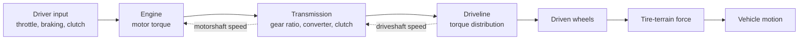

# Powertrain이란?

Powertrain은 차량을 움직이게 하는 **동력 생성 및 변속 시스템**이다.
Chrono::Vehicle에서는 보통 다음 두 subsystem을 하나로 묶어 `ChPowertrainAssembly`로 사용한다.

```text
Powertrain = Engine + Transmission
```

공식 문서 기준으로 powertrain은 운전자 시스템에서 throttle 입력을 받고, vehicle의 driveline subsystem과 다음 값을 주고받는다.

| 연결 대상 | Powertrain이 받는 값 | Powertrain이 보내는 값 |
|---|---|---|
| Driver | throttle, clutch 등 운전자 입력 | 없음 |
| Driveline | driveshaft angular speed | driveshaft torque |
| Chassis | 일부 shafts model에서 reaction torque | motor/transmission block 반작용 |

즉 powertrain은 다음 질문에 답하는 subsystem이다.

```text
현재 throttle이 이만큼이고,
driveline이 이 속도로 돌고 있을 때,
엔진은 얼마의 토크를 만들고,
변속기는 그 토크를 driveshaft에 얼마로 전달하는가?
```

> [!important] Powertrain과 Driveline 구분
> Powertrain은 **토크를 만들고 변속**한다.
> Driveline은 그 토크를 **어느 axle/wheel에 어떻게 분배**할지 결정한다.
>
> 따라서 전체 추진 흐름은 `Driver -> Engine -> Transmission -> Driveline -> Wheel -> Tire -> Terrain`으로 보는 것이 좋다.

---

## 1. Chrono::Vehicle 내부 흐름



Chrono 소스의 `ChPowertrainAssembly::Synchronize()` 흐름은 개념적으로 다음과 같다.

```python
motorshaft_torque = engine.GetOutputMotorshaftTorque()
motorshaft_speed = transmission.GetOutputMotorshaftSpeed()

engine.Synchronize(time, driver_inputs, motorshaft_speed)
transmission.Synchronize(time, driver_inputs, motorshaft_torque, driveshaft_speed)
```

여기서 핵심 피드백은 두 가지이다.

| 값 | 의미 |
|---|---|
| `motorshaft_speed` | transmission이 engine에 되돌려주는 엔진축 속도 |
| `driveshaft_speed` | driveline이 transmission에 되돌려주는 출력축 속도 |

엔진 토크는 단순히 throttle만으로 정해지지 않고, 현재 엔진축 속도와 transmission/driveline 상태의 영향을 받는다.

---

## 2. 문서 구성

이 문서는 powertrain 전체를 빠르게 볼 수 있는 개요 문서이다.
세부 내용은 아래 하위 문서로 나누어 정리했다.

| 문서 | 내용 |
|---|---|
| [[powertrain/0_index]] | 학습 순서, 핵심 개념 지도, 실험 관점 |
| [[powertrain/1_architecture]] | `ChPowertrainAssembly`, `ChEngine`, `ChTransmission` 구조 |
| [[powertrain/2_engine_models]] | `EngineSimple`, `EngineSimpleMap`, `EngineShafts` 이론과 수식 |
| [[powertrain/3_transmission_models]] | 기어비, 자동변속, CVT, torque converter, clutch |
| [[powertrain/4_pychrono_json_workflow]] | JSON 기반 powertrain 생성, PyChrono 코드, CSV 로깅 |

관련 문서:

| 문서 | 연결 포인트 |
|---|---|
| [[wheeled/4_driveline]] | transmission 출력 토크가 wheel torque로 분배되는 과정 |
| [[wheeled/6_simulation_loop]] | `Synchronize()` / `Advance()` 루프에서 powertrain 업데이트 위치 |
| [[terrain]] | powertrain 출력이 실제 추진력으로 바뀌는 terrain 조건 |
| [[driver]] | throttle, braking, clutch 입력 생성 |

---

## 3. Chrono에서 제공하는 Powertrain 계열

공식 API 문서와 로컬 Chrono 소스 기준으로 powertrain 관련 핵심 클래스는 다음과 같다.

| 계층 | 클래스 | 역할 |
|---|---|---|
| Assembly | `ChPowertrainAssembly` | engine과 transmission을 묶는 aggregate |
| Engine base | `ChEngine` | 엔진 subsystem의 공통 인터페이스 |
| Transmission base | `ChTransmission` | 변속기 subsystem의 공통 인터페이스 |
| Simple engine | `ChEngineSimple`, `EngineSimple` | 최대 토크/출력 기반 단순 엔진 |
| Map engine | `ChEngineSimpleMap`, `EngineSimpleMap` | speed-torque map 기반 엔진 |
| Shafts engine | `ChEngineShafts`, `EngineShafts` | `ChShaft` 기반 동역학 엔진 |
| Simple automatic | `ChAutomaticTransmissionSimpleMap`, `AutomaticTransmissionSimpleMap` | gear ratio와 shift map 기반 자동변속기 |
| Simple CVT | `ChAutomaticTransmissionSimpleCVT`, `AutomaticTransmissionSimpleCVT` | 연속 가변 기어비 모델 |
| Shafts automatic | `ChAutomaticTransmissionShafts`, `AutomaticTransmissionShafts` | torque converter와 gearbox를 포함한 shaft 기반 자동변속기 |
| Shafts manual | `ChManualTransmissionShafts`, `ManualTransmissionShafts` | clutch와 gearbox를 포함한 shaft 기반 수동변속기 |

> [!tip] 입문 추천
> 처음에는 `EngineSimpleMap + AutomaticTransmissionSimpleMap` 조합을 추천한다.
> JSON으로 토크 맵과 변속 시점을 직접 볼 수 있고, shafts model보다 디버깅이 쉽다.

---

## 4. 가장 중요한 수식

### 4.1 EngineSimpleMap 토크 보간

`EngineSimpleMap`은 zero throttle map과 full throttle map 사이를 throttle 값으로 선형 보간한다.

$$
T_e(\omega, u)
= (1-u)T_0(\omega) + uT_F(\omega)
$$

| 기호 | 의미 |
|---|---|
| $T_e$ | 엔진 출력 토크 |
| $\omega$ | 엔진축 각속도 |
| $u$ | throttle 입력, $0 \le u \le 1$ |
| $T_0(\omega)$ | zero throttle torque map |
| $T_F(\omega)$ | full throttle torque map |

### 4.2 Simple transmission 기어비 변환

Chrono의 `AutomaticTransmissionSimpleMap` 소스에서는 현재 기어비를 $r_g$라고 할 때 다음 관계를 사용한다.

$$
\omega_m = \frac{|\omega_d|}{r_g}
$$

$$
T_d = \frac{T_m}{r_g}
$$

| 기호 | 의미 |
|---|---|
| $\omega_m$ | motorshaft speed, engine 쪽 속도 |
| $\omega_d$ | driveshaft speed, driveline 쪽 속도 |
| $T_m$ | engine에서 transmission으로 들어오는 토크 |
| $T_d$ | transmission에서 driveline으로 나가는 토크 |
| $r_g$ | Chrono transmission gear ratio |

> [!warning] 기어비 convention 주의
> Chrono JSON의 `"Forward Gear Ratios"` 값은 일반 자동차 교재의 "1단 4.0:1" 같은 표기와 직관이 다를 수 있다.
> 예를 들어 $r_g = 0.2$이면 위 수식상 $T_d = 5T_m$이므로 토크가 5배가 된다.
> 따라서 JSON 값을 바꿀 때는 반드시 Chrono 소스의 수식 기준으로 해석해야 한다.

### 4.3 바퀴 추진력 근사

driveline을 지나 바퀴 토크 $T_w$가 만들어지면, 평지에서 접촉 손실을 무시한 종방향 힘은 대략 다음과 같다.

$$
F_x \approx \frac{T_w}{R}
$$

하지만 실제 추진력은 마찰 한계와 slip에 의해 제한된다.

$$
|F_x| \le \mu F_z
$$

험지나 변형 지형에서는 여기에 sinkage, soil shear, slip ratio가 함께 들어간다.
그래서 powertrain 토크를 크게 주는 것이 항상 더 빠른 주행을 의미하지는 않는다.

---

## 5. JSON 기반 기본 사용 흐름

JSON 차량에서는 engine과 transmission을 따로 읽고, `ChPowertrainAssembly`로 묶어서 차량에 붙인다.

```python
import pychrono as chrono
import pychrono.vehicle as veh

vehicle_file = veh.GetVehicleDataFile("hmmwv/vehicle/HMMWV_Vehicle.json")
engine_file = veh.GetVehicleDataFile("hmmwv/powertrain/HMMWV_EngineShafts.json")
transmission_file = veh.GetVehicleDataFile(
    "hmmwv/powertrain/HMMWV_AutomaticTransmissionShafts.json"
)

vehicle = veh.WheeledVehicle(vehicle_file, chrono.ChContactMethod_NSC)
vehicle.Initialize(chrono.ChCoordsysd(chrono.ChVector3d(0, 0, 0.5), chrono.QUNIT))

engine = veh.ReadEngineJSON(engine_file)
transmission = veh.ReadTransmissionJSON(transmission_file)
powertrain = veh.ChPowertrainAssembly(engine, transmission)

vehicle.InitializePowertrain(powertrain)
```

HMMWV wrapper를 사용할 때는 enum으로 선택할 수도 있다.

```python
hmmwv = veh.HMMWV_Full()
hmmwv.SetEngineType(veh.EngineModelType_SHAFTS)
hmmwv.SetTransmissionType(veh.TransmissionModelType_AUTOMATIC_SHAFTS)
hmmwv.SetDriveType(veh.DrivelineTypeWV_AWD)
hmmwv.Initialize()
```

> [!important] Vehicle 좌표계
> Chrono::Vehicle은 기본적으로 ISO 차량 좌표계인 **Z-up, X-forward, Y-left**를 사용한다.
> Phase 1~2의 일부 Y-up 시각화 예제와 혼동하지 않도록 주의한다.

---

## 6. 로버/차량 실험에서 봐야 할 변수

| 분류 | 변수 | 의미 |
|---|---|---|
| 입력 | throttle | 운전자가 요구하는 출력 |
| 입력 | braking | 제동 입력 |
| 입력 | clutch | 수동변속기 clutch 입력 |
| Engine | engine speed | 엔진 회전속도 |
| Engine | engine torque | 엔진 출력 토크 |
| Transmission | current gear | 현재 기어 |
| Transmission | driveshaft torque | driveline으로 전달되는 토크 |
| Transmission | torque converter slippage | shafts automatic에서 converter slip |
| Driveline | wheel torque | 각 바퀴에 분배된 토크 |
| Tire/Terrain | slip ratio | 구동 토크가 지면 추진력으로 변환되는 효율 |
| Vehicle | speed, acceleration | 실제 주행 성능 |

최종 프로젝트에서는 powertrain 단독보다 다음 조합을 함께 봐야 한다.

```text
Powertrain parameters
    + Driveline torque distribution
    + Tire model
    + Terrain friction/deformation
    = Mobility, stability, energy use
```

---

## 7. 최소 실험 아이디어

### 실험 1: throttle ramp

```text
Terrain: flat RigidTerrain
Vehicle: HMMWV
Input: throttle 0 -> 1 ramp
Output: engine_rpm, gear, vehicle_speed, wheel_omega
```

목표는 engine map과 shift point가 속도 응답에 어떻게 나타나는지 확인하는 것이다.

### 실험 2: gear ratio 변경

```text
Transmission JSON의 Forward Gear Ratios 일부 변경
비교: 기본값 vs 토크 증폭형 vs 속도형
Output: acceleration, max speed, slope climb success
```

낮은 $r_g$는 토크 증폭을 키우지만 엔진 회전속도도 크게 만든다.
따라서 최고속도, shift timing, slip 증가를 같이 봐야 한다.

### 실험 3: simple map vs shafts

```text
Engine/Transmission:
1. EngineSimpleMap + AutomaticTransmissionSimpleMap
2. EngineShafts + AutomaticTransmissionShafts

Output:
engine_rpm, driveshaft_torque, vehicle_speed, RTF
```

shafts model은 torque converter, shaft inertia, chassis reaction을 더 물리적으로 표현하지만 계산과 해석이 더 복잡하다.

---

## 8. 핵심 정리

```text
Powertrain = Engine + Transmission
Engine은 throttle과 motor speed로 motorshaft torque를 만든다.
Transmission은 gear ratio, torque converter, clutch 등을 통해 driveshaft torque를 만든다.
Driveline은 그 torque를 axle/wheel로 분배한다.
Chrono 입문 단계에서는 JSON 기반 simple map 모델부터 이해하는 것이 좋다.
험지 로버에서는 powertrain 토크, tire slip, terrain 변형을 반드시 함께 분석해야 한다.
```

---

## 9. 참고 자료

- Project Chrono 공식 문서: Powertrain system  
  https://api.projectchrono.org/group__vehicle__powertrain.html

- Project Chrono 공식 문서: Powertrain models  
  https://api.projectchrono.org/vehicle_powertrain.html

- Project Chrono 공식 문서: Driveline models  
  https://api.projectchrono.org/wheeled_driveline.html

- Project Chrono 공식 문서: Chrono::Vehicle Reference Manual  
  https://api.projectchrono.org/manual_vehicle.html

- 로컬 소스 참고:
  - `chrono/src/chrono_vehicle/ChPowertrainAssembly.cpp`
  - `chrono/src/chrono_vehicle/powertrain/ChEngineSimpleMap.cpp`
  - `chrono/src/chrono_vehicle/powertrain/ChAutomaticTransmissionSimpleMap.cpp`
  - `chrono/src/demos/python/vehicle/demo_VEH_WheeledJSON.py`

← [[vehicle/index|Vehicle 개요로 돌아가기]]
