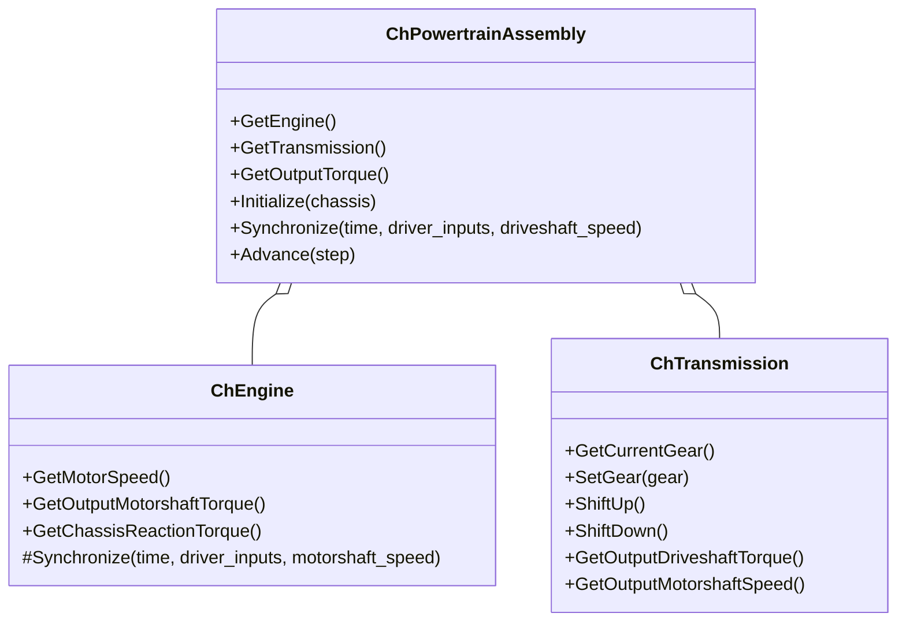
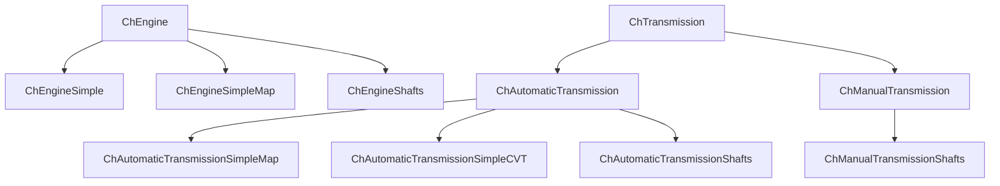

# Powertrain Architecture

이 문서는 Chrono::Vehicle에서 powertrain이 어떤 클래스 구조로 연결되는지 정리한다.
핵심은 `ChPowertrainAssembly`가 `ChEngine`과 `ChTransmission`을 묶고, vehicle/driveline 사이의 인터페이스 역할을 한다는 점이다.

---

## 1. 핵심 클래스 관계



| 클래스 | 의미 |
|---|---|
| `ChPowertrainAssembly` | engine과 transmission을 가진 aggregate |
| `ChEngine` | 엔진 subsystem의 base class |
| `ChTransmission` | 변속기 subsystem의 base class |
| `ChAutomaticTransmission` | 자동변속기 base class |
| `ChManualTransmission` | 수동변속기 base class |

---

## 2. 데이터 흐름

Chrono 소스에서 `ChPowertrainAssembly::Synchronize()`는 다음 순서로 동작한다.

```cpp
double motorshaft_torque = m_engine->GetOutputMotorshaftTorque();
double motorshaft_speed = m_transmission->GetOutputMotorshaftSpeed();

m_engine->Synchronize(time, driver_inputs, motorshaft_speed);
m_transmission->Synchronize(time, driver_inputs, motorshaft_torque, driveshaft_speed);
```

이를 물리적으로 풀어 쓰면 다음과 같다.

| 단계 | 전달 값 | 설명 |
|---|---|---|
| 1 | `engine.GetOutputMotorshaftTorque()` | 이전 상태 기준 엔진 출력 토크 |
| 2 | `transmission.GetOutputMotorshaftSpeed()` | 변속기가 엔진 쪽에 주는 회전속도 |
| 3 | `engine.Synchronize(...)` | throttle과 motorshaft speed로 엔진 상태 갱신 |
| 4 | `transmission.Synchronize(...)` | engine torque와 driveshaft speed로 변속기 상태 갱신 |
| 5 | `powertrain.GetOutputTorque()` | driveline으로 전달할 driveshaft torque |

> [!note] 왜 서로 값을 되돌려 주는가?
> 차량 구동계는 한 방향으로만 흐르는 계산이 아니다.
> 바퀴가 지면에 막히거나 빨리 굴러가면 driveline 속도가 바뀌고, 이 속도가 transmission과 engine speed를 바꾼다.
> 따라서 powertrain은 torque를 보내면서 동시에 speed feedback을 받는다.

---

## 3. Powertrain과 Vehicle의 연결

JSON 기반 `WheeledVehicle`에서는 다음 흐름으로 powertrain을 붙인다.

```python
engine = veh.ReadEngineJSON(engine_file)
transmission = veh.ReadTransmissionJSON(transmission_file)
powertrain = veh.ChPowertrainAssembly(engine, transmission)
vehicle.InitializePowertrain(powertrain)
```

`InitializePowertrain()`은 powertrain을 차량의 chassis와 driveline에 연결한다.
사용자는 보통 engine이나 transmission의 `Synchronize()`를 직접 호출하지 않는다.

```python
driver_inputs = driver.GetInputs()

vehicle.Synchronize(time, driver_inputs, terrain)
vehicle.Advance(step_size)
```

`vehicle.Synchronize()` 내부에서 driver 입력, terrain, tire, driveline, powertrain이 함께 맞춰진다.

---

## 4. Engine 인터페이스

`ChEngine`이 외부에 제공하는 핵심 값은 다음과 같다.

| 함수 | 의미 |
|---|---|
| `GetMotorSpeed()` | 현재 엔진축 각속도 |
| `GetOutputMotorshaftTorque()` | transmission으로 전달되는 엔진 출력 토크 |
| `GetChassisReactionTorque()` | chassis에 전달되는 반작용 토크 |

engine은 다음 입력을 받아 갱신된다.

```text
engine.Synchronize(time, driver_inputs, motorshaft_speed)
```

| 입력 | 의미 |
|---|---|
| `driver_inputs.m_throttle` | 운전자가 요구하는 출력 비율 |
| `motorshaft_speed` | transmission이 결정한 엔진축 속도 |

### 외부 엔진 모델 연결

공식 문서는 Chrono::Vehicle이 third-party powertrain model과 연결될 수 있도록 설계되었다고 설명한다.
이 경우 핵심은 `ChEngine`과 `ChTransmission`에서 파생된 얇은 interface class를 만드는 것이다.

```text
External engine model
    -> derived ChEngine wrapper

External transmission model
    -> derived ChTransmission wrapper
```

우리 프로젝트에서 AI/온톨로지 레이어가 만든 powertrain 모델을 연결하고 싶다면, 장기적으로 이 방향을 생각할 수 있다.

---

## 5. Transmission 인터페이스

`ChTransmission`이 외부에 제공하는 핵심 값은 다음과 같다.

| 함수 | 의미 |
|---|---|
| `GetCurrentGear()` | 현재 기어. reverse는 `-1`, neutral은 `0`, forward는 `1...Gmax` |
| `GetMaxGear()` | 최고 forward gear 번호 |
| `SetGear(gear)` | 특정 기어로 변경 |
| `ShiftUp()` / `ShiftDown()` | 한 단계 변속 |
| `GetOutputDriveshaftTorque()` | driveline으로 전달되는 출력 토크 |
| `GetOutputMotorshaftSpeed()` | engine으로 되돌아가는 motorshaft speed |

automatic transmission은 추가로 drive mode와 shift mode를 가진다.

| 개념 | 값 |
|---|---|
| Drive mode | `FORWARD`, `NEUTRAL`, `REVERSE` |
| Shift mode | `AUTOMATIC`, `MANUAL` |

> [!tip] manumatic
> Chrono의 automatic transmission은 model에 따라 자동변속 모드와 수동 변속 모드를 바꿀 수 있다.
> 시각화 시스템에서는 키 입력으로 forward/neutral/reverse와 자동/수동 모드를 전환할 수 있다.

---

## 6. 모델 계층



| 모델 | 물리 상세도 | 계산량 | 입문 적합도 |
|---|---:|---:|---:|
| `EngineSimple` | 낮음 | 낮음 | 높음 |
| `EngineSimpleMap` | 중간 | 낮음 | 높음 |
| `EngineShafts` | 높음 | 중간 | 중간 |
| `AutomaticTransmissionSimpleMap` | 중간 | 낮음 | 높음 |
| `AutomaticTransmissionSimpleCVT` | 중간 | 낮음 | 중간 |
| `AutomaticTransmissionShafts` | 높음 | 중간 | 중간 |
| `ManualTransmissionShafts` | 높음 | 중간 | 중간 |

---

## 7. Simulation loop에서의 위치

Chrono vehicle loop를 powertrain 관점에서 보면 다음 순서가 된다.

```text
1. driver.GetInputs()
2. driver.Synchronize(time)
3. terrain.Synchronize(time)
4. vehicle.Synchronize(time, driver_inputs, terrain)
   - engine torque 계산
   - transmission torque/speed 변환
   - driveline torque 분배
   - tire force 계산
5. driver.Advance(step)
6. terrain.Advance(step)
7. vehicle.Advance(step)
```

`vehicle.Advance(step)`는 multibody system뿐 아니라 powertrain과 tire 상태도 함께 전진시킨다.

---

## 8. Python에서 접근 가능한 값

차량 객체가 powertrain을 가진 경우 다음처럼 engine/transmission에 접근할 수 있다.

```python
vehicle = hmmwv.GetVehicle()  # HMMWV wrapper를 쓰는 경우

engine = vehicle.GetEngine()
transmission = vehicle.GetTransmission()

engine_speed_rad_s = engine.GetMotorSpeed()
engine_torque_nm = engine.GetOutputMotorshaftTorque()

gear = transmission.GetCurrentGear()
driveshaft_torque_nm = transmission.GetOutputDriveshaftTorque()
```

RPM으로 변환:

$$
\text{rpm} = \omega \frac{60}{2\pi}
$$

```python
import math

engine_rpm = engine.GetMotorSpeed() * 60.0 / (2.0 * math.pi)
```

> [!warning] PyChrono 버전 차이
> 설치된 Chrono 버전에 따라 일부 enum 이름이나 wrapper 노출 범위가 다를 수 있다.
> 팀 공용 레슨에서는 `hasattr()`로 확인하거나, JSON 기반 workflow를 우선 사용하는 것이 안전하다.

---

## 9. 핵심 정리

```text
ChPowertrainAssembly는 engine과 transmission을 묶는다.
Engine은 throttle과 motorshaft speed로 motorshaft torque를 계산한다.
Transmission은 engine torque와 driveshaft speed로 driveshaft torque를 계산한다.
Vehicle 사용자는 보통 powertrain을 직접 advance하지 않고 vehicle.Synchronize/Advance를 호출한다.
외부 powertrain 모델을 붙이려면 ChEngine/ChTransmission interface를 구현하는 방향이 핵심이다.
```

---

## 10. 참고 자료

- Project Chrono 공식 문서: Powertrain system  
  https://api.projectchrono.org/group__vehicle__powertrain.html

- Project Chrono 공식 문서: Powertrain models  
  https://api.projectchrono.org/vehicle_powertrain.html

- 로컬 소스:
  - `chrono/src/chrono_vehicle/ChPowertrainAssembly.h`
  - `chrono/src/chrono_vehicle/ChPowertrainAssembly.cpp`
  - `chrono/src/chrono_vehicle/ChEngine.h`
  - `chrono/src/chrono_vehicle/ChTransmission.h`

